# BRMS
Ruijuan Li  
1/5/2017  

# BRMS background

```r
# brms (Bayesian Regression Modelling using Stan) , an alternative to map2stan for interfacting with Stan
# brms has a more intuitive model specification and requires less data reformatting. 
# the author provides a very detailed description;also available by typing vignette("brms_overview") 
```

# installation

```r
library(devtools)
```

```
## Warning: package 'devtools' was built under R version 3.2.5
```

```r
# install_github("paul-buerkner/brms")
```

# model specification in brms, similar to lmer

```r
# repsonse ~ predictor1 + (1|random_predictor2) ... 
```

# use tomato dataset as example 

```r
setwd("~/Desktop/2017_winter/Rclub-rethinking_Ruijuan.Li/Assignment_01_06_2017/")
library(brms)
```

```
## Loading required package: Rcpp
```

```
## Warning: package 'Rcpp' was built under R version 3.2.5
```

```
## Loading required package: ggplot2
```

```
## Warning: package 'ggplot2' was built under R version 3.2.5
```

```
## Loading 'brms' package (version 1.3.1.9000). Useful instructions 
## can be found by typing help('brms'). A more detailed introduction 
## to the package is available through vignette('brms_overview').
```

```r
library(rstan)
```

```
## Warning: package 'rstan' was built under R version 3.2.5
```

```
## Loading required package: StanHeaders
```

```
## Warning: package 'StanHeaders' was built under R version 3.2.5
```

```
## rstan (Version 2.14.1, packaged: 2016-12-28 14:55:41 UTC, GitRev: 5fa1e80eb817)
```

```
## For execution on a local, multicore CPU with excess RAM we recommend calling
## rstan_options(auto_write = TRUE)
## options(mc.cores = parallel::detectCores())
```

```r
rstan_options(auto_write=TRUE)
?rstan_options
options(mc.cores = parallel::detectCores())
tomato <- read.csv("../Assignment_Chapter_09/TomatoR2CSHL.csv") #adjust path as necesary
summary(tomato)
```

```
##  shelf        flat            col           row            acs     
##  U:161   Min.   : 1.00   G      :133   Min.   :1.00   LA1954 : 40  
##  V:174   1st Qu.: 9.00   H      :127   1st Qu.:2.00   LA2695 : 39  
##  W:178   Median :17.00   F      :125   Median :3.00   LA1361 : 37  
##  X:174   Mean   :17.89   C      :117   Mean   :2.56   LA2167 : 37  
##  Y:125   3rd Qu.:28.00   D      :117   3rd Qu.:4.00   LA2773 : 37  
##  Z:196   Max.   :36.00   E      :107   Max.   :4.00   LA1474 : 36  
##                          (Other):282                  (Other):782  
##  trt          days           date          hyp             int1      
##  H:495   Min.   :28.00   5/5/08:716   Min.   : 6.17   Min.   : 0.00  
##  L:513   1st Qu.:28.00   5/6/08:292   1st Qu.:26.81   1st Qu.: 1.74  
##          Median :28.00                Median :32.02   Median : 3.59  
##          Mean   :28.29                Mean   :33.36   Mean   : 4.71  
##          3rd Qu.:29.00                3rd Qu.:38.56   3rd Qu.: 6.46  
##          Max.   :29.00                Max.   :74.60   Max.   :39.01  
##                                                       NA's   :1      
##       int2             int3             int4           intleng      
##  Min.   : 0.000   Min.   : 0.010   Min.   : 0.030   Min.   : 0.000  
##  1st Qu.: 1.060   1st Qu.: 2.975   1st Qu.: 2.163   1st Qu.: 9.637  
##  Median : 3.120   Median : 5.625   Median : 3.995   Median :17.255  
##  Mean   : 4.287   Mean   : 6.794   Mean   : 5.102   Mean   :20.340  
##  3rd Qu.: 6.320   3rd Qu.: 9.367   3rd Qu.: 7.018   3rd Qu.:28.145  
##  Max.   :28.980   Max.   :27.760   Max.   :23.280   Max.   :92.420  
##  NA's   :1        NA's   :4        NA's   :102                      
##     totleng          petleng         leafleng        leafwid     
##  Min.   : 13.59   Min.   : 1.53   Min.   : 9.74   Min.   : 8.29  
##  1st Qu.: 39.25   1st Qu.:11.20   1st Qu.:27.43   1st Qu.:29.48  
##  Median : 50.98   Median :15.13   Median :34.59   Median :39.62  
##  Mean   : 53.70   Mean   :15.92   Mean   :35.54   Mean   :39.29  
##  3rd Qu.: 64.76   3rd Qu.:20.48   3rd Qu.:42.98   3rd Qu.:47.75  
##  Max.   :129.43   Max.   :44.44   Max.   :95.19   Max.   :90.27  
##                   NA's   :2       NA's   :1       NA's   :1      
##     leafnum           ndvi          lat               lon        
##  Min.   :3.000   Min.   :100   Min.   :-25.400   Min.   :-78.52  
##  1st Qu.:5.000   1st Qu.:108   1st Qu.:-16.607   1st Qu.:-75.92  
##  Median :5.000   Median :115   Median :-14.152   Median :-73.63  
##  Mean   :5.063   Mean   :118   Mean   :-14.490   Mean   :-73.71  
##  3rd Qu.:6.000   3rd Qu.:128   3rd Qu.:-12.450   3rd Qu.:-71.70  
##  Max.   :8.000   Max.   :137   Max.   : -5.767   Max.   :-68.07  
##  NA's   :1                                                       
##       alt                  species      who     
##  Min.   :   0   S. chilense    :207   Dan :402  
##  1st Qu.:1020   S. chmielewskii:226   Pepe:606  
##  Median :2240   S. habrochaites:226             
##  Mean   :2035   S. pennellii   :132             
##  3rd Qu.:3110   S. peruvianum  :217             
##  Max.   :3540                                   
## 
```

```r
head(tomato)
```

```
##   shelf flat col row    acs trt days   date   hyp int1 int2 int3 int4
## 1     Z    1   B   1 LA2580   H   28 5/5/08 19.46 2.37 1.59 1.87 0.51
## 2     Z    1   C   1 LA1305   H   28 5/5/08 31.28 3.34 0.01 9.19 1.62
## 3     Z    1   D   1 LA1973   H   28 5/5/08 56.65 8.43 2.39 6.70 3.69
## 4     Z    1   E   1 LA2748   H   28 5/5/08 35.18 0.56 0.00 1.60 0.61
## 5     Z    1   F   1 LA2931   H   28 5/5/08 35.32 0.82 0.02 1.49 0.46
## 6     Z    1   G   1 LA1317   H   28 5/5/08 28.74 1.07 6.69 5.72 4.76
##   intleng totleng petleng leafleng leafwid leafnum ndvi      lat      lon
## 1    6.34   25.80   15.78    30.53   34.44       5  111  -9.5167 -78.0083
## 2   14.16   45.44   12.36    22.93   13.99       4  120 -13.3833 -75.3583
## 3   21.21   77.86   13.05    46.71   43.78       5  110 -16.2333 -71.7000
## 4    2.77   37.95    8.08    26.82   33.28       5  105 -20.4833 -69.9833
## 5    2.79   38.11    7.68    22.40   23.61       5  106 -20.9167 -69.0667
## 6   18.24   46.98   23.66    42.35   42.35       5  132 -13.4167 -73.8417
##    alt         species who
## 1  740    S. pennellii Dan
## 2 3360   S. peruvianum Dan
## 3 2585   S. peruvianum Dan
## 4 1020     S. chilense Dan
## 5 2460     S. chilense Dan
## 6 2000 S. chmielewskii Dan
```

# fit model hypoocytl length as function of treatment and species, and include a "random" effect for shelf.

```r
hyp1 <- brm(hyp ~ trt + species + (1|shelf),
            data = tomato,
            prior = set_prior("normal(0,10)",class="b") # I'll explain setting priors in the next section
) 
```

```
## Compiling the C++ model
```

```
## Start sampling
```

```
## Warning: There were 3 divergent transitions after warmup. Increasing adapt_delta above 0.8 may help. See
## http://mc-stan.org/misc/warnings.html#divergent-transitions-after-warmup
```

```
## Warning: Examine the pairs() plot to diagnose sampling problems
```

```r
# note: 
# no dummy variable was created for trt, species, or shelf
# no priors was spcified for sigma and random effect
# the default number of chains is 4 

summary(hyp1)
```

```
##  Family: gaussian (identity) 
## Formula: hyp ~ trt + species + (1 | shelf) 
##    Data: tomato (Number of observations: 1008) 
## Samples: 4 chains, each with iter = 2000; warmup = 1000; thin = 1; 
##          total post-warmup samples = 4000
##    WAIC: Not computed
##  
## Group-Level Effects: 
## ~shelf (Number of levels: 6) 
##               Estimate Est.Error l-95% CI u-95% CI Eff.Sample Rhat
## sd(Intercept)      2.5      1.27     0.98      5.9       1087 1.01
## 
## Population-Level Effects: 
##                       Estimate Est.Error l-95% CI u-95% CI Eff.Sample Rhat
## Intercept                32.03      1.70    28.60    35.63       1253    1
## trtL                      5.17      2.29     0.01     9.26       1216    1
## speciesS.chmielewskii    -2.74      0.84    -4.40    -1.07       2758    1
## speciesS.habrochaites    -3.34      0.86    -5.08    -1.66       2884    1
## speciesS.pennellii       -6.51      0.99    -8.46    -4.59       3094    1
## speciesS.peruvianum       3.68      0.86     2.02     5.36       2903    1
## 
## Family Specific Parameters: 
##       Estimate Est.Error l-95% CI u-95% CI Eff.Sample Rhat
## sigma     8.94       0.2     8.56     9.32       3912    1
## 
## Samples were drawn using sampling(NUTS). For each parameter, Eff.Sample 
## is a crude measure of effective sample size, and Rhat is the potential 
## scale reduction factor on split chains (at convergence, Rhat = 1).
```

```r
plot(hyp1, ask=FALSE) # didn't show me all the coefficient... 
```

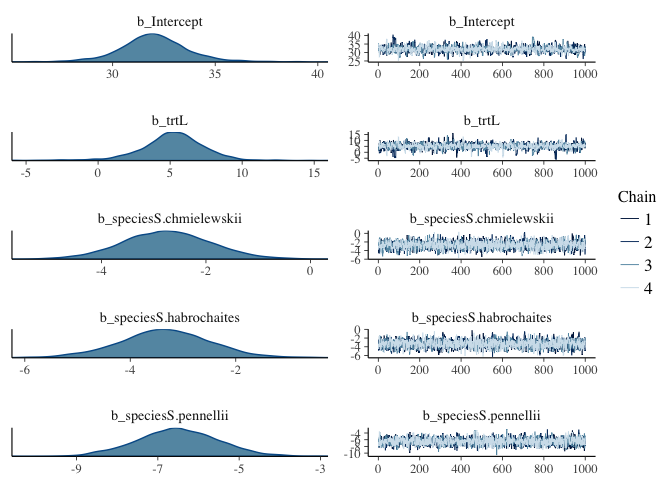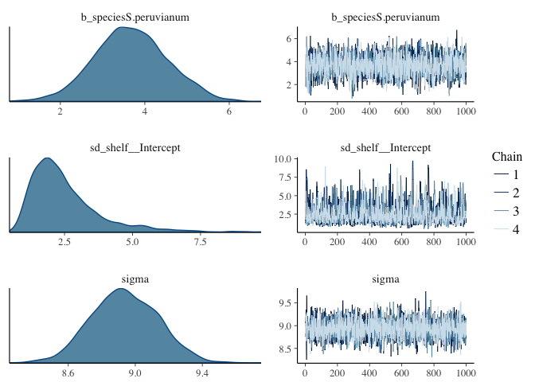

```r
# Note: the summary automatically display informative coeffecient names compare this to using "coerced index" in rethinking. 
```


```r
# Interactive model viewer 
launch_shiny(hyp1)
```

```
## 
## Creating shinystan object...
```

```
## 
## Launching ShinyStan interface... for large models this  may take some time.
```

```
## Loading required package: shiny
```

```
## Warning: package 'shiny' was built under R version 3.2.5
```

```
## 
## Listening on http://127.0.0.1:4246
```

# prior specification in brms 

```r
# brms will automatically set priors for many model parameters, but it uses non-sensical priors (uniform across all real numbers) for main-effect coefficients, so you must set priors for your main-effect coefficients. Most other priors have reasonable defaults.

# The function for setting priors is set_priors().
# 
# Priors in brms have different classes.
# 
# The "Intercept" class is for the overall intercept
# The "b" class is for coefficients on fixed effects (You can think of "b" as standing for "beta" coefficients)
# The "sigma" class is for the overall standard deviation. Defaults to student_t(3, 0, 10)
# The "sd" class is for the standard deviation of random effects terms. Defaults to student_t(3, 0, 10)
# If you want to give the same prior to all members of a class, then just name the class. In the example I gave above (repeated below) I am setting the priors for all beta coefficients in this case (trtL and the various species) to be normal(0,10).
# 
# hyp1 <- brm(hyp ~ trt + species + (1|shelf),
#             data = tomato,
#             prior = set_prior("normal(0,10)",class="b") # I'll explain setting priors in the next section
# ) 

# Multiple set_prior calls can be combined using c(). If you want to specify different priors for specific coefficients, then you can name them in separate set_prior calls:  
hyp2 <- brm(hyp ~ trt + species + (1|shelf),
            data = tomato,
            prior = c(set_prior("normal(0,10)",class="b"), # sets prior for all b coefficients not otherwise specified
                      set_prior("normal(0,5)",class="b", coef = "trtL")) #sets a different prior for the "trtL" coefficient  
) 
```

```
## Compiling the C++ model
```

```
## Start sampling
```

```
## Warning: There were 3 divergent transitions after warmup. Increasing adapt_delta above 0.8 may help. See
## http://mc-stan.org/misc/warnings.html#divergent-transitions-after-warmup
```

```
## Warning: Examine the pairs() plot to diagnose sampling problems
```

```r
# To see all priors that you could specify for a given model and how they are specified, use get_prior()
get_prior(hyp ~ trt + species + (1|shelf),
          data = tomato)
```

```
##                  prior     class                  coef group nlpar bound
## 1                              b                                        
## 2                              b             Intercept                  
## 3                              b speciesS.chmielewskii                  
## 4                              b speciesS.habrochaites                  
## 5                              b    speciesS.pennellii                  
## 6                              b   speciesS.peruvianum                  
## 7                              b                  trtL                  
## 8                      Intercept                                        
## 9  student_t(3, 0, 10)        sd                                        
## 10                            sd                       shelf            
## 11                            sd             Intercept shelf            
## 12 student_t(3, 0, 10)     sigma
```

```r
# For a model you have already fit you can see how the priors were set with:
hyp2$prior
```

```
##                  prior class                  coef group nlpar bound
## 1         normal(0,10)     b                                        
## 2                          b speciesS.chmielewskii                  
## 3                          b speciesS.habrochaites                  
## 4                          b    speciesS.pennellii                  
## 5                          b   speciesS.peruvianum                  
## 6          normal(0,5)     b                  trtL                  
## 7  student_t(3, 0, 10)    sd                                        
## 8                         sd                       shelf            
## 9                         sd             Intercept shelf            
## 10 student_t(3, 0, 10) sigma                                        
## 11                      temp             Intercept
```

```r
# Example of setting priors similar to Statistical Rethinking:
hyp3 <- brm(hyp ~ trt + species + (1|shelf),
            data = tomato,
            prior = c(
              set_prior("normal(33,10)",class="Intercept"), # prior for the intercept
              set_prior("normal(0,10)",class="b"), # sets prior for all b coefficients not otherwise specified
              set_prior("normal(0,5)",class="b", coef = "trtL"), #set prior for "trtL"
              set_prior("cauchy(0,1)", class = "sigma"), #half cauchy prior for sigma
              set_prior("normal(0,1)", class = "sd", group = "shelf") #prior for variation due to shelf
            ) 
)
```

```
## Compiling the C++ model
## Start sampling
```

```r
# More information can be found in section 4 of vignette("brms_overview") or by ?set_prior
?set_prior
```

# stan parameters 

```r
# You can specify various Stan parameters similar to the way you would in map2stan: 
hyp4 <- brm(hyp ~ trt + species + (1|shelf),
            data = tomato,
            prior = set_prior("normal(0,10)",class="b"), 
            chains = 4, #the default anyway
            iter=4000,
            warmup = 1000,
            cores = 2
)
```

```
## Compiling the C++ model
```

```
## Start sampling
```

```
## Warning: There were 9 divergent transitions after warmup. Increasing adapt_delta above 0.8 may help. See
## http://mc-stan.org/misc/warnings.html#divergent-transitions-after-warmup
```

```
## Warning: Examine the pairs() plot to diagnose sampling problems
```

```r
summary(hyp4)
```

```
##  Family: gaussian (identity) 
## Formula: hyp ~ trt + species + (1 | shelf) 
##    Data: tomato (Number of observations: 1008) 
## Samples: 4 chains, each with iter = 4000; warmup = 1000; thin = 1; 
##          total post-warmup samples = 12000
##    WAIC: Not computed
##  
## Group-Level Effects: 
## ~shelf (Number of levels: 6) 
##               Estimate Est.Error l-95% CI u-95% CI Eff.Sample Rhat
## sd(Intercept)     2.51      1.28     0.97     6.01       2180    1
## 
## Population-Level Effects: 
##                       Estimate Est.Error l-95% CI u-95% CI Eff.Sample Rhat
## Intercept                32.06      1.68    28.70    35.53       4086    1
## trtL                      5.12      2.24     0.03     9.31       3514    1
## speciesS.chmielewskii    -2.73      0.86    -4.41    -1.04       8302    1
## speciesS.habrochaites    -3.35      0.85    -5.05    -1.68       8149    1
## speciesS.pennellii       -6.53      1.00    -8.47    -4.56       8960    1
## speciesS.peruvianum       3.67      0.86     1.98     5.35       8173    1
## 
## Family Specific Parameters: 
##       Estimate Est.Error l-95% CI u-95% CI Eff.Sample Rhat
## sigma     8.93       0.2     8.55     9.33      10851    1
## 
## Samples were drawn using sampling(NUTS). For each parameter, Eff.Sample 
## is a crude measure of effective sample size, and Rhat is the potential 
## scale reduction factor on split chains (at convergence, Rhat = 1).
```

```r
plot(hyp4) 
```

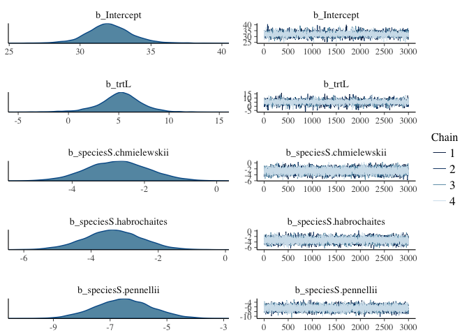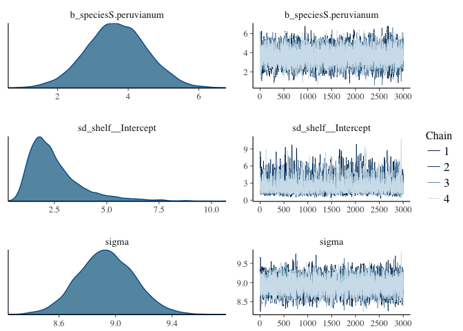

# interactions 

```r
# To specify interactions between predictors just replace the '+' with a '*': 
hyp5 <- brm(hyp ~ trt * species + (1|shelf), #trt by species interaction
            data = tomato,
            prior = set_prior("normal(0,10)",class="b")
)
```

```
## Compiling the C++ model
```

```
## Start sampling
```

```
## Warning: There were 281 divergent transitions after warmup. Increasing adapt_delta above 0.8 may help. See
## http://mc-stan.org/misc/warnings.html#divergent-transitions-after-warmup
```

```
## Warning: Examine the pairs() plot to diagnose sampling problems
```

```r
summary(hyp5)
```

```
## Warning: The model has not converged (some Rhats are > 1.1). Do not analyse the results! 
## We recommend running more iterations and/or setting stronger priors.
```

```
##  Family: gaussian (identity) 
## Formula: hyp ~ trt * species + (1 | shelf) 
##    Data: tomato (Number of observations: 1008) 
## Samples: 4 chains, each with iter = 2000; warmup = 1000; thin = 1; 
##          total post-warmup samples = 4000
##    WAIC: Not computed
##  
## Group-Level Effects: 
## ~shelf (Number of levels: 6) 
##               Estimate Est.Error l-95% CI u-95% CI Eff.Sample Rhat
## sd(Intercept)     3.16      2.01     1.07     8.52         29 1.08
## 
## Population-Level Effects: 
##                            Estimate Est.Error l-95% CI u-95% CI Eff.Sample
## Intercept                     32.97      4.00    28.34    43.42         12
## trtL                           4.62      4.81    -8.12    10.80         13
## speciesS.chmielewskii         -1.19      1.19    -3.35     1.17         95
## speciesS.habrochaites         -2.27      1.25    -4.85     0.18         52
## speciesS.pennellii            -9.02      1.98   -13.43    -5.69         18
## speciesS.peruvianum            3.44      1.33     0.77     5.90         35
## trtL:speciesS.chmielewskii    -3.03      1.70    -6.33     0.09         67
## trtL:speciesS.habrochaites    -2.32      1.83    -5.76     1.07         39
## trtL:speciesS.pennellii        4.15      2.61    -0.25    10.00         19
## trtL:speciesS.peruvianum       0.41      1.96    -3.03     4.38         25
##                            Rhat
## Intercept                  1.26
## trtL                       1.23
## speciesS.chmielewskii      1.03
## speciesS.habrochaites      1.04
## speciesS.pennellii         1.15
## speciesS.peruvianum        1.07
## trtL:speciesS.chmielewskii 1.04
## trtL:speciesS.habrochaites 1.06
## trtL:speciesS.pennellii    1.14
## trtL:speciesS.peruvianum   1.10
## 
## Family Specific Parameters: 
##       Estimate Est.Error l-95% CI u-95% CI Eff.Sample Rhat
## sigma      8.9      0.21     8.49      9.3         71 1.03
## 
## Samples were drawn using sampling(NUTS). For each parameter, Eff.Sample 
## is a crude measure of effective sample size, and Rhat is the potential 
## scale reduction factor on split chains (at convergence, Rhat = 1).
```

```r
plot(hyp5, ask=FALSE)
```

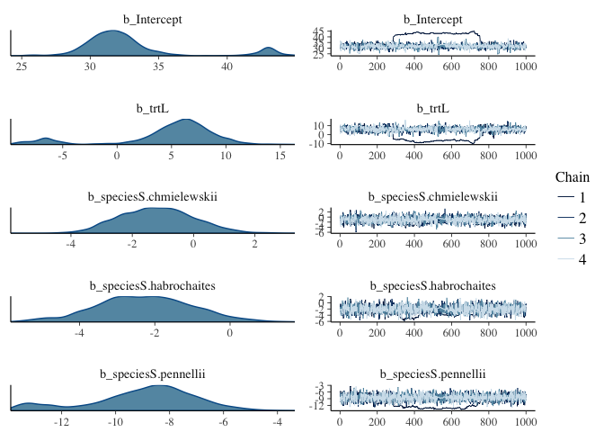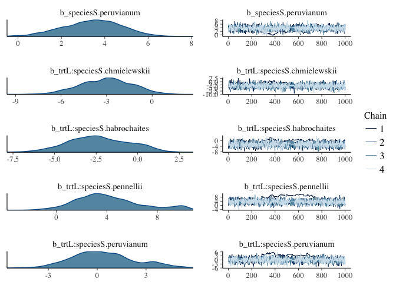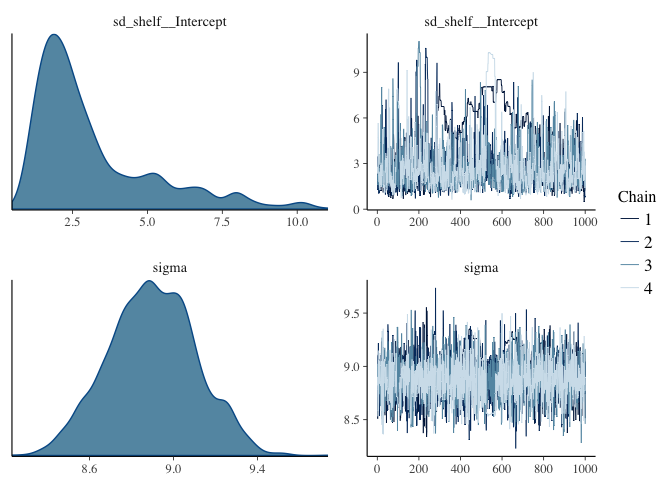

# compare models 

```r
# models can be compared using WAIC or another procedures, leave one out cross validataion, using loo: 
waic(hyp1, hyp5)
```

```
##                WAIC    SE
## hyp1        7286.25 57.80
## hyp5        7278.39 57.79
## hyp1 - hyp5    7.87  7.23
```

```r
loo(hyp1, hyp5)
```

```
##               LOOIC    SE
## hyp1        7286.25 57.80
## hyp5        7278.38 57.79
## hyp1 - hyp5    7.87  7.23
```

```r
# so hyp5 is favored, but not by much. 
# Julin is not sure how to do the model weighting that rethinking can report when comparing models. 
```

# unique intercept 

```r
# In map2stan we saw how to fit models where each level of a predictor had its own intercept. In brms including a "0" tells brms to fit a separate interecept for each level of the following predictor.

# For example, if we used the default of hyp ~ trt + species then the intercept would correspond to the first level of trt and the first level of species. That is, the intercept would be for speciesS.chillense in trtH.

# If instead we used hyp ~ 0 + trt + species then there is a separate intercept for each species in trtH

hyp6 <- brm(hyp ~ species + trt,
            prior = set_prior("normal(0,10)",class="b"),
            data = tomato)
```

```
## Compiling the C++ model
```

```
## Start sampling
```

```r
hyp7 <- brm(hyp ~ 0 + species + trt,
            prior = c(
              set_prior("normal(33,10)", class = "b"), #average species height
              set_prior("normal(0,10)", class = "b", coef = "trtL")
              ),
            data=tomato)
```

```
## Compiling the C++ model
## Start sampling
```

```r
# compare the summaries 
summary(hyp6)
```

```
##  Family: gaussian (identity) 
## Formula: hyp ~ species + trt 
##    Data: tomato (Number of observations: 1008) 
## Samples: 4 chains, each with iter = 2000; warmup = 1000; thin = 1; 
##          total post-warmup samples = 4000
##    WAIC: Not computed
##  
## Population-Level Effects: 
##                       Estimate Est.Error l-95% CI u-95% CI Eff.Sample Rhat
## Intercept                32.02      0.69    30.73    33.39       2837    1
## speciesS.chmielewskii    -2.67      0.85    -4.37    -1.02       3008    1
## speciesS.habrochaites    -3.44      0.85    -5.12    -1.78       3109    1
## speciesS.pennellii       -6.11      1.00    -8.08    -4.22       3507    1
## speciesS.peruvianum       3.74      0.88     2.00     5.41       3339    1
## trtL                      5.30      0.57     4.17     6.44       4000    1
## 
## Family Specific Parameters: 
##       Estimate Est.Error l-95% CI u-95% CI Eff.Sample Rhat
## sigma     9.06       0.2     8.69     9.47       4000    1
## 
## Samples were drawn using sampling(NUTS). For each parameter, Eff.Sample 
## is a crude measure of effective sample size, and Rhat is the potential 
## scale reduction factor on split chains (at convergence, Rhat = 1).
```

```r
summary(hyp7)
```

```
##  Family: gaussian (identity) 
## Formula: hyp ~ 0 + species + trt 
##    Data: tomato (Number of observations: 1008) 
## Samples: 4 chains, each with iter = 2000; warmup = 1000; thin = 1; 
##          total post-warmup samples = 4000
##    WAIC: Not computed
##  
## Population-Level Effects: 
##                       Estimate Est.Error l-95% CI u-95% CI Eff.Sample Rhat
## speciesS.chilense        32.09      0.69    30.75    33.45       4000    1
## speciesS.chmielewskii    29.35      0.68    28.05    30.71       4000    1
## speciesS.habrochaites    28.61      0.67    27.32    29.90       4000    1
## speciesS.pennellii       25.94      0.86    24.22    27.66       4000    1
## speciesS.peruvianum      35.78      0.68    34.44    37.12       4000    1
## trtL                      5.29      0.57     4.14     6.38       2895    1
## 
## Family Specific Parameters: 
##       Estimate Est.Error l-95% CI u-95% CI Eff.Sample Rhat
## sigma     9.05       0.2     8.67     9.45       4000    1
## 
## Samples were drawn using sampling(NUTS). For each parameter, Eff.Sample 
## is a crude measure of effective sample size, and Rhat is the potential 
## scale reduction factor on split chains (at convergence, Rhat = 1).
```

```r
loo(hyp6, hyp7)
```

```
##               LOOIC    SE
## hyp6        7309.07 57.46
## hyp7        7309.20 57.46
## hyp6 - hyp7   -0.13  0.23
```

```r
# which model is better? hyp6 or hyp7? 
```

# Binomial and other models 

```r
# To specify a non-Gaussian model use the family parameter in your call to brm. I will illustrate with Liron's germination data  

germination <- read.csv("../Assignment_Chapter_10/LironDataTime1.csv")
head(germination)
```

```
##   Time Temperature Plate.. Species Germination Root.length Shoot.length
## 1    1          22       1     M82         Yes        0.31         0.00
## 2    1          22       1     pen         Yes        1.36         0.23
## 3    1          22       1     M82         Yes        2.49         1.00
## 4    1          22       1     pen         Yes        1.77         0.86
## 5    1          22       1     M82          No        0.00         0.00
## 6    1          22       1     pen         Yes        1.62         1.13
```

```r
summary(germination)
```

```
##       Time    Temperature    Plate..    Species  Germination
##  Min.   :1   Min.   :14   Min.   :1.0   M82:60   No :38     
##  1st Qu.:1   1st Qu.:14   1st Qu.:2.0   pen:60   Yes:82     
##  Median :1   Median :18   Median :3.5                       
##  Mean   :1   Mean   :18   Mean   :3.5                       
##  3rd Qu.:1   3rd Qu.:22   3rd Qu.:5.0                       
##  Max.   :1   Max.   :22   Max.   :6.0                       
##   Root.length      Shoot.length   
##  Min.   :0.0000   Min.   :0.0000  
##  1st Qu.:0.0000   1st Qu.:0.0000  
##  Median :0.4650   Median :0.0000  
##  Mean   :0.6824   Mean   :0.2863  
##  3rd Qu.:1.1325   3rd Qu.:0.7025  
##  Max.   :2.9000   Max.   :1.5300
```

```r
head(germination)
```

```
##   Time Temperature Plate.. Species Germination Root.length Shoot.length
## 1    1          22       1     M82         Yes        0.31         0.00
## 2    1          22       1     pen         Yes        1.36         0.23
## 3    1          22       1     M82         Yes        2.49         1.00
## 4    1          22       1     pen         Yes        1.77         0.86
## 5    1          22       1     M82          No        0.00         0.00
## 6    1          22       1     pen         Yes        1.62         1.13
```

```r
germination$Germination2 <- ifelse(germination$Germination=="Yes",1,0) #need numeric response
germination$Temperature_b <- germination$Temperature - min(germination$Temperature) #baseline it

# The trials(1) in the formula below indicates how many trials per row in the data frame. Instead of a numeric this could also refer to a column in the data frame (if a column specified the number of trials represented in each row).

germ1 <- brm(Germination2 | trials(1) ~ Species + Temperature_b,
             family = "binomial",
             prior=set_prior("normal(0,10)", class="b"),
             data = germination
             )
```

```
## Only 2 levels detected so that family 'bernoulli' might be a more efficient choice.
```

```
## Compiling the C++ model
```

```
## Start sampling
```

```
## Only 2 levels detected so that family 'bernoulli' might be a more efficient choice.
```

```r
summary(germ1)
```

```
##  Family: binomial (logit) 
## Formula: Germination2 | trials(1) ~ Species + Temperature_b 
##    Data: germination (Number of observations: 120) 
## Samples: 4 chains, each with iter = 2000; warmup = 1000; thin = 1; 
##          total post-warmup samples = 4000
##    WAIC: Not computed
##  
## Population-Level Effects: 
##               Estimate Est.Error l-95% CI u-95% CI Eff.Sample Rhat
## Intercept        -0.60      0.36    -1.31     0.10       4000    1
## Speciespen        1.35      0.46     0.45     2.26       4000    1
## Temperature_b     0.24      0.06     0.12     0.36       4000    1
## 
## Samples were drawn using sampling(NUTS). For each parameter, Eff.Sample 
## is a crude measure of effective sample size, and Rhat is the potential 
## scale reduction factor on split chains (at convergence, Rhat = 1).
```

```r
plot(germ1, ask=FALSE)
```

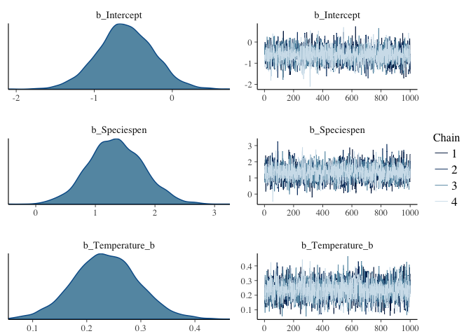

```r
# 
# Note: I did not have to specify the link function, logit is automatically used as a link function.
# 
# Available families (and their link functions) are described by typing ?family and ?brmsfamily
# 
# You will note that there was a message that "that family 'bernoulli' might be a more efficient choice." The Bernoulli family is specific for binomial problems where each row of data corresponds to a single trial, so in this case we could have used the code below, which indeed does run faster. 

germ2 <- brm(Germination2  ~ Species + Temperature_b,
             family = "bernoulli",
             prior=set_prior("normal(0,10)", class="b"),
             data = germination
             )
```

```
## Compiling the C++ model
```

```
## Start sampling
```

```r
summary(germ2)
```

```
##  Family: bernoulli (logit) 
## Formula: Germination2 ~ Species + Temperature_b 
##    Data: germination (Number of observations: 120) 
## Samples: 4 chains, each with iter = 2000; warmup = 1000; thin = 1; 
##          total post-warmup samples = 4000
##    WAIC: Not computed
##  
## Population-Level Effects: 
##               Estimate Est.Error l-95% CI u-95% CI Eff.Sample Rhat
## Intercept        -0.60      0.36    -1.33     0.06       4000    1
## Speciespen        1.35      0.47     0.45     2.29       4000    1
## Temperature_b     0.24      0.06     0.12     0.35       4000    1
## 
## Samples were drawn using sampling(NUTS). For each parameter, Eff.Sample 
## is a crude measure of effective sample size, and Rhat is the potential 
## scale reduction factor on split chains (at convergence, Rhat = 1).
```

```r
plot(germ2, ask=FALSE)
```

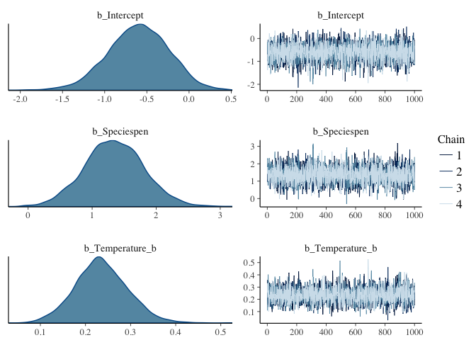

# hypothesis testing 

```r
# brms includes a function for Bayesian hypothesis testing. See below for an example of how to test if the effect of "trtL" is non-zero (two-sided hypothesis test). Plotting the hypothesis test shows the relevant posterior distributions.

summary(hyp1)
```

```
##  Family: gaussian (identity) 
## Formula: hyp ~ trt + species + (1 | shelf) 
##    Data: tomato (Number of observations: 1008) 
## Samples: 4 chains, each with iter = 2000; warmup = 1000; thin = 1; 
##          total post-warmup samples = 4000
##    WAIC: Not computed
##  
## Group-Level Effects: 
## ~shelf (Number of levels: 6) 
##               Estimate Est.Error l-95% CI u-95% CI Eff.Sample Rhat
## sd(Intercept)      2.5      1.27     0.98      5.9       1087 1.01
## 
## Population-Level Effects: 
##                       Estimate Est.Error l-95% CI u-95% CI Eff.Sample Rhat
## Intercept                32.03      1.70    28.60    35.63       1253    1
## trtL                      5.17      2.29     0.01     9.26       1216    1
## speciesS.chmielewskii    -2.74      0.84    -4.40    -1.07       2758    1
## speciesS.habrochaites    -3.34      0.86    -5.08    -1.66       2884    1
## speciesS.pennellii       -6.51      0.99    -8.46    -4.59       3094    1
## speciesS.peruvianum       3.68      0.86     2.02     5.36       2903    1
## 
## Family Specific Parameters: 
##       Estimate Est.Error l-95% CI u-95% CI Eff.Sample Rhat
## sigma     8.94       0.2     8.56     9.32       3912    1
## 
## Samples were drawn using sampling(NUTS). For each parameter, Eff.Sample 
## is a crude measure of effective sample size, and Rhat is the potential 
## scale reduction factor on split chains (at convergence, Rhat = 1).
```

```r
hypothesis(hyp1, "trtL=0")
```

```
## Hypothesis Tests for class b:
##            Estimate Est.Error l-95% CI u-95% CI Evid.Ratio  
## (trtL) = 0     5.17      2.29     0.01     9.26         NA *
## ---
## '*': The expected value under the hypothesis lies outside the 95% CI.
```

```r
plot(hypothesis(hyp1, "trtL=0"))
```

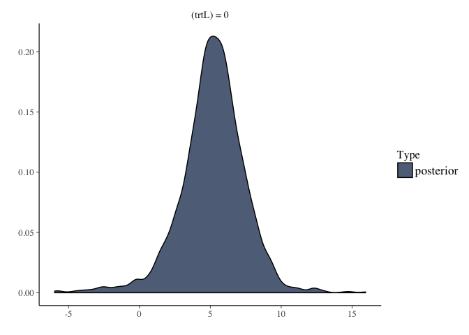

```r
# have effect or no??? 
# To test if the effect of "trtL" is positive (one-sided hypothesis test):
summary(hyp1)
```

```
##  Family: gaussian (identity) 
## Formula: hyp ~ trt + species + (1 | shelf) 
##    Data: tomato (Number of observations: 1008) 
## Samples: 4 chains, each with iter = 2000; warmup = 1000; thin = 1; 
##          total post-warmup samples = 4000
##    WAIC: Not computed
##  
## Group-Level Effects: 
## ~shelf (Number of levels: 6) 
##               Estimate Est.Error l-95% CI u-95% CI Eff.Sample Rhat
## sd(Intercept)      2.5      1.27     0.98      5.9       1087 1.01
## 
## Population-Level Effects: 
##                       Estimate Est.Error l-95% CI u-95% CI Eff.Sample Rhat
## Intercept                32.03      1.70    28.60    35.63       1253    1
## trtL                      5.17      2.29     0.01     9.26       1216    1
## speciesS.chmielewskii    -2.74      0.84    -4.40    -1.07       2758    1
## speciesS.habrochaites    -3.34      0.86    -5.08    -1.66       2884    1
## speciesS.pennellii       -6.51      0.99    -8.46    -4.59       3094    1
## speciesS.peruvianum       3.68      0.86     2.02     5.36       2903    1
## 
## Family Specific Parameters: 
##       Estimate Est.Error l-95% CI u-95% CI Eff.Sample Rhat
## sigma     8.94       0.2     8.56     9.32       3912    1
## 
## Samples were drawn using sampling(NUTS). For each parameter, Eff.Sample 
## is a crude measure of effective sample size, and Rhat is the potential 
## scale reduction factor on split chains (at convergence, Rhat = 1).
```

```r
hypothesis(hyp1, "trtL>0")
```

```
## Hypothesis Tests for class b:
##            Estimate Est.Error l-95% CI u-95% CI Evid.Ratio  
## (trtL) > 0     5.17      2.29     1.43      Inf         39 *
## ---
## '*': The expected value under the hypothesis lies outside the 95% CI.
```

```r
plot(hypothesis(hyp1, "trtL>0"))
```


```r
# YES??? 
# To test if the coefficients for S.pennellii and S.habrochaites are different:
hypothesis(hyp1, "speciesS.pennellii-speciesS.habrochaites = 0")
```

```
## Hypothesis Tests for class b:
##                          Estimate Est.Error l-95% CI u-95% CI Evid.Ratio  
## (speciesS.pennell... = 0    -3.16      1.01    -5.13    -1.22         NA *
## ---
## '*': The expected value under the hypothesis lies outside the 95% CI.
```

```r
plot(hypothesis(hyp1, "speciesS.pennellii-speciesS.habrochaites = 0"))
```

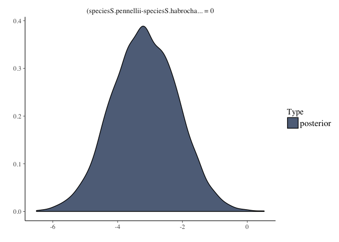

```r
# YES??? 
```


