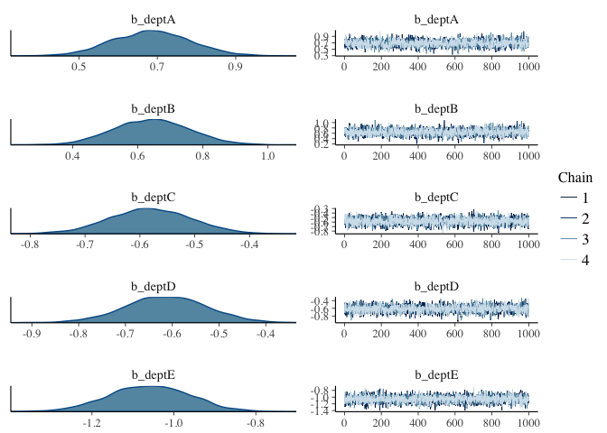
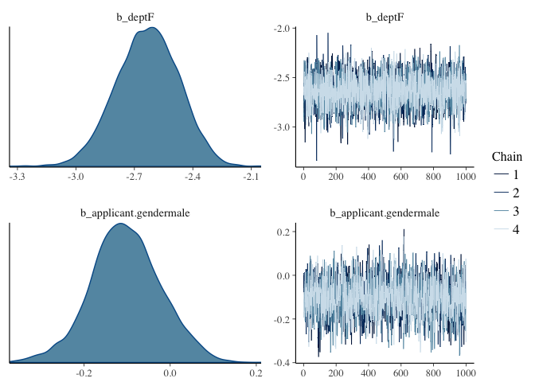
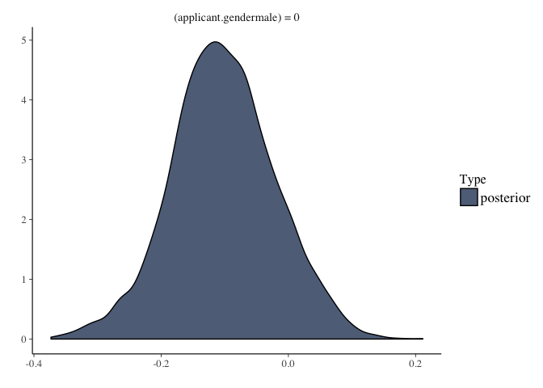
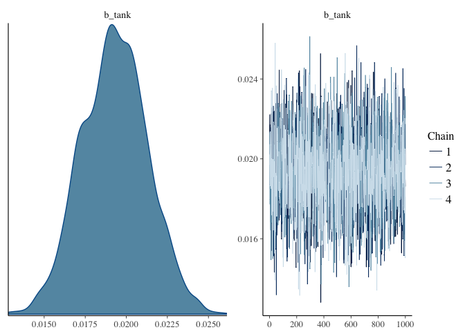
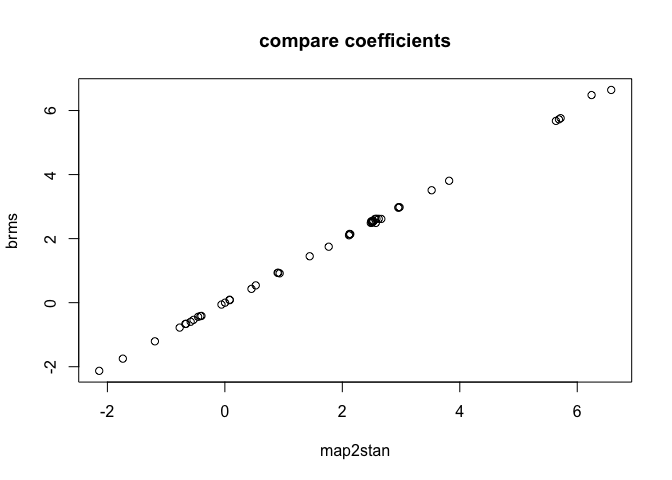
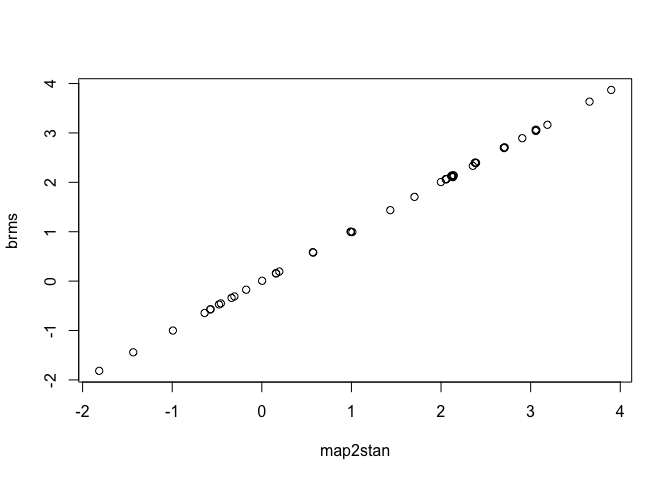

# Assignment_01_06_2017_homework
Ruijuan Li  
1/6/2017  

# Exercises

```r
# To gain familiarity with brms I am going to have you refit models from Statistical Rethinking with brms. In all cases compare the brms and map2stan parameter estimates; they should be effectively the same if you have specified them correctly.
```

# Q1

```r
# Fit model 10.9 (R code 10.28) with brms. Remember that you should not need to transform the predictors, create dummy variables, nor coerce indexes to use brms. Compare to the map2stan fit. Test whether the coefficient for gender is different from 0 in the brms model.

library(rethinking)
```

```
## Loading required package: rstan
```

```
## Warning: package 'rstan' was built under R version 3.2.5
```

```
## Loading required package: ggplot2
```

```
## Warning: package 'ggplot2' was built under R version 3.2.5
```

```
## Loading required package: StanHeaders
```

```
## Warning: package 'StanHeaders' was built under R version 3.2.5
```

```
## rstan (Version 2.14.1, packaged: 2016-12-28 14:55:41 UTC, GitRev: 5fa1e80eb817)
```

```
## For execution on a local, multicore CPU with excess RAM we recommend calling
## rstan_options(auto_write = TRUE)
## options(mc.cores = parallel::detectCores())
```

```
## Loading required package: parallel
```

```
## rethinking (Version 1.59)
```

```r
data("UCBadmit")
d <- UCBadmit
head(d)
```

```
##   dept applicant.gender admit reject applications
## 1    A             male   512    313          825
## 2    A           female    89     19          108
## 3    B             male   353    207          560
## 4    B           female    17      8           25
## 5    C             male   120    205          325
## 6    C           female   202    391          593
```

```r
# R code 10.28 
# make index, transform predictors 
d$male <- ifelse( d$applicant.gender=="male" , 1 , 0 ) # create dummy variables 
d$dept_id <- coerce_index(d$dept) # coerce_index 
d$dept_id
```

```
##  [1] 1 1 2 2 3 3 4 4 5 5 6 6
```

```r
?coerce_index
head(d)
```

```
##   dept applicant.gender admit reject applications male dept_id
## 1    A             male   512    313          825    1       1
## 2    A           female    89     19          108    0       1
## 3    B             male   353    207          560    1       2
## 4    B           female    17      8           25    0       2
## 5    C             male   120    205          325    1       3
## 6    C           female   202    391          593    0       3
```

```r
# model with unique intercept for each dept
# model with male differneces as well 
m10.9 <- map2stan(
  alist(
    admit ~ dbinom(applications, p), 
    logit(p) <- a[dept_id] + bm*male, # unique intercept for each dept, with gender difference as well 
    a[dept_id] ~ dnorm(0, 10), 
    bm ~ dnorm(0, 10)
  ), data = d,
  chains = 4, warmup = 1000, iter = 4000)
```

```
## Warning: Variable 'applicant.gender' contains dots '.'.
## Will attempt to remove dots internally.
```

```
## In file included from filea2077c809e5b.cpp:8:
## In file included from /Library/Frameworks/R.framework/Versions/3.2/Resources/library/StanHeaders/include/src/stan/model/model_header.hpp:4:
## In file included from /Library/Frameworks/R.framework/Versions/3.2/Resources/library/StanHeaders/include/stan/math.hpp:4:
## In file included from /Library/Frameworks/R.framework/Versions/3.2/Resources/library/StanHeaders/include/stan/math/rev/mat.hpp:4:
## In file included from /Library/Frameworks/R.framework/Versions/3.2/Resources/library/StanHeaders/include/stan/math/rev/core.hpp:12:
## In file included from /Library/Frameworks/R.framework/Versions/3.2/Resources/library/StanHeaders/include/stan/math/rev/core/gevv_vvv_vari.hpp:5:
## In file included from /Library/Frameworks/R.framework/Versions/3.2/Resources/library/StanHeaders/include/stan/math/rev/core/var.hpp:7:
## In file included from /Library/Frameworks/R.framework/Versions/3.2/Resources/library/BH/include/boost/math/tools/config.hpp:13:
## In file included from /Library/Frameworks/R.framework/Versions/3.2/Resources/library/BH/include/boost/config.hpp:39:
## /Library/Frameworks/R.framework/Versions/3.2/Resources/library/BH/include/boost/config/compiler/clang.hpp:196:11: warning: 'BOOST_NO_CXX11_RVALUE_REFERENCES' macro redefined [-Wmacro-redefined]
## #  define BOOST_NO_CXX11_RVALUE_REFERENCES
##           ^
## <command line>:6:9: note: previous definition is here
## #define BOOST_NO_CXX11_RVALUE_REFERENCES 1
##         ^
## In file included from filea2077c809e5b.cpp:8:
## In file included from /Library/Frameworks/R.framework/Versions/3.2/Resources/library/StanHeaders/include/src/stan/model/model_header.hpp:4:
## In file included from /Library/Frameworks/R.framework/Versions/3.2/Resources/library/StanHeaders/include/stan/math.hpp:4:
## In file included from /Library/Frameworks/R.framework/Versions/3.2/Resources/library/StanHeaders/include/stan/math/rev/mat.hpp:4:
## In file included from /Library/Frameworks/R.framework/Versions/3.2/Resources/library/StanHeaders/include/stan/math/rev/core.hpp:42:
## /Library/Frameworks/R.framework/Versions/3.2/Resources/library/StanHeaders/include/stan/math/rev/core/set_zero_all_adjoints.hpp:14:17: warning: unused function 'set_zero_all_adjoints' [-Wunused-function]
##     static void set_zero_all_adjoints() {
##                 ^
## In file included from filea2077c809e5b.cpp:8:
## In file included from /Library/Frameworks/R.framework/Versions/3.2/Resources/library/StanHeaders/include/src/stan/model/model_header.hpp:4:
## In file included from /Library/Frameworks/R.framework/Versions/3.2/Resources/library/StanHeaders/include/stan/math.hpp:4:
## In file included from /Library/Frameworks/R.framework/Versions/3.2/Resources/library/StanHeaders/include/stan/math/rev/mat.hpp:4:
## In file included from /Library/Frameworks/R.framework/Versions/3.2/Resources/library/StanHeaders/include/stan/math/rev/core.hpp:43:
## /Library/Frameworks/R.framework/Versions/3.2/Resources/library/StanHeaders/include/stan/math/rev/core/set_zero_all_adjoints_nested.hpp:17:17: warning: 'static' function 'set_zero_all_adjoints_nested' declared in header file should be declared 'static inline' [-Wunneeded-internal-declaration]
##     static void set_zero_all_adjoints_nested() {
##                 ^
## In file included from filea2077c809e5b.cpp:8:
## In file included from /Library/Frameworks/R.framework/Versions/3.2/Resources/library/StanHeaders/include/src/stan/model/model_header.hpp:4:
## In file included from /Library/Frameworks/R.framework/Versions/3.2/Resources/library/StanHeaders/include/stan/math.hpp:4:
## In file included from /Library/Frameworks/R.framework/Versions/3.2/Resources/library/StanHeaders/include/stan/math/rev/mat.hpp:11:
## In file included from /Library/Frameworks/R.framework/Versions/3.2/Resources/library/StanHeaders/include/stan/math/prim/mat.hpp:60:
## /Library/Frameworks/R.framework/Versions/3.2/Resources/library/StanHeaders/include/stan/math/prim/mat/fun/autocorrelation.hpp:17:14: warning: function 'fft_next_good_size' is not needed and will not be emitted [-Wunneeded-internal-declaration]
##       size_t fft_next_good_size(size_t N) {
##              ^
## In file included from filea2077c809e5b.cpp:8:
## In file included from /Library/Frameworks/R.framework/Versions/3.2/Resources/library/StanHeaders/include/src/stan/model/model_header.hpp:4:
## In file included from /Library/Frameworks/R.framework/Versions/3.2/Resources/library/StanHeaders/include/stan/math.hpp:4:
## In file included from /Library/Frameworks/R.framework/Versions/3.2/Resources/library/StanHeaders/include/stan/math/rev/mat.hpp:11:
## In file included from /Library/Frameworks/R.framework/Versions/3.2/Resources/library/StanHeaders/include/stan/math/prim/mat.hpp:299:
## In file included from /Library/Frameworks/R.framework/Versions/3.2/Resources/library/StanHeaders/include/stan/math/prim/arr.hpp:36:
## In file included from /Library/Frameworks/R.framework/Versions/3.2/Resources/library/StanHeaders/include/stan/math/prim/arr/functor/integrate_ode_rk45.hpp:13:
## In file included from /Library/Frameworks/R.framework/Versions/3.2/Resources/library/BH/include/boost/numeric/odeint.hpp:61:
## In file included from /Library/Frameworks/R.framework/Versions/3.2/Resources/library/BH/include/boost/numeric/odeint/util/multi_array_adaption.hpp:29:
## In file included from /Library/Frameworks/R.framework/Versions/3.2/Resources/library/BH/include/boost/multi_array.hpp:21:
## In file included from /Library/Frameworks/R.framework/Versions/3.2/Resources/library/BH/include/boost/multi_array/base.hpp:28:
## /Library/Frameworks/R.framework/Versions/3.2/Resources/library/BH/include/boost/multi_array/concept_checks.hpp:42:43: warning: unused typedef 'index_range' [-Wunused-local-typedef]
##       typedef typename Array::index_range index_range;
##                                           ^
## /Library/Frameworks/R.framework/Versions/3.2/Resources/library/BH/include/boost/multi_array/concept_checks.hpp:43:37: warning: unused typedef 'index' [-Wunused-local-typedef]
##       typedef typename Array::index index;
##                                     ^
## /Library/Frameworks/R.framework/Versions/3.2/Resources/library/BH/include/boost/multi_array/concept_checks.hpp:53:43: warning: unused typedef 'index_range' [-Wunused-local-typedef]
##       typedef typename Array::index_range index_range;
##                                           ^
## /Library/Frameworks/R.framework/Versions/3.2/Resources/library/BH/include/boost/multi_array/concept_checks.hpp:54:37: warning: unused typedef 'index' [-Wunused-local-typedef]
##       typedef typename Array::index index;
##                                     ^
## 8 warnings generated.
## 
## SAMPLING FOR MODEL 'admit ~ dbinom(applications, p)' NOW (CHAIN 1).
## 
## Chain 1, Iteration:    1 / 4000 [  0%]  (Warmup)
## Chain 1, Iteration:  400 / 4000 [ 10%]  (Warmup)
## Chain 1, Iteration:  800 / 4000 [ 20%]  (Warmup)
## Chain 1, Iteration: 1001 / 4000 [ 25%]  (Sampling)
## Chain 1, Iteration: 1400 / 4000 [ 35%]  (Sampling)
## Chain 1, Iteration: 1800 / 4000 [ 45%]  (Sampling)
## Chain 1, Iteration: 2200 / 4000 [ 55%]  (Sampling)
## Chain 1, Iteration: 2600 / 4000 [ 65%]  (Sampling)
## Chain 1, Iteration: 3000 / 4000 [ 75%]  (Sampling)
## Chain 1, Iteration: 3400 / 4000 [ 85%]  (Sampling)
## Chain 1, Iteration: 3800 / 4000 [ 95%]  (Sampling)
## Chain 1, Iteration: 4000 / 4000 [100%]  (Sampling)
##  Elapsed Time: 0.063051 seconds (Warm-up)
##                0.15758 seconds (Sampling)
##                0.220631 seconds (Total)
## 
## 
## SAMPLING FOR MODEL 'admit ~ dbinom(applications, p)' NOW (CHAIN 2).
## 
## Chain 2, Iteration:    1 / 4000 [  0%]  (Warmup)
## Chain 2, Iteration:  400 / 4000 [ 10%]  (Warmup)
## Chain 2, Iteration:  800 / 4000 [ 20%]  (Warmup)
## Chain 2, Iteration: 1001 / 4000 [ 25%]  (Sampling)
## Chain 2, Iteration: 1400 / 4000 [ 35%]  (Sampling)
## Chain 2, Iteration: 1800 / 4000 [ 45%]  (Sampling)
## Chain 2, Iteration: 2200 / 4000 [ 55%]  (Sampling)
## Chain 2, Iteration: 2600 / 4000 [ 65%]  (Sampling)
## Chain 2, Iteration: 3000 / 4000 [ 75%]  (Sampling)
## Chain 2, Iteration: 3400 / 4000 [ 85%]  (Sampling)
## Chain 2, Iteration: 3800 / 4000 [ 95%]  (Sampling)
## Chain 2, Iteration: 4000 / 4000 [100%]  (Sampling)
##  Elapsed Time: 0.055954 seconds (Warm-up)
##                0.164656 seconds (Sampling)
##                0.22061 seconds (Total)
## 
## 
## SAMPLING FOR MODEL 'admit ~ dbinom(applications, p)' NOW (CHAIN 3).
## 
## Chain 3, Iteration:    1 / 4000 [  0%]  (Warmup)
## Chain 3, Iteration:  400 / 4000 [ 10%]  (Warmup)
## Chain 3, Iteration:  800 / 4000 [ 20%]  (Warmup)
## Chain 3, Iteration: 1001 / 4000 [ 25%]  (Sampling)
## Chain 3, Iteration: 1400 / 4000 [ 35%]  (Sampling)
## Chain 3, Iteration: 1800 / 4000 [ 45%]  (Sampling)
## Chain 3, Iteration: 2200 / 4000 [ 55%]  (Sampling)
## Chain 3, Iteration: 2600 / 4000 [ 65%]  (Sampling)
## Chain 3, Iteration: 3000 / 4000 [ 75%]  (Sampling)
## Chain 3, Iteration: 3400 / 4000 [ 85%]  (Sampling)
## Chain 3, Iteration: 3800 / 4000 [ 95%]  (Sampling)
## Chain 3, Iteration: 4000 / 4000 [100%]  (Sampling)
##  Elapsed Time: 0.057054 seconds (Warm-up)
##                0.174376 seconds (Sampling)
##                0.23143 seconds (Total)
## 
## 
## SAMPLING FOR MODEL 'admit ~ dbinom(applications, p)' NOW (CHAIN 4).
## 
## Chain 4, Iteration:    1 / 4000 [  0%]  (Warmup)
## Chain 4, Iteration:  400 / 4000 [ 10%]  (Warmup)
## Chain 4, Iteration:  800 / 4000 [ 20%]  (Warmup)
## Chain 4, Iteration: 1001 / 4000 [ 25%]  (Sampling)
## Chain 4, Iteration: 1400 / 4000 [ 35%]  (Sampling)
## Chain 4, Iteration: 1800 / 4000 [ 45%]  (Sampling)
## Chain 4, Iteration: 2200 / 4000 [ 55%]  (Sampling)
## Chain 4, Iteration: 2600 / 4000 [ 65%]  (Sampling)
## Chain 4, Iteration: 3000 / 4000 [ 75%]  (Sampling)
## Chain 4, Iteration: 3400 / 4000 [ 85%]  (Sampling)
## Chain 4, Iteration: 3800 / 4000 [ 95%]  (Sampling)
## Chain 4, Iteration: 4000 / 4000 [100%]  (Sampling)
##  Elapsed Time: 0.060744 seconds (Warm-up)
##                0.155401 seconds (Sampling)
##                0.216145 seconds (Total)
## 
## 
## SAMPLING FOR MODEL 'admit ~ dbinom(applications, p)' NOW (CHAIN 1).
## WARNING: No variance estimation is
##          performed for num_warmup < 20
## 
## 
## Chain 1, Iteration: 1 / 1 [100%]  (Sampling)
##  Elapsed Time: 4e-06 seconds (Warm-up)
##                3.6e-05 seconds (Sampling)
##                4e-05 seconds (Total)
```

```
## Computing WAIC
```

```
## Constructing posterior predictions
```

```
## [ 1200 / 12000 ]
[ 2400 / 12000 ]
[ 3600 / 12000 ]
[ 4800 / 12000 ]
[ 6000 / 12000 ]
[ 7200 / 12000 ]
[ 8400 / 12000 ]
[ 9600 / 12000 ]
[ 10800 / 12000 ]
[ 12000 / 12000 ]
```

```
## Aggregated binomial counts detected. Splitting to 0/1 outcome for WAIC calculation.
```

```r
precis(m10.9, depth = 2)
```

```
##       Mean StdDev lower 0.89 upper 0.89 n_eff Rhat
## a[1]  0.68   0.10       0.52       0.84  7347    1
## a[2]  0.64   0.12       0.45       0.82  7564    1
## a[3] -0.58   0.07      -0.70      -0.46 12000    1
## a[4] -0.61   0.09      -0.75      -0.48 12000    1
## a[5] -1.06   0.10      -1.22      -0.91 12000    1
## a[6] -2.63   0.16      -2.88      -2.37 12000    1
## bm   -0.10   0.08      -0.22       0.03  6020    1
```

```r
# set up brms 
library(brms)
```

```
## Loading required package: Rcpp
```

```
## Warning: package 'Rcpp' was built under R version 3.2.5
```

```
## Loading 'brms' package (version 1.3.1.9000). Useful instructions 
## can be found by typing help('brms'). A more detailed introduction 
## to the package is available through vignette('brms_overview').
```

```
## 
## Attaching package: 'brms'
```

```
## The following objects are masked from 'package:rethinking':
## 
##     LOO, stancode, WAIC
```

```r
# don't understand the two below... just remember they are here for setup 
rstan_options(auto_write = TRUE) 
options(mc.cores = parallel::detectCores())
class(d$dept)
```

```
## [1] "factor"
```

```r
class(d$applicant.gender)
```

```
## [1] "factor"
```

```r
mQ1 <- brm(admit | trials(applications) ~ 0 + dept + applicant.gender, # unique intercept, don't need to transform, use orignial predictors in the data, applications is the trial number 
           family = "binomial",  # binomial because admit or not 
           prior = set_prior("normal(0, 10)", class = "b"), # same prior in the beta coeffecient class 
           data = d) 
```

```
## Compiling the C++ model
```

```
## Start sampling
```

```r
summary(mQ1)
```

```
##  Family: binomial (logit) 
## Formula: admit | trials(applications) ~ 0 + dept + applicant.gender 
##    Data: d (Number of observations: 12) 
## Samples: 4 chains, each with iter = 2000; warmup = 1000; thin = 1; 
##          total post-warmup samples = 4000
##    WAIC: Not computed
##  
## Population-Level Effects: 
##                      Estimate Est.Error l-95% CI u-95% CI Eff.Sample Rhat
## deptA                    0.69      0.10     0.49     0.88       2072    1
## deptB                    0.64      0.12     0.42     0.87       2297    1
## deptC                   -0.58      0.07    -0.73    -0.44       4000    1
## deptD                   -0.61      0.09    -0.78    -0.44       4000    1
## deptE                   -1.06      0.10    -1.25    -0.87       4000    1
## deptF                   -2.63      0.16    -2.95    -2.34       4000    1
## applicant.gendermale    -0.10      0.08    -0.27     0.06       1718    1
## 
## Samples were drawn using sampling(NUTS). For each parameter, Eff.Sample 
## is a crude measure of effective sample size, and Rhat is the potential 
## scale reduction factor on split chains (at convergence, Rhat = 1).
```

```r
precis(m10.9, depth = 2)
```

```
##       Mean StdDev lower 0.89 upper 0.89 n_eff Rhat
## a[1]  0.68   0.10       0.52       0.84  7347    1
## a[2]  0.64   0.12       0.45       0.82  7564    1
## a[3] -0.58   0.07      -0.70      -0.46 12000    1
## a[4] -0.61   0.09      -0.75      -0.48 12000    1
## a[5] -1.06   0.10      -1.22      -0.91 12000    1
## a[6] -2.63   0.16      -2.88      -2.37 12000    1
## bm   -0.10   0.08      -0.22       0.03  6020    1
```

```r
plot(mQ1, ask=FALSE) 
```



```r
# almost same coefficient 

# test the effect of gender 
hypothesis(mQ1, "applicant.gendermale = 0")
```

```
## Hypothesis Tests for class b:
##                          Estimate Est.Error l-95% CI u-95% CI Evid.Ratio 
## (applicant.gender... = 0     -0.1      0.08    -0.27     0.06         NA 
## ---
## '*': The expected value under the hypothesis lies outside the 95% CI.
```

```r
plot(hypothesis(mQ1, "applicant.gendermale = 0"))
```



```r
?hypothesis ### more understanding of this hypothesis function 
# no evidence of a gender effect 
```

# Q2

```r
# Refit models 12.1 and 12.2 (Rcode 12.2 and 12.3) with brms
data("reedfrogs")
d2 <- reedfrogs
head(d2)
```

```
##   density pred  size surv propsurv
## 1      10   no   big    9      0.9
## 2      10   no   big   10      1.0
## 3      10   no   big    7      0.7
## 4      10   no   big   10      1.0
## 5      10   no small    9      0.9
## 6      10   no small    9      0.9
```

```r
# transform the data 
d2$tank <- 1:nrow(d2)
class(d2$tank)
```

```
## [1] "integer"
```

```r
head(d2)
```

```
##   density pred  size surv propsurv tank
## 1      10   no   big    9      0.9    1
## 2      10   no   big   10      1.0    2
## 3      10   no   big    7      0.7    3
## 4      10   no   big   10      1.0    4
## 5      10   no small    9      0.9    5
## 6      10   no small    9      0.9    6
```

```r
d2$density
```

```
##  [1] 10 10 10 10 10 10 10 10 10 10 10 10 10 10 10 10 25 25 25 25 25 25 25
## [24] 25 25 25 25 25 25 25 25 25 35 35 35 35 35 35 35 35 35 35 35 35 35 35
## [47] 35 35
```

```r
# fit 
m12.1 <- map2stan(
  alist(
    surv ~ dbinom(density, p), # binomial model  
    logit(p) <- a_tank[tank], # unique intercept for each tank 
    a_tank[tank] ~ dnorm(0, 5)  
  ), data = d2)
```

```
## In file included from filea207b8366e3.cpp:8:
## In file included from /Library/Frameworks/R.framework/Versions/3.2/Resources/library/StanHeaders/include/src/stan/model/model_header.hpp:4:
## In file included from /Library/Frameworks/R.framework/Versions/3.2/Resources/library/StanHeaders/include/stan/math.hpp:4:
## In file included from /Library/Frameworks/R.framework/Versions/3.2/Resources/library/StanHeaders/include/stan/math/rev/mat.hpp:4:
## In file included from /Library/Frameworks/R.framework/Versions/3.2/Resources/library/StanHeaders/include/stan/math/rev/core.hpp:12:
## In file included from /Library/Frameworks/R.framework/Versions/3.2/Resources/library/StanHeaders/include/stan/math/rev/core/gevv_vvv_vari.hpp:5:
## In file included from /Library/Frameworks/R.framework/Versions/3.2/Resources/library/StanHeaders/include/stan/math/rev/core/var.hpp:7:
## In file included from /Library/Frameworks/R.framework/Versions/3.2/Resources/library/BH/include/boost/math/tools/config.hpp:13:
## In file included from /Library/Frameworks/R.framework/Versions/3.2/Resources/library/BH/include/boost/config.hpp:39:
## /Library/Frameworks/R.framework/Versions/3.2/Resources/library/BH/include/boost/config/compiler/clang.hpp:196:11: warning: 'BOOST_NO_CXX11_RVALUE_REFERENCES' macro redefined [-Wmacro-redefined]
## #  define BOOST_NO_CXX11_RVALUE_REFERENCES
##           ^
## <command line>:6:9: note: previous definition is here
## #define BOOST_NO_CXX11_RVALUE_REFERENCES 1
##         ^
## In file included from filea207b8366e3.cpp:8:
## In file included from /Library/Frameworks/R.framework/Versions/3.2/Resources/library/StanHeaders/include/src/stan/model/model_header.hpp:4:
## In file included from /Library/Frameworks/R.framework/Versions/3.2/Resources/library/StanHeaders/include/stan/math.hpp:4:
## In file included from /Library/Frameworks/R.framework/Versions/3.2/Resources/library/StanHeaders/include/stan/math/rev/mat.hpp:4:
## In file included from /Library/Frameworks/R.framework/Versions/3.2/Resources/library/StanHeaders/include/stan/math/rev/core.hpp:42:
## /Library/Frameworks/R.framework/Versions/3.2/Resources/library/StanHeaders/include/stan/math/rev/core/set_zero_all_adjoints.hpp:14:17: warning: unused function 'set_zero_all_adjoints' [-Wunused-function]
##     static void set_zero_all_adjoints() {
##                 ^
## In file included from filea207b8366e3.cpp:8:
## In file included from /Library/Frameworks/R.framework/Versions/3.2/Resources/library/StanHeaders/include/src/stan/model/model_header.hpp:4:
## In file included from /Library/Frameworks/R.framework/Versions/3.2/Resources/library/StanHeaders/include/stan/math.hpp:4:
## In file included from /Library/Frameworks/R.framework/Versions/3.2/Resources/library/StanHeaders/include/stan/math/rev/mat.hpp:4:
## In file included from /Library/Frameworks/R.framework/Versions/3.2/Resources/library/StanHeaders/include/stan/math/rev/core.hpp:43:
## /Library/Frameworks/R.framework/Versions/3.2/Resources/library/StanHeaders/include/stan/math/rev/core/set_zero_all_adjoints_nested.hpp:17:17: warning: 'static' function 'set_zero_all_adjoints_nested' declared in header file should be declared 'static inline' [-Wunneeded-internal-declaration]
##     static void set_zero_all_adjoints_nested() {
##                 ^
## In file included from filea207b8366e3.cpp:8:
## In file included from /Library/Frameworks/R.framework/Versions/3.2/Resources/library/StanHeaders/include/src/stan/model/model_header.hpp:4:
## In file included from /Library/Frameworks/R.framework/Versions/3.2/Resources/library/StanHeaders/include/stan/math.hpp:4:
## In file included from /Library/Frameworks/R.framework/Versions/3.2/Resources/library/StanHeaders/include/stan/math/rev/mat.hpp:11:
## In file included from /Library/Frameworks/R.framework/Versions/3.2/Resources/library/StanHeaders/include/stan/math/prim/mat.hpp:60:
## /Library/Frameworks/R.framework/Versions/3.2/Resources/library/StanHeaders/include/stan/math/prim/mat/fun/autocorrelation.hpp:17:14: warning: function 'fft_next_good_size' is not needed and will not be emitted [-Wunneeded-internal-declaration]
##       size_t fft_next_good_size(size_t N) {
##              ^
## In file included from filea207b8366e3.cpp:8:
## In file included from /Library/Frameworks/R.framework/Versions/3.2/Resources/library/StanHeaders/include/src/stan/model/model_header.hpp:4:
## In file included from /Library/Frameworks/R.framework/Versions/3.2/Resources/library/StanHeaders/include/stan/math.hpp:4:
## In file included from /Library/Frameworks/R.framework/Versions/3.2/Resources/library/StanHeaders/include/stan/math/rev/mat.hpp:11:
## In file included from /Library/Frameworks/R.framework/Versions/3.2/Resources/library/StanHeaders/include/stan/math/prim/mat.hpp:299:
## In file included from /Library/Frameworks/R.framework/Versions/3.2/Resources/library/StanHeaders/include/stan/math/prim/arr.hpp:36:
## In file included from /Library/Frameworks/R.framework/Versions/3.2/Resources/library/StanHeaders/include/stan/math/prim/arr/functor/integrate_ode_rk45.hpp:13:
## In file included from /Library/Frameworks/R.framework/Versions/3.2/Resources/library/BH/include/boost/numeric/odeint.hpp:61:
## In file included from /Library/Frameworks/R.framework/Versions/3.2/Resources/library/BH/include/boost/numeric/odeint/util/multi_array_adaption.hpp:29:
## In file included from /Library/Frameworks/R.framework/Versions/3.2/Resources/library/BH/include/boost/multi_array.hpp:21:
## In file included from /Library/Frameworks/R.framework/Versions/3.2/Resources/library/BH/include/boost/multi_array/base.hpp:28:
## /Library/Frameworks/R.framework/Versions/3.2/Resources/library/BH/include/boost/multi_array/concept_checks.hpp:42:43: warning: unused typedef 'index_range' [-Wunused-local-typedef]
##       typedef typename Array::index_range index_range;
##                                           ^
## /Library/Frameworks/R.framework/Versions/3.2/Resources/library/BH/include/boost/multi_array/concept_checks.hpp:43:37: warning: unused typedef 'index' [-Wunused-local-typedef]
##       typedef typename Array::index index;
##                                     ^
## /Library/Frameworks/R.framework/Versions/3.2/Resources/library/BH/include/boost/multi_array/concept_checks.hpp:53:43: warning: unused typedef 'index_range' [-Wunused-local-typedef]
##       typedef typename Array::index_range index_range;
##                                           ^
## /Library/Frameworks/R.framework/Versions/3.2/Resources/library/BH/include/boost/multi_array/concept_checks.hpp:54:37: warning: unused typedef 'index' [-Wunused-local-typedef]
##       typedef typename Array::index index;
##                                     ^
## 8 warnings generated.
## 
## SAMPLING FOR MODEL 'surv ~ dbinom(density, p)' NOW (CHAIN 1).
## 
## Chain 1, Iteration:    1 / 2000 [  0%]  (Warmup)
## Chain 1, Iteration:  200 / 2000 [ 10%]  (Warmup)
## Chain 1, Iteration:  400 / 2000 [ 20%]  (Warmup)
## Chain 1, Iteration:  600 / 2000 [ 30%]  (Warmup)
## Chain 1, Iteration:  800 / 2000 [ 40%]  (Warmup)
## Chain 1, Iteration: 1000 / 2000 [ 50%]  (Warmup)
## Chain 1, Iteration: 1001 / 2000 [ 50%]  (Sampling)
## Chain 1, Iteration: 1200 / 2000 [ 60%]  (Sampling)
## Chain 1, Iteration: 1400 / 2000 [ 70%]  (Sampling)
## Chain 1, Iteration: 1600 / 2000 [ 80%]  (Sampling)
## Chain 1, Iteration: 1800 / 2000 [ 90%]  (Sampling)
## Chain 1, Iteration: 2000 / 2000 [100%]  (Sampling)
##  Elapsed Time: 0.200473 seconds (Warm-up)
##                0.187041 seconds (Sampling)
##                0.387514 seconds (Total)
## 
## 
## SAMPLING FOR MODEL 'surv ~ dbinom(density, p)' NOW (CHAIN 1).
## WARNING: No variance estimation is
##          performed for num_warmup < 20
## 
## 
## Chain 1, Iteration: 1 / 1 [100%]  (Sampling)
##  Elapsed Time: 5e-06 seconds (Warm-up)
##                0.000104 seconds (Sampling)
##                0.000109 seconds (Total)
```

```
## Computing WAIC
```

```
## Constructing posterior predictions
```

```
## [ 100 / 1000 ]
[ 200 / 1000 ]
[ 300 / 1000 ]
[ 400 / 1000 ]
[ 500 / 1000 ]
[ 600 / 1000 ]
[ 700 / 1000 ]
[ 800 / 1000 ]
[ 900 / 1000 ]
[ 1000 / 1000 ]
```

```
## Aggregated binomial counts detected. Splitting to 0/1 outcome for WAIC calculation.
```

```r
precis(m12.1, depth = 2)  
```

```
##             Mean StdDev lower 0.89 upper 0.89 n_eff Rhat
## a_tank[1]   2.57   1.21       0.76       4.45  1000    1
## a_tank[2]   5.69   2.49       1.68       9.09   867    1
## a_tank[3]   0.90   0.71      -0.37       1.87  1000    1
## a_tank[4]   5.64   2.58       1.75       8.97  1000    1
## a_tank[5]   2.52   1.21       0.69       4.25  1000    1
## a_tank[6]   2.51   1.20       0.60       4.06  1000    1
## a_tank[7]   5.72   2.70       1.91      10.01  1000    1
## a_tank[8]   2.53   1.17       0.59       4.20  1000    1
## a_tank[9]  -0.46   0.71      -1.49       0.75  1000    1
## a_tank[10]  2.51   1.14       0.82       4.19  1000    1
## a_tank[11]  0.91   0.69      -0.23       1.97  1000    1
## a_tank[12]  0.45   0.69      -0.64       1.50  1000    1
## a_tank[13]  0.93   0.75      -0.27       2.12  1000    1
## a_tank[14]  0.00   0.65      -1.07       0.99  1000    1
## a_tank[15]  2.53   1.23       0.59       4.37  1000    1
## a_tank[16]  2.49   1.14       0.68       4.16  1000    1
## a_tank[17]  3.52   1.20       1.60       5.31  1000    1
## a_tank[18]  2.62   0.76       1.34       3.71  1000    1
## a_tank[19]  2.11   0.65       1.08       3.01  1000    1
## a_tank[20]  6.24   2.47       2.51       9.49  1000    1
## a_tank[21]  2.56   0.74       1.50       3.72  1000    1
## a_tank[22]  2.58   0.75       1.43       3.76  1000    1
## a_tank[23]  2.66   0.80       1.41       3.81  1000    1
## a_tank[24]  1.77   0.57       0.80       2.60  1000    1
## a_tank[25] -1.19   0.49      -2.06      -0.49  1000    1
## a_tank[26]  0.08   0.42      -0.62       0.72  1000    1
## a_tank[27] -1.74   0.51      -2.48      -0.86  1000    1
## a_tank[28] -0.58   0.43      -1.28       0.09  1000    1
## a_tank[29]  0.08   0.42      -0.63       0.69  1000    1
## a_tank[30]  1.44   0.52       0.61       2.24  1000    1
## a_tank[31] -0.77   0.42      -1.40      -0.08  1000    1
## a_tank[32] -0.42   0.40      -1.01       0.26  1000    1
## a_tank[33]  3.82   1.04       2.22       5.36  1000    1
## a_tank[34]  2.95   0.78       1.64       4.07  1000    1
## a_tank[35]  2.96   0.77       1.76       4.06  1000    1
## a_tank[36]  2.14   0.53       1.27       2.90  1000    1
## a_tank[37]  2.12   0.52       1.30       2.96  1000    1
## a_tank[38]  6.58   2.53       2.64       9.98   656    1
## a_tank[39]  2.97   0.76       1.77       4.10  1000    1
## a_tank[40]  2.48   0.63       1.56       3.50  1000    1
## a_tank[41] -2.14   0.56      -3.07      -1.32  1000    1
## a_tank[42] -0.67   0.39      -1.23       0.01  1000    1
## a_tank[43] -0.53   0.36      -1.12       0.00  1000    1
## a_tank[44] -0.40   0.35      -0.95       0.16  1000    1
## a_tank[45]  0.53   0.37      -0.05       1.09  1000    1
## a_tank[46] -0.66   0.35      -1.21      -0.10  1000    1
## a_tank[47]  2.13   0.56       1.27       2.99  1000    1
## a_tank[48] -0.06   0.35      -0.64       0.47  1000    1
```

```r
# mQ2.1 doesn't give me the unique intercetp results... why? because the "tank" variable is not a factor... 
mQ2.1 <- brm(surv | trials(density) ~ 0 + tank,
           family = "binomial", 
           prior = set_prior("normal(0, 5)", class = "b"),
           data = d2) 
```

```
## Compiling the C++ model
```

```
## Start sampling
```

```r
?as.factor

mQ2.1.right <- brm(surv | trials(density) ~ 0 + as.factor(tank),
           family = "binomial", 
           prior = set_prior("normal(0, 5)", class = "b"),
           data = d2) 
```

```
## Compiling the C++ model
## Start sampling
```

```r
summary(mQ2.1)
```

```
##  Family: binomial (logit) 
## Formula: surv | trials(density) ~ 0 + tank 
##    Data: d2 (Number of observations: 48) 
## Samples: 4 chains, each with iter = 2000; warmup = 1000; thin = 1; 
##          total post-warmup samples = 4000
##    WAIC: Not computed
##  
## Population-Level Effects: 
##      Estimate Est.Error l-95% CI u-95% CI Eff.Sample Rhat
## tank     0.02         0     0.02     0.02       2472    1
## 
## Samples were drawn using sampling(NUTS). For each parameter, Eff.Sample 
## is a crude measure of effective sample size, and Rhat is the potential 
## scale reduction factor on split chains (at convergence, Rhat = 1).
```

```r
summary(mQ2.1.right)
```

```
##  Family: binomial (logit) 
## Formula: surv | trials(density) ~ 0 + as.factor(tank) 
##    Data: d2 (Number of observations: 48) 
## Samples: 4 chains, each with iter = 2000; warmup = 1000; thin = 1; 
##          total post-warmup samples = 4000
##    WAIC: Not computed
##  
## Population-Level Effects: 
##                 Estimate Est.Error l-95% CI u-95% CI Eff.Sample Rhat
## as.factortank1      2.49      1.16     0.63     5.26       4000    1
## as.factortank2      5.72      2.79     1.72    12.35       3118    1
## as.factortank3      0.93      0.73    -0.44     2.48       4000    1
## as.factortank4      5.68      2.72     1.76    12.15       4000    1
## as.factortank5      2.52      1.18     0.64     5.23       4000    1
## as.factortank6      2.54      1.19     0.59     5.32       4000    1
## as.factortank7      5.76      2.77     1.76    12.27       3341    1
## as.factortank8      2.56      1.22     0.65     5.40       4000    1
## as.factortank9     -0.44      0.69    -1.83     0.85       4000    1
## as.factortank10     2.50      1.15     0.65     5.15       4000    1
## as.factortank11     0.93      0.72    -0.40     2.42       4000    1
## as.factortank12     0.43      0.68    -0.87     1.82       4000    1
## as.factortank13     0.92      0.72    -0.39     2.42       4000    1
## as.factortank14     0.00      0.67    -1.36     1.36       4000    1
## as.factortank15     2.53      1.16     0.65     5.15       4000    1
## as.factortank16     2.54      1.20     0.64     5.43       4000    1
## as.factortank17     3.51      1.16     1.71     6.26       4000    1
## as.factortank18     2.62      0.77     1.28     4.31       4000    1
## as.factortank19     2.10      0.64     0.98     3.53       4000    1
## as.factortank20     6.48      2.77     2.58    13.50       2520    1
## as.factortank21     2.62      0.79     1.29     4.47       4000    1
## as.factortank22     2.62      0.81     1.27     4.49       4000    1
## as.factortank23     2.61      0.78     1.29     4.35       4000    1
## as.factortank24     1.75      0.58     0.70     2.96       4000    1
## as.factortank25    -1.21      0.49    -2.18    -0.34       4000    1
## as.factortank26     0.09      0.42    -0.73     0.94       4000    1
## as.factortank27    -1.75      0.55    -2.90    -0.76       4000    1
## as.factortank28    -0.60      0.42    -1.42     0.18       4000    1
## as.factortank29     0.08      0.40    -0.68     0.85       4000    1
## as.factortank30     1.45      0.51     0.50     2.53       4000    1
## as.factortank31    -0.78      0.43    -1.67     0.00       4000    1
## as.factortank32    -0.42      0.40    -1.21     0.35       4000    1
## as.factortank33     3.81      1.11     2.09     6.46       4000    1
## as.factortank34     2.96      0.77     1.70     4.71       4000    1
## as.factortank35     2.98      0.81     1.58     4.86       4000    1
## as.factortank36     2.14      0.55     1.18     3.32       4000    1
## as.factortank37     2.15      0.58     1.13     3.38       4000    1
## as.factortank38     6.64      2.55     3.04    12.83       2611    1
## as.factortank39     2.98      0.78     1.70     4.74       4000    1
## as.factortank40     2.49      0.62     1.42     3.82       4000    1
## as.factortank41    -2.13      0.56    -3.35    -1.14       4000    1
## as.factortank42    -0.66      0.35    -1.38     0.00       4000    1
## as.factortank43    -0.54      0.36    -1.26     0.13       4000    1
## as.factortank44    -0.41      0.35    -1.11     0.23       4000    1
## as.factortank45     0.54      0.36    -0.15     1.25       4000    1
## as.factortank46    -0.66      0.36    -1.40     0.02       4000    1
## as.factortank47     2.13      0.55     1.15     3.34       4000    1
## as.factortank48    -0.06      0.34    -0.72     0.61       4000    1
## 
## Samples were drawn using sampling(NUTS). For each parameter, Eff.Sample 
## is a crude measure of effective sample size, and Rhat is the potential 
## scale reduction factor on split chains (at convergence, Rhat = 1).
```

```r
precis(m12.1,depth = 2)
```

```
##             Mean StdDev lower 0.89 upper 0.89 n_eff Rhat
## a_tank[1]   2.57   1.21       0.76       4.45  1000    1
## a_tank[2]   5.69   2.49       1.68       9.09   867    1
## a_tank[3]   0.90   0.71      -0.37       1.87  1000    1
## a_tank[4]   5.64   2.58       1.75       8.97  1000    1
## a_tank[5]   2.52   1.21       0.69       4.25  1000    1
## a_tank[6]   2.51   1.20       0.60       4.06  1000    1
## a_tank[7]   5.72   2.70       1.91      10.01  1000    1
## a_tank[8]   2.53   1.17       0.59       4.20  1000    1
## a_tank[9]  -0.46   0.71      -1.49       0.75  1000    1
## a_tank[10]  2.51   1.14       0.82       4.19  1000    1
## a_tank[11]  0.91   0.69      -0.23       1.97  1000    1
## a_tank[12]  0.45   0.69      -0.64       1.50  1000    1
## a_tank[13]  0.93   0.75      -0.27       2.12  1000    1
## a_tank[14]  0.00   0.65      -1.07       0.99  1000    1
## a_tank[15]  2.53   1.23       0.59       4.37  1000    1
## a_tank[16]  2.49   1.14       0.68       4.16  1000    1
## a_tank[17]  3.52   1.20       1.60       5.31  1000    1
## a_tank[18]  2.62   0.76       1.34       3.71  1000    1
## a_tank[19]  2.11   0.65       1.08       3.01  1000    1
## a_tank[20]  6.24   2.47       2.51       9.49  1000    1
## a_tank[21]  2.56   0.74       1.50       3.72  1000    1
## a_tank[22]  2.58   0.75       1.43       3.76  1000    1
## a_tank[23]  2.66   0.80       1.41       3.81  1000    1
## a_tank[24]  1.77   0.57       0.80       2.60  1000    1
## a_tank[25] -1.19   0.49      -2.06      -0.49  1000    1
## a_tank[26]  0.08   0.42      -0.62       0.72  1000    1
## a_tank[27] -1.74   0.51      -2.48      -0.86  1000    1
## a_tank[28] -0.58   0.43      -1.28       0.09  1000    1
## a_tank[29]  0.08   0.42      -0.63       0.69  1000    1
## a_tank[30]  1.44   0.52       0.61       2.24  1000    1
## a_tank[31] -0.77   0.42      -1.40      -0.08  1000    1
## a_tank[32] -0.42   0.40      -1.01       0.26  1000    1
## a_tank[33]  3.82   1.04       2.22       5.36  1000    1
## a_tank[34]  2.95   0.78       1.64       4.07  1000    1
## a_tank[35]  2.96   0.77       1.76       4.06  1000    1
## a_tank[36]  2.14   0.53       1.27       2.90  1000    1
## a_tank[37]  2.12   0.52       1.30       2.96  1000    1
## a_tank[38]  6.58   2.53       2.64       9.98   656    1
## a_tank[39]  2.97   0.76       1.77       4.10  1000    1
## a_tank[40]  2.48   0.63       1.56       3.50  1000    1
## a_tank[41] -2.14   0.56      -3.07      -1.32  1000    1
## a_tank[42] -0.67   0.39      -1.23       0.01  1000    1
## a_tank[43] -0.53   0.36      -1.12       0.00  1000    1
## a_tank[44] -0.40   0.35      -0.95       0.16  1000    1
## a_tank[45]  0.53   0.37      -0.05       1.09  1000    1
## a_tank[46] -0.66   0.35      -1.21      -0.10  1000    1
## a_tank[47]  2.13   0.56       1.27       2.99  1000    1
## a_tank[48] -0.06   0.35      -0.64       0.47  1000    1
```

```r
plot(mQ2.1, ask=FALSE) 
```



```r
coef(m12.1)
```

```
##    a_tank[1]    a_tank[2]    a_tank[3]    a_tank[4]    a_tank[5] 
##  2.570289914  5.688527692  0.898151617  5.636951272  2.515968393 
##    a_tank[6]    a_tank[7]    a_tank[8]    a_tank[9]   a_tank[10] 
##  2.506345754  5.716963895  2.525095398 -0.455463610  2.505922481 
##   a_tank[11]   a_tank[12]   a_tank[13]   a_tank[14]   a_tank[15] 
##  0.908770803  0.453043523  0.933065536  0.003071135  2.526807774 
##   a_tank[16]   a_tank[17]   a_tank[18]   a_tank[19]   a_tank[20] 
##  2.490601779  3.521096543  2.620145035  2.113922611  6.244119466 
##   a_tank[21]   a_tank[22]   a_tank[23]   a_tank[24]   a_tank[25] 
##  2.555789702  2.580885318  2.663755953  1.768191470 -1.191046057 
##   a_tank[26]   a_tank[27]   a_tank[28]   a_tank[29]   a_tank[30] 
##  0.080721195 -1.737151921 -0.582095502  0.083872598  1.444571870 
##   a_tank[31]   a_tank[32]   a_tank[33]   a_tank[34]   a_tank[35] 
## -0.769625500 -0.416244186  3.818482146  2.954645257  2.958391938 
##   a_tank[36]   a_tank[37]   a_tank[38]   a_tank[39]   a_tank[40] 
##  2.135560590  2.123047169  6.578182644  2.974984869  2.484848802 
##   a_tank[41]   a_tank[42]   a_tank[43]   a_tank[44]   a_tank[45] 
## -2.139643262 -0.672849679 -0.533624778 -0.398923386  0.526036537 
##   a_tank[46]   a_tank[47]   a_tank[48] 
## -0.659157193  2.128638286 -0.057725220
```

```r
fixef(mQ2.1.right)
```

```
##                          mean
## as.factortank1   2.4900285649
## as.factortank2   5.7244208309
## as.factortank3   0.9313526650
## as.factortank4   5.6761400106
## as.factortank5   2.5197887963
## as.factortank6   2.5408777466
## as.factortank7   5.7620140918
## as.factortank8   2.5618617542
## as.factortank9  -0.4417950072
## as.factortank10  2.4962119251
## as.factortank11  0.9328126964
## as.factortank12  0.4314827588
## as.factortank13  0.9159916561
## as.factortank14 -0.0004502566
## as.factortank15  2.5293821342
## as.factortank16  2.5383368162
## as.factortank17  3.5106981277
## as.factortank18  2.6182745995
## as.factortank19  2.1036037731
## as.factortank20  6.4834833065
## as.factortank21  2.6152004054
## as.factortank22  2.6203576010
## as.factortank23  2.6146109697
## as.factortank24  1.7473692578
## as.factortank25 -1.2069078137
## as.factortank26  0.0924202290
## as.factortank27 -1.7484987818
## as.factortank28 -0.5962491043
## as.factortank29  0.0791690113
## as.factortank30  1.4494560743
## as.factortank31 -0.7786015886
## as.factortank32 -0.4197644833
## as.factortank33  3.8063918124
## as.factortank34  2.9637198112
## as.factortank35  2.9822958544
## as.factortank36  2.1402064798
## as.factortank37  2.1473038794
## as.factortank38  6.6424808943
## as.factortank39  2.9807139543
## as.factortank40  2.4899927790
## as.factortank41 -2.1290708951
## as.factortank42 -0.6648357313
## as.factortank43 -0.5366743445
## as.factortank44 -0.4133924237
## as.factortank45  0.5399717508
## as.factortank46 -0.6590600108
## as.factortank47  2.1292935488
## as.factortank48 -0.0594605458
```

```r
plot(coef(m12.1),fixef(mQ2.1.right), xlab="map2stan", ylab="brms",main= "compare coefficients") 
```



```r
m12.2 <- map2stan(
  alist(
    surv ~ dbinom(density, p),
    logit(p) <- a_tank[tank],
    a_tank[tank] ~ dnorm(a, sigma), # multilevel model, learn across tanks 
    a ~ dnorm(0, 1), # ??? why normal distribution with these prior? 
    sigma ~ dcauchy(0, 1) # why this cauchy distribution and why these prior? 
  ), data = d2, iter = 4000, chains = 4)
```

```
## In file included from filea20719577f64.cpp:8:
## In file included from /Library/Frameworks/R.framework/Versions/3.2/Resources/library/StanHeaders/include/src/stan/model/model_header.hpp:4:
## In file included from /Library/Frameworks/R.framework/Versions/3.2/Resources/library/StanHeaders/include/stan/math.hpp:4:
## In file included from /Library/Frameworks/R.framework/Versions/3.2/Resources/library/StanHeaders/include/stan/math/rev/mat.hpp:4:
## In file included from /Library/Frameworks/R.framework/Versions/3.2/Resources/library/StanHeaders/include/stan/math/rev/core.hpp:12:
## In file included from /Library/Frameworks/R.framework/Versions/3.2/Resources/library/StanHeaders/include/stan/math/rev/core/gevv_vvv_vari.hpp:5:
## In file included from /Library/Frameworks/R.framework/Versions/3.2/Resources/library/StanHeaders/include/stan/math/rev/core/var.hpp:7:
## In file included from /Library/Frameworks/R.framework/Versions/3.2/Resources/library/BH/include/boost/math/tools/config.hpp:13:
## In file included from /Library/Frameworks/R.framework/Versions/3.2/Resources/library/BH/include/boost/config.hpp:39:
## /Library/Frameworks/R.framework/Versions/3.2/Resources/library/BH/include/boost/config/compiler/clang.hpp:196:11: warning: 'BOOST_NO_CXX11_RVALUE_REFERENCES' macro redefined [-Wmacro-redefined]
## #  define BOOST_NO_CXX11_RVALUE_REFERENCES
##           ^
## <command line>:6:9: note: previous definition is here
## #define BOOST_NO_CXX11_RVALUE_REFERENCES 1
##         ^
## In file included from filea20719577f64.cpp:8:
## In file included from /Library/Frameworks/R.framework/Versions/3.2/Resources/library/StanHeaders/include/src/stan/model/model_header.hpp:4:
## In file included from /Library/Frameworks/R.framework/Versions/3.2/Resources/library/StanHeaders/include/stan/math.hpp:4:
## In file included from /Library/Frameworks/R.framework/Versions/3.2/Resources/library/StanHeaders/include/stan/math/rev/mat.hpp:4:
## In file included from /Library/Frameworks/R.framework/Versions/3.2/Resources/library/StanHeaders/include/stan/math/rev/core.hpp:42:
## /Library/Frameworks/R.framework/Versions/3.2/Resources/library/StanHeaders/include/stan/math/rev/core/set_zero_all_adjoints.hpp:14:17: warning: unused function 'set_zero_all_adjoints' [-Wunused-function]
##     static void set_zero_all_adjoints() {
##                 ^
## In file included from filea20719577f64.cpp:8:
## In file included from /Library/Frameworks/R.framework/Versions/3.2/Resources/library/StanHeaders/include/src/stan/model/model_header.hpp:4:
## In file included from /Library/Frameworks/R.framework/Versions/3.2/Resources/library/StanHeaders/include/stan/math.hpp:4:
## In file included from /Library/Frameworks/R.framework/Versions/3.2/Resources/library/StanHeaders/include/stan/math/rev/mat.hpp:4:
## In file included from /Library/Frameworks/R.framework/Versions/3.2/Resources/library/StanHeaders/include/stan/math/rev/core.hpp:43:
## /Library/Frameworks/R.framework/Versions/3.2/Resources/library/StanHeaders/include/stan/math/rev/core/set_zero_all_adjoints_nested.hpp:17:17: warning: 'static' function 'set_zero_all_adjoints_nested' declared in header file should be declared 'static inline' [-Wunneeded-internal-declaration]
##     static void set_zero_all_adjoints_nested() {
##                 ^
## In file included from filea20719577f64.cpp:8:
## In file included from /Library/Frameworks/R.framework/Versions/3.2/Resources/library/StanHeaders/include/src/stan/model/model_header.hpp:4:
## In file included from /Library/Frameworks/R.framework/Versions/3.2/Resources/library/StanHeaders/include/stan/math.hpp:4:
## In file included from /Library/Frameworks/R.framework/Versions/3.2/Resources/library/StanHeaders/include/stan/math/rev/mat.hpp:11:
## In file included from /Library/Frameworks/R.framework/Versions/3.2/Resources/library/StanHeaders/include/stan/math/prim/mat.hpp:60:
## /Library/Frameworks/R.framework/Versions/3.2/Resources/library/StanHeaders/include/stan/math/prim/mat/fun/autocorrelation.hpp:17:14: warning: function 'fft_next_good_size' is not needed and will not be emitted [-Wunneeded-internal-declaration]
##       size_t fft_next_good_size(size_t N) {
##              ^
## In file included from filea20719577f64.cpp:8:
## In file included from /Library/Frameworks/R.framework/Versions/3.2/Resources/library/StanHeaders/include/src/stan/model/model_header.hpp:4:
## In file included from /Library/Frameworks/R.framework/Versions/3.2/Resources/library/StanHeaders/include/stan/math.hpp:4:
## In file included from /Library/Frameworks/R.framework/Versions/3.2/Resources/library/StanHeaders/include/stan/math/rev/mat.hpp:11:
## In file included from /Library/Frameworks/R.framework/Versions/3.2/Resources/library/StanHeaders/include/stan/math/prim/mat.hpp:299:
## In file included from /Library/Frameworks/R.framework/Versions/3.2/Resources/library/StanHeaders/include/stan/math/prim/arr.hpp:36:
## In file included from /Library/Frameworks/R.framework/Versions/3.2/Resources/library/StanHeaders/include/stan/math/prim/arr/functor/integrate_ode_rk45.hpp:13:
## In file included from /Library/Frameworks/R.framework/Versions/3.2/Resources/library/BH/include/boost/numeric/odeint.hpp:61:
## In file included from /Library/Frameworks/R.framework/Versions/3.2/Resources/library/BH/include/boost/numeric/odeint/util/multi_array_adaption.hpp:29:
## In file included from /Library/Frameworks/R.framework/Versions/3.2/Resources/library/BH/include/boost/multi_array.hpp:21:
## In file included from /Library/Frameworks/R.framework/Versions/3.2/Resources/library/BH/include/boost/multi_array/base.hpp:28:
## /Library/Frameworks/R.framework/Versions/3.2/Resources/library/BH/include/boost/multi_array/concept_checks.hpp:42:43: warning: unused typedef 'index_range' [-Wunused-local-typedef]
##       typedef typename Array::index_range index_range;
##                                           ^
## /Library/Frameworks/R.framework/Versions/3.2/Resources/library/BH/include/boost/multi_array/concept_checks.hpp:43:37: warning: unused typedef 'index' [-Wunused-local-typedef]
##       typedef typename Array::index index;
##                                     ^
## /Library/Frameworks/R.framework/Versions/3.2/Resources/library/BH/include/boost/multi_array/concept_checks.hpp:53:43: warning: unused typedef 'index_range' [-Wunused-local-typedef]
##       typedef typename Array::index_range index_range;
##                                           ^
## /Library/Frameworks/R.framework/Versions/3.2/Resources/library/BH/include/boost/multi_array/concept_checks.hpp:54:37: warning: unused typedef 'index' [-Wunused-local-typedef]
##       typedef typename Array::index index;
##                                     ^
## 8 warnings generated.
## 
## SAMPLING FOR MODEL 'surv ~ dbinom(density, p)' NOW (CHAIN 1).
## 
## Chain 1, Iteration:    1 / 4000 [  0%]  (Warmup)
## Chain 1, Iteration:  400 / 4000 [ 10%]  (Warmup)
## Chain 1, Iteration:  800 / 4000 [ 20%]  (Warmup)
## Chain 1, Iteration: 1200 / 4000 [ 30%]  (Warmup)
## Chain 1, Iteration: 1600 / 4000 [ 40%]  (Warmup)
## Chain 1, Iteration: 2000 / 4000 [ 50%]  (Warmup)
## Chain 1, Iteration: 2001 / 4000 [ 50%]  (Sampling)
## Chain 1, Iteration: 2400 / 4000 [ 60%]  (Sampling)
## Chain 1, Iteration: 2800 / 4000 [ 70%]  (Sampling)
## Chain 1, Iteration: 3200 / 4000 [ 80%]  (Sampling)
## Chain 1, Iteration: 3600 / 4000 [ 90%]  (Sampling)
## Chain 1, Iteration: 4000 / 4000 [100%]  (Sampling)
##  Elapsed Time: 0.369478 seconds (Warm-up)
##                0.240939 seconds (Sampling)
##                0.610417 seconds (Total)
```

```
## The following numerical problems occured the indicated number of times on chain 1
```

```
##                                                                                 count
## Exception thrown at line 17: normal_log: Scale parameter is 0, but must be > 0!     1
```

```
## When a numerical problem occurs, the Hamiltonian proposal gets rejected.
```

```
## See http://mc-stan.org/misc/warnings.html#exception-hamiltonian-proposal-rejected
```

```
## If the number in the 'count' column is small, do not ask about this message on stan-users.
```

```
## 
## SAMPLING FOR MODEL 'surv ~ dbinom(density, p)' NOW (CHAIN 2).
## 
## Chain 2, Iteration:    1 / 4000 [  0%]  (Warmup)
## Chain 2, Iteration:  400 / 4000 [ 10%]  (Warmup)
## Chain 2, Iteration:  800 / 4000 [ 20%]  (Warmup)
## Chain 2, Iteration: 1200 / 4000 [ 30%]  (Warmup)
## Chain 2, Iteration: 1600 / 4000 [ 40%]  (Warmup)
## Chain 2, Iteration: 2000 / 4000 [ 50%]  (Warmup)
## Chain 2, Iteration: 2001 / 4000 [ 50%]  (Sampling)
## Chain 2, Iteration: 2400 / 4000 [ 60%]  (Sampling)
## Chain 2, Iteration: 2800 / 4000 [ 70%]  (Sampling)
## Chain 2, Iteration: 3200 / 4000 [ 80%]  (Sampling)
## Chain 2, Iteration: 3600 / 4000 [ 90%]  (Sampling)
## Chain 2, Iteration: 4000 / 4000 [100%]  (Sampling)
##  Elapsed Time: 0.360793 seconds (Warm-up)
##                0.246772 seconds (Sampling)
##                0.607565 seconds (Total)
## 
## 
## SAMPLING FOR MODEL 'surv ~ dbinom(density, p)' NOW (CHAIN 3).
## 
## Chain 3, Iteration:    1 / 4000 [  0%]  (Warmup)
## Chain 3, Iteration:  400 / 4000 [ 10%]  (Warmup)
## Chain 3, Iteration:  800 / 4000 [ 20%]  (Warmup)
## Chain 3, Iteration: 1200 / 4000 [ 30%]  (Warmup)
## Chain 3, Iteration: 1600 / 4000 [ 40%]  (Warmup)
## Chain 3, Iteration: 2000 / 4000 [ 50%]  (Warmup)
## Chain 3, Iteration: 2001 / 4000 [ 50%]  (Sampling)
## Chain 3, Iteration: 2400 / 4000 [ 60%]  (Sampling)
## Chain 3, Iteration: 2800 / 4000 [ 70%]  (Sampling)
## Chain 3, Iteration: 3200 / 4000 [ 80%]  (Sampling)
## Chain 3, Iteration: 3600 / 4000 [ 90%]  (Sampling)
## Chain 3, Iteration: 4000 / 4000 [100%]  (Sampling)
##  Elapsed Time: 0.386032 seconds (Warm-up)
##                0.2437 seconds (Sampling)
##                0.629732 seconds (Total)
## 
## 
## SAMPLING FOR MODEL 'surv ~ dbinom(density, p)' NOW (CHAIN 4).
## 
## Chain 4, Iteration:    1 / 4000 [  0%]  (Warmup)
## Chain 4, Iteration:  400 / 4000 [ 10%]  (Warmup)
## Chain 4, Iteration:  800 / 4000 [ 20%]  (Warmup)
## Chain 4, Iteration: 1200 / 4000 [ 30%]  (Warmup)
## Chain 4, Iteration: 1600 / 4000 [ 40%]  (Warmup)
## Chain 4, Iteration: 2000 / 4000 [ 50%]  (Warmup)
## Chain 4, Iteration: 2001 / 4000 [ 50%]  (Sampling)
## Chain 4, Iteration: 2400 / 4000 [ 60%]  (Sampling)
## Chain 4, Iteration: 2800 / 4000 [ 70%]  (Sampling)
## Chain 4, Iteration: 3200 / 4000 [ 80%]  (Sampling)
## Chain 4, Iteration: 3600 / 4000 [ 90%]  (Sampling)
## Chain 4, Iteration: 4000 / 4000 [100%]  (Sampling)
##  Elapsed Time: 0.374758 seconds (Warm-up)
##                0.24521 seconds (Sampling)
##                0.619968 seconds (Total)
## 
## 
## SAMPLING FOR MODEL 'surv ~ dbinom(density, p)' NOW (CHAIN 1).
## WARNING: No variance estimation is
##          performed for num_warmup < 20
## 
## 
## Chain 1, Iteration: 1 / 1 [100%]  (Sampling)
##  Elapsed Time: 3e-06 seconds (Warm-up)
##                7e-05 seconds (Sampling)
##                7.3e-05 seconds (Total)
```

```
## Computing WAIC
```

```
## Constructing posterior predictions
```

```
## [ 800 / 8000 ]
[ 1600 / 8000 ]
[ 2400 / 8000 ]
[ 3200 / 8000 ]
[ 4000 / 8000 ]
[ 4800 / 8000 ]
[ 5600 / 8000 ]
[ 6400 / 8000 ]
[ 7200 / 8000 ]
[ 8000 / 8000 ]
```

```
## Aggregated binomial counts detected. Splitting to 0/1 outcome for WAIC calculation.
```

```r
mQ2.2 <- brm(surv | trials(density) ~  (1|tank), # statistical rethinking Page 357: the type of parameters that appear in multilevel models are most commonly known as random effect. 
             family = "binomial", 
             data = d2, 
             prior = c(
               set_prior("normal(0,1)", class = "Intercept"), # no fixed effect...fixed is only intercept  
               set_prior("cauchy(0,1)", class = "sd") # The "sd" class is for the standard deviation of random effects terms.  
             )
             ) 
```

```
## Compiling the C++ model
```

```
## Start sampling
```

```r
summary(mQ2.2)
```

```
##  Family: binomial (logit) 
## Formula: surv | trials(density) ~ (1 | tank) 
##    Data: d2 (Number of observations: 48) 
## Samples: 4 chains, each with iter = 2000; warmup = 1000; thin = 1; 
##          total post-warmup samples = 4000
##    WAIC: Not computed
##  
## Group-Level Effects: 
## ~tank (Number of levels: 48) 
##               Estimate Est.Error l-95% CI u-95% CI Eff.Sample Rhat
## sd(Intercept)     1.62      0.21     1.25     2.07       1434    1
## 
## Population-Level Effects: 
##           Estimate Est.Error l-95% CI u-95% CI Eff.Sample Rhat
## Intercept     1.31      0.25     0.84     1.81       1048    1
## 
## Samples were drawn using sampling(NUTS). For each parameter, Eff.Sample 
## is a crude measure of effective sample size, and Rhat is the potential 
## scale reduction factor on split chains (at convergence, Rhat = 1).
```

```r
precis(m12.2, depth = 2)
```

```
##             Mean StdDev lower 0.89 upper 0.89 n_eff Rhat
## a_tank[1]   2.14   0.88       0.75       3.51  8000    1
## a_tank[2]   3.06   1.12       1.27       4.73  8000    1
## a_tank[3]   1.01   0.68      -0.10       2.06  8000    1
## a_tank[4]   3.06   1.11       1.35       4.75  8000    1
## a_tank[5]   2.13   0.88       0.73       3.48  8000    1
## a_tank[6]   2.13   0.87       0.66       3.42  8000    1
## a_tank[7]   3.06   1.12       1.30       4.79  8000    1
## a_tank[8]   2.12   0.88       0.70       3.43  8000    1
## a_tank[9]  -0.17   0.63      -1.19       0.85  8000    1
## a_tank[10]  2.12   0.86       0.79       3.44  8000    1
## a_tank[11]  0.99   0.66      -0.03       2.08  8000    1
## a_tank[12]  0.57   0.63      -0.41       1.59  8000    1
## a_tank[13]  0.99   0.66      -0.05       2.04  8000    1
## a_tank[14]  0.20   0.62      -0.79       1.18  8000    1
## a_tank[15]  2.14   0.88       0.76       3.49  8000    1
## a_tank[16]  2.11   0.86       0.80       3.48  8000    1
## a_tank[17]  2.91   0.80       1.59       4.04  8000    1
## a_tank[18]  2.38   0.65       1.37       3.41  8000    1
## a_tank[19]  2.00   0.59       1.04       2.92  8000    1
## a_tank[20]  3.66   0.99       2.08       5.15  8000    1
## a_tank[21]  2.38   0.65       1.32       3.37  8000    1
## a_tank[22]  2.39   0.67       1.34       3.43  8000    1
## a_tank[23]  2.39   0.66       1.39       3.48  8000    1
## a_tank[24]  1.70   0.53       0.85       2.49  8000    1
## a_tank[25] -0.99   0.45      -1.65      -0.24  8000    1
## a_tank[26]  0.16   0.40      -0.47       0.78  8000    1
## a_tank[27] -1.43   0.49      -2.18      -0.64  8000    1
## a_tank[28] -0.48   0.40      -1.11       0.16  8000    1
## a_tank[29]  0.16   0.39      -0.46       0.78  8000    1
## a_tank[30]  1.43   0.49       0.67       2.21  8000    1
## a_tank[31] -0.64   0.41      -1.29       0.02  8000    1
## a_tank[32] -0.31   0.40      -0.96       0.29  8000    1
## a_tank[33]  3.19   0.76       1.98       4.33  8000    1
## a_tank[34]  2.71   0.64       1.70       3.70  8000    1
## a_tank[35]  2.70   0.66       1.65       3.69  8000    1
## a_tank[36]  2.06   0.52       1.26       2.90  8000    1
## a_tank[37]  2.06   0.52       1.23       2.88  8000    1
## a_tank[38]  3.90   0.98       2.33       5.35  8000    1
## a_tank[39]  2.70   0.65       1.65       3.69  8000    1
## a_tank[40]  2.35   0.57       1.49       3.28  8000    1
## a_tank[41] -1.81   0.48      -2.53      -1.00  8000    1
## a_tank[42] -0.58   0.36      -1.16      -0.02  8000    1
## a_tank[43] -0.46   0.34      -0.99       0.08  8000    1
## a_tank[44] -0.34   0.33      -0.87       0.19  8000    1
## a_tank[45]  0.57   0.35       0.01       1.13  8000    1
## a_tank[46] -0.57   0.35      -1.15      -0.05  8000    1
## a_tank[47]  2.05   0.50       1.25       2.84  8000    1
## a_tank[48]  0.00   0.34      -0.55       0.53  8000    1
## a           1.30   0.25       0.89       1.69  8000    1
## sigma       1.62   0.21       1.27       1.94  4749    1
```

```r
ranef(mQ2.2) # all random effect 
```

```
## $tank
##     Intercept
## 1   0.8279021
## 2   1.7311759
## 3  -0.3136518
## 4   1.7579467
## 5   0.7970985
## 6   0.8063220
## 7   1.7475478
## 8   0.8072083
## 9  -1.4822786
## 10  0.8295113
## 11 -0.3053804
## 12 -0.7208334
## 13 -0.3147292
## 14 -1.1143550
## 15  0.8326866
## 16  0.8170111
## 17  1.5852829
## 18  1.0901557
## 19  0.6981435
## 20  2.3253319
## 21  1.0860208
## 22  1.0871127
## 23  1.0810307
## 24  0.3977660
## 25 -2.3088175
## 26 -1.1523471
## 27 -2.7490858
## 28 -1.7799696
## 29 -1.1474821
## 30  0.1282579
## 31 -1.9532809
## 32 -1.6182216
## 33  1.8571412
## 34  1.4007655
## 35  1.3851895
## 36  0.7547470
## 37  0.7541665
## 38  2.5619720
## 39  1.3932600
## 40  1.0255586
## 41 -3.1244746
## 42 -1.8819517
## 43 -1.7599146
## 44 -1.6473279
## 45 -0.7314839
## 46 -1.8768038
## 47  0.7574339
## 48 -1.3013148
```

```r
fixef(mQ2.2)[,"mean"]
```

```
## [1] 1.307951
```

```r
plot(coef(m12.2)[1:48],ranef(mQ2.2)$tank+fixef(mQ2.2)[,"mean"],xlab="map2stan",ylab="brms")
```



```r
# very linear, same result. 
```

# Q3

```r
# For the tomato data set, use both brms and map2stan to fit a model for intleng as a function of species, trt and their interaction, and include shelf as a random effect.
# get data and take a look 
tomato <- read.csv("../Assignment_Chapter_09/TomatoR2CSHL.csv") #adjust path as necesary
summary(tomato)
```

```
##  shelf        flat            col           row            acs     
##  U:161   Min.   : 1.00   G      :133   Min.   :1.00   LA1954 : 40  
##  V:174   1st Qu.: 9.00   H      :127   1st Qu.:2.00   LA2695 : 39  
##  W:178   Median :17.00   F      :125   Median :3.00   LA1361 : 37  
##  X:174   Mean   :17.89   C      :117   Mean   :2.56   LA2167 : 37  
##  Y:125   3rd Qu.:28.00   D      :117   3rd Qu.:4.00   LA2773 : 37  
##  Z:196   Max.   :36.00   E      :107   Max.   :4.00   LA1474 : 36  
##                          (Other):282                  (Other):782  
##  trt          days           date          hyp             int1      
##  H:495   Min.   :28.00   5/5/08:716   Min.   : 6.17   Min.   : 0.00  
##  L:513   1st Qu.:28.00   5/6/08:292   1st Qu.:26.81   1st Qu.: 1.74  
##          Median :28.00                Median :32.02   Median : 3.59  
##          Mean   :28.29                Mean   :33.36   Mean   : 4.71  
##          3rd Qu.:29.00                3rd Qu.:38.56   3rd Qu.: 6.46  
##          Max.   :29.00                Max.   :74.60   Max.   :39.01  
##                                                       NA's   :1      
##       int2             int3             int4           intleng      
##  Min.   : 0.000   Min.   : 0.010   Min.   : 0.030   Min.   : 0.000  
##  1st Qu.: 1.060   1st Qu.: 2.975   1st Qu.: 2.163   1st Qu.: 9.637  
##  Median : 3.120   Median : 5.625   Median : 3.995   Median :17.255  
##  Mean   : 4.287   Mean   : 6.794   Mean   : 5.102   Mean   :20.340  
##  3rd Qu.: 6.320   3rd Qu.: 9.367   3rd Qu.: 7.018   3rd Qu.:28.145  
##  Max.   :28.980   Max.   :27.760   Max.   :23.280   Max.   :92.420  
##  NA's   :1        NA's   :4        NA's   :102                      
##     totleng          petleng         leafleng        leafwid     
##  Min.   : 13.59   Min.   : 1.53   Min.   : 9.74   Min.   : 8.29  
##  1st Qu.: 39.25   1st Qu.:11.20   1st Qu.:27.43   1st Qu.:29.48  
##  Median : 50.98   Median :15.13   Median :34.59   Median :39.62  
##  Mean   : 53.70   Mean   :15.92   Mean   :35.54   Mean   :39.29  
##  3rd Qu.: 64.76   3rd Qu.:20.48   3rd Qu.:42.98   3rd Qu.:47.75  
##  Max.   :129.43   Max.   :44.44   Max.   :95.19   Max.   :90.27  
##                   NA's   :2       NA's   :1       NA's   :1      
##     leafnum           ndvi          lat               lon        
##  Min.   :3.000   Min.   :100   Min.   :-25.400   Min.   :-78.52  
##  1st Qu.:5.000   1st Qu.:108   1st Qu.:-16.607   1st Qu.:-75.92  
##  Median :5.000   Median :115   Median :-14.152   Median :-73.63  
##  Mean   :5.063   Mean   :118   Mean   :-14.490   Mean   :-73.71  
##  3rd Qu.:6.000   3rd Qu.:128   3rd Qu.:-12.450   3rd Qu.:-71.70  
##  Max.   :8.000   Max.   :137   Max.   : -5.767   Max.   :-68.07  
##  NA's   :1                                                       
##       alt                  species      who     
##  Min.   :   0   S. chilense    :207   Dan :402  
##  1st Qu.:1020   S. chmielewskii:226   Pepe:606  
##  Median :2240   S. habrochaites:226             
##  Mean   :2035   S. pennellii   :132             
##  3rd Qu.:3110   S. peruvianum  :217             
##  Max.   :3540                                   
## 
```

```r
head(tomato)
```

```
##   shelf flat col row    acs trt days   date   hyp int1 int2 int3 int4
## 1     Z    1   B   1 LA2580   H   28 5/5/08 19.46 2.37 1.59 1.87 0.51
## 2     Z    1   C   1 LA1305   H   28 5/5/08 31.28 3.34 0.01 9.19 1.62
## 3     Z    1   D   1 LA1973   H   28 5/5/08 56.65 8.43 2.39 6.70 3.69
## 4     Z    1   E   1 LA2748   H   28 5/5/08 35.18 0.56 0.00 1.60 0.61
## 5     Z    1   F   1 LA2931   H   28 5/5/08 35.32 0.82 0.02 1.49 0.46
## 6     Z    1   G   1 LA1317   H   28 5/5/08 28.74 1.07 6.69 5.72 4.76
##   intleng totleng petleng leafleng leafwid leafnum ndvi      lat      lon
## 1    6.34   25.80   15.78    30.53   34.44       5  111  -9.5167 -78.0083
## 2   14.16   45.44   12.36    22.93   13.99       4  120 -13.3833 -75.3583
## 3   21.21   77.86   13.05    46.71   43.78       5  110 -16.2333 -71.7000
## 4    2.77   37.95    8.08    26.82   33.28       5  105 -20.4833 -69.9833
## 5    2.79   38.11    7.68    22.40   23.61       5  106 -20.9167 -69.0667
## 6   18.24   46.98   23.66    42.35   42.35       5  132 -13.4167 -73.8417
##    alt         species who
## 1  740    S. pennellii Dan
## 2 3360   S. peruvianum Dan
## 3 2585   S. peruvianum Dan
## 4 1020     S. chilense Dan
## 5 2460     S. chilense Dan
## 6 2000 S. chmielewskii Dan
```

```r
tomato$species
```

```
##    [1] S. pennellii    S. peruvianum   S. peruvianum   S. chilense    
##    [5] S. chilense     S. chmielewskii S. habrochaites S. pennellii   
##    [9] S. peruvianum   S. peruvianum   S. chilense     S. chmielewskii
##   [13] S. chmielewskii S. habrochaites S. habrochaites S. pennellii   
##   [17] S. pennellii    S. peruvianum   S. chilense     S. chilense    
##   [21] S. chmielewskii S. chmielewskii S. habrochaites S. habrochaites
##   [25] S. pennellii    S. peruvianum   S. peruvianum   S. chilense    
##   [29] S. chilense     S. chmielewskii S. chmielewskii S. habrochaites
##   [33] S. habrochaites S. pennellii    S. peruvianum   S. peruvianum  
##   [37] S. chilense     S. chilense     S. chmielewskii S. habrochaites
##   [41] S. habrochaites S. pennellii    S. pennellii    S. peruvianum  
##   [45] S. peruvianum   S. chilense     S. chmielewskii S. chmielewskii
##   [49] S. habrochaites S. habrochaites S. pennellii    S. pennellii   
##   [53] S. peruvianum   S. chilense     S. chilense     S. chmielewskii
##   [57] S. chmielewskii S. habrochaites S. habrochaites S. peruvianum  
##   [61] S. peruvianum   S. chilense     S. chilense     S. chmielewskii
##   [65] S. chmielewskii S. habrochaites S. habrochaites S. pennellii   
##   [69] S. peruvianum   S. peruvianum   S. chilense     S. chilense    
##   [73] S. chmielewskii S. habrochaites S. habrochaites S. pennellii   
##   [77] S. pennellii    S. peruvianum   S. peruvianum   S. chilense    
##   [81] S. chmielewskii S. chmielewskii S. habrochaites S. pennellii   
##   [85] S. chilense     S. chilense     S. chmielewskii S. chmielewskii
##   [89] S. habrochaites S. pennellii    S. peruvianum   S. peruvianum  
##   [93] S. chilense     S. chilense     S. chmielewskii S. chmielewskii
##   [97] S. habrochaites S. habrochaites S. pennellii    S. peruvianum  
##  [101] S. peruvianum   S. chilense     S. chilense     S. chmielewskii
##  [105] S. pennellii    S. pennellii    S. peruvianum   S. peruvianum  
##  [109] S. chilense     S. chmielewskii S. chmielewskii S. pennellii   
##  [113] S. pennellii    S. peruvianum   S. chilense     S. chilense    
##  [117] S. chmielewskii S. chmielewskii S. pennellii    S. peruvianum  
##  [121] S. peruvianum   S. chilense     S. chilense     S. chmielewskii
##  [125] S. chmielewskii S. habrochaites S. habrochaites S. pennellii   
##  [129] S. peruvianum   S. peruvianum   S. chilense     S. chmielewskii
##  [133] S. habrochaites S. habrochaites S. pennellii    S. peruvianum  
##  [137] S. peruvianum   S. chilense     S. chmielewskii S. chmielewskii
##  [141] S. habrochaites S. habrochaites S. pennellii    S. peruvianum  
##  [145] S. chilense     S. chmielewskii S. chmielewskii S. habrochaites
##  [149] S. pennellii    S. peruvianum   S. peruvianum   S. chilense    
##  [153] S. chilense     S. chmielewskii S. chmielewskii S. pennellii   
##  [157] S. peruvianum   S. peruvianum   S. chilense     S. chilense    
##  [161] S. chmielewskii S. habrochaites S. habrochaites S. pennellii   
##  [165] S. pennellii    S. peruvianum   S. peruvianum   S. chilense    
##  [169] S. chmielewskii S. chmielewskii S. habrochaites S. habrochaites
##  [173] S. pennellii    S. pennellii    S. peruvianum   S. chilense    
##  [177] S. chilense     S. chmielewskii S. chmielewskii S. habrochaites
##  [181] S. habrochaites S. pennellii    S. peruvianum   S. peruvianum  
##  [185] S. chilense     S. chilense     S. chmielewskii S. chmielewskii
##  [189] S. habrochaites S. habrochaites S. pennellii    S. peruvianum  
##  [193] S. peruvianum   S. chilense     S. chilense     S. chmielewskii
##  [197] S. pennellii    S. pennellii    S. peruvianum   S. peruvianum  
##  [201] S. chilense     S. chmielewskii S. chmielewskii S. pennellii   
##  [205] S. pennellii    S. peruvianum   S. chilense     S. chilense    
##  [209] S. chmielewskii S. chmielewskii S. habrochaites S. pennellii   
##  [213] S. peruvianum   S. peruvianum   S. chilense     S. chilense    
##  [217] S. chmielewskii S. chmielewskii S. peruvianum   S. peruvianum  
##  [221] S. chilense     S. chmielewskii S. pennellii    S. pennellii   
##  [225] S. peruvianum   S. peruvianum   S. chilense     S. chmielewskii
##  [229] S. habrochaites S. pennellii    S. pennellii    S. peruvianum  
##  [233] S. chilense     S. chilense     S. chmielewskii S. chmielewskii
##  [237] S. habrochaites S. pennellii    S. peruvianum   S. chilense    
##  [241] S. chilense     S. chmielewskii S. chmielewskii S. habrochaites
##  [245] S. habrochaites S. pennellii    S. peruvianum   S. peruvianum  
##  [249] S. chilense     S. chilense     S. chmielewskii S. habrochaites
##  [253] S. habrochaites S. pennellii    S. peruvianum   S. peruvianum  
##  [257] S. chilense     S. chmielewskii S. habrochaites S. pennellii   
##  [261] S. pennellii    S. peruvianum   S. chilense     S. chilense    
##  [265] S. chmielewskii S. chmielewskii S. habrochaites S. habrochaites
##  [269] S. pennellii    S. peruvianum   S. peruvianum   S. chilense    
##  [273] S. chmielewskii S. chmielewskii S. habrochaites S. habrochaites
##  [277] S. peruvianum   S. peruvianum   S. chilense     S. chmielewskii
##  [281] S. habrochaites S. pennellii    S. pennellii    S. peruvianum  
##  [285] S. peruvianum   S. chilense     S. chmielewskii S. chmielewskii
##  [289] S. habrochaites S. habrochaites S. pennellii    S. pennellii   
##  [293] S. peruvianum   S. chilense     S. chilense     S. chmielewskii
##  [297] S. chmielewskii S. habrochaites S. habrochaites S. pennellii   
##  [301] S. peruvianum   S. peruvianum   S. chilense     S. chmielewskii
##  [305] S. chmielewskii S. habrochaites S. habrochaites S. pennellii   
##  [309] S. peruvianum   S. peruvianum   S. chilense     S. chmielewskii
##  [313] S. habrochaites S. habrochaites S. pennellii    S. peruvianum  
##  [317] S. peruvianum   S. chilense     S. chmielewskii S. chmielewskii
##  [321] S. habrochaites S. pennellii    S. pennellii    S. peruvianum  
##  [325] S. chilense     S. chmielewskii S. chmielewskii S. habrochaites
##  [329] S. habrochaites S. peruvianum   S. peruvianum   S. chilense    
##  [333] S. chmielewskii S. chmielewskii S. habrochaites S. habrochaites
##  [337] S. pennellii    S. peruvianum   S. peruvianum   S. chmielewskii
##  [341] S. habrochaites S. habrochaites S. pennellii    S. pennellii   
##  [345] S. peruvianum   S. peruvianum   S. chilense     S. chmielewskii
##  [349] S. chmielewskii S. habrochaites S. chilense     S. pennellii   
##  [353] S. pennellii    S. peruvianum   S. chilense     S. chilense    
##  [357] S. chmielewskii S. chmielewskii S. habrochaites S. habrochaites
##  [361] S. pennellii    S. peruvianum   S. peruvianum   S. chilense    
##  [365] S. chilense     S. chmielewskii S. chmielewskii S. habrochaites
##  [369] S. habrochaites S. pennellii    S. peruvianum   S. peruvianum  
##  [373] S. chilense     S. chilense     S. chmielewskii S. pennellii   
##  [377] S. peruvianum   S. chilense     S. chmielewskii S. chmielewskii
##  [381] S. habrochaites S. pennellii    S. pennellii    S. peruvianum  
##  [385] S. chilense     S. chilense     S. chmielewskii S. chmielewskii
##  [389] S. habrochaites S. habrochaites S. pennellii    S. peruvianum  
##  [393] S. peruvianum   S. chilense     S. chilense     S. chmielewskii
##  [397] S. chmielewskii S. habrochaites S. habrochaites S. pennellii   
##  [401] S. peruvianum   S. peruvianum   S. chilense     S. chilense    
##  [405] S. chmielewskii S. habrochaites S. habrochaites S. pennellii   
##  [409] S. pennellii    S. peruvianum   S. peruvianum   S. chilense    
##  [413] S. chmielewskii S. chmielewskii S. habrochaites S. chilense    
##  [417] S. pennellii    S. pennellii    S. peruvianum   S. chilense    
##  [421] S. chilense     S. chmielewskii S. chmielewskii S. habrochaites
##  [425] S. habrochaites S. pennellii    S. peruvianum   S. peruvianum  
##  [429] S. chilense     S. chilense     S. chmielewskii S. chmielewskii
##  [433] S. habrochaites S. habrochaites S. peruvianum   S. chmielewskii
##  [437] S. habrochaites S. habrochaites S. pennellii    S. pennellii   
##  [441] S. peruvianum   S. peruvianum   S. chilense     S. chmielewskii
##  [445] S. chmielewskii S. habrochaites S. pennellii    S. peruvianum  
##  [449] S. chilense     S. chilense     S. chmielewskii S. chmielewskii
##  [453] S. habrochaites S. habrochaites S. pennellii    S. peruvianum  
##  [457] S. peruvianum   S. chilense     S. chilense     S. chmielewskii
##  [461] S. chmielewskii S. habrochaites S. habrochaites S. pennellii   
##  [465] S. peruvianum   S. peruvianum   S. chilense     S. chilense    
##  [469] S. chmielewskii S. habrochaites S. habrochaites S. pennellii   
##  [473] S. pennellii    S. peruvianum   S. peruvianum   S. chilense    
##  [477] S. chmielewskii S. chmielewskii S. habrochaites S. pennellii   
##  [481] S. peruvianum   S. chilense     S. chilense     S. chmielewskii
##  [485] S. chmielewskii S. habrochaites S. habrochaites S. pennellii   
##  [489] S. peruvianum   S. peruvianum   S. chilense     S. chmielewskii
##  [493] S. chmielewskii S. habrochaites S. habrochaites S. pennellii   
##  [497] S. peruvianum   S. peruvianum   S. chilense     S. chmielewskii
##  [501] S. habrochaites S. habrochaites S. pennellii    S. pennellii   
##  [505] S. peruvianum   S. chilense     S. chmielewskii S. chmielewskii
##  [509] S. habrochaites S. peruvianum   S. chilense     S. chilense    
##  [513] S. chmielewskii S. chmielewskii S. habrochaites S. pennellii   
##  [517] S. peruvianum   S. peruvianum   S. chilense     S. chmielewskii
##  [521] S. habrochaites S. habrochaites S. peruvianum   S. chilense    
##  [525] S. chilense     S. chmielewskii S. habrochaites S. habrochaites
##  [529] S. pennellii    S. peruvianum   S. peruvianum   S. chmielewskii
##  [533] S. chmielewskii S. habrochaites S. pennellii    S. pennellii   
##  [537] S. peruvianum   S. chilense     S. chmielewskii S. chmielewskii
##  [541] S. habrochaites S. habrochaites S. peruvianum   S. chilense    
##  [545] S. chmielewskii S. chmielewskii S. habrochaites S. habrochaites
##  [549] S. chmielewskii S. habrochaites S. habrochaites S. chmielewskii
##  [553] S. habrochaites S. chilense     S. chmielewskii S. habrochaites
##  [557] S. habrochaites S. habrochaites S. habrochaites S. pennellii   
##  [561] S. peruvianum   S. peruvianum   S. chilense     S. chilense    
##  [565] S. chmielewskii S. habrochaites S. habrochaites S. peruvianum  
##  [569] S. peruvianum   S. chilense     S. chmielewskii S. chmielewskii
##  [573] S. habrochaites S. peruvianum   S. pennellii    S. pennellii   
##  [577] S. peruvianum   S. chilense     S. chmielewskii S. chmielewskii
##  [581] S. habrochaites S. habrochaites S. pennellii    S. chilense    
##  [585] S. chilense     S. chmielewskii S. chmielewskii S. habrochaites
##  [589] S. habrochaites S. pennellii    S. chilense     S. chmielewskii
##  [593] S. habrochaites S. habrochaites S. pennellii    S. peruvianum  
##  [597] S. peruvianum   S. chilense     S. chmielewskii S. chmielewskii
##  [601] S. habrochaites S. peruvianum   S. pennellii    S. peruvianum  
##  [605] S. chilense     S. chilense     S. chmielewskii S. chmielewskii
##  [609] S. habrochaites S. peruvianum   S. peruvianum   S. chilense    
##  [613] S. chilense     S. chmielewskii S. chmielewskii S. habrochaites
##  [617] S. habrochaites S. pennellii    S. peruvianum   S. peruvianum  
##  [621] S. chilense     S. chilense     S. chmielewskii S. habrochaites
##  [625] S. habrochaites S. habrochaites S. pennellii    S. peruvianum  
##  [629] S. chilense     S. chmielewskii S. chmielewskii S. habrochaites
##  [633] S. pennellii    S. pennellii    S. peruvianum   S. chilense    
##  [637] S. chilense     S. chmielewskii S. chmielewskii S. habrochaites
##  [641] S. peruvianum   S. peruvianum   S. chmielewskii S. chmielewskii
##  [645] S. habrochaites S. pennellii    S. peruvianum   S. peruvianum  
##  [649] S. chilense     S. chilense     S. chmielewskii S. habrochaites
##  [653] S. habrochaites S. habrochaites S. peruvianum   S. peruvianum  
##  [657] S. chilense     S. habrochaites S. pennellii    S. pennellii   
##  [661] S. peruvianum   S. chilense     S. chilense     S. chmielewskii
##  [665] S. chmielewskii S. habrochaites S. peruvianum   S. chilense    
##  [669] S. chilense     S. chmielewskii S. chmielewskii S. habrochaites
##  [673] S. pennellii    S. peruvianum   S. chilense     S. chilense    
##  [677] S. chmielewskii S. habrochaites S. habrochaites S. peruvianum  
##  [681] S. peruvianum   S. chilense     S. chilense     S. chmielewskii
##  [685] S. habrochaites S. peruvianum   S. pennellii    S. pennellii   
##  [689] S. chilense     S. chilense     S. chmielewskii S. chmielewskii
##  [693] S. habrochaites S. habrochaites S. pennellii    S. peruvianum  
##  [697] S. chilense     S. chmielewskii S. chmielewskii S. habrochaites
##  [701] S. habrochaites S. peruvianum   S. chilense     S. chilense    
##  [705] S. chilense     S. chmielewskii S. habrochaites S. habrochaites
##  [709] S. habrochaites S. peruvianum   S. peruvianum   S. chilense    
##  [713] S. chilense     S. chmielewskii S. habrochaites S. peruvianum  
##  [717] S. pennellii    S. peruvianum   S. chilense     S. chilense    
##  [721] S. chmielewskii S. chmielewskii S. habrochaites S. habrochaites
##  [725] S. peruvianum   S. chilense     S. chmielewskii S. chmielewskii
##  [729] S. habrochaites S. habrochaites S. pennellii    S. peruvianum  
##  [733] S. chilense     S. chilense     S. chmielewskii S. habrochaites
##  [737] S. habrochaites S. habrochaites S. peruvianum   S. chilense    
##  [741] S. chilense     S. chmielewskii S. habrochaites S. peruvianum  
##  [745] S. pennellii    S. chilense     S. chmielewskii S. chmielewskii
##  [749] S. habrochaites S. habrochaites S. pennellii    S. chmielewskii
##  [753] S. chmielewskii S. habrochaites S. peruvianum   S. peruvianum  
##  [757] S. chilense     S. chilense     S. chmielewskii S. habrochaites
##  [761] S. habrochaites S. habrochaites S. pennellii    S. peruvianum  
##  [765] S. peruvianum   S. chilense     S. chmielewskii S. habrochaites
##  [769] S. peruvianum   S. pennellii    S. pennellii    S. peruvianum  
##  [773] S. chilense     S. chilense     S. chmielewskii S. chmielewskii
##  [777] S. habrochaites S. habrochaites S. peruvianum   S. peruvianum  
##  [781] S. chilense     S. chilense     S. chmielewskii S. chmielewskii
##  [785] S. habrochaites S. habrochaites S. pennellii    S. peruvianum  
##  [789] S. peruvianum   S. chilense     S. chmielewskii S. habrochaites
##  [793] S. habrochaites S. habrochaites S. peruvianum   S. habrochaites
##  [797] S. pennellii    S. pennellii    S. peruvianum   S. chilense    
##  [801] S. chmielewskii S. chmielewskii S. habrochaites S. peruvianum  
##  [805] S. peruvianum   S. chilense     S. chilense     S. chmielewskii
##  [809] S. habrochaites S. habrochaites S. peruvianum   S. chilense    
##  [813] S. chilense     S. chmielewskii S. habrochaites S. pennellii   
##  [817] S. peruvianum   S. peruvianum   S. chilense     S. chilense    
##  [821] S. chmielewskii S. habrochaites S. peruvianum   S. pennellii   
##  [825] S. peruvianum   S. chilense     S. chmielewskii S. chmielewskii
##  [829] S. habrochaites S. habrochaites S. peruvianum   S. peruvianum  
##  [833] S. chilense     S. chmielewskii S. chmielewskii S. habrochaites
##  [837] S. habrochaites S. peruvianum   S. peruvianum   S. chilense    
##  [841] S. chilense     S. chmielewskii S. habrochaites S. habrochaites
##  [845] S. habrochaites S. pennellii    S. peruvianum   S. peruvianum  
##  [849] S. chilense     S. chmielewskii S. habrochaites S. peruvianum  
##  [853] S. chilense     S. pennellii    S. peruvianum   S. chilense    
##  [857] S. chmielewskii S. chmielewskii S. habrochaites S. peruvianum  
##  [861] S. peruvianum   S. peruvianum   S. chilense     S. chmielewskii
##  [865] S. chmielewskii S. chmielewskii S. habrochaites S. habrochaites
##  [869] S. peruvianum   S. chilense     S. chmielewskii S. habrochaites
##  [873] S. habrochaites S. habrochaites S. pennellii    S. peruvianum  
##  [877] S. chilense     S. chilense     S. chmielewskii S. habrochaites
##  [881] S. chilense     S. pennellii    S. peruvianum   S. chilense    
##  [885] S. chilense     S. chmielewskii S. chmielewskii S. habrochaites
##  [889] S. habrochaites S. peruvianum   S. peruvianum   S. chilense    
##  [893] S. chilense     S. chmielewskii S. chmielewskii S. chmielewskii
##  [897] S. habrochaites S. habrochaites S. chilense     S. chmielewskii
##  [901] S. habrochaites S. habrochaites S. habrochaites S. peruvianum  
##  [905] S. peruvianum   S. chilense     S. chilense     S. chmielewskii
##  [909] S. habrochaites S. peruvianum   S. peruvianum   S. chilense    
##  [913] S. chilense     S. chmielewskii S. chmielewskii S. habrochaites
##  [917] S. habrochaites S. peruvianum   S. chilense     S. chilense    
##  [921] S. chmielewskii S. chmielewskii S. chmielewskii S. habrochaites
##  [925] S. habrochaites S. peruvianum   S. peruvianum   S. chmielewskii
##  [929] S. habrochaites S. habrochaites S. habrochaites S. pennellii   
##  [933] S. peruvianum   S. peruvianum   S. chilense     S. chmielewskii
##  [937] S. habrochaites S. peruvianum   S. chilense     S. pennellii   
##  [941] S. peruvianum   S. chilense     S. chilense     S. chmielewskii
##  [945] S. chmielewskii S. habrochaites S. habrochaites S. peruvianum  
##  [949] S. peruvianum   S. peruvianum   S. chilense     S. chilense    
##  [953] S. chmielewskii S. chmielewskii S. chmielewskii S. habrochaites
##  [957] S. peruvianum   S. chmielewskii S. habrochaites S. habrochaites
##  [961] S. habrochaites S. pennellii    S. peruvianum   S. peruvianum  
##  [965] S. pennellii    S. chmielewskii S. habrochaites S. pennellii   
##  [969] S. pennellii    S. chilense     S. pennellii    S. peruvianum  
##  [973] S. chilense     S. chilense     S. chmielewskii S. chmielewskii
##  [977] S. habrochaites S. habrochaites S. peruvianum   S. peruvianum  
##  [981] S. chilense     S. chmielewskii S. chmielewskii S. chmielewskii
##  [985] S. habrochaites S. peruvianum   S. chilense     S. habrochaites
##  [989] S. habrochaites S. pennellii    S. peruvianum   S. peruvianum  
##  [993] S. chilense     S. pennellii    S. habrochaites S. chilense    
##  [997] S. peruvianum   S. chilense     S. chmielewskii S. chmielewskii
## [1001] S. habrochaites S. habrochaites S. peruvianum   S. chilense    
## [1005] S. chmielewskii S. chmielewskii S. chmielewskii S. habrochaites
## 5 Levels: S. chilense S. chmielewskii S. habrochaites ... S. peruvianum
```

```r
tomato$trt
```

```
##    [1] H H H H H H H H H H H H H H H H H H H H H H H H H H H H H H H H H H
##   [35] H H H H H H H H H H H H H H H H H H H H H H H H H H H H H H H H H H
##   [69] H H H H H H H H H H H H H H H H H H H H H H H H H H H H H H L L L L
##  [103] L L L L L L L L L L L L L L L L L L L L L L L L L L L L L L L L L L
##  [137] L L L L L L L L L L L L L L L L L L L H H H H H H H H H H H H H H H
##  [171] H H H H H H H H H H H H H H H H H H H H L L L L L L L L L L L L L L
##  [205] L L L L L L L L L L L L L L L L L L L L L L L L L L L L L L L L L L
##  [239] L L L L L L L L L L L L L L L L L L L L L L L L L L L L L L L L L L
##  [273] L L L L L L L L L L L L L L L L L L L L L L L L L L L L L L L L L L
##  [307] L H H H H H H H H H H H H H H H H H H H H H H H H H H H H H H H H H
##  [341] H H H H H H H H H H H H H H H H H H H H H H H H H H H H H H H H H H
##  [375] H H H H H H H H H H H H H H H H H H H H H H H H H L L L L L L L L L
##  [409] L L L L L L L L L L L L L L L L L L L L L L L L L L H H H H H H H H
##  [443] H H H H H H H H H H H H H H H H H H H H H L L L L L L L L L L L L L
##  [477] L L L L L L L L L L L L L L L L L L L H H H H H H H H H H H H H H H
##  [511] H H H H H H H H H H H H L L L L L L L L L L L L L L L L L L L L L L
##  [545] L L L L H H H H H H H H H H H L L L L L L L L L L L L L L L L L L L
##  [579] L L L L L L L L L L L H H H H H H H H H H H H H H H H H H H H H H H
##  [613] H H H H H L L L L L L L L L L L L L L L L L L L L L L L L L L L L L
##  [647] L L L L L L L L L L L L L L L L L L L L L L L L L L L L L L L L L L
##  [681] L L L L L L L L L L L L L L L L L L L L L H H H H H H H H H H H H H
##  [715] H H H H H H H H H H H H H H H H L L L L L L L L L L L L L L L L L L
##  [749] L L L L L L H H H H H H H H H H H H H H H H H H H H H H H H H H H H
##  [783] H H H H L L L L L L L L L L L L L L L L L L L L L L L L H H H H H H
##  [817] H H H H H H H H H H H H H H H H H H H H H L L L L L L L L L L L L L
##  [851] L L L L L L L L L L L L L L L L L H H H H H H H H H H H H H H H H H
##  [885] H H H H H H H H H H H H H L L L L L L L L L L L L L L L L L L L L L
##  [919] L L L L L L H H H H H H H H H H H H H H H H H H H H H H H H H H H H
##  [953] H H H H L L L L L L L L L L L H L L L L L L L L L L L L L L L L H H
##  [987] H H H H H H H H H H H H H H H H H H H H H H
## Levels: H L
```

```r
# transform data for map2stan 
tomato$trt2 <- ifelse( tomato$trt=="H" , 1 , 0 )
tomato$species2 <- coerce_index(tomato$species)
tomato$shelf2 <- coerce_index(tomato$shelf)
head(tomato)
```

```
##   shelf flat col row    acs trt days   date   hyp int1 int2 int3 int4
## 1     Z    1   B   1 LA2580   H   28 5/5/08 19.46 2.37 1.59 1.87 0.51
## 2     Z    1   C   1 LA1305   H   28 5/5/08 31.28 3.34 0.01 9.19 1.62
## 3     Z    1   D   1 LA1973   H   28 5/5/08 56.65 8.43 2.39 6.70 3.69
## 4     Z    1   E   1 LA2748   H   28 5/5/08 35.18 0.56 0.00 1.60 0.61
## 5     Z    1   F   1 LA2931   H   28 5/5/08 35.32 0.82 0.02 1.49 0.46
## 6     Z    1   G   1 LA1317   H   28 5/5/08 28.74 1.07 6.69 5.72 4.76
##   intleng totleng petleng leafleng leafwid leafnum ndvi      lat      lon
## 1    6.34   25.80   15.78    30.53   34.44       5  111  -9.5167 -78.0083
## 2   14.16   45.44   12.36    22.93   13.99       4  120 -13.3833 -75.3583
## 3   21.21   77.86   13.05    46.71   43.78       5  110 -16.2333 -71.7000
## 4    2.77   37.95    8.08    26.82   33.28       5  105 -20.4833 -69.9833
## 5    2.79   38.11    7.68    22.40   23.61       5  106 -20.9167 -69.0667
## 6   18.24   46.98   23.66    42.35   42.35       5  132 -13.4167 -73.8417
##    alt         species who trt2 species2 shelf2
## 1  740    S. pennellii Dan    1        4      6
## 2 3360   S. peruvianum Dan    1        5      6
## 3 2585   S. peruvianum Dan    1        5      6
## 4 1020     S. chilense Dan    1        1      6
## 5 2460     S. chilense Dan    1        1      6
## 6 2000 S. chmielewskii Dan    1        2      6
```

```r
mean(tomato$intleng) # 20 
```

```
## [1] 20.34021
```

```r
# fit map2stan, two types of clusters species & shelf 
# shelf as cluster only, refer to m12.4 in statistical rethinking 
mQ3.map2stan <- map2stan(
  alist(
    intleng ~ dnorm(mu, sigma), 
    mu ~ bs*species2 + bt*trt2 + bts*species2*trt2 + a_shelf[shelf2], # why not add seperarte coefficient for trt and species??? bs(species2) + bt(trt2) + bts(speceis*trt)
    a_shelf[shelf2] ~ dnorm(20, sigma_shelf),
    c(bs, bt, bts) ~ dnorm(0, 10),
    sigma ~ dcauchy(0, 1),
    sigma_shelf ~ dcauchy(0, 1)
  ), 
  data = tomato, 
  chains = 4, 
  iter = 5000
)
```

```
## In file included from filea2074731956d.cpp:8:
## In file included from /Library/Frameworks/R.framework/Versions/3.2/Resources/library/StanHeaders/include/src/stan/model/model_header.hpp:4:
## In file included from /Library/Frameworks/R.framework/Versions/3.2/Resources/library/StanHeaders/include/stan/math.hpp:4:
## In file included from /Library/Frameworks/R.framework/Versions/3.2/Resources/library/StanHeaders/include/stan/math/rev/mat.hpp:4:
## In file included from /Library/Frameworks/R.framework/Versions/3.2/Resources/library/StanHeaders/include/stan/math/rev/core.hpp:12:
## In file included from /Library/Frameworks/R.framework/Versions/3.2/Resources/library/StanHeaders/include/stan/math/rev/core/gevv_vvv_vari.hpp:5:
## In file included from /Library/Frameworks/R.framework/Versions/3.2/Resources/library/StanHeaders/include/stan/math/rev/core/var.hpp:7:
## In file included from /Library/Frameworks/R.framework/Versions/3.2/Resources/library/BH/include/boost/math/tools/config.hpp:13:
## In file included from /Library/Frameworks/R.framework/Versions/3.2/Resources/library/BH/include/boost/config.hpp:39:
## /Library/Frameworks/R.framework/Versions/3.2/Resources/library/BH/include/boost/config/compiler/clang.hpp:196:11: warning: 'BOOST_NO_CXX11_RVALUE_REFERENCES' macro redefined [-Wmacro-redefined]
## #  define BOOST_NO_CXX11_RVALUE_REFERENCES
##           ^
## <command line>:6:9: note: previous definition is here
## #define BOOST_NO_CXX11_RVALUE_REFERENCES 1
##         ^
## In file included from filea2074731956d.cpp:8:
## In file included from /Library/Frameworks/R.framework/Versions/3.2/Resources/library/StanHeaders/include/src/stan/model/model_header.hpp:4:
## In file included from /Library/Frameworks/R.framework/Versions/3.2/Resources/library/StanHeaders/include/stan/math.hpp:4:
## In file included from /Library/Frameworks/R.framework/Versions/3.2/Resources/library/StanHeaders/include/stan/math/rev/mat.hpp:4:
## In file included from /Library/Frameworks/R.framework/Versions/3.2/Resources/library/StanHeaders/include/stan/math/rev/core.hpp:42:
## /Library/Frameworks/R.framework/Versions/3.2/Resources/library/StanHeaders/include/stan/math/rev/core/set_zero_all_adjoints.hpp:14:17: warning: unused function 'set_zero_all_adjoints' [-Wunused-function]
##     static void set_zero_all_adjoints() {
##                 ^
## In file included from filea2074731956d.cpp:8:
## In file included from /Library/Frameworks/R.framework/Versions/3.2/Resources/library/StanHeaders/include/src/stan/model/model_header.hpp:4:
## In file included from /Library/Frameworks/R.framework/Versions/3.2/Resources/library/StanHeaders/include/stan/math.hpp:4:
## In file included from /Library/Frameworks/R.framework/Versions/3.2/Resources/library/StanHeaders/include/stan/math/rev/mat.hpp:4:
## In file included from /Library/Frameworks/R.framework/Versions/3.2/Resources/library/StanHeaders/include/stan/math/rev/core.hpp:43:
## /Library/Frameworks/R.framework/Versions/3.2/Resources/library/StanHeaders/include/stan/math/rev/core/set_zero_all_adjoints_nested.hpp:17:17: warning: 'static' function 'set_zero_all_adjoints_nested' declared in header file should be declared 'static inline' [-Wunneeded-internal-declaration]
##     static void set_zero_all_adjoints_nested() {
##                 ^
## In file included from filea2074731956d.cpp:8:
## In file included from /Library/Frameworks/R.framework/Versions/3.2/Resources/library/StanHeaders/include/src/stan/model/model_header.hpp:4:
## In file included from /Library/Frameworks/R.framework/Versions/3.2/Resources/library/StanHeaders/include/stan/math.hpp:4:
## In file included from /Library/Frameworks/R.framework/Versions/3.2/Resources/library/StanHeaders/include/stan/math/rev/mat.hpp:11:
## In file included from /Library/Frameworks/R.framework/Versions/3.2/Resources/library/StanHeaders/include/stan/math/prim/mat.hpp:60:
## /Library/Frameworks/R.framework/Versions/3.2/Resources/library/StanHeaders/include/stan/math/prim/mat/fun/autocorrelation.hpp:17:14: warning: function 'fft_next_good_size' is not needed and will not be emitted [-Wunneeded-internal-declaration]
##       size_t fft_next_good_size(size_t N) {
##              ^
## In file included from filea2074731956d.cpp:8:
## In file included from /Library/Frameworks/R.framework/Versions/3.2/Resources/library/StanHeaders/include/src/stan/model/model_header.hpp:4:
## In file included from /Library/Frameworks/R.framework/Versions/3.2/Resources/library/StanHeaders/include/stan/math.hpp:4:
## In file included from /Library/Frameworks/R.framework/Versions/3.2/Resources/library/StanHeaders/include/stan/math/rev/mat.hpp:11:
## In file included from /Library/Frameworks/R.framework/Versions/3.2/Resources/library/StanHeaders/include/stan/math/prim/mat.hpp:299:
## In file included from /Library/Frameworks/R.framework/Versions/3.2/Resources/library/StanHeaders/include/stan/math/prim/arr.hpp:36:
## In file included from /Library/Frameworks/R.framework/Versions/3.2/Resources/library/StanHeaders/include/stan/math/prim/arr/functor/integrate_ode_rk45.hpp:13:
## In file included from /Library/Frameworks/R.framework/Versions/3.2/Resources/library/BH/include/boost/numeric/odeint.hpp:61:
## In file included from /Library/Frameworks/R.framework/Versions/3.2/Resources/library/BH/include/boost/numeric/odeint/util/multi_array_adaption.hpp:29:
## In file included from /Library/Frameworks/R.framework/Versions/3.2/Resources/library/BH/include/boost/multi_array.hpp:21:
## In file included from /Library/Frameworks/R.framework/Versions/3.2/Resources/library/BH/include/boost/multi_array/base.hpp:28:
## /Library/Frameworks/R.framework/Versions/3.2/Resources/library/BH/include/boost/multi_array/concept_checks.hpp:42:43: warning: unused typedef 'index_range' [-Wunused-local-typedef]
##       typedef typename Array::index_range index_range;
##                                           ^
## /Library/Frameworks/R.framework/Versions/3.2/Resources/library/BH/include/boost/multi_array/concept_checks.hpp:43:37: warning: unused typedef 'index' [-Wunused-local-typedef]
##       typedef typename Array::index index;
##                                     ^
## /Library/Frameworks/R.framework/Versions/3.2/Resources/library/BH/include/boost/multi_array/concept_checks.hpp:53:43: warning: unused typedef 'index_range' [-Wunused-local-typedef]
##       typedef typename Array::index_range index_range;
##                                           ^
## /Library/Frameworks/R.framework/Versions/3.2/Resources/library/BH/include/boost/multi_array/concept_checks.hpp:54:37: warning: unused typedef 'index' [-Wunused-local-typedef]
##       typedef typename Array::index index;
##                                     ^
## 8 warnings generated.
## 
## SAMPLING FOR MODEL 'intleng ~ dnorm(mu, sigma)' NOW (CHAIN 1).
## 
## Chain 1, Iteration:    1 / 5000 [  0%]  (Warmup)
## Chain 1, Iteration:  500 / 5000 [ 10%]  (Warmup)
## Chain 1, Iteration: 1000 / 5000 [ 20%]  (Warmup)
## Chain 1, Iteration: 1500 / 5000 [ 30%]  (Warmup)
## Chain 1, Iteration: 2000 / 5000 [ 40%]  (Warmup)
## Chain 1, Iteration: 2500 / 5000 [ 50%]  (Warmup)
## Chain 1, Iteration: 2501 / 5000 [ 50%]  (Sampling)
## Chain 1, Iteration: 3000 / 5000 [ 60%]  (Sampling)
## Chain 1, Iteration: 3500 / 5000 [ 70%]  (Sampling)
## Chain 1, Iteration: 4000 / 5000 [ 80%]  (Sampling)
## Chain 1, Iteration: 4500 / 5000 [ 90%]  (Sampling)
## Chain 1, Iteration: 5000 / 5000 [100%]  (Sampling)
##  Elapsed Time: 9.01598 seconds (Warm-up)
##                10.4495 seconds (Sampling)
##                19.4655 seconds (Total)
## 
## 
## SAMPLING FOR MODEL 'intleng ~ dnorm(mu, sigma)' NOW (CHAIN 2).
## 
## Chain 2, Iteration:    1 / 5000 [  0%]  (Warmup)
## Chain 2, Iteration:  500 / 5000 [ 10%]  (Warmup)
## Chain 2, Iteration: 1000 / 5000 [ 20%]  (Warmup)
## Chain 2, Iteration: 1500 / 5000 [ 30%]  (Warmup)
## Chain 2, Iteration: 2000 / 5000 [ 40%]  (Warmup)
## Chain 2, Iteration: 2500 / 5000 [ 50%]  (Warmup)
## Chain 2, Iteration: 2501 / 5000 [ 50%]  (Sampling)
## Chain 2, Iteration: 3000 / 5000 [ 60%]  (Sampling)
## Chain 2, Iteration: 3500 / 5000 [ 70%]  (Sampling)
## Chain 2, Iteration: 4000 / 5000 [ 80%]  (Sampling)
## Chain 2, Iteration: 4500 / 5000 [ 90%]  (Sampling)
## Chain 2, Iteration: 5000 / 5000 [100%]  (Sampling)
##  Elapsed Time: 9.12241 seconds (Warm-up)
##                9.7447 seconds (Sampling)
##                18.8671 seconds (Total)
## 
## 
## SAMPLING FOR MODEL 'intleng ~ dnorm(mu, sigma)' NOW (CHAIN 3).
## 
## Chain 3, Iteration:    1 / 5000 [  0%]  (Warmup)
## Chain 3, Iteration:  500 / 5000 [ 10%]  (Warmup)
## Chain 3, Iteration: 1000 / 5000 [ 20%]  (Warmup)
## Chain 3, Iteration: 1500 / 5000 [ 30%]  (Warmup)
## Chain 3, Iteration: 2000 / 5000 [ 40%]  (Warmup)
## Chain 3, Iteration: 2500 / 5000 [ 50%]  (Warmup)
## Chain 3, Iteration: 2501 / 5000 [ 50%]  (Sampling)
## Chain 3, Iteration: 3000 / 5000 [ 60%]  (Sampling)
## Chain 3, Iteration: 3500 / 5000 [ 70%]  (Sampling)
## Chain 3, Iteration: 4000 / 5000 [ 80%]  (Sampling)
## Chain 3, Iteration: 4500 / 5000 [ 90%]  (Sampling)
## Chain 3, Iteration: 5000 / 5000 [100%]  (Sampling)
##  Elapsed Time: 8.99768 seconds (Warm-up)
##                9.95949 seconds (Sampling)
##                18.9572 seconds (Total)
## 
## 
## SAMPLING FOR MODEL 'intleng ~ dnorm(mu, sigma)' NOW (CHAIN 4).
## 
## Chain 4, Iteration:    1 / 5000 [  0%]  (Warmup)
## Chain 4, Iteration:  500 / 5000 [ 10%]  (Warmup)
## Chain 4, Iteration: 1000 / 5000 [ 20%]  (Warmup)
## Chain 4, Iteration: 1500 / 5000 [ 30%]  (Warmup)
## Chain 4, Iteration: 2000 / 5000 [ 40%]  (Warmup)
## Chain 4, Iteration: 2500 / 5000 [ 50%]  (Warmup)
## Chain 4, Iteration: 2501 / 5000 [ 50%]  (Sampling)
## Chain 4, Iteration: 3000 / 5000 [ 60%]  (Sampling)
## Chain 4, Iteration: 3500 / 5000 [ 70%]  (Sampling)
## Chain 4, Iteration: 4000 / 5000 [ 80%]  (Sampling)
## Chain 4, Iteration: 4500 / 5000 [ 90%]  (Sampling)
## Chain 4, Iteration: 5000 / 5000 [100%]  (Sampling)
##  Elapsed Time: 9.34131 seconds (Warm-up)
##                9.96886 seconds (Sampling)
##                19.3102 seconds (Total)
## 
## 
## SAMPLING FOR MODEL 'intleng ~ dnorm(mu, sigma)' NOW (CHAIN 1).
## WARNING: No variance estimation is
##          performed for num_warmup < 20
## 
## 
## Chain 1, Iteration: 1 / 1 [100%]  (Sampling)
##  Elapsed Time: 5e-06 seconds (Warm-up)
##                0.000262 seconds (Sampling)
##                0.000267 seconds (Total)
```

```
## Computing WAIC
```

```
## Constructing posterior predictions
```

```
## [ 1000 / 10000 ]
[ 2000 / 10000 ]
[ 3000 / 10000 ]
[ 4000 / 10000 ]
[ 5000 / 10000 ]
[ 6000 / 10000 ]
[ 7000 / 10000 ]
[ 8000 / 10000 ]
[ 9000 / 10000 ]
[ 10000 / 10000 ]
```

```r
precis(mQ3.map2stan, depth = 2) # shouldn't species be considered cluster as well? but the Rhat value is not equal to 1. why??? 
```

```
##               Mean StdDev lower 0.89 upper 0.89 n_eff Rhat
## a_shelf[1]   24.77   1.39      22.65      27.11  4322    1
## a_shelf[2]   28.13   1.44      25.80      30.41  3984    1
## a_shelf[3]   25.29   1.37      23.16      27.54  4090    1
## a_shelf[4]   19.18   3.17      14.43      24.10  2588    1
## a_shelf[5]   18.45   3.17      13.57      23.26  2623    1
## a_shelf[6]   19.31   3.17      14.36      24.00  2619    1
## bs            0.90   0.37       0.30       1.48  3507    1
## bt          -10.45   3.25     -15.28      -5.26  2589    1
## bts           0.07   0.50      -0.77       0.85  4393    1
## sigma        11.13   0.25      10.74      11.53  8415    1
## sigma_shelf   5.19   2.12       2.33       7.96  3234    1
```

```r
# two types of clusters: species & shelf, multilevel for both, interaction effect on each species differs 
# mQ3.map2stan.2 <- map2stan(
#   alist(
#     intleng ~ dnorm(mu, sigma), 
#     mu ~ a_species[species2] + bt*trt2 + bts[species2]*trt2 + a_shelf[shelf2], # why not add seperarte coefficient for trt and species??? bs(species2) + bt(trt2) + bts(speceis*trt)
#     a_species[species2] ~ dnorm(20, 10),
#     a_shelf[shelf2] ~ dnorm(0, sigma_shelf),
#     c(bt, bts) ~ dnorm(0, 10),
#     sigma ~ dcauchy(0, 1), # overall sigma
#     sigma_shelf ~ dcauchy(0, 1) # sigma for cluster shelf 
#   ), 
#   data = tomato, 
#   chains = 4, 
#   iter = 5000
# )

# precis(mQ3.map2stan.2, depth = 2) # now the Rhat looks OK 

# only shelf as random effect 
mQ3.brms <- brm(intleng ~ trt * species + (1|shelf), 
                 prior = c(set_prior("normal(0, 10)", class = "b"), # species, trt, and interactions
                           set_prior("cauchy(0,1)", class="sigma"), # for oeveral sigma
                           set_prior("cauchy(0,1)", class = "sd") # for both shelf & species 
                           ),
                 data=tomato, 
                 iter=5000
)
```

```
## Compiling the C++ model
```

```
## Start sampling
```

```
## Warning: There were 2 divergent transitions after warmup. Increasing adapt_delta above 0.8 may help. See
## http://mc-stan.org/misc/warnings.html#divergent-transitions-after-warmup
```

```
## Warning: Examine the pairs() plot to diagnose sampling problems
```

```r
summary(mQ3.brms)
```

```
##  Family: gaussian (identity) 
## Formula: intleng ~ trt * species + (1 | shelf) 
##    Data: tomato (Number of observations: 1008) 
## Samples: 4 chains, each with iter = 5000; warmup = 2500; thin = 1; 
##          total post-warmup samples = 10000
##    WAIC: Not computed
##  
## Group-Level Effects: 
## ~shelf (Number of levels: 6) 
##               Estimate Est.Error l-95% CI u-95% CI Eff.Sample Rhat
## sd(Intercept)     1.56      0.85     0.35     3.74       2577    1
## 
## Population-Level Effects: 
##                            Estimate Est.Error l-95% CI u-95% CI Eff.Sample
## Intercept                      6.35      1.41     3.66     9.19       2682
## trtL                          20.62      1.97    16.49    24.39       3089
## speciesS.chmielewskii          7.45      1.40     4.78    10.28       4807
## speciesS.habrochaites          9.03      1.39     6.30    11.76       4887
## speciesS.pennellii            -0.74      1.68    -4.06     2.53       5348
## speciesS.peruvianum            7.14      1.42     4.38     9.96       4962
## trtL:speciesS.chmielewskii    -6.84      1.94   -10.66    -3.03       4663
## trtL:speciesS.habrochaites    -3.62      1.96    -7.49     0.23       4567
## trtL:speciesS.pennellii       -3.29      2.29    -7.76     1.20       5109
## trtL:speciesS.peruvianum      -2.59      1.97    -6.51     1.22       4673
##                            Rhat
## Intercept                     1
## trtL                          1
## speciesS.chmielewskii         1
## speciesS.habrochaites         1
## speciesS.pennellii            1
## speciesS.peruvianum           1
## trtL:speciesS.chmielewskii    1
## trtL:speciesS.habrochaites    1
## trtL:speciesS.pennellii       1
## trtL:speciesS.peruvianum      1
## 
## Family Specific Parameters: 
##       Estimate Est.Error l-95% CI u-95% CI Eff.Sample Rhat
## sigma     10.6      0.24    10.16    11.08      10000    1
## 
## Samples were drawn using sampling(NUTS). For each parameter, Eff.Sample 
## is a crude measure of effective sample size, and Rhat is the potential 
## scale reduction factor on split chains (at convergence, Rhat = 1).
```

```r
precis(mQ3.map2stan, depth = 2) 
```

```
##               Mean StdDev lower 0.89 upper 0.89 n_eff Rhat
## a_shelf[1]   24.77   1.39      22.65      27.11  4322    1
## a_shelf[2]   28.13   1.44      25.80      30.41  3984    1
## a_shelf[3]   25.29   1.37      23.16      27.54  4090    1
## a_shelf[4]   19.18   3.17      14.43      24.10  2588    1
## a_shelf[5]   18.45   3.17      13.57      23.26  2623    1
## a_shelf[6]   19.31   3.17      14.36      24.00  2619    1
## bs            0.90   0.37       0.30       1.48  3507    1
## bt          -10.45   3.25     -15.28      -5.26  2589    1
## bts           0.07   0.50      -0.77       0.85  4393    1
## sigma        11.13   0.25      10.74      11.53  8415    1
## sigma_shelf   5.19   2.12       2.33       7.96  3234    1
```


