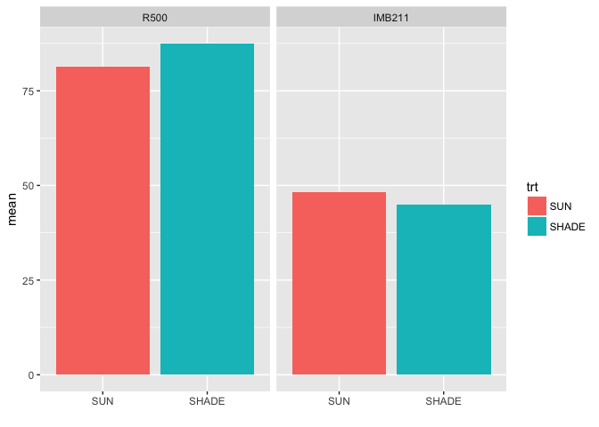
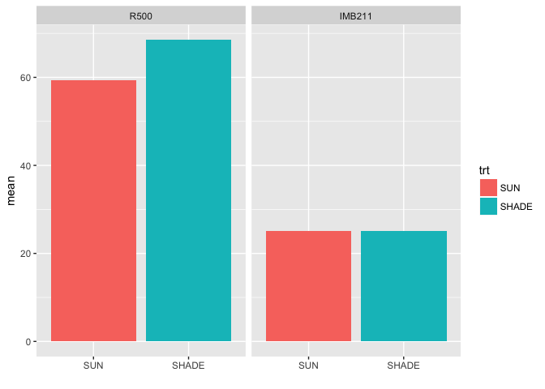
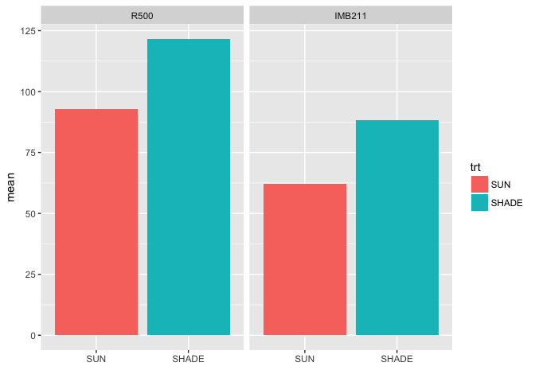
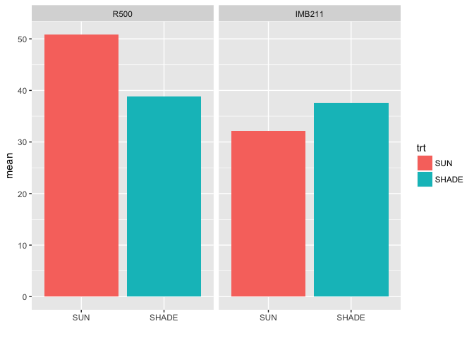

# 01_12_2017
Ruijuan Li  
1/12/2017  

# read the manual 
# Bring remaining questions about BRMS.  JM will try to answer.  If you wished that you had read the manual or help files before last week, do so before this week...


```r
library(brms)
```

```
## Loading required package: Rcpp
```

```
## Warning: package 'Rcpp' was built under R version 3.2.5
```

```
## Loading required package: ggplot2
```

```
## Warning: package 'ggplot2' was built under R version 3.2.5
```

```
## Loading 'brms' package (version 1.3.1.9000). Useful instructions 
## can be found by typing help('brms'). A more detailed introduction 
## to the package is available through vignette('brms_overview').
```

```r
vignette('brms_overview')
```

```
## Warning: vignette 'brms_overview' not found
```

```r
# 1) 
# something about setup 
# rstan_options (auto_write=TRUE)
# options (mc.cores=parallel::detectCores ()) # Run on multiple cores
# a general setup thing? 

# 2) 
# explain the result? 
# group-level effect; population level effect; family specific parameters 
# sd_shelf_intercept is not normally distributed... what is this about? 

# 3) about shiny 
# the usage and application of shiny in bioinformatics 

# 4) about fixed & random effect 
# when to determine an effect should be fixed or random 
# when to use unique intercept? # use tomato dataset as and example 

# 5) hypothesis testing 
# don't know how to interpret the result, which is significant, which is not? 

# 6) as.factor(tank) in homework Q2 
# maybe need all predictors to be factors? 

# 7) in Q3, your map2stan model didn't include trt effect. 
```

# homework, Fit and interpret a BRMS model to your own data set of your choice.  Be prepared to explain you analysis.
# fit my rapa data using brms 

```r
GC.pheno <- read.csv("/Users/ruijuanli/Desktop/Brassica_project/RNA_seq/data/shade_avoidance_expt_in_GC.csv",na.string=c("NA","N/A")) # replace all NA w/ N/A (the standard missing data format in R)
GH.pheno <- read.csv("/Users/ruijuanli/Desktop/Brassica_project/RNA_seq/data/shade_avoidance_expt_in_GH.csv", na.string=c("NA","N/A"))

head(GC.pheno)
```

```
##   s.no  barcode      X trt days       date leaves No..of.internodes  int1
## 1    1 1IM211A1 IMB211 SUN   38 22/11/2010      7                 2 11.42
## 2    2  1R500A2   R500 SUN   38 22/11/2010      7                 5  4.90
## 3    3 1IM211A3 IMB211 SUN   38 22/11/2010     12                 4  8.24
## 4    4  1R500A4   R500 SUN   38 22/11/2010      8                 5  2.57
## 5    5  1R500B1   R500 SUN   38 22/11/2010      7                 5  3.24
## 6    6 1IM211B2 IMB211 SUN   38 22/11/2010      9                 5  4.33
##    int2  int3  int4  int5 int6 int7 intleng leafl1 leafl2 leafl3 leafl
## 1 13.57    NA    NA    NA   NA   NA    12.5  47.42  53.22  36.86  45.8
## 2 12.17 23.57 35.47 20.64   NA   NA    19.4  71.92  70.50  72.46  71.6
## 3  5.23 13.06 20.52    NA   NA   NA    11.8  54.66  70.03  75.33  66.7
## 4 16.82 31.86 30.00 19.93   NA   NA    20.2  86.98  93.35  82.25  87.5
## 5 13.54  8.37 51.76 19.13   NA   NA    19.2  72.59  74.87  84.09  77.2
## 6  4.28 14.52 18.95 40.59   NA   NA    16.5  58.60  31.98  26.91  39.2
##   leafw1 leafw2 leafw3 leafw pet1.  pet2  pet3 petleng
## 1  19.29  18.82  22.11  20.1 16.05  0.42 21.74    12.7
## 2  49.71  53.65  51.39  51.6 77.06 58.38 58.93    64.8
## 3  34.06  33.89  27.24  31.7 34.04 11.35 25.51    23.6
## 4  60.86  58.48  74.91  64.8 57.59 69.26 63.97    63.6
## 5  48.14  52.09  58.52  52.9 78.84 79.57 78.51    79.0
## 6  32.75  21.97  30.44  28.4 21.07 25.34    NA    23.2
```

```r
head(GH.pheno)
```

```
##   Nos trt rep    date int1 int2 int3 int4 intleng leafl1 leafl2 leafl3
## 1   1  ND   1 10/5/10 23.1 73.0 29.1   NA   125.3   98.4   75.7   79.5
## 2   2  ND   2 10/5/10 14.5 26.2 15.8 31.4    87.8   88.4   94.4   56.5
## 3   3  ND   3 10/5/10 12.6 13.9 35.7 17.9    80.1   87.7   82.1   69.4
## 4   4  ND   4 10/5/10 18.2 31.1 30.5 12.5    92.3   93.5   86.4   59.2
## 5   5  ND   5 10/5/10 30.3 17.1 26.1   NA    73.5   74.1   81.6   53.3
## 6   6  ND   6 10/5/10 17.3 28.7 25.9 17.9    89.7   78.2   75.1   71.9
##   leafw1 leafw2 leafw3 pet1 pet2 pet3 leafleng leafwid leafnum internum
## 1   59.6   54.4   48.9 66.8 82.2 63.0     84.5    54.3       6        3
## 2   57.6   68.2   39.7 79.7 83.2 41.5     79.8    55.2       7        4
## 3   59.7   49.7   55.3 72.5 46.4 66.5     79.7    54.9       6        4
## 4   50.9   54.9   35.0 56.3 35.5 42.7     79.7    46.9       6        4
## 5   56.8   54.4   38.0 83.8 71.9 39.7     69.7    49.7       5        3
## 6   61.2   38.3   52.0 77.8 43.8 64.0     75.1    50.5       6        4
##   species
## 1    R500
## 2    R500
## 3    R500
## 4    R500
## 5    R500
## 6    R500
```

```r
summary(GC.pheno) 
```

```
##       s.no           barcode        X         trt          days   
##  Min.   : 1.00   1IM211A1: 1   IMB211:16   SHADE:16   Min.   :38  
##  1st Qu.: 8.75   1IM211A3: 1   R500  :16   SUN  :16   1st Qu.:38  
##  Median :16.50   1IM211B2: 1                          Median :38  
##  Mean   :16.50   1IM211B4: 1                          Mean   :38  
##  3rd Qu.:24.25   1R500A2 : 1                          3rd Qu.:38  
##  Max.   :32.00   1R500A4 : 1                          Max.   :38  
##                  (Other) :26                                      
##          date        leaves       No..of.internodes      int1       
##  22/11/2010:32   Min.   : 5.000   Min.   :2.000     Min.   : 2.570  
##                  1st Qu.: 7.500   1st Qu.:4.000     1st Qu.: 4.900  
##                  Median : 8.000   Median :5.000     Median : 8.240  
##                  Mean   : 7.903   Mean   :4.581     Mean   : 9.108  
##                  3rd Qu.: 8.000   3rd Qu.:5.000     3rd Qu.:11.240  
##                  Max.   :12.000   Max.   :7.000     Max.   :22.090  
##                  NA's   :1        NA's   :1         NA's   :1       
##       int2            int3            int4            int5      
##  Min.   : 4.28   Min.   : 8.03   Min.   : 7.56   Min.   :19.13  
##  1st Qu.:12.26   1st Qu.:15.24   1st Qu.:24.08   1st Qu.:25.19  
##  Median :13.40   Median :20.70   Median :30.21   Median :42.40  
##  Mean   :13.47   Mean   :20.78   Mean   :31.99   Mean   :42.43  
##  3rd Qu.:16.36   3rd Qu.:24.45   3rd Qu.:39.98   3rd Qu.:54.60  
##  Max.   :28.83   Max.   :40.56   Max.   :53.91   Max.   :75.86  
##  NA's   :1       NA's   :4       NA's   :8       NA's   :14     
##       int6            int7          intleng          leafl1      
##  Min.   :54.12   Min.   :53.99   Min.   : 8.70   Min.   : 30.13  
##  1st Qu.:57.81   1st Qu.:57.52   1st Qu.:14.15   1st Qu.: 48.51  
##  Median :62.75   Median :61.05   Median :20.00   Median : 59.00  
##  Mean   :65.75   Mean   :61.05   Mean   :21.45   Mean   : 67.16  
##  3rd Qu.:67.83   3rd Qu.:64.59   3rd Qu.:25.25   3rd Qu.: 87.19  
##  Max.   :89.19   Max.   :68.12   Max.   :43.70   Max.   :114.85  
##  NA's   :26      NA's   :30      NA's   :1       NA's   :1       
##      leafl2           leafl3           leafl           leafw1      
##  Min.   : 31.98   Min.   : 18.47   Min.   : 32.4   Min.   : 18.69  
##  1st Qu.: 44.88   1st Qu.: 37.84   1st Qu.: 43.6   1st Qu.: 29.82  
##  Median : 70.03   Median : 72.46   Median : 66.7   Median : 48.14  
##  Mean   : 67.41   Mean   : 64.93   Mean   : 66.5   Mean   : 47.17  
##  3rd Qu.: 86.06   3rd Qu.: 83.23   3rd Qu.: 87.1   3rd Qu.: 63.26  
##  Max.   :122.54   Max.   :111.51   Max.   :113.2   Max.   :101.01  
##  NA's   :1        NA's   :1        NA's   :1       NA's   :1       
##      leafw2          leafw3          leafw           pet1.      
##  Min.   :13.25   Min.   :12.91   Min.   :16.30   Min.   :14.34  
##  1st Qu.:24.39   1st Qu.:21.77   1st Qu.:24.35   1st Qu.:24.02  
##  Median :51.30   Median :45.21   Median :51.60   Median :57.59  
##  Mean   :45.86   Mean   :42.79   Mean   :45.27   Mean   :48.69  
##  3rd Qu.:62.95   3rd Qu.:60.87   3rd Qu.:65.65   3rd Qu.:73.18  
##  Max.   :93.14   Max.   :83.31   Max.   :88.10   Max.   :94.43  
##  NA's   :1       NA's   :1       NA's   :1       NA's   :1      
##       pet2            pet3          petleng     
##  Min.   : 0.42   Min.   : 4.27   Min.   :10.30  
##  1st Qu.:20.00   1st Qu.:17.95   1st Qu.:20.00  
##  Median :58.38   Median :60.69   Median :60.30  
##  Mean   :48.06   Mean   :48.72   Mean   :47.88  
##  3rd Qu.:77.74   3rd Qu.:78.14   3rd Qu.:75.60  
##  Max.   :86.92   Max.   :94.26   Max.   :89.10  
##  NA's   :1       NA's   :3       NA's   :1
```

```r
summary(GH.pheno)
```

```
##       Nos        trt          rep              date         int1      
##  Min.   : 1.00   D :20   Min.   : 1.000   10/5/10:42   Min.   : 6.70  
##  1st Qu.:11.25   ND:22   1st Qu.: 3.000                1st Qu.:10.84  
##  Median :21.50           Median : 6.000                Median :14.25  
##  Mean   :21.50           Mean   : 5.786                Mean   :16.31  
##  3rd Qu.:31.75           3rd Qu.: 8.000                3rd Qu.:18.00  
##  Max.   :42.00           Max.   :12.000                Max.   :50.30  
##                                                                       
##       int2            int3            int4          intleng      
##  Min.   : 6.89   Min.   :12.02   Min.   : 9.40   Min.   : 34.20  
##  1st Qu.:19.14   1st Qu.:23.81   1st Qu.:17.45   1st Qu.: 66.20  
##  Median :24.82   Median :30.00   Median :24.17   Median : 87.00  
##  Mean   :26.15   Mean   :31.26   Mean   :27.36   Mean   : 89.92  
##  3rd Qu.:30.50   3rd Qu.:36.70   3rd Qu.:34.97   3rd Qu.:111.83  
##  Max.   :73.00   Max.   :57.80   Max.   :73.70   Max.   :173.70  
##                  NA's   :1       NA's   :16                      
##      leafl1           leafl2          leafl3          leafw1     
##  Min.   : 53.16   Min.   :38.70   Min.   :21.40   Min.   :23.95  
##  1st Qu.: 63.01   1st Qu.:54.74   1st Qu.:44.50   1st Qu.:38.63  
##  Median : 70.40   Median :69.09   Median :54.43   Median :44.80  
##  Mean   : 72.23   Mean   :66.48   Mean   :57.36   Mean   :45.23  
##  3rd Qu.: 79.83   3rd Qu.:75.28   3rd Qu.:69.40   3rd Qu.:52.17  
##  Max.   :103.77   Max.   :95.25   Max.   :96.21   Max.   :61.20  
##                   NA's   :1       NA's   :1       NA's   :2      
##      leafw2          leafw3           pet1            pet2      
##  Min.   :20.65   Min.   :14.40   Min.   :56.30   Min.   :35.50  
##  1st Qu.:31.44   1st Qu.:26.48   1st Qu.:64.70   1st Qu.:48.40  
##  Median :40.95   Median :29.65   Median :72.50   Median :57.00  
##  Mean   :40.25   Mean   :33.06   Mean   :71.71   Mean   :58.68  
##  3rd Qu.:49.77   3rd Qu.:40.10   3rd Qu.:77.50   3rd Qu.:68.25  
##  Max.   :68.20   Max.   :59.20   Max.   :90.90   Max.   :83.20  
##  NA's   :2       NA's   :2       NA's   :23      NA's   :23     
##       pet3          leafleng        leafwid         leafnum      
##  Min.   :12.00   Min.   :41.80   Min.   :24.30   Min.   : 5.000  
##  1st Qu.:29.73   1st Qu.:58.42   1st Qu.:34.77   1st Qu.: 6.000  
##  Median :42.10   Median :65.10   Median :37.35   Median : 8.500  
##  Mean   :44.25   Mean   :65.37   Mean   :39.51   Mean   : 8.024  
##  3rd Qu.:60.50   3rd Qu.:74.22   3rd Qu.:47.60   3rd Qu.:10.000  
##  Max.   :85.60   Max.   :84.50   Max.   :58.60   Max.   :14.000  
##  NA's   :24                      NA's   :2                       
##     internum       species  
##  Min.   :2.000   IMB211:22  
##  1st Qu.:3.000   R500  :20  
##  Median :4.000              
##  Mean   :3.595              
##  3rd Qu.:4.000              
##  Max.   :4.000              
## 
```

# reformat data, get a factor for rep 

```r
library("stringr") # to help substring letters use negative to count backwards
```

```
## Warning: package 'stringr' was built under R version 3.2.5
```

```r
# GC 
names(GC.pheno)[3] <- "gt"
GC.pheno$rep <- as.factor(str_sub(GC.pheno$barcode,-2,-2))  # 8 reps 

# 
GC.pheno$height <- GC.pheno$No..of.internodes * GC.pheno$intleng
head(GC.pheno)
```

```
##   s.no  barcode     gt trt days       date leaves No..of.internodes  int1
## 1    1 1IM211A1 IMB211 SUN   38 22/11/2010      7                 2 11.42
## 2    2  1R500A2   R500 SUN   38 22/11/2010      7                 5  4.90
## 3    3 1IM211A3 IMB211 SUN   38 22/11/2010     12                 4  8.24
## 4    4  1R500A4   R500 SUN   38 22/11/2010      8                 5  2.57
## 5    5  1R500B1   R500 SUN   38 22/11/2010      7                 5  3.24
## 6    6 1IM211B2 IMB211 SUN   38 22/11/2010      9                 5  4.33
##    int2  int3  int4  int5 int6 int7 intleng leafl1 leafl2 leafl3 leafl
## 1 13.57    NA    NA    NA   NA   NA    12.5  47.42  53.22  36.86  45.8
## 2 12.17 23.57 35.47 20.64   NA   NA    19.4  71.92  70.50  72.46  71.6
## 3  5.23 13.06 20.52    NA   NA   NA    11.8  54.66  70.03  75.33  66.7
## 4 16.82 31.86 30.00 19.93   NA   NA    20.2  86.98  93.35  82.25  87.5
## 5 13.54  8.37 51.76 19.13   NA   NA    19.2  72.59  74.87  84.09  77.2
## 6  4.28 14.52 18.95 40.59   NA   NA    16.5  58.60  31.98  26.91  39.2
##   leafw1 leafw2 leafw3 leafw pet1.  pet2  pet3 petleng rep height
## 1  19.29  18.82  22.11  20.1 16.05  0.42 21.74    12.7   A   25.0
## 2  49.71  53.65  51.39  51.6 77.06 58.38 58.93    64.8   A   97.0
## 3  34.06  33.89  27.24  31.7 34.04 11.35 25.51    23.6   A   47.2
## 4  60.86  58.48  74.91  64.8 57.59 69.26 63.97    63.6   A  101.0
## 5  48.14  52.09  58.52  52.9 78.84 79.57 78.51    79.0   B   96.0
## 6  32.75  21.97  30.44  28.4 21.07 25.34    NA    23.2   B   82.5
```

```r
GC.pheno.data <- GC.pheno[, c("gt", "trt", "leaves", "No..of.internodes", "leafl", "leafw", "petleng", "rep", "height")]
colnames(GC.pheno.data) <- c("gt", "trt", "leaf_No", "internode_No", "leafl_ave", "leafw_ave", "petleng_ave", "rep", "height")
head(GC.pheno.data)
```

```
##       gt trt leaf_No internode_No leafl_ave leafw_ave petleng_ave rep
## 1 IMB211 SUN       7            2      45.8      20.1        12.7   A
## 2   R500 SUN       7            5      71.6      51.6        64.8   A
## 3 IMB211 SUN      12            4      66.7      31.7        23.6   A
## 4   R500 SUN       8            5      87.5      64.8        63.6   A
## 5   R500 SUN       7            5      77.2      52.9        79.0   B
## 6 IMB211 SUN       9            5      39.2      28.4        23.2   B
##   height
## 1   25.0
## 2   97.0
## 3   47.2
## 4  101.0
## 5   96.0
## 6   82.5
```

```r
# GH 
GH.pheno$rep <- as.factor(GH.pheno$rep)
GH.pheno$rep 
```

```
##  [1] 1  2  3  4  5  6  7  8  9  10 1  2  3  4  5  6  7  8  9  10 1  2  3 
## [24] 4  5  6  7  8  9  10 11 12 1  2  3  4  5  6  7  8  9  10
## Levels: 1 2 3 4 5 6 7 8 9 10 11 12
```

```r
head(GH.pheno)
```

```
##   Nos trt rep    date int1 int2 int3 int4 intleng leafl1 leafl2 leafl3
## 1   1  ND   1 10/5/10 23.1 73.0 29.1   NA   125.3   98.4   75.7   79.5
## 2   2  ND   2 10/5/10 14.5 26.2 15.8 31.4    87.8   88.4   94.4   56.5
## 3   3  ND   3 10/5/10 12.6 13.9 35.7 17.9    80.1   87.7   82.1   69.4
## 4   4  ND   4 10/5/10 18.2 31.1 30.5 12.5    92.3   93.5   86.4   59.2
## 5   5  ND   5 10/5/10 30.3 17.1 26.1   NA    73.5   74.1   81.6   53.3
## 6   6  ND   6 10/5/10 17.3 28.7 25.9 17.9    89.7   78.2   75.1   71.9
##   leafw1 leafw2 leafw3 pet1 pet2 pet3 leafleng leafwid leafnum internum
## 1   59.6   54.4   48.9 66.8 82.2 63.0     84.5    54.3       6        3
## 2   57.6   68.2   39.7 79.7 83.2 41.5     79.8    55.2       7        4
## 3   59.7   49.7   55.3 72.5 46.4 66.5     79.7    54.9       6        4
## 4   50.9   54.9   35.0 56.3 35.5 42.7     79.7    46.9       6        4
## 5   56.8   54.4   38.0 83.8 71.9 39.7     69.7    49.7       5        3
## 6   61.2   38.3   52.0 77.8 43.8 64.0     75.1    50.5       6        4
##   species
## 1    R500
## 2    R500
## 3    R500
## 4    R500
## 5    R500
## 6    R500
```

```r
GH.pheno$rep <- as.factor(GH.pheno$rep)
GH.pheno$rep 
```

```
##  [1] 1  2  3  4  5  6  7  8  9  10 1  2  3  4  5  6  7  8  9  10 1  2  3 
## [24] 4  5  6  7  8  9  10 11 12 1  2  3  4  5  6  7  8  9  10
## Levels: 1 2 3 4 5 6 7 8 9 10 11 12
```

```r
head(GH.pheno)
```

```
##   Nos trt rep    date int1 int2 int3 int4 intleng leafl1 leafl2 leafl3
## 1   1  ND   1 10/5/10 23.1 73.0 29.1   NA   125.3   98.4   75.7   79.5
## 2   2  ND   2 10/5/10 14.5 26.2 15.8 31.4    87.8   88.4   94.4   56.5
## 3   3  ND   3 10/5/10 12.6 13.9 35.7 17.9    80.1   87.7   82.1   69.4
## 4   4  ND   4 10/5/10 18.2 31.1 30.5 12.5    92.3   93.5   86.4   59.2
## 5   5  ND   5 10/5/10 30.3 17.1 26.1   NA    73.5   74.1   81.6   53.3
## 6   6  ND   6 10/5/10 17.3 28.7 25.9 17.9    89.7   78.2   75.1   71.9
##   leafw1 leafw2 leafw3 pet1 pet2 pet3 leafleng leafwid leafnum internum
## 1   59.6   54.4   48.9 66.8 82.2 63.0     84.5    54.3       6        3
## 2   57.6   68.2   39.7 79.7 83.2 41.5     79.8    55.2       7        4
## 3   59.7   49.7   55.3 72.5 46.4 66.5     79.7    54.9       6        4
## 4   50.9   54.9   35.0 56.3 35.5 42.7     79.7    46.9       6        4
## 5   56.8   54.4   38.0 83.8 71.9 39.7     69.7    49.7       5        3
## 6   61.2   38.3   52.0 77.8 43.8 64.0     75.1    50.5       6        4
##   species
## 1    R500
## 2    R500
## 3    R500
## 4    R500
## 5    R500
## 6    R500
```

```r
GH.pheno$petleng_ave <- round(rowMeans(subset(GH.pheno, select=c("pet1", "pet2", "pet3")), na.rm = T), digits = 1)
GH.pheno.data <- GH.pheno[, c("trt", "rep", "intleng", "leafleng", "leafwid", "leafnum", "internum", "species", "petleng_ave")]
colnames(GH.pheno.data) <- c("trt", "rep", "height", "leafl_ave", "leafw_ave", "leaf_No", "internode_No", "gt", "petleng_ave")
head(GH.pheno.data)
```

```
##   trt rep height leafl_ave leafw_ave leaf_No internode_No   gt petleng_ave
## 1  ND   1  125.3      84.5      54.3       6            3 R500        70.7
## 2  ND   2   87.8      79.8      55.2       7            4 R500        68.1
## 3  ND   3   80.1      79.7      54.9       6            4 R500        61.8
## 4  ND   4   92.3      79.7      46.9       6            4 R500        44.8
## 5  ND   5   73.5      69.7      49.7       5            3 R500        65.1
## 6  ND   6   89.7      75.1      50.5       6            4 R500        61.9
```

```r
GH.pheno.data$trt
```

```
##  [1] ND ND ND ND ND ND ND ND ND ND D  D  D  D  D  D  D  D  D  D  ND ND ND
## [24] ND ND ND ND ND ND ND ND ND D  D  D  D  D  D  D  D  D  D 
## Levels: D ND
```

# fit the data using BRMS model 

```r
# build models for plant height, leaf length average, and leaf width average 
GC.pheno.data$trt <- relevel(GC.pheno.data$trt, ref = "SUN")
GC.pheno.data$gt <- relevel(GC.pheno.data$gt, ref = "R500") 

m.GC_height <- brm(height ~ trt * gt + (1|rep), 
            data = GC.pheno.data,
            prior = c(set_prior("normal(0,10)",class="b")) # sets prior for all b coefficients  
) 
```

```
## Warning: Rows containing NAs were excluded from the model
```

```
## Compiling the C++ model
```

```
## Start sampling
```

```
## 
## SAMPLING FOR MODEL 'gaussian(identity) brms-model' NOW (CHAIN 1).
## 
## Chain 1, Iteration:    1 / 2000 [  0%]  (Warmup)
## Chain 1, Iteration:  200 / 2000 [ 10%]  (Warmup)
## Chain 1, Iteration:  400 / 2000 [ 20%]  (Warmup)
## Chain 1, Iteration:  600 / 2000 [ 30%]  (Warmup)
## Chain 1, Iteration:  800 / 2000 [ 40%]  (Warmup)
## Chain 1, Iteration: 1000 / 2000 [ 50%]  (Warmup)
## Chain 1, Iteration: 1001 / 2000 [ 50%]  (Sampling)
## Chain 1, Iteration: 1200 / 2000 [ 60%]  (Sampling)
## Chain 1, Iteration: 1400 / 2000 [ 70%]  (Sampling)
## Chain 1, Iteration: 1600 / 2000 [ 80%]  (Sampling)
## Chain 1, Iteration: 1800 / 2000 [ 90%]  (Sampling)
## Chain 1, Iteration: 2000 / 2000 [100%]  (Sampling)
##  Elapsed Time: 0.27881 seconds (Warm-up)
##                0.132769 seconds (Sampling)
##                0.411579 seconds (Total)
## 
## 
## SAMPLING FOR MODEL 'gaussian(identity) brms-model' NOW (CHAIN 2).
## 
## Chain 2, Iteration:    1 / 2000 [  0%]  (Warmup)
## Chain 2, Iteration:  200 / 2000 [ 10%]  (Warmup)
## Chain 2, Iteration:  400 / 2000 [ 20%]  (Warmup)
## Chain 2, Iteration:  600 / 2000 [ 30%]  (Warmup)
## Chain 2, Iteration:  800 / 2000 [ 40%]  (Warmup)
## Chain 2, Iteration: 1000 / 2000 [ 50%]  (Warmup)
## Chain 2, Iteration: 1001 / 2000 [ 50%]  (Sampling)
## Chain 2, Iteration: 1200 / 2000 [ 60%]  (Sampling)
## Chain 2, Iteration: 1400 / 2000 [ 70%]  (Sampling)
## Chain 2, Iteration: 1600 / 2000 [ 80%]  (Sampling)
## Chain 2, Iteration: 1800 / 2000 [ 90%]  (Sampling)
## Chain 2, Iteration: 2000 / 2000 [100%]  (Sampling)
##  Elapsed Time: 0.313573 seconds (Warm-up)
##                0.137353 seconds (Sampling)
##                0.450926 seconds (Total)
## 
## 
## SAMPLING FOR MODEL 'gaussian(identity) brms-model' NOW (CHAIN 3).
## 
## Chain 3, Iteration:    1 / 2000 [  0%]  (Warmup)
## Chain 3, Iteration:  200 / 2000 [ 10%]  (Warmup)
## Chain 3, Iteration:  400 / 2000 [ 20%]  (Warmup)
## Chain 3, Iteration:  600 / 2000 [ 30%]  (Warmup)
## Chain 3, Iteration:  800 / 2000 [ 40%]  (Warmup)
## Chain 3, Iteration: 1000 / 2000 [ 50%]  (Warmup)
## Chain 3, Iteration: 1001 / 2000 [ 50%]  (Sampling)
## Chain 3, Iteration: 1200 / 2000 [ 60%]  (Sampling)
## Chain 3, Iteration: 1400 / 2000 [ 70%]  (Sampling)
## Chain 3, Iteration: 1600 / 2000 [ 80%]  (Sampling)
## Chain 3, Iteration: 1800 / 2000 [ 90%]  (Sampling)
## Chain 3, Iteration: 2000 / 2000 [100%]  (Sampling)
##  Elapsed Time: 0.299347 seconds (Warm-up)
##                0.154175 seconds (Sampling)
##                0.453522 seconds (Total)
## 
## 
## SAMPLING FOR MODEL 'gaussian(identity) brms-model' NOW (CHAIN 4).
## 
## Chain 4, Iteration:    1 / 2000 [  0%]  (Warmup)
## Chain 4, Iteration:  200 / 2000 [ 10%]  (Warmup)
## Chain 4, Iteration:  400 / 2000 [ 20%]  (Warmup)
## Chain 4, Iteration:  600 / 2000 [ 30%]  (Warmup)
## Chain 4, Iteration:  800 / 2000 [ 40%]  (Warmup)
## Chain 4, Iteration: 1000 / 2000 [ 50%]  (Warmup)
## Chain 4, Iteration: 1001 / 2000 [ 50%]  (Sampling)
## Chain 4, Iteration: 1200 / 2000 [ 60%]  (Sampling)
## Chain 4, Iteration: 1400 / 2000 [ 70%]  (Sampling)
## Chain 4, Iteration: 1600 / 2000 [ 80%]  (Sampling)
## Chain 4, Iteration: 1800 / 2000 [ 90%]  (Sampling)
## Chain 4, Iteration: 2000 / 2000 [100%]  (Sampling)
##  Elapsed Time: 0.307313 seconds (Warm-up)
##                0.178488 seconds (Sampling)
##                0.485801 seconds (Total)
```

```
## Warning: There were 3 divergent transitions after warmup. Increasing adapt_delta above 0.8 may help. See
## http://mc-stan.org/misc/warnings.html#divergent-transitions-after-warmup
```

```
## Warning: Examine the pairs() plot to diagnose sampling problems
```

```r
summary(m.GC_height)
```

```
##  Family: gaussian (identity) 
## Formula: height ~ trt * gt + (1 | rep) 
##    Data: GC.pheno.data (Number of observations: 31) 
## Samples: 4 chains, each with iter = 2000; warmup = 1000; thin = 1; 
##          total post-warmup samples = 4000
##    WAIC: Not computed
##  
## Group-Level Effects: 
## ~rep (Number of levels: 8) 
##               Estimate Est.Error l-95% CI u-95% CI Eff.Sample Rhat
## sd(Intercept)     24.1     17.22     1.01    65.19       1114    1
## 
## Population-Level Effects: 
##                   Estimate Est.Error l-95% CI u-95% CI Eff.Sample Rhat
## Intercept           113.70     17.95    78.67   149.98       2275    1
## trtSHADE              7.47     10.31   -13.19    27.85       3023    1
## gtIMB211            -15.88     10.10   -36.20     3.36       2913    1
## trtSHADE:gtIMB211    -7.71      9.75   -26.74    11.88       4000    1
## 
## Family Specific Parameters: 
##       Estimate Est.Error l-95% CI u-95% CI Eff.Sample Rhat
## sigma     67.5     10.59    49.69    91.21       1940    1
## 
## Samples were drawn using sampling(NUTS). For each parameter, Eff.Sample 
## is a crude measure of effective sample size, and Rhat is the potential 
## scale reduction factor on split chains (at convergence, Rhat = 1).
```

```r
fixef(m.GC_height)
```

```
##                         mean
## Intercept         113.700688
## trtSHADE            7.470742
## gtIMB211          -15.875853
## trtSHADE:gtIMB211  -7.711382
```

```r
m.GC_leafl <- brm(leafl_ave ~ trt * gt + (1|rep), 
            data = GC.pheno.data,
            prior = c(set_prior("normal(0,10)",class="b")) # sets prior for all b coefficients  
) 
```

```
## Warning: Rows containing NAs were excluded from the model
```

```
## Compiling the C++ model
## Start sampling
```

```
## 
## SAMPLING FOR MODEL 'gaussian(identity) brms-model' NOW (CHAIN 1).
## 
## Chain 1, Iteration:    1 / 2000 [  0%]  (Warmup)
## Chain 1, Iteration:  200 / 2000 [ 10%]  (Warmup)
## Chain 1, Iteration:  400 / 2000 [ 20%]  (Warmup)
## Chain 1, Iteration:  600 / 2000 [ 30%]  (Warmup)
## Chain 1, Iteration:  800 / 2000 [ 40%]  (Warmup)
## Chain 1, Iteration: 1000 / 2000 [ 50%]  (Warmup)
## Chain 1, Iteration: 1001 / 2000 [ 50%]  (Sampling)
## Chain 1, Iteration: 1200 / 2000 [ 60%]  (Sampling)
## Chain 1, Iteration: 1400 / 2000 [ 70%]  (Sampling)
## Chain 1, Iteration: 1600 / 2000 [ 80%]  (Sampling)
## Chain 1, Iteration: 1800 / 2000 [ 90%]  (Sampling)
## Chain 1, Iteration: 2000 / 2000 [100%]  (Sampling)
##  Elapsed Time: 0.241305 seconds (Warm-up)
##                0.180149 seconds (Sampling)
##                0.421454 seconds (Total)
## 
## 
## SAMPLING FOR MODEL 'gaussian(identity) brms-model' NOW (CHAIN 2).
## 
## Chain 2, Iteration:    1 / 2000 [  0%]  (Warmup)
## Chain 2, Iteration:  200 / 2000 [ 10%]  (Warmup)
## Chain 2, Iteration:  400 / 2000 [ 20%]  (Warmup)
## Chain 2, Iteration:  600 / 2000 [ 30%]  (Warmup)
## Chain 2, Iteration:  800 / 2000 [ 40%]  (Warmup)
## Chain 2, Iteration: 1000 / 2000 [ 50%]  (Warmup)
## Chain 2, Iteration: 1001 / 2000 [ 50%]  (Sampling)
## Chain 2, Iteration: 1200 / 2000 [ 60%]  (Sampling)
## Chain 2, Iteration: 1400 / 2000 [ 70%]  (Sampling)
## Chain 2, Iteration: 1600 / 2000 [ 80%]  (Sampling)
## Chain 2, Iteration: 1800 / 2000 [ 90%]  (Sampling)
## Chain 2, Iteration: 2000 / 2000 [100%]  (Sampling)
##  Elapsed Time: 0.298864 seconds (Warm-up)
##                0.203236 seconds (Sampling)
##                0.5021 seconds (Total)
## 
## 
## SAMPLING FOR MODEL 'gaussian(identity) brms-model' NOW (CHAIN 3).
## 
## Chain 3, Iteration:    1 / 2000 [  0%]  (Warmup)
## Chain 3, Iteration:  200 / 2000 [ 10%]  (Warmup)
## Chain 3, Iteration:  400 / 2000 [ 20%]  (Warmup)
## Chain 3, Iteration:  600 / 2000 [ 30%]  (Warmup)
## Chain 3, Iteration:  800 / 2000 [ 40%]  (Warmup)
## Chain 3, Iteration: 1000 / 2000 [ 50%]  (Warmup)
## Chain 3, Iteration: 1001 / 2000 [ 50%]  (Sampling)
## Chain 3, Iteration: 1200 / 2000 [ 60%]  (Sampling)
## Chain 3, Iteration: 1400 / 2000 [ 70%]  (Sampling)
## Chain 3, Iteration: 1600 / 2000 [ 80%]  (Sampling)
## Chain 3, Iteration: 1800 / 2000 [ 90%]  (Sampling)
## Chain 3, Iteration: 2000 / 2000 [100%]  (Sampling)
##  Elapsed Time: 0.279173 seconds (Warm-up)
##                0.174646 seconds (Sampling)
##                0.453819 seconds (Total)
## 
## 
## SAMPLING FOR MODEL 'gaussian(identity) brms-model' NOW (CHAIN 4).
## 
## Chain 4, Iteration:    1 / 2000 [  0%]  (Warmup)
## Chain 4, Iteration:  200 / 2000 [ 10%]  (Warmup)
## Chain 4, Iteration:  400 / 2000 [ 20%]  (Warmup)
## Chain 4, Iteration:  600 / 2000 [ 30%]  (Warmup)
## Chain 4, Iteration:  800 / 2000 [ 40%]  (Warmup)
## Chain 4, Iteration: 1000 / 2000 [ 50%]  (Warmup)
## Chain 4, Iteration: 1001 / 2000 [ 50%]  (Sampling)
## Chain 4, Iteration: 1200 / 2000 [ 60%]  (Sampling)
## Chain 4, Iteration: 1400 / 2000 [ 70%]  (Sampling)
## Chain 4, Iteration: 1600 / 2000 [ 80%]  (Sampling)
## Chain 4, Iteration: 1800 / 2000 [ 90%]  (Sampling)
## Chain 4, Iteration: 2000 / 2000 [100%]  (Sampling)
##  Elapsed Time: 0.267333 seconds (Warm-up)
##                0.182283 seconds (Sampling)
##                0.449616 seconds (Total)
```

```r
summary(m.GC_leafl)
```

```
##  Family: gaussian (identity) 
## Formula: leafl_ave ~ trt * gt + (1 | rep) 
##    Data: GC.pheno.data (Number of observations: 31) 
## Samples: 4 chains, each with iter = 2000; warmup = 1000; thin = 1; 
##          total post-warmup samples = 4000
##    WAIC: Not computed
##  
## Group-Level Effects: 
## ~rep (Number of levels: 8) 
##               Estimate Est.Error l-95% CI u-95% CI Eff.Sample Rhat
## sd(Intercept)     7.71      4.55     0.69    18.56        928    1
## 
## Population-Level Effects: 
##                   Estimate Est.Error l-95% CI u-95% CI Eff.Sample Rhat
## Intercept            81.39      5.23    71.07    92.32       1543    1
## trtSHADE              6.07      6.32    -6.79    17.99       1496    1
## gtIMB211            -33.27      4.57   -42.01   -23.85       2564    1
## trtSHADE:gtIMB211    -9.27      5.65   -20.23     1.84       2862    1
## 
## Family Specific Parameters: 
##       Estimate Est.Error l-95% CI u-95% CI Eff.Sample Rhat
## sigma    10.86      1.92      7.8    15.39       1440 1.01
## 
## Samples were drawn using sampling(NUTS). For each parameter, Eff.Sample 
## is a crude measure of effective sample size, and Rhat is the potential 
## scale reduction factor on split chains (at convergence, Rhat = 1).
```

```r
fixef(m.GC_leafl) 
```

```
##                         mean
## Intercept          81.394908
## trtSHADE            6.072053
## gtIMB211          -33.271807
## trtSHADE:gtIMB211  -9.265048
```

```r
m.GC_leafw <- brm(leafw_ave ~ trt * gt + (1|rep), 
            data = GC.pheno.data,
            prior = c(set_prior("normal(0,10)",class="b")) # sets prior for all b coefficients  
) 
```

```
## Warning: Rows containing NAs were excluded from the model
```

```
## Compiling the C++ model
## Start sampling
```

```
## 
## SAMPLING FOR MODEL 'gaussian(identity) brms-model' NOW (CHAIN 1).
## 
## Chain 1, Iteration:    1 / 2000 [  0%]  (Warmup)
## Chain 1, Iteration:  200 / 2000 [ 10%]  (Warmup)
## Chain 1, Iteration:  400 / 2000 [ 20%]  (Warmup)
## Chain 1, Iteration:  600 / 2000 [ 30%]  (Warmup)
## Chain 1, Iteration:  800 / 2000 [ 40%]  (Warmup)
## Chain 1, Iteration: 1000 / 2000 [ 50%]  (Warmup)
## Chain 1, Iteration: 1001 / 2000 [ 50%]  (Sampling)
## Chain 1, Iteration: 1200 / 2000 [ 60%]  (Sampling)
## Chain 1, Iteration: 1400 / 2000 [ 70%]  (Sampling)
## Chain 1, Iteration: 1600 / 2000 [ 80%]  (Sampling)
## Chain 1, Iteration: 1800 / 2000 [ 90%]  (Sampling)
## Chain 1, Iteration: 2000 / 2000 [100%]  (Sampling)
##  Elapsed Time: 0.176225 seconds (Warm-up)
##                0.120671 seconds (Sampling)
##                0.296896 seconds (Total)
## 
## 
## SAMPLING FOR MODEL 'gaussian(identity) brms-model' NOW (CHAIN 2).
## 
## Chain 2, Iteration:    1 / 2000 [  0%]  (Warmup)
## Chain 2, Iteration:  200 / 2000 [ 10%]  (Warmup)
## Chain 2, Iteration:  400 / 2000 [ 20%]  (Warmup)
## Chain 2, Iteration:  600 / 2000 [ 30%]  (Warmup)
## Chain 2, Iteration:  800 / 2000 [ 40%]  (Warmup)
## Chain 2, Iteration: 1000 / 2000 [ 50%]  (Warmup)
## Chain 2, Iteration: 1001 / 2000 [ 50%]  (Sampling)
## Chain 2, Iteration: 1200 / 2000 [ 60%]  (Sampling)
## Chain 2, Iteration: 1400 / 2000 [ 70%]  (Sampling)
## Chain 2, Iteration: 1600 / 2000 [ 80%]  (Sampling)
## Chain 2, Iteration: 1800 / 2000 [ 90%]  (Sampling)
## Chain 2, Iteration: 2000 / 2000 [100%]  (Sampling)
##  Elapsed Time: 0.205076 seconds (Warm-up)
##                0.146971 seconds (Sampling)
##                0.352047 seconds (Total)
## 
## 
## SAMPLING FOR MODEL 'gaussian(identity) brms-model' NOW (CHAIN 3).
## 
## Chain 3, Iteration:    1 / 2000 [  0%]  (Warmup)
## Chain 3, Iteration:  200 / 2000 [ 10%]  (Warmup)
## Chain 3, Iteration:  400 / 2000 [ 20%]  (Warmup)
## Chain 3, Iteration:  600 / 2000 [ 30%]  (Warmup)
## Chain 3, Iteration:  800 / 2000 [ 40%]  (Warmup)
## Chain 3, Iteration: 1000 / 2000 [ 50%]  (Warmup)
## Chain 3, Iteration: 1001 / 2000 [ 50%]  (Sampling)
## Chain 3, Iteration: 1200 / 2000 [ 60%]  (Sampling)
## Chain 3, Iteration: 1400 / 2000 [ 70%]  (Sampling)
## Chain 3, Iteration: 1600 / 2000 [ 80%]  (Sampling)
## Chain 3, Iteration: 1800 / 2000 [ 90%]  (Sampling)
## Chain 3, Iteration: 2000 / 2000 [100%]  (Sampling)
##  Elapsed Time: 0.216612 seconds (Warm-up)
##                0.153492 seconds (Sampling)
##                0.370104 seconds (Total)
## 
## 
## SAMPLING FOR MODEL 'gaussian(identity) brms-model' NOW (CHAIN 4).
## 
## Chain 4, Iteration:    1 / 2000 [  0%]  (Warmup)
## Chain 4, Iteration:  200 / 2000 [ 10%]  (Warmup)
## Chain 4, Iteration:  400 / 2000 [ 20%]  (Warmup)
## Chain 4, Iteration:  600 / 2000 [ 30%]  (Warmup)
## Chain 4, Iteration:  800 / 2000 [ 40%]  (Warmup)
## Chain 4, Iteration: 1000 / 2000 [ 50%]  (Warmup)
## Chain 4, Iteration: 1001 / 2000 [ 50%]  (Sampling)
## Chain 4, Iteration: 1200 / 2000 [ 60%]  (Sampling)
## Chain 4, Iteration: 1400 / 2000 [ 70%]  (Sampling)
## Chain 4, Iteration: 1600 / 2000 [ 80%]  (Sampling)
## Chain 4, Iteration: 1800 / 2000 [ 90%]  (Sampling)
## Chain 4, Iteration: 2000 / 2000 [100%]  (Sampling)
##  Elapsed Time: 0.187935 seconds (Warm-up)
##                0.154916 seconds (Sampling)
##                0.342851 seconds (Total)
```

```
## Warning: There were 12 divergent transitions after warmup. Increasing adapt_delta above 0.8 may help. See
## http://mc-stan.org/misc/warnings.html#divergent-transitions-after-warmup

## Warning: Examine the pairs() plot to diagnose sampling problems
```

```r
summary(m.GC_leafw)
```

```
##  Family: gaussian (identity) 
## Formula: leafw_ave ~ trt * gt + (1 | rep) 
##    Data: GC.pheno.data (Number of observations: 31) 
## Samples: 4 chains, each with iter = 2000; warmup = 1000; thin = 1; 
##          total post-warmup samples = 4000
##    WAIC: Not computed
##  
## Group-Level Effects: 
## ~rep (Number of levels: 8) 
##               Estimate Est.Error l-95% CI u-95% CI Eff.Sample Rhat
## sd(Intercept)     2.82      2.19     0.09     8.51        687    1
## 
## Population-Level Effects: 
##                   Estimate Est.Error l-95% CI u-95% CI Eff.Sample Rhat
## Intercept            59.33      3.03    53.15    65.12        648    1
## trtSHADE              9.24      3.92     1.62    17.21        706    1
## gtIMB211            -34.27      3.22   -40.36   -27.74       2275    1
## trtSHADE:gtIMB211    -9.19      4.32   -17.56    -0.76       2371    1
## 
## Family Specific Parameters: 
##       Estimate Est.Error l-95% CI u-95% CI Eff.Sample Rhat
## sigma     7.18      1.08     5.42      9.6       2729    1
## 
## Samples were drawn using sampling(NUTS). For each parameter, Eff.Sample 
## is a crude measure of effective sample size, and Rhat is the potential 
## scale reduction factor on split chains (at convergence, Rhat = 1).
```

```r
fixef(m.GC_leafw)  
```

```
##                         mean
## Intercept          59.332247
## trtSHADE            9.236567
## gtIMB211          -34.267967
## trtSHADE:gtIMB211  -9.191938
```

```r
### GH 
GH.pheno.data$trt <- relevel(GH.pheno.data$trt, ref = "ND")
GH.pheno.data$gt <- relevel(GH.pheno.data$gt, ref = "R500") 

m.GH_height <- brm(height ~ trt * gt + (1|rep), 
            data = GH.pheno.data,
            prior = c(set_prior("normal(0,10)",class="b")) # sets prior for all b coefficients  
) 
```

```
## Compiling the C++ model
## Start sampling
```

```
## 
## SAMPLING FOR MODEL 'gaussian(identity) brms-model' NOW (CHAIN 1).
## 
## Chain 1, Iteration:    1 / 2000 [  0%]  (Warmup)
## Chain 1, Iteration:  200 / 2000 [ 10%]  (Warmup)
## Chain 1, Iteration:  400 / 2000 [ 20%]  (Warmup)
## Chain 1, Iteration:  600 / 2000 [ 30%]  (Warmup)
## Chain 1, Iteration:  800 / 2000 [ 40%]  (Warmup)
## Chain 1, Iteration: 1000 / 2000 [ 50%]  (Warmup)
## Chain 1, Iteration: 1001 / 2000 [ 50%]  (Sampling)
## Chain 1, Iteration: 1200 / 2000 [ 60%]  (Sampling)
## Chain 1, Iteration: 1400 / 2000 [ 70%]  (Sampling)
## Chain 1, Iteration: 1600 / 2000 [ 80%]  (Sampling)
## Chain 1, Iteration: 1800 / 2000 [ 90%]  (Sampling)
## Chain 1, Iteration: 2000 / 2000 [100%]  (Sampling)
##  Elapsed Time: 0.206754 seconds (Warm-up)
##                0.146888 seconds (Sampling)
##                0.353642 seconds (Total)
## 
## 
## SAMPLING FOR MODEL 'gaussian(identity) brms-model' NOW (CHAIN 2).
## 
## Chain 2, Iteration:    1 / 2000 [  0%]  (Warmup)
## Chain 2, Iteration:  200 / 2000 [ 10%]  (Warmup)
## Chain 2, Iteration:  400 / 2000 [ 20%]  (Warmup)
## Chain 2, Iteration:  600 / 2000 [ 30%]  (Warmup)
## Chain 2, Iteration:  800 / 2000 [ 40%]  (Warmup)
## Chain 2, Iteration: 1000 / 2000 [ 50%]  (Warmup)
## Chain 2, Iteration: 1001 / 2000 [ 50%]  (Sampling)
## Chain 2, Iteration: 1200 / 2000 [ 60%]  (Sampling)
## Chain 2, Iteration: 1400 / 2000 [ 70%]  (Sampling)
## Chain 2, Iteration: 1600 / 2000 [ 80%]  (Sampling)
## Chain 2, Iteration: 1800 / 2000 [ 90%]  (Sampling)
## Chain 2, Iteration: 2000 / 2000 [100%]  (Sampling)
##  Elapsed Time: 0.218149 seconds (Warm-up)
##                0.177984 seconds (Sampling)
##                0.396133 seconds (Total)
## 
## 
## SAMPLING FOR MODEL 'gaussian(identity) brms-model' NOW (CHAIN 3).
## 
## Chain 3, Iteration:    1 / 2000 [  0%]  (Warmup)
## Chain 3, Iteration:  200 / 2000 [ 10%]  (Warmup)
## Chain 3, Iteration:  400 / 2000 [ 20%]  (Warmup)
## Chain 3, Iteration:  600 / 2000 [ 30%]  (Warmup)
## Chain 3, Iteration:  800 / 2000 [ 40%]  (Warmup)
## Chain 3, Iteration: 1000 / 2000 [ 50%]  (Warmup)
## Chain 3, Iteration: 1001 / 2000 [ 50%]  (Sampling)
## Chain 3, Iteration: 1200 / 2000 [ 60%]  (Sampling)
## Chain 3, Iteration: 1400 / 2000 [ 70%]  (Sampling)
## Chain 3, Iteration: 1600 / 2000 [ 80%]  (Sampling)
## Chain 3, Iteration: 1800 / 2000 [ 90%]  (Sampling)
## Chain 3, Iteration: 2000 / 2000 [100%]  (Sampling)
##  Elapsed Time: 0.256631 seconds (Warm-up)
##                0.131085 seconds (Sampling)
##                0.387716 seconds (Total)
## 
## 
## SAMPLING FOR MODEL 'gaussian(identity) brms-model' NOW (CHAIN 4).
## 
## Chain 4, Iteration:    1 / 2000 [  0%]  (Warmup)
## Chain 4, Iteration:  200 / 2000 [ 10%]  (Warmup)
## Chain 4, Iteration:  400 / 2000 [ 20%]  (Warmup)
## Chain 4, Iteration:  600 / 2000 [ 30%]  (Warmup)
## Chain 4, Iteration:  800 / 2000 [ 40%]  (Warmup)
## Chain 4, Iteration: 1000 / 2000 [ 50%]  (Warmup)
## Chain 4, Iteration: 1001 / 2000 [ 50%]  (Sampling)
## Chain 4, Iteration: 1200 / 2000 [ 60%]  (Sampling)
## Chain 4, Iteration: 1400 / 2000 [ 70%]  (Sampling)
## Chain 4, Iteration: 1600 / 2000 [ 80%]  (Sampling)
## Chain 4, Iteration: 1800 / 2000 [ 90%]  (Sampling)
## Chain 4, Iteration: 2000 / 2000 [100%]  (Sampling)
##  Elapsed Time: 0.220876 seconds (Warm-up)
##                0.13388 seconds (Sampling)
##                0.354756 seconds (Total)
```

```
## Warning: There were 1 divergent transitions after warmup. Increasing adapt_delta above 0.8 may help. See
## http://mc-stan.org/misc/warnings.html#divergent-transitions-after-warmup

## Warning: Examine the pairs() plot to diagnose sampling problems
```

```r
summary(m.GH_height)
```

```
##  Family: gaussian (identity) 
## Formula: height ~ trt * gt + (1 | rep) 
##    Data: GH.pheno.data (Number of observations: 42) 
## Samples: 4 chains, each with iter = 2000; warmup = 1000; thin = 1; 
##          total post-warmup samples = 4000
##    WAIC: Not computed
##  
## Group-Level Effects: 
## ~rep (Number of levels: 12) 
##               Estimate Est.Error l-95% CI u-95% CI Eff.Sample Rhat
## sd(Intercept)      4.8      3.75     0.17    13.96       1542    1
## 
## Population-Level Effects: 
##               Estimate Est.Error l-95% CI u-95% CI Eff.Sample Rhat
## Intercept        92.75      5.37    81.72   103.27       2175    1
## trtD             28.84      6.26    15.95    40.66       2762    1
## gtIMB211        -30.63      6.16   -42.14   -18.06       2752    1
## trtD:gtIMB211    -2.81      6.91   -15.90    11.16       2713    1
## 
## Family Specific Parameters: 
##       Estimate Est.Error l-95% CI u-95% CI Eff.Sample Rhat
## sigma    19.81      2.77    15.24    26.31       2176    1
## 
## Samples were drawn using sampling(NUTS). For each parameter, Eff.Sample 
## is a crude measure of effective sample size, and Rhat is the potential 
## scale reduction factor on split chains (at convergence, Rhat = 1).
```

```r
fixef(m.GH_height)
```

```
##                     mean
## Intercept      92.751846
## trtD           28.840797
## gtIMB211      -30.632899
## trtD:gtIMB211  -2.807647
```

```r
m.GH_leafl <- brm(leafl_ave ~ trt * gt + (1|rep), 
            data = GH.pheno.data,
            prior = c(set_prior("normal(0,10)",class="b")) # sets prior for all b coefficients  
) 
```

```
## Compiling the C++ model
## Start sampling
```

```
## 
## SAMPLING FOR MODEL 'gaussian(identity) brms-model' NOW (CHAIN 1).
## 
## Chain 1, Iteration:    1 / 2000 [  0%]  (Warmup)
## Chain 1, Iteration:  200 / 2000 [ 10%]  (Warmup)
## Chain 1, Iteration:  400 / 2000 [ 20%]  (Warmup)
## Chain 1, Iteration:  600 / 2000 [ 30%]  (Warmup)
## Chain 1, Iteration:  800 / 2000 [ 40%]  (Warmup)
## Chain 1, Iteration: 1000 / 2000 [ 50%]  (Warmup)
## Chain 1, Iteration: 1001 / 2000 [ 50%]  (Sampling)
## Chain 1, Iteration: 1200 / 2000 [ 60%]  (Sampling)
## Chain 1, Iteration: 1400 / 2000 [ 70%]  (Sampling)
## Chain 1, Iteration: 1600 / 2000 [ 80%]  (Sampling)
## Chain 1, Iteration: 1800 / 2000 [ 90%]  (Sampling)
## Chain 1, Iteration: 2000 / 2000 [100%]  (Sampling)
##  Elapsed Time: 0.232567 seconds (Warm-up)
##                0.1509 seconds (Sampling)
##                0.383467 seconds (Total)
## 
## 
## SAMPLING FOR MODEL 'gaussian(identity) brms-model' NOW (CHAIN 2).
## 
## Chain 2, Iteration:    1 / 2000 [  0%]  (Warmup)
## Chain 2, Iteration:  200 / 2000 [ 10%]  (Warmup)
## Chain 2, Iteration:  400 / 2000 [ 20%]  (Warmup)
## Chain 2, Iteration:  600 / 2000 [ 30%]  (Warmup)
## Chain 2, Iteration:  800 / 2000 [ 40%]  (Warmup)
## Chain 2, Iteration: 1000 / 2000 [ 50%]  (Warmup)
## Chain 2, Iteration: 1001 / 2000 [ 50%]  (Sampling)
## Chain 2, Iteration: 1200 / 2000 [ 60%]  (Sampling)
## Chain 2, Iteration: 1400 / 2000 [ 70%]  (Sampling)
## Chain 2, Iteration: 1600 / 2000 [ 80%]  (Sampling)
## Chain 2, Iteration: 1800 / 2000 [ 90%]  (Sampling)
## Chain 2, Iteration: 2000 / 2000 [100%]  (Sampling)
##  Elapsed Time: 0.184697 seconds (Warm-up)
##                0.13036 seconds (Sampling)
##                0.315057 seconds (Total)
## 
## 
## SAMPLING FOR MODEL 'gaussian(identity) brms-model' NOW (CHAIN 3).
## 
## Chain 3, Iteration:    1 / 2000 [  0%]  (Warmup)
## Chain 3, Iteration:  200 / 2000 [ 10%]  (Warmup)
## Chain 3, Iteration:  400 / 2000 [ 20%]  (Warmup)
## Chain 3, Iteration:  600 / 2000 [ 30%]  (Warmup)
## Chain 3, Iteration:  800 / 2000 [ 40%]  (Warmup)
## Chain 3, Iteration: 1000 / 2000 [ 50%]  (Warmup)
## Chain 3, Iteration: 1001 / 2000 [ 50%]  (Sampling)
## Chain 3, Iteration: 1200 / 2000 [ 60%]  (Sampling)
## Chain 3, Iteration: 1400 / 2000 [ 70%]  (Sampling)
## Chain 3, Iteration: 1600 / 2000 [ 80%]  (Sampling)
## Chain 3, Iteration: 1800 / 2000 [ 90%]  (Sampling)
## Chain 3, Iteration: 2000 / 2000 [100%]  (Sampling)
##  Elapsed Time: 0.189158 seconds (Warm-up)
##                0.103774 seconds (Sampling)
##                0.292932 seconds (Total)
## 
## 
## SAMPLING FOR MODEL 'gaussian(identity) brms-model' NOW (CHAIN 4).
## 
## Chain 4, Iteration:    1 / 2000 [  0%]  (Warmup)
## Chain 4, Iteration:  200 / 2000 [ 10%]  (Warmup)
## Chain 4, Iteration:  400 / 2000 [ 20%]  (Warmup)
## Chain 4, Iteration:  600 / 2000 [ 30%]  (Warmup)
## Chain 4, Iteration:  800 / 2000 [ 40%]  (Warmup)
## Chain 4, Iteration: 1000 / 2000 [ 50%]  (Warmup)
## Chain 4, Iteration: 1001 / 2000 [ 50%]  (Sampling)
## Chain 4, Iteration: 1200 / 2000 [ 60%]  (Sampling)
## Chain 4, Iteration: 1400 / 2000 [ 70%]  (Sampling)
## Chain 4, Iteration: 1600 / 2000 [ 80%]  (Sampling)
## Chain 4, Iteration: 1800 / 2000 [ 90%]  (Sampling)
## Chain 4, Iteration: 2000 / 2000 [100%]  (Sampling)
##  Elapsed Time: 0.171317 seconds (Warm-up)
##                0.086613 seconds (Sampling)
##                0.25793 seconds (Total)
```

```
## Warning: There were 2 divergent transitions after warmup. Increasing adapt_delta above 0.8 may help. See
## http://mc-stan.org/misc/warnings.html#divergent-transitions-after-warmup

## Warning: Examine the pairs() plot to diagnose sampling problems
```

```r
summary(m.GH_leafl)
```

```
##  Family: gaussian (identity) 
## Formula: leafl_ave ~ trt * gt + (1 | rep) 
##    Data: GH.pheno.data (Number of observations: 42) 
## Samples: 4 chains, each with iter = 2000; warmup = 1000; thin = 1; 
##          total post-warmup samples = 4000
##    WAIC: Not computed
##  
## Group-Level Effects: 
## ~rep (Number of levels: 12) 
##               Estimate Est.Error l-95% CI u-95% CI Eff.Sample Rhat
## sd(Intercept)      1.3      1.06     0.05      3.9       2432    1
## 
## Population-Level Effects: 
##               Estimate Est.Error l-95% CI u-95% CI Eff.Sample Rhat
## Intercept        71.86      2.16    67.47    76.13       2681    1
## trtD            -17.63      2.89   -23.12   -11.99       2526    1
## gtIMB211         -0.37      2.75    -5.75     5.18       2718    1
## trtD:gtIMB211     8.89      3.90     1.09    16.39       2327    1
## 
## Family Specific Parameters: 
##       Estimate Est.Error l-95% CI u-95% CI Eff.Sample Rhat
## sigma     7.13      0.86     5.68     9.04       3264    1
## 
## Samples were drawn using sampling(NUTS). For each parameter, Eff.Sample 
## is a crude measure of effective sample size, and Rhat is the potential 
## scale reduction factor on split chains (at convergence, Rhat = 1).
```

```r
fixef(m.GH_leafl) 
```

```
##                      mean
## Intercept      71.8601999
## trtD          -17.6273841
## gtIMB211       -0.3651208
## trtD:gtIMB211   8.8871442
```

```r
m.GH_leafw <- brm(leafw_ave ~ trt * gt + (1|rep), 
            data = GH.pheno.data,
            prior = c(set_prior("normal(0,10)",class="b")) # sets prior for all b coefficients  
) 
```

```
## Warning: Rows containing NAs were excluded from the model
```

```
## Compiling the C++ model
## Start sampling
```

```
## 
## SAMPLING FOR MODEL 'gaussian(identity) brms-model' NOW (CHAIN 1).
## 
## Chain 1, Iteration:    1 / 2000 [  0%]  (Warmup)
## Chain 1, Iteration:  200 / 2000 [ 10%]  (Warmup)
## Chain 1, Iteration:  400 / 2000 [ 20%]  (Warmup)
## Chain 1, Iteration:  600 / 2000 [ 30%]  (Warmup)
## Chain 1, Iteration:  800 / 2000 [ 40%]  (Warmup)
## Chain 1, Iteration: 1000 / 2000 [ 50%]  (Warmup)
## Chain 1, Iteration: 1001 / 2000 [ 50%]  (Sampling)
## Chain 1, Iteration: 1200 / 2000 [ 60%]  (Sampling)
## Chain 1, Iteration: 1400 / 2000 [ 70%]  (Sampling)
## Chain 1, Iteration: 1600 / 2000 [ 80%]  (Sampling)
## Chain 1, Iteration: 1800 / 2000 [ 90%]  (Sampling)
## Chain 1, Iteration: 2000 / 2000 [100%]  (Sampling)
##  Elapsed Time: 0.21817 seconds (Warm-up)
##                0.160044 seconds (Sampling)
##                0.378214 seconds (Total)
## 
## 
## SAMPLING FOR MODEL 'gaussian(identity) brms-model' NOW (CHAIN 2).
## 
## Chain 2, Iteration:    1 / 2000 [  0%]  (Warmup)
## Chain 2, Iteration:  200 / 2000 [ 10%]  (Warmup)
## Chain 2, Iteration:  400 / 2000 [ 20%]  (Warmup)
## Chain 2, Iteration:  600 / 2000 [ 30%]  (Warmup)
## Chain 2, Iteration:  800 / 2000 [ 40%]  (Warmup)
## Chain 2, Iteration: 1000 / 2000 [ 50%]  (Warmup)
## Chain 2, Iteration: 1001 / 2000 [ 50%]  (Sampling)
## Chain 2, Iteration: 1200 / 2000 [ 60%]  (Sampling)
## Chain 2, Iteration: 1400 / 2000 [ 70%]  (Sampling)
## Chain 2, Iteration: 1600 / 2000 [ 80%]  (Sampling)
## Chain 2, Iteration: 1800 / 2000 [ 90%]  (Sampling)
## Chain 2, Iteration: 2000 / 2000 [100%]  (Sampling)
##  Elapsed Time: 0.179558 seconds (Warm-up)
##                0.146506 seconds (Sampling)
##                0.326064 seconds (Total)
## 
## 
## SAMPLING FOR MODEL 'gaussian(identity) brms-model' NOW (CHAIN 3).
## 
## Chain 3, Iteration:    1 / 2000 [  0%]  (Warmup)
## Chain 3, Iteration:  200 / 2000 [ 10%]  (Warmup)
## Chain 3, Iteration:  400 / 2000 [ 20%]  (Warmup)
## Chain 3, Iteration:  600 / 2000 [ 30%]  (Warmup)
## Chain 3, Iteration:  800 / 2000 [ 40%]  (Warmup)
## Chain 3, Iteration: 1000 / 2000 [ 50%]  (Warmup)
## Chain 3, Iteration: 1001 / 2000 [ 50%]  (Sampling)
## Chain 3, Iteration: 1200 / 2000 [ 60%]  (Sampling)
## Chain 3, Iteration: 1400 / 2000 [ 70%]  (Sampling)
## Chain 3, Iteration: 1600 / 2000 [ 80%]  (Sampling)
## Chain 3, Iteration: 1800 / 2000 [ 90%]  (Sampling)
## Chain 3, Iteration: 2000 / 2000 [100%]  (Sampling)
##  Elapsed Time: 0.209379 seconds (Warm-up)
##                0.225072 seconds (Sampling)
##                0.434451 seconds (Total)
## 
## 
## SAMPLING FOR MODEL 'gaussian(identity) brms-model' NOW (CHAIN 4).
## 
## Chain 4, Iteration:    1 / 2000 [  0%]  (Warmup)
## Chain 4, Iteration:  200 / 2000 [ 10%]  (Warmup)
## Chain 4, Iteration:  400 / 2000 [ 20%]  (Warmup)
## Chain 4, Iteration:  600 / 2000 [ 30%]  (Warmup)
## Chain 4, Iteration:  800 / 2000 [ 40%]  (Warmup)
## Chain 4, Iteration: 1000 / 2000 [ 50%]  (Warmup)
## Chain 4, Iteration: 1001 / 2000 [ 50%]  (Sampling)
## Chain 4, Iteration: 1200 / 2000 [ 60%]  (Sampling)
## Chain 4, Iteration: 1400 / 2000 [ 70%]  (Sampling)
## Chain 4, Iteration: 1600 / 2000 [ 80%]  (Sampling)
## Chain 4, Iteration: 1800 / 2000 [ 90%]  (Sampling)
## Chain 4, Iteration: 2000 / 2000 [100%]  (Sampling)
##  Elapsed Time: 0.18709 seconds (Warm-up)
##                0.163315 seconds (Sampling)
##                0.350405 seconds (Total)
```

```r
summary(m.GH_leafw)
```

```
##  Family: gaussian (identity) 
## Formula: leafw_ave ~ trt * gt + (1 | rep) 
##    Data: GH.pheno.data (Number of observations: 40) 
## Samples: 4 chains, each with iter = 2000; warmup = 1000; thin = 1; 
##          total post-warmup samples = 4000
##    WAIC: Not computed
##  
## Group-Level Effects: 
## ~rep (Number of levels: 12) 
##               Estimate Est.Error l-95% CI u-95% CI Eff.Sample Rhat
## sd(Intercept)     2.08      1.29     0.11     4.91       1391    1
## 
## Population-Level Effects: 
##               Estimate Est.Error l-95% CI u-95% CI Eff.Sample Rhat
## Intercept        50.85      1.70    47.32    54.09       2687    1
## trtD            -12.07      2.23   -16.18    -7.37       2697    1
## gtIMB211        -18.67      2.07   -22.62   -14.42       2332    1
## trtD:gtIMB211    17.45      3.07    11.14    23.21       2026    1
## 
## Family Specific Parameters: 
##       Estimate Est.Error l-95% CI u-95% CI Eff.Sample Rhat
## sigma     4.91      0.68     3.75     6.44       1948    1
## 
## Samples were drawn using sampling(NUTS). For each parameter, Eff.Sample 
## is a crude measure of effective sample size, and Rhat is the potential 
## scale reduction factor on split chains (at convergence, Rhat = 1).
```

```r
fixef(m.GH_leafw)  
```

```
##                    mean
## Intercept      50.85365
## trtD          -12.07229
## gtIMB211      -18.67481
## trtD:gtIMB211  17.45159
```

# test the effect of gt, trt, and gt:trt for each trait 

```r
### GC 
summary(m.GC_height)
```

```
##  Family: gaussian (identity) 
## Formula: height ~ trt * gt + (1 | rep) 
##    Data: GC.pheno.data (Number of observations: 31) 
## Samples: 4 chains, each with iter = 2000; warmup = 1000; thin = 1; 
##          total post-warmup samples = 4000
##    WAIC: Not computed
##  
## Group-Level Effects: 
## ~rep (Number of levels: 8) 
##               Estimate Est.Error l-95% CI u-95% CI Eff.Sample Rhat
## sd(Intercept)     24.1     17.22     1.01    65.19       1114    1
## 
## Population-Level Effects: 
##                   Estimate Est.Error l-95% CI u-95% CI Eff.Sample Rhat
## Intercept           113.70     17.95    78.67   149.98       2275    1
## trtSHADE              7.47     10.31   -13.19    27.85       3023    1
## gtIMB211            -15.88     10.10   -36.20     3.36       2913    1
## trtSHADE:gtIMB211    -7.71      9.75   -26.74    11.88       4000    1
## 
## Family Specific Parameters: 
##       Estimate Est.Error l-95% CI u-95% CI Eff.Sample Rhat
## sigma     67.5     10.59    49.69    91.21       1940    1
## 
## Samples were drawn using sampling(NUTS). For each parameter, Eff.Sample 
## is a crude measure of effective sample size, and Rhat is the potential 
## scale reduction factor on split chains (at convergence, Rhat = 1).
```

```r
# height 
hypothesis(m.GC_height, "gtIMB211=0")
```

```
## Hypothesis Tests for class b:
##                Estimate Est.Error l-95% CI u-95% CI Evid.Ratio 
## (gtIMB211) = 0   -15.88      10.1    -36.2     3.36         NA 
## ---
## '*': The expected value under the hypothesis lies outside the 95% CI.
```

```r
hypothesis(m.GC_height, "trtSHADE=0")
```

```
## Hypothesis Tests for class b:
##                Estimate Est.Error l-95% CI u-95% CI Evid.Ratio 
## (trtSHADE) = 0     7.47     10.31   -13.19    27.85         NA 
## ---
## '*': The expected value under the hypothesis lies outside the 95% CI.
```

```r
hypothesis(m.GC_height, "trtSHADE:gtIMB211=0")
```

```
## Hypothesis Tests for class b:
##                         Estimate Est.Error l-95% CI u-95% CI Evid.Ratio 
## (trtSHADE:gtIMB211) = 0    -7.71      9.75   -26.74    11.88         NA 
## ---
## '*': The expected value under the hypothesis lies outside the 95% CI.
```

```r
# leafl
hypothesis(m.GC_leafl, "gtIMB211=0")
```

```
## Hypothesis Tests for class b:
##                Estimate Est.Error l-95% CI u-95% CI Evid.Ratio  
## (gtIMB211) = 0   -33.27      4.57   -42.01   -23.85         NA *
## ---
## '*': The expected value under the hypothesis lies outside the 95% CI.
```

```r
hypothesis(m.GC_leafl, "trtSHADE=0")
```

```
## Hypothesis Tests for class b:
##                Estimate Est.Error l-95% CI u-95% CI Evid.Ratio 
## (trtSHADE) = 0     6.07      6.32    -6.79    17.99         NA 
## ---
## '*': The expected value under the hypothesis lies outside the 95% CI.
```

```r
hypothesis(m.GC_leafl, "trtSHADE:gtIMB211=0")
```

```
## Hypothesis Tests for class b:
##                         Estimate Est.Error l-95% CI u-95% CI Evid.Ratio 
## (trtSHADE:gtIMB211) = 0    -9.27      5.65   -20.23     1.84         NA 
## ---
## '*': The expected value under the hypothesis lies outside the 95% CI.
```

```r
hypothesis(m.GC_leafw, "gtIMB211=0")
```

```
## Hypothesis Tests for class b:
##                Estimate Est.Error l-95% CI u-95% CI Evid.Ratio  
## (gtIMB211) = 0   -34.27      3.22   -40.36   -27.74         NA *
## ---
## '*': The expected value under the hypothesis lies outside the 95% CI.
```

```r
hypothesis(m.GC_leafw, "trtSHADE=0")
```

```
## Hypothesis Tests for class b:
##                Estimate Est.Error l-95% CI u-95% CI Evid.Ratio  
## (trtSHADE) = 0     9.24      3.92     1.62    17.21         NA *
## ---
## '*': The expected value under the hypothesis lies outside the 95% CI.
```

```r
hypothesis(m.GC_leafw, "trtSHADE:gtIMB211=0")
```

```
## Hypothesis Tests for class b:
##                         Estimate Est.Error l-95% CI u-95% CI Evid.Ratio  
## (trtSHADE:gtIMB211) = 0    -9.19      4.32   -17.56    -0.76         NA *
## ---
## '*': The expected value under the hypothesis lies outside the 95% CI.
```

```r
### GH 
summary(m.GH_height)
```

```
##  Family: gaussian (identity) 
## Formula: height ~ trt * gt + (1 | rep) 
##    Data: GH.pheno.data (Number of observations: 42) 
## Samples: 4 chains, each with iter = 2000; warmup = 1000; thin = 1; 
##          total post-warmup samples = 4000
##    WAIC: Not computed
##  
## Group-Level Effects: 
## ~rep (Number of levels: 12) 
##               Estimate Est.Error l-95% CI u-95% CI Eff.Sample Rhat
## sd(Intercept)      4.8      3.75     0.17    13.96       1542    1
## 
## Population-Level Effects: 
##               Estimate Est.Error l-95% CI u-95% CI Eff.Sample Rhat
## Intercept        92.75      5.37    81.72   103.27       2175    1
## trtD             28.84      6.26    15.95    40.66       2762    1
## gtIMB211        -30.63      6.16   -42.14   -18.06       2752    1
## trtD:gtIMB211    -2.81      6.91   -15.90    11.16       2713    1
## 
## Family Specific Parameters: 
##       Estimate Est.Error l-95% CI u-95% CI Eff.Sample Rhat
## sigma    19.81      2.77    15.24    26.31       2176    1
## 
## Samples were drawn using sampling(NUTS). For each parameter, Eff.Sample 
## is a crude measure of effective sample size, and Rhat is the potential 
## scale reduction factor on split chains (at convergence, Rhat = 1).
```

```r
# height 
hypothesis(m.GH_height, "gtIMB211=0")
```

```
## Hypothesis Tests for class b:
##                Estimate Est.Error l-95% CI u-95% CI Evid.Ratio  
## (gtIMB211) = 0   -30.63      6.16   -42.14   -18.06         NA *
## ---
## '*': The expected value under the hypothesis lies outside the 95% CI.
```

```r
hypothesis(m.GH_height, "trtD=0")
```

```
## Hypothesis Tests for class b:
##            Estimate Est.Error l-95% CI u-95% CI Evid.Ratio  
## (trtD) = 0    28.84      6.26    15.95    40.66         NA *
## ---
## '*': The expected value under the hypothesis lies outside the 95% CI.
```

```r
hypothesis(m.GH_height, "trtD:gtIMB211=0")
```

```
## Hypothesis Tests for class b:
##                     Estimate Est.Error l-95% CI u-95% CI Evid.Ratio 
## (trtD:gtIMB211) = 0    -2.81      6.91    -15.9    11.16         NA 
## ---
## '*': The expected value under the hypothesis lies outside the 95% CI.
```

```r
# leafl 
hypothesis(m.GH_leafl, "gtIMB211=0") 
```

```
## Hypothesis Tests for class b:
##                Estimate Est.Error l-95% CI u-95% CI Evid.Ratio 
## (gtIMB211) = 0    -0.37      2.75    -5.75     5.18         NA 
## ---
## '*': The expected value under the hypothesis lies outside the 95% CI.
```

```r
hypothesis(m.GH_leafl, "trtD=0")
```

```
## Hypothesis Tests for class b:
##            Estimate Est.Error l-95% CI u-95% CI Evid.Ratio  
## (trtD) = 0   -17.63      2.89   -23.12   -11.99         NA *
## ---
## '*': The expected value under the hypothesis lies outside the 95% CI.
```

```r
hypothesis(m.GH_leafl, "trtD:gtIMB211=0")
```

```
## Hypothesis Tests for class b:
##                     Estimate Est.Error l-95% CI u-95% CI Evid.Ratio  
## (trtD:gtIMB211) = 0     8.89       3.9     1.09    16.39         NA *
## ---
## '*': The expected value under the hypothesis lies outside the 95% CI.
```

```r
# leafw 
hypothesis(m.GH_height, "gtIMB211=0")
```

```
## Hypothesis Tests for class b:
##                Estimate Est.Error l-95% CI u-95% CI Evid.Ratio  
## (gtIMB211) = 0   -30.63      6.16   -42.14   -18.06         NA *
## ---
## '*': The expected value under the hypothesis lies outside the 95% CI.
```

```r
hypothesis(m.GH_height, "trtD=0")
```

```
## Hypothesis Tests for class b:
##            Estimate Est.Error l-95% CI u-95% CI Evid.Ratio  
## (trtD) = 0    28.84      6.26    15.95    40.66         NA *
## ---
## '*': The expected value under the hypothesis lies outside the 95% CI.
```

```r
hypothesis(m.GH_height, "trtD:gtIMB211=0") 
```

```
## Hypothesis Tests for class b:
##                     Estimate Est.Error l-95% CI u-95% CI Evid.Ratio 
## (trtD:gtIMB211) = 0    -2.81      6.91    -15.9    11.16         NA 
## ---
## '*': The expected value under the hypothesis lies outside the 95% CI.
```

# output as figure 

```r
library(ggplot2)
### GC 
summary(m.GC_height) 
```

```
##  Family: gaussian (identity) 
## Formula: height ~ trt * gt + (1 | rep) 
##    Data: GC.pheno.data (Number of observations: 31) 
## Samples: 4 chains, each with iter = 2000; warmup = 1000; thin = 1; 
##          total post-warmup samples = 4000
##    WAIC: Not computed
##  
## Group-Level Effects: 
## ~rep (Number of levels: 8) 
##               Estimate Est.Error l-95% CI u-95% CI Eff.Sample Rhat
## sd(Intercept)     24.1     17.22     1.01    65.19       1114    1
## 
## Population-Level Effects: 
##                   Estimate Est.Error l-95% CI u-95% CI Eff.Sample Rhat
## Intercept           113.70     17.95    78.67   149.98       2275    1
## trtSHADE              7.47     10.31   -13.19    27.85       3023    1
## gtIMB211            -15.88     10.10   -36.20     3.36       2913    1
## trtSHADE:gtIMB211    -7.71      9.75   -26.74    11.88       4000    1
## 
## Family Specific Parameters: 
##       Estimate Est.Error l-95% CI u-95% CI Eff.Sample Rhat
## sigma     67.5     10.59    49.69    91.21       1940    1
## 
## Samples were drawn using sampling(NUTS). For each parameter, Eff.Sample 
## is a crude measure of effective sample size, and Rhat is the potential 
## scale reduction factor on split chains (at convergence, Rhat = 1).
```

```r
height_GC <- as.data.frame(fixef(m.GC_height))
fixef(m.GC_leafl)
```

```
##                         mean
## Intercept          81.394908
## trtSHADE            6.072053
## gtIMB211          -33.271807
## trtSHADE:gtIMB211  -9.265048
```

```r
fixef(m.GC_leafw) 
```

```
##                         mean
## Intercept          59.332247
## trtSHADE            9.236567
## gtIMB211          -34.267967
## trtSHADE:gtIMB211  -9.191938
```

```r
### GH 
fixef(m.GH_height)
```

```
##                     mean
## Intercept      92.751846
## trtD           28.840797
## gtIMB211      -30.632899
## trtD:gtIMB211  -2.807647
```

```r
fixef(m.GH_leafl)
```

```
##                      mean
## Intercept      71.8601999
## trtD          -17.6273841
## gtIMB211       -0.3651208
## trtD:gtIMB211   8.8871442
```

```r
fixef(m.GH_leafw)
```

```
##                    mean
## Intercept      50.85365
## trtD          -12.07229
## gtIMB211      -18.67481
## trtD:gtIMB211  17.45159
```

```r
plot(m.GC_height)
```



```r
plot(m.GC_leafl)
```



```r
plot(m.GC_leafw)
```



```r
plot(m.GH_height)
```


```r
plot(m.GH_leafl)
```


```r
plot(m.GH_leafw)
```


```r
height_GC$trt <- rep(c("SUN", "SHADE"), 2)
height_GC$gt <- c("R500","R500","IMB211","IMB211")
height_GC$mean[4] <- sum(height_GC$mean) 
height_GC$mean[2] <- height_GC$mean[1] + height_GC$mean[2] 
height_GC$mean[3] <- height_GC$mean[1] + height_GC$mean[3]
height_GC
```

```
##                        mean   trt     gt
## Intercept         113.70069   SUN   R500
## trtSHADE          121.17143 SHADE   R500
## gtIMB211           97.82483   SUN IMB211
## trtSHADE:gtIMB211  97.58419 SHADE IMB211
```

```r
height_GC$trt <- factor(height_GC$trt, c("SUN", "SHADE"))
height_GC$gt <- factor(height_GC$gt, c("R500", "IMB211"))

pl <- ggplot(data=height_GC)
pl <- pl + geom_bar(mapping=aes(fill=trt,x=trt,y=mean),stat="identity")
# pl <- pl + scale_fill_manual(values = c("SUN" = "red","SHADE" = "darkred"))  
pl <- pl + facet_wrap(facets=~gt)
# pl <- pl + geom_errorbar(mapping=aes(x=trt,ymin=ymin,ymax=ymax), position=position_dodge(width=0.9),width=0.5)
# pl <- pl + geom_text(data=tmp,aes(x=trt,y=ymax*1.05), label=factor(tmp$significance), size=5) 
pl <- pl + labs(list(x=" ", y="mean"))

pl
```


```r
plot <- function(data){
  tmp <- as.data.frame(fixef(data))
tmp$trt <- rep(c("SUN", "SHADE"), 2)
tmp$gt <- c("R500","R500","IMB211","IMB211")
tmp$mean[4] <- sum(tmp$mean) 
tmp$mean[2] <- tmp$mean[1] + tmp$mean[2] 
tmp$mean[3] <- tmp$mean[1] + tmp$mean[3]

tmp$trt <- factor(tmp$trt, c("SUN", "SHADE"))
tmp$gt <- factor(tmp$gt, c("R500", "IMB211"))

pl <- ggplot(data=tmp)
pl <- pl + geom_bar(mapping=aes(fill=trt,x=trt,y=mean),stat="identity")
# pl <- pl + scale_fill_manual(values = c("SUN" = "red","SHADE" = "darkred"))  
pl <- pl + facet_wrap(facets=~gt)
# pl <- pl + geom_errorbar(mapping=aes(x=trt,ymin=ymin,ymax=ymax), position=position_dodge(width=0.9),width=0.5)
# pl <- pl + geom_text(data=tmp,aes(x=trt,y=ymax*1.05), label=factor(tmp$significance), size=5) 
pl <- pl + labs(list(x=" ", y="mean"))
return(pl) 
} 
```


