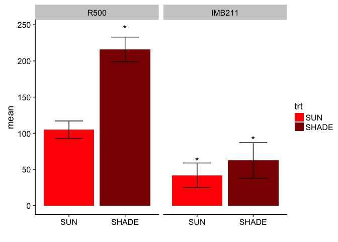

# phenotype_data_analysis_final_final
Ruijuan Li  
September 12, 2016  


```r
# Goal of this script:   
# check whether "leave #", "internode #", "plant height (sum of internode length)", "leafl average", "leafw average", and "petiole length average" are significantly different between trt and gt 
```

# import data 

```r
GC.pheno <- read.csv("/Users/ruijuanli/Desktop/Brassica_project/RNA_seq/data/shade_avoidance_expt_in_GC.csv",na.string=c("NA","N/A")) # replace all NA w/ N/A (the standard missing data format in R)
GH.pheno <- read.csv("/Users/ruijuanli/Desktop/Brassica_project/RNA_seq/data/shade_avoidance_expt_in_GH.csv", na.string=c("NA","N/A"))

head(GC.pheno)
```

```
##   s.no  barcode      X trt days       date leaves No..of.internodes  int1
## 1    1 1IM211A1 IMB211 SUN   38 22/11/2010      7                 2 11.42
## 2    2  1R500A2   R500 SUN   38 22/11/2010      7                 5  4.90
## 3    3 1IM211A3 IMB211 SUN   38 22/11/2010     12                 4  8.24
## 4    4  1R500A4   R500 SUN   38 22/11/2010      8                 5  2.57
## 5    5  1R500B1   R500 SUN   38 22/11/2010      7                 5  3.24
## 6    6 1IM211B2 IMB211 SUN   38 22/11/2010      9                 5  4.33
##    int2  int3  int4  int5 int6 int7 intleng leafl1 leafl2 leafl3 leafl
## 1 13.57    NA    NA    NA   NA   NA    12.5  47.42  53.22  36.86  45.8
## 2 12.17 23.57 35.47 20.64   NA   NA    19.4  71.92  70.50  72.46  71.6
## 3  5.23 13.06 20.52    NA   NA   NA    11.8  54.66  70.03  75.33  66.7
## 4 16.82 31.86 30.00 19.93   NA   NA    20.2  86.98  93.35  82.25  87.5
## 5 13.54  8.37 51.76 19.13   NA   NA    19.2  72.59  74.87  84.09  77.2
## 6  4.28 14.52 18.95 40.59   NA   NA    16.5  58.60  31.98  26.91  39.2
##   leafw1 leafw2 leafw3 leafw pet1.  pet2  pet3 petleng
## 1  19.29  18.82  22.11  20.1 16.05  0.42 21.74    12.7
## 2  49.71  53.65  51.39  51.6 77.06 58.38 58.93    64.8
## 3  34.06  33.89  27.24  31.7 34.04 11.35 25.51    23.6
## 4  60.86  58.48  74.91  64.8 57.59 69.26 63.97    63.6
## 5  48.14  52.09  58.52  52.9 78.84 79.57 78.51    79.0
## 6  32.75  21.97  30.44  28.4 21.07 25.34    NA    23.2
```

```r
head(GH.pheno)
```

```
##   Nos trt rep    date int1 int2 int3 int4 intleng leafl1 leafl2 leafl3
## 1   1  ND   1 10/5/10 23.1 73.0 29.1   NA   125.3   98.4   75.7   79.5
## 2   2  ND   2 10/5/10 14.5 26.2 15.8 31.4    87.8   88.4   94.4   56.5
## 3   3  ND   3 10/5/10 12.6 13.9 35.7 17.9    80.1   87.7   82.1   69.4
## 4   4  ND   4 10/5/10 18.2 31.1 30.5 12.5    92.3   93.5   86.4   59.2
## 5   5  ND   5 10/5/10 30.3 17.1 26.1   NA    73.5   74.1   81.6   53.3
## 6   6  ND   6 10/5/10 17.3 28.7 25.9 17.9    89.7   78.2   75.1   71.9
##   leafw1 leafw2 leafw3 pet1 pet2 pet3 leafleng leafwid leafnum internum
## 1   59.6   54.4   48.9 66.8 82.2 63.0     84.5    54.3       6        3
## 2   57.6   68.2   39.7 79.7 83.2 41.5     79.8    55.2       7        4
## 3   59.7   49.7   55.3 72.5 46.4 66.5     79.7    54.9       6        4
## 4   50.9   54.9   35.0 56.3 35.5 42.7     79.7    46.9       6        4
## 5   56.8   54.4   38.0 83.8 71.9 39.7     69.7    49.7       5        3
## 6   61.2   38.3   52.0 77.8 43.8 64.0     75.1    50.5       6        4
##   species
## 1    R500
## 2    R500
## 3    R500
## 4    R500
## 5    R500
## 6    R500
```

```r
summary(GC.pheno)
```

```
##       s.no           barcode        X         trt          days   
##  Min.   : 1.00   1IM211A1: 1   IMB211:16   SHADE:16   Min.   :38  
##  1st Qu.: 8.75   1IM211A3: 1   R500  :16   SUN  :16   1st Qu.:38  
##  Median :16.50   1IM211B2: 1                          Median :38  
##  Mean   :16.50   1IM211B4: 1                          Mean   :38  
##  3rd Qu.:24.25   1R500A2 : 1                          3rd Qu.:38  
##  Max.   :32.00   1R500A4 : 1                          Max.   :38  
##                  (Other) :26                                      
##          date        leaves       No..of.internodes      int1       
##  22/11/2010:32   Min.   : 5.000   Min.   :2.000     Min.   : 2.570  
##                  1st Qu.: 7.500   1st Qu.:4.000     1st Qu.: 4.900  
##                  Median : 8.000   Median :5.000     Median : 8.240  
##                  Mean   : 7.903   Mean   :4.581     Mean   : 9.108  
##                  3rd Qu.: 8.000   3rd Qu.:5.000     3rd Qu.:11.240  
##                  Max.   :12.000   Max.   :7.000     Max.   :22.090  
##                  NA's   :1        NA's   :1         NA's   :1       
##       int2            int3            int4            int5      
##  Min.   : 4.28   Min.   : 8.03   Min.   : 7.56   Min.   :19.13  
##  1st Qu.:12.26   1st Qu.:15.24   1st Qu.:24.08   1st Qu.:25.19  
##  Median :13.40   Median :20.70   Median :30.21   Median :42.40  
##  Mean   :13.47   Mean   :20.78   Mean   :31.99   Mean   :42.43  
##  3rd Qu.:16.36   3rd Qu.:24.45   3rd Qu.:39.98   3rd Qu.:54.60  
##  Max.   :28.83   Max.   :40.56   Max.   :53.91   Max.   :75.86  
##  NA's   :1       NA's   :4       NA's   :8       NA's   :14     
##       int6            int7          intleng          leafl1      
##  Min.   :54.12   Min.   :53.99   Min.   : 8.70   Min.   : 30.13  
##  1st Qu.:57.81   1st Qu.:57.52   1st Qu.:14.15   1st Qu.: 48.51  
##  Median :62.75   Median :61.05   Median :20.00   Median : 59.00  
##  Mean   :65.75   Mean   :61.05   Mean   :21.45   Mean   : 67.16  
##  3rd Qu.:67.83   3rd Qu.:64.59   3rd Qu.:25.25   3rd Qu.: 87.19  
##  Max.   :89.19   Max.   :68.12   Max.   :43.70   Max.   :114.85  
##  NA's   :26      NA's   :30      NA's   :1       NA's   :1       
##      leafl2           leafl3           leafl           leafw1      
##  Min.   : 31.98   Min.   : 18.47   Min.   : 32.4   Min.   : 18.69  
##  1st Qu.: 44.88   1st Qu.: 37.84   1st Qu.: 43.6   1st Qu.: 29.82  
##  Median : 70.03   Median : 72.46   Median : 66.7   Median : 48.14  
##  Mean   : 67.41   Mean   : 64.93   Mean   : 66.5   Mean   : 47.17  
##  3rd Qu.: 86.06   3rd Qu.: 83.23   3rd Qu.: 87.1   3rd Qu.: 63.26  
##  Max.   :122.54   Max.   :111.51   Max.   :113.2   Max.   :101.01  
##  NA's   :1        NA's   :1        NA's   :1       NA's   :1       
##      leafw2          leafw3          leafw           pet1.      
##  Min.   :13.25   Min.   :12.91   Min.   :16.30   Min.   :14.34  
##  1st Qu.:24.39   1st Qu.:21.77   1st Qu.:24.35   1st Qu.:24.02  
##  Median :51.30   Median :45.21   Median :51.60   Median :57.59  
##  Mean   :45.86   Mean   :42.79   Mean   :45.27   Mean   :48.69  
##  3rd Qu.:62.95   3rd Qu.:60.87   3rd Qu.:65.65   3rd Qu.:73.18  
##  Max.   :93.14   Max.   :83.31   Max.   :88.10   Max.   :94.43  
##  NA's   :1       NA's   :1       NA's   :1       NA's   :1      
##       pet2            pet3          petleng     
##  Min.   : 0.42   Min.   : 4.27   Min.   :10.30  
##  1st Qu.:20.00   1st Qu.:17.95   1st Qu.:20.00  
##  Median :58.38   Median :60.69   Median :60.30  
##  Mean   :48.06   Mean   :48.72   Mean   :47.88  
##  3rd Qu.:77.74   3rd Qu.:78.14   3rd Qu.:75.60  
##  Max.   :86.92   Max.   :94.26   Max.   :89.10  
##  NA's   :1       NA's   :3       NA's   :1
```

```r
summary(GH.pheno)
```

```
##       Nos        trt          rep              date         int1      
##  Min.   : 1.00   D :20   Min.   : 1.000   10/5/10:42   Min.   : 6.70  
##  1st Qu.:11.25   ND:22   1st Qu.: 3.000                1st Qu.:10.84  
##  Median :21.50           Median : 6.000                Median :14.25  
##  Mean   :21.50           Mean   : 5.786                Mean   :16.31  
##  3rd Qu.:31.75           3rd Qu.: 8.000                3rd Qu.:18.00  
##  Max.   :42.00           Max.   :12.000                Max.   :50.30  
##                                                                       
##       int2            int3            int4          intleng      
##  Min.   : 6.89   Min.   :12.02   Min.   : 9.40   Min.   : 34.20  
##  1st Qu.:19.14   1st Qu.:23.81   1st Qu.:17.45   1st Qu.: 66.20  
##  Median :24.82   Median :30.00   Median :24.17   Median : 87.00  
##  Mean   :26.15   Mean   :31.26   Mean   :27.36   Mean   : 89.92  
##  3rd Qu.:30.50   3rd Qu.:36.70   3rd Qu.:34.97   3rd Qu.:111.83  
##  Max.   :73.00   Max.   :57.80   Max.   :73.70   Max.   :173.70  
##                  NA's   :1       NA's   :16                      
##      leafl1           leafl2          leafl3          leafw1     
##  Min.   : 53.16   Min.   :38.70   Min.   :21.40   Min.   :23.95  
##  1st Qu.: 63.01   1st Qu.:54.74   1st Qu.:44.50   1st Qu.:38.63  
##  Median : 70.40   Median :69.09   Median :54.43   Median :44.80  
##  Mean   : 72.23   Mean   :66.48   Mean   :57.36   Mean   :45.23  
##  3rd Qu.: 79.83   3rd Qu.:75.28   3rd Qu.:69.40   3rd Qu.:52.17  
##  Max.   :103.77   Max.   :95.25   Max.   :96.21   Max.   :61.20  
##                   NA's   :1       NA's   :1       NA's   :2      
##      leafw2          leafw3           pet1            pet2      
##  Min.   :20.65   Min.   :14.40   Min.   :56.30   Min.   :35.50  
##  1st Qu.:31.44   1st Qu.:26.48   1st Qu.:64.70   1st Qu.:48.40  
##  Median :40.95   Median :29.65   Median :72.50   Median :57.00  
##  Mean   :40.25   Mean   :33.06   Mean   :71.71   Mean   :58.68  
##  3rd Qu.:49.77   3rd Qu.:40.10   3rd Qu.:77.50   3rd Qu.:68.25  
##  Max.   :68.20   Max.   :59.20   Max.   :90.90   Max.   :83.20  
##  NA's   :2       NA's   :2       NA's   :23      NA's   :23     
##       pet3          leafleng        leafwid         leafnum      
##  Min.   :12.00   Min.   :41.80   Min.   :24.30   Min.   : 5.000  
##  1st Qu.:29.73   1st Qu.:58.42   1st Qu.:34.77   1st Qu.: 6.000  
##  Median :42.10   Median :65.10   Median :37.35   Median : 8.500  
##  Mean   :44.25   Mean   :65.37   Mean   :39.51   Mean   : 8.024  
##  3rd Qu.:60.50   3rd Qu.:74.22   3rd Qu.:47.60   3rd Qu.:10.000  
##  Max.   :85.60   Max.   :84.50   Max.   :58.60   Max.   :14.000  
##  NA's   :24                      NA's   :2                       
##     internum       species  
##  Min.   :2.000   IMB211:22  
##  1st Qu.:3.000   R500  :20  
##  Median :4.000              
##  Mean   :3.595              
##  3rd Qu.:4.000              
##  Max.   :4.000              
## 
```

# reformat data, get a factor for rep 

```r
library("stringr") # to help substring letters use negative to count backwards
```

```
## Warning: package 'stringr' was built under R version 3.2.5
```

```r
# GC 
names(GC.pheno)[3] <- "gt"
GC.pheno$rep <- as.factor(str_sub(GC.pheno$barcode,-2,-2))  # 8 reps 

# 
GC.pheno$height <- GC.pheno$No..of.internodes * GC.pheno$intleng
head(GC.pheno)
```

```
##   s.no  barcode     gt trt days       date leaves No..of.internodes  int1
## 1    1 1IM211A1 IMB211 SUN   38 22/11/2010      7                 2 11.42
## 2    2  1R500A2   R500 SUN   38 22/11/2010      7                 5  4.90
## 3    3 1IM211A3 IMB211 SUN   38 22/11/2010     12                 4  8.24
## 4    4  1R500A4   R500 SUN   38 22/11/2010      8                 5  2.57
## 5    5  1R500B1   R500 SUN   38 22/11/2010      7                 5  3.24
## 6    6 1IM211B2 IMB211 SUN   38 22/11/2010      9                 5  4.33
##    int2  int3  int4  int5 int6 int7 intleng leafl1 leafl2 leafl3 leafl
## 1 13.57    NA    NA    NA   NA   NA    12.5  47.42  53.22  36.86  45.8
## 2 12.17 23.57 35.47 20.64   NA   NA    19.4  71.92  70.50  72.46  71.6
## 3  5.23 13.06 20.52    NA   NA   NA    11.8  54.66  70.03  75.33  66.7
## 4 16.82 31.86 30.00 19.93   NA   NA    20.2  86.98  93.35  82.25  87.5
## 5 13.54  8.37 51.76 19.13   NA   NA    19.2  72.59  74.87  84.09  77.2
## 6  4.28 14.52 18.95 40.59   NA   NA    16.5  58.60  31.98  26.91  39.2
##   leafw1 leafw2 leafw3 leafw pet1.  pet2  pet3 petleng rep height
## 1  19.29  18.82  22.11  20.1 16.05  0.42 21.74    12.7   A   25.0
## 2  49.71  53.65  51.39  51.6 77.06 58.38 58.93    64.8   A   97.0
## 3  34.06  33.89  27.24  31.7 34.04 11.35 25.51    23.6   A   47.2
## 4  60.86  58.48  74.91  64.8 57.59 69.26 63.97    63.6   A  101.0
## 5  48.14  52.09  58.52  52.9 78.84 79.57 78.51    79.0   B   96.0
## 6  32.75  21.97  30.44  28.4 21.07 25.34    NA    23.2   B   82.5
```

```r
GC.pheno.data <- GC.pheno[, c("gt", "trt", "leaves", "No..of.internodes", "leafl", "leafw", "petleng", "rep", "height")]
colnames(GC.pheno.data) <- c("gt", "trt", "leaf_No", "internode_No", "leafl_ave", "leafw_ave", "petleng_ave", "rep", "height")
head(GC.pheno.data)
```

```
##       gt trt leaf_No internode_No leafl_ave leafw_ave petleng_ave rep
## 1 IMB211 SUN       7            2      45.8      20.1        12.7   A
## 2   R500 SUN       7            5      71.6      51.6        64.8   A
## 3 IMB211 SUN      12            4      66.7      31.7        23.6   A
## 4   R500 SUN       8            5      87.5      64.8        63.6   A
## 5   R500 SUN       7            5      77.2      52.9        79.0   B
## 6 IMB211 SUN       9            5      39.2      28.4        23.2   B
##   height
## 1   25.0
## 2   97.0
## 3   47.2
## 4  101.0
## 5   96.0
## 6   82.5
```

```r
# GH 
GH.pheno$rep <- as.factor(GH.pheno$rep)
GH.pheno$rep 
```

```
##  [1] 1  2  3  4  5  6  7  8  9  10 1  2  3  4  5  6  7  8  9  10 1  2  3 
## [24] 4  5  6  7  8  9  10 11 12 1  2  3  4  5  6  7  8  9  10
## Levels: 1 2 3 4 5 6 7 8 9 10 11 12
```

```r
head(GH.pheno)
```

```
##   Nos trt rep    date int1 int2 int3 int4 intleng leafl1 leafl2 leafl3
## 1   1  ND   1 10/5/10 23.1 73.0 29.1   NA   125.3   98.4   75.7   79.5
## 2   2  ND   2 10/5/10 14.5 26.2 15.8 31.4    87.8   88.4   94.4   56.5
## 3   3  ND   3 10/5/10 12.6 13.9 35.7 17.9    80.1   87.7   82.1   69.4
## 4   4  ND   4 10/5/10 18.2 31.1 30.5 12.5    92.3   93.5   86.4   59.2
## 5   5  ND   5 10/5/10 30.3 17.1 26.1   NA    73.5   74.1   81.6   53.3
## 6   6  ND   6 10/5/10 17.3 28.7 25.9 17.9    89.7   78.2   75.1   71.9
##   leafw1 leafw2 leafw3 pet1 pet2 pet3 leafleng leafwid leafnum internum
## 1   59.6   54.4   48.9 66.8 82.2 63.0     84.5    54.3       6        3
## 2   57.6   68.2   39.7 79.7 83.2 41.5     79.8    55.2       7        4
## 3   59.7   49.7   55.3 72.5 46.4 66.5     79.7    54.9       6        4
## 4   50.9   54.9   35.0 56.3 35.5 42.7     79.7    46.9       6        4
## 5   56.8   54.4   38.0 83.8 71.9 39.7     69.7    49.7       5        3
## 6   61.2   38.3   52.0 77.8 43.8 64.0     75.1    50.5       6        4
##   species
## 1    R500
## 2    R500
## 3    R500
## 4    R500
## 5    R500
## 6    R500
```

```r
GH.pheno$petleng_ave <- round(rowMeans(subset(GH.pheno, select=c("pet1", "pet2", "pet3")), na.rm = T), digits = 1)
GH.pheno.data <- GH.pheno[, c("trt", "rep", "intleng", "leafleng", "leafwid", "leafnum", "internum", "species", "petleng_ave")]
colnames(GH.pheno.data) <- c("trt", "rep", "height", "leafl_ave", "leafw_ave", "leaf_No", "internode_No", "gt", "petleng_ave")
head(GH.pheno.data)
```

```
##   trt rep height leafl_ave leafw_ave leaf_No internode_No   gt petleng_ave
## 1  ND   1  125.3      84.5      54.3       6            3 R500        70.7
## 2  ND   2   87.8      79.8      55.2       7            4 R500        68.1
## 3  ND   3   80.1      79.7      54.9       6            4 R500        61.8
## 4  ND   4   92.3      79.7      46.9       6            4 R500        44.8
## 5  ND   5   73.5      69.7      49.7       5            3 R500        65.1
## 6  ND   6   89.7      75.1      50.5       6            4 R500        61.9
```

```r
GH.pheno.data$trt
```

```
##  [1] ND ND ND ND ND ND ND ND ND ND D  D  D  D  D  D  D  D  D  D  ND ND ND
## [24] ND ND ND ND ND ND ND ND ND D  D  D  D  D  D  D  D  D  D 
## Levels: D ND
```

# load the libs 

```r
library(lmerTest) #loads lmerTest and lme4
```

```
## Loading required package: Matrix
```

```
## Loading required package: lme4
```

```
## Warning: package 'lme4' was built under R version 3.2.5
```

```
## 
## Attaching package: 'lmerTest'
```

```
## The following object is masked from 'package:lme4':
## 
##     lmer
```

```
## The following object is masked from 'package:stats':
## 
##     step
```

```r
library(ggplot2)
```

```
## Warning: package 'ggplot2' was built under R version 3.2.5
```

# mixed-effect linear model selection (rep as random effect), using all original data scale 

```r
# GC
# R500_SUN as ref 
# set reference level 
GC.pheno.data$trt <- relevel(GC.pheno.data$trt, ref = "SUN")
GC.pheno.data$gt <- relevel(GC.pheno.data$gt, ref = "R500")

lmer.leaf_No.GC <- lmer(leaf_No ~ gt * trt + (1|rep), data = GC.pheno.data)
summary.leaf_No.GC <- summary(lmer.leaf_No.GC)$coefficient

lmer.internode_No.GC <- lmer(internode_No ~ gt * trt + (1|rep), data = GC.pheno.data)
summary.internode_No.GC <- summary(lmer.internode_No.GC)$coefficient

lmer.leafl_ave.GC <- lmer(leafl_ave ~ gt * trt + (1|rep), data = GC.pheno.data)
summary.leafl_ave.GC <- summary(lmer.leafl_ave.GC)$coefficient

lmer.leafw_ave.GC <- lmer(leafw_ave ~ gt * trt + (1|rep), data = GC.pheno.data)
summary.leafw_ave.GC <- summary(lmer.leafw_ave.GC)$coefficient

lmer.petleng_ave.GC <- lmer(petleng_ave ~ gt * trt + (1|rep), data = GC.pheno.data)
summary.petleng_ave.GC <- summary(lmer.petleng_ave.GC)$coefficient

lmer.height.GC <- lmer(height ~ gt * trt + (1|rep), data = GC.pheno.data)
summary.height.GC <- summary(lmer.height.GC)$coefficient 

# GH 
# R500_SUN as ref level 
GH.pheno.data$trt <- relevel(GH.pheno.data$trt, ref = "ND")
GH.pheno.data$gt <- relevel(GH.pheno.data$gt, ref = "R500")

lmer.height.GH <- lmer(height ~ gt * trt + (1|rep), data = GH.pheno.data)
summary.height.GH <- summary(lmer.height.GH)$coefficient

lmer.leafl_ave.GH <- lmer(leafl_ave ~ gt * trt + (1|rep), data = GH.pheno.data)
summary.leafl_ave.GH <- summary(lmer.leafl_ave.GH)$coefficient

lmer.leafw_ave.GH <- lmer(leafw_ave ~ gt * trt + (1|rep), data = GH.pheno.data)
summary.leafw_ave.GH <- summary(lmer.leafw_ave.GH)$coefficient

lmer.leaf_No.GH <- lmer(leaf_No ~ gt * trt + (1|rep), data = GH.pheno.data)
summary.leaf_No.GH <- summary(lmer.leaf_No.GH)$coefficient

lmer.internode_No.GH <- lmer(internode_No ~ gt * trt + (1|rep), data = GH.pheno.data)
summary.internode_No.GH <- summary(lmer.internode_No.GH)$coefficient

lmer.petleng_ave.GH <- lmer(petleng_ave ~ trt + (1|rep), data = GH.pheno.data) # petleng only has data for one gt 
summary.petleng_ave.GH <- summary(lmer.petleng_ave.GH)$coefficient  
```

# function for plot 

```r
### make plot for trait test 
pheno.plot.result.GC <- function(data){
  tmp <- as.data.frame(data[,c("Estimate", "Std. Error", "Pr(>|t|)")])
  colnames(tmp) <- c("mean", "SE", "pvalue")
  
  tmp$gt <- rep(c("R500", "IMB211"), 2)
  tmp$trt <- c("SUN","SUN","SHADE","SHADE")
  
  tmp$mean[4] = sum(tmp$mean)
  tmp$mean[2] = tmp$mean[1]+tmp$mean[2]
  tmp$mean[3] = tmp$mean[1]+tmp$mean[3]
  
  tmp$ymin <- tmp$mean - tmp$SE
  tmp$ymax <- tmp$mean + tmp$SE
  
  tmp$trt <- factor(tmp$trt, c("SUN", "SHADE"))
  tmp$gt <- factor(tmp$gt, c("R500", "IMB211"))
  
  # add significance level
  tmp$significance[1] <- ""
  if (tmp$pvalue[3] < 0.05){tmp$significance[2] <- "*"}
  if (tmp$pvalue[2] < 0.05){tmp$significance[3] <- "*"}
  # if (data2[,"Pr(>|t|)"][3] < 0.05 && tmp$pvalue[4] < 0.05){tmp$significance[4] <- "*&"}
  # if (data2[,"Pr(>|t|)"][3] < 0.05 && tmp$pvalue[4] > 0.05){tmp$significance[4] <- "*"}
  if (tmp$pvalue[4] < 0.05){tmp$significance[4] <- "*"}
  
  pl <- ggplot(data=tmp)
  pl <- pl + geom_bar(mapping=aes(fill=trt,x=trt,y=mean),stat="identity")
  pl <- pl + scale_fill_manual(values = c("SUN" = "red","SHADE" = "darkred")) 
  pl <- pl + facet_wrap(facets=~gt)
  pl <- pl + geom_errorbar(mapping=aes(x=trt,ymin=ymin,ymax=ymax), position=position_dodge(width=0.9),width=0.5)
  pl <- pl + geom_text(data=tmp,aes(x=trt,y=ymax*1.05), label=factor(tmp$significance), size=5)
  pl <- pl + labs(list(x=" ", y="mean"))
  return(pl) 
} 

pheno.plot.result.GH <- function(data){
  tmp <- as.data.frame(data[,c("Estimate", "Std. Error", "Pr(>|t|)")])
  colnames(tmp) <- c("mean", "SE", "pvalue")
  
  tmp$gt <- rep(c("R500", "IMB211"), 2)
  tmp$trt <- c("uncrowded","uncrowded","crowded","crowded")
  
  tmp$mean[4] = sum(tmp$mean)
  tmp$mean[2] = tmp$mean[1]+tmp$mean[2]
  tmp$mean[3] = tmp$mean[1]+tmp$mean[3]
  
  tmp$ymin <- tmp$mean - tmp$SE
  tmp$ymax <- tmp$mean + tmp$SE
  
  tmp$trt <- factor(tmp$trt, c("uncrowded", "crowded"))
  tmp$gt <- factor(tmp$gt, c("R500", "IMB211"))
  
  # add significance level
  tmp$significance[1] <- ""
  if (tmp$pvalue[3] < 0.05){tmp$significance[2] <- "*"}
  if (tmp$pvalue[2] < 0.05){tmp$significance[3] <- "*"}
  if (tmp$pvalue[4] < 0.05){tmp$significance[4] <- "*"}
  
  pl <- ggplot(data=tmp)
  pl <- pl + geom_bar(mapping=aes(fill=trt,x=trt,y=mean),stat="identity")
  pl <- pl + scale_fill_manual(values = c("uncrowded" = "red","crowded" = "darkred"))  
  pl <- pl + facet_wrap(facets=~gt)
  pl <- pl + geom_errorbar(mapping=aes(x=trt,ymin=ymin,ymax=ymax), position=position_dodge(width=0.9),width=0.5)
  pl <- pl + geom_text(data=tmp,aes(x=trt,y=ymax*1.05), label=factor(tmp$significance), size=5) 
  pl <- pl + labs(list(x=" ", y="mean"))
  return(pl)  
} 
```

# make the lmer result summary plot  

```r
library(cowplot)
```

```
## Warning: package 'cowplot' was built under R version 3.2.5
```

```
## Warning: `legend.margin` must be specified using `margin()`. For the old
## behavior use legend.spacing
```

```
## 
## Attaching package: 'cowplot'
```

```
## The following object is masked from 'package:ggplot2':
## 
##     ggsave
```

```r
head(GC.pheno.data)
```

```
##       gt trt leaf_No internode_No leafl_ave leafw_ave petleng_ave rep
## 1 IMB211 SUN       7            2      45.8      20.1        12.7   A
## 2   R500 SUN       7            5      71.6      51.6        64.8   A
## 3 IMB211 SUN      12            4      66.7      31.7        23.6   A
## 4   R500 SUN       8            5      87.5      64.8        63.6   A
## 5   R500 SUN       7            5      77.2      52.9        79.0   B
## 6 IMB211 SUN       9            5      39.2      28.4        23.2   B
##   height
## 1   25.0
## 2   97.0
## 3   47.2
## 4  101.0
## 5   96.0
## 6   82.5
```

```r
pheno.plot.result.GC(summary.leaf_No.GC)
```


```r
plot.leaf_No.GC <- pheno.plot.result.GC(summary.leaf_No.GC)
# ggsave("/Users/ruijuanli/Desktop/Brassica_project/RNA_seq/output/figure/plot.leaf_No.GC.png", width = 11, height = 8)

pheno.plot.result.GC(summary.internode_No.GC)
```


```r
plot.internode_No.GC <- pheno.plot.result.GC(summary.internode_No.GC)
# ggsave("/Users/ruijuanli/Desktop/Brassica_project/RNA_seq/output/figure/plot.internode_No.GC.png", width = 11, height = 8)

pheno.plot.result.GC(summary.leafl_ave.GC)
```


```r
plot.leafl_ave.GC <- pheno.plot.result.GC(summary.leafl_ave.GC)
# ggsave("/Users/ruijuanli/Desktop/Brassica_project/RNA_seq/output/figure/plot.leafl_ave_GC.png", width = 11, height = 8)

pheno.plot.result.GC(summary.leafw_ave.GC)
```


```r
plot.leafw_ave.GC <- pheno.plot.result.GC(summary.leafw_ave.GC)
# ggsave("/Users/ruijuanli/Desktop/Brassica_project/RNA_seq/output/figure/plot.leafw_ave.GC.png", width = 11, height = 8)

pheno.plot.result.GC(summary.petleng_ave.GC)
```


```r
plot.petleng_ave.GC <- pheno.plot.result.GC(summary.petleng_ave.GC)
# ggsave("/Users/ruijuanli/Desktop/Brassica_project/RNA_seq/output/figure/plot.petleng_ave.GC.png", width = 11, height = 8)

pheno.plot.result.GC(summary.height.GC)
```



```r
plot.height.GC <- pheno.plot.result.GC(summary.height.GC)
# ggsave("/Users/ruijuanli/Desktop/Brassica_project/RNA_seq/output/figure/plot.height.GC.png", width = 11, height = 8)

pheno.plot.result.GH(summary.height.GH)
```


```r
plot.height.GH <- pheno.plot.result.GH(summary.height.GH)
# ggsave("/Users/ruijuanli/Desktop/Brassica_project/RNA_seq/output/figure/plot.height.GH.png", width = 11, height = 8)

pheno.plot.result.GH(summary.leafl_ave.GH)
```


```r
plot.leafl_ave.GH <- pheno.plot.result.GH(summary.leafl_ave.GH)
# ggsave("/Users/ruijuanli/Desktop/Brassica_project/RNA_seq/output/figure/plot.leafl_ave.GH.png", width = 11, height = 8)

pheno.plot.result.GH(summary.leafw_ave.GH)
```


```r
plot.leafw_ave.GH <- pheno.plot.result.GH(summary.leafw_ave.GH)
# ggsave("/Users/ruijuanli/Desktop/Brassica_project/RNA_seq/output/figure/plot.leafw_ave.GH.png", width = 11, height = 8)

pheno.plot.result.GH(summary.leaf_No.GH)
```


```r
plot.leaf_No.GH <- pheno.plot.result.GH(summary.leaf_No.GH)
# ggsave("/Users/ruijuanli/Desktop/Brassica_project/RNA_seq/output/figure/plot.leaf_No.GH.png", width = 11, height = 8)

pheno.plot.result.GH(summary.internode_No.GH)
```


```r
plot.internode_No.GH <- pheno.plot.result.GH(summary.internode_No.GH)
# ggsave("/Users/ruijuanli/Desktop/Brassica_project/RNA_seq/output/figure/plot.internode.GH.png", width = 11, height = 8)

### for rapa paper 
plot.all.paper <-plot_grid(
  plot.height.GC+theme(legend.position="none",axis.text.x=element_blank())+labs(title="plant height", y="Growth Chamber\n mm"),
  plot.leafl_ave.GC+theme(legend.position="none",axis.text.x=element_blank())+labs(title="leaf length", y="mm"),
  plot.leafw_ave.GC+theme(legend.position="none",axis.text.x=element_blank())+labs(title="leaf width", y="mm", fill=""),
  plot.height.GH+theme(legend.position=c("none"),axis.text.x=element_blank())+labs(title=" ", y="Greenhouse\n mm"),
  plot.leafl_ave.GH+theme(legend.position="none",axis.text.x=element_blank())+labs(title=" ", y="mm"),
  plot.leafw_ave.GH+theme(legend.position="none",axis.text.x=element_blank())+labs(title=" ", y="mm", x="", fill=""),
  ncol=3, nrow = 2,labels=c("","","",""))  
```

```
## Warning: `panel.margin` is deprecated. Please use `panel.spacing` property
## instead
```

```r
plot.all.paper   
```


