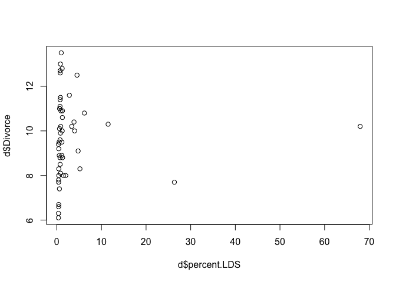

# Statistical Rethinking Chapter 4 problems

__Name: Ruijuan 


# For 04/11/2016

## 5E1 
```{}
2 & 4
3 is only one predictor, dosen't fit the definition of multiple linear regression: 
As a predictive analysis, the multiple linear regression is used to explain the relationship 
between one continuous depedent variable from two or more independent variables. 
```

## 5E2
```{}
write down a multiple regression to evaluate the claim: 
Animal diversity is linearly related to latitude, but only after contolling for plant diversity. 
(refer to counterfactual plot section?)
Da ~ a + BlL+BpDp
Da: animal diversity
a: intercept
Bl: coefficient that measures the association between latitude and animal diveristy
L: latitude
Bp: coefficient that measures the plant diversity between latitude and animal diveristy
Dp: plant diversity as a constant 
```

## 5M1
```{}
spurious significant SNP VS. population structure and phenotypic data 
spurious significant SNPs are associated with phenotypic data and population structure. 
But when population structure is entered in the model, the correlation between spurious significant 
SNPs and phenotypic data should mostly vanish. 
```

## 5M3
```{}
"How might a high divorce rate cause a high marriage rate"? think of a way to evaluate this
relationship using multiple regression. 
M ~ a + BD + other factors 
M: marriage rate
a: intercept
B: association between marriage rate and divorce rate
other factors???
first marriage or second marriage... 
```

## 5M4
```{}
In the divorce data, state with high number of Mormons (LDS) have much lower divorce rate than 
the regression model expected. Find a list of LDS population by state and use those numbers as 
a predictor variable, predicting divorce rate using marriage rate, median age at marriage, and 
percent LDS population (possibly standardized). You may consider transformation of the raw 
percent LDS variable. 
```


```r
library(rethinking)
```

```
## Loading required package: rstan
```

```
## Loading required package: ggplot2
```

```
## Warning: package 'ggplot2' was built under R version 3.2.4
```

```
## rstan (Version 2.9.0-3, packaged: 2016-02-11 15:54:41 UTC, GitRev: 05c3d0058b6a)
```

```
## For execution on a local, multicore CPU with excess RAM we recommend calling
## rstan_options(auto_write = TRUE)
## options(mc.cores = parallel::detectCores())
```

```
## Loading required package: parallel
```

```
## rethinking (Version 1.58)
```

```r
data("WaffleDivorce")
d <- WaffleDivorce
LDS <- read.csv("~/Desktop/2016_spring/R_club/homework/Rclub-rethinking_Ruijuan.Li/new/Assignment_Chapter_05/LDS.csv")
head(LDS)
```

```
##        state percent.LDS
## 1    Alabama        0.75
## 2     Alaska        4.53
## 3    Arizona        6.18
## 4   Arkansas        1.00
## 5 California        2.01
## 6   Colorado        2.82
```

```r
summary(d)
```

```
##        Location       Loc       Population     MedianAgeMarriage
##  Alabama   : 1   AK     : 1   Min.   : 0.560   Min.   :23.20    
##  Alaska    : 1   AL     : 1   1st Qu.: 1.635   1st Qu.:25.32    
##  Arizona   : 1   AR     : 1   Median : 4.435   Median :25.90    
##  Arkansas  : 1   AZ     : 1   Mean   : 6.120   Mean   :26.05    
##  California: 1   CA     : 1   3rd Qu.: 6.678   3rd Qu.:26.75    
##  Colorado  : 1   CO     : 1   Max.   :37.250   Max.   :29.70    
##  (Other)   :44   (Other):44                                     
##     Marriage      Marriage.SE       Divorce         Divorce.SE    
##  Min.   :13.50   Min.   :0.390   Min.   : 6.100   Min.   :0.2400  
##  1st Qu.:17.12   1st Qu.:0.810   1st Qu.: 8.300   1st Qu.:0.5725  
##  Median :19.70   Median :1.185   Median : 9.750   Median :0.7950  
##  Mean   :20.11   Mean   :1.399   Mean   : 9.688   Mean   :0.9618  
##  3rd Qu.:22.10   3rd Qu.:1.768   3rd Qu.:10.900   3rd Qu.:1.2575  
##  Max.   :30.70   Max.   :3.920   Max.   :13.500   Max.   :2.5000  
##                                                                   
##   WaffleHouses        South        Slaves1860     Population1860   
##  Min.   :  0.00   Min.   :0.00   Min.   :     0   Min.   :      0  
##  1st Qu.:  0.00   1st Qu.:0.00   1st Qu.:     0   1st Qu.:  43321  
##  Median :  1.00   Median :0.00   Median :     0   Median : 407722  
##  Mean   : 32.34   Mean   :0.28   Mean   : 79378   Mean   : 628729  
##  3rd Qu.: 39.75   3rd Qu.:1.00   3rd Qu.: 80828   3rd Qu.: 920977  
##  Max.   :381.00   Max.   :1.00   Max.   :490865   Max.   :3880735  
##                                                                    
##  PropSlaves1860   
##  Min.   :0.00000  
##  1st Qu.:0.00000  
##  Median :0.00000  
##  Mean   :0.09405  
##  3rd Qu.:0.08500  
##  Max.   :0.57000  
## 
```

```r
nrow(d)
```

```
## [1] 50
```

```r
nrow(LDS)
```

```
## [1] 51
```

```r
head(d)
```

```
##     Location Loc Population MedianAgeMarriage Marriage Marriage.SE Divorce
## 1    Alabama  AL       4.78              25.3     20.2        1.27    12.7
## 2     Alaska  AK       0.71              25.2     26.0        2.93    12.5
## 3    Arizona  AZ       6.33              25.8     20.3        0.98    10.8
## 4   Arkansas  AR       2.92              24.3     26.4        1.70    13.5
## 5 California  CA      37.25              26.8     19.1        0.39     8.0
## 6   Colorado  CO       5.03              25.7     23.5        1.24    11.6
##   Divorce.SE WaffleHouses South Slaves1860 Population1860 PropSlaves1860
## 1       0.79          128     1     435080         964201           0.45
## 2       2.05            0     0          0              0           0.00
## 3       0.74           18     0          0              0           0.00
## 4       1.22           41     1     111115         435450           0.26
## 5       0.24            0     0          0         379994           0.00
## 6       0.94           11     0          0          34277           0.00
```

```r
d <- merge(d, LDS, by.x ="Location", by.y="state") # merge these two datasets by "Location" of d and "state" of LDS
nrow(d) # one state was dropped due to missing data of LDS
```

```
## [1] 50
```

```r
# transform the LDS data and standadization
d$percent.LDS.log10 <- log10(d$percent.LDS) # log10 transformation
d$percent.LDS.log10.s <- (d$percent.LDS.log10-mean(d$percent.LDS.log10))/sd(d$percent.LDS.log10) # log10 transformation & standardization

d$percent.LDS.s <- (d$percent.LDS-mean(d$percent.LDS))/sd(d$percent.LDS) # just standadization
# standadization marriage rate and median age marriage rate
d$Marriage.s <- (d$Marriage-mean(d$Marriage))/sd(d$Marriage) 
d$MedianAgeMarriage.s <- (d$MedianAgeMarriage-mean(d$MedianAgeMarriage))/sd(d$MedianAgeMarriage)

plot(d$percent.LDS, d$Divorce)
```



```r
# model with untransformed data
m5M4.1 <- map(alist(
  Divorce ~ dnorm(mu, sigma),
  mu <- a + bR*Marriage.s + bA*MedianAgeMarriage.s + bLDS*percent.LDS.s,
  a ~ dnorm(10,10),
  bR ~ dnorm(0,1),
  bA ~ dnorm(0,1),
  bLDS ~ dnorm(0,1),
  sigma ~ dunif(0,20)),
  data=d)

precis(m5M4.1)
```

```
##        Mean StdDev  5.5% 94.5%
## a      9.69   0.19  9.38  9.99
## bR     0.06   0.27 -0.38  0.49
## bA    -1.27   0.27 -1.70 -0.85
## bLDS  -0.58   0.22 -0.93 -0.23
## sigma  1.34   0.13  1.13  1.56
```

```r
# model with transformed data
m5M4.2 <- map(alist(
  Divorce ~ dnorm(mu, sigma),
  mu <- a + bR*Marriage.s + bA*MedianAgeMarriage.s + bLDS*percent.LDS.log10.s,
  a ~ dnorm(10,10),
  bR ~ dnorm(0,1),
  bA ~ dnorm(0,1),
  bLDS ~ dnorm(0,1),
  sigma ~ dunif(0,20)),
  data=d)

precis(m5M4.2)
```

```
##        Mean StdDev  5.5% 94.5%
## a      9.69   0.19  9.38 10.00
## bR     0.13   0.30 -0.35  0.60
## bA    -1.29   0.28 -1.74 -0.85
## bLDS  -0.54   0.27 -0.98 -0.10
## sigma  1.38   0.14  1.16  1.60
```

```r
# the untransformed data fit better because it's 89% confidence intervals are further away from 0.
# -0.98 & -0.10 VS -0.93 & -0.23
```


