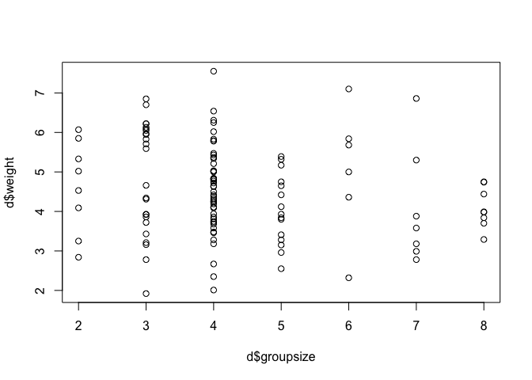

# Chapter-05-part2-assignment
# Statistical Rethinking Chapter 5 problems

# __Name: Ruijuan Li


# For 04/18/2016 postponed to 04/25/2016

## 5M2 

```r
# Invent your own example of a masked relationship. An outcome variable should be correlated with both predictor variables, but in opposite directions. And the two predictor variables should be correlated with one another. 
```


```r
# Carbohydrate intake is positively correlated with BMI, fruit/vegetable intake is negatively correlated with BMI. Carbohydrate intake and fruit/vetetable intake are correlated with one another. 
```

## 5H1 

```r
# Fit two bivariate Gaussian regressions, using map: (1) body weight as a linear function of territory size (area), and (2) body weight as a linear function of groupsize. Plot the results of these regressions, displaying the MAP regression line and the 95% interval of the mean. Is either variable important for predicting fox body weight? 
```


```r
library(rethinking)
```

```
## Loading required package: rstan
```

```
## Loading required package: ggplot2
```

```
## rstan (Version 2.9.0-3, packaged: 2016-02-11 15:54:41 UTC, GitRev: 05c3d0058b6a)
```

```
## For execution on a local, multicore CPU with excess RAM we recommend calling
## rstan_options(auto_write = TRUE)
## options(mc.cores = parallel::detectCores())
```

```
## Loading required package: parallel
```

```
## rethinking (Version 1.58)
```

```r
data("foxes")
d <- foxes
d
```

```
##     group avgfood groupsize area weight
## 1       1    0.37         2 1.09   5.02
## 2       1    0.37         2 1.09   2.84
## 3       2    0.53         2 2.05   5.33
## 4       2    0.53         2 2.05   6.07
## 5       3    0.49         2 2.12   5.85
## 6       3    0.49         2 2.12   3.25
## 7       4    0.45         2 1.29   4.53
## 8       4    0.45         2 1.29   4.09
## 9       5    0.74         3 3.78   6.13
## 10      5    0.74         3 3.78   5.59
## 11      5    0.74         3 3.78   5.83
## 12      6    0.57         3 2.24   3.93
## 13      6    0.57         3 2.24   4.34
## 14      6    0.57         3 2.24   6.09
## 15      7    0.74         3 2.75   6.85
## 16      7    0.74         3 2.75   6.05
## 17      7    0.74         3 2.75   3.21
## 18      8    0.42         3 1.88   3.72
## 19      8    0.42         3 1.88   3.92
## 20      8    0.42         3 1.88   5.71
## 21      9    0.68         3 3.77   5.95
## 22      9    0.68         3 3.77   4.66
## 23      9    0.68         3 3.77   6.22
## 24     10    0.65         3 1.73   6.70
## 25     10    0.65         3 1.73   6.22
## 26     10    0.65         3 1.73   1.92
## 27     11    0.51         3 2.21   4.31
## 28     11    0.51         3 2.21   3.43
## 29     11    0.51         3 2.21   5.97
## 30     12    0.98         7 3.84   5.30
## 31     12    0.98         7 3.84   3.88
## 32     12    0.98         7 3.84   3.18
## 33     12    0.98         7 3.84   2.78
## 34     12    0.98         7 3.84   2.99
## 35     12    0.98         7 3.84   3.58
## 36     12    0.98         7 3.84   6.86
## 37     13    0.60         4 3.02   4.24
## 38     13    0.60         4 3.02   3.46
## 39     13    0.60         4 3.02   4.19
## 40     13    0.60         4 3.02   2.35
## 41     14    0.77         4 3.43   4.72
## 42     14    0.77         4 3.43   4.42
## 43     14    0.77         4 3.43   4.83
## 44     14    0.77         4 3.43   6.02
## 45     15    0.73         4 2.65   5.83
## 46     15    0.73         4 2.65   5.02
## 47     15    0.73         4 2.65   5.37
## 48     15    0.73         4 2.65   2.01
## 49     16    0.72         4 3.54   4.25
## 50     16    0.72         4 3.54   4.38
## 51     16    0.72         4 3.54   4.84
## 52     16    0.72         4 3.54   3.18
## 53     17    0.66         4 2.45   4.63
## 54     17    0.66         4 2.45   3.86
## 55     17    0.66         4 2.45   4.82
## 56     17    0.66         4 2.45   6.54
## 57     18    1.21         8 5.07   3.29
## 58     18    1.21         8 5.07   3.99
## 59     18    1.21         8 5.07   3.84
## 60     18    1.21         8 5.07   3.98
## 61     18    1.21         8 5.07   4.44
## 62     18    1.21         8 5.07   4.74
## 63     18    1.21         8 5.07   3.70
## 64     18    1.21         8 5.07   4.75
## 65     19    0.68         4 2.59   5.21
## 66     19    0.68         4 2.59   5.78
## 67     19    0.68         4 2.59   4.50
## 68     19    0.68         4 2.59   3.28
## 69     20    0.78         4 3.13   3.68
## 70     20    0.78         4 3.13   3.72
## 71     20    0.78         4 3.13   4.29
## 72     20    0.78         4 3.13   3.58
## 73     21    0.78         4 3.56   3.75
## 74     21    0.78         4 3.56   2.67
## 75     21    0.78         4 3.56   5.43
## 76     21    0.78         4 3.56   6.31
## 77     22    0.80         4 3.35   5.79
## 78     22    0.80         4 3.35   4.64
## 79     22    0.80         4 3.35   5.34
## 80     22    0.80         4 3.35   7.55
## 81     23    0.69         4 3.16   4.77
## 82     23    0.69         4 3.16   3.48
## 83     23    0.69         4 3.16   4.33
## 84     23    0.69         4 3.16   5.03
## 85     24    0.71         4 3.04   4.09
## 86     24    0.71         4 3.04   4.11
## 87     24    0.71         4 3.04   5.47
## 88     24    0.71         4 3.04   6.25
## 89     25    1.03         5 3.66   4.75
## 90     25    1.03         5 3.66   5.32
## 91     25    1.03         5 3.66   5.39
## 92     25    1.03         5 3.66   3.84
## 93     25    1.03         5 3.66   3.15
## 94     26    0.78         5 3.92   5.17
## 95     26    0.78         5 3.92   4.42
## 96     26    0.78         5 3.92   4.65
## 97     26    0.78         5 3.92   3.80
## 98     26    0.78         5 3.92   3.41
## 99     27    0.79         5 2.89   4.12
## 100    27    0.79         5 2.89   3.28
## 101    27    0.79         5 2.89   3.93
## 102    27    0.79         5 2.89   2.96
## 103    27    0.79         5 2.89   2.55
## 104    28    0.91         6 4.54   5.00
## 105    28    0.91         6 4.54   4.36
## 106    28    0.91         6 4.54   7.10
## 107    28    0.91         6 4.54   5.84
## 108    28    0.91         6 4.54   5.68
## 109    28    0.91         6 4.54   2.32
## 110    29    0.67         4 2.75   5.00
## 111    29    0.67         4 2.75   3.81
## 112    29    0.67         4 2.75   4.81
## 113    29    0.67         4 2.75   3.94
## 114    30    0.41         3 1.91   3.16
## 115    30    0.41         3 1.91   2.78
## 116    30    0.41         3 1.91   3.86
```

```r
plot(d$area, d$weight)
```


```r
plot(d$groupsize, d$weight)
```



```r
# 1) body weight as a linear function of territory size (area)
m5H1.1 <- map(
  alist(
    weight ~ dnorm(mu, sigma),
    mu <- a + ba*area,
    a ~ dnorm(0, 100),
    ba ~ dnorm(0, 10),
    sigma ~ dunif(0, 10)
  ), 
  data = d)

precis(m5H1.1, digits = 3, prob = 0.95)
```

```
##        Mean StdDev   2.5% 97.5%
## a     4.451  0.391  3.685 5.217
## ba    0.025  0.118 -0.207 0.257
## sigma 1.179  0.077  1.027 1.330
```

```r
# 2) body weight as a linear function of groupsize
m5H1.2 <- map(
  alist(
    weight ~ dnorm(mu, sigma),
    mu <- a + bg* groupsize,
    a ~ dnorm(0, 100),
    bg ~ dnorm(0, 10),
    sigma ~ dunif(0, 10)
  ), 
  data = d)
# Q: how to determine the prior??? 

precis(m5H1.2, digits = 3, prob = 0.95)
```

```
##         Mean StdDev   2.5% 97.5%
## a      5.068  0.325  4.431 5.705
## bg    -0.124  0.071 -0.262 0.014
## sigma  1.164  0.076  1.014 1.313
```

```r
# the coeffecient is very small, close to zero with 95% intervals on both sides of zero, seems not important 
cor(d$groupsize, d$area) # 0.8275945 
```

```
## [1] 0.8275945
```

## 5H2 

```r
# Now fit a multiple linear regression with weight as the outcome and both area and groupsize as predictor variables. Plot the predictions of the model for each predictor, holding the other predictor constant at its mean. What does this model say about the importance of each variable? Why do you get different results than you got in the exercise just above?
```


```r
# fit a multivariate regression
m5H2 <- map(
  alist(
    weight ~ dnorm(mu, sigma),
    mu <- a + ba*area + bg*groupsize,
    a ~ dnorm(0, 100),
    ba ~ dnorm(0, 10),
    bg ~ dnorm(0, 10),
    sigma ~ dunif(0, 10)
  ), 
  data = d)
precis(m5H2)
```

```
##        Mean StdDev  5.5% 94.5%
## a      4.45   0.37  3.86  5.04
## ba     0.62   0.20  0.30  0.94
## bg    -0.43   0.12 -0.63 -0.24
## sigma  1.12   0.07  1.00  1.24
```

```r
# now looks like they both become important in prediction

# with area fixed  
mean.area <- mean(d$area)

np.seq <- 0:10
pred.data <- data.frame(
  groupsize = np.seq,
  area=mean.area
)

mu <- link(m5H2, data = pred.data, n = 1e4)
```

```
## [ 1000 / 10000 ]
[ 2000 / 10000 ]
[ 3000 / 10000 ]
[ 4000 / 10000 ]
[ 5000 / 10000 ]
[ 6000 / 10000 ]
[ 7000 / 10000 ]
[ 8000 / 10000 ]
[ 9000 / 10000 ]
[ 10000 / 10000 ]
```

```r
mu.mean <- apply(mu, 2, mean)
mu.PI <- apply(mu, 2, PI)

plot(weight ~ groupsize, data=d, type="n")
lines(np.seq, mu.mean)
lines(np.seq, mu.PI[1,], lty=2)
lines(np.seq, mu.PI[2,], lty=2)
```


```r
# # with groupsize fixed 
mean.groupsize <- mean(d$groupsize)

np.seq <- 0:10
pred.data <- data.frame(
  area = np.seq,
  groupsize=mean.groupsize
)

mu <- link(m5H2, data = pred.data, n = 1e4)
```

```
## [ 1000 / 10000 ]
[ 2000 / 10000 ]
[ 3000 / 10000 ]
[ 4000 / 10000 ]
[ 5000 / 10000 ]
[ 6000 / 10000 ]
[ 7000 / 10000 ]
[ 8000 / 10000 ]
[ 9000 / 10000 ]
[ 10000 / 10000 ]
```

```r
mu.mean <- apply(mu, 2, mean)
mu.PI <- apply(mu, 2, PI)

plot(weight ~ area, data=d, type="n")
lines(np.seq, mu.mean)
lines(np.seq, mu.PI[1,], lty=2)
lines(np.seq, mu.PI[2,], lty=2)
```


## 5H3 

```r
# Finally, consider the avgfood variable. Fit two more multiple regressions: (1) body weight as an additive function of avgfood and groupsize, and (2) body weight as an additive function of all three variables, avgfood and groupsize and area. Compare the results of these models to the previous models you've fit, in the first two exercises. (a) Is avgfood or area a better predictor of body weight? If you had to choose one or the other to include in a model, which would it be? Support your assessment with any tables or plots you choose. 
```


```r
d
```

```
##     group avgfood groupsize area weight
## 1       1    0.37         2 1.09   5.02
## 2       1    0.37         2 1.09   2.84
## 3       2    0.53         2 2.05   5.33
## 4       2    0.53         2 2.05   6.07
## 5       3    0.49         2 2.12   5.85
## 6       3    0.49         2 2.12   3.25
## 7       4    0.45         2 1.29   4.53
## 8       4    0.45         2 1.29   4.09
## 9       5    0.74         3 3.78   6.13
## 10      5    0.74         3 3.78   5.59
## 11      5    0.74         3 3.78   5.83
## 12      6    0.57         3 2.24   3.93
## 13      6    0.57         3 2.24   4.34
## 14      6    0.57         3 2.24   6.09
## 15      7    0.74         3 2.75   6.85
## 16      7    0.74         3 2.75   6.05
## 17      7    0.74         3 2.75   3.21
## 18      8    0.42         3 1.88   3.72
## 19      8    0.42         3 1.88   3.92
## 20      8    0.42         3 1.88   5.71
## 21      9    0.68         3 3.77   5.95
## 22      9    0.68         3 3.77   4.66
## 23      9    0.68         3 3.77   6.22
## 24     10    0.65         3 1.73   6.70
## 25     10    0.65         3 1.73   6.22
## 26     10    0.65         3 1.73   1.92
## 27     11    0.51         3 2.21   4.31
## 28     11    0.51         3 2.21   3.43
## 29     11    0.51         3 2.21   5.97
## 30     12    0.98         7 3.84   5.30
## 31     12    0.98         7 3.84   3.88
## 32     12    0.98         7 3.84   3.18
## 33     12    0.98         7 3.84   2.78
## 34     12    0.98         7 3.84   2.99
## 35     12    0.98         7 3.84   3.58
## 36     12    0.98         7 3.84   6.86
## 37     13    0.60         4 3.02   4.24
## 38     13    0.60         4 3.02   3.46
## 39     13    0.60         4 3.02   4.19
## 40     13    0.60         4 3.02   2.35
## 41     14    0.77         4 3.43   4.72
## 42     14    0.77         4 3.43   4.42
## 43     14    0.77         4 3.43   4.83
## 44     14    0.77         4 3.43   6.02
## 45     15    0.73         4 2.65   5.83
## 46     15    0.73         4 2.65   5.02
## 47     15    0.73         4 2.65   5.37
## 48     15    0.73         4 2.65   2.01
## 49     16    0.72         4 3.54   4.25
## 50     16    0.72         4 3.54   4.38
## 51     16    0.72         4 3.54   4.84
## 52     16    0.72         4 3.54   3.18
## 53     17    0.66         4 2.45   4.63
## 54     17    0.66         4 2.45   3.86
## 55     17    0.66         4 2.45   4.82
## 56     17    0.66         4 2.45   6.54
## 57     18    1.21         8 5.07   3.29
## 58     18    1.21         8 5.07   3.99
## 59     18    1.21         8 5.07   3.84
## 60     18    1.21         8 5.07   3.98
## 61     18    1.21         8 5.07   4.44
## 62     18    1.21         8 5.07   4.74
## 63     18    1.21         8 5.07   3.70
## 64     18    1.21         8 5.07   4.75
## 65     19    0.68         4 2.59   5.21
## 66     19    0.68         4 2.59   5.78
## 67     19    0.68         4 2.59   4.50
## 68     19    0.68         4 2.59   3.28
## 69     20    0.78         4 3.13   3.68
## 70     20    0.78         4 3.13   3.72
## 71     20    0.78         4 3.13   4.29
## 72     20    0.78         4 3.13   3.58
## 73     21    0.78         4 3.56   3.75
## 74     21    0.78         4 3.56   2.67
## 75     21    0.78         4 3.56   5.43
## 76     21    0.78         4 3.56   6.31
## 77     22    0.80         4 3.35   5.79
## 78     22    0.80         4 3.35   4.64
## 79     22    0.80         4 3.35   5.34
## 80     22    0.80         4 3.35   7.55
## 81     23    0.69         4 3.16   4.77
## 82     23    0.69         4 3.16   3.48
## 83     23    0.69         4 3.16   4.33
## 84     23    0.69         4 3.16   5.03
## 85     24    0.71         4 3.04   4.09
## 86     24    0.71         4 3.04   4.11
## 87     24    0.71         4 3.04   5.47
## 88     24    0.71         4 3.04   6.25
## 89     25    1.03         5 3.66   4.75
## 90     25    1.03         5 3.66   5.32
## 91     25    1.03         5 3.66   5.39
## 92     25    1.03         5 3.66   3.84
## 93     25    1.03         5 3.66   3.15
## 94     26    0.78         5 3.92   5.17
## 95     26    0.78         5 3.92   4.42
## 96     26    0.78         5 3.92   4.65
## 97     26    0.78         5 3.92   3.80
## 98     26    0.78         5 3.92   3.41
## 99     27    0.79         5 2.89   4.12
## 100    27    0.79         5 2.89   3.28
## 101    27    0.79         5 2.89   3.93
## 102    27    0.79         5 2.89   2.96
## 103    27    0.79         5 2.89   2.55
## 104    28    0.91         6 4.54   5.00
## 105    28    0.91         6 4.54   4.36
## 106    28    0.91         6 4.54   7.10
## 107    28    0.91         6 4.54   5.84
## 108    28    0.91         6 4.54   5.68
## 109    28    0.91         6 4.54   2.32
## 110    29    0.67         4 2.75   5.00
## 111    29    0.67         4 2.75   3.81
## 112    29    0.67         4 2.75   4.81
## 113    29    0.67         4 2.75   3.94
## 114    30    0.41         3 1.91   3.16
## 115    30    0.41         3 1.91   2.78
## 116    30    0.41         3 1.91   3.86
```

```r
# 1) body weight as an additive function of avgfood and groupsize
m5H3.1 <- map(
  alist(
    weight ~ dnorm(mu, sigma),
    mu <- a + bav*avgfood + bg*groupsize,
    a ~ dnorm(0, 100),
    bav ~ dnorm(0, 10),
    bg ~ dnorm(0, 10),
    sigma ~ dunif(0, 10)
  ), 
  data = d)
precis(m5H3.1)
```

```
##        Mean StdDev  5.5% 94.5%
## a      4.14   0.43  3.45  4.83
## bav    3.77   1.20  1.85  5.70
## bg    -0.56   0.16 -0.81 -0.31
## sigma  1.12   0.07  1.00  1.23
```

```r
# 2) body weight as an additive function of all three variables, avgfood and groupsize and area
m5H3.2 <- map(
  alist(
    weight ~ dnorm(mu, sigma),
    mu <- a + ba*area + bav *avgfood + bg*groupsize, 
    a ~ dnorm(0, 100),
    c(ba,bav,bg) ~ dnorm(0, 10), 
    sigma ~ dunif(0, 10)
  ),
  data = d)
precis(m5H3.2)
```

```
##        Mean StdDev  5.5% 94.5%
## a      4.07   0.43  3.39  4.76
## ba     0.39   0.24  0.01  0.77
## bav    2.46   1.44  0.16  4.75
## bg    -0.60   0.16 -0.85 -0.35
## sigma  1.10   0.07  0.99  1.22
```

```r
# based on number, looks like avgfood, I would choose avgfood, because it has a greater mean value of coefficient. 
# Q: how to decide which is the better predictor??? 

# (b) When both avgfood or area are in the same model, their effects are reduced (closer to zero) and their standard errors are larger than when they are included in separate models. Can you explain this result?

# when only avgfood is included in the model
m5H3.3 <- map(
  alist(
    weight ~ dnorm(mu, sigma),
    mu <- a + bav*avgfood,
    a ~ dnorm(0, 100),
    bav ~ dnorm(0, 10),
    sigma ~ dunif(0, 10)
  ), 
  data = d)

precis(m5H3.3, digits = 3, prob = 0.95)
```

```
##         Mean StdDev   2.5% 97.5%
## a      4.642  0.430  3.799 5.485
## bav   -0.149  0.553 -1.233 0.936
## sigma  1.179  0.077  1.027 1.330
```

```r
# when only area is included in the model
m5H1.1 <- map(
  alist(
    weight ~ dnorm(mu, sigma),
    mu <- a + ba*area,
    a ~ dnorm(0, 100),
    ba ~ dnorm(0, 10),
    sigma ~ dunif(0, 10)
  ), 
  data = d)

precis(m5H1.1, digits = 3, prob = 0.95)
```

```
##        Mean StdDev   2.5% 97.5%
## a     4.451  0.391  3.685 5.217
## ba    0.025  0.118 -0.207 0.257
## sigma 1.179  0.077  1.027 1.330
```

```r
# when both avgfood & area included in the model
m5H3.4 <- map(
  alist(
    weight ~ dnorm(mu, sigma),
    mu <- a + ba*area + bav*avgfood,
    a ~ dnorm(0, 100),
    ba ~ dnorm(0, 10),
    bav ~ dnorm(0, 10),
    sigma ~ dunif(0, 10)
  ), 
  data = d)
precis(m5H3.4)
```

```
##        Mean StdDev  5.5% 94.5%
## a      4.62   0.43  3.94  5.31
## ba     0.24   0.25 -0.16  0.64
## bav   -1.13   1.17 -3.00  0.74
## sigma  1.17   0.08  1.05  1.30
```

```r
# the question that multiple linear regression answers: What is the value of knowing each 
# predictor, after already knowing all of the other predictors? 

cor(d$avgfood, d$area) # 0.8831038 very high correlation between avgfood & area... 
```

```
## [1] 0.8831038
```

```r
# When both avgfood or area are in the same model, their effects are reduced (closer to zero) and 
# their standard errors are larger than when they are included in separate models: This means
# there is negative values of knowing avgfood/area after already knowing area/avgfood. why? 

# 
```


