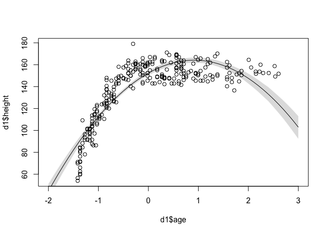

# Chapter-06-part3-assignment
Ruijuan Li  
May 21, 2016  

# 6M2

```r
# Explain the difference between model selection and model averaging. What information is lost under model selection? What information is lost under model averaging? 

# model selection means choosing the model w/ the lowest AIC/DIC/WAIC value and the discarding the others
# model averaging means using DIC/WAIC to construct a posterior predictive distribution that exploit what we know about relative accuary of the models (don't understand thouroughly...)

# under model selection, the info about relative model accuracy contained in the differences among the AIC/DIC/WAIC values are discarded. (don't understand thouroughly...)

# under model averaging ... ??? (come back later...)
```

# 6M3

```r
library(rethinking)
```

```
## Loading required package: rstan
```

```
## Loading required package: ggplot2
```

```
## rstan (Version 2.9.0-3, packaged: 2016-02-11 15:54:41 UTC, GitRev: 05c3d0058b6a)
```

```
## For execution on a local, multicore CPU with excess RAM we recommend calling
## rstan_options(auto_write = TRUE)
## options(mc.cores = parallel::detectCores())
```

```
## Loading required package: parallel
```

```
## rethinking (Version 1.58)
```

```r
data(cars)
m <- map(
  alist(
    dist ~ dnorm(mu, sigma),
    mu <- a + b*speed,
    a ~ dnorm(0, 100),
    b ~ dnorm(0, 10),
    sigma ~ dunif(0, 30)
  ), data = cars)

DIC(m) # 419.5488
```

```
## [1] 419.3132
## attr(,"pD")
## [1] 3.077808
```

```r
WAIC(m) # 420.6079
```

```
## Constructing posterior predictions
```

```
## [ 100 / 1000 ]
[ 200 / 1000 ]
[ 300 / 1000 ]
[ 400 / 1000 ]
[ 500 / 1000 ]
[ 600 / 1000 ]
[ 700 / 1000 ]
[ 800 / 1000 ]
[ 900 / 1000 ]
[ 1000 / 1000 ]
```

```
## [1] 420.8394
## attr(,"lppd")
## [1] -206.4692
## attr(,"pWAIC")
## [1] 3.950541
## attr(,"se")
## [1] 13.98535
```

```r
# with smaller number of prior 
cars.small <- cars[1:25,]
m <- map(
  alist(
    dist ~ dnorm(mu, sigma),
    mu <- a + b*speed,
    a ~ dnorm(0, 100),
    b ~ dnorm(0, 10),
    sigma ~ dunif(0, 30)
  ), data = cars.small)
DIC(m) # 205.9512
```

```
## [1] 206.4233
## attr(,"pD")
## [1] 3.421549
```

```r
WAIC(m) # 210.4056
```

```
## Constructing posterior predictions
```

```
## [ 100 / 1000 ]
[ 200 / 1000 ]
[ 300 / 1000 ]
[ 400 / 1000 ]
[ 500 / 1000 ]
[ 600 / 1000 ]
[ 700 / 1000 ]
[ 800 / 1000 ]
[ 900 / 1000 ]
[ 1000 / 1000 ]
```

```
## [1] 211.6496
## attr(,"lppd")
## [1] -99.39186
## attr(,"pWAIC")
## [1] 6.432953
## attr(,"se")
## [1] 18.43365
```

# 6M4

```r
# What happens to the effective number of parameters, as measured by DIC or WAIC, as a prior becomes more concentrated? Why? Perform some experiments, if you are not sure. 

# As a prior becomes more concentrated, which means priors becomes overly informative, under this case, there might be problem of underfitting, because the model learns too little from the training data. However, the same number of effective parameters should still be obtained by DIC or WAIC (see figure 6.9 left). 

data(cars)
m.cocentrated <- map(
  alist(
    dist ~ dnorm(mu, sigma),
    mu <- a + b*speed,
    a ~ dnorm(0, 10),
    b ~ dnorm(0, 1),
    sigma ~ dunif(0, 30)
  ), data = cars)

DIC(m) # 206
```

```
## [1] 206.2306
## attr(,"pD")
## [1] 3.325176
```

```r
WAIC(m) # 212
```

```
## Constructing posterior predictions
```

```
## [ 100 / 1000 ]
[ 200 / 1000 ]
[ 300 / 1000 ]
[ 400 / 1000 ]
[ 500 / 1000 ]
[ 600 / 1000 ]
[ 700 / 1000 ]
[ 800 / 1000 ]
[ 900 / 1000 ]
[ 1000 / 1000 ]
```

```
## [1] 213.2827
## attr(,"lppd")
## [1] -99.41733
## attr(,"pWAIC")
## [1] 7.22404
## attr(,"se")
## [1] 19.51749
```

```r
# almost no change in DIC & WAIC values, so --> not much change in effective number of parameters...
```

# hard 

```r
# load data
data(Howell1)
d <- Howell1
head(d)
```

```
##    height   weight age male
## 1 151.765 47.82561  63    1
## 2 139.700 36.48581  63    0
## 3 136.525 31.86484  65    0
## 4 156.845 53.04191  41    1
## 5 145.415 41.27687  51    0
## 6 163.830 62.99259  35    1
```

```r
dim(d) # 544
```

```
## [1] 544   4
```

```r
d$age <- (d$age - mean(d$age))/sd(d$age)
set.seed(1000)
i <- sample(1:nrow(d), size=nrow(d)/2)
i
```

```
##   [1] 179 413  62 374 279  37 398 314 116 138 187 403 169 460 406  39 261
##  [18] 335  45 307  86 421 152  38 286 352 235 427  47  63 292  26 288 494
##  [35] 528 357  11 538 296 161 503 268  56 318 399 356 351 280 129 251 360
##  [52] 337  19 255 310 336 348 504 433 518 202  12 366 461 536 486 154 442
##  [69] 492 373 273 493 532 198 402  68 108  92  42  76 141  82 426  30 264
##  [86]  61 222 126 190 199 422 541 487   6 245 283 521 473  75 181 267 201
## [103] 459 321 289 372  70 525 236 131 361 311  16 257 452 448 462 101  83
## [120]  10 300 128 147 270 375 417 370 302 496  40 160 458 117  20 389 127
## [137] 438 342 210 477  28 205 424 241 450 156 482 253 173 489 423 221 223
## [154] 243 359  27 298 227 244 395 338 100 229 329 137 355 347 345 249 112
## [171] 472 520 177 332   4 200  55 354 390 527 499 158 425 394 400  79 157
## [188] 193 164 278 401 142 237 194 540 470 122 515 339 260 481 114 498 171
## [205] 155 412 474 534 186 238 509 212 217 184   5 145 350 526 440 444 495
## [222] 123 125 480 132 189 143 325 306 407  98  67 192 319  21  69 514 115
## [239] 182 254 218 287 113   3 203 430 256 371 385 232  74 485  60 144 410
## [256] 358 170  94  72 213  87  58 543 121 239 451 159 226 535 326  84 429
```

```r
length(i) # 272 
```

```
## [1] 272
```

```r
?sample # takes a sample of the specified size from the elements of x using either w/ or w/ repleacement
d1 <- d[i, ]
head(d1) 
```

```
##      height   weight        age male
## 179 161.925 56.95415  0.4509402    1
## 413 148.590 37.56309  0.3208002    0
## 62  164.465 45.89784  0.9956002    1
## 374 142.240 31.66639  0.3208002    0
## 279 149.225 44.08347  1.2848002    0
## 37  142.875 38.83881 -0.1129998    0
```

```r
dim(d1)
```

```
## [1] 272   4
```

```r
d2 <- d[-i, ] # split d randomly into d1 and d2 

# fit models w/ different number of parameters
height.start <- mean(d1$height) 
sigma.start <- log(sd(d$height))

m6H1.1 <- map(
 alist(
  height ~ dnorm(mu, exp(log.sigma)), 
  mu <- a + b1*age # understand a here 
 ), data = d1, start = list(a=height.start, b1=0, log.sigma = sigma.start)) 

m6H1.2 <- map(
 alist(
  height ~ dnorm(mu, exp(log.sigma)), 
  mu <- a + b1*age + b2*age^2
 ), data = d1, start = list(a=height.start, b1=0, b2=0, log.sigma = sigma.start)) 

m6H1.3 <- map(
 alist(
  height ~ dnorm(mu, exp(log.sigma)), 
  mu <- a + b1*age + b2*age^2 + b3*age^3
 ), data = d1, start = list(a=height.start, b1=0, b2=0, b3=0, log.sigma = sigma.start)) 

m6H1.4 <- map(
 alist(
  height ~ dnorm(mu, exp(log.sigma)), 
  mu <- a + b1*age + b2*age^2 + b3*age^3 + b4*age^4
 ), data = d1, start = list(a=height.start, b1=0, b2=0, b3=0, b4=0, log.sigma = sigma.start)) 

m6H1.5 <- map(
 alist(
  height ~ dnorm(mu, exp(log.sigma)), 
  mu <- a + b1*age + b2*age^2 + b3*age^3 + b4*age^4 + b5*age^5
 ), data = d1, start = list(a=height.start, b1=0, b2=0, b3=0, b4=0, b5=0, log.sigma = sigma.start)) 

m6H1.6 <- map(
 alist(
  height ~ dnorm(mu, exp(log.sigma)), 
  mu <- a + b1*age + b2*age^2 + b3*age^3 + b4*age^4 + b5*age^5 + b6*age^6
 ), data = d1, start = list(a=height.start, b1=0, b2=0, b3=0, b4=0, b5=0, b6=0, log.sigma = sigma.start)) 
```

# 6H1

```r
compare(m6H1.1, m6H1.2, m6H1.3, m6H1.4, m6H1.5, m6H1.6)
```

```
##          WAIC pWAIC dWAIC weight    SE   dSE
## m6H1.4 1926.1   5.7   0.0   0.55 25.50    NA
## m6H1.5 1927.5   6.4   1.3   0.28 25.28  1.18
## m6H1.6 1928.6   7.7   2.4   0.16 25.06  2.96
## m6H1.3 1952.3   5.4  26.1   0.00 24.14 10.89
## m6H1.2 2149.7   5.0 223.6   0.00 22.48 26.76
## m6H1.1 2395.4   3.4 469.3   0.00 22.90 31.14
```

```r
# m6H1.4 is the best model based on the model ranking and WAIC weights
# A model's weight is an estimate of the probability that the model will make the best predictions on new data, conditional on the set of models considered. 
```

# 6H2

```r
# For each model, produce a plot with model averaged mean and 97% confidence interval of the mean, superimposed on the raw data. How do predictions differ across models? (refer to chapter 4.4 P92)
age.seq <- seq(-2, 3, by = 0.1) # get age sample 
for(model in ls(pattern="^m6H1.[1-6]$")) { # get from Julin... 
  mu <- link(get(model), data = data.frame(age=age.seq)) # compute height mean/model average mean for different age using model
  dim(mu)
  mu.mean <- apply(mu, 2, mean)
  mu
  mu.HPDI <- apply(mu, 2, HPDI, prob=0.97)
  mu.HPDI
  plot(d1$age, d1$height, xlim=c(-2, 3), ylim=range(d$height)) # the raw data
  lines(age.seq, mu.mean) # the mean mu for each age
  shade(mu.HPDI, age.seq) # the shaded region for 97% HPDI 
}
```

```
## [ 100 / 1000 ]
[ 200 / 1000 ]
[ 300 / 1000 ]
[ 400 / 1000 ]
[ 500 / 1000 ]
[ 600 / 1000 ]
[ 700 / 1000 ]
[ 800 / 1000 ]
[ 900 / 1000 ]
[ 1000 / 1000 ]
```


```
## [ 100 / 1000 ]
[ 200 / 1000 ]
[ 300 / 1000 ]
[ 400 / 1000 ]
[ 500 / 1000 ]
[ 600 / 1000 ]
[ 700 / 1000 ]
[ 800 / 1000 ]
[ 900 / 1000 ]
[ 1000 / 1000 ]
```



```
## [ 100 / 1000 ]
[ 200 / 1000 ]
[ 300 / 1000 ]
[ 400 / 1000 ]
[ 500 / 1000 ]
[ 600 / 1000 ]
[ 700 / 1000 ]
[ 800 / 1000 ]
[ 900 / 1000 ]
[ 1000 / 1000 ]
```


```
## [ 100 / 1000 ]
[ 200 / 1000 ]
[ 300 / 1000 ]
[ 400 / 1000 ]
[ 500 / 1000 ]
[ 600 / 1000 ]
[ 700 / 1000 ]
[ 800 / 1000 ]
[ 900 / 1000 ]
[ 1000 / 1000 ]
```


```
## [ 100 / 1000 ]
[ 200 / 1000 ]
[ 300 / 1000 ]
[ 400 / 1000 ]
[ 500 / 1000 ]
[ 600 / 1000 ]
[ 700 / 1000 ]
[ 800 / 1000 ]
[ 900 / 1000 ]
[ 1000 / 1000 ]
```


```
## [ 100 / 1000 ]
[ 200 / 1000 ]
[ 300 / 1000 ]
[ 400 / 1000 ]
[ 500 / 1000 ]
[ 600 / 1000 ]
[ 700 / 1000 ]
[ 800 / 1000 ]
[ 900 / 1000 ]
[ 1000 / 1000 ]
```


```r
?get # ask!!! 
```

# 6H3

```r
# Now also plot the model averaged predictions, across all models. In what ways do the averaged predictions differ from the predictions of the model with the lowest WAIC value? (about model averaging, chapter 6.5, R code 6.29 & 6.30)
# the best model 
age.seq <- seq(-2, 3, length.out = 272)
d.predict <- list(
  height = rep(0, 272),
  age = age.seq
)
pred.m6H1.4 <- link(m6H1.4, data = d.predict)
```

```
## [ 100 / 1000 ]
[ 200 / 1000 ]
[ 300 / 1000 ]
[ 400 / 1000 ]
[ 500 / 1000 ]
[ 600 / 1000 ]
[ 700 / 1000 ]
[ 800 / 1000 ]
[ 900 / 1000 ]
[ 1000 / 1000 ]
```

```r
mu <- apply(pred.m6H1.4, 2, mean)
mu.HPDI <- apply(pred.m6H1.4, 2, HPDI, prob=0.97)

plot(height ~ age, d1, col=rangi2)
lines(age.seq, mu) # something wrong here 
shade(mu.HPDI, age.seq)
```


```r
# model averaging 
height.ensemble <- ensemble(m6H1.1, m6H1.2, m6H1.3, m6H1.4, m6H1.5, m6H1.6, data = d.predict) # why d.predict here??? 
```

```
## Constructing posterior predictions
```

```
## [ 100 / 1000 ]
[ 200 / 1000 ]
[ 300 / 1000 ]
[ 400 / 1000 ]
[ 500 / 1000 ]
[ 600 / 1000 ]
[ 700 / 1000 ]
[ 800 / 1000 ]
[ 900 / 1000 ]
[ 1000 / 1000 ]
```

```
## Constructing posterior predictions
```

```
## [ 100 / 1000 ]
[ 200 / 1000 ]
[ 300 / 1000 ]
[ 400 / 1000 ]
[ 500 / 1000 ]
[ 600 / 1000 ]
[ 700 / 1000 ]
[ 800 / 1000 ]
[ 900 / 1000 ]
[ 1000 / 1000 ]
```

```
## Constructing posterior predictions
```

```
## [ 100 / 1000 ]
[ 200 / 1000 ]
[ 300 / 1000 ]
[ 400 / 1000 ]
[ 500 / 1000 ]
[ 600 / 1000 ]
[ 700 / 1000 ]
[ 800 / 1000 ]
[ 900 / 1000 ]
[ 1000 / 1000 ]
```

```
## Constructing posterior predictions
```

```
## [ 100 / 1000 ]
[ 200 / 1000 ]
[ 300 / 1000 ]
[ 400 / 1000 ]
[ 500 / 1000 ]
[ 600 / 1000 ]
[ 700 / 1000 ]
[ 800 / 1000 ]
[ 900 / 1000 ]
[ 1000 / 1000 ]
```

```
## Constructing posterior predictions
```

```
## [ 100 / 1000 ]
[ 200 / 1000 ]
[ 300 / 1000 ]
[ 400 / 1000 ]
[ 500 / 1000 ]
[ 600 / 1000 ]
[ 700 / 1000 ]
[ 800 / 1000 ]
[ 900 / 1000 ]
[ 1000 / 1000 ]
```

```
## Constructing posterior predictions
```

```
## [ 100 / 1000 ]
[ 200 / 1000 ]
[ 300 / 1000 ]
[ 400 / 1000 ]
[ 500 / 1000 ]
[ 600 / 1000 ]
[ 700 / 1000 ]
[ 800 / 1000 ]
[ 900 / 1000 ]
[ 1000 / 1000 ]
```

```r
mu.ensemble.mean <- apply(height.ensemble$link, 2, mean)
mu.ensemble.HPDI <- apply(height.ensemble$link, 2, HPDI, prob=0.97)
plot(d1$age, d1$height)
lines(d.predict$age, mu.ensemble.mean) 
shade(mu.ensemble.HPDI, d.predict$age)  
```


```r
# how to compre these two to see the difference... 
```

# 6H4


# 6H5


# 6H6


