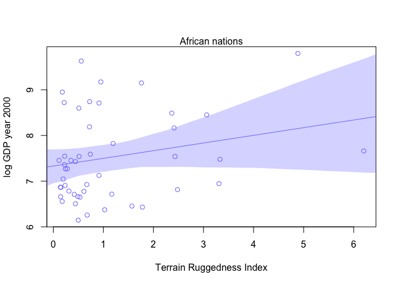

# Chapter-07-part1-assignment
Ruijuan Li  
May 25, 2016  

# 7E1

```r
# For each of the causal relationships below, name a hypothetical third variable that would lead to an interaction effect.

# (1)	Bread dough rises because of yeast. temperature 

# (2)	Education leads to higher income. major 

# (3)	Gasoline makes a car go. a working engine 
```

# 7E2

```r
# Which of the following explanations invokes an interaction? 1 

# (1)	Caramelizing onions requires cooking over low heat and making sure the onions do not dry out. 

# (2)	A car will go faster when it has more cylinders or when it has a better fuel injector.

# (3)	Most people acquire their political beliefs from their parents, unless they get them instead from their friends.

# (4)	Intelligent animal species tend to be either highly social or have manipulative appendages (hands, tentacles, etc.). 
```

#7E3

```r
# For each of the explanations in 7E2, write a linear model that expresses the stated relationship. 

# 1) onion.taste <- a + bt*temperature + bm*moisture.level.onion + btm*temperature*moisture.level.onion
```

#7M1

```r
# Recall the tulips example from the chapter. Suppose another set of treatments adjusted the temperature in the greenhouse over two levels: cold and hot. The data in the chapter were collected at the cold temperature. You find none of the plants grown under the hot temperature developed any blooms at all, regardless of the water and shade levels. Can you explain this result in terms of interactions between water, shade, and temperature? 

# Plant growth is dependent upon three factors: water, shade, and temperatures, and the effect of water and shade on plant growth is dependent upon the temperature level in the greenhouse.  
```

#7M2

```r
# Can you invent a regression equation that would make the bloom size zero, whenever the temperature is hot? (the concept of dummy & centered variable???)

# bloom.size = a + bs*shade.c + bw*water.c + bsw*shade.c*water.c (need to work on this later... )  
```

#7M3

```r
# In parts of North America, ravens depend upon wolves for their food. This is because ravens are carnivorous but cannot usually kill or open carcasses of prey. Wolves however can and do kill and tear open animals, and they tolerate ravens co-feeding at their kills. This species relationship is generally described as a “species interaction.” Can you invent a hypothetical set of data on raven population size in which this relationship would manifest as a statistical interaction? Do you think the biological interaction could be linear? Why or why not? 
# How to understand linear interaction? 
```

#7H1 

```r
# Return to the data(tulips) example in the chapter. Now include the bed variable as a predictor in the interaction model. Don't interact bed with the other predictors; just include it as a main effect. Note that bed is categorical. So to use it properly, you will need to either construct dummy variables or rather an index variable, as explained in Chapter 6. 

library(rethinking)
```

```
## Loading required package: rstan
```

```
## Loading required package: ggplot2
```

```
## rstan (Version 2.9.0-3, packaged: 2016-02-11 15:54:41 UTC, GitRev: 05c3d0058b6a)
```

```
## For execution on a local, multicore CPU with excess RAM we recommend calling
## rstan_options(auto_write = TRUE)
## options(mc.cores = parallel::detectCores())
```

```
## Loading required package: parallel
```

```
## rethinking (Version 1.58)
```

```r
data("tulips")
d <- tulips

# center the predictor
d$shade.c <- d$shade - mean(d$shade)
d$water.c <- d$water - mean(d$water)

# create dummy variable
d$bed.a <- ifelse(d$bed=="a", 1, 0)
d$bed.b <- ifelse(d$bed=="b", 1, 0)
d
```

```
##    bed water shade blooms shade.c water.c bed.a bed.b
## 1    a     1     1   0.00      -1      -1     1     0
## 2    a     1     2   0.00       0      -1     1     0
## 3    a     1     3 111.04       1      -1     1     0
## 4    a     2     1 183.47      -1       0     1     0
## 5    a     2     2  59.16       0       0     1     0
## 6    a     2     3  76.75       1       0     1     0
## 7    a     3     1 224.97      -1       1     1     0
## 8    a     3     2  83.77       0       1     1     0
## 9    a     3     3 134.95       1       1     1     0
## 10   b     1     1  80.10      -1      -1     0     1
## 11   b     1     2  85.95       0      -1     0     1
## 12   b     1     3  19.87       1      -1     0     1
## 13   b     2     1 213.13      -1       0     0     1
## 14   b     2     2 124.99       0       0     0     1
## 15   b     2     3  65.48       1       0     0     1
## 16   b     3     1 361.66      -1       1     0     1
## 17   b     3     2 197.13       0       1     0     1
## 18   b     3     3 134.93       1       1     0     1
## 19   c     1     1  10.02      -1      -1     0     0
## 20   c     1     2  47.69       0      -1     0     0
## 21   c     1     3 106.75       1      -1     0     0
## 22   c     2     1 246.00      -1       0     0     0
## 23   c     2     2 135.92       0       0     0     0
## 24   c     2     3  90.66       1       0     0     0
## 25   c     3     1 304.52      -1       1     0     0
## 26   c     3     2 249.33       0       1     0     0
## 27   c     3     3 134.59       1       1     0     0
```

```r
# fit the model 
m7H1 <- map(
  alist(
    blooms ~ dnorm(mu, sigma),
    mu <- a + bW*water.c + bS*shade.c + bWS*water.c*shade.c + ba*bed.a + bb*bed.b,
    a ~ dnorm(130, 100),
    bW ~ dnorm(0, 100),
    bS ~ dnorm(0, 100),
    bWS ~ dnorm(0, 100),
    ba ~ dnorm(0, 1),
    bb ~ dnorm(0, 1),
    sigma ~ dunif(0, 100)
  ), 
  data = d,
  start = list(a=mean(d$blooms), bS=0, bS=0, bWS=0, ba=0, bb=0, sigma=sd(d$blooms))
)
```

#7H2

```r
# Use WAIC to compare the model from 7H1 to a model that omits bed. What do you infer from this comparison? Can you reconcile the WAIC results with the posterior distribution of the bed coefficients? 

# the model that moits bed
m7.9 <- map(
  alist(
    blooms ~ dnorm(mu, sigma),
    mu <- a + bW*water.c + bS*shade.c + bWS*water.c*shade.c,
    a ~ dnorm(130, 100),
    bW ~ dnorm(0, 100),
    bS ~ dnorm(0, 100),
    bWS ~ dnorm(0, 100),
    sigma ~ dunif(0, 100)
  ), 
  data = d,
  method = "Nelder-Mead",
  control = list(maxit=1e4),
  start = list(a=mean(d$blooms), bS=0, bS=0, bWS=0, sigma=sd(d$blooms))
)

WAIC(m7H1)
```

```
## Constructing posterior predictions
```

```
## [ 100 / 1000 ]
[ 200 / 1000 ]
[ 300 / 1000 ]
[ 400 / 1000 ]
[ 500 / 1000 ]
[ 600 / 1000 ]
[ 700 / 1000 ]
[ 800 / 1000 ]
[ 900 / 1000 ]
[ 1000 / 1000 ]
```

```
## [1] 295.805
## attr(,"lppd")
## [1] -141.443
## attr(,"pWAIC")
## [1] 6.459534
## attr(,"se")
## [1] 10.16693
```

```r
WAIC(m7.9) 
```

```
## Constructing posterior predictions
```

```
## [ 100 / 1000 ]
[ 200 / 1000 ]
[ 300 / 1000 ]
[ 400 / 1000 ]
[ 500 / 1000 ]
[ 600 / 1000 ]
[ 700 / 1000 ]
[ 800 / 1000 ]
[ 900 / 1000 ]
[ 1000 / 1000 ]
```

```
## [1] 296.2149
## attr(,"lppd")
## [1] -141.4016
## attr(,"pWAIC")
## [1] 6.705828
## attr(,"se")
## [1] 10.46896
```

```r
compare(m7H1, m7.9) # which one is better? hard to say... 
```

```
##       WAIC pWAIC dWAIC weight    SE dSE
## m7H1 295.2   6.1   0.0   0.64  9.85  NA
## m7.9 296.4   6.8   1.2   0.36 10.57 0.9
```

```r
# Can you reconcile the WAIC results with the posterior distribution of the bed coefficients? what does this mean? 
```

#7H3

```r
data(rugged)
d <- rugged

head(d)
```

```
##   isocode isonum     country rugged rugged_popw rugged_slope rugged_lsd
## 1     ABW    533       Aruba  0.462       0.380        1.226      0.144
## 2     AFG      4 Afghanistan  2.518       1.469        7.414      0.720
## 3     AGO     24      Angola  0.858       0.714        2.274      0.228
## 4     AIA    660    Anguilla  0.013       0.010        0.026      0.006
## 5     ALB      8     Albania  3.427       1.597       10.451      1.006
## 6     AND     20     Andorra  5.717       6.722       17.774      1.616
##   rugged_pc land_area     lat     lon    soil desert tropical dist_coast
## 1     0.000        18  12.508 -69.970  21.324  0.000  100.000      0.001
## 2    39.004     65209  33.833  66.026  27.849  4.356    0.000      0.922
## 3     4.906    124670 -12.299  17.551  26.676  0.425   44.346      0.428
## 4     0.000         9  18.231 -63.064 100.000  0.000  100.000      0.000
## 5    62.133      2740  41.143  20.070  68.088  0.000    0.000      0.048
## 6    99.064        47  42.551   1.576   0.000  0.000    0.000      0.134
##   near_coast gemstones rgdppc_2000 rgdppc_1950_m rgdppc_1975_m
## 1   100.0000         0          NA            NA            NA
## 2     0.0000         0          NA       644.756       720.633
## 3    13.1587     47756    1794.729      1051.822      1073.036
## 4   100.0000         0          NA            NA            NA
## 5    94.6919         0    3703.113      1001.339      2289.472
## 6     0.0000         0          NA            NA            NA
##   rgdppc_2000_m rgdppc_1950_2000_m q_rule_law cont_africa cont_asia
## 1            NA                 NA         NA           0         0
## 2       565.231            679.791     -1.687           0         1
## 3       765.215           1106.763     -1.567           1         0
## 4            NA                 NA         NA           0         0
## 5      2741.420           1931.784     -0.820           0         0
## 6            NA                 NA      1.515           0         0
##   cont_europe cont_oceania cont_north_america cont_south_america legor_gbr
## 1           0            0                  1                  0         0
## 2           0            0                  0                  0         0
## 3           0            0                  0                  0         0
## 4           0            0                  1                  0        NA
## 5           1            0                  0                  0         0
## 6           1            0                  0                  0         0
##   legor_fra legor_soc legor_deu legor_sca colony_esp colony_gbr colony_fra
## 1         1         0         0         0          0          0          0
## 2         1         0         0         0          0          0          0
## 3         1         0         0         0          0          0          0
## 4        NA        NA        NA        NA          0          0          0
## 5         0         1         0         0          0          0          0
## 6         1         0         0         0          0          0          0
##   colony_prt colony_oeu africa_region_n africa_region_s africa_region_w
## 1          0          0               0               0               0
## 2          0          0               0               0               0
## 3          1          0               0               0               0
## 4          0          0               0               0               0
## 5          0          0               0               0               0
## 6          0          0               0               0               0
##   africa_region_e africa_region_c slave_exports dist_slavemkt_atlantic
## 1               0               0             0                     NA
## 2               0               0             0                     NA
## 3               0               1       3610000                  5.669
## 4               0               0             0                     NA
## 5               0               0             0                     NA
## 6               0               0             0                     NA
##   dist_slavemkt_indian dist_slavemkt_saharan dist_slavemkt_redsea pop_1400
## 1                   NA                    NA                   NA      614
## 2                   NA                    NA                   NA  1870829
## 3                6.981                 4.926                3.872  1223208
## 4                   NA                    NA                   NA       NA
## 5                   NA                    NA                   NA   200000
## 6                   NA                    NA                   NA       NA
##   european_descent
## 1               NA
## 2                0
## 3                2
## 4               NA
## 5              100
## 6               NA
```

```r
dim(d) #234 countries w/ 51 sets of data 
```

```
## [1] 234  51
```

```r
# make log version of outcome
d$log_gdp <- log(d$rgdppc_2000)

dd <- d[complete.cases(d$rgdppc_2000), ]
dim(dd) # 170 countries 170 52 
```

```
## [1] 170  52
```

```r
dd$country
```

```
##   [1] Angola                                              
##   [2] Albania                                             
##   [3] United Arab Emirates                                
##   [4] Argentina                                           
##   [5] Armenia                                             
##   [6] Antigua and Barbuda                                 
##   [7] Australia                                           
##   [8] Austria                                             
##   [9] Azerbaijan                                          
##  [10] Burundi                                             
##  [11] Belgium                                             
##  [12] Benin                                               
##  [13] Burkina Faso                                        
##  [14] Bangladesh                                          
##  [15] Bulgaria                                            
##  [16] Bahrain                                             
##  [17] Bahamas                                             
##  [18] Bosnia and Herzegovina                              
##  [19] Belarus                                             
##  [20] Belize                                              
##  [21] Bolivia                                             
##  [22] Brazil                                              
##  [23] Barbados                                            
##  [24] Botswana                                            
##  [25] Central African Republic                            
##  [26] Canada                                              
##  [27] Switzerland                                         
##  [28] Chile                                               
##  [29] China                                               
##  [30] Cote d'Ivoire                                       
##  [31] Cameroon                                            
##  [32] Democratic Republic of the Congo                    
##  [33] Congo                                               
##  [34] Colombia                                            
##  [35] Comoros                                             
##  [36] Cape Verde                                          
##  [37] Costa Rica                                          
##  [38] Cyprus                                              
##  [39] Czech Republic                                      
##  [40] Germany                                             
##  [41] Djibouti                                            
##  [42] Dominica                                            
##  [43] Denmark                                             
##  [44] Dominican Republic                                  
##  [45] Algeria                                             
##  [46] Ecuador                                             
##  [47] Egypt                                               
##  [48] Eritrea                                             
##  [49] Spain                                               
##  [50] Estonia                                             
##  [51] Ethiopia                                            
##  [52] Finland                                             
##  [53] Fiji                                                
##  [54] France                                              
##  [55] Gabon                                               
##  [56] United Kingdom of Great Britain and Northern Ireland
##  [57] Georgia                                             
##  [58] Ghana                                               
##  [59] Guinea                                              
##  [60] Gambia                                              
##  [61] Guinea-Bissau                                       
##  [62] Equatorial Guinea                                   
##  [63] Greece                                              
##  [64] Grenada                                             
##  [65] Guatemala                                           
##  [66] Guyana                                              
##  [67] Hong Kong Special Administrative Region of China    
##  [68] Honduras                                            
##  [69] Croatia                                             
##  [70] Haiti                                               
##  [71] Hungary                                             
##  [72] Indonesia                                           
##  [73] India                                               
##  [74] Ireland                                             
##  [75] Iran; Islamic Republic of                           
##  [76] Iceland                                             
##  [77] Israel                                              
##  [78] Italy                                               
##  [79] Jamaica                                             
##  [80] Jordan                                              
##  [81] Japan                                               
##  [82] Kazakhstan                                          
##  [83] Kenya                                               
##  [84] Kyrgyzstan                                          
##  [85] Cambodia                                            
##  [86] Saint Kitts and Nevis                               
##  [87] Republic of Korea                                   
##  [88] Kuwait                                              
##  [89] Lao People's Democratic Republic                    
##  [90] Lebanon                                             
##  [91] Saint Lucia                                         
##  [92] Sri Lanka                                           
##  [93] Lesotho                                             
##  [94] Lithuania                                           
##  [95] Luxembourg                                          
##  [96] Latvia                                              
##  [97] Macao Special Administrative Region of China        
##  [98] Morocco                                             
##  [99] Republic of Moldova                                 
## [100] Madagascar                                          
## [101] Mexico                                              
## [102] The former Yugoslav Republic of Macedonia           
## [103] Mali                                                
## [104] Malta                                               
## [105] Mongolia                                            
## [106] Mozambique                                          
## [107] Mauritania                                          
## [108] Mauritius                                           
## [109] Malawi                                              
## [110] Malaysia                                            
## [111] Namibia                                             
## [112] New Caledonia                                       
## [113] Niger                                               
## [114] Nigeria                                             
## [115] Nicaragua                                           
## [116] Netherlands                                         
## [117] Norway                                              
## [118] Nepal                                               
## [119] New Zealand                                         
## [120] Oman                                                
## [121] Pakistan                                            
## [122] Panama                                              
## [123] Peru                                                
## [124] Philippines                                         
## [125] Papua New Guinea                                    
## [126] Poland                                              
## [127] Puerto Rico                                         
## [128] Portugal                                            
## [129] Paraguay                                            
## [130] French Polynesia                                    
## [131] Romania                                             
## [132] Russian Federation                                  
## [133] Rwanda                                              
## [134] Saudi Arabia                                        
## [135] Sudan                                               
## [136] Senegal                                             
## [137] Singapore                                           
## [138] Solomon Islands                                     
## [139] Sierra Leone                                        
## [140] El Salvador                                         
## [141] Slovakia                                            
## [142] Slovenia                                            
## [143] Sweden                                              
## [144] Swaziland                                           
## [145] Seychelles                                          
## [146] Syrian Arab Republic                                
## [147] Chad                                                
## [148] Togo                                                
## [149] Thailand                                            
## [150] Tajikistan                                          
## [151] Turkmenistan                                        
## [152] Tonga                                               
## [153] Trinidad and Tobago                                 
## [154] Tunisia                                             
## [155] Turkey                                              
## [156] United Republic of Tanzania                         
## [157] Uganda                                              
## [158] Ukraine                                             
## [159] Uruguay                                             
## [160] United States of America                            
## [161] Uzbekistan                                          
## [162] Saint Vincent and the Grenadines                    
## [163] Venezuela (Bolivarian Republic of)                  
## [164] Viet Nam                                            
## [165] Vanuatu                                             
## [166] Samoa                                               
## [167] Yemen                                               
## [168] South Africa                                        
## [169] Zambia                                              
## [170] Zimbabwe                                            
## 234 Levels: Afghanistan Albania Algeria American Samoa Andorra ... Zimbabwe
```

```r
# The previous model w/ all African countries 
m7.5b <- map(
  alist(
    log_gdp ~ dnorm(mu, sigma),
    mu <- a + bR*rugged + bAR*rugged*cont_africa + bA*cont_africa,
    a ~ dnorm(8, 100),
    bA ~ dnorm(0, 1),
    bR ~ dnorm(0, 1),
    bAR ~ dnorm(0, 1),
    sigma ~ dunif(0, 10)
  ), data = dd)

# drop Seychelles
dd_noSey <- dd[-(dd$country=="Seychelles"),]
dim(dd_noSey) # 169 52 
```

```
## [1] 169  52
```

```r
# (a) drop Seychelles from the data and re-evaluate the hypothesis that the relationship of African economies with ruggedness is different from that on other continents. 

m7H3 <- map(
  alist(
    log_gdp ~ dnorm(mu, sigma),
    mu <- a + bR*rugged + bAR*rugged*cont_africa + bA*cont_africa,
    a ~ dnorm(8, 100),
    bA ~ dnorm(0, 1),
    bR ~ dnorm(0, 1),
    bAR ~ dnorm(0, 1),
    sigma ~ dunif(0, 10)
  ), data = dd_noSey)

# compare the coefficents of these two models 
coeftab(m7.5b, m7H3)
```

```
##       m7.5b   m7H3   
## a        9.18    9.18
## bA      -1.85   -1.85
## bR      -0.18   -0.18
## bAR      0.35    0.35
## sigma    0.93    0.94
## nobs      170     169
```

```r
# almost no difference. only the stdv is different for the mu, dropping Seychelles reduced stdv (uncertainty). 

# (b) plot to visualize the relationship in these two models 
# the old model 
rugged.seq <- seq(-1, 8, by = 0.25)

mu.Africa <- link(m7.5b, data = data.frame(cont_africa=1, rugged= rugged.seq))
```

```
## [ 100 / 1000 ]
[ 200 / 1000 ]
[ 300 / 1000 ]
[ 400 / 1000 ]
[ 500 / 1000 ]
[ 600 / 1000 ]
[ 700 / 1000 ]
[ 800 / 1000 ]
[ 900 / 1000 ]
[ 1000 / 1000 ]
```

```r
mu.Africa.mean <- apply(mu.Africa, 2, mean)
mu.Africa.PI <- apply(mu.Africa, 2, PI, prob= 0.97)

mu.NotAfrica <- link(m7.5b, data = data.frame(cont_africa=0, rugged= rugged.seq))
```

```
## [ 100 / 1000 ]
[ 200 / 1000 ]
[ 300 / 1000 ]
[ 400 / 1000 ]
[ 500 / 1000 ]
[ 600 / 1000 ]
[ 700 / 1000 ]
[ 800 / 1000 ]
[ 900 / 1000 ]
[ 1000 / 1000 ]
```

```r
mu.NotAfrica.mean <- apply(mu.NotAfrica, 2, mean)
mu.NotAfrica.PI <- apply(mu.NotAfrica, 2, PI, prob= 0.97)

# plot Afican nations w/ regression, plot using subset of data (Africa/NonAfrica)
d.A1 <- dd[dd$cont_africa==1,]

plot(log(rgdppc_2000) ~ rugged, data=d.A1,
     col=rangi2, ylab="log GDP year 2000",
     xlab="Terrain Ruggedness Index")
mtext("African nations", 3)
lines(rugged.seq, mu.Africa.mean, col=rangi2)
shade(mu.Africa.PI, rugged.seq, col = col.alpha(rangi2, 0.3))
```


```r
# plot non-Afican nations w/ regression
d.A0 <- dd[dd$cont_africa==0,]

plot(log(rgdppc_2000) ~ rugged, data=d.A0,
     col="black", ylab="log GDP year 2000",
     xlab="Terrain Ruggedness Index")
mtext("Non-African nations", 3)
lines(rugged.seq, mu.NotAfrica.mean, col=rangi2)
shade(mu.NotAfrica.PI, rugged.seq)
```


```r
# The new model 
rugged.seq <- seq(-1, 8, by = 0.25)

mu.Africa <- link(m7H3, data = data.frame(cont_africa=1, rugged= rugged.seq))
```

```
## [ 100 / 1000 ]
[ 200 / 1000 ]
[ 300 / 1000 ]
[ 400 / 1000 ]
[ 500 / 1000 ]
[ 600 / 1000 ]
[ 700 / 1000 ]
[ 800 / 1000 ]
[ 900 / 1000 ]
[ 1000 / 1000 ]
```

```r
mu.Africa.mean <- apply(mu.Africa, 2, mean)
mu.Africa.PI <- apply(mu.Africa, 2, PI, prob= 0.97)

mu.NotAfrica <- link(m7H3, data = data.frame(cont_africa=0, rugged= rugged.seq))
```

```
## [ 100 / 1000 ]
[ 200 / 1000 ]
[ 300 / 1000 ]
[ 400 / 1000 ]
[ 500 / 1000 ]
[ 600 / 1000 ]
[ 700 / 1000 ]
[ 800 / 1000 ]
[ 900 / 1000 ]
[ 1000 / 1000 ]
```

```r
mu.NotAfrica.mean <- apply(mu.NotAfrica, 2, mean)
mu.NotAfrica.PI <- apply(mu.NotAfrica, 2, PI, prob= 0.97)

# plot Afican nations w/ regression, plot using subset of data (Africa/NonAfrica)
d.A1 <- dd_noSey[dd_noSey$cont_africa==1,]
plot(log(rgdppc_2000) ~ rugged, data=d.A1,
     col=rangi2, ylab="log GDP year 2000",
     xlab="Terrain Ruggedness Index")
mtext("African nations", 3)
lines(rugged.seq, mu.Africa.mean, col=rangi2)
shade(mu.Africa.PI, rugged.seq, col = col.alpha(rangi2, 0.3))
```



```r
# plot non-Afican nations w/ regression
d.A0 <- dd_noSey[dd_noSey$cont_africa==0,]

plot(log(rgdppc_2000) ~ rugged, data=d.A0,
     col="black", ylab="log GDP year 2000",
     xlab="Terrain Ruggedness Index")
mtext("Non-African nations", 3)
lines(rugged.seq, mu.NotAfrica.mean, col=rangi2)
shade(mu.NotAfrica.PI, rugged.seq)
```


```r
# it still look like the effect of ruggedness depends upon continent, I didn't see any difference. 

# (c) conduct model comparsion, fit three models to the data w/o Seychelles
m7H3.1 <- map(
  alist(
    log_gdp ~ dnorm(mu, sigma),
    mu <- a + bR*rugged,
    a ~ dnorm(8, 100),
    bR ~ dnorm(0, 1),
    sigma ~ dunif(0, 10)
  ), data = dd_noSey)

m7H3.2 <- map(
  alist(
    log_gdp ~ dnorm(mu, sigma),
    mu <- a + bR*rugged + bA*cont_africa,
    a ~ dnorm(8, 100),
    bA ~ dnorm(0, 1),
    bR ~ dnorm(0, 1),
    sigma ~ dunif(0, 10)
  ), data = dd_noSey)

compare(m7H3, m7H3.1, m7H3.2) # 7H3 looks much better 
```

```
##         WAIC pWAIC dWAIC weight    SE   dSE
## m7H3   467.6   5.2   0.0   0.96 14.96    NA
## m7H3.2 473.9   4.1   6.3   0.04 15.14  6.15
## m7H3.1 536.8   2.7  69.1   0.00 13.31 15.15
```

```r
# model averaging 
m7H3.3 <- ensemble(m7H3, m7H3.1, data = dd_noSey) # should m7H3.2 be added? 0 weight. 
```

```
## Constructing posterior predictions
```

```
## [ 100 / 1000 ]
[ 200 / 1000 ]
[ 300 / 1000 ]
[ 400 / 1000 ]
[ 500 / 1000 ]
[ 600 / 1000 ]
[ 700 / 1000 ]
[ 800 / 1000 ]
[ 900 / 1000 ]
[ 1000 / 1000 ]
```

```
## Constructing posterior predictions
```

```
## [ 100 / 1000 ]
[ 200 / 1000 ]
[ 300 / 1000 ]
[ 400 / 1000 ]
[ 500 / 1000 ]
[ 600 / 1000 ]
[ 700 / 1000 ]
[ 800 / 1000 ]
[ 900 / 1000 ]
[ 1000 / 1000 ]
```

```r
# didn't get time to do this, but I guess there is no huge difference between these two models, because m7H3 takes over a large weight based on the model comparison result. 
```

#7H4

```r
# to do... 
```


