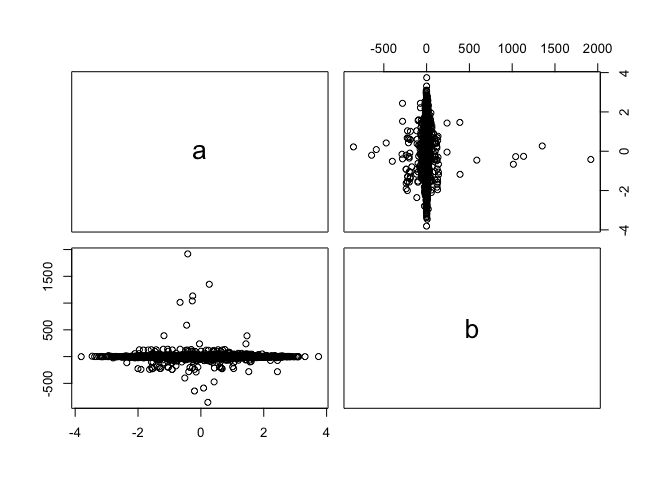
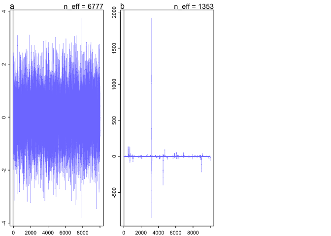
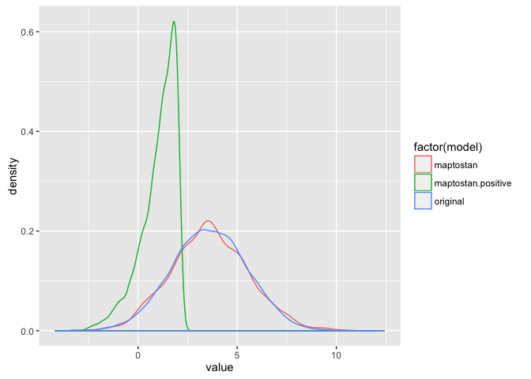
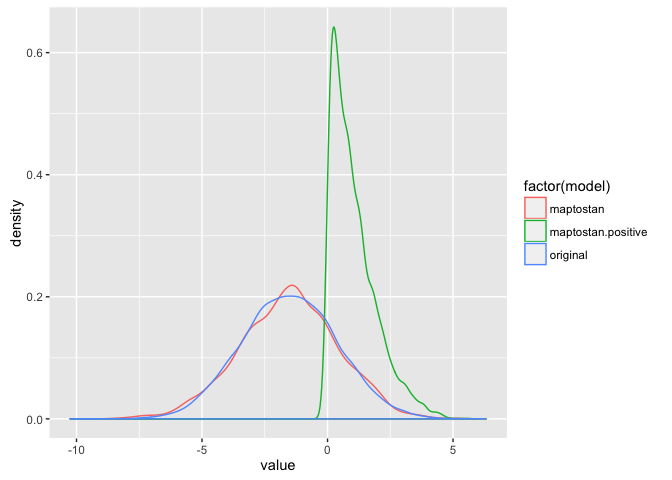
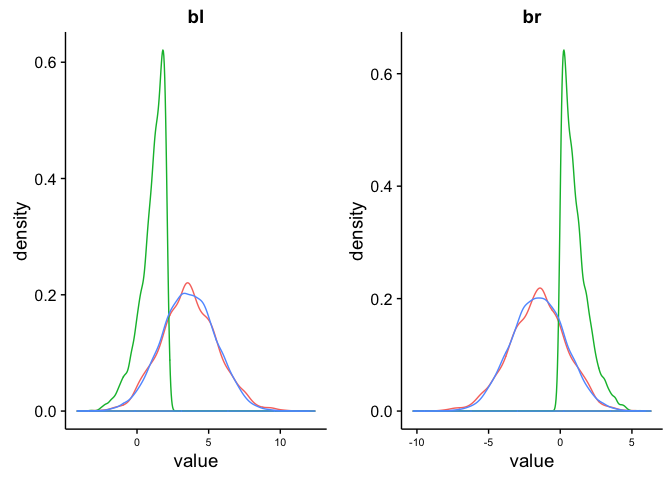

# Chapter-08-part3-assignment
Ruijuan Li  
June 22, 2016  
# 8H1

```r
knitr::opts_chunk$set(echo = TRUE,cache=TRUE,autodep = TRUE) # get this from Julin
```


```r
# run the model below and then inspect the posterior distribution and explain what it is accomplishing. 
library(rethinking)
library(ggplot2)
mp <- map2stan(
  alist(
    a ~ dnorm(0, 1), 
    b ~ dcauchy(0, 1) 
  ), 
  data = list(y=1), # data used 
  start = list(a=0, b=0), # start value 
  iter = 1e4, warmup = 100, WAIC = FALSE) # estimate the distribution of a and b using dnorm & dcauchy??? no corrleation between a & b...  
```

```
## 
## SAMPLING FOR MODEL 'a ~ dnorm(0, 1)' NOW (CHAIN 1).
## 
## Chain 1, Iteration:    1 / 10000 [  0%]  (Warmup)
## Chain 1, Iteration:  101 / 10000 [  1%]  (Sampling)
## Chain 1, Iteration: 1100 / 10000 [ 11%]  (Sampling)
## Chain 1, Iteration: 2100 / 10000 [ 21%]  (Sampling)
## Chain 1, Iteration: 3100 / 10000 [ 31%]  (Sampling)
## Chain 1, Iteration: 4100 / 10000 [ 41%]  (Sampling)
## Chain 1, Iteration: 5100 / 10000 [ 51%]  (Sampling)
## Chain 1, Iteration: 6100 / 10000 [ 61%]  (Sampling)
## Chain 1, Iteration: 7100 / 10000 [ 71%]  (Sampling)
## Chain 1, Iteration: 8100 / 10000 [ 81%]  (Sampling)
## Chain 1, Iteration: 9100 / 10000 [ 91%]  (Sampling)
## Chain 1, Iteration: 10000 / 10000 [100%]  (Sampling)# 
## #  Elapsed Time: 0.001354 seconds (Warm-up)
## #                0.155405 seconds (Sampling)
## #                0.156759 seconds (Total)
## # 
## 
## SAMPLING FOR MODEL 'a ~ dnorm(0, 1)' NOW (CHAIN 1).
## 
## Chain 1, Iteration: 1 / 1 [100%]  (Sampling)# 
## #  Elapsed Time: 5e-06 seconds (Warm-up)
## #                2.4e-05 seconds (Sampling)
## #                2.9e-05 seconds (Total)
## #
```

```r
?dcauchy

post <- extract.samples(mp) # pull out samples from mp 
str(post) 
```

```
## List of 2
##  $ a: num [1:9900(1d)] 1.089 1.081 -1.043 -0.489 -0.28 ...
##  $ b: num [1:9900(1d)] -0.14437 0.17057 4.52289 0.00924 0.33161 ...
```

```r
precis(mp)
```

```
##    Mean StdDev lower 0.89 upper 0.89 n_eff Rhat
## a  0.01   0.99      -1.58       1.56  6777    1
## b -0.18  37.88      -5.49       5.98  1353    1
```

```r
pairs(post)
```



```r
show(mp)
```

```
## map2stan model fit
## 9900 samples from 1 chain
## 
## Formula:
## a ~ dnorm(0, 1)
## b ~ dcauchy(0, 1)
## 
## Log-likelihood at expected values: 0 
## Deviance: 0 
## DIC: 0 
## Effective number of parameters (pD): 0
```

```r
# compare the samples for the parameters a & b
plot(mp) # cannot get the trace plot because of error... 
```



# 8H2

```r
data("WaffleDivorce")
d <- WaffleDivorce

# data preparation 
# standardize predictor
d$MedianAgeMarriage.s <- (d$MedianAgeMarriage-mean(d$MedianAgeMarriage))/sd(d$MedianAgeMarriage) # preprocess all variable transformation 

colnames(d)
```

```
##  [1] "Location"            "Loc"                 "Population"         
##  [4] "MedianAgeMarriage"   "Marriage"            "Marriage.SE"        
##  [7] "Divorce"             "Divorce.SE"          "WaffleHouses"       
## [10] "South"               "Slaves1860"          "Population1860"     
## [13] "PropSlaves1860"      "MedianAgeMarriage.s"
```

```r
d.trim.1 <- d[,c("MedianAgeMarriage.s","Divorce")] # make a new trimmed down data frame that contains only the variable to use to fit the model 

# fit model
m5.1.8H2 <- map2stan(
  alist(
    Divorce ~ dnorm(mu, sigma),
    mu <- a + bA * MedianAgeMarriage.s,
    a ~ dnorm(10, 10),
    bA ~ dnorm(0, 1),
    sigma ~ dunif(0, 10)
  ), data = d.trim.1)
```

```
## Warning: Variable 'MedianAgeMarriage.s' contains dots '.'.
## Will attempt to remove dots internally.
```

```
## 
## SAMPLING FOR MODEL 'Divorce ~ dnorm(mu, sigma)' NOW (CHAIN 1).
## 
## Chain 1, Iteration:    1 / 2000 [  0%]  (Warmup)
## Chain 1, Iteration:  200 / 2000 [ 10%]  (Warmup)
## Chain 1, Iteration:  400 / 2000 [ 20%]  (Warmup)
## Chain 1, Iteration:  600 / 2000 [ 30%]  (Warmup)
## Chain 1, Iteration:  800 / 2000 [ 40%]  (Warmup)
## Chain 1, Iteration: 1000 / 2000 [ 50%]  (Warmup)
## Chain 1, Iteration: 1001 / 2000 [ 50%]  (Sampling)
## Chain 1, Iteration: 1200 / 2000 [ 60%]  (Sampling)
## Chain 1, Iteration: 1400 / 2000 [ 70%]  (Sampling)
## Chain 1, Iteration: 1600 / 2000 [ 80%]  (Sampling)
## Chain 1, Iteration: 1800 / 2000 [ 90%]  (Sampling)
## Chain 1, Iteration: 2000 / 2000 [100%]  (Sampling)# 
## #  Elapsed Time: 0.02578 seconds (Warm-up)
## #                0.020504 seconds (Sampling)
## #                0.046284 seconds (Total)
## # 
## 
## SAMPLING FOR MODEL 'Divorce ~ dnorm(mu, sigma)' NOW (CHAIN 1).
## 
## Chain 1, Iteration: 1 / 1 [100%]  (Sampling)# 
## #  Elapsed Time: 4e-06 seconds (Warm-up)
## #                2.7e-05 seconds (Sampling)
## #                3.1e-05 seconds (Total)
## #
```

```
## Computing WAIC
```

```
## Constructing posterior predictions
```

```
## [ 100 / 1000 ]
[ 200 / 1000 ]
[ 300 / 1000 ]
[ 400 / 1000 ]
[ 500 / 1000 ]
[ 600 / 1000 ]
[ 700 / 1000 ]
[ 800 / 1000 ]
[ 900 / 1000 ]
[ 1000 / 1000 ]
```

```r
# data preparation 
# standardize predictor
d$Marriage.s <- (d$Marriage - mean(d$Marriage))/sd(d$Marriage) # preprocess all variable transformation 

colnames(d)
```

```
##  [1] "Location"            "Loc"                 "Population"         
##  [4] "MedianAgeMarriage"   "Marriage"            "Marriage.SE"        
##  [7] "Divorce"             "Divorce.SE"          "WaffleHouses"       
## [10] "South"               "Slaves1860"          "Population1860"     
## [13] "PropSlaves1860"      "MedianAgeMarriage.s" "Marriage.s"
```

```r
d.trim.2 <- d[,c("Marriage.s","Divorce")] # make a new trimmed down data frame that contains only the variable to use to fit the model 

# fit model
m5.2.8H2 <- map2stan(
  alist(
    Divorce ~ dnorm(mu, sigma),
    mu <- a + bR * Marriage.s,
    a ~ dnorm(10, 10),
    bR ~ dnorm(0, 1),
    sigma ~ dunif(0, 10)
  ), data = d.trim.2) 
```

```
## Warning: Variable 'Marriage.s' contains dots '.'.
## Will attempt to remove dots internally.
```

```
## 
## SAMPLING FOR MODEL 'Divorce ~ dnorm(mu, sigma)' NOW (CHAIN 1).
## 
## Chain 1, Iteration:    1 / 2000 [  0%]  (Warmup)
## Chain 1, Iteration:  200 / 2000 [ 10%]  (Warmup)
## Chain 1, Iteration:  400 / 2000 [ 20%]  (Warmup)
## Chain 1, Iteration:  600 / 2000 [ 30%]  (Warmup)
## Chain 1, Iteration:  800 / 2000 [ 40%]  (Warmup)
## Chain 1, Iteration: 1000 / 2000 [ 50%]  (Warmup)
## Chain 1, Iteration: 1001 / 2000 [ 50%]  (Sampling)
## Chain 1, Iteration: 1200 / 2000 [ 60%]  (Sampling)
## Chain 1, Iteration: 1400 / 2000 [ 70%]  (Sampling)
## Chain 1, Iteration: 1600 / 2000 [ 80%]  (Sampling)
## Chain 1, Iteration: 1800 / 2000 [ 90%]  (Sampling)
## Chain 1, Iteration: 2000 / 2000 [100%]  (Sampling)# 
## #  Elapsed Time: 0.028233 seconds (Warm-up)
## #                0.023748 seconds (Sampling)
## #                0.051981 seconds (Total)
## # 
## 
## SAMPLING FOR MODEL 'Divorce ~ dnorm(mu, sigma)' NOW (CHAIN 1).
## 
## Chain 1, Iteration: 1 / 1 [100%]  (Sampling)# 
## #  Elapsed Time: 4e-06 seconds (Warm-up)
## #                2.8e-05 seconds (Sampling)
## #                3.2e-05 seconds (Total)
## #
```

```
## Computing WAIC
## Constructing posterior predictions
```

```
## [ 100 / 1000 ]
[ 200 / 1000 ]
[ 300 / 1000 ]
[ 400 / 1000 ]
[ 500 / 1000 ]
[ 600 / 1000 ]
[ 700 / 1000 ]
[ 800 / 1000 ]
[ 900 / 1000 ]
[ 1000 / 1000 ]
```

```r
# data preparation 
colnames(d)
```

```
##  [1] "Location"            "Loc"                 "Population"         
##  [4] "MedianAgeMarriage"   "Marriage"            "Marriage.SE"        
##  [7] "Divorce"             "Divorce.SE"          "WaffleHouses"       
## [10] "South"               "Slaves1860"          "Population1860"     
## [13] "PropSlaves1860"      "MedianAgeMarriage.s" "Marriage.s"
```

```r
d.trim.3 <- d[,c("Marriage.s","Divorce","MedianAgeMarriage.s")] # make a new trimmed down data frame that contains only the variable to use to fit the model 

# fit model
m5.3.8H2 <- map2stan(
  alist(
    Divorce ~ dnorm(mu, sigma),
    mu <- a + bR*Marriage.s + bA * MedianAgeMarriage.s,
    a ~ dnorm(10, 10),
    bR ~ dnorm(0, 1),
    bA ~ dnorm(0, 1),
    sigma ~ dunif(0, 10)
  ), 
  data = d.trim.3 )
```

```
## Warning: Variable 'Marriage.s' contains dots '.'.
## Will attempt to remove dots internally.
```

```
## Warning: Variable 'MedianAgeMarriage.s' contains dots '.'.
## Will attempt to remove dots internally.
```

```
## 
## SAMPLING FOR MODEL 'Divorce ~ dnorm(mu, sigma)' NOW (CHAIN 1).
## 
## Chain 1, Iteration:    1 / 2000 [  0%]  (Warmup)
## Chain 1, Iteration:  200 / 2000 [ 10%]  (Warmup)
## Chain 1, Iteration:  400 / 2000 [ 20%]  (Warmup)
## Chain 1, Iteration:  600 / 2000 [ 30%]  (Warmup)
## Chain 1, Iteration:  800 / 2000 [ 40%]  (Warmup)
## Chain 1, Iteration: 1000 / 2000 [ 50%]  (Warmup)
## Chain 1, Iteration: 1001 / 2000 [ 50%]  (Sampling)
## Chain 1, Iteration: 1200 / 2000 [ 60%]  (Sampling)
## Chain 1, Iteration: 1400 / 2000 [ 70%]  (Sampling)
## Chain 1, Iteration: 1600 / 2000 [ 80%]  (Sampling)
## Chain 1, Iteration: 1800 / 2000 [ 90%]  (Sampling)
## Chain 1, Iteration: 2000 / 2000 [100%]  (Sampling)# 
## #  Elapsed Time: 0.040165 seconds (Warm-up)
## #                0.037412 seconds (Sampling)
## #                0.077577 seconds (Total)
## # 
## 
## SAMPLING FOR MODEL 'Divorce ~ dnorm(mu, sigma)' NOW (CHAIN 1).
## 
## Chain 1, Iteration: 1 / 1 [100%]  (Sampling)# 
## #  Elapsed Time: 5e-06 seconds (Warm-up)
## #                3e-05 seconds (Sampling)
## #                3.5e-05 seconds (Total)
## #
```

```
## Computing WAIC
```

```
## Constructing posterior predictions
```

```
## [ 100 / 1000 ]
[ 200 / 1000 ]
[ 300 / 1000 ]
[ 400 / 1000 ]
[ 500 / 1000 ]
[ 600 / 1000 ]
[ 700 / 1000 ]
[ 800 / 1000 ]
[ 900 / 1000 ]
[ 1000 / 1000 ]
```

```r
# comapre the models on the basis of WAIC, explain the results. 
compare(m5.1.8H2, m5.2.8H2, m5.3.8H2)
```

```
##           WAIC pWAIC dWAIC weight    SE  dSE
## m5.1.8H2 185.9   3.6   0.0   0.71 12.38   NA
## m5.3.8H2 187.8   4.7   1.8   0.28 12.12 0.85
## m5.2.8H2 199.3   2.9  13.3   0.00  9.70 9.09
```

```r
# based on WAIC, the 1st model is the best model. 
```

# 8H3 

```r
# go back to the leg length example in chpt 5, and run the code to simulate height and leg lengths for 100 imagined individuals. 

# R code 8.21 
N <- 100 # number of individuals 
height <- rnorm(N, 10, 2) # sim total height of each 
leg_prop <- runif(N, 0.4, 0.5) # leg as proportion of height 
leg_left <- leg_prop * height + 
  rnorm(N, 0, 0.02) # sim left leg as proportion + error
leg_right <- leg_prop * height + 
  rnorm(N, 0, 0.02) # sim right leg as proportion + error 

d <- data.frame(height, leg_left, leg_right) # combine into data frame 

# fit the model using map2stan using both left and right leg as predictor
m5.8s <- map2stan(
  alist(
    height ~ dnorm(mu, sigma),
    mu <- a + bl*leg_left + br*leg_right,
    a ~ dnorm(10, 100),
    bl ~ dnorm(2, 10),
    br ~ dnorm(2, 10),
    sigma ~ dcauchy(0, 1)
  ), 
  data=d, chains = 4, 
  start=list(a=10, bl=0, br=0, sigma=1))
```

```
## 
## SAMPLING FOR MODEL 'height ~ dnorm(mu, sigma)' NOW (CHAIN 1).
## 
## Chain 1, Iteration:    1 / 2000 [  0%]  (Warmup)
## Chain 1, Iteration:  200 / 2000 [ 10%]  (Warmup)
## Chain 1, Iteration:  400 / 2000 [ 20%]  (Warmup)
## Chain 1, Iteration:  600 / 2000 [ 30%]  (Warmup)
## Chain 1, Iteration:  800 / 2000 [ 40%]  (Warmup)
## Chain 1, Iteration: 1000 / 2000 [ 50%]  (Warmup)
## Chain 1, Iteration: 1001 / 2000 [ 50%]  (Sampling)
## Chain 1, Iteration: 1200 / 2000 [ 60%]  (Sampling)
## Chain 1, Iteration: 1400 / 2000 [ 70%]  (Sampling)
## Chain 1, Iteration: 1600 / 2000 [ 80%]  (Sampling)
## Chain 1, Iteration: 1800 / 2000 [ 90%]  (Sampling)
## Chain 1, Iteration: 2000 / 2000 [100%]  (Sampling)# 
## #  Elapsed Time: 3.42835 seconds (Warm-up)
## #                3.5016 seconds (Sampling)
## #                6.92995 seconds (Total)
## # 
## 
## SAMPLING FOR MODEL 'height ~ dnorm(mu, sigma)' NOW (CHAIN 2).
## 
## Chain 2, Iteration:    1 / 2000 [  0%]  (Warmup)
## Chain 2, Iteration:  200 / 2000 [ 10%]  (Warmup)
## Chain 2, Iteration:  400 / 2000 [ 20%]  (Warmup)
## Chain 2, Iteration:  600 / 2000 [ 30%]  (Warmup)
## Chain 2, Iteration:  800 / 2000 [ 40%]  (Warmup)
## Chain 2, Iteration: 1000 / 2000 [ 50%]  (Warmup)
## Chain 2, Iteration: 1001 / 2000 [ 50%]  (Sampling)
## Chain 2, Iteration: 1200 / 2000 [ 60%]  (Sampling)
## Chain 2, Iteration: 1400 / 2000 [ 70%]  (Sampling)
## Chain 2, Iteration: 1600 / 2000 [ 80%]  (Sampling)
## Chain 2, Iteration: 1800 / 2000 [ 90%]  (Sampling)
## Chain 2, Iteration: 2000 / 2000 [100%]  (Sampling)# 
## #  Elapsed Time: 3.2685 seconds (Warm-up)
## #                3.61663 seconds (Sampling)
## #                6.88512 seconds (Total)
## # 
## 
## SAMPLING FOR MODEL 'height ~ dnorm(mu, sigma)' NOW (CHAIN 3).
## 
## Chain 3, Iteration:    1 / 2000 [  0%]  (Warmup)
## Chain 3, Iteration:  200 / 2000 [ 10%]  (Warmup)
## Chain 3, Iteration:  400 / 2000 [ 20%]  (Warmup)
## Chain 3, Iteration:  600 / 2000 [ 30%]  (Warmup)
## Chain 3, Iteration:  800 / 2000 [ 40%]  (Warmup)
## Chain 3, Iteration: 1000 / 2000 [ 50%]  (Warmup)
## Chain 3, Iteration: 1001 / 2000 [ 50%]  (Sampling)
## Chain 3, Iteration: 1200 / 2000 [ 60%]  (Sampling)
## Chain 3, Iteration: 1400 / 2000 [ 70%]  (Sampling)
## Chain 3, Iteration: 1600 / 2000 [ 80%]  (Sampling)
## Chain 3, Iteration: 1800 / 2000 [ 90%]  (Sampling)
## Chain 3, Iteration: 2000 / 2000 [100%]  (Sampling)# 
## #  Elapsed Time: 3.04239 seconds (Warm-up)
## #                4.20637 seconds (Sampling)
## #                7.24876 seconds (Total)
## # 
## 
## SAMPLING FOR MODEL 'height ~ dnorm(mu, sigma)' NOW (CHAIN 4).
## 
## Chain 4, Iteration:    1 / 2000 [  0%]  (Warmup)
## Chain 4, Iteration:  200 / 2000 [ 10%]  (Warmup)
## Chain 4, Iteration:  400 / 2000 [ 20%]  (Warmup)
## Chain 4, Iteration:  600 / 2000 [ 30%]  (Warmup)
## Chain 4, Iteration:  800 / 2000 [ 40%]  (Warmup)
## Chain 4, Iteration: 1000 / 2000 [ 50%]  (Warmup)
## Chain 4, Iteration: 1001 / 2000 [ 50%]  (Sampling)
## Chain 4, Iteration: 1200 / 2000 [ 60%]  (Sampling)
## Chain 4, Iteration: 1400 / 2000 [ 70%]  (Sampling)
## Chain 4, Iteration: 1600 / 2000 [ 80%]  (Sampling)
## Chain 4, Iteration: 1800 / 2000 [ 90%]  (Sampling)
## Chain 4, Iteration: 2000 / 2000 [100%]  (Sampling)# 
## #  Elapsed Time: 3.26219 seconds (Warm-up)
## #                4.22408 seconds (Sampling)
## #                7.48627 seconds (Total)
## # 
## 
## SAMPLING FOR MODEL 'height ~ dnorm(mu, sigma)' NOW (CHAIN 1).
## 
## Chain 1, Iteration: 1 / 1 [100%]  (Sampling)# 
## #  Elapsed Time: 3e-06 seconds (Warm-up)
## #                3.6e-05 seconds (Sampling)
## #                3.9e-05 seconds (Total)
## #
```

```
## Computing WAIC
```

```
## Constructing posterior predictions
```

```
## [ 400 / 4000 ]
[ 800 / 4000 ]
[ 1200 / 4000 ]
[ 1600 / 4000 ]
[ 2000 / 4000 ]
[ 2400 / 4000 ]
[ 2800 / 4000 ]
[ 3200 / 4000 ]
[ 3600 / 4000 ]
[ 4000 / 4000 ]
```

```r
# change the prior for br so that it is strictly positive 
m5.8s2 <- map2stan(
  alist(
    height ~ dnorm(mu, sigma),
    mu <- a + bl*leg_left + br*leg_right,
    a ~ dnorm(10, 100),
    bl ~ dnorm(2, 10),
    br ~ dnorm(2, 10) & T[0,], # truncate the normal distribution so that it has positive probability only above 0. 
    sigma ~ dcauchy(0, 1)
  ), 
  data=d, chains = 4, 
  start=list(a=10, bl=0, br=0, sigma=1))
```

```
## 
## SAMPLING FOR MODEL 'height ~ dnorm(mu, sigma)' NOW (CHAIN 1).
## 
## Chain 1, Iteration:    1 / 2000 [  0%]  (Warmup)
## Chain 1, Iteration:  200 / 2000 [ 10%]  (Warmup)
## Chain 1, Iteration:  400 / 2000 [ 20%]  (Warmup)
## Chain 1, Iteration:  600 / 2000 [ 30%]  (Warmup)
## Chain 1, Iteration:  800 / 2000 [ 40%]  (Warmup)
## Chain 1, Iteration: 1000 / 2000 [ 50%]  (Warmup)
## Chain 1, Iteration: 1001 / 2000 [ 50%]  (Sampling)
## Chain 1, Iteration: 1200 / 2000 [ 60%]  (Sampling)
## Chain 1, Iteration: 1400 / 2000 [ 70%]  (Sampling)
## Chain 1, Iteration: 1600 / 2000 [ 80%]  (Sampling)
## Chain 1, Iteration: 1800 / 2000 [ 90%]  (Sampling)
## Chain 1, Iteration: 2000 / 2000 [100%]  (Sampling)# 
## #  Elapsed Time: 1.13926 seconds (Warm-up)
## #                1.03761 seconds (Sampling)
## #                2.17686 seconds (Total)
## # 
## 
## SAMPLING FOR MODEL 'height ~ dnorm(mu, sigma)' NOW (CHAIN 2).
## 
## Chain 2, Iteration:    1 / 2000 [  0%]  (Warmup)
## Chain 2, Iteration:  200 / 2000 [ 10%]  (Warmup)
## Chain 2, Iteration:  400 / 2000 [ 20%]  (Warmup)
## Chain 2, Iteration:  600 / 2000 [ 30%]  (Warmup)
## Chain 2, Iteration:  800 / 2000 [ 40%]  (Warmup)
## Chain 2, Iteration: 1000 / 2000 [ 50%]  (Warmup)
## Chain 2, Iteration: 1001 / 2000 [ 50%]  (Sampling)
## Chain 2, Iteration: 1200 / 2000 [ 60%]  (Sampling)
## Chain 2, Iteration: 1400 / 2000 [ 70%]  (Sampling)
## Chain 2, Iteration: 1600 / 2000 [ 80%]  (Sampling)
## Chain 2, Iteration: 1800 / 2000 [ 90%]  (Sampling)
## Chain 2, Iteration: 2000 / 2000 [100%]  (Sampling)# 
## #  Elapsed Time: 1.14391 seconds (Warm-up)
## #                1.0657 seconds (Sampling)
## #                2.20961 seconds (Total)
## # 
## 
## SAMPLING FOR MODEL 'height ~ dnorm(mu, sigma)' NOW (CHAIN 3).
## 
## Chain 3, Iteration:    1 / 2000 [  0%]  (Warmup)
## Chain 3, Iteration:  200 / 2000 [ 10%]  (Warmup)
## Chain 3, Iteration:  400 / 2000 [ 20%]  (Warmup)
## Chain 3, Iteration:  600 / 2000 [ 30%]  (Warmup)
## Chain 3, Iteration:  800 / 2000 [ 40%]  (Warmup)
## Chain 3, Iteration: 1000 / 2000 [ 50%]  (Warmup)
## Chain 3, Iteration: 1001 / 2000 [ 50%]  (Sampling)
## Chain 3, Iteration: 1200 / 2000 [ 60%]  (Sampling)
## Chain 3, Iteration: 1400 / 2000 [ 70%]  (Sampling)
## Chain 3, Iteration: 1600 / 2000 [ 80%]  (Sampling)
## Chain 3, Iteration: 1800 / 2000 [ 90%]  (Sampling)
## Chain 3, Iteration: 2000 / 2000 [100%]  (Sampling)# 
## #  Elapsed Time: 0.956866 seconds (Warm-up)
## #                1.07852 seconds (Sampling)
## #                2.03539 seconds (Total)
## # 
## 
## SAMPLING FOR MODEL 'height ~ dnorm(mu, sigma)' NOW (CHAIN 4).
## 
## Chain 4, Iteration:    1 / 2000 [  0%]  (Warmup)
## Chain 4, Iteration:  200 / 2000 [ 10%]  (Warmup)
## Chain 4, Iteration:  400 / 2000 [ 20%]  (Warmup)
## Chain 4, Iteration:  600 / 2000 [ 30%]  (Warmup)
## Chain 4, Iteration:  800 / 2000 [ 40%]  (Warmup)
## Chain 4, Iteration: 1000 / 2000 [ 50%]  (Warmup)
## Chain 4, Iteration: 1001 / 2000 [ 50%]  (Sampling)
## Chain 4, Iteration: 1200 / 2000 [ 60%]  (Sampling)
## Chain 4, Iteration: 1400 / 2000 [ 70%]  (Sampling)
## Chain 4, Iteration: 1600 / 2000 [ 80%]  (Sampling)
## Chain 4, Iteration: 1800 / 2000 [ 90%]  (Sampling)
## Chain 4, Iteration: 2000 / 2000 [100%]  (Sampling)# 
## #  Elapsed Time: 1.09936 seconds (Warm-up)
## #                1.3571 seconds (Sampling)
## #                2.45646 seconds (Total)
## # 
## 
## SAMPLING FOR MODEL 'height ~ dnorm(mu, sigma)' NOW (CHAIN 1).
## 
## Chain 1, Iteration: 1 / 1 [100%]  (Sampling)# 
## #  Elapsed Time: 5e-06 seconds (Warm-up)
## #                3.8e-05 seconds (Sampling)
## #                4.3e-05 seconds (Total)
## #
```

```
## Computing WAIC
## Constructing posterior predictions
```

```
## [ 400 / 4000 ]
[ 800 / 4000 ]
[ 1200 / 4000 ]
[ 1600 / 4000 ]
[ 2000 / 4000 ]
[ 2400 / 4000 ]
[ 2800 / 4000 ]
[ 3200 / 4000 ]
[ 3600 / 4000 ]
[ 4000 / 4000 ]
```

```
## Warning in map2stan(alist(height ~ dnorm(mu, sigma), mu <- a + bl * leg_left + : There were 1842 divergent iterations during sampling.
## Check the chains (trace plots, n_eff, Rhat) carefully to ensure they are valid.
```

```r
# the original model 
m5.8 <- map(
  alist(
    height ~ dnorm(mu, sigma),
    mu <- a + bl*leg_left + br*leg_right,
    a ~ dnorm(10, 100),
    bl ~ dnorm(2, 10),
    br ~ dnorm(2, 10),
    sigma ~ dunif(0, 10)
  ), 
  data=d)

# compare the two posteior distribution. what has changed in the posterior distribution of both beta parameters? Can you explain the change induced by the change in prior? 

post.s <- as.data.frame(extract.samples(m5.8s))
post.s2 <- as.data.frame(extract.samples(m5.8s2))
post <- as.data.frame(extract.samples(m5.8))

# plot beta parameter posterior distribution density  
bl <- data.frame(value = c(post.s$bl, post.s2$bl, post$bl),
                 model = c(rep("maptostan", nrow(post.s)), rep("maptostan.positive", nrow(post.s2)), rep("original", nrow(post))))

pl.bl <- ggplot(data=bl)
pl.bl <- ggplot(bl, aes(x=value, color = factor(model))) + geom_density()
pl.bl
```



```r
br <- data.frame(value = c(post.s$br, post.s2$br, post$br),
                 model = c(rep("maptostan", nrow(post.s)), rep("maptostan.positive", nrow(post.s2)), rep("original", nrow(post))))

pl.br <- ggplot(data = br)
pl.br <- ggplot(br, aes(x=value, color = factor(model))) + geom_density()
pl.br
```



```r
library(cowplot)
```

```
## Warning: package 'cowplot' was built under R version 3.2.5
```

```
## 
## Attaching package: 'cowplot'
```

```
## The following object is masked from 'package:ggplot2':
## 
##     ggsave
```

```r
pl.bl.br<-plot_grid(
  pl.bl+theme(legend.position="none",axis.text.x=element_text(size=8,vjust=0.5))+labs(title="bl"),
  pl.br+theme(legend.position="none",axis.text.x=element_text(size=8,vjust=0.5))+labs(title="br"), 
  ncol=2, nrow = 1,labels=c("","","",""))
# how to add figure legend? 
pl.bl.br
```



# 8H4


# 8H5


# 8H6 


