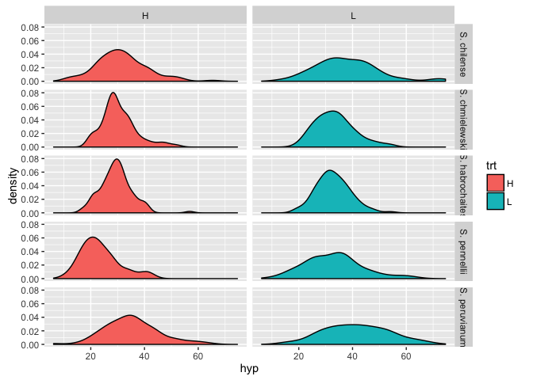
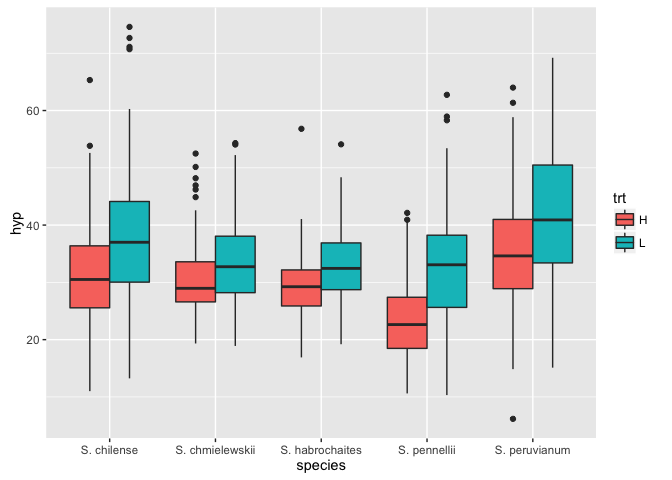
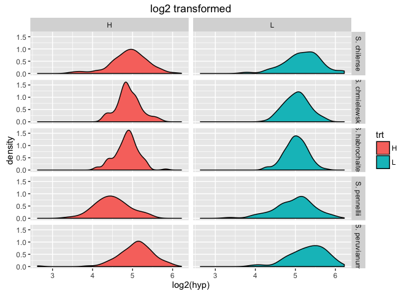
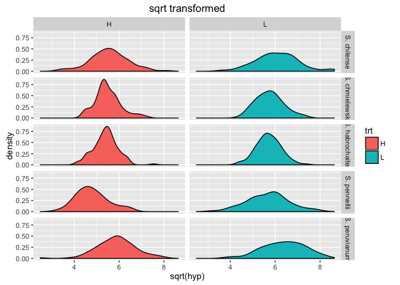
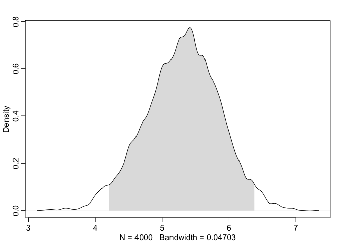

# Assignment-09-assignment
Ruijuan Li  
August 22, 2016  

# assignment 

```r
# 1) finish chapter 9.  (watch the lectures also if possible).
# 
# 2a) Redo the tomato hyp analysis (or at least the final model with species and treatment) but using square root transformation (Done). Are model fits improved? (use WAIC to check, compare) Does it change the parameter estimates? (yes)   
# 
# 2b) Is WAIC an appropriate way to compare the model fits with untransformed and transformed data? (no)  How can you test this? 
# 
# 2c) How do you get sqrt transformed parameter estimates (especially when they are < 1) back on the original scale (I don't know the answer to this) 
# 
# 3)  Fit a model with a species by treatment interaction. Which species have a trt response that is different from S. chm? 
```

# non transformed data 

```r
setwd("~/Desktop/2016_summer/R_club/Assignment_Chapter_09")

# load the data and libraries
data <- read.csv("TomatoR2CSHL.csv")

library(rethinking)
```

```
## Loading required package: rstan
```

```
## Warning: package 'rstan' was built under R version 3.2.5
```

```
## Loading required package: ggplot2
```

```
## Loading required package: StanHeaders
```

```
## Warning: package 'StanHeaders' was built under R version 3.2.5
```

```
## rstan (Version 2.10.1, packaged: 2016-06-24 13:22:16 UTC, GitRev: 85f7a56811da)
```

```
## For execution on a local, multicore CPU with excess RAM we recommend calling
## rstan_options(auto_write = TRUE)
## options(mc.cores = parallel::detectCores())
```

```
## Loading required package: parallel
```

```
## rethinking (Version 1.59)
```

```r
library(ggplot2)
library(reshape2)

# take a look at the data
head(data)
```

```
##   shelf flat col row    acs trt days   date   hyp int1 int2 int3 int4
## 1     Z    1   B   1 LA2580   H   28 5/5/08 19.46 2.37 1.59 1.87 0.51
## 2     Z    1   C   1 LA1305   H   28 5/5/08 31.28 3.34 0.01 9.19 1.62
## 3     Z    1   D   1 LA1973   H   28 5/5/08 56.65 8.43 2.39 6.70 3.69
## 4     Z    1   E   1 LA2748   H   28 5/5/08 35.18 0.56 0.00 1.60 0.61
## 5     Z    1   F   1 LA2931   H   28 5/5/08 35.32 0.82 0.02 1.49 0.46
## 6     Z    1   G   1 LA1317   H   28 5/5/08 28.74 1.07 6.69 5.72 4.76
##   intleng totleng petleng leafleng leafwid leafnum ndvi      lat      lon
## 1    6.34   25.80   15.78    30.53   34.44       5  111  -9.5167 -78.0083
## 2   14.16   45.44   12.36    22.93   13.99       4  120 -13.3833 -75.3583
## 3   21.21   77.86   13.05    46.71   43.78       5  110 -16.2333 -71.7000
## 4    2.77   37.95    8.08    26.82   33.28       5  105 -20.4833 -69.9833
## 5    2.79   38.11    7.68    22.40   23.61       5  106 -20.9167 -69.0667
## 6   18.24   46.98   23.66    42.35   42.35       5  132 -13.4167 -73.8417
##    alt         species who
## 1  740    S. pennellii Dan
## 2 3360   S. peruvianum Dan
## 3 2585   S. peruvianum Dan
## 4 1020     S. chilense Dan
## 5 2460     S. chilense Dan
## 6 2000 S. chmielewskii Dan
```

```r
summary(data)
```

```
##  shelf        flat            col           row            acs     
##  U:161   Min.   : 1.00   G      :133   Min.   :1.00   LA1954 : 40  
##  V:174   1st Qu.: 9.00   H      :127   1st Qu.:2.00   LA2695 : 39  
##  W:178   Median :17.00   F      :125   Median :3.00   LA1361 : 37  
##  X:174   Mean   :17.89   C      :117   Mean   :2.56   LA2167 : 37  
##  Y:125   3rd Qu.:28.00   D      :117   3rd Qu.:4.00   LA2773 : 37  
##  Z:196   Max.   :36.00   E      :107   Max.   :4.00   LA1474 : 36  
##                          (Other):282                  (Other):782  
##  trt          days           date          hyp             int1      
##  H:495   Min.   :28.00   5/5/08:716   Min.   : 6.17   Min.   : 0.00  
##  L:513   1st Qu.:28.00   5/6/08:292   1st Qu.:26.81   1st Qu.: 1.74  
##          Median :28.00                Median :32.02   Median : 3.59  
##          Mean   :28.29                Mean   :33.36   Mean   : 4.71  
##          3rd Qu.:29.00                3rd Qu.:38.56   3rd Qu.: 6.46  
##          Max.   :29.00                Max.   :74.60   Max.   :39.01  
##                                                       NA's   :1      
##       int2             int3             int4           intleng      
##  Min.   : 0.000   Min.   : 0.010   Min.   : 0.030   Min.   : 0.000  
##  1st Qu.: 1.060   1st Qu.: 2.975   1st Qu.: 2.163   1st Qu.: 9.637  
##  Median : 3.120   Median : 5.625   Median : 3.995   Median :17.255  
##  Mean   : 4.287   Mean   : 6.794   Mean   : 5.102   Mean   :20.340  
##  3rd Qu.: 6.320   3rd Qu.: 9.367   3rd Qu.: 7.018   3rd Qu.:28.145  
##  Max.   :28.980   Max.   :27.760   Max.   :23.280   Max.   :92.420  
##  NA's   :1        NA's   :4        NA's   :102                      
##     totleng          petleng         leafleng        leafwid     
##  Min.   : 13.59   Min.   : 1.53   Min.   : 9.74   Min.   : 8.29  
##  1st Qu.: 39.25   1st Qu.:11.20   1st Qu.:27.43   1st Qu.:29.48  
##  Median : 50.98   Median :15.13   Median :34.59   Median :39.62  
##  Mean   : 53.70   Mean   :15.92   Mean   :35.54   Mean   :39.29  
##  3rd Qu.: 64.76   3rd Qu.:20.48   3rd Qu.:42.98   3rd Qu.:47.75  
##  Max.   :129.43   Max.   :44.44   Max.   :95.19   Max.   :90.27  
##                   NA's   :2       NA's   :1       NA's   :1      
##     leafnum           ndvi          lat               lon        
##  Min.   :3.000   Min.   :100   Min.   :-25.400   Min.   :-78.52  
##  1st Qu.:5.000   1st Qu.:108   1st Qu.:-16.607   1st Qu.:-75.92  
##  Median :5.000   Median :115   Median :-14.152   Median :-73.63  
##  Mean   :5.063   Mean   :118   Mean   :-14.490   Mean   :-73.71  
##  3rd Qu.:6.000   3rd Qu.:128   3rd Qu.:-12.450   3rd Qu.:-71.70  
##  Max.   :8.000   Max.   :137   Max.   : -5.767   Max.   :-68.07  
##  NA's   :1                                                       
##       alt                  species      who     
##  Min.   :   0   S. chilense    :207   Dan :402  
##  1st Qu.:1020   S. chmielewskii:226   Pepe:606  
##  Median :2240   S. habrochaites:226             
##  Mean   :2035   S. pennellii   :132             
##  3rd Qu.:3110   S. peruvianum  :217             
##  Max.   :3540                                   
## 
```

```r
# density plots
pl <- ggplot(data=data,aes(x=hyp,fill=trt))
pl <- pl + geom_density()
pl <- pl + facet_grid(species ~ trt)
pl
```



```r
# box plots
pl <- ggplot(data=data,aes(y=hyp,x=species,fill=trt))
pl <- pl + geom_boxplot()
pl
```



```r
# log2 transformation
pl <- ggplot(data=data,aes(x=log2(hyp),fill=trt))
pl <- pl + geom_density()
pl <- pl + facet_grid(species ~ trt)
pl + ggtitle("log2 transformed")
```



```r
# Square root transformation
pl <- ggplot(data=data,aes(x=sqrt(hyp),fill=trt))
pl <- pl + geom_density()
pl <- pl + facet_grid(species ~ trt)
pl + ggtitle("sqrt transformed")
```



```r
#normality test
by(data$hyp,list(data$trt,data$species),shapiro.test) # seperate normality test for each sampling. 
```

```
## : H
## : S. chilense
## 
## 	Shapiro-Wilk normality test
## 
## data:  dd[x, ]
## W = 0.97615, p-value = 0.06157
## 
## -------------------------------------------------------- 
## : L
## : S. chilense
## 
## 	Shapiro-Wilk normality test
## 
## data:  dd[x, ]
## W = 0.96132, p-value = 0.003754
## 
## -------------------------------------------------------- 
## : H
## : S. chmielewskii
## 
## 	Shapiro-Wilk normality test
## 
## data:  dd[x, ]
## W = 0.93713, p-value = 6.374e-05
## 
## -------------------------------------------------------- 
## : L
## : S. chmielewskii
## 
## 	Shapiro-Wilk normality test
## 
## data:  dd[x, ]
## W = 0.97217, p-value = 0.01553
## 
## -------------------------------------------------------- 
## : H
## : S. habrochaites
## 
## 	Shapiro-Wilk normality test
## 
## data:  dd[x, ]
## W = 0.95978, p-value = 0.001285
## 
## -------------------------------------------------------- 
## : L
## : S. habrochaites
## 
## 	Shapiro-Wilk normality test
## 
## data:  dd[x, ]
## W = 0.98706, p-value = 0.3921
## 
## -------------------------------------------------------- 
## : H
## : S. pennellii
## 
## 	Shapiro-Wilk normality test
## 
## data:  dd[x, ]
## W = 0.93801, p-value = 0.004416
## 
## -------------------------------------------------------- 
## : L
## : S. pennellii
## 
## 	Shapiro-Wilk normality test
## 
## data:  dd[x, ]
## W = 0.97952, p-value = 0.2895
## 
## -------------------------------------------------------- 
## : H
## : S. peruvianum
## 
## 	Shapiro-Wilk normality test
## 
## data:  dd[x, ]
## W = 0.98393, p-value = 0.2357
## 
## -------------------------------------------------------- 
## : L
## : S. peruvianum
## 
## 	Shapiro-Wilk normality test
## 
## data:  dd[x, ]
## W = 0.99081, p-value = 0.6571
```

```r
by(sqrt(data$hyp),list(data$trt,data$species),shapiro.test)
```

```
## : H
## : S. chilense
## 
## 	Shapiro-Wilk normality test
## 
## data:  dd[x, ]
## W = 0.98965, p-value = 0.6224
## 
## -------------------------------------------------------- 
## : L
## : S. chilense
## 
## 	Shapiro-Wilk normality test
## 
## data:  dd[x, ]
## W = 0.98696, p-value = 0.3991
## 
## -------------------------------------------------------- 
## : H
## : S. chmielewskii
## 
## 	Shapiro-Wilk normality test
## 
## data:  dd[x, ]
## W = 0.96342, p-value = 0.004341
## 
## -------------------------------------------------------- 
## : L
## : S. chmielewskii
## 
## 	Shapiro-Wilk normality test
## 
## data:  dd[x, ]
## W = 0.9881, p-value = 0.399
## 
## -------------------------------------------------------- 
## : H
## : S. habrochaites
## 
## 	Shapiro-Wilk normality test
## 
## data:  dd[x, ]
## W = 0.97928, p-value = 0.06305
## 
## -------------------------------------------------------- 
## : L
## : S. habrochaites
## 
## 	Shapiro-Wilk normality test
## 
## data:  dd[x, ]
## W = 0.99519, p-value = 0.9731
## 
## -------------------------------------------------------- 
## : H
## : S. pennellii
## 
## 	Shapiro-Wilk normality test
## 
## data:  dd[x, ]
## W = 0.96999, p-value = 0.1457
## 
## -------------------------------------------------------- 
## : L
## : S. pennellii
## 
## 	Shapiro-Wilk normality test
## 
## data:  dd[x, ]
## W = 0.99243, p-value = 0.9467
## 
## -------------------------------------------------------- 
## : H
## : S. peruvianum
## 
## 	Shapiro-Wilk normality test
## 
## data:  dd[x, ]
## W = 0.97994, p-value = 0.1125
## 
## -------------------------------------------------------- 
## : L
## : S. peruvianum
## 
## 	Shapiro-Wilk normality test
## 
## data:  dd[x, ]
## W = 0.98796, p-value = 0.4209
```

```r
by(log2(data$hyp),list(data$trt,data$species),shapiro.test)
```

```
## : H
## : S. chilense
## 
## 	Shapiro-Wilk normality test
## 
## data:  dd[x, ]
## W = 0.97087, p-value = 0.02352
## 
## -------------------------------------------------------- 
## : L
## : S. chilense
## 
## 	Shapiro-Wilk normality test
## 
## data:  dd[x, ]
## W = 0.98253, p-value = 0.1827
## 
## -------------------------------------------------------- 
## : H
## : S. chmielewskii
## 
## 	Shapiro-Wilk normality test
## 
## data:  dd[x, ]
## W = 0.97867, p-value = 0.07747
## 
## -------------------------------------------------------- 
## : L
## : S. chmielewskii
## 
## 	Shapiro-Wilk normality test
## 
## data:  dd[x, ]
## W = 0.9949, p-value = 0.9493
## 
## -------------------------------------------------------- 
## : H
## : S. habrochaites
## 
## 	Shapiro-Wilk normality test
## 
## data:  dd[x, ]
## W = 0.98243, p-value = 0.123
## 
## -------------------------------------------------------- 
## : L
## : S. habrochaites
## 
## 	Shapiro-Wilk normality test
## 
## data:  dd[x, ]
## W = 0.99303, p-value = 0.8653
## 
## -------------------------------------------------------- 
## : H
## : S. pennellii
## 
## 	Shapiro-Wilk normality test
## 
## data:  dd[x, ]
## W = 0.98586, p-value = 0.7146
## 
## -------------------------------------------------------- 
## : L
## : S. pennellii
## 
## 	Shapiro-Wilk normality test
## 
## data:  dd[x, ]
## W = 0.97622, p-value = 0.1895
## 
## -------------------------------------------------------- 
## : H
## : S. peruvianum
## 
## 	Shapiro-Wilk normality test
## 
## data:  dd[x, ]
## W = 0.91602, p-value = 5.466e-06
## 
## -------------------------------------------------------- 
## : L
## : S. peruvianum
## 
## 	Shapiro-Wilk normality test
## 
## data:  dd[x, ]
## W = 0.96537, p-value = 0.005283
```

```r
#sqrt transformed is best

# categorical variable for trt
data$trtL <- ifelse(data$trt=="L",1,0)

# alternative way
levels(data$trt)
```

```
## [1] "H" "L"
```

```r
data$trt2 <- as.numeric(data$trt)-1 # 0 = H, 1 = L

identical(data$trt2, data$trtL) # the two methods produce the same result. 
```

```
## [1] TRUE
```

```r
#must subset the data frame to contain only the relevant columns
data.trt <- data[,c("hyp","trt2")]

head(data.trt)
```

```
##     hyp trt2
## 1 19.46    0
## 2 31.28    0
## 3 56.65    0
## 4 35.18    0
## 5 35.32    0
## 6 28.74    0
```

```r
data.trt
```

```
##        hyp trt2
## 1    19.46    0
## 2    31.28    0
## 3    56.65    0
## 4    35.18    0
## 5    35.32    0
## 6    28.74    0
## 7    33.07    0
## 8    42.13    0
## 9    32.70    0
## 10   34.32    0
## 11   28.22    0
## 12   29.77    0
## 13   32.72    0
## 14   31.53    0
## 15   41.03    0
## 16   33.64    0
## 17   22.82    0
## 18   48.10    0
## 19   51.83    0
## 20   32.94    0
## 21   27.71    0
## 22   30.68    0
## 23   35.54    0
## 24   35.61    0
## 25   22.42    0
## 26   37.14    0
## 27   37.87    0
## 28   23.82    0
## 29   29.75    0
## 30   48.18    0
## 31   33.93    0
## 32   26.85    0
## 33   28.76    0
## 34   24.10    0
## 35   18.96    0
## 36   30.29    0
## 37   24.67    0
## 38   31.65    0
## 39   35.64    0
## 40   27.14    0
## 41   31.95    0
## 42   15.62    0
## 43   12.55    0
## 44   31.66    0
## 45   44.43    0
## 46   32.16    0
## 47   33.44    0
## 48   33.27    0
## 49   36.68    0
## 50   35.11    0
## 51   27.38    0
## 52   28.79    0
## 53   33.60    0
## 54   49.00    0
## 55   40.07    0
## 56   28.58    0
## 57   20.79    0
## 58   33.89    0
## 59   34.04    0
## 60   42.59    0
## 61   45.15    0
## 62   24.82    0
## 63   27.46    0
## 64   50.15    0
## 65   33.47    0
## 66   27.01    0
## 67   21.76    0
## 68   18.50    0
## 69   43.24    0
## 70   42.55    0
## 71   23.74    0
## 72   53.84    0
## 73   31.87    0
## 74   29.88    0
## 75   40.95    0
## 76   27.69    0
## 77   21.45    0
## 78   57.41    0
## 79   26.44    0
## 80   34.32    0
## 81   42.31    0
## 82   33.14    0
## 83   39.85    0
## 84   40.66    0
## 85   40.80    0
## 86   22.85    0
## 87   32.88    0
## 88   21.18    0
## 89   27.69    0
## 90   19.81    0
## 91   35.69    0
## 92   36.33    0
## 93   13.86    0
## 94   35.60    0
## 95   38.32    0
## 96   28.85    0
## 97   22.50    0
## 98   20.75    0
## 99   38.11    1
## 100  17.80    1
## 101  40.96    1
## 102  27.80    1
## 103  72.67    1
## 104  28.98    1
## 105  41.24    1
## 106  58.30    1
## 107  53.56    1
## 108  44.13    1
## 109  41.48    1
## 110  32.50    1
## 111  21.34    1
## 112  41.62    1
## 113  44.48    1
## 114  39.68    1
## 115  35.79    1
## 116  34.39    1
## 117  35.88    1
## 118  25.96    1
## 119  27.44    1
## 120  41.42    1
## 121  50.34    1
## 122  22.82    1
## 123  40.98    1
## 124  33.20    1
## 125  22.16    1
## 126  23.13    1
## 127  31.07    1
## 128  47.62    1
## 129  18.01    1
## 130  26.15    1
## 131  44.12    1
## 132  31.40    1
## 133  34.89    1
## 134  31.15    1
## 135  31.23    1
## 136  34.56    1
## 137  37.23    1
## 138  58.16    1
## 139  21.71    1
## 140  24.31    1
## 141  39.05    1
## 142  19.76    1
## 143  28.66    1
## 144  63.98    1
## 145  26.78    1
## 146  32.73    1
## 147  26.99    1
## 148  28.09    1
## 149  39.27    1
## 150  27.58    1
## 151  47.16    1
## 152  42.72    1
## 153  37.78    1
## 154  38.42    1
## 155  31.72    1
## 156  28.33    0
## 157  24.88    0
## 158  43.36    0
## 159  32.55    0
## 160  44.99    0
## 161  35.39    0
## 162  32.29    0
## 163  38.80    0
## 164  22.04    0
## 165  28.02    0
## 166  51.69    0
## 167  14.85    0
## 168  26.60    0
## 169  30.04    0
## 170  27.40    0
## 171  33.71    0
## 172  26.17    0
## 173  27.01    0
## 174  22.88    0
## 175  47.47    0
## 176  29.38    0
## 177  29.94    0
## 178  20.54    0
## 179  20.25    0
## 180  36.12    0
## 181  21.46    0
## 182  26.98    0
## 183  38.31    0
## 184  39.76    0
## 185  12.18    0
## 186  27.92    0
## 187  36.06    0
## 188  25.16    0
## 189  20.15    0
## 190  25.34    0
## 191  38.09    1
## 192  28.98    1
## 193  42.84    1
## 194  37.78    1
## 195  44.79    1
## 196  25.63    1
## 197  37.88    1
## 198  47.31    1
## 199  52.88    1
## 200  30.16    1
## 201  29.84    1
## 202  34.84    1
## 203  24.18    1
## 204  25.09    1
## 205  32.80    1
## 206  53.15    1
## 207  48.57    1
## 208  51.35    1
## 209  31.18    1
## 210  23.69    1
## 211  33.35    1
## 212  44.82    1
## 213  37.34    1
## 214  32.37    1
## 215  29.94    1
## 216  40.94    1
## 217  54.31    1
## 218  18.90    1
## 219  33.46    1
## 220  67.92    1
## 221  74.60    1
## 222  35.41    1
## 223  48.47    1
## 224  34.60    1
## 225  43.90    1
## 226  29.73    1
## 227  32.53    1
## 228  34.29    1
## 229  31.15    1
## 230  26.31    1
## 231  15.67    1
## 232  51.49    1
## 233  42.26    1
## 234  36.40    1
## 235  28.87    1
## 236  28.72    1
## 237  28.16    1
## 238  35.83    1
## 239  39.66    1
## 240  20.13    1
## 241  49.31    1
## 242  39.51    1
## 243  32.29    1
## 244  27.43    1
## 245  32.34    1
## 246  29.94    1
## 247  31.25    1
## 248  69.21    1
## 249  37.93    1
## 250  43.61    1
## 251  40.19    1
## 252  44.51    1
## 253  47.26    1
## 254  37.27    1
## 255  61.28    1
## 256  33.58    1
## 257  47.63    1
## 258  41.11    1
## 259  31.63    1
## 260  19.88    1
## 261  62.74    1
## 262  55.16    1
## 263  41.54    1
## 264  42.59    1
## 265  34.72    1
## 266  35.77    1
## 267  29.85    1
## 268  35.23    1
## 269  33.16    1
## 270  31.53    1
## 271  43.14    1
## 272  22.66    1
## 273  54.06    1
## 274  44.60    1
## 275  30.42    1
## 276  33.58    1
## 277  15.85    1
## 278  63.10    1
## 279  36.64    1
## 280  35.68    1
## 281  28.43    1
## 282  34.73    1
## 283  26.24    1
## 284  51.77    1
## 285  53.92    1
## 286  46.87    1
## 287  35.76    1
## 288  31.63    1
## 289  33.82    1
## 290  24.84    1
## 291  34.47    1
## 292  20.78    1
## 293  64.42    1
## 294  57.47    1
## 295  42.80    1
## 296  30.85    1
## 297  34.57    1
## 298  35.90    1
## 299  35.87    1
## 300  24.23    1
## 301  37.61    1
## 302  34.45    1
## 303  34.60    1
## 304  45.86    1
## 305  38.40    1
## 306  43.95    1
## 307  31.60    1
## 308  26.58    0
## 309  36.36    0
## 310  45.24    0
## 311  44.75    0
## 312  42.58    0
## 313  35.68    0
## 314  37.66    0
## 315  33.47    0
## 316  39.22    0
## 317  35.46    0
## 318  38.87    0
## 319  34.70    0
## 320  28.26    0
## 321  39.67    0
## 322  19.58    0
## 323  40.93    0
## 324  42.39    0
## 325  65.32    0
## 326  28.59    0
## 327  31.52    0
## 328  33.95    0
## 329  28.58    0
## 330  28.90    0
## 331  45.36    0
## 332  20.35    0
## 333  39.08    0
## 334  28.17    0
## 335  37.54    0
## 336  20.10    0
## 337  23.75    0
## 338  34.38    0
## 339  28.11    0
## 340  34.15    0
## 341  29.82    0
## 342  56.81    0
## 343  22.56    0
## 344  33.61    0
## 345  58.84    0
## 346  25.37    0
## 347  41.40    0
## 348  32.47    0
## 349  28.03    0
## 350  32.05    0
## 351  28.99    0
## 352  18.40    0
## 353  33.17    0
## 354  51.77    0
## 355  40.78    0
## 356  44.43    0
## 357  27.39    0
## 358  26.41    0
## 359  29.11    0
## 360  23.33    0
## 361  15.69    0
## 362  22.77    0
## 363  40.77    0
## 364  26.64    0
## 365  34.33    0
## 366  40.00    0
## 367  35.34    0
## 368  32.03    0
## 369  35.90    0
## 370  23.36    0
## 371  29.23    0
## 372  31.60    0
## 373  34.80    0
## 374  29.32    0
## 375  32.92    0
## 376  16.27    0
## 377  36.19    0
## 378  49.53    0
## 379  23.06    0
## 380  19.33    0
## 381  29.07    0
## 382  17.47    0
## 383  25.38    0
## 384  51.55    0
## 385  29.95    0
## 386  27.76    0
## 387  25.64    0
## 388  31.06    0
## 389  24.06    0
## 390  24.71    0
## 391  19.46    0
## 392  35.75    0
## 393  27.80    0
## 394  31.47    0
## 395  26.78    0
## 396  44.88    0
## 397  27.70    0
## 398  30.41    0
## 399  36.34    0
## 400  44.10    1
## 401  24.36    1
## 402  42.45    1
## 403  49.97    1
## 404  48.54    1
## 405  39.11    1
## 406  38.62    1
## 407  40.63    1
## 408  15.36    1
## 409  51.58    1
## 410  55.33    1
## 411  33.75    1
## 412  23.83    1
## 413  38.49    1
## 414  30.90    1
## 415  32.72    1
## 416  42.46    1
## 417  18.12    1
## 418  20.16    1
## 419  47.36    1
## 420  38.46    1
## 421  34.04    1
## 422  34.45    1
## 423  30.19    1
## 424  25.58    1
## 425  35.08    1
## 426  30.44    1
## 427  40.11    1
## 428  45.27    1
## 429  29.73    1
## 430  46.38    1
## 431  44.01    1
## 432  37.74    1
## 433  40.30    1
## 434  32.44    1
## 435  34.29    0
## 436  33.59    0
## 437  41.06    0
## 438  39.97    0
## 439  10.61    0
## 440  36.00    0
## 441  44.60    0
## 442  27.28    0
## 443  41.73    0
## 444  35.86    0
## 445  21.68    0
## 446  29.24    0
## 447  22.70    0
## 448  64.00    0
## 449  29.80    0
## 450  31.70    0
## 451  23.37    0
## 452  20.22    0
## 453  27.04    0
## 454  30.35    0
## 455  14.21    0
## 456  30.05    0
## 457  26.86    0
## 458  21.40    0
## 459  39.03    0
## 460  25.54    0
## 461  25.50    0
## 462  31.95    0
## 463  29.39    0
## 464  35.55    1
## 465  34.62    1
## 466  46.68    1
## 467  31.82    1
## 468  27.40    1
## 469  41.76    1
## 470  42.54    1
## 471  34.55    1
## 472  40.46    1
## 473  24.23    1
## 474  45.20    1
## 475  36.42    1
## 476  50.99    1
## 477  30.65    1
## 478  31.96    1
## 479  34.52    1
## 480  38.60    1
## 481  56.50    1
## 482  30.04    1
## 483  44.73    1
## 484  32.03    1
## 485  35.32    1
## 486  37.43    1
## 487  34.10    1
## 488  29.64    1
## 489  38.63    1
## 490  47.51    1
## 491  60.27    1
## 492  48.25    1
## 493  34.66    1
## 494  26.86    1
## 495  35.16    1
## 496  21.85    0
## 497  31.26    0
## 498  37.93    0
## 499  17.82    0
## 500  34.11    0
## 501  30.08    0
## 502  29.51    0
## 503  14.16    0
## 504  16.79    0
## 505  31.12    0
## 506  41.97    0
## 507  28.48    0
## 508  23.10    0
## 509  24.46    0
## 510  34.62    0
## 511  35.60    0
## 512  33.14    0
## 513  29.65    0
## 514  25.72    0
## 515  27.40    0
## 516  20.17    0
## 517  37.23    0
## 518  51.22    0
## 519  28.29    0
## 520  38.70    0
## 521  24.63    0
## 522  28.55    0
## 523  33.64    1
## 524  20.40    1
## 525  33.13    1
## 526  41.29    1
## 527  38.94    1
## 528  37.33    1
## 529  31.47    1
## 530  15.11    1
## 531  28.89    1
## 532  25.47    1
## 533  25.17    1
## 534  36.09    1
## 535  32.98    1
## 536  24.40    1
## 537  52.72    1
## 538  30.99    1
## 539  23.27    1
## 540  26.14    1
## 541  25.43    1
## 542  22.32    1
## 543  55.29    1
## 544  37.16    1
## 545  38.06    1
## 546  35.80    1
## 547  32.55    1
## 548  26.45    1
## 549  41.00    0
## 550  34.36    0
## 551  31.46    0
## 552  26.39    0
## 553  31.76    0
## 554  33.51    0
## 555  28.57    0
## 556  31.55    0
## 557  24.39    0
## 558  31.33    0
## 559  29.20    0
## 560  38.73    1
## 561  26.02    1
## 562  37.01    1
## 563  34.31    1
## 564  38.75    1
## 565  33.33    1
## 566  31.08    1
## 567  31.51    1
## 568  53.35    1
## 569  45.29    1
## 570  51.87    1
## 571  26.82    1
## 572  34.09    1
## 573  38.93    1
## 574  48.49    1
## 575  33.65    1
## 576  37.64    1
## 577  54.52    1
## 578  30.12    1
## 579  37.07    1
## 580  22.67    1
## 581  36.36    1
## 582  41.94    1
## 583  35.76    1
## 584  31.23    1
## 585  46.66    1
## 586  48.05    1
## 587  32.53    1
## 588  32.14    1
## 589  37.53    1
## 590  22.81    0
## 591  36.79    0
## 592  33.99    0
## 593  34.09    0
## 594  31.76    0
## 595  20.09    0
## 596  36.91    0
## 597  28.91    0
## 598  33.17    0
## 599  24.75    0
## 600  22.72    0
## 601  27.53    0
## 602  25.96    0
## 603  19.40    0
## 604  39.82    0
## 605  23.49    0
## 606  21.78    0
## 607  27.42    0
## 608  25.87    0
## 609  22.61    0
## 610  25.71    0
## 611  33.40    0
## 612  26.41    0
## 613  22.38    0
## 614  46.93    0
## 615  27.59    0
## 616  29.13    0
## 617  24.31    0
## 618  22.87    1
## 619  40.84    1
## 620  24.16    1
## 621  23.61    1
## 622  44.63    1
## 623  35.00    1
## 624  25.08    1
## 625  41.05    1
## 626  19.20    1
## 627  43.87    1
## 628  36.86    1
## 629  32.93    1
## 630  27.80    1
## 631  26.45    1
## 632  33.78    1
## 633  27.17    1
## 634  35.35    1
## 635  43.80    1
## 636  71.11    1
## 637  45.83    1
## 638  34.56    1
## 639  33.00    1
## 640  26.37    1
## 641  26.34    1
## 642  57.34    1
## 643  45.50    1
## 644  28.89    1
## 645  25.41    1
## 646  10.32    1
## 647  28.04    1
## 648  63.55    1
## 649  31.82    1
## 650  51.02    1
## 651  42.25    1
## 652  38.78    1
## 653  31.45    1
## 654  31.16    1
## 655  62.64    1
## 656  40.28    1
## 657  14.42    1
## 658  38.39    1
## 659  25.67    1
## 660  58.95    1
## 661  43.49    1
## 662  56.16    1
## 663  32.66    1
## 664  27.49    1
## 665  32.04    1
## 666  32.50    1
## 667  36.44    1
## 668  19.29    1
## 669  39.67    1
## 670  40.29    1
## 671  36.39    1
## 672  37.96    1
## 673  19.91    1
## 674  51.73    1
## 675  25.77    1
## 676  45.54    1
## 677  38.07    1
## 678  37.25    1
## 679  19.50    1
## 680  49.72    1
## 681  40.65    1
## 682  31.71    1
## 683  35.36    1
## 684  35.80    1
## 685  54.10    1
## 686  42.73    1
## 687  25.42    1
## 688  35.62    1
## 689  43.00    1
## 690  26.66    1
## 691  24.27    1
## 692  28.81    1
## 693  27.31    1
## 694  28.80    1
## 695  23.29    1
## 696  29.64    1
## 697  19.67    1
## 698  52.22    1
## 699  28.07    1
## 700  26.33    1
## 701  29.75    1
## 702  34.06    0
## 703  29.91    0
## 704  39.79    0
## 705  49.11    0
## 706  33.81    0
## 707  32.35    0
## 708  32.80    0
## 709  20.85    0
## 710  33.48    0
## 711  35.18    0
## 712  41.47    0
## 713  23.00    0
## 714  28.70    0
## 715  25.84    0
## 716  20.88    0
## 717  15.65    0
## 718  26.74    0
## 719  30.62    0
## 720  33.10    0
## 721  28.55    0
## 722  29.75    0
## 723  30.99    0
## 724  25.98    0
## 725  44.88    0
## 726  27.39    0
## 727  37.58    0
## 728  24.47    0
## 729  20.71    0
## 730  21.13    0
## 731  28.83    1
## 732  58.53    1
## 733  35.73    1
## 734  70.71    1
## 735  42.53    1
## 736  35.88    1
## 737  48.35    1
## 738  32.57    1
## 739  34.88    1
## 740  43.61    1
## 741  34.21    1
## 742  40.78    1
## 743  37.53    1
## 744  27.69    1
## 745  32.56    1
## 746  28.27    1
## 747  27.77    1
## 748  29.95    1
## 749  28.30    1
## 750  30.40    1
## 751  25.51    1
## 752  41.47    1
## 753  39.00    1
## 754  33.82    1
## 755  21.75    0
## 756  21.35    0
## 757  17.73    0
## 758  36.03    0
## 759  46.21    0
## 760  28.44    0
## 761  38.77    0
## 762  19.76    0
## 763  20.03    0
## 764  34.11    0
## 765  31.79    0
## 766  52.60    0
## 767  25.84    0
## 768  31.92    0
## 769  29.50    0
## 770  16.94    0
## 771  27.46    0
## 772  25.63    0
## 773  29.06    0
## 774  17.37    0
## 775  30.10    0
## 776  26.98    0
## 777  17.36    0
## 778  29.71    0
## 779   6.17    0
## 780  40.99    0
## 781  30.55    0
## 782  30.24    0
## 783  35.73    0
## 784  28.47    0
## 785  24.55    0
## 786  28.78    0
## 787  15.97    1
## 788  27.38    1
## 789  35.47    1
## 790  43.19    1
## 791  48.31    1
## 792  36.52    1
## 793  35.01    1
## 794  30.13    1
## 795  58.40    1
## 796  29.57    1
## 797  17.90    1
## 798  35.38    1
## 799  49.20    1
## 800  37.05    1
## 801  22.05    1
## 802  25.82    1
## 803  26.78    1
## 804  33.20    1
## 805  48.63    1
## 806  32.34    1
## 807  29.23    1
## 808  35.36    1
## 809  22.52    1
## 810  33.14    1
## 811  23.41    0
## 812  16.46    0
## 813  40.51    0
## 814  28.96    0
## 815  30.29    0
## 816  22.88    0
## 817  51.57    0
## 818  28.85    0
## 819  21.79    0
## 820  22.37    0
## 821  28.17    0
## 822  30.48    0
## 823  39.87    0
## 824  25.00    0
## 825  33.10    0
## 826  30.46    0
## 827  31.17    0
## 828  29.28    0
## 829  20.65    0
## 830  27.09    0
## 831  40.47    0
## 832  35.79    0
## 833  22.18    0
## 834  30.98    0
## 835  32.57    0
## 836  26.61    0
## 837  27.77    0
## 838  23.10    1
## 839  46.94    1
## 840  13.24    1
## 841  25.69    1
## 842  28.62    1
## 843  30.87    1
## 844  30.42    1
## 845  30.93    1
## 846  53.42    1
## 847  43.26    1
## 848  29.81    1
## 849  25.37    1
## 850  30.50    1
## 851  45.89    1
## 852  27.32    1
## 853  35.47    1
## 854  36.96    1
## 855  44.40    1
## 856  33.88    1
## 857  32.02    1
## 858  29.55    1
## 859  26.08    1
## 860  39.66    1
## 861  32.44    1
## 862  44.97    1
## 863  23.83    1
## 864  49.87    1
## 865  23.10    1
## 866  33.50    1
## 867  29.03    1
## 868  29.08    0
## 869  31.34    0
## 870  33.98    0
## 871  31.14    0
## 872  28.61    0
## 873  30.81    0
## 874  29.48    0
## 875  18.09    0
## 876  36.83    0
## 877  33.51    0
## 878  23.78    0
## 879  29.56    0
## 880  24.77    0
## 881  23.06    0
## 882  29.37    0
## 883  38.33    0
## 884  32.08    0
## 885  36.49    0
## 886  20.12    0
## 887  28.23    0
## 888  25.92    0
## 889  22.64    0
## 890  22.36    0
## 891  36.85    0
## 892  11.01    0
## 893  26.77    0
## 894  52.49    0
## 895  27.60    0
## 896  19.58    0
## 897  17.74    0
## 898  29.00    1
## 899  44.08    1
## 900  43.82    1
## 901  42.62    1
## 902  30.63    1
## 903  40.68    1
## 904  52.90    1
## 905  38.49    1
## 906  30.37    1
## 907  42.26    1
## 908  30.68    1
## 909  41.75    1
## 910  24.12    1
## 911  50.91    1
## 912  37.94    1
## 913  37.00    1
## 914  25.38    1
## 915  27.87    1
## 916  26.21    1
## 917  28.76    1
## 918  34.66    1
## 919  28.05    1
## 920  47.00    1
## 921  38.75    1
## 922  32.91    1
## 923  30.14    1
## 924  28.78    1
## 925  33.81    0
## 926  22.93    0
## 927  43.67    0
## 928  37.01    0
## 929  30.90    0
## 930  21.62    0
## 931  28.09    0
## 932  16.76    0
## 933  25.41    0
## 934  18.33    0
## 935  34.56    0
## 936  25.98    0
## 937  25.63    0
## 938  29.19    0
## 939  37.10    0
## 940  18.10    0
## 941  41.81    0
## 942  41.30    0
## 943  24.42    0
## 944  28.81    0
## 945  30.72    0
## 946  27.22    0
## 947  30.79    0
## 948  61.35    0
## 949  41.46    0
## 950  33.90    0
## 951  25.30    0
## 952  31.71    0
## 953  28.46    0
## 954  23.77    0
## 955  28.36    0
## 956  31.44    0
## 957  40.54    1
## 958  36.76    1
## 959  35.34    1
## 960  34.64    1
## 961  23.24    1
## 962  29.51    1
## 963  48.81    1
## 964  34.71    1
## 965  26.45    1
## 966  28.62    1
## 967  38.55    1
## 968  40.10    0
## 969  36.02    1
## 970  20.33    1
## 971  26.03    1
## 972  28.52    1
## 973  39.30    1
## 974  26.26    1
## 975  25.15    1
## 976  28.20    1
## 977  28.69    1
## 978  24.90    1
## 979  51.24    1
## 980  46.28    1
## 981  32.01    1
## 982  28.42    1
## 983  35.96    1
## 984  26.15    1
## 985  16.90    0
## 986  20.73    0
## 987  27.43    0
## 988  28.44    0
## 989  30.00    0
## 990  19.70    0
## 991  35.19    0
## 992  26.17    0
## 993  13.02    0
## 994  23.39    0
## 995  26.34    0
## 996  26.36    0
## 997  34.95    0
## 998  26.32    0
## 999  27.06    0
## 1000 26.03    0
## 1001 30.61    0
## 1002 25.04    0
## 1003 29.38    0
## 1004 37.00    0
## 1005 26.59    0
## 1006 32.11    0
## 1007 29.00    0
## 1008 27.62    0
```

```r
mean(data.trt$hyp)
```

```
## [1] 33.35597
```

```r
# trt model
trt.stan <- map2stan(alist(
  hyp ~ dnorm(mu,sigma),
  mu <- a + bT * trt2, 
  a ~ dnorm(0,100),
  bT ~ dnorm(0,10),
  sigma ~ dunif(0,20)),
  data.trt,
  chains = 4)
```

```
## In file included from file26c923a9cc43.cpp:8:
## In file included from /Library/Frameworks/R.framework/Versions/3.2/Resources/library/StanHeaders/include/src/stan/model/model_header.hpp:4:
## In file included from /Library/Frameworks/R.framework/Versions/3.2/Resources/library/StanHeaders/include/stan/math.hpp:4:
## In file included from /Library/Frameworks/R.framework/Versions/3.2/Resources/library/StanHeaders/include/stan/math/rev/mat.hpp:4:
## In file included from /Library/Frameworks/R.framework/Versions/3.2/Resources/library/StanHeaders/include/stan/math/rev/core.hpp:42:
## /Library/Frameworks/R.framework/Versions/3.2/Resources/library/StanHeaders/include/stan/math/rev/core/set_zero_all_adjoints.hpp:14:17: warning: unused function 'set_zero_all_adjoints' [-Wunused-function]
##     static void set_zero_all_adjoints() {
##                 ^
## In file included from file26c923a9cc43.cpp:8:
## In file included from /Library/Frameworks/R.framework/Versions/3.2/Resources/library/StanHeaders/include/src/stan/model/model_header.hpp:4:
## In file included from /Library/Frameworks/R.framework/Versions/3.2/Resources/library/StanHeaders/include/stan/math.hpp:4:
## In file included from /Library/Frameworks/R.framework/Versions/3.2/Resources/library/StanHeaders/include/stan/math/rev/mat.hpp:4:
## In file included from /Library/Frameworks/R.framework/Versions/3.2/Resources/library/StanHeaders/include/stan/math/rev/core.hpp:43:
## /Library/Frameworks/R.framework/Versions/3.2/Resources/library/StanHeaders/include/stan/math/rev/core/set_zero_all_adjoints_nested.hpp:17:17: warning: 'static' function 'set_zero_all_adjoints_nested' declared in header file should be declared 'static inline' [-Wunneeded-internal-declaration]
##     static void set_zero_all_adjoints_nested() {
##                 ^
## In file included from file26c923a9cc43.cpp:8:
## In file included from /Library/Frameworks/R.framework/Versions/3.2/Resources/library/StanHeaders/include/src/stan/model/model_header.hpp:4:
## In file included from /Library/Frameworks/R.framework/Versions/3.2/Resources/library/StanHeaders/include/stan/math.hpp:4:
## In file included from /Library/Frameworks/R.framework/Versions/3.2/Resources/library/StanHeaders/include/stan/math/rev/mat.hpp:8:
## In file included from /Library/Frameworks/R.framework/Versions/3.2/Resources/library/StanHeaders/include/stan/math/prim/mat.hpp:55:
## /Library/Frameworks/R.framework/Versions/3.2/Resources/library/StanHeaders/include/stan/math/prim/mat/fun/autocorrelation.hpp:19:14: warning: function 'fft_next_good_size' is not needed and will not be emitted [-Wunneeded-internal-declaration]
##       size_t fft_next_good_size(size_t N) {
##              ^
## In file included from file26c923a9cc43.cpp:8:
## In file included from /Library/Frameworks/R.framework/Versions/3.2/Resources/library/StanHeaders/include/src/stan/model/model_header.hpp:4:
## In file included from /Library/Frameworks/R.framework/Versions/3.2/Resources/library/StanHeaders/include/stan/math.hpp:4:
## In file included from /Library/Frameworks/R.framework/Versions/3.2/Resources/library/StanHeaders/include/stan/math/rev/mat.hpp:8:
## In file included from /Library/Frameworks/R.framework/Versions/3.2/Resources/library/StanHeaders/include/stan/math/prim/mat.hpp:36:
## /Library/Frameworks/R.framework/Versions/3.2/Resources/library/StanHeaders/include/stan/math/prim/mat/err/check_positive_ordered.hpp:39:67: warning: unused typedef 'size_type' [-Wunused-local-typedef]
##       typedef typename index_type<Matrix<T_y, Dynamic, 1> >::type size_type;
##                                                                   ^
## In file included from file26c923a9cc43.cpp:8:
## In file included from /Library/Frameworks/R.framework/Versions/3.2/Resources/library/StanHeaders/include/src/stan/model/model_header.hpp:4:
## In file included from /Library/Frameworks/R.framework/Versions/3.2/Resources/library/StanHeaders/include/stan/math.hpp:4:
## In file included from /Library/Frameworks/R.framework/Versions/3.2/Resources/library/StanHeaders/include/stan/math/rev/mat.hpp:8:
## In file included from /Library/Frameworks/R.framework/Versions/3.2/Resources/library/StanHeaders/include/stan/math/prim/mat.hpp:232:
## In file included from /Library/Frameworks/R.framework/Versions/3.2/Resources/library/StanHeaders/include/stan/math/prim/arr.hpp:33:
## In file included from /Library/Frameworks/R.framework/Versions/3.2/Resources/library/StanHeaders/include/stan/math/prim/arr/functor/integrate_ode_rk45.hpp:13:
## In file included from /Library/Frameworks/R.framework/Versions/3.2/Resources/library/BH/include/boost/numeric/odeint.hpp:61:
## In file included from /Library/Frameworks/R.framework/Versions/3.2/Resources/library/BH/include/boost/numeric/odeint/util/multi_array_adaption.hpp:29:
## In file included from /Library/Frameworks/R.framework/Versions/3.2/Resources/library/BH/include/boost/multi_array.hpp:21:
## In file included from /Library/Frameworks/R.framework/Versions/3.2/Resources/library/BH/include/boost/multi_array/base.hpp:28:
## /Library/Frameworks/R.framework/Versions/3.2/Resources/library/BH/include/boost/multi_array/concept_checks.hpp:42:43: warning: unused typedef 'index_range' [-Wunused-local-typedef]
##       typedef typename Array::index_range index_range;
##                                           ^
## /Library/Frameworks/R.framework/Versions/3.2/Resources/library/BH/include/boost/multi_array/concept_checks.hpp:43:37: warning: unused typedef 'index' [-Wunused-local-typedef]
##       typedef typename Array::index index;
##                                     ^
## /Library/Frameworks/R.framework/Versions/3.2/Resources/library/BH/include/boost/multi_array/concept_checks.hpp:53:43: warning: unused typedef 'index_range' [-Wunused-local-typedef]
##       typedef typename Array::index_range index_range;
##                                           ^
## /Library/Frameworks/R.framework/Versions/3.2/Resources/library/BH/include/boost/multi_array/concept_checks.hpp:54:37: warning: unused typedef 'index' [-Wunused-local-typedef]
##       typedef typename Array::index index;
##                                     ^
## 8 warnings generated.
## 
## SAMPLING FOR MODEL 'hyp ~ dnorm(mu, sigma)' NOW (CHAIN 1).
## 
## Chain 1, Iteration:    1 / 2000 [  0%]  (Warmup)
## Chain 1, Iteration:  200 / 2000 [ 10%]  (Warmup)
## Chain 1, Iteration:  400 / 2000 [ 20%]  (Warmup)
## Chain 1, Iteration:  600 / 2000 [ 30%]  (Warmup)
## Chain 1, Iteration:  800 / 2000 [ 40%]  (Warmup)
## Chain 1, Iteration: 1000 / 2000 [ 50%]  (Warmup)
## Chain 1, Iteration: 1001 / 2000 [ 50%]  (Sampling)
## Chain 1, Iteration: 1200 / 2000 [ 60%]  (Sampling)
## Chain 1, Iteration: 1400 / 2000 [ 70%]  (Sampling)
## Chain 1, Iteration: 1600 / 2000 [ 80%]  (Sampling)
## Chain 1, Iteration: 1800 / 2000 [ 90%]  (Sampling)
## Chain 1, Iteration: 2000 / 2000 [100%]  (Sampling)
##  Elapsed Time: 0.239011 seconds (Warm-up)
##                0.200538 seconds (Sampling)
##                0.439549 seconds (Total)
## 
## 
## SAMPLING FOR MODEL 'hyp ~ dnorm(mu, sigma)' NOW (CHAIN 2).
## 
## Chain 2, Iteration:    1 / 2000 [  0%]  (Warmup)
## Chain 2, Iteration:  200 / 2000 [ 10%]  (Warmup)
## Chain 2, Iteration:  400 / 2000 [ 20%]  (Warmup)
## Chain 2, Iteration:  600 / 2000 [ 30%]  (Warmup)
## Chain 2, Iteration:  800 / 2000 [ 40%]  (Warmup)
## Chain 2, Iteration: 1000 / 2000 [ 50%]  (Warmup)
## Chain 2, Iteration: 1001 / 2000 [ 50%]  (Sampling)
## Chain 2, Iteration: 1200 / 2000 [ 60%]  (Sampling)
## Chain 2, Iteration: 1400 / 2000 [ 70%]  (Sampling)
## Chain 2, Iteration: 1600 / 2000 [ 80%]  (Sampling)
## Chain 2, Iteration: 1800 / 2000 [ 90%]  (Sampling)
## Chain 2, Iteration: 2000 / 2000 [100%]  (Sampling)
##  Elapsed Time: 0.243602 seconds (Warm-up)
##                0.202848 seconds (Sampling)
##                0.44645 seconds (Total)
## 
## 
## SAMPLING FOR MODEL 'hyp ~ dnorm(mu, sigma)' NOW (CHAIN 3).
## 
## Chain 3, Iteration:    1 / 2000 [  0%]  (Warmup)
## Chain 3, Iteration:  200 / 2000 [ 10%]  (Warmup)
## Chain 3, Iteration:  400 / 2000 [ 20%]  (Warmup)
## Chain 3, Iteration:  600 / 2000 [ 30%]  (Warmup)
## Chain 3, Iteration:  800 / 2000 [ 40%]  (Warmup)
## Chain 3, Iteration: 1000 / 2000 [ 50%]  (Warmup)
## Chain 3, Iteration: 1001 / 2000 [ 50%]  (Sampling)
## Chain 3, Iteration: 1200 / 2000 [ 60%]  (Sampling)
## Chain 3, Iteration: 1400 / 2000 [ 70%]  (Sampling)
## Chain 3, Iteration: 1600 / 2000 [ 80%]  (Sampling)
## Chain 3, Iteration: 1800 / 2000 [ 90%]  (Sampling)
## Chain 3, Iteration: 2000 / 2000 [100%]  (Sampling)
##  Elapsed Time: 0.234997 seconds (Warm-up)
##                0.200796 seconds (Sampling)
##                0.435793 seconds (Total)
## 
## 
## SAMPLING FOR MODEL 'hyp ~ dnorm(mu, sigma)' NOW (CHAIN 4).
## 
## Chain 4, Iteration:    1 / 2000 [  0%]  (Warmup)
## Chain 4, Iteration:  200 / 2000 [ 10%]  (Warmup)
## Chain 4, Iteration:  400 / 2000 [ 20%]  (Warmup)
## Chain 4, Iteration:  600 / 2000 [ 30%]  (Warmup)
## Chain 4, Iteration:  800 / 2000 [ 40%]  (Warmup)
## Chain 4, Iteration: 1000 / 2000 [ 50%]  (Warmup)
## Chain 4, Iteration: 1001 / 2000 [ 50%]  (Sampling)
## Chain 4, Iteration: 1200 / 2000 [ 60%]  (Sampling)
## Chain 4, Iteration: 1400 / 2000 [ 70%]  (Sampling)
## Chain 4, Iteration: 1600 / 2000 [ 80%]  (Sampling)
## Chain 4, Iteration: 1800 / 2000 [ 90%]  (Sampling)
## Chain 4, Iteration: 2000 / 2000 [100%]  (Sampling)
##  Elapsed Time: 0.234856 seconds (Warm-up)
##                0.229447 seconds (Sampling)
##                0.464303 seconds (Total)
## 
## 
## SAMPLING FOR MODEL 'hyp ~ dnorm(mu, sigma)' NOW (CHAIN 1).
## WARNING: No variance estimation is
##          performed for num_warmup < 20
## 
## 
## Chain 1, Iteration: 1 / 1 [100%]  (Sampling)
##  Elapsed Time: 7e-06 seconds (Warm-up)
##                0.000183 seconds (Sampling)
##                0.00019 seconds (Total)
```

```
## Computing WAIC
```

```
## Constructing posterior predictions
```

```
## [ 400 / 4000 ]
[ 800 / 4000 ]
[ 1200 / 4000 ]
[ 1600 / 4000 ]
[ 2000 / 4000 ]
[ 2400 / 4000 ]
[ 2800 / 4000 ]
[ 3200 / 4000 ]
[ 3600 / 4000 ]
[ 4000 / 4000 ]
```

```r
# plot(hyp.stan) # Error in as.double(y) : cannot coerce type 'S4' to vector of type 'double'
precis(trt.stan)
```

```
##        Mean StdDev lower 0.89 upper 0.89 n_eff Rhat
## a     30.67   0.43      29.99      31.37  1916    1
## bT     5.27   0.60       4.34       6.23  1970    1
## sigma  9.60   0.21       9.28       9.93  3067    1
```

```r
# par(mfrow=c(1,1),mfcol=c(1,1))
# plot(precis(hyp.stan.trans))

head(data)
```

```
##   shelf flat col row    acs trt days   date   hyp int1 int2 int3 int4
## 1     Z    1   B   1 LA2580   H   28 5/5/08 19.46 2.37 1.59 1.87 0.51
## 2     Z    1   C   1 LA1305   H   28 5/5/08 31.28 3.34 0.01 9.19 1.62
## 3     Z    1   D   1 LA1973   H   28 5/5/08 56.65 8.43 2.39 6.70 3.69
## 4     Z    1   E   1 LA2748   H   28 5/5/08 35.18 0.56 0.00 1.60 0.61
## 5     Z    1   F   1 LA2931   H   28 5/5/08 35.32 0.82 0.02 1.49 0.46
## 6     Z    1   G   1 LA1317   H   28 5/5/08 28.74 1.07 6.69 5.72 4.76
##   intleng totleng petleng leafleng leafwid leafnum ndvi      lat      lon
## 1    6.34   25.80   15.78    30.53   34.44       5  111  -9.5167 -78.0083
## 2   14.16   45.44   12.36    22.93   13.99       4  120 -13.3833 -75.3583
## 3   21.21   77.86   13.05    46.71   43.78       5  110 -16.2333 -71.7000
## 4    2.77   37.95    8.08    26.82   33.28       5  105 -20.4833 -69.9833
## 5    2.79   38.11    7.68    22.40   23.61       5  106 -20.9167 -69.0667
## 6   18.24   46.98   23.66    42.35   42.35       5  132 -13.4167 -73.8417
##    alt         species who trtL trt2
## 1  740    S. pennellii Dan    0    0
## 2 3360   S. peruvianum Dan    0    0
## 3 2585   S. peruvianum Dan    0    0
## 4 1020     S. chilense Dan    0    0
## 5 2460     S. chilense Dan    0    0
## 6 2000 S. chmielewskii Dan    0    0
```

```r
# fit a model with species 
data.species <- data[,c("hyp","species")]
data.species$id <- 1:nrow(data.species)
data.species <- dcast(data.species, hyp + id ~ species, value.var="species", fun.aggregate = length)
colnames(data.species) <- sub(". ","_",fixed = TRUE, colnames(data.species))
head(data.species)
```

```
##     hyp  id S_chilense S_chmielewskii S_habrochaites S_pennellii
## 1  6.17 779          0              0              0           0
## 2 10.32 646          0              0              0           1
## 3 10.61 439          0              0              0           1
## 4 11.01 892          1              0              0           0
## 5 12.18 185          1              0              0           0
## 6 12.55  43          0              0              0           1
##   S_peruvianum
## 1            1
## 2            0
## 3            0
## 4            0
## 5            0
## 6            0
```

```r
data.species <- data.species[,c(-2)]

species.stan <- map2stan(alist(
  hyp ~ dnorm(mu,sigma),
  mu <- bChil*S_chilense + bChmi*S_chmielewskii + bHab*S_habrochaites + bPen * S_pennellii + bPer*S_peruvianum,
  c(bChil,bChmi,bHab,bPen,bPer) ~ dnorm(5.7,20), # almost identical results were produced no matter which start value I use 
  sigma ~ dunif(0,20)),
  data.species,
  chains = 4)
```

```
## In file included from file26c97fc3994a.cpp:8:
## In file included from /Library/Frameworks/R.framework/Versions/3.2/Resources/library/StanHeaders/include/src/stan/model/model_header.hpp:4:
## In file included from /Library/Frameworks/R.framework/Versions/3.2/Resources/library/StanHeaders/include/stan/math.hpp:4:
## In file included from /Library/Frameworks/R.framework/Versions/3.2/Resources/library/StanHeaders/include/stan/math/rev/mat.hpp:4:
## In file included from /Library/Frameworks/R.framework/Versions/3.2/Resources/library/StanHeaders/include/stan/math/rev/core.hpp:42:
## /Library/Frameworks/R.framework/Versions/3.2/Resources/library/StanHeaders/include/stan/math/rev/core/set_zero_all_adjoints.hpp:14:17: warning: unused function 'set_zero_all_adjoints' [-Wunused-function]
##     static void set_zero_all_adjoints() {
##                 ^
## In file included from file26c97fc3994a.cpp:8:
## In file included from /Library/Frameworks/R.framework/Versions/3.2/Resources/library/StanHeaders/include/src/stan/model/model_header.hpp:4:
## In file included from /Library/Frameworks/R.framework/Versions/3.2/Resources/library/StanHeaders/include/stan/math.hpp:4:
## In file included from /Library/Frameworks/R.framework/Versions/3.2/Resources/library/StanHeaders/include/stan/math/rev/mat.hpp:4:
## In file included from /Library/Frameworks/R.framework/Versions/3.2/Resources/library/StanHeaders/include/stan/math/rev/core.hpp:43:
## /Library/Frameworks/R.framework/Versions/3.2/Resources/library/StanHeaders/include/stan/math/rev/core/set_zero_all_adjoints_nested.hpp:17:17: warning: 'static' function 'set_zero_all_adjoints_nested' declared in header file should be declared 'static inline' [-Wunneeded-internal-declaration]
##     static void set_zero_all_adjoints_nested() {
##                 ^
## In file included from file26c97fc3994a.cpp:8:
## In file included from /Library/Frameworks/R.framework/Versions/3.2/Resources/library/StanHeaders/include/src/stan/model/model_header.hpp:4:
## In file included from /Library/Frameworks/R.framework/Versions/3.2/Resources/library/StanHeaders/include/stan/math.hpp:4:
## In file included from /Library/Frameworks/R.framework/Versions/3.2/Resources/library/StanHeaders/include/stan/math/rev/mat.hpp:8:
## In file included from /Library/Frameworks/R.framework/Versions/3.2/Resources/library/StanHeaders/include/stan/math/prim/mat.hpp:55:
## /Library/Frameworks/R.framework/Versions/3.2/Resources/library/StanHeaders/include/stan/math/prim/mat/fun/autocorrelation.hpp:19:14: warning: function 'fft_next_good_size' is not needed and will not be emitted [-Wunneeded-internal-declaration]
##       size_t fft_next_good_size(size_t N) {
##              ^
## In file included from file26c97fc3994a.cpp:8:
## In file included from /Library/Frameworks/R.framework/Versions/3.2/Resources/library/StanHeaders/include/src/stan/model/model_header.hpp:4:
## In file included from /Library/Frameworks/R.framework/Versions/3.2/Resources/library/StanHeaders/include/stan/math.hpp:4:
## In file included from /Library/Frameworks/R.framework/Versions/3.2/Resources/library/StanHeaders/include/stan/math/rev/mat.hpp:8:
## In file included from /Library/Frameworks/R.framework/Versions/3.2/Resources/library/StanHeaders/include/stan/math/prim/mat.hpp:36:
## /Library/Frameworks/R.framework/Versions/3.2/Resources/library/StanHeaders/include/stan/math/prim/mat/err/check_positive_ordered.hpp:39:67: warning: unused typedef 'size_type' [-Wunused-local-typedef]
##       typedef typename index_type<Matrix<T_y, Dynamic, 1> >::type size_type;
##                                                                   ^
## In file included from file26c97fc3994a.cpp:8:
## In file included from /Library/Frameworks/R.framework/Versions/3.2/Resources/library/StanHeaders/include/src/stan/model/model_header.hpp:4:
## In file included from /Library/Frameworks/R.framework/Versions/3.2/Resources/library/StanHeaders/include/stan/math.hpp:4:
## In file included from /Library/Frameworks/R.framework/Versions/3.2/Resources/library/StanHeaders/include/stan/math/rev/mat.hpp:8:
## In file included from /Library/Frameworks/R.framework/Versions/3.2/Resources/library/StanHeaders/include/stan/math/prim/mat.hpp:232:
## In file included from /Library/Frameworks/R.framework/Versions/3.2/Resources/library/StanHeaders/include/stan/math/prim/arr.hpp:33:
## In file included from /Library/Frameworks/R.framework/Versions/3.2/Resources/library/StanHeaders/include/stan/math/prim/arr/functor/integrate_ode_rk45.hpp:13:
## In file included from /Library/Frameworks/R.framework/Versions/3.2/Resources/library/BH/include/boost/numeric/odeint.hpp:61:
## In file included from /Library/Frameworks/R.framework/Versions/3.2/Resources/library/BH/include/boost/numeric/odeint/util/multi_array_adaption.hpp:29:
## In file included from /Library/Frameworks/R.framework/Versions/3.2/Resources/library/BH/include/boost/multi_array.hpp:21:
## In file included from /Library/Frameworks/R.framework/Versions/3.2/Resources/library/BH/include/boost/multi_array/base.hpp:28:
## /Library/Frameworks/R.framework/Versions/3.2/Resources/library/BH/include/boost/multi_array/concept_checks.hpp:42:43: warning: unused typedef 'index_range' [-Wunused-local-typedef]
##       typedef typename Array::index_range index_range;
##                                           ^
## /Library/Frameworks/R.framework/Versions/3.2/Resources/library/BH/include/boost/multi_array/concept_checks.hpp:43:37: warning: unused typedef 'index' [-Wunused-local-typedef]
##       typedef typename Array::index index;
##                                     ^
## /Library/Frameworks/R.framework/Versions/3.2/Resources/library/BH/include/boost/multi_array/concept_checks.hpp:53:43: warning: unused typedef 'index_range' [-Wunused-local-typedef]
##       typedef typename Array::index_range index_range;
##                                           ^
## /Library/Frameworks/R.framework/Versions/3.2/Resources/library/BH/include/boost/multi_array/concept_checks.hpp:54:37: warning: unused typedef 'index' [-Wunused-local-typedef]
##       typedef typename Array::index index;
##                                     ^
## 8 warnings generated.
## 
## SAMPLING FOR MODEL 'hyp ~ dnorm(mu, sigma)' NOW (CHAIN 1).
## 
## Chain 1, Iteration:    1 / 2000 [  0%]  (Warmup)
## Chain 1, Iteration:  200 / 2000 [ 10%]  (Warmup)
## Chain 1, Iteration:  400 / 2000 [ 20%]  (Warmup)
## Chain 1, Iteration:  600 / 2000 [ 30%]  (Warmup)
## Chain 1, Iteration:  800 / 2000 [ 40%]  (Warmup)
## Chain 1, Iteration: 1000 / 2000 [ 50%]  (Warmup)
## Chain 1, Iteration: 1001 / 2000 [ 50%]  (Sampling)
## Chain 1, Iteration: 1200 / 2000 [ 60%]  (Sampling)
## Chain 1, Iteration: 1400 / 2000 [ 70%]  (Sampling)
## Chain 1, Iteration: 1600 / 2000 [ 80%]  (Sampling)
## Chain 1, Iteration: 1800 / 2000 [ 90%]  (Sampling)
## Chain 1, Iteration: 2000 / 2000 [100%]  (Sampling)
##  Elapsed Time: 1.05937 seconds (Warm-up)
##                0.601986 seconds (Sampling)
##                1.66135 seconds (Total)
## 
## 
## SAMPLING FOR MODEL 'hyp ~ dnorm(mu, sigma)' NOW (CHAIN 2).
## 
## Chain 2, Iteration:    1 / 2000 [  0%]  (Warmup)
## Chain 2, Iteration:  200 / 2000 [ 10%]  (Warmup)
## Chain 2, Iteration:  400 / 2000 [ 20%]  (Warmup)
## Chain 2, Iteration:  600 / 2000 [ 30%]  (Warmup)
## Chain 2, Iteration:  800 / 2000 [ 40%]  (Warmup)
## Chain 2, Iteration: 1000 / 2000 [ 50%]  (Warmup)
## Chain 2, Iteration: 1001 / 2000 [ 50%]  (Sampling)
## Chain 2, Iteration: 1200 / 2000 [ 60%]  (Sampling)
## Chain 2, Iteration: 1400 / 2000 [ 70%]  (Sampling)
## Chain 2, Iteration: 1600 / 2000 [ 80%]  (Sampling)
## Chain 2, Iteration: 1800 / 2000 [ 90%]  (Sampling)
## Chain 2, Iteration: 2000 / 2000 [100%]  (Sampling)
##  Elapsed Time: 1.05871 seconds (Warm-up)
##                0.657691 seconds (Sampling)
##                1.7164 seconds (Total)
## 
## 
## SAMPLING FOR MODEL 'hyp ~ dnorm(mu, sigma)' NOW (CHAIN 3).
## 
## Chain 3, Iteration:    1 / 2000 [  0%]  (Warmup)
## Chain 3, Iteration:  200 / 2000 [ 10%]  (Warmup)
## Chain 3, Iteration:  400 / 2000 [ 20%]  (Warmup)
## Chain 3, Iteration:  600 / 2000 [ 30%]  (Warmup)
## Chain 3, Iteration:  800 / 2000 [ 40%]  (Warmup)
## Chain 3, Iteration: 1000 / 2000 [ 50%]  (Warmup)
## Chain 3, Iteration: 1001 / 2000 [ 50%]  (Sampling)
## Chain 3, Iteration: 1200 / 2000 [ 60%]  (Sampling)
## Chain 3, Iteration: 1400 / 2000 [ 70%]  (Sampling)
## Chain 3, Iteration: 1600 / 2000 [ 80%]  (Sampling)
## Chain 3, Iteration: 1800 / 2000 [ 90%]  (Sampling)
## Chain 3, Iteration: 2000 / 2000 [100%]  (Sampling)
##  Elapsed Time: 1.11869 seconds (Warm-up)
##                0.614407 seconds (Sampling)
##                1.7331 seconds (Total)
## 
## 
## SAMPLING FOR MODEL 'hyp ~ dnorm(mu, sigma)' NOW (CHAIN 4).
## 
## Chain 4, Iteration:    1 / 2000 [  0%]  (Warmup)
## Chain 4, Iteration:  200 / 2000 [ 10%]  (Warmup)
## Chain 4, Iteration:  400 / 2000 [ 20%]  (Warmup)
## Chain 4, Iteration:  600 / 2000 [ 30%]  (Warmup)
## Chain 4, Iteration:  800 / 2000 [ 40%]  (Warmup)
## Chain 4, Iteration: 1000 / 2000 [ 50%]  (Warmup)
## Chain 4, Iteration: 1001 / 2000 [ 50%]  (Sampling)
## Chain 4, Iteration: 1200 / 2000 [ 60%]  (Sampling)
## Chain 4, Iteration: 1400 / 2000 [ 70%]  (Sampling)
## Chain 4, Iteration: 1600 / 2000 [ 80%]  (Sampling)
## Chain 4, Iteration: 1800 / 2000 [ 90%]  (Sampling)
## Chain 4, Iteration: 2000 / 2000 [100%]  (Sampling)
##  Elapsed Time: 1.06929 seconds (Warm-up)
##                0.603633 seconds (Sampling)
##                1.67292 seconds (Total)
## 
## 
## SAMPLING FOR MODEL 'hyp ~ dnorm(mu, sigma)' NOW (CHAIN 1).
## WARNING: No variance estimation is
##          performed for num_warmup < 20
## 
## 
## Chain 1, Iteration: 1 / 1 [100%]  (Sampling)
##  Elapsed Time: 5e-06 seconds (Warm-up)
##                0.000321 seconds (Sampling)
##                0.000326 seconds (Total)
```

```
## Computing WAIC
## Constructing posterior predictions
```

```
## [ 400 / 4000 ]
[ 800 / 4000 ]
[ 1200 / 4000 ]
[ 1600 / 4000 ]
[ 2000 / 4000 ]
[ 2400 / 4000 ]
[ 2800 / 4000 ]
[ 3200 / 4000 ]
[ 3600 / 4000 ]
[ 4000 / 4000 ]
```

```r
# plot(species.stan)
precis(species.stan)
```

```
##        Mean StdDev lower 0.89 upper 0.89 n_eff Rhat
## bChil 34.74   0.68      33.68      35.84  4000    1
## bChmi 32.05   0.62      31.01      33.03  4000    1
## bHab  31.06   0.64      30.11      32.15  4000    1
## bPen  28.74   0.81      27.43      30.00  4000    1
## bPer  38.47   0.66      37.36      39.47  4000    1
## sigma  9.45   0.21       9.11       9.79  4000    1
```

```r
# par(mfrow=c(1,1),mfcol=c(1,1))
# plot(precis(species.stan))

# model with species and treatment

head(data)
```

```
##   shelf flat col row    acs trt days   date   hyp int1 int2 int3 int4
## 1     Z    1   B   1 LA2580   H   28 5/5/08 19.46 2.37 1.59 1.87 0.51
## 2     Z    1   C   1 LA1305   H   28 5/5/08 31.28 3.34 0.01 9.19 1.62
## 3     Z    1   D   1 LA1973   H   28 5/5/08 56.65 8.43 2.39 6.70 3.69
## 4     Z    1   E   1 LA2748   H   28 5/5/08 35.18 0.56 0.00 1.60 0.61
## 5     Z    1   F   1 LA2931   H   28 5/5/08 35.32 0.82 0.02 1.49 0.46
## 6     Z    1   G   1 LA1317   H   28 5/5/08 28.74 1.07 6.69 5.72 4.76
##   intleng totleng petleng leafleng leafwid leafnum ndvi      lat      lon
## 1    6.34   25.80   15.78    30.53   34.44       5  111  -9.5167 -78.0083
## 2   14.16   45.44   12.36    22.93   13.99       4  120 -13.3833 -75.3583
## 3   21.21   77.86   13.05    46.71   43.78       5  110 -16.2333 -71.7000
## 4    2.77   37.95    8.08    26.82   33.28       5  105 -20.4833 -69.9833
## 5    2.79   38.11    7.68    22.40   23.61       5  106 -20.9167 -69.0667
## 6   18.24   46.98   23.66    42.35   42.35       5  132 -13.4167 -73.8417
##    alt         species who trtL trt2
## 1  740    S. pennellii Dan    0    0
## 2 3360   S. peruvianum Dan    0    0
## 3 2585   S. peruvianum Dan    0    0
## 4 1020     S. chilense Dan    0    0
## 5 2460     S. chilense Dan    0    0
## 6 2000 S. chmielewskii Dan    0    0
```

```r
data.species.trt <- data[,c("hyp", "species", "trt")]

head(data.species.trt)
```

```
##     hyp         species trt
## 1 19.46    S. pennellii   H
## 2 31.28   S. peruvianum   H
## 3 56.65   S. peruvianum   H
## 4 35.18     S. chilense   H
## 5 35.32     S. chilense   H
## 6 28.74 S. chmielewskii   H
```

```r
data.species.trt$id <- 1:nrow(data.species.trt)
data.species.trt <- dcast(data.species.trt, hyp + trt + id ~ species, value.var="species", fun.aggregate = length)
data.species.trt <- data.species.trt[,c(-3)]
data.species.trt$trt <- as.numeric(data.species.trt$trt)-1
colnames(data.species.trt) <- sub(". ","_",fixed = TRUE, colnames(data.species.trt))
head(data.species.trt)
```

```
##     hyp trt S_chilense S_chmielewskii S_habrochaites S_pennellii
## 1  6.17   0          0              0              0           0
## 2 10.32   1          0              0              0           1
## 3 10.61   0          0              0              0           1
## 4 11.01   0          1              0              0           0
## 5 12.18   0          1              0              0           0
## 6 12.55   0          0              0              0           1
##   S_peruvianum
## 1            1
## 2            0
## 3            0
## 4            0
## 5            0
## 6            0
```

```r
species.trt.stan <- map2stan(alist(
  hyp ~ dnorm(mu,sigma),
  mu <- a + bT*trt + bChil*S_chilense + bHab*S_habrochaites + bPen * S_pennellii + bPer*S_peruvianum,
  a ~ dnorm(33.35,10),
  c(bT,bChil,bHab,bPen,bPer) ~ dnorm(0,10),
  sigma ~ dunif(0,20)),
  data.species.trt,
  chains = 4)
```

```
## In file included from file26c9d5ddbde.cpp:8:
## In file included from /Library/Frameworks/R.framework/Versions/3.2/Resources/library/StanHeaders/include/src/stan/model/model_header.hpp:4:
## In file included from /Library/Frameworks/R.framework/Versions/3.2/Resources/library/StanHeaders/include/stan/math.hpp:4:
## In file included from /Library/Frameworks/R.framework/Versions/3.2/Resources/library/StanHeaders/include/stan/math/rev/mat.hpp:4:
## In file included from /Library/Frameworks/R.framework/Versions/3.2/Resources/library/StanHeaders/include/stan/math/rev/core.hpp:42:
## /Library/Frameworks/R.framework/Versions/3.2/Resources/library/StanHeaders/include/stan/math/rev/core/set_zero_all_adjoints.hpp:14:17: warning: unused function 'set_zero_all_adjoints' [-Wunused-function]
##     static void set_zero_all_adjoints() {
##                 ^
## In file included from file26c9d5ddbde.cpp:8:
## In file included from /Library/Frameworks/R.framework/Versions/3.2/Resources/library/StanHeaders/include/src/stan/model/model_header.hpp:4:
## In file included from /Library/Frameworks/R.framework/Versions/3.2/Resources/library/StanHeaders/include/stan/math.hpp:4:
## In file included from /Library/Frameworks/R.framework/Versions/3.2/Resources/library/StanHeaders/include/stan/math/rev/mat.hpp:4:
## In file included from /Library/Frameworks/R.framework/Versions/3.2/Resources/library/StanHeaders/include/stan/math/rev/core.hpp:43:
## /Library/Frameworks/R.framework/Versions/3.2/Resources/library/StanHeaders/include/stan/math/rev/core/set_zero_all_adjoints_nested.hpp:17:17: warning: 'static' function 'set_zero_all_adjoints_nested' declared in header file should be declared 'static inline' [-Wunneeded-internal-declaration]
##     static void set_zero_all_adjoints_nested() {
##                 ^
## In file included from file26c9d5ddbde.cpp:8:
## In file included from /Library/Frameworks/R.framework/Versions/3.2/Resources/library/StanHeaders/include/src/stan/model/model_header.hpp:4:
## In file included from /Library/Frameworks/R.framework/Versions/3.2/Resources/library/StanHeaders/include/stan/math.hpp:4:
## In file included from /Library/Frameworks/R.framework/Versions/3.2/Resources/library/StanHeaders/include/stan/math/rev/mat.hpp:8:
## In file included from /Library/Frameworks/R.framework/Versions/3.2/Resources/library/StanHeaders/include/stan/math/prim/mat.hpp:55:
## /Library/Frameworks/R.framework/Versions/3.2/Resources/library/StanHeaders/include/stan/math/prim/mat/fun/autocorrelation.hpp:19:14: warning: function 'fft_next_good_size' is not needed and will not be emitted [-Wunneeded-internal-declaration]
##       size_t fft_next_good_size(size_t N) {
##              ^
## In file included from file26c9d5ddbde.cpp:8:
## In file included from /Library/Frameworks/R.framework/Versions/3.2/Resources/library/StanHeaders/include/src/stan/model/model_header.hpp:4:
## In file included from /Library/Frameworks/R.framework/Versions/3.2/Resources/library/StanHeaders/include/stan/math.hpp:4:
## In file included from /Library/Frameworks/R.framework/Versions/3.2/Resources/library/StanHeaders/include/stan/math/rev/mat.hpp:8:
## In file included from /Library/Frameworks/R.framework/Versions/3.2/Resources/library/StanHeaders/include/stan/math/prim/mat.hpp:36:
## /Library/Frameworks/R.framework/Versions/3.2/Resources/library/StanHeaders/include/stan/math/prim/mat/err/check_positive_ordered.hpp:39:67: warning: unused typedef 'size_type' [-Wunused-local-typedef]
##       typedef typename index_type<Matrix<T_y, Dynamic, 1> >::type size_type;
##                                                                   ^
## In file included from file26c9d5ddbde.cpp:8:
## In file included from /Library/Frameworks/R.framework/Versions/3.2/Resources/library/StanHeaders/include/src/stan/model/model_header.hpp:4:
## In file included from /Library/Frameworks/R.framework/Versions/3.2/Resources/library/StanHeaders/include/stan/math.hpp:4:
## In file included from /Library/Frameworks/R.framework/Versions/3.2/Resources/library/StanHeaders/include/stan/math/rev/mat.hpp:8:
## In file included from /Library/Frameworks/R.framework/Versions/3.2/Resources/library/StanHeaders/include/stan/math/prim/mat.hpp:232:
## In file included from /Library/Frameworks/R.framework/Versions/3.2/Resources/library/StanHeaders/include/stan/math/prim/arr.hpp:33:
## In file included from /Library/Frameworks/R.framework/Versions/3.2/Resources/library/StanHeaders/include/stan/math/prim/arr/functor/integrate_ode_rk45.hpp:13:
## In file included from /Library/Frameworks/R.framework/Versions/3.2/Resources/library/BH/include/boost/numeric/odeint.hpp:61:
## In file included from /Library/Frameworks/R.framework/Versions/3.2/Resources/library/BH/include/boost/numeric/odeint/util/multi_array_adaption.hpp:29:
## In file included from /Library/Frameworks/R.framework/Versions/3.2/Resources/library/BH/include/boost/multi_array.hpp:21:
## In file included from /Library/Frameworks/R.framework/Versions/3.2/Resources/library/BH/include/boost/multi_array/base.hpp:28:
## /Library/Frameworks/R.framework/Versions/3.2/Resources/library/BH/include/boost/multi_array/concept_checks.hpp:42:43: warning: unused typedef 'index_range' [-Wunused-local-typedef]
##       typedef typename Array::index_range index_range;
##                                           ^
## /Library/Frameworks/R.framework/Versions/3.2/Resources/library/BH/include/boost/multi_array/concept_checks.hpp:43:37: warning: unused typedef 'index' [-Wunused-local-typedef]
##       typedef typename Array::index index;
##                                     ^
## /Library/Frameworks/R.framework/Versions/3.2/Resources/library/BH/include/boost/multi_array/concept_checks.hpp:53:43: warning: unused typedef 'index_range' [-Wunused-local-typedef]
##       typedef typename Array::index_range index_range;
##                                           ^
## /Library/Frameworks/R.framework/Versions/3.2/Resources/library/BH/include/boost/multi_array/concept_checks.hpp:54:37: warning: unused typedef 'index' [-Wunused-local-typedef]
##       typedef typename Array::index index;
##                                     ^
## 8 warnings generated.
## 
## SAMPLING FOR MODEL 'hyp ~ dnorm(mu, sigma)' NOW (CHAIN 1).
## 
## Chain 1, Iteration:    1 / 2000 [  0%]  (Warmup)
## Chain 1, Iteration:  200 / 2000 [ 10%]  (Warmup)
## Chain 1, Iteration:  400 / 2000 [ 20%]  (Warmup)
## Chain 1, Iteration:  600 / 2000 [ 30%]  (Warmup)
## Chain 1, Iteration:  800 / 2000 [ 40%]  (Warmup)
## Chain 1, Iteration: 1000 / 2000 [ 50%]  (Warmup)
## Chain 1, Iteration: 1001 / 2000 [ 50%]  (Sampling)
## Chain 1, Iteration: 1200 / 2000 [ 60%]  (Sampling)
## Chain 1, Iteration: 1400 / 2000 [ 70%]  (Sampling)
## Chain 1, Iteration: 1600 / 2000 [ 80%]  (Sampling)
## Chain 1, Iteration: 1800 / 2000 [ 90%]  (Sampling)
## Chain 1, Iteration: 2000 / 2000 [100%]  (Sampling)
##  Elapsed Time: 2.06647 seconds (Warm-up)
##                1.40187 seconds (Sampling)
##                3.46834 seconds (Total)
## 
## 
## SAMPLING FOR MODEL 'hyp ~ dnorm(mu, sigma)' NOW (CHAIN 2).
## 
## Chain 2, Iteration:    1 / 2000 [  0%]  (Warmup)
## Chain 2, Iteration:  200 / 2000 [ 10%]  (Warmup)
## Chain 2, Iteration:  400 / 2000 [ 20%]  (Warmup)
## Chain 2, Iteration:  600 / 2000 [ 30%]  (Warmup)
## Chain 2, Iteration:  800 / 2000 [ 40%]  (Warmup)
## Chain 2, Iteration: 1000 / 2000 [ 50%]  (Warmup)
## Chain 2, Iteration: 1001 / 2000 [ 50%]  (Sampling)
## Chain 2, Iteration: 1200 / 2000 [ 60%]  (Sampling)
## Chain 2, Iteration: 1400 / 2000 [ 70%]  (Sampling)
## Chain 2, Iteration: 1600 / 2000 [ 80%]  (Sampling)
## Chain 2, Iteration: 1800 / 2000 [ 90%]  (Sampling)
## Chain 2, Iteration: 2000 / 2000 [100%]  (Sampling)
##  Elapsed Time: 2.04809 seconds (Warm-up)
##                1.29271 seconds (Sampling)
##                3.3408 seconds (Total)
## 
## 
## SAMPLING FOR MODEL 'hyp ~ dnorm(mu, sigma)' NOW (CHAIN 3).
## 
## Chain 3, Iteration:    1 / 2000 [  0%]  (Warmup)
## Chain 3, Iteration:  200 / 2000 [ 10%]  (Warmup)
## Chain 3, Iteration:  400 / 2000 [ 20%]  (Warmup)
## Chain 3, Iteration:  600 / 2000 [ 30%]  (Warmup)
## Chain 3, Iteration:  800 / 2000 [ 40%]  (Warmup)
## Chain 3, Iteration: 1000 / 2000 [ 50%]  (Warmup)
## Chain 3, Iteration: 1001 / 2000 [ 50%]  (Sampling)
## Chain 3, Iteration: 1200 / 2000 [ 60%]  (Sampling)
## Chain 3, Iteration: 1400 / 2000 [ 70%]  (Sampling)
## Chain 3, Iteration: 1600 / 2000 [ 80%]  (Sampling)
## Chain 3, Iteration: 1800 / 2000 [ 90%]  (Sampling)
## Chain 3, Iteration: 2000 / 2000 [100%]  (Sampling)
##  Elapsed Time: 1.834 seconds (Warm-up)
##                1.2205 seconds (Sampling)
##                3.0545 seconds (Total)
## 
## 
## SAMPLING FOR MODEL 'hyp ~ dnorm(mu, sigma)' NOW (CHAIN 4).
## 
## Chain 4, Iteration:    1 / 2000 [  0%]  (Warmup)
## Chain 4, Iteration:  200 / 2000 [ 10%]  (Warmup)
## Chain 4, Iteration:  400 / 2000 [ 20%]  (Warmup)
## Chain 4, Iteration:  600 / 2000 [ 30%]  (Warmup)
## Chain 4, Iteration:  800 / 2000 [ 40%]  (Warmup)
## Chain 4, Iteration: 1000 / 2000 [ 50%]  (Warmup)
## Chain 4, Iteration: 1001 / 2000 [ 50%]  (Sampling)
## Chain 4, Iteration: 1200 / 2000 [ 60%]  (Sampling)
## Chain 4, Iteration: 1400 / 2000 [ 70%]  (Sampling)
## Chain 4, Iteration: 1600 / 2000 [ 80%]  (Sampling)
## Chain 4, Iteration: 1800 / 2000 [ 90%]  (Sampling)
## Chain 4, Iteration: 2000 / 2000 [100%]  (Sampling)
##  Elapsed Time: 1.84254 seconds (Warm-up)
##                1.33542 seconds (Sampling)
##                3.17797 seconds (Total)
## 
## 
## SAMPLING FOR MODEL 'hyp ~ dnorm(mu, sigma)' NOW (CHAIN 1).
## WARNING: No variance estimation is
##          performed for num_warmup < 20
## 
## 
## Chain 1, Iteration: 1 / 1 [100%]  (Sampling)
##  Elapsed Time: 6e-06 seconds (Warm-up)
##                0.000411 seconds (Sampling)
##                0.000417 seconds (Total)
```

```
## Computing WAIC
## Constructing posterior predictions
```

```
## [ 400 / 4000 ]
[ 800 / 4000 ]
[ 1200 / 4000 ]
[ 1600 / 4000 ]
[ 2000 / 4000 ]
[ 2400 / 4000 ]
[ 2800 / 4000 ]
[ 3200 / 4000 ]
[ 3600 / 4000 ]
[ 4000 / 4000 ]
```

```r
# plot(species.trt.stan)
precis(species.trt.stan)
```

```
##        Mean StdDev lower 0.89 upper 0.89 n_eff Rhat
## a     29.39   0.63      28.39      30.39  1459    1
## bT     5.30   0.55       4.45       6.20  2737    1
## bChil  2.64   0.84       1.33       3.98  2039    1
## bHab  -0.83   0.82      -2.05       0.58  1841    1
## bPen  -3.51   0.95      -4.98      -1.99  1998    1
## bPer   6.35   0.83       5.01       7.67  2139    1
## sigma  9.06   0.20       8.74       9.38  3600    1
```

```r
# par(mfrow=c(1,1),mfcol=c(1,1))
# plot(precis(species.trt.stan))

# model with species, treatment, and interaction 
head(data.species.trt)
```

```
##     hyp trt S_chilense S_chmielewskii S_habrochaites S_pennellii
## 1  6.17   0          0              0              0           0
## 2 10.32   1          0              0              0           1
## 3 10.61   0          0              0              0           1
## 4 11.01   0          1              0              0           0
## 5 12.18   0          1              0              0           0
## 6 12.55   0          0              0              0           1
##   S_peruvianum
## 1            1
## 2            0
## 3            0
## 4            0
## 5            0
## 6            0
```

```r
species.trt.interaction.stan <- map2stan(alist(
  hyp ~ dnorm(mu,sigma),
  mu <- a + bT*trt + bChil*S_chilense + bHab*S_habrochaites + bPen * S_pennellii + bPer*S_peruvianum + cTChil*S_chilense*trt + cTHab*S_habrochaites*trt + cTPen*S_pennellii*trt + cTPer*S_peruvianum*trt, 
  a ~ dnorm(33.35,10),
  c(bT,bChil,bHab,bPen,bPer,cTChil,cTHab,cTPen,cTPer) ~ dnorm(0,10),
  sigma ~ dunif(0,20)),
  data.species.trt,
  chains = 4)
```

```
## In file included from file26c9bbcc1f2.cpp:8:
## In file included from /Library/Frameworks/R.framework/Versions/3.2/Resources/library/StanHeaders/include/src/stan/model/model_header.hpp:4:
## In file included from /Library/Frameworks/R.framework/Versions/3.2/Resources/library/StanHeaders/include/stan/math.hpp:4:
## In file included from /Library/Frameworks/R.framework/Versions/3.2/Resources/library/StanHeaders/include/stan/math/rev/mat.hpp:4:
## In file included from /Library/Frameworks/R.framework/Versions/3.2/Resources/library/StanHeaders/include/stan/math/rev/core.hpp:42:
## /Library/Frameworks/R.framework/Versions/3.2/Resources/library/StanHeaders/include/stan/math/rev/core/set_zero_all_adjoints.hpp:14:17: warning: unused function 'set_zero_all_adjoints' [-Wunused-function]
##     static void set_zero_all_adjoints() {
##                 ^
## In file included from file26c9bbcc1f2.cpp:8:
## In file included from /Library/Frameworks/R.framework/Versions/3.2/Resources/library/StanHeaders/include/src/stan/model/model_header.hpp:4:
## In file included from /Library/Frameworks/R.framework/Versions/3.2/Resources/library/StanHeaders/include/stan/math.hpp:4:
## In file included from /Library/Frameworks/R.framework/Versions/3.2/Resources/library/StanHeaders/include/stan/math/rev/mat.hpp:4:
## In file included from /Library/Frameworks/R.framework/Versions/3.2/Resources/library/StanHeaders/include/stan/math/rev/core.hpp:43:
## /Library/Frameworks/R.framework/Versions/3.2/Resources/library/StanHeaders/include/stan/math/rev/core/set_zero_all_adjoints_nested.hpp:17:17: warning: 'static' function 'set_zero_all_adjoints_nested' declared in header file should be declared 'static inline' [-Wunneeded-internal-declaration]
##     static void set_zero_all_adjoints_nested() {
##                 ^
## In file included from file26c9bbcc1f2.cpp:8:
## In file included from /Library/Frameworks/R.framework/Versions/3.2/Resources/library/StanHeaders/include/src/stan/model/model_header.hpp:4:
## In file included from /Library/Frameworks/R.framework/Versions/3.2/Resources/library/StanHeaders/include/stan/math.hpp:4:
## In file included from /Library/Frameworks/R.framework/Versions/3.2/Resources/library/StanHeaders/include/stan/math/rev/mat.hpp:8:
## In file included from /Library/Frameworks/R.framework/Versions/3.2/Resources/library/StanHeaders/include/stan/math/prim/mat.hpp:55:
## /Library/Frameworks/R.framework/Versions/3.2/Resources/library/StanHeaders/include/stan/math/prim/mat/fun/autocorrelation.hpp:19:14: warning: function 'fft_next_good_size' is not needed and will not be emitted [-Wunneeded-internal-declaration]
##       size_t fft_next_good_size(size_t N) {
##              ^
## In file included from file26c9bbcc1f2.cpp:8:
## In file included from /Library/Frameworks/R.framework/Versions/3.2/Resources/library/StanHeaders/include/src/stan/model/model_header.hpp:4:
## In file included from /Library/Frameworks/R.framework/Versions/3.2/Resources/library/StanHeaders/include/stan/math.hpp:4:
## In file included from /Library/Frameworks/R.framework/Versions/3.2/Resources/library/StanHeaders/include/stan/math/rev/mat.hpp:8:
## In file included from /Library/Frameworks/R.framework/Versions/3.2/Resources/library/StanHeaders/include/stan/math/prim/mat.hpp:36:
## /Library/Frameworks/R.framework/Versions/3.2/Resources/library/StanHeaders/include/stan/math/prim/mat/err/check_positive_ordered.hpp:39:67: warning: unused typedef 'size_type' [-Wunused-local-typedef]
##       typedef typename index_type<Matrix<T_y, Dynamic, 1> >::type size_type;
##                                                                   ^
## In file included from file26c9bbcc1f2.cpp:8:
## In file included from /Library/Frameworks/R.framework/Versions/3.2/Resources/library/StanHeaders/include/src/stan/model/model_header.hpp:4:
## In file included from /Library/Frameworks/R.framework/Versions/3.2/Resources/library/StanHeaders/include/stan/math.hpp:4:
## In file included from /Library/Frameworks/R.framework/Versions/3.2/Resources/library/StanHeaders/include/stan/math/rev/mat.hpp:8:
## In file included from /Library/Frameworks/R.framework/Versions/3.2/Resources/library/StanHeaders/include/stan/math/prim/mat.hpp:232:
## In file included from /Library/Frameworks/R.framework/Versions/3.2/Resources/library/StanHeaders/include/stan/math/prim/arr.hpp:33:
## In file included from /Library/Frameworks/R.framework/Versions/3.2/Resources/library/StanHeaders/include/stan/math/prim/arr/functor/integrate_ode_rk45.hpp:13:
## In file included from /Library/Frameworks/R.framework/Versions/3.2/Resources/library/BH/include/boost/numeric/odeint.hpp:61:
## In file included from /Library/Frameworks/R.framework/Versions/3.2/Resources/library/BH/include/boost/numeric/odeint/util/multi_array_adaption.hpp:29:
## In file included from /Library/Frameworks/R.framework/Versions/3.2/Resources/library/BH/include/boost/multi_array.hpp:21:
## In file included from /Library/Frameworks/R.framework/Versions/3.2/Resources/library/BH/include/boost/multi_array/base.hpp:28:
## /Library/Frameworks/R.framework/Versions/3.2/Resources/library/BH/include/boost/multi_array/concept_checks.hpp:42:43: warning: unused typedef 'index_range' [-Wunused-local-typedef]
##       typedef typename Array::index_range index_range;
##                                           ^
## /Library/Frameworks/R.framework/Versions/3.2/Resources/library/BH/include/boost/multi_array/concept_checks.hpp:43:37: warning: unused typedef 'index' [-Wunused-local-typedef]
##       typedef typename Array::index index;
##                                     ^
## /Library/Frameworks/R.framework/Versions/3.2/Resources/library/BH/include/boost/multi_array/concept_checks.hpp:53:43: warning: unused typedef 'index_range' [-Wunused-local-typedef]
##       typedef typename Array::index_range index_range;
##                                           ^
## /Library/Frameworks/R.framework/Versions/3.2/Resources/library/BH/include/boost/multi_array/concept_checks.hpp:54:37: warning: unused typedef 'index' [-Wunused-local-typedef]
##       typedef typename Array::index index;
##                                     ^
## 8 warnings generated.
## 
## SAMPLING FOR MODEL 'hyp ~ dnorm(mu, sigma)' NOW (CHAIN 1).
## 
## Chain 1, Iteration:    1 / 2000 [  0%]  (Warmup)
## Chain 1, Iteration:  200 / 2000 [ 10%]  (Warmup)
## Chain 1, Iteration:  400 / 2000 [ 20%]  (Warmup)
## Chain 1, Iteration:  600 / 2000 [ 30%]  (Warmup)
## Chain 1, Iteration:  800 / 2000 [ 40%]  (Warmup)
## Chain 1, Iteration: 1000 / 2000 [ 50%]  (Warmup)
## Chain 1, Iteration: 1001 / 2000 [ 50%]  (Sampling)
## Chain 1, Iteration: 1200 / 2000 [ 60%]  (Sampling)
## Chain 1, Iteration: 1400 / 2000 [ 70%]  (Sampling)
## Chain 1, Iteration: 1600 / 2000 [ 80%]  (Sampling)
## Chain 1, Iteration: 1800 / 2000 [ 90%]  (Sampling)
## Chain 1, Iteration: 2000 / 2000 [100%]  (Sampling)
##  Elapsed Time: 6.77157 seconds (Warm-up)
##                4.17413 seconds (Sampling)
##                10.9457 seconds (Total)
## 
## 
## SAMPLING FOR MODEL 'hyp ~ dnorm(mu, sigma)' NOW (CHAIN 2).
## 
## Chain 2, Iteration:    1 / 2000 [  0%]  (Warmup)
## Chain 2, Iteration:  200 / 2000 [ 10%]  (Warmup)
## Chain 2, Iteration:  400 / 2000 [ 20%]  (Warmup)
## Chain 2, Iteration:  600 / 2000 [ 30%]  (Warmup)
## Chain 2, Iteration:  800 / 2000 [ 40%]  (Warmup)
## Chain 2, Iteration: 1000 / 2000 [ 50%]  (Warmup)
## Chain 2, Iteration: 1001 / 2000 [ 50%]  (Sampling)
## Chain 2, Iteration: 1200 / 2000 [ 60%]  (Sampling)
## Chain 2, Iteration: 1400 / 2000 [ 70%]  (Sampling)
## Chain 2, Iteration: 1600 / 2000 [ 80%]  (Sampling)
## Chain 2, Iteration: 1800 / 2000 [ 90%]  (Sampling)
## Chain 2, Iteration: 2000 / 2000 [100%]  (Sampling)
##  Elapsed Time: 7.10672 seconds (Warm-up)
##                4.66411 seconds (Sampling)
##                11.7708 seconds (Total)
## 
## 
## SAMPLING FOR MODEL 'hyp ~ dnorm(mu, sigma)' NOW (CHAIN 3).
## 
## Chain 3, Iteration:    1 / 2000 [  0%]  (Warmup)
## Chain 3, Iteration:  200 / 2000 [ 10%]  (Warmup)
## Chain 3, Iteration:  400 / 2000 [ 20%]  (Warmup)
## Chain 3, Iteration:  600 / 2000 [ 30%]  (Warmup)
## Chain 3, Iteration:  800 / 2000 [ 40%]  (Warmup)
## Chain 3, Iteration: 1000 / 2000 [ 50%]  (Warmup)
## Chain 3, Iteration: 1001 / 2000 [ 50%]  (Sampling)
## Chain 3, Iteration: 1200 / 2000 [ 60%]  (Sampling)
## Chain 3, Iteration: 1400 / 2000 [ 70%]  (Sampling)
## Chain 3, Iteration: 1600 / 2000 [ 80%]  (Sampling)
## Chain 3, Iteration: 1800 / 2000 [ 90%]  (Sampling)
## Chain 3, Iteration: 2000 / 2000 [100%]  (Sampling)
##  Elapsed Time: 6.41577 seconds (Warm-up)
##                4.12478 seconds (Sampling)
##                10.5406 seconds (Total)
## 
## 
## SAMPLING FOR MODEL 'hyp ~ dnorm(mu, sigma)' NOW (CHAIN 4).
## 
## Chain 4, Iteration:    1 / 2000 [  0%]  (Warmup)
## Chain 4, Iteration:  200 / 2000 [ 10%]  (Warmup)
## Chain 4, Iteration:  400 / 2000 [ 20%]  (Warmup)
## Chain 4, Iteration:  600 / 2000 [ 30%]  (Warmup)
## Chain 4, Iteration:  800 / 2000 [ 40%]  (Warmup)
## Chain 4, Iteration: 1000 / 2000 [ 50%]  (Warmup)
## Chain 4, Iteration: 1001 / 2000 [ 50%]  (Sampling)
## Chain 4, Iteration: 1200 / 2000 [ 60%]  (Sampling)
## Chain 4, Iteration: 1400 / 2000 [ 70%]  (Sampling)
## Chain 4, Iteration: 1600 / 2000 [ 80%]  (Sampling)
## Chain 4, Iteration: 1800 / 2000 [ 90%]  (Sampling)
## Chain 4, Iteration: 2000 / 2000 [100%]  (Sampling)
##  Elapsed Time: 6.79026 seconds (Warm-up)
##                4.19093 seconds (Sampling)
##                10.9812 seconds (Total)
## 
## 
## SAMPLING FOR MODEL 'hyp ~ dnorm(mu, sigma)' NOW (CHAIN 1).
## WARNING: No variance estimation is
##          performed for num_warmup < 20
## 
## 
## Chain 1, Iteration: 1 / 1 [100%]  (Sampling)
##  Elapsed Time: 5e-06 seconds (Warm-up)
##                0.000588 seconds (Sampling)
##                0.000593 seconds (Total)
```

```
## Computing WAIC
## Constructing posterior predictions
```

```
## [ 400 / 4000 ]
[ 800 / 4000 ]
[ 1200 / 4000 ]
[ 1600 / 4000 ]
[ 2000 / 4000 ]
[ 2400 / 4000 ]
[ 2800 / 4000 ]
[ 3200 / 4000 ]
[ 3600 / 4000 ]
[ 4000 / 4000 ]
```

```r
# plot(species.trt.stan)
precis(species.trt.interaction.stan)
```

```
##         Mean StdDev lower 0.89 upper 0.89 n_eff Rhat
## a      30.53   0.84      29.21      31.89   884    1
## bT      3.01   1.16       1.26       4.92   958    1
## bChil   1.01   1.21      -1.00       2.88  1178    1
## bHab   -1.07   1.17      -2.96       0.77  1269    1
## bPen   -6.80   1.41      -9.16      -4.71  1220    1
## bPer    4.74   1.20       2.83       6.68  1289    1
## cTChil  3.32   1.68       0.62       5.91  1308    1
## cTHab   0.39   1.64      -2.12       3.07  1416    1
## cTPen   6.30   1.93       3.30       9.46  1436    1
## cTPer   3.23   1.68       0.24       5.61  1136    1
## sigma   9.01   0.20       8.70       9.32  3920    1
```

```r
# par(mfrow=c(1,1),mfcol=c(1,1))
# plot(precis(species.trt.stan))

#compare models

compare(trt.stan,species.trt.stan,species.stan, species.trt.interaction.stan)
```

```
##                                WAIC pWAIC dWAIC weight    SE   dSE
## species.trt.interaction.stan 7301.8  11.5   0.0   0.97 57.45    NA
## species.trt.stan             7308.6   7.4   6.8   0.03 57.36  6.83
## species.stan                 7391.4   7.0  89.6   0.00 57.22 20.66
## trt.stan                     7422.3   3.6 120.5   0.00 56.39 82.49
```

# sqrt transformed data 

```r
setwd("~/Desktop/2016_summer/R_club/Assignment_Chapter_09")

# load the data and libraries
data <- read.csv("TomatoR2CSHL.csv")

library(rethinking)
library(ggplot2)
library(reshape2)

# take a look at the data
head(data)
```

```
##   shelf flat col row    acs trt days   date   hyp int1 int2 int3 int4
## 1     Z    1   B   1 LA2580   H   28 5/5/08 19.46 2.37 1.59 1.87 0.51
## 2     Z    1   C   1 LA1305   H   28 5/5/08 31.28 3.34 0.01 9.19 1.62
## 3     Z    1   D   1 LA1973   H   28 5/5/08 56.65 8.43 2.39 6.70 3.69
## 4     Z    1   E   1 LA2748   H   28 5/5/08 35.18 0.56 0.00 1.60 0.61
## 5     Z    1   F   1 LA2931   H   28 5/5/08 35.32 0.82 0.02 1.49 0.46
## 6     Z    1   G   1 LA1317   H   28 5/5/08 28.74 1.07 6.69 5.72 4.76
##   intleng totleng petleng leafleng leafwid leafnum ndvi      lat      lon
## 1    6.34   25.80   15.78    30.53   34.44       5  111  -9.5167 -78.0083
## 2   14.16   45.44   12.36    22.93   13.99       4  120 -13.3833 -75.3583
## 3   21.21   77.86   13.05    46.71   43.78       5  110 -16.2333 -71.7000
## 4    2.77   37.95    8.08    26.82   33.28       5  105 -20.4833 -69.9833
## 5    2.79   38.11    7.68    22.40   23.61       5  106 -20.9167 -69.0667
## 6   18.24   46.98   23.66    42.35   42.35       5  132 -13.4167 -73.8417
##    alt         species who
## 1  740    S. pennellii Dan
## 2 3360   S. peruvianum Dan
## 3 2585   S. peruvianum Dan
## 4 1020     S. chilense Dan
## 5 2460     S. chilense Dan
## 6 2000 S. chmielewskii Dan
```

```r
summary(data)
```

```
##  shelf        flat            col           row            acs     
##  U:161   Min.   : 1.00   G      :133   Min.   :1.00   LA1954 : 40  
##  V:174   1st Qu.: 9.00   H      :127   1st Qu.:2.00   LA2695 : 39  
##  W:178   Median :17.00   F      :125   Median :3.00   LA1361 : 37  
##  X:174   Mean   :17.89   C      :117   Mean   :2.56   LA2167 : 37  
##  Y:125   3rd Qu.:28.00   D      :117   3rd Qu.:4.00   LA2773 : 37  
##  Z:196   Max.   :36.00   E      :107   Max.   :4.00   LA1474 : 36  
##                          (Other):282                  (Other):782  
##  trt          days           date          hyp             int1      
##  H:495   Min.   :28.00   5/5/08:716   Min.   : 6.17   Min.   : 0.00  
##  L:513   1st Qu.:28.00   5/6/08:292   1st Qu.:26.81   1st Qu.: 1.74  
##          Median :28.00                Median :32.02   Median : 3.59  
##          Mean   :28.29                Mean   :33.36   Mean   : 4.71  
##          3rd Qu.:29.00                3rd Qu.:38.56   3rd Qu.: 6.46  
##          Max.   :29.00                Max.   :74.60   Max.   :39.01  
##                                                       NA's   :1      
##       int2             int3             int4           intleng      
##  Min.   : 0.000   Min.   : 0.010   Min.   : 0.030   Min.   : 0.000  
##  1st Qu.: 1.060   1st Qu.: 2.975   1st Qu.: 2.163   1st Qu.: 9.637  
##  Median : 3.120   Median : 5.625   Median : 3.995   Median :17.255  
##  Mean   : 4.287   Mean   : 6.794   Mean   : 5.102   Mean   :20.340  
##  3rd Qu.: 6.320   3rd Qu.: 9.367   3rd Qu.: 7.018   3rd Qu.:28.145  
##  Max.   :28.980   Max.   :27.760   Max.   :23.280   Max.   :92.420  
##  NA's   :1        NA's   :4        NA's   :102                      
##     totleng          petleng         leafleng        leafwid     
##  Min.   : 13.59   Min.   : 1.53   Min.   : 9.74   Min.   : 8.29  
##  1st Qu.: 39.25   1st Qu.:11.20   1st Qu.:27.43   1st Qu.:29.48  
##  Median : 50.98   Median :15.13   Median :34.59   Median :39.62  
##  Mean   : 53.70   Mean   :15.92   Mean   :35.54   Mean   :39.29  
##  3rd Qu.: 64.76   3rd Qu.:20.48   3rd Qu.:42.98   3rd Qu.:47.75  
##  Max.   :129.43   Max.   :44.44   Max.   :95.19   Max.   :90.27  
##                   NA's   :2       NA's   :1       NA's   :1      
##     leafnum           ndvi          lat               lon        
##  Min.   :3.000   Min.   :100   Min.   :-25.400   Min.   :-78.52  
##  1st Qu.:5.000   1st Qu.:108   1st Qu.:-16.607   1st Qu.:-75.92  
##  Median :5.000   Median :115   Median :-14.152   Median :-73.63  
##  Mean   :5.063   Mean   :118   Mean   :-14.490   Mean   :-73.71  
##  3rd Qu.:6.000   3rd Qu.:128   3rd Qu.:-12.450   3rd Qu.:-71.70  
##  Max.   :8.000   Max.   :137   Max.   : -5.767   Max.   :-68.07  
##  NA's   :1                                                       
##       alt                  species      who     
##  Min.   :   0   S. chilense    :207   Dan :402  
##  1st Qu.:1020   S. chmielewskii:226   Pepe:606  
##  Median :2240   S. habrochaites:226             
##  Mean   :2035   S. pennellii   :132             
##  3rd Qu.:3110   S. peruvianum  :217             
##  Max.   :3540                                   
## 
```

```r
# density plots
pl <- ggplot(data=data,aes(x=hyp,fill=trt))
pl <- pl + geom_density()
pl <- pl + facet_grid(species ~ trt)
pl
```


```r
# box plots
pl <- ggplot(data=data,aes(y=hyp,x=species,fill=trt))
pl <- pl + geom_boxplot()
pl
```


```r
# log2 transformation
pl <- ggplot(data=data,aes(x=log2(hyp),fill=trt))
pl <- pl + geom_density()
pl <- pl + facet_grid(species ~ trt)
pl + ggtitle("log2 transformed")
```


```r
# Square root transformation
pl <- ggplot(data=data,aes(x=sqrt(hyp),fill=trt))
pl <- pl + geom_density()
pl <- pl + facet_grid(species ~ trt)
pl + ggtitle("sqrt transformed")
```


```r
#normality test
by(data$hyp,list(data$trt,data$species),shapiro.test) # seperate normality test for each sampling. 
```

```
## : H
## : S. chilense
## 
## 	Shapiro-Wilk normality test
## 
## data:  dd[x, ]
## W = 0.97615, p-value = 0.06157
## 
## -------------------------------------------------------- 
## : L
## : S. chilense
## 
## 	Shapiro-Wilk normality test
## 
## data:  dd[x, ]
## W = 0.96132, p-value = 0.003754
## 
## -------------------------------------------------------- 
## : H
## : S. chmielewskii
## 
## 	Shapiro-Wilk normality test
## 
## data:  dd[x, ]
## W = 0.93713, p-value = 6.374e-05
## 
## -------------------------------------------------------- 
## : L
## : S. chmielewskii
## 
## 	Shapiro-Wilk normality test
## 
## data:  dd[x, ]
## W = 0.97217, p-value = 0.01553
## 
## -------------------------------------------------------- 
## : H
## : S. habrochaites
## 
## 	Shapiro-Wilk normality test
## 
## data:  dd[x, ]
## W = 0.95978, p-value = 0.001285
## 
## -------------------------------------------------------- 
## : L
## : S. habrochaites
## 
## 	Shapiro-Wilk normality test
## 
## data:  dd[x, ]
## W = 0.98706, p-value = 0.3921
## 
## -------------------------------------------------------- 
## : H
## : S. pennellii
## 
## 	Shapiro-Wilk normality test
## 
## data:  dd[x, ]
## W = 0.93801, p-value = 0.004416
## 
## -------------------------------------------------------- 
## : L
## : S. pennellii
## 
## 	Shapiro-Wilk normality test
## 
## data:  dd[x, ]
## W = 0.97952, p-value = 0.2895
## 
## -------------------------------------------------------- 
## : H
## : S. peruvianum
## 
## 	Shapiro-Wilk normality test
## 
## data:  dd[x, ]
## W = 0.98393, p-value = 0.2357
## 
## -------------------------------------------------------- 
## : L
## : S. peruvianum
## 
## 	Shapiro-Wilk normality test
## 
## data:  dd[x, ]
## W = 0.99081, p-value = 0.6571
```

```r
by(sqrt(data$hyp),list(data$trt,data$species),shapiro.test)
```

```
## : H
## : S. chilense
## 
## 	Shapiro-Wilk normality test
## 
## data:  dd[x, ]
## W = 0.98965, p-value = 0.6224
## 
## -------------------------------------------------------- 
## : L
## : S. chilense
## 
## 	Shapiro-Wilk normality test
## 
## data:  dd[x, ]
## W = 0.98696, p-value = 0.3991
## 
## -------------------------------------------------------- 
## : H
## : S. chmielewskii
## 
## 	Shapiro-Wilk normality test
## 
## data:  dd[x, ]
## W = 0.96342, p-value = 0.004341
## 
## -------------------------------------------------------- 
## : L
## : S. chmielewskii
## 
## 	Shapiro-Wilk normality test
## 
## data:  dd[x, ]
## W = 0.9881, p-value = 0.399
## 
## -------------------------------------------------------- 
## : H
## : S. habrochaites
## 
## 	Shapiro-Wilk normality test
## 
## data:  dd[x, ]
## W = 0.97928, p-value = 0.06305
## 
## -------------------------------------------------------- 
## : L
## : S. habrochaites
## 
## 	Shapiro-Wilk normality test
## 
## data:  dd[x, ]
## W = 0.99519, p-value = 0.9731
## 
## -------------------------------------------------------- 
## : H
## : S. pennellii
## 
## 	Shapiro-Wilk normality test
## 
## data:  dd[x, ]
## W = 0.96999, p-value = 0.1457
## 
## -------------------------------------------------------- 
## : L
## : S. pennellii
## 
## 	Shapiro-Wilk normality test
## 
## data:  dd[x, ]
## W = 0.99243, p-value = 0.9467
## 
## -------------------------------------------------------- 
## : H
## : S. peruvianum
## 
## 	Shapiro-Wilk normality test
## 
## data:  dd[x, ]
## W = 0.97994, p-value = 0.1125
## 
## -------------------------------------------------------- 
## : L
## : S. peruvianum
## 
## 	Shapiro-Wilk normality test
## 
## data:  dd[x, ]
## W = 0.98796, p-value = 0.4209
```

```r
by(log2(data$hyp),list(data$trt,data$species),shapiro.test)
```

```
## : H
## : S. chilense
## 
## 	Shapiro-Wilk normality test
## 
## data:  dd[x, ]
## W = 0.97087, p-value = 0.02352
## 
## -------------------------------------------------------- 
## : L
## : S. chilense
## 
## 	Shapiro-Wilk normality test
## 
## data:  dd[x, ]
## W = 0.98253, p-value = 0.1827
## 
## -------------------------------------------------------- 
## : H
## : S. chmielewskii
## 
## 	Shapiro-Wilk normality test
## 
## data:  dd[x, ]
## W = 0.97867, p-value = 0.07747
## 
## -------------------------------------------------------- 
## : L
## : S. chmielewskii
## 
## 	Shapiro-Wilk normality test
## 
## data:  dd[x, ]
## W = 0.9949, p-value = 0.9493
## 
## -------------------------------------------------------- 
## : H
## : S. habrochaites
## 
## 	Shapiro-Wilk normality test
## 
## data:  dd[x, ]
## W = 0.98243, p-value = 0.123
## 
## -------------------------------------------------------- 
## : L
## : S. habrochaites
## 
## 	Shapiro-Wilk normality test
## 
## data:  dd[x, ]
## W = 0.99303, p-value = 0.8653
## 
## -------------------------------------------------------- 
## : H
## : S. pennellii
## 
## 	Shapiro-Wilk normality test
## 
## data:  dd[x, ]
## W = 0.98586, p-value = 0.7146
## 
## -------------------------------------------------------- 
## : L
## : S. pennellii
## 
## 	Shapiro-Wilk normality test
## 
## data:  dd[x, ]
## W = 0.97622, p-value = 0.1895
## 
## -------------------------------------------------------- 
## : H
## : S. peruvianum
## 
## 	Shapiro-Wilk normality test
## 
## data:  dd[x, ]
## W = 0.91602, p-value = 5.466e-06
## 
## -------------------------------------------------------- 
## : L
## : S. peruvianum
## 
## 	Shapiro-Wilk normality test
## 
## data:  dd[x, ]
## W = 0.96537, p-value = 0.005283
```

```r
#sqrt transformed is best

# sqrt transform data 
data$hyp_trans <- sqrt(data$hyp)
head(data)
```

```
##   shelf flat col row    acs trt days   date   hyp int1 int2 int3 int4
## 1     Z    1   B   1 LA2580   H   28 5/5/08 19.46 2.37 1.59 1.87 0.51
## 2     Z    1   C   1 LA1305   H   28 5/5/08 31.28 3.34 0.01 9.19 1.62
## 3     Z    1   D   1 LA1973   H   28 5/5/08 56.65 8.43 2.39 6.70 3.69
## 4     Z    1   E   1 LA2748   H   28 5/5/08 35.18 0.56 0.00 1.60 0.61
## 5     Z    1   F   1 LA2931   H   28 5/5/08 35.32 0.82 0.02 1.49 0.46
## 6     Z    1   G   1 LA1317   H   28 5/5/08 28.74 1.07 6.69 5.72 4.76
##   intleng totleng petleng leafleng leafwid leafnum ndvi      lat      lon
## 1    6.34   25.80   15.78    30.53   34.44       5  111  -9.5167 -78.0083
## 2   14.16   45.44   12.36    22.93   13.99       4  120 -13.3833 -75.3583
## 3   21.21   77.86   13.05    46.71   43.78       5  110 -16.2333 -71.7000
## 4    2.77   37.95    8.08    26.82   33.28       5  105 -20.4833 -69.9833
## 5    2.79   38.11    7.68    22.40   23.61       5  106 -20.9167 -69.0667
## 6   18.24   46.98   23.66    42.35   42.35       5  132 -13.4167 -73.8417
##    alt         species who hyp_trans
## 1  740    S. pennellii Dan  4.411349
## 2 3360   S. peruvianum Dan  5.592853
## 3 2585   S. peruvianum Dan  7.526619
## 4 1020     S. chilense Dan  5.931273
## 5 2460     S. chilense Dan  5.943063
## 6 2000 S. chmielewskii Dan  5.360970
```

```r
# categorical variable for trt
data$trtL <- ifelse(data$trt=="L",1,0)

# alternative way
levels(data$trt)
```

```
## [1] "H" "L"
```

```r
data$trt2 <- as.numeric(data$trt)-1 # 0 = H, 1 = L

identical(data$trt2, data$trtL) # the two methods produce the same result. 
```

```
## [1] TRUE
```

```r
#categorical variables for species
# data2 <- dcast(data,index + hyp + trt2 ~ species, value.var="species",fun.aggregate=length)
# ?dcast
# head(data2)
# tail(data2) # some missing data??? 

#must subset the data frame to contain only the relevant columns
data.trt <- data[,c("hyp_trans","trt2")]

head(data.trt)
```

```
##   hyp_trans trt2
## 1  4.411349    0
## 2  5.592853    0
## 3  7.526619    0
## 4  5.931273    0
## 5  5.943063    0
## 6  5.360970    0
```

```r
data.trt
```

```
##      hyp_trans trt2
## 1     4.411349    0
## 2     5.592853    0
## 3     7.526619    0
## 4     5.931273    0
## 5     5.943063    0
## 6     5.360970    0
## 7     5.750652    0
## 8     6.490763    0
## 9     5.718391    0
## 10    5.858327    0
## 11    5.312250    0
## 12    5.456189    0
## 13    5.720140    0
## 14    5.615158    0
## 15    6.405466    0
## 16    5.800000    0
## 17    4.777028    0
## 18    6.935416    0
## 19    7.199306    0
## 20    5.739338    0
## 21    5.264029    0
## 22    5.538953    0
## 23    5.961543    0
## 24    5.967411    0
## 25    4.734976    0
## 26    6.094260    0
## 27    6.153861    0
## 28    4.880574    0
## 29    5.454356    0
## 30    6.941181    0
## 31    5.824946    0
## 32    5.181699    0
## 33    5.362835    0
## 34    4.909175    0
## 35    4.354308    0
## 36    5.503635    0
## 37    4.966890    0
## 38    5.625833    0
## 39    5.969925    0
## 40    5.209607    0
## 41    5.652433    0
## 42    3.952215    0
## 43    3.542598    0
## 44    5.626722    0
## 45    6.665583    0
## 46    5.670979    0
## 47    5.782733    0
## 48    5.768015    0
## 49    6.056402    0
## 50    5.925369    0
## 51    5.232590    0
## 52    5.365631    0
## 53    5.796551    0
## 54    7.000000    0
## 55    6.330087    0
## 56    5.346027    0
## 57    4.559605    0
## 58    5.821512    0
## 59    5.834381    0
## 60    6.526101    0
## 61    6.719375    0
## 62    4.981967    0
## 63    5.240229    0
## 64    7.081666    0
## 65    5.785326    0
## 66    5.197115    0
## 67    4.664762    0
## 68    4.301163    0
## 69    6.575713    0
## 70    6.523036    0
## 71    4.872371    0
## 72    7.337575    0
## 73    5.645352    0
## 74    5.466260    0
## 75    6.399219    0
## 76    5.262129    0
## 77    4.631414    0
## 78    7.576939    0
## 79    5.141984    0
## 80    5.858327    0
## 81    6.504614    0
## 82    5.756735    0
## 83    6.312686    0
## 84    6.376519    0
## 85    6.387488    0
## 86    4.780167    0
## 87    5.734108    0
## 88    4.602173    0
## 89    5.262129    0
## 90    4.450843    0
## 91    5.974111    0
## 92    6.027437    0
## 93    3.722902    0
## 94    5.966574    0
## 95    6.190315    0
## 96    5.371220    0
## 97    4.743416    0
## 98    4.555217    0
## 99    6.173330    1
## 100   4.219005    1
## 101   6.400000    1
## 102   5.272571    1
## 103   8.524670    1
## 104   5.383308    1
## 105   6.421838    1
## 106   7.635444    1
## 107   7.318470    1
## 108   6.643041    1
## 109   6.440497    1
## 110   5.700877    1
## 111   4.619524    1
## 112   6.451356    1
## 113   6.669333    1
## 114   6.299206    1
## 115   5.982474    1
## 116   5.864299    1
## 117   5.989992    1
## 118   5.095096    1
## 119   5.238320    1
## 120   6.435837    1
## 121   7.095069    1
## 122   4.777028    1
## 123   6.401562    1
## 124   5.761944    1
## 125   4.707441    1
## 126   4.809366    1
## 127   5.574047    1
## 128   6.900725    1
## 129   4.243819    1
## 130   5.113707    1
## 131   6.642289    1
## 132   5.603570    1
## 133   5.906776    1
## 134   5.581219    1
## 135   5.588381    1
## 136   5.878775    1
## 137   6.101639    1
## 138   7.626270    1
## 139   4.659399    1
## 140   4.930517    1
## 141   6.249000    1
## 142   4.445222    1
## 143   5.353504    1
## 144   7.998750    1
## 145   5.174940    1
## 146   5.721014    1
## 147   5.195190    1
## 148   5.300000    1
## 149   6.266578    1
## 150   5.251666    1
## 151   6.867314    1
## 152   6.536054    1
## 153   6.146544    1
## 154   6.198387    1
## 155   5.632051    1
## 156   5.322593    0
## 157   4.987986    0
## 158   6.584831    0
## 159   5.705261    0
## 160   6.707459    0
## 161   5.948949    0
## 162   5.682429    0
## 163   6.228965    0
## 164   4.694678    0
## 165   5.293392    0
## 166   7.189576    0
## 167   3.853570    0
## 168   5.157519    0
## 169   5.480876    0
## 170   5.234501    0
## 171   5.806031    0
## 172   5.115662    0
## 173   5.197115    0
## 174   4.783304    0
## 175   6.889848    0
## 176   5.420332    0
## 177   5.471746    0
## 178   4.532108    0
## 179   4.500000    0
## 180   6.009992    0
## 181   4.632494    0
## 182   5.194228    0
## 183   6.189507    0
## 184   6.305553    0
## 185   3.489986    0
## 186   5.283938    0
## 187   6.004998    0
## 188   5.015974    0
## 189   4.488875    0
## 190   5.033885    0
## 191   6.171710    1
## 192   5.383308    1
## 193   6.545227    1
## 194   6.146544    1
## 195   6.692533    1
## 196   5.062608    1
## 197   6.154673    1
## 198   6.878227    1
## 199   7.271864    1
## 200   5.491812    1
## 201   5.462600    1
## 202   5.902542    1
## 203   4.917316    1
## 204   5.008992    1
## 205   5.727128    1
## 206   7.290405    1
## 207   6.969218    1
## 208   7.165891    1
## 209   5.583905    1
## 210   4.867237    1
## 211   5.774946    1
## 212   6.694774    1
## 213   6.110646    1
## 214   5.689464    1
## 215   5.471746    1
## 216   6.398437    1
## 217   7.369532    1
## 218   4.347413    1
## 219   5.784462    1
## 220   8.241359    1
## 221   8.637129    1
## 222   5.950630    1
## 223   6.962040    1
## 224   5.882176    1
## 225   6.625708    1
## 226   5.452522    1
## 227   5.703508    1
## 228   5.855766    1
## 229   5.581219    1
## 230   5.129327    1
## 231   3.958535    1
## 232   7.175653    1
## 233   6.500769    1
## 234   6.033241    1
## 235   5.373081    1
## 236   5.359104    1
## 237   5.306600    1
## 238   5.985817    1
## 239   6.297619    1
## 240   4.486647    1
## 241   7.022108    1
## 242   6.285698    1
## 243   5.682429    1
## 244   5.237366    1
## 245   5.686827    1
## 246   5.471746    1
## 247   5.590170    1
## 248   8.319255    1
## 249   6.158734    1
## 250   6.603787    1
## 251   6.339558    1
## 252   6.671582    1
## 253   6.874591    1
## 254   6.104916    1
## 255   7.828154    1
## 256   5.794825    1
## 257   6.901449    1
## 258   6.411708    1
## 259   5.624055    1
## 260   4.458699    1
## 261   7.920859    1
## 262   7.426978    1
## 263   6.445153    1
## 264   6.526101    1
## 265   5.892368    1
## 266   5.980803    1
## 267   5.463515    1
## 268   5.935487    1
## 269   5.758472    1
## 270   5.615158    1
## 271   6.568105    1
## 272   4.760252    1
## 273   7.352551    1
## 274   6.678323    1
## 275   5.515433    1
## 276   5.794825    1
## 277   3.981206    1
## 278   7.943551    1
## 279   6.053098    1
## 280   5.973274    1
## 281   5.331979    1
## 282   5.893216    1
## 283   5.122499    1
## 284   7.195137    1
## 285   7.343024    1
## 286   6.846167    1
## 287   5.979967    1
## 288   5.624055    1
## 289   5.815497    1
## 290   4.983974    1
## 291   5.871116    1
## 292   4.558509    1
## 293   8.026207    1
## 294   7.580897    1
## 295   6.542171    1
## 296   5.554278    1
## 297   5.879626    1
## 298   5.991661    1
## 299   5.989157    1
## 300   4.922398    1
## 301   6.132699    1
## 302   5.869412    1
## 303   5.882176    1
## 304   6.772001    1
## 305   6.196773    1
## 306   6.629480    1
## 307   5.621388    1
## 308   5.155580    0
## 309   6.029925    0
## 310   6.726069    0
## 311   6.689544    0
## 312   6.525335    0
## 313   5.973274    0
## 314   6.136774    0
## 315   5.785326    0
## 316   6.262587    0
## 317   5.954830    0
## 318   6.234581    0
## 319   5.890671    0
## 320   5.316014    0
## 321   6.298412    0
## 322   4.424929    0
## 323   6.397656    0
## 324   6.510760    0
## 325   8.082079    0
## 326   5.346962    0
## 327   5.614268    0
## 328   5.826663    0
## 329   5.346027    0
## 330   5.375872    0
## 331   6.734983    0
## 332   4.511097    0
## 333   6.251400    0
## 334   5.307542    0
## 335   6.126989    0
## 336   4.483302    0
## 337   4.873397    0
## 338   5.863446    0
## 339   5.301886    0
## 340   5.843800    0
## 341   5.460769    0
## 342   7.537241    0
## 343   4.749737    0
## 344   5.797413    0
## 345   7.670724    0
## 346   5.036864    0
## 347   6.434283    0
## 348   5.698245    0
## 349   5.294337    0
## 350   5.661272    0
## 351   5.384236    0
## 352   4.289522    0
## 353   5.759340    0
## 354   7.195137    0
## 355   6.385922    0
## 356   6.665583    0
## 357   5.233546    0
## 358   5.139066    0
## 359   5.395368    0
## 360   4.830114    0
## 361   3.961060    0
## 362   4.771792    0
## 363   6.385139    0
## 364   5.161395    0
## 365   5.859181    0
## 366   6.324555    0
## 367   5.944746    0
## 368   5.659505    0
## 369   5.991661    0
## 370   4.833218    0
## 371   5.406478    0
## 372   5.621388    0
## 373   5.899152    0
## 374   5.414795    0
## 375   5.737595    0
## 376   4.033609    0
## 377   6.015812    0
## 378   7.037755    0
## 379   4.802083    0
## 380   4.396590    0
## 381   5.391660    0
## 382   4.179713    0
## 383   5.037857    0
## 384   7.179833    0
## 385   5.472659    0
## 386   5.268776    0
## 387   5.063596    0
## 388   5.573150    0
## 389   4.905099    0
## 390   4.970915    0
## 391   4.411349    0
## 392   5.979130    0
## 393   5.272571    0
## 394   5.609813    0
## 395   5.174940    0
## 396   6.699254    0
## 397   5.263079    0
## 398   5.514526    0
## 399   6.028267    0
## 400   6.640783    1
## 401   4.935585    1
## 402   6.515366    1
## 403   7.068946    1
## 404   6.967065    1
## 405   6.253799    1
## 406   6.214499    1
## 407   6.374167    1
## 408   3.919184    1
## 409   7.181922    1
## 410   7.438414    1
## 411   5.809475    1
## 412   4.881598    1
## 413   6.204031    1
## 414   5.558777    1
## 415   5.720140    1
## 416   6.516134    1
## 417   4.256759    1
## 418   4.489989    1
## 419   6.881860    1
## 420   6.201613    1
## 421   5.834381    1
## 422   5.869412    1
## 423   5.494543    1
## 424   5.057667    1
## 425   5.922837    1
## 426   5.517246    1
## 427   6.333246    1
## 428   6.728298    1
## 429   5.452522    1
## 430   6.810286    1
## 431   6.634003    1
## 432   6.143289    1
## 433   6.348228    1
## 434   5.695612    1
## 435   5.855766    0
## 436   5.795688    0
## 437   6.407808    0
## 438   6.322183    0
## 439   3.257299    0
## 440   6.000000    0
## 441   6.678323    0
## 442   5.223026    0
## 443   6.459876    0
## 444   5.988322    0
## 445   4.656179    0
## 446   5.407402    0
## 447   4.764452    0
## 448   8.000000    0
## 449   5.458938    0
## 450   5.630275    0
## 451   4.834253    0
## 452   4.496665    0
## 453   5.200000    0
## 454   5.509083    0
## 455   3.769615    0
## 456   5.481788    0
## 457   5.182663    0
## 458   4.626013    0
## 459   6.247399    0
## 460   5.053712    0
## 461   5.049752    0
## 462   5.652433    0
## 463   5.421254    0
## 464   5.962382    1
## 465   5.883876    1
## 466   6.832276    1
## 467   5.640922    1
## 468   5.234501    1
## 469   6.462198    1
## 470   6.522270    1
## 471   5.877925    1
## 472   6.360818    1
## 473   4.922398    1
## 474   6.723095    1
## 475   6.034899    1
## 476   7.140728    1
## 477   5.536244    1
## 478   5.653318    1
## 479   5.875372    1
## 480   6.212890    1
## 481   7.516648    1
## 482   5.480876    1
## 483   6.688049    1
## 484   5.659505    1
## 485   5.943063    1
## 486   6.118006    1
## 487   5.839521    1
## 488   5.444263    1
## 489   6.215304    1
## 490   6.892750    1
## 491   7.763376    1
## 492   6.946222    1
## 493   5.887274    1
## 494   5.182663    1
## 495   5.929587    1
## 496   4.674398    0
## 497   5.591064    0
## 498   6.158734    0
## 499   4.221374    0
## 500   5.840377    0
## 501   5.484524    0
## 502   5.432311    0
## 503   3.762978    0
## 504   4.097560    0
## 505   5.578530    0
## 506   6.478426    0
## 507   5.336666    0
## 508   4.806246    0
## 509   4.945705    0
## 510   5.883876    0
## 511   5.966574    0
## 512   5.756735    0
## 513   5.445181    0
## 514   5.071489    0
## 515   5.234501    0
## 516   4.491102    0
## 517   6.101639    0
## 518   7.156815    0
## 519   5.318834    0
## 520   6.220932    0
## 521   4.962862    0
## 522   5.343220    0
## 523   5.800000    1
## 524   4.516636    1
## 525   5.755867    1
## 526   6.425730    1
## 527   6.240192    1
## 528   6.109828    1
## 529   5.609813    1
## 530   3.887158    1
## 531   5.374942    1
## 532   5.046781    1
## 533   5.016971    1
## 534   6.007495    1
## 535   5.742822    1
## 536   4.939636    1
## 537   7.260854    1
## 538   5.566866    1
## 539   4.823899    1
## 540   5.112729    1
## 541   5.042817    1
## 542   4.724405    1
## 543   7.435725    1
## 544   6.095900    1
## 545   6.169279    1
## 546   5.983310    1
## 547   5.705261    1
## 548   5.142956    1
## 549   6.403124    0
## 550   5.861740    0
## 551   5.608921    0
## 552   5.137120    0
## 553   5.635601    0
## 554   5.788782    0
## 555   5.345091    0
## 556   5.616939    0
## 557   4.938623    0
## 558   5.597321    0
## 559   5.403702    0
## 560   6.223343    1
## 561   5.100980    1
## 562   6.083584    1
## 563   5.857474    1
## 564   6.224950    1
## 565   5.773214    1
## 566   5.574944    1
## 567   5.613377    1
## 568   7.304108    1
## 569   6.729785    1
## 570   7.202083    1
## 571   5.178803    1
## 572   5.838664    1
## 573   6.239391    1
## 574   6.963476    1
## 575   5.800862    1
## 576   6.135145    1
## 577   7.383766    1
## 578   5.488169    1
## 579   6.088514    1
## 580   4.761302    1
## 581   6.029925    1
## 582   6.476110    1
## 583   5.979967    1
## 584   5.588381    1
## 585   6.830813    1
## 586   6.931811    1
## 587   5.703508    1
## 588   5.669215    1
## 589   6.126173    1
## 590   4.775982    0
## 591   6.065476    0
## 592   5.830094    0
## 593   5.838664    0
## 594   5.635601    0
## 595   4.482187    0
## 596   6.075360    0
## 597   5.376802    0
## 598   5.759340    0
## 599   4.974937    0
## 600   4.766550    0
## 601   5.246904    0
## 602   5.095096    0
## 603   4.404543    0
## 604   6.310309    0
## 605   4.846648    0
## 606   4.666905    0
## 607   5.236411    0
## 608   5.086256    0
## 609   4.754997    0
## 610   5.070503    0
## 611   5.779273    0
## 612   5.139066    0
## 613   4.730750    0
## 614   6.850547    0
## 615   5.252618    0
## 616   5.397222    0
## 617   4.930517    0
## 618   4.782259    1
## 619   6.390618    1
## 620   4.915282    1
## 621   4.859012    1
## 622   6.680569    1
## 623   5.916080    1
## 624   5.007994    1
## 625   6.407027    1
## 626   4.381780    1
## 627   6.623443    1
## 628   6.071244    1
## 629   5.738467    1
## 630   5.272571    1
## 631   5.142956    1
## 632   5.812056    1
## 633   5.212485    1
## 634   5.945587    1
## 635   6.618157    1
## 636   8.432675    1
## 637   6.769786    1
## 638   5.878775    1
## 639   5.744563    1
## 640   5.135173    1
## 641   5.132251    1
## 642   7.572318    1
## 643   6.745369    1
## 644   5.374942    1
## 645   5.040833    1
## 646   3.212476    1
## 647   5.295281    1
## 648   7.971825    1
## 649   5.640922    1
## 650   7.142829    1
## 651   6.500000    1
## 652   6.227359    1
## 653   5.608030    1
## 654   5.582114    1
## 655   7.914544    1
## 656   6.346653    1
## 657   3.797368    1
## 658   6.195966    1
## 659   5.066557    1
## 660   7.677890    1
## 661   6.594695    1
## 662   7.493998    1
## 663   5.714893    1
## 664   5.243091    1
## 665   5.660389    1
## 666   5.700877    1
## 667   6.036555    1
## 668   4.392038    1
## 669   6.298412    1
## 670   6.347440    1
## 671   6.032412    1
## 672   6.161169    1
## 673   4.462062    1
## 674   7.192357    1
## 675   5.076416    1
## 676   6.748333    1
## 677   6.170089    1
## 678   6.103278    1
## 679   4.415880    1
## 680   7.051241    1
## 681   6.375735    1
## 682   5.631163    1
## 683   5.946427    1
## 684   5.983310    1
## 685   7.355270    1
## 686   6.536819    1
## 687   5.041825    1
## 688   5.968249    1
## 689   6.557439    1
## 690   5.163332    1
## 691   4.926459    1
## 692   5.367495    1
## 693   5.225897    1
## 694   5.366563    1
## 695   4.825971    1
## 696   5.444263    1
## 697   4.435087    1
## 698   7.226341    1
## 699   5.298113    1
## 700   5.131277    1
## 701   5.454356    1
## 702   5.836095    0
## 703   5.469004    0
## 704   6.307932    0
## 705   7.007853    0
## 706   5.814637    0
## 707   5.687706    0
## 708   5.727128    0
## 709   4.566180    0
## 710   5.786190    0
## 711   5.931273    0
## 712   6.439720    0
## 713   4.795832    0
## 714   5.357238    0
## 715   5.083306    0
## 716   4.569464    0
## 717   3.956008    0
## 718   5.171073    0
## 719   5.533534    0
## 720   5.753260    0
## 721   5.343220    0
## 722   5.454356    0
## 723   5.566866    0
## 724   5.097058    0
## 725   6.699254    0
## 726   5.233546    0
## 727   6.130253    0
## 728   4.946716    0
## 729   4.550824    0
## 730   4.596738    0
## 731   5.369358    1
## 732   7.650490    1
## 733   5.977458    1
## 734   8.408924    1
## 735   6.521503    1
## 736   5.989992    1
## 737   6.953416    1
## 738   5.707013    1
## 739   5.905929    1
## 740   6.603787    1
## 741   5.848932    1
## 742   6.385922    1
## 743   6.126173    1
## 744   5.262129    1
## 745   5.706137    1
## 746   5.316954    1
## 747   5.269725    1
## 748   5.472659    1
## 749   5.319774    1
## 750   5.513620    1
## 751   5.050743    1
## 752   6.439720    1
## 753   6.244998    1
## 754   5.815497    1
## 755   4.663690    0
## 756   4.620606    0
## 757   4.210701    0
## 758   6.002499    0
## 759   6.797794    0
## 760   5.332917    0
## 761   6.226556    0
## 762   4.445222    0
## 763   4.475489    0
## 764   5.840377    0
## 765   5.638262    0
## 766   7.252586    0
## 767   5.083306    0
## 768   5.649779    0
## 769   5.431390    0
## 770   4.115823    0
## 771   5.240229    0
## 772   5.062608    0
## 773   5.390733    0
## 774   4.167733    0
## 775   5.486347    0
## 776   5.194228    0
## 777   4.166533    0
## 778   5.450688    0
## 779   2.483948    0
## 780   6.402343    0
## 781   5.527205    0
## 782   5.499091    0
## 783   5.977458    0
## 784   5.335729    0
## 785   4.954796    0
## 786   5.364699    0
## 787   3.996248    1
## 788   5.232590    1
## 789   5.955670    1
## 790   6.571910    1
## 791   6.950540    1
## 792   6.043178    1
## 793   5.916925    1
## 794   5.489080    1
## 795   7.641989    1
## 796   5.437830    1
## 797   4.230839    1
## 798   5.948109    1
## 799   7.014271    1
## 800   6.086871    1
## 801   4.695743    1
## 802   5.081338    1
## 803   5.174940    1
## 804   5.761944    1
## 805   6.973521    1
## 806   5.686827    1
## 807   5.406478    1
## 808   5.946427    1
## 809   4.745524    1
## 810   5.756735    1
## 811   4.838388    0
## 812   4.057093    0
## 813   6.364747    0
## 814   5.381450    0
## 815   5.503635    0
## 816   4.783304    0
## 817   7.181226    0
## 818   5.371220    0
## 819   4.667976    0
## 820   4.729693    0
## 821   5.307542    0
## 822   5.520869    0
## 823   6.314270    0
## 824   5.000000    0
## 825   5.753260    0
## 826   5.519058    0
## 827   5.583010    0
## 828   5.411100    0
## 829   4.544227    0
## 830   5.204805    0
## 831   6.361604    0
## 832   5.982474    0
## 833   4.709565    0
## 834   5.565968    0
## 835   5.707013    0
## 836   5.158488    0
## 837   5.269725    0
## 838   4.806246    1
## 839   6.851277    1
## 840   3.638681    1
## 841   5.068530    1
## 842   5.349766    1
## 843   5.556078    1
## 844   5.515433    1
## 845   5.561475    1
## 846   7.308899    1
## 847   6.577233    1
## 848   5.459853    1
## 849   5.036864    1
## 850   5.522681    1
## 851   6.774216    1
## 852   5.226854    1
## 853   5.955670    1
## 854   6.079474    1
## 855   6.663332    1
## 856   5.820653    1
## 857   5.658622    1
## 858   5.435991    1
## 859   5.106858    1
## 860   6.297619    1
## 861   5.695612    1
## 862   6.705967    1
## 863   4.881598    1
## 864   7.061869    1
## 865   4.806246    1
## 866   5.787918    1
## 867   5.387950    1
## 868   5.392588    0
## 869   5.598214    0
## 870   5.829237    0
## 871   5.580323    0
## 872   5.348832    0
## 873   5.550676    0
## 874   5.429549    0
## 875   4.253234    0
## 876   6.068773    0
## 877   5.788782    0
## 878   4.876474    0
## 879   5.436911    0
## 880   4.976947    0
## 881   4.802083    0
## 882   5.419410    0
## 883   6.191123    0
## 884   5.663921    0
## 885   6.040695    0
## 886   4.485532    0
## 887   5.313191    0
## 888   5.091169    0
## 889   4.758151    0
## 890   4.728636    0
## 891   6.070420    0
## 892   3.318132    0
## 893   5.173973    0
## 894   7.244998    0
## 895   5.253570    0
## 896   4.424929    0
## 897   4.211888    0
## 898   5.385165    1
## 899   6.639277    1
## 900   6.619668    1
## 901   6.528399    1
## 902   5.534438    1
## 903   6.378087    1
## 904   7.273239    1
## 905   6.204031    1
## 906   5.510898    1
## 907   6.500769    1
## 908   5.538953    1
## 909   6.461424    1
## 910   4.911212    1
## 911   7.135124    1
## 912   6.159545    1
## 913   6.082763    1
## 914   5.037857    1
## 915   5.279204    1
## 916   5.119570    1
## 917   5.362835    1
## 918   5.887274    1
## 919   5.296225    1
## 920   6.855655    1
## 921   6.224950    1
## 922   5.736724    1
## 923   5.489991    1
## 924   5.364699    1
## 925   5.814637    0
## 926   4.788528    0
## 927   6.608328    0
## 928   6.083584    0
## 929   5.558777    0
## 930   4.649731    0
## 931   5.300000    0
## 932   4.093898    0
## 933   5.040833    0
## 934   4.281355    0
## 935   5.878775    0
## 936   5.097058    0
## 937   5.062608    0
## 938   5.402777    0
## 939   6.090977    0
## 940   4.254409    0
## 941   6.466065    0
## 942   6.426508    0
## 943   4.941660    0
## 944   5.367495    0
## 945   5.542563    0
## 946   5.217279    0
## 947   5.548874    0
## 948   7.832624    0
## 949   6.438944    0
## 950   5.822371    0
## 951   5.029911    0
## 952   5.631163    0
## 953   5.334791    0
## 954   4.875449    0
## 955   5.325411    0
## 956   5.607138    0
## 957   6.367103    1
## 958   6.063003    1
## 959   5.944746    1
## 960   5.885576    1
## 961   4.820788    1
## 962   5.432311    1
## 963   6.986415    1
## 964   5.891519    1
## 965   5.142956    1
## 966   5.349766    1
## 967   6.208865    1
## 968   6.332456    0
## 969   6.001666    1
## 970   4.508880    1
## 971   5.101960    1
## 972   5.340412    1
## 973   6.268971    1
## 974   5.124451    1
## 975   5.014978    1
## 976   5.310367    1
## 977   5.356305    1
## 978   4.989990    1
## 979   7.158212    1
## 980   6.802941    1
## 981   5.657738    1
## 982   5.331041    1
## 983   5.996666    1
## 984   5.113707    1
## 985   4.110961    0
## 986   4.553021    0
## 987   5.237366    0
## 988   5.332917    0
## 989   5.477226    0
## 990   4.438468    0
## 991   5.932116    0
## 992   5.115662    0
## 993   3.608324    0
## 994   4.836321    0
## 995   5.132251    0
## 996   5.134199    0
## 997   5.911853    0
## 998   5.130302    0
## 999   5.201923    0
## 1000  5.101960    0
## 1001  5.532630    0
## 1002  5.003998    0
## 1003  5.420332    0
## 1004  6.082763    0
## 1005  5.156549    0
## 1006  5.666569    0
## 1007  5.385165    0
## 1008  5.255473    0
```

```r
mean(data.trt$hyp_trans)
```

```
## [1] 5.712914
```

```r
# trt model
trt.stan.trans <- map2stan(alist(
  hyp_trans ~ dnorm(mu,sigma),
  mu <- a + bT * trt2, 
  a ~ dnorm(0,100),
  bT ~ dnorm(0,10),
  sigma ~ dunif(0,20)),
  data.trt,
  chains = 4)
```

```
## In file included from file26c942cea456.cpp:8:
## In file included from /Library/Frameworks/R.framework/Versions/3.2/Resources/library/StanHeaders/include/src/stan/model/model_header.hpp:4:
## In file included from /Library/Frameworks/R.framework/Versions/3.2/Resources/library/StanHeaders/include/stan/math.hpp:4:
## In file included from /Library/Frameworks/R.framework/Versions/3.2/Resources/library/StanHeaders/include/stan/math/rev/mat.hpp:4:
## In file included from /Library/Frameworks/R.framework/Versions/3.2/Resources/library/StanHeaders/include/stan/math/rev/core.hpp:42:
## /Library/Frameworks/R.framework/Versions/3.2/Resources/library/StanHeaders/include/stan/math/rev/core/set_zero_all_adjoints.hpp:14:17: warning: unused function 'set_zero_all_adjoints' [-Wunused-function]
##     static void set_zero_all_adjoints() {
##                 ^
## In file included from file26c942cea456.cpp:8:
## In file included from /Library/Frameworks/R.framework/Versions/3.2/Resources/library/StanHeaders/include/src/stan/model/model_header.hpp:4:
## In file included from /Library/Frameworks/R.framework/Versions/3.2/Resources/library/StanHeaders/include/stan/math.hpp:4:
## In file included from /Library/Frameworks/R.framework/Versions/3.2/Resources/library/StanHeaders/include/stan/math/rev/mat.hpp:4:
## In file included from /Library/Frameworks/R.framework/Versions/3.2/Resources/library/StanHeaders/include/stan/math/rev/core.hpp:43:
## /Library/Frameworks/R.framework/Versions/3.2/Resources/library/StanHeaders/include/stan/math/rev/core/set_zero_all_adjoints_nested.hpp:17:17: warning: 'static' function 'set_zero_all_adjoints_nested' declared in header file should be declared 'static inline' [-Wunneeded-internal-declaration]
##     static void set_zero_all_adjoints_nested() {
##                 ^
## In file included from file26c942cea456.cpp:8:
## In file included from /Library/Frameworks/R.framework/Versions/3.2/Resources/library/StanHeaders/include/src/stan/model/model_header.hpp:4:
## In file included from /Library/Frameworks/R.framework/Versions/3.2/Resources/library/StanHeaders/include/stan/math.hpp:4:
## In file included from /Library/Frameworks/R.framework/Versions/3.2/Resources/library/StanHeaders/include/stan/math/rev/mat.hpp:8:
## In file included from /Library/Frameworks/R.framework/Versions/3.2/Resources/library/StanHeaders/include/stan/math/prim/mat.hpp:55:
## /Library/Frameworks/R.framework/Versions/3.2/Resources/library/StanHeaders/include/stan/math/prim/mat/fun/autocorrelation.hpp:19:14: warning: function 'fft_next_good_size' is not needed and will not be emitted [-Wunneeded-internal-declaration]
##       size_t fft_next_good_size(size_t N) {
##              ^
## In file included from file26c942cea456.cpp:8:
## In file included from /Library/Frameworks/R.framework/Versions/3.2/Resources/library/StanHeaders/include/src/stan/model/model_header.hpp:4:
## In file included from /Library/Frameworks/R.framework/Versions/3.2/Resources/library/StanHeaders/include/stan/math.hpp:4:
## In file included from /Library/Frameworks/R.framework/Versions/3.2/Resources/library/StanHeaders/include/stan/math/rev/mat.hpp:8:
## In file included from /Library/Frameworks/R.framework/Versions/3.2/Resources/library/StanHeaders/include/stan/math/prim/mat.hpp:36:
## /Library/Frameworks/R.framework/Versions/3.2/Resources/library/StanHeaders/include/stan/math/prim/mat/err/check_positive_ordered.hpp:39:67: warning: unused typedef 'size_type' [-Wunused-local-typedef]
##       typedef typename index_type<Matrix<T_y, Dynamic, 1> >::type size_type;
##                                                                   ^
## In file included from file26c942cea456.cpp:8:
## In file included from /Library/Frameworks/R.framework/Versions/3.2/Resources/library/StanHeaders/include/src/stan/model/model_header.hpp:4:
## In file included from /Library/Frameworks/R.framework/Versions/3.2/Resources/library/StanHeaders/include/stan/math.hpp:4:
## In file included from /Library/Frameworks/R.framework/Versions/3.2/Resources/library/StanHeaders/include/stan/math/rev/mat.hpp:8:
## In file included from /Library/Frameworks/R.framework/Versions/3.2/Resources/library/StanHeaders/include/stan/math/prim/mat.hpp:232:
## In file included from /Library/Frameworks/R.framework/Versions/3.2/Resources/library/StanHeaders/include/stan/math/prim/arr.hpp:33:
## In file included from /Library/Frameworks/R.framework/Versions/3.2/Resources/library/StanHeaders/include/stan/math/prim/arr/functor/integrate_ode_rk45.hpp:13:
## In file included from /Library/Frameworks/R.framework/Versions/3.2/Resources/library/BH/include/boost/numeric/odeint.hpp:61:
## In file included from /Library/Frameworks/R.framework/Versions/3.2/Resources/library/BH/include/boost/numeric/odeint/util/multi_array_adaption.hpp:29:
## In file included from /Library/Frameworks/R.framework/Versions/3.2/Resources/library/BH/include/boost/multi_array.hpp:21:
## In file included from /Library/Frameworks/R.framework/Versions/3.2/Resources/library/BH/include/boost/multi_array/base.hpp:28:
## /Library/Frameworks/R.framework/Versions/3.2/Resources/library/BH/include/boost/multi_array/concept_checks.hpp:42:43: warning: unused typedef 'index_range' [-Wunused-local-typedef]
##       typedef typename Array::index_range index_range;
##                                           ^
## /Library/Frameworks/R.framework/Versions/3.2/Resources/library/BH/include/boost/multi_array/concept_checks.hpp:43:37: warning: unused typedef 'index' [-Wunused-local-typedef]
##       typedef typename Array::index index;
##                                     ^
## /Library/Frameworks/R.framework/Versions/3.2/Resources/library/BH/include/boost/multi_array/concept_checks.hpp:53:43: warning: unused typedef 'index_range' [-Wunused-local-typedef]
##       typedef typename Array::index_range index_range;
##                                           ^
## /Library/Frameworks/R.framework/Versions/3.2/Resources/library/BH/include/boost/multi_array/concept_checks.hpp:54:37: warning: unused typedef 'index' [-Wunused-local-typedef]
##       typedef typename Array::index index;
##                                     ^
## 8 warnings generated.
## 
## SAMPLING FOR MODEL 'hyp_trans ~ dnorm(mu, sigma)' NOW (CHAIN 1).
## 
## Chain 1, Iteration:    1 / 2000 [  0%]  (Warmup)
## Chain 1, Iteration:  200 / 2000 [ 10%]  (Warmup)
## Chain 1, Iteration:  400 / 2000 [ 20%]  (Warmup)
## Chain 1, Iteration:  600 / 2000 [ 30%]  (Warmup)
## Chain 1, Iteration:  800 / 2000 [ 40%]  (Warmup)
## Chain 1, Iteration: 1000 / 2000 [ 50%]  (Warmup)
## Chain 1, Iteration: 1001 / 2000 [ 50%]  (Sampling)
## Chain 1, Iteration: 1200 / 2000 [ 60%]  (Sampling)
## Chain 1, Iteration: 1400 / 2000 [ 70%]  (Sampling)
## Chain 1, Iteration: 1600 / 2000 [ 80%]  (Sampling)
## Chain 1, Iteration: 1800 / 2000 [ 90%]  (Sampling)
## Chain 1, Iteration: 2000 / 2000 [100%]  (Sampling)
##  Elapsed Time: 0.212354 seconds (Warm-up)
##                0.208969 seconds (Sampling)
##                0.421323 seconds (Total)
## 
## 
## SAMPLING FOR MODEL 'hyp_trans ~ dnorm(mu, sigma)' NOW (CHAIN 2).
## 
## Chain 2, Iteration:    1 / 2000 [  0%]  (Warmup)
## Chain 2, Iteration:  200 / 2000 [ 10%]  (Warmup)
## Chain 2, Iteration:  400 / 2000 [ 20%]  (Warmup)
## Chain 2, Iteration:  600 / 2000 [ 30%]  (Warmup)
## Chain 2, Iteration:  800 / 2000 [ 40%]  (Warmup)
## Chain 2, Iteration: 1000 / 2000 [ 50%]  (Warmup)
## Chain 2, Iteration: 1001 / 2000 [ 50%]  (Sampling)
## Chain 2, Iteration: 1200 / 2000 [ 60%]  (Sampling)
## Chain 2, Iteration: 1400 / 2000 [ 70%]  (Sampling)
## Chain 2, Iteration: 1600 / 2000 [ 80%]  (Sampling)
## Chain 2, Iteration: 1800 / 2000 [ 90%]  (Sampling)
## Chain 2, Iteration: 2000 / 2000 [100%]  (Sampling)
##  Elapsed Time: 0.22023 seconds (Warm-up)
##                0.222411 seconds (Sampling)
##                0.442641 seconds (Total)
## 
## 
## SAMPLING FOR MODEL 'hyp_trans ~ dnorm(mu, sigma)' NOW (CHAIN 3).
## 
## Chain 3, Iteration:    1 / 2000 [  0%]  (Warmup)
## Chain 3, Iteration:  200 / 2000 [ 10%]  (Warmup)
## Chain 3, Iteration:  400 / 2000 [ 20%]  (Warmup)
## Chain 3, Iteration:  600 / 2000 [ 30%]  (Warmup)
## Chain 3, Iteration:  800 / 2000 [ 40%]  (Warmup)
## Chain 3, Iteration: 1000 / 2000 [ 50%]  (Warmup)
## Chain 3, Iteration: 1001 / 2000 [ 50%]  (Sampling)
## Chain 3, Iteration: 1200 / 2000 [ 60%]  (Sampling)
## Chain 3, Iteration: 1400 / 2000 [ 70%]  (Sampling)
## Chain 3, Iteration: 1600 / 2000 [ 80%]  (Sampling)
## Chain 3, Iteration: 1800 / 2000 [ 90%]  (Sampling)
## Chain 3, Iteration: 2000 / 2000 [100%]  (Sampling)
##  Elapsed Time: 0.223162 seconds (Warm-up)
##                0.22877 seconds (Sampling)
##                0.451932 seconds (Total)
## 
## 
## SAMPLING FOR MODEL 'hyp_trans ~ dnorm(mu, sigma)' NOW (CHAIN 4).
## 
## Chain 4, Iteration:    1 / 2000 [  0%]  (Warmup)
## Chain 4, Iteration:  200 / 2000 [ 10%]  (Warmup)
## Chain 4, Iteration:  400 / 2000 [ 20%]  (Warmup)
## Chain 4, Iteration:  600 / 2000 [ 30%]  (Warmup)
## Chain 4, Iteration:  800 / 2000 [ 40%]  (Warmup)
## Chain 4, Iteration: 1000 / 2000 [ 50%]  (Warmup)
## Chain 4, Iteration: 1001 / 2000 [ 50%]  (Sampling)
## Chain 4, Iteration: 1200 / 2000 [ 60%]  (Sampling)
## Chain 4, Iteration: 1400 / 2000 [ 70%]  (Sampling)
## Chain 4, Iteration: 1600 / 2000 [ 80%]  (Sampling)
## Chain 4, Iteration: 1800 / 2000 [ 90%]  (Sampling)
## Chain 4, Iteration: 2000 / 2000 [100%]  (Sampling)
##  Elapsed Time: 0.211792 seconds (Warm-up)
##                0.22572 seconds (Sampling)
##                0.437512 seconds (Total)
## 
## 
## SAMPLING FOR MODEL 'hyp_trans ~ dnorm(mu, sigma)' NOW (CHAIN 1).
## WARNING: No variance estimation is
##          performed for num_warmup < 20
## 
## 
## Chain 1, Iteration: 1 / 1 [100%]  (Sampling)
##  Elapsed Time: 5e-06 seconds (Warm-up)
##                0.000114 seconds (Sampling)
##                0.000119 seconds (Total)
```

```
## Computing WAIC
```

```
## Constructing posterior predictions
```

```
## [ 400 / 4000 ]
[ 800 / 4000 ]
[ 1200 / 4000 ]
[ 1600 / 4000 ]
[ 2000 / 4000 ]
[ 2400 / 4000 ]
[ 2800 / 4000 ]
[ 3200 / 4000 ]
[ 3600 / 4000 ]
[ 4000 / 4000 ]
```

```r
# plot(hyp.stan.trans) # Error in as.double(y) : cannot coerce type 'S4' to vector of type 'double'
precis(trt.stan.trans)
```

```
##       Mean StdDev lower 0.89 upper 0.89 n_eff Rhat
## a     5.48   0.04       5.42       5.54  2096    1
## bT    0.45   0.05       0.38       0.54  2173    1
## sigma 0.82   0.02       0.79       0.85  2622    1
```

```r
# par(mfrow=c(1,1),mfcol=c(1,1))
# plot(precis(hyp.stan.trans))

head(data)
```

```
##   shelf flat col row    acs trt days   date   hyp int1 int2 int3 int4
## 1     Z    1   B   1 LA2580   H   28 5/5/08 19.46 2.37 1.59 1.87 0.51
## 2     Z    1   C   1 LA1305   H   28 5/5/08 31.28 3.34 0.01 9.19 1.62
## 3     Z    1   D   1 LA1973   H   28 5/5/08 56.65 8.43 2.39 6.70 3.69
## 4     Z    1   E   1 LA2748   H   28 5/5/08 35.18 0.56 0.00 1.60 0.61
## 5     Z    1   F   1 LA2931   H   28 5/5/08 35.32 0.82 0.02 1.49 0.46
## 6     Z    1   G   1 LA1317   H   28 5/5/08 28.74 1.07 6.69 5.72 4.76
##   intleng totleng petleng leafleng leafwid leafnum ndvi      lat      lon
## 1    6.34   25.80   15.78    30.53   34.44       5  111  -9.5167 -78.0083
## 2   14.16   45.44   12.36    22.93   13.99       4  120 -13.3833 -75.3583
## 3   21.21   77.86   13.05    46.71   43.78       5  110 -16.2333 -71.7000
## 4    2.77   37.95    8.08    26.82   33.28       5  105 -20.4833 -69.9833
## 5    2.79   38.11    7.68    22.40   23.61       5  106 -20.9167 -69.0667
## 6   18.24   46.98   23.66    42.35   42.35       5  132 -13.4167 -73.8417
##    alt         species who hyp_trans trtL trt2
## 1  740    S. pennellii Dan  4.411349    0    0
## 2 3360   S. peruvianum Dan  5.592853    0    0
## 3 2585   S. peruvianum Dan  7.526619    0    0
## 4 1020     S. chilense Dan  5.931273    0    0
## 5 2460     S. chilense Dan  5.943063    0    0
## 6 2000 S. chmielewskii Dan  5.360970    0    0
```

```r
# fit a model with species 
data.species <- data[,c("hyp_trans","species")]
data.species$id <- 1:nrow(data.species)
data.species <- dcast(data.species, hyp_trans + id ~ species, value.var="species", fun.aggregate = length)
colnames(data.species) <- sub(". ","_",fixed = TRUE, colnames(data.species))
head(data.species)
```

```
##   hyp_trans  id S_chilense S_chmielewskii S_habrochaites S_pennellii
## 1  2.483948 779          0              0              0           0
## 2  3.212476 646          0              0              0           1
## 3  3.257299 439          0              0              0           1
## 4  3.318132 892          1              0              0           0
## 5  3.489986 185          1              0              0           0
## 6  3.542598  43          0              0              0           1
##   S_peruvianum
## 1            1
## 2            0
## 3            0
## 4            0
## 5            0
## 6            0
```

```r
data.species <- data.species[,c(-2)]

species.stan.trans <- map2stan(alist(
  hyp_trans ~ dnorm(mu,sigma),
  mu <- bChil*S_chilense + bChmi*S_chmielewskii + bHab*S_habrochaites + bPen * S_pennellii + bPer*S_peruvianum,
  c(bChil,bChmi,bHab,bPen,bPer) ~ dnorm(5.7,20), # almost identical results were produced no matter which start value I use 
  sigma ~ dunif(0,20)),
  data.species,
  chains = 4)
```

```
## In file included from file26c97b448fe2.cpp:8:
## In file included from /Library/Frameworks/R.framework/Versions/3.2/Resources/library/StanHeaders/include/src/stan/model/model_header.hpp:4:
## In file included from /Library/Frameworks/R.framework/Versions/3.2/Resources/library/StanHeaders/include/stan/math.hpp:4:
## In file included from /Library/Frameworks/R.framework/Versions/3.2/Resources/library/StanHeaders/include/stan/math/rev/mat.hpp:4:
## In file included from /Library/Frameworks/R.framework/Versions/3.2/Resources/library/StanHeaders/include/stan/math/rev/core.hpp:42:
## /Library/Frameworks/R.framework/Versions/3.2/Resources/library/StanHeaders/include/stan/math/rev/core/set_zero_all_adjoints.hpp:14:17: warning: unused function 'set_zero_all_adjoints' [-Wunused-function]
##     static void set_zero_all_adjoints() {
##                 ^
## In file included from file26c97b448fe2.cpp:8:
## In file included from /Library/Frameworks/R.framework/Versions/3.2/Resources/library/StanHeaders/include/src/stan/model/model_header.hpp:4:
## In file included from /Library/Frameworks/R.framework/Versions/3.2/Resources/library/StanHeaders/include/stan/math.hpp:4:
## In file included from /Library/Frameworks/R.framework/Versions/3.2/Resources/library/StanHeaders/include/stan/math/rev/mat.hpp:4:
## In file included from /Library/Frameworks/R.framework/Versions/3.2/Resources/library/StanHeaders/include/stan/math/rev/core.hpp:43:
## /Library/Frameworks/R.framework/Versions/3.2/Resources/library/StanHeaders/include/stan/math/rev/core/set_zero_all_adjoints_nested.hpp:17:17: warning: 'static' function 'set_zero_all_adjoints_nested' declared in header file should be declared 'static inline' [-Wunneeded-internal-declaration]
##     static void set_zero_all_adjoints_nested() {
##                 ^
## In file included from file26c97b448fe2.cpp:8:
## In file included from /Library/Frameworks/R.framework/Versions/3.2/Resources/library/StanHeaders/include/src/stan/model/model_header.hpp:4:
## In file included from /Library/Frameworks/R.framework/Versions/3.2/Resources/library/StanHeaders/include/stan/math.hpp:4:
## In file included from /Library/Frameworks/R.framework/Versions/3.2/Resources/library/StanHeaders/include/stan/math/rev/mat.hpp:8:
## In file included from /Library/Frameworks/R.framework/Versions/3.2/Resources/library/StanHeaders/include/stan/math/prim/mat.hpp:55:
## /Library/Frameworks/R.framework/Versions/3.2/Resources/library/StanHeaders/include/stan/math/prim/mat/fun/autocorrelation.hpp:19:14: warning: function 'fft_next_good_size' is not needed and will not be emitted [-Wunneeded-internal-declaration]
##       size_t fft_next_good_size(size_t N) {
##              ^
## In file included from file26c97b448fe2.cpp:8:
## In file included from /Library/Frameworks/R.framework/Versions/3.2/Resources/library/StanHeaders/include/src/stan/model/model_header.hpp:4:
## In file included from /Library/Frameworks/R.framework/Versions/3.2/Resources/library/StanHeaders/include/stan/math.hpp:4:
## In file included from /Library/Frameworks/R.framework/Versions/3.2/Resources/library/StanHeaders/include/stan/math/rev/mat.hpp:8:
## In file included from /Library/Frameworks/R.framework/Versions/3.2/Resources/library/StanHeaders/include/stan/math/prim/mat.hpp:36:
## /Library/Frameworks/R.framework/Versions/3.2/Resources/library/StanHeaders/include/stan/math/prim/mat/err/check_positive_ordered.hpp:39:67: warning: unused typedef 'size_type' [-Wunused-local-typedef]
##       typedef typename index_type<Matrix<T_y, Dynamic, 1> >::type size_type;
##                                                                   ^
## In file included from file26c97b448fe2.cpp:8:
## In file included from /Library/Frameworks/R.framework/Versions/3.2/Resources/library/StanHeaders/include/src/stan/model/model_header.hpp:4:
## In file included from /Library/Frameworks/R.framework/Versions/3.2/Resources/library/StanHeaders/include/stan/math.hpp:4:
## In file included from /Library/Frameworks/R.framework/Versions/3.2/Resources/library/StanHeaders/include/stan/math/rev/mat.hpp:8:
## In file included from /Library/Frameworks/R.framework/Versions/3.2/Resources/library/StanHeaders/include/stan/math/prim/mat.hpp:232:
## In file included from /Library/Frameworks/R.framework/Versions/3.2/Resources/library/StanHeaders/include/stan/math/prim/arr.hpp:33:
## In file included from /Library/Frameworks/R.framework/Versions/3.2/Resources/library/StanHeaders/include/stan/math/prim/arr/functor/integrate_ode_rk45.hpp:13:
## In file included from /Library/Frameworks/R.framework/Versions/3.2/Resources/library/BH/include/boost/numeric/odeint.hpp:61:
## In file included from /Library/Frameworks/R.framework/Versions/3.2/Resources/library/BH/include/boost/numeric/odeint/util/multi_array_adaption.hpp:29:
## In file included from /Library/Frameworks/R.framework/Versions/3.2/Resources/library/BH/include/boost/multi_array.hpp:21:
## In file included from /Library/Frameworks/R.framework/Versions/3.2/Resources/library/BH/include/boost/multi_array/base.hpp:28:
## /Library/Frameworks/R.framework/Versions/3.2/Resources/library/BH/include/boost/multi_array/concept_checks.hpp:42:43: warning: unused typedef 'index_range' [-Wunused-local-typedef]
##       typedef typename Array::index_range index_range;
##                                           ^
## /Library/Frameworks/R.framework/Versions/3.2/Resources/library/BH/include/boost/multi_array/concept_checks.hpp:43:37: warning: unused typedef 'index' [-Wunused-local-typedef]
##       typedef typename Array::index index;
##                                     ^
## /Library/Frameworks/R.framework/Versions/3.2/Resources/library/BH/include/boost/multi_array/concept_checks.hpp:53:43: warning: unused typedef 'index_range' [-Wunused-local-typedef]
##       typedef typename Array::index_range index_range;
##                                           ^
## /Library/Frameworks/R.framework/Versions/3.2/Resources/library/BH/include/boost/multi_array/concept_checks.hpp:54:37: warning: unused typedef 'index' [-Wunused-local-typedef]
##       typedef typename Array::index index;
##                                     ^
## 8 warnings generated.
## 
## SAMPLING FOR MODEL 'hyp_trans ~ dnorm(mu, sigma)' NOW (CHAIN 1).
## 
## Chain 1, Iteration:    1 / 2000 [  0%]  (Warmup)
## Chain 1, Iteration:  200 / 2000 [ 10%]  (Warmup)
## Chain 1, Iteration:  400 / 2000 [ 20%]  (Warmup)
## Chain 1, Iteration:  600 / 2000 [ 30%]  (Warmup)
## Chain 1, Iteration:  800 / 2000 [ 40%]  (Warmup)
## Chain 1, Iteration: 1000 / 2000 [ 50%]  (Warmup)
## Chain 1, Iteration: 1001 / 2000 [ 50%]  (Sampling)
## Chain 1, Iteration: 1200 / 2000 [ 60%]  (Sampling)
## Chain 1, Iteration: 1400 / 2000 [ 70%]  (Sampling)
## Chain 1, Iteration: 1600 / 2000 [ 80%]  (Sampling)
## Chain 1, Iteration: 1800 / 2000 [ 90%]  (Sampling)
## Chain 1, Iteration: 2000 / 2000 [100%]  (Sampling)
##  Elapsed Time: 0.741422 seconds (Warm-up)
##                0.635105 seconds (Sampling)
##                1.37653 seconds (Total)
## 
## 
## SAMPLING FOR MODEL 'hyp_trans ~ dnorm(mu, sigma)' NOW (CHAIN 2).
## 
## Chain 2, Iteration:    1 / 2000 [  0%]  (Warmup)
## Chain 2, Iteration:  200 / 2000 [ 10%]  (Warmup)
## Chain 2, Iteration:  400 / 2000 [ 20%]  (Warmup)
## Chain 2, Iteration:  600 / 2000 [ 30%]  (Warmup)
## Chain 2, Iteration:  800 / 2000 [ 40%]  (Warmup)
## Chain 2, Iteration: 1000 / 2000 [ 50%]  (Warmup)
## Chain 2, Iteration: 1001 / 2000 [ 50%]  (Sampling)
## Chain 2, Iteration: 1200 / 2000 [ 60%]  (Sampling)
## Chain 2, Iteration: 1400 / 2000 [ 70%]  (Sampling)
## Chain 2, Iteration: 1600 / 2000 [ 80%]  (Sampling)
## Chain 2, Iteration: 1800 / 2000 [ 90%]  (Sampling)
## Chain 2, Iteration: 2000 / 2000 [100%]  (Sampling)
##  Elapsed Time: 0.704207 seconds (Warm-up)
##                0.608094 seconds (Sampling)
##                1.3123 seconds (Total)
## 
## 
## SAMPLING FOR MODEL 'hyp_trans ~ dnorm(mu, sigma)' NOW (CHAIN 3).
## 
## Chain 3, Iteration:    1 / 2000 [  0%]  (Warmup)
## Chain 3, Iteration:  200 / 2000 [ 10%]  (Warmup)
## Chain 3, Iteration:  400 / 2000 [ 20%]  (Warmup)
## Chain 3, Iteration:  600 / 2000 [ 30%]  (Warmup)
## Chain 3, Iteration:  800 / 2000 [ 40%]  (Warmup)
## Chain 3, Iteration: 1000 / 2000 [ 50%]  (Warmup)
## Chain 3, Iteration: 1001 / 2000 [ 50%]  (Sampling)
## Chain 3, Iteration: 1200 / 2000 [ 60%]  (Sampling)
## Chain 3, Iteration: 1400 / 2000 [ 70%]  (Sampling)
## Chain 3, Iteration: 1600 / 2000 [ 80%]  (Sampling)
## Chain 3, Iteration: 1800 / 2000 [ 90%]  (Sampling)
## Chain 3, Iteration: 2000 / 2000 [100%]  (Sampling)
##  Elapsed Time: 0.732615 seconds (Warm-up)
##                0.62121 seconds (Sampling)
##                1.35383 seconds (Total)
## 
## 
## SAMPLING FOR MODEL 'hyp_trans ~ dnorm(mu, sigma)' NOW (CHAIN 4).
## 
## Chain 4, Iteration:    1 / 2000 [  0%]  (Warmup)
## Chain 4, Iteration:  200 / 2000 [ 10%]  (Warmup)
## Chain 4, Iteration:  400 / 2000 [ 20%]  (Warmup)
## Chain 4, Iteration:  600 / 2000 [ 30%]  (Warmup)
## Chain 4, Iteration:  800 / 2000 [ 40%]  (Warmup)
## Chain 4, Iteration: 1000 / 2000 [ 50%]  (Warmup)
## Chain 4, Iteration: 1001 / 2000 [ 50%]  (Sampling)
## Chain 4, Iteration: 1200 / 2000 [ 60%]  (Sampling)
## Chain 4, Iteration: 1400 / 2000 [ 70%]  (Sampling)
## Chain 4, Iteration: 1600 / 2000 [ 80%]  (Sampling)
## Chain 4, Iteration: 1800 / 2000 [ 90%]  (Sampling)
## Chain 4, Iteration: 2000 / 2000 [100%]  (Sampling)
##  Elapsed Time: 0.723264 seconds (Warm-up)
##                0.590648 seconds (Sampling)
##                1.31391 seconds (Total)
## 
## 
## SAMPLING FOR MODEL 'hyp_trans ~ dnorm(mu, sigma)' NOW (CHAIN 1).
## WARNING: No variance estimation is
##          performed for num_warmup < 20
## 
## 
## Chain 1, Iteration: 1 / 1 [100%]  (Sampling)
##  Elapsed Time: 5e-06 seconds (Warm-up)
##                0.000321 seconds (Sampling)
##                0.000326 seconds (Total)
```

```
## Computing WAIC
## Constructing posterior predictions
```

```
## [ 400 / 4000 ]
[ 800 / 4000 ]
[ 1200 / 4000 ]
[ 1600 / 4000 ]
[ 2000 / 4000 ]
[ 2400 / 4000 ]
[ 2800 / 4000 ]
[ 3200 / 4000 ]
[ 3600 / 4000 ]
[ 4000 / 4000 ]
```

```r
# plot(species.stan)
precis(species.stan.trans)
```

```
##       Mean StdDev lower 0.89 upper 0.89 n_eff Rhat
## bChil 5.82   0.06       5.73       5.91  3337    1
## bChmi 5.63   0.05       5.55       5.72  4000    1
## bHab  5.55   0.06       5.46       5.63  4000    1
## bPen  5.28   0.07       5.16       5.38  4000    1
## bPer  6.13   0.05       6.05       6.22  4000    1
## sigma 0.81   0.02       0.78       0.84  4000    1
```

```r
# par(mfrow=c(1,1),mfcol=c(1,1))
# plot(precis(species.stan))

# model with species and treatment

head(data)
```

```
##   shelf flat col row    acs trt days   date   hyp int1 int2 int3 int4
## 1     Z    1   B   1 LA2580   H   28 5/5/08 19.46 2.37 1.59 1.87 0.51
## 2     Z    1   C   1 LA1305   H   28 5/5/08 31.28 3.34 0.01 9.19 1.62
## 3     Z    1   D   1 LA1973   H   28 5/5/08 56.65 8.43 2.39 6.70 3.69
## 4     Z    1   E   1 LA2748   H   28 5/5/08 35.18 0.56 0.00 1.60 0.61
## 5     Z    1   F   1 LA2931   H   28 5/5/08 35.32 0.82 0.02 1.49 0.46
## 6     Z    1   G   1 LA1317   H   28 5/5/08 28.74 1.07 6.69 5.72 4.76
##   intleng totleng petleng leafleng leafwid leafnum ndvi      lat      lon
## 1    6.34   25.80   15.78    30.53   34.44       5  111  -9.5167 -78.0083
## 2   14.16   45.44   12.36    22.93   13.99       4  120 -13.3833 -75.3583
## 3   21.21   77.86   13.05    46.71   43.78       5  110 -16.2333 -71.7000
## 4    2.77   37.95    8.08    26.82   33.28       5  105 -20.4833 -69.9833
## 5    2.79   38.11    7.68    22.40   23.61       5  106 -20.9167 -69.0667
## 6   18.24   46.98   23.66    42.35   42.35       5  132 -13.4167 -73.8417
##    alt         species who hyp_trans trtL trt2
## 1  740    S. pennellii Dan  4.411349    0    0
## 2 3360   S. peruvianum Dan  5.592853    0    0
## 3 2585   S. peruvianum Dan  7.526619    0    0
## 4 1020     S. chilense Dan  5.931273    0    0
## 5 2460     S. chilense Dan  5.943063    0    0
## 6 2000 S. chmielewskii Dan  5.360970    0    0
```

```r
data.species.trt <- data[,c("hyp_trans", "species", "trt")]

head(data.species.trt)
```

```
##   hyp_trans         species trt
## 1  4.411349    S. pennellii   H
## 2  5.592853   S. peruvianum   H
## 3  7.526619   S. peruvianum   H
## 4  5.931273     S. chilense   H
## 5  5.943063     S. chilense   H
## 6  5.360970 S. chmielewskii   H
```

```r
data.species.trt$id <- 1:nrow(data.species.trt)
data.species.trt <- dcast(data.species.trt, hyp_trans + trt + id ~ species, value.var="species", fun.aggregate = length)
data.species.trt <- data.species.trt[,c(-3)]
data.species.trt$trt <- as.numeric(data.species.trt$trt)-1
colnames(data.species.trt) <- sub(". ","_",fixed = TRUE, colnames(data.species.trt))
head(data.species.trt)
```

```
##   hyp_trans trt S_chilense S_chmielewskii S_habrochaites S_pennellii
## 1  2.483948   0          0              0              0           0
## 2  3.212476   1          0              0              0           1
## 3  3.257299   0          0              0              0           1
## 4  3.318132   0          1              0              0           0
## 5  3.489986   0          1              0              0           0
## 6  3.542598   0          0              0              0           1
##   S_peruvianum
## 1            1
## 2            0
## 3            0
## 4            0
## 5            0
## 6            0
```

```r
species.trt.stan.trans <- map2stan(alist(
  hyp_trans ~ dnorm(mu,sigma),
  mu <- a + bT*trt + bChil*S_chilense + bHab*S_habrochaites + bPen * S_pennellii + bPer*S_peruvianum,
  a ~ dnorm(33.35,10),
  c(bT,bChil,bHab,bPen,bPer) ~ dnorm(0,10),
  sigma ~ dunif(0,20)),
  data.species.trt,
  chains = 4)
```

```
## In file included from file26c92c9e687f.cpp:8:
## In file included from /Library/Frameworks/R.framework/Versions/3.2/Resources/library/StanHeaders/include/src/stan/model/model_header.hpp:4:
## In file included from /Library/Frameworks/R.framework/Versions/3.2/Resources/library/StanHeaders/include/stan/math.hpp:4:
## In file included from /Library/Frameworks/R.framework/Versions/3.2/Resources/library/StanHeaders/include/stan/math/rev/mat.hpp:4:
## In file included from /Library/Frameworks/R.framework/Versions/3.2/Resources/library/StanHeaders/include/stan/math/rev/core.hpp:42:
## /Library/Frameworks/R.framework/Versions/3.2/Resources/library/StanHeaders/include/stan/math/rev/core/set_zero_all_adjoints.hpp:14:17: warning: unused function 'set_zero_all_adjoints' [-Wunused-function]
##     static void set_zero_all_adjoints() {
##                 ^
## In file included from file26c92c9e687f.cpp:8:
## In file included from /Library/Frameworks/R.framework/Versions/3.2/Resources/library/StanHeaders/include/src/stan/model/model_header.hpp:4:
## In file included from /Library/Frameworks/R.framework/Versions/3.2/Resources/library/StanHeaders/include/stan/math.hpp:4:
## In file included from /Library/Frameworks/R.framework/Versions/3.2/Resources/library/StanHeaders/include/stan/math/rev/mat.hpp:4:
## In file included from /Library/Frameworks/R.framework/Versions/3.2/Resources/library/StanHeaders/include/stan/math/rev/core.hpp:43:
## /Library/Frameworks/R.framework/Versions/3.2/Resources/library/StanHeaders/include/stan/math/rev/core/set_zero_all_adjoints_nested.hpp:17:17: warning: 'static' function 'set_zero_all_adjoints_nested' declared in header file should be declared 'static inline' [-Wunneeded-internal-declaration]
##     static void set_zero_all_adjoints_nested() {
##                 ^
## In file included from file26c92c9e687f.cpp:8:
## In file included from /Library/Frameworks/R.framework/Versions/3.2/Resources/library/StanHeaders/include/src/stan/model/model_header.hpp:4:
## In file included from /Library/Frameworks/R.framework/Versions/3.2/Resources/library/StanHeaders/include/stan/math.hpp:4:
## In file included from /Library/Frameworks/R.framework/Versions/3.2/Resources/library/StanHeaders/include/stan/math/rev/mat.hpp:8:
## In file included from /Library/Frameworks/R.framework/Versions/3.2/Resources/library/StanHeaders/include/stan/math/prim/mat.hpp:55:
## /Library/Frameworks/R.framework/Versions/3.2/Resources/library/StanHeaders/include/stan/math/prim/mat/fun/autocorrelation.hpp:19:14: warning: function 'fft_next_good_size' is not needed and will not be emitted [-Wunneeded-internal-declaration]
##       size_t fft_next_good_size(size_t N) {
##              ^
## In file included from file26c92c9e687f.cpp:8:
## In file included from /Library/Frameworks/R.framework/Versions/3.2/Resources/library/StanHeaders/include/src/stan/model/model_header.hpp:4:
## In file included from /Library/Frameworks/R.framework/Versions/3.2/Resources/library/StanHeaders/include/stan/math.hpp:4:
## In file included from /Library/Frameworks/R.framework/Versions/3.2/Resources/library/StanHeaders/include/stan/math/rev/mat.hpp:8:
## In file included from /Library/Frameworks/R.framework/Versions/3.2/Resources/library/StanHeaders/include/stan/math/prim/mat.hpp:36:
## /Library/Frameworks/R.framework/Versions/3.2/Resources/library/StanHeaders/include/stan/math/prim/mat/err/check_positive_ordered.hpp:39:67: warning: unused typedef 'size_type' [-Wunused-local-typedef]
##       typedef typename index_type<Matrix<T_y, Dynamic, 1> >::type size_type;
##                                                                   ^
## In file included from file26c92c9e687f.cpp:8:
## In file included from /Library/Frameworks/R.framework/Versions/3.2/Resources/library/StanHeaders/include/src/stan/model/model_header.hpp:4:
## In file included from /Library/Frameworks/R.framework/Versions/3.2/Resources/library/StanHeaders/include/stan/math.hpp:4:
## In file included from /Library/Frameworks/R.framework/Versions/3.2/Resources/library/StanHeaders/include/stan/math/rev/mat.hpp:8:
## In file included from /Library/Frameworks/R.framework/Versions/3.2/Resources/library/StanHeaders/include/stan/math/prim/mat.hpp:232:
## In file included from /Library/Frameworks/R.framework/Versions/3.2/Resources/library/StanHeaders/include/stan/math/prim/arr.hpp:33:
## In file included from /Library/Frameworks/R.framework/Versions/3.2/Resources/library/StanHeaders/include/stan/math/prim/arr/functor/integrate_ode_rk45.hpp:13:
## In file included from /Library/Frameworks/R.framework/Versions/3.2/Resources/library/BH/include/boost/numeric/odeint.hpp:61:
## In file included from /Library/Frameworks/R.framework/Versions/3.2/Resources/library/BH/include/boost/numeric/odeint/util/multi_array_adaption.hpp:29:
## In file included from /Library/Frameworks/R.framework/Versions/3.2/Resources/library/BH/include/boost/multi_array.hpp:21:
## In file included from /Library/Frameworks/R.framework/Versions/3.2/Resources/library/BH/include/boost/multi_array/base.hpp:28:
## /Library/Frameworks/R.framework/Versions/3.2/Resources/library/BH/include/boost/multi_array/concept_checks.hpp:42:43: warning: unused typedef 'index_range' [-Wunused-local-typedef]
##       typedef typename Array::index_range index_range;
##                                           ^
## /Library/Frameworks/R.framework/Versions/3.2/Resources/library/BH/include/boost/multi_array/concept_checks.hpp:43:37: warning: unused typedef 'index' [-Wunused-local-typedef]
##       typedef typename Array::index index;
##                                     ^
## /Library/Frameworks/R.framework/Versions/3.2/Resources/library/BH/include/boost/multi_array/concept_checks.hpp:53:43: warning: unused typedef 'index_range' [-Wunused-local-typedef]
##       typedef typename Array::index_range index_range;
##                                           ^
## /Library/Frameworks/R.framework/Versions/3.2/Resources/library/BH/include/boost/multi_array/concept_checks.hpp:54:37: warning: unused typedef 'index' [-Wunused-local-typedef]
##       typedef typename Array::index index;
##                                     ^
## 8 warnings generated.
## 
## SAMPLING FOR MODEL 'hyp_trans ~ dnorm(mu, sigma)' NOW (CHAIN 1).
## 
## Chain 1, Iteration:    1 / 2000 [  0%]  (Warmup)
## Chain 1, Iteration:  200 / 2000 [ 10%]  (Warmup)
## Chain 1, Iteration:  400 / 2000 [ 20%]  (Warmup)
## Chain 1, Iteration:  600 / 2000 [ 30%]  (Warmup)
## Chain 1, Iteration:  800 / 2000 [ 40%]  (Warmup)
## Chain 1, Iteration: 1000 / 2000 [ 50%]  (Warmup)
## Chain 1, Iteration: 1001 / 2000 [ 50%]  (Sampling)
## Chain 1, Iteration: 1200 / 2000 [ 60%]  (Sampling)
## Chain 1, Iteration: 1400 / 2000 [ 70%]  (Sampling)
## Chain 1, Iteration: 1600 / 2000 [ 80%]  (Sampling)
## Chain 1, Iteration: 1800 / 2000 [ 90%]  (Sampling)
## Chain 1, Iteration: 2000 / 2000 [100%]  (Sampling)
##  Elapsed Time: 1.34763 seconds (Warm-up)
##                1.29245 seconds (Sampling)
##                2.64008 seconds (Total)
## 
## 
## SAMPLING FOR MODEL 'hyp_trans ~ dnorm(mu, sigma)' NOW (CHAIN 2).
## 
## Chain 2, Iteration:    1 / 2000 [  0%]  (Warmup)
## Chain 2, Iteration:  200 / 2000 [ 10%]  (Warmup)
## Chain 2, Iteration:  400 / 2000 [ 20%]  (Warmup)
## Chain 2, Iteration:  600 / 2000 [ 30%]  (Warmup)
## Chain 2, Iteration:  800 / 2000 [ 40%]  (Warmup)
## Chain 2, Iteration: 1000 / 2000 [ 50%]  (Warmup)
## Chain 2, Iteration: 1001 / 2000 [ 50%]  (Sampling)
## Chain 2, Iteration: 1200 / 2000 [ 60%]  (Sampling)
## Chain 2, Iteration: 1400 / 2000 [ 70%]  (Sampling)
## Chain 2, Iteration: 1600 / 2000 [ 80%]  (Sampling)
## Chain 2, Iteration: 1800 / 2000 [ 90%]  (Sampling)
## Chain 2, Iteration: 2000 / 2000 [100%]  (Sampling)
##  Elapsed Time: 1.39724 seconds (Warm-up)
##                1.24887 seconds (Sampling)
##                2.64611 seconds (Total)
## 
## 
## SAMPLING FOR MODEL 'hyp_trans ~ dnorm(mu, sigma)' NOW (CHAIN 3).
## 
## Chain 3, Iteration:    1 / 2000 [  0%]  (Warmup)
## Chain 3, Iteration:  200 / 2000 [ 10%]  (Warmup)
## Chain 3, Iteration:  400 / 2000 [ 20%]  (Warmup)
## Chain 3, Iteration:  600 / 2000 [ 30%]  (Warmup)
## Chain 3, Iteration:  800 / 2000 [ 40%]  (Warmup)
## Chain 3, Iteration: 1000 / 2000 [ 50%]  (Warmup)
## Chain 3, Iteration: 1001 / 2000 [ 50%]  (Sampling)
## Chain 3, Iteration: 1200 / 2000 [ 60%]  (Sampling)
## Chain 3, Iteration: 1400 / 2000 [ 70%]  (Sampling)
## Chain 3, Iteration: 1600 / 2000 [ 80%]  (Sampling)
## Chain 3, Iteration: 1800 / 2000 [ 90%]  (Sampling)
## Chain 3, Iteration: 2000 / 2000 [100%]  (Sampling)
##  Elapsed Time: 1.36662 seconds (Warm-up)
##                1.31797 seconds (Sampling)
##                2.6846 seconds (Total)
## 
## 
## SAMPLING FOR MODEL 'hyp_trans ~ dnorm(mu, sigma)' NOW (CHAIN 4).
## 
## Chain 4, Iteration:    1 / 2000 [  0%]  (Warmup)
## Chain 4, Iteration:  200 / 2000 [ 10%]  (Warmup)
## Chain 4, Iteration:  400 / 2000 [ 20%]  (Warmup)
## Chain 4, Iteration:  600 / 2000 [ 30%]  (Warmup)
## Chain 4, Iteration:  800 / 2000 [ 40%]  (Warmup)
## Chain 4, Iteration: 1000 / 2000 [ 50%]  (Warmup)
## Chain 4, Iteration: 1001 / 2000 [ 50%]  (Sampling)
## Chain 4, Iteration: 1200 / 2000 [ 60%]  (Sampling)
## Chain 4, Iteration: 1400 / 2000 [ 70%]  (Sampling)
## Chain 4, Iteration: 1600 / 2000 [ 80%]  (Sampling)
## Chain 4, Iteration: 1800 / 2000 [ 90%]  (Sampling)
## Chain 4, Iteration: 2000 / 2000 [100%]  (Sampling)
##  Elapsed Time: 1.33125 seconds (Warm-up)
##                1.41202 seconds (Sampling)
##                2.74327 seconds (Total)
## 
## 
## SAMPLING FOR MODEL 'hyp_trans ~ dnorm(mu, sigma)' NOW (CHAIN 1).
## WARNING: No variance estimation is
##          performed for num_warmup < 20
## 
## 
## Chain 1, Iteration: 1 / 1 [100%]  (Sampling)
##  Elapsed Time: 4e-06 seconds (Warm-up)
##                0.000324 seconds (Sampling)
##                0.000328 seconds (Total)
```

```
## Computing WAIC
## Constructing posterior predictions
```

```
## [ 400 / 4000 ]
[ 800 / 4000 ]
[ 1200 / 4000 ]
[ 1600 / 4000 ]
[ 2000 / 4000 ]
[ 2400 / 4000 ]
[ 2800 / 4000 ]
[ 3200 / 4000 ]
[ 3600 / 4000 ]
[ 4000 / 4000 ]
```

```r
# plot(species.trt.stan)
precis(species.trt.stan.trans)
```

```
##        Mean StdDev lower 0.89 upper 0.89 n_eff Rhat
## a      5.39   0.06       5.30       5.48  1292    1
## bT     0.46   0.05       0.38       0.53  3418    1
## bChil  0.20   0.07       0.08       0.31  1720    1
## bHab  -0.07   0.07      -0.18       0.05  1593    1
## bPen  -0.36   0.08      -0.50      -0.23  1839    1
## bPer   0.50   0.07       0.39       0.62  1889    1
## sigma  0.77   0.02       0.75       0.80  3779    1
```

```r
# par(mfrow=c(1,1),mfcol=c(1,1))
# plot(precis(species.trt.stan))

# model with species, treatment, and interaction 
head(data.species.trt)
```

```
##   hyp_trans trt S_chilense S_chmielewskii S_habrochaites S_pennellii
## 1  2.483948   0          0              0              0           0
## 2  3.212476   1          0              0              0           1
## 3  3.257299   0          0              0              0           1
## 4  3.318132   0          1              0              0           0
## 5  3.489986   0          1              0              0           0
## 6  3.542598   0          0              0              0           1
##   S_peruvianum
## 1            1
## 2            0
## 3            0
## 4            0
## 5            0
## 6            0
```

```r
species.trt.interaction.stan.trans <- map2stan(alist(
  hyp_trans ~ dnorm(mu,sigma),
  mu <- a + bT*trt + bChil*S_chilense + bHab*S_habrochaites + bPen * S_pennellii + bPer*S_peruvianum + cTChil*S_chilense*trt + cTHab*S_habrochaites*trt + cTPen*S_pennellii*trt + cTPer*S_peruvianum*trt, 
  a ~ dnorm(33.35,10),
  c(bT,bChil,bHab,bPen,bPer,cTChil,cTHab,cTPen,cTPer) ~ dnorm(0,10),
  sigma ~ dunif(0,20)),
  data.species.trt,
  chains = 4)
```

```
## In file included from file26c93b80dda6.cpp:8:
## In file included from /Library/Frameworks/R.framework/Versions/3.2/Resources/library/StanHeaders/include/src/stan/model/model_header.hpp:4:
## In file included from /Library/Frameworks/R.framework/Versions/3.2/Resources/library/StanHeaders/include/stan/math.hpp:4:
## In file included from /Library/Frameworks/R.framework/Versions/3.2/Resources/library/StanHeaders/include/stan/math/rev/mat.hpp:4:
## In file included from /Library/Frameworks/R.framework/Versions/3.2/Resources/library/StanHeaders/include/stan/math/rev/core.hpp:42:
## /Library/Frameworks/R.framework/Versions/3.2/Resources/library/StanHeaders/include/stan/math/rev/core/set_zero_all_adjoints.hpp:14:17: warning: unused function 'set_zero_all_adjoints' [-Wunused-function]
##     static void set_zero_all_adjoints() {
##                 ^
## In file included from file26c93b80dda6.cpp:8:
## In file included from /Library/Frameworks/R.framework/Versions/3.2/Resources/library/StanHeaders/include/src/stan/model/model_header.hpp:4:
## In file included from /Library/Frameworks/R.framework/Versions/3.2/Resources/library/StanHeaders/include/stan/math.hpp:4:
## In file included from /Library/Frameworks/R.framework/Versions/3.2/Resources/library/StanHeaders/include/stan/math/rev/mat.hpp:4:
## In file included from /Library/Frameworks/R.framework/Versions/3.2/Resources/library/StanHeaders/include/stan/math/rev/core.hpp:43:
## /Library/Frameworks/R.framework/Versions/3.2/Resources/library/StanHeaders/include/stan/math/rev/core/set_zero_all_adjoints_nested.hpp:17:17: warning: 'static' function 'set_zero_all_adjoints_nested' declared in header file should be declared 'static inline' [-Wunneeded-internal-declaration]
##     static void set_zero_all_adjoints_nested() {
##                 ^
## In file included from file26c93b80dda6.cpp:8:
## In file included from /Library/Frameworks/R.framework/Versions/3.2/Resources/library/StanHeaders/include/src/stan/model/model_header.hpp:4:
## In file included from /Library/Frameworks/R.framework/Versions/3.2/Resources/library/StanHeaders/include/stan/math.hpp:4:
## In file included from /Library/Frameworks/R.framework/Versions/3.2/Resources/library/StanHeaders/include/stan/math/rev/mat.hpp:8:
## In file included from /Library/Frameworks/R.framework/Versions/3.2/Resources/library/StanHeaders/include/stan/math/prim/mat.hpp:55:
## /Library/Frameworks/R.framework/Versions/3.2/Resources/library/StanHeaders/include/stan/math/prim/mat/fun/autocorrelation.hpp:19:14: warning: function 'fft_next_good_size' is not needed and will not be emitted [-Wunneeded-internal-declaration]
##       size_t fft_next_good_size(size_t N) {
##              ^
## In file included from file26c93b80dda6.cpp:8:
## In file included from /Library/Frameworks/R.framework/Versions/3.2/Resources/library/StanHeaders/include/src/stan/model/model_header.hpp:4:
## In file included from /Library/Frameworks/R.framework/Versions/3.2/Resources/library/StanHeaders/include/stan/math.hpp:4:
## In file included from /Library/Frameworks/R.framework/Versions/3.2/Resources/library/StanHeaders/include/stan/math/rev/mat.hpp:8:
## In file included from /Library/Frameworks/R.framework/Versions/3.2/Resources/library/StanHeaders/include/stan/math/prim/mat.hpp:36:
## /Library/Frameworks/R.framework/Versions/3.2/Resources/library/StanHeaders/include/stan/math/prim/mat/err/check_positive_ordered.hpp:39:67: warning: unused typedef 'size_type' [-Wunused-local-typedef]
##       typedef typename index_type<Matrix<T_y, Dynamic, 1> >::type size_type;
##                                                                   ^
## In file included from file26c93b80dda6.cpp:8:
## In file included from /Library/Frameworks/R.framework/Versions/3.2/Resources/library/StanHeaders/include/src/stan/model/model_header.hpp:4:
## In file included from /Library/Frameworks/R.framework/Versions/3.2/Resources/library/StanHeaders/include/stan/math.hpp:4:
## In file included from /Library/Frameworks/R.framework/Versions/3.2/Resources/library/StanHeaders/include/stan/math/rev/mat.hpp:8:
## In file included from /Library/Frameworks/R.framework/Versions/3.2/Resources/library/StanHeaders/include/stan/math/prim/mat.hpp:232:
## In file included from /Library/Frameworks/R.framework/Versions/3.2/Resources/library/StanHeaders/include/stan/math/prim/arr.hpp:33:
## In file included from /Library/Frameworks/R.framework/Versions/3.2/Resources/library/StanHeaders/include/stan/math/prim/arr/functor/integrate_ode_rk45.hpp:13:
## In file included from /Library/Frameworks/R.framework/Versions/3.2/Resources/library/BH/include/boost/numeric/odeint.hpp:61:
## In file included from /Library/Frameworks/R.framework/Versions/3.2/Resources/library/BH/include/boost/numeric/odeint/util/multi_array_adaption.hpp:29:
## In file included from /Library/Frameworks/R.framework/Versions/3.2/Resources/library/BH/include/boost/multi_array.hpp:21:
## In file included from /Library/Frameworks/R.framework/Versions/3.2/Resources/library/BH/include/boost/multi_array/base.hpp:28:
## /Library/Frameworks/R.framework/Versions/3.2/Resources/library/BH/include/boost/multi_array/concept_checks.hpp:42:43: warning: unused typedef 'index_range' [-Wunused-local-typedef]
##       typedef typename Array::index_range index_range;
##                                           ^
## /Library/Frameworks/R.framework/Versions/3.2/Resources/library/BH/include/boost/multi_array/concept_checks.hpp:43:37: warning: unused typedef 'index' [-Wunused-local-typedef]
##       typedef typename Array::index index;
##                                     ^
## /Library/Frameworks/R.framework/Versions/3.2/Resources/library/BH/include/boost/multi_array/concept_checks.hpp:53:43: warning: unused typedef 'index_range' [-Wunused-local-typedef]
##       typedef typename Array::index_range index_range;
##                                           ^
## /Library/Frameworks/R.framework/Versions/3.2/Resources/library/BH/include/boost/multi_array/concept_checks.hpp:54:37: warning: unused typedef 'index' [-Wunused-local-typedef]
##       typedef typename Array::index index;
##                                     ^
## 8 warnings generated.
## 
## SAMPLING FOR MODEL 'hyp_trans ~ dnorm(mu, sigma)' NOW (CHAIN 1).
## 
## Chain 1, Iteration:    1 / 2000 [  0%]  (Warmup)
## Chain 1, Iteration:  200 / 2000 [ 10%]  (Warmup)
## Chain 1, Iteration:  400 / 2000 [ 20%]  (Warmup)
## Chain 1, Iteration:  600 / 2000 [ 30%]  (Warmup)
## Chain 1, Iteration:  800 / 2000 [ 40%]  (Warmup)
## Chain 1, Iteration: 1000 / 2000 [ 50%]  (Warmup)
## Chain 1, Iteration: 1001 / 2000 [ 50%]  (Sampling)
## Chain 1, Iteration: 1200 / 2000 [ 60%]  (Sampling)
## Chain 1, Iteration: 1400 / 2000 [ 70%]  (Sampling)
## Chain 1, Iteration: 1600 / 2000 [ 80%]  (Sampling)
## Chain 1, Iteration: 1800 / 2000 [ 90%]  (Sampling)
## Chain 1, Iteration: 2000 / 2000 [100%]  (Sampling)
##  Elapsed Time: 4.61251 seconds (Warm-up)
##                4.50478 seconds (Sampling)
##                9.11729 seconds (Total)
## 
## 
## SAMPLING FOR MODEL 'hyp_trans ~ dnorm(mu, sigma)' NOW (CHAIN 2).
## 
## Chain 2, Iteration:    1 / 2000 [  0%]  (Warmup)
## Chain 2, Iteration:  200 / 2000 [ 10%]  (Warmup)
## Chain 2, Iteration:  400 / 2000 [ 20%]  (Warmup)
## Chain 2, Iteration:  600 / 2000 [ 30%]  (Warmup)
## Chain 2, Iteration:  800 / 2000 [ 40%]  (Warmup)
## Chain 2, Iteration: 1000 / 2000 [ 50%]  (Warmup)
## Chain 2, Iteration: 1001 / 2000 [ 50%]  (Sampling)
## Chain 2, Iteration: 1200 / 2000 [ 60%]  (Sampling)
## Chain 2, Iteration: 1400 / 2000 [ 70%]  (Sampling)
## Chain 2, Iteration: 1600 / 2000 [ 80%]  (Sampling)
## Chain 2, Iteration: 1800 / 2000 [ 90%]  (Sampling)
## Chain 2, Iteration: 2000 / 2000 [100%]  (Sampling)
##  Elapsed Time: 4.59252 seconds (Warm-up)
##                4.545 seconds (Sampling)
##                9.13753 seconds (Total)
## 
## 
## SAMPLING FOR MODEL 'hyp_trans ~ dnorm(mu, sigma)' NOW (CHAIN 3).
## 
## Chain 3, Iteration:    1 / 2000 [  0%]  (Warmup)
## Chain 3, Iteration:  200 / 2000 [ 10%]  (Warmup)
## Chain 3, Iteration:  400 / 2000 [ 20%]  (Warmup)
## Chain 3, Iteration:  600 / 2000 [ 30%]  (Warmup)
## Chain 3, Iteration:  800 / 2000 [ 40%]  (Warmup)
## Chain 3, Iteration: 1000 / 2000 [ 50%]  (Warmup)
## Chain 3, Iteration: 1001 / 2000 [ 50%]  (Sampling)
## Chain 3, Iteration: 1200 / 2000 [ 60%]  (Sampling)
## Chain 3, Iteration: 1400 / 2000 [ 70%]  (Sampling)
## Chain 3, Iteration: 1600 / 2000 [ 80%]  (Sampling)
## Chain 3, Iteration: 1800 / 2000 [ 90%]  (Sampling)
## Chain 3, Iteration: 2000 / 2000 [100%]  (Sampling)
##  Elapsed Time: 4.77921 seconds (Warm-up)
##                4.92801 seconds (Sampling)
##                9.70723 seconds (Total)
## 
## 
## SAMPLING FOR MODEL 'hyp_trans ~ dnorm(mu, sigma)' NOW (CHAIN 4).
## 
## Chain 4, Iteration:    1 / 2000 [  0%]  (Warmup)
## Chain 4, Iteration:  200 / 2000 [ 10%]  (Warmup)
## Chain 4, Iteration:  400 / 2000 [ 20%]  (Warmup)
## Chain 4, Iteration:  600 / 2000 [ 30%]  (Warmup)
## Chain 4, Iteration:  800 / 2000 [ 40%]  (Warmup)
## Chain 4, Iteration: 1000 / 2000 [ 50%]  (Warmup)
## Chain 4, Iteration: 1001 / 2000 [ 50%]  (Sampling)
## Chain 4, Iteration: 1200 / 2000 [ 60%]  (Sampling)
## Chain 4, Iteration: 1400 / 2000 [ 70%]  (Sampling)
## Chain 4, Iteration: 1600 / 2000 [ 80%]  (Sampling)
## Chain 4, Iteration: 1800 / 2000 [ 90%]  (Sampling)
## Chain 4, Iteration: 2000 / 2000 [100%]  (Sampling)
##  Elapsed Time: 4.46237 seconds (Warm-up)
##                4.12441 seconds (Sampling)
##                8.58678 seconds (Total)
## 
## 
## SAMPLING FOR MODEL 'hyp_trans ~ dnorm(mu, sigma)' NOW (CHAIN 1).
## WARNING: No variance estimation is
##          performed for num_warmup < 20
## 
## 
## Chain 1, Iteration: 1 / 1 [100%]  (Sampling)
##  Elapsed Time: 4e-06 seconds (Warm-up)
##                0.00059 seconds (Sampling)
##                0.000594 seconds (Total)
```

```
## Computing WAIC
## Constructing posterior predictions
```

```
## [ 400 / 4000 ]
[ 800 / 4000 ]
[ 1200 / 4000 ]
[ 1600 / 4000 ]
[ 2000 / 4000 ]
[ 2400 / 4000 ]
[ 2800 / 4000 ]
[ 3200 / 4000 ]
[ 3600 / 4000 ]
[ 4000 / 4000 ]
```

```r
# plot(species.trt.stan)
precis(species.trt.interaction.stan.trans)
```

```
##         Mean StdDev lower 0.89 upper 0.89 n_eff Rhat
## a       5.50   0.07       5.39       5.63  1114    1
## bT      0.25   0.10       0.09       0.42  1063    1
## bChil   0.05   0.10      -0.11       0.22  1424    1
## bHab   -0.10   0.10      -0.26       0.06  1406    1
## bPen   -0.70   0.12      -0.89      -0.50  1628    1
## bPer    0.37   0.10       0.20       0.53  1435    1
## cTChil  0.29   0.15       0.04       0.50  1361    1
## cTHab   0.06   0.14      -0.18       0.27  1380    1
## cTPen   0.63   0.17       0.36       0.90  1485    1
## cTPer   0.25   0.14       0.04       0.50  1341    1
## sigma   0.77   0.02       0.74       0.80  3747    1
```

```r
# par(mfrow=c(1,1),mfcol=c(1,1))
# plot(precis(species.trt.stan))

#compare models

compare(trt.stan.trans,species.trt.stan.trans,species.stan.trans, species.trt.interaction.stan.trans)
```

```
##                                      WAIC pWAIC dWAIC weight    SE   dSE
## species.trt.interaction.stan.trans 2340.6  11.2   0.0   0.99 54.61    NA
## species.trt.stan.trans             2349.3   7.3   8.7   0.01 54.20  8.00
## species.stan.trans                 2432.7   6.7  92.1   0.00 53.59 21.43
## trt.stan.trans                     2458.8   3.3 118.2   0.00 50.94 76.18
```

```r
# plot(compare(trt.stan.trans,species.trt.stan.trans,species.stan.trans, species.trt.interaction.stan.trans))

coeftab(trt.stan.trans,species.trt.stan.trans,species.stan.trans, species.trt.interaction.stan.trans)
```

```
##        trt.stan.trans species.trt.stan.trans species.stan.trans
## a         5.48           5.39                     NA           
## bT        0.45           0.46                     NA           
## sigma     0.82           0.77                   0.81           
## bChil       NA           0.20                   5.82           
## bHab        NA          -0.07                   5.55           
## bPen        NA          -0.36                   5.28           
## bPer        NA           0.50                   6.13           
## bChmi       NA             NA                   5.63           
## cTChil      NA             NA                     NA           
## cTHab       NA             NA                     NA           
## cTPen       NA             NA                     NA           
## cTPer       NA             NA                     NA           
## nobs      1008           1008                   1008           
##        species.trt.interaction.stan.trans
## a         5.50                           
## bT        0.25                           
## sigma     0.77                           
## bChil     0.05                           
## bHab     -0.10                           
## bPen     -0.70                           
## bPer      0.37                           
## bChmi       NA                           
## cTChil    0.29                           
## cTHab     0.06                           
## cTPen     0.63                           
## cTPer     0.25                           
## nobs      1008
```

```r
# plot(coeftab(trt.stan.trans,species.trt.stan.trans,species.stan.trans, species.trt.interaction.stan.trans))

# what can we say about the treatment effect? 

# get the posterior distrubution of bT, the treatment coefficient.

post.bT <- extract.samples(species.trt.stan)$bT

dens(post.bT,show.HPDI = 0.95) # the fact that the 95% HDPI intervals are far away from 0 is strong evidence that bT is positive
```



```r
# what percent of the posterior distribution of bT is less than or equal to ?
sum(post.bT <= 0) / length(post.bT) # None of the posterior distribution for bT is less than or equal to 0.
```

```
## [1] 0
```

# compare non-transformed & transformed data 

```r
compare(species.trt.interaction.stan.trans, species.trt.interaction.stan) # go back and check how WAIC was calculated. 
```

```
##                                      WAIC pWAIC  dWAIC weight    SE   dSE
## species.trt.interaction.stan.trans 2340.6  11.2    0.0      1 54.61    NA
## species.trt.interaction.stan       7301.8  11.5 4961.2      0 57.45 19.07
```

```r
# information criterial is about: the deviance in-sample (training) plus twice the number of parameters on the horizontal axis. 

# what is in-sample deviance? how to calculate this? 
# (-2) * logLik(model)
# -2 * log-likelihood of the data is called information criterial, so the value of the original data also affect the value of information criterial, which in here is WAIC. That's why you get higher WAIC values for non-transformed data and much lower values for transformed data. 

# how to get sqrt transformation parameter back to the orignal scale? 
precis(trt.stan.trans)
```

```
##       Mean StdDev lower 0.89 upper 0.89 n_eff Rhat
## a     5.48   0.04       5.42       5.54  2096    1
## bT    0.45   0.05       0.38       0.54  2173    1
## sigma 0.82   0.02       0.79       0.85  2622    1
```

```r
#       Mean StdDev lower 0.89 upper 0.89 n_eff Rhat
# a     5.48   0.04       5.43       5.54  1995    1
# bT    0.46   0.05       0.38       0.54  1867    1
# sigma 0.82   0.02       0.79       0.85  2715    1

precis(trt.stan)
```

```
##        Mean StdDev lower 0.89 upper 0.89 n_eff Rhat
## a     30.67   0.43      29.99      31.37  1916    1
## bT     5.27   0.60       4.34       6.23  1970    1
## sigma  9.60   0.21       9.28       9.93  3067    1
```

```r
#        Mean StdDev lower 0.89 upper 0.89 n_eff Rhat
# a     30.66   0.41      30.05      31.37  2121    1
# bT     5.30   0.58       4.41       6.26  1992    1
# sigma  9.60   0.21       9.27       9.92  2856    1

# for the above, to get sqrt(a) back to original, just do 
5.48*5.48
```

```
## [1] 30.0304
```

```r
# get bT to original would be 
(5.48+0.46)^2 - 5.48^2
```

```
## [1] 5.2532
```

```r
# get sigma back to orginal would be ??? 

# 3)  Fit a model with a species by treatment interaction. Which species have a trt response that is different from S. chm? 

precis(species.trt.interaction.stan.trans)
```

```
##         Mean StdDev lower 0.89 upper 0.89 n_eff Rhat
## a       5.50   0.07       5.39       5.63  1114    1
## bT      0.25   0.10       0.09       0.42  1063    1
## bChil   0.05   0.10      -0.11       0.22  1424    1
## bHab   -0.10   0.10      -0.26       0.06  1406    1
## bPen   -0.70   0.12      -0.89      -0.50  1628    1
## bPer    0.37   0.10       0.20       0.53  1435    1
## cTChil  0.29   0.15       0.04       0.50  1361    1
## cTHab   0.06   0.14      -0.18       0.27  1380    1
## cTPen   0.63   0.17       0.36       0.90  1485    1
## cTPer   0.25   0.14       0.04       0.50  1341    1
## sigma   0.77   0.02       0.74       0.80  3747    1
```

```r
# how to calculate p-value for stan? I will know which is significant only if I know the p-value.. 
```


