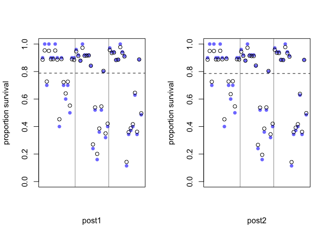
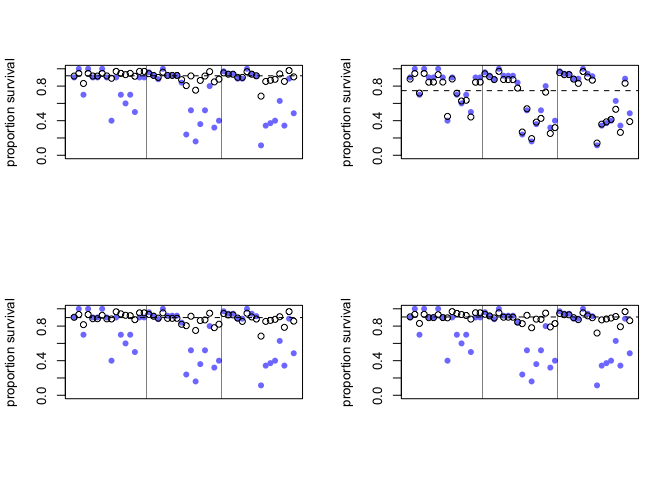
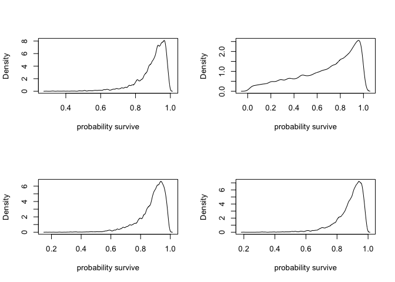

# Chapter-12-assignment-01
Ruijuan Li  
10/27/2016  

# 12E1

```r
# Which of the following priors will produce more shrinkage in the estimates? (a) αTANK ~ Normal(0, 1); (b) αTANK ~ Normal(0, 2). 

# shrinkage: the multilevel estimate is closer to the estimated median survival proportion in the population of tanks than the raw empirical estimate is. (the raw empirical estimate isn't from the raw data? they are the data, which can be used as prior too? )

# get data 
library(rethinking)
```

```
## Loading required package: rstan
```

```
## Warning: package 'rstan' was built under R version 3.2.5
```

```
## Loading required package: ggplot2
```

```
## Loading required package: StanHeaders
```

```
## Warning: package 'StanHeaders' was built under R version 3.2.5
```

```
## rstan (Version 2.10.1, packaged: 2016-06-24 13:22:16 UTC, GitRev: 85f7a56811da)
```

```
## For execution on a local, multicore CPU with excess RAM we recommend calling
## rstan_options(auto_write = TRUE)
## options(mc.cores = parallel::detectCores())
```

```
## Loading required package: parallel
```

```
## rethinking (Version 1.59)
```

```r
data("reedfrogs")
d <- reedfrogs
d$tank <- 1:nrow(d)

# how different these priors are? check 
sapply(c(0, 1, -1), logistic) # narrower prior 
```

```
## [1] 0.5000000 0.7310586 0.2689414
```

```r
sapply(c(0, 2, -2), logistic) # wider prior 
```

```
## [1] 0.5000000 0.8807971 0.1192029
```

```r
# try aTank ~ Normal(0, 1)
m12E1.1 <- map2stan(
  alist(
    surv ~ dbinom(density, p),  
    logit(p) <- a_tank[tank],
    a_tank[tank] ~ dnorm(0, 1)  
  ), data = d)
```

```
## In file included from file838075b1448b.cpp:8:
## In file included from /Library/Frameworks/R.framework/Versions/3.2/Resources/library/StanHeaders/include/src/stan/model/model_header.hpp:4:
## In file included from /Library/Frameworks/R.framework/Versions/3.2/Resources/library/StanHeaders/include/stan/math.hpp:4:
## In file included from /Library/Frameworks/R.framework/Versions/3.2/Resources/library/StanHeaders/include/stan/math/rev/mat.hpp:4:
## In file included from /Library/Frameworks/R.framework/Versions/3.2/Resources/library/StanHeaders/include/stan/math/rev/core.hpp:42:
## /Library/Frameworks/R.framework/Versions/3.2/Resources/library/StanHeaders/include/stan/math/rev/core/set_zero_all_adjoints.hpp:14:17: warning: unused function 'set_zero_all_adjoints' [-Wunused-function]
##     static void set_zero_all_adjoints() {
##                 ^
## In file included from file838075b1448b.cpp:8:
## In file included from /Library/Frameworks/R.framework/Versions/3.2/Resources/library/StanHeaders/include/src/stan/model/model_header.hpp:4:
## In file included from /Library/Frameworks/R.framework/Versions/3.2/Resources/library/StanHeaders/include/stan/math.hpp:4:
## In file included from /Library/Frameworks/R.framework/Versions/3.2/Resources/library/StanHeaders/include/stan/math/rev/mat.hpp:4:
## In file included from /Library/Frameworks/R.framework/Versions/3.2/Resources/library/StanHeaders/include/stan/math/rev/core.hpp:43:
## /Library/Frameworks/R.framework/Versions/3.2/Resources/library/StanHeaders/include/stan/math/rev/core/set_zero_all_adjoints_nested.hpp:17:17: warning: 'static' function 'set_zero_all_adjoints_nested' declared in header file should be declared 'static inline' [-Wunneeded-internal-declaration]
##     static void set_zero_all_adjoints_nested() {
##                 ^
## In file included from file838075b1448b.cpp:8:
## In file included from /Library/Frameworks/R.framework/Versions/3.2/Resources/library/StanHeaders/include/src/stan/model/model_header.hpp:4:
## In file included from /Library/Frameworks/R.framework/Versions/3.2/Resources/library/StanHeaders/include/stan/math.hpp:4:
## In file included from /Library/Frameworks/R.framework/Versions/3.2/Resources/library/StanHeaders/include/stan/math/rev/mat.hpp:8:
## In file included from /Library/Frameworks/R.framework/Versions/3.2/Resources/library/StanHeaders/include/stan/math/prim/mat.hpp:55:
## /Library/Frameworks/R.framework/Versions/3.2/Resources/library/StanHeaders/include/stan/math/prim/mat/fun/autocorrelation.hpp:19:14: warning: function 'fft_next_good_size' is not needed and will not be emitted [-Wunneeded-internal-declaration]
##       size_t fft_next_good_size(size_t N) {
##              ^
## In file included from file838075b1448b.cpp:8:
## In file included from /Library/Frameworks/R.framework/Versions/3.2/Resources/library/StanHeaders/include/src/stan/model/model_header.hpp:4:
## In file included from /Library/Frameworks/R.framework/Versions/3.2/Resources/library/StanHeaders/include/stan/math.hpp:4:
## In file included from /Library/Frameworks/R.framework/Versions/3.2/Resources/library/StanHeaders/include/stan/math/rev/mat.hpp:8:
## In file included from /Library/Frameworks/R.framework/Versions/3.2/Resources/library/StanHeaders/include/stan/math/prim/mat.hpp:36:
## /Library/Frameworks/R.framework/Versions/3.2/Resources/library/StanHeaders/include/stan/math/prim/mat/err/check_positive_ordered.hpp:39:67: warning: unused typedef 'size_type' [-Wunused-local-typedef]
##       typedef typename index_type<Matrix<T_y, Dynamic, 1> >::type size_type;
##                                                                   ^
## In file included from file838075b1448b.cpp:8:
## In file included from /Library/Frameworks/R.framework/Versions/3.2/Resources/library/StanHeaders/include/src/stan/model/model_header.hpp:4:
## In file included from /Library/Frameworks/R.framework/Versions/3.2/Resources/library/StanHeaders/include/stan/math.hpp:4:
## In file included from /Library/Frameworks/R.framework/Versions/3.2/Resources/library/StanHeaders/include/stan/math/rev/mat.hpp:8:
## In file included from /Library/Frameworks/R.framework/Versions/3.2/Resources/library/StanHeaders/include/stan/math/prim/mat.hpp:232:
## In file included from /Library/Frameworks/R.framework/Versions/3.2/Resources/library/StanHeaders/include/stan/math/prim/arr.hpp:33:
## In file included from /Library/Frameworks/R.framework/Versions/3.2/Resources/library/StanHeaders/include/stan/math/prim/arr/functor/integrate_ode_rk45.hpp:13:
## In file included from /Library/Frameworks/R.framework/Versions/3.2/Resources/library/BH/include/boost/numeric/odeint.hpp:61:
## In file included from /Library/Frameworks/R.framework/Versions/3.2/Resources/library/BH/include/boost/numeric/odeint/util/multi_array_adaption.hpp:29:
## In file included from /Library/Frameworks/R.framework/Versions/3.2/Resources/library/BH/include/boost/multi_array.hpp:21:
## In file included from /Library/Frameworks/R.framework/Versions/3.2/Resources/library/BH/include/boost/multi_array/base.hpp:28:
## /Library/Frameworks/R.framework/Versions/3.2/Resources/library/BH/include/boost/multi_array/concept_checks.hpp:42:43: warning: unused typedef 'index_range' [-Wunused-local-typedef]
##       typedef typename Array::index_range index_range;
##                                           ^
## /Library/Frameworks/R.framework/Versions/3.2/Resources/library/BH/include/boost/multi_array/concept_checks.hpp:43:37: warning: unused typedef 'index' [-Wunused-local-typedef]
##       typedef typename Array::index index;
##                                     ^
## /Library/Frameworks/R.framework/Versions/3.2/Resources/library/BH/include/boost/multi_array/concept_checks.hpp:53:43: warning: unused typedef 'index_range' [-Wunused-local-typedef]
##       typedef typename Array::index_range index_range;
##                                           ^
## /Library/Frameworks/R.framework/Versions/3.2/Resources/library/BH/include/boost/multi_array/concept_checks.hpp:54:37: warning: unused typedef 'index' [-Wunused-local-typedef]
##       typedef typename Array::index index;
##                                     ^
## 8 warnings generated.
```

```
## Warning in FUN(X[[i]], ...): data with name pred is not numeric and not
## used
```

```
## Warning in FUN(X[[i]], ...): data with name size is not numeric and not
## used
```

```
## 
## SAMPLING FOR MODEL 'surv ~ dbinom(density, p)' NOW (CHAIN 1).
## 
## Chain 1, Iteration:    1 / 2000 [  0%]  (Warmup)
## Chain 1, Iteration:  200 / 2000 [ 10%]  (Warmup)
## Chain 1, Iteration:  400 / 2000 [ 20%]  (Warmup)
## Chain 1, Iteration:  600 / 2000 [ 30%]  (Warmup)
## Chain 1, Iteration:  800 / 2000 [ 40%]  (Warmup)
## Chain 1, Iteration: 1000 / 2000 [ 50%]  (Warmup)
## Chain 1, Iteration: 1001 / 2000 [ 50%]  (Sampling)
## Chain 1, Iteration: 1200 / 2000 [ 60%]  (Sampling)
## Chain 1, Iteration: 1400 / 2000 [ 70%]  (Sampling)
## Chain 1, Iteration: 1600 / 2000 [ 80%]  (Sampling)
## Chain 1, Iteration: 1800 / 2000 [ 90%]  (Sampling)
## Chain 1, Iteration: 2000 / 2000 [100%]  (Sampling)
##  Elapsed Time: 0.119764 seconds (Warm-up)
##                0.113104 seconds (Sampling)
##                0.232868 seconds (Total)
```

```
## Warning in FUN(X[[i]], ...): data with name pred is not numeric and not
## used

## Warning in FUN(X[[i]], ...): data with name size is not numeric and not
## used
```

```
## 
## SAMPLING FOR MODEL 'surv ~ dbinom(density, p)' NOW (CHAIN 1).
## WARNING: No variance estimation is
##          performed for num_warmup < 20
## 
## 
## Chain 1, Iteration: 1 / 1 [100%]  (Sampling)
##  Elapsed Time: 5e-06 seconds (Warm-up)
##                7.9e-05 seconds (Sampling)
##                8.4e-05 seconds (Total)
```

```
## Computing WAIC
```

```
## Constructing posterior predictions
```

```
## [ 100 / 1000 ]
[ 200 / 1000 ]
[ 300 / 1000 ]
[ 400 / 1000 ]
[ 500 / 1000 ]
[ 600 / 1000 ]
[ 700 / 1000 ]
[ 800 / 1000 ]
[ 900 / 1000 ]
[ 1000 / 1000 ]
```

```
## Aggregated binomial counts detected. Splitting to 0/1 outcome for WAIC calculation.
```

```r
precis(m12E1.1, depth = 2) 
```

```
##             Mean StdDev lower 0.89 upper 0.89 n_eff Rhat
## a_tank[1]   1.31   0.60       0.30       2.16  1000    1
## a_tank[2]   1.69   0.61       0.80       2.67  1000    1
## a_tank[3]   0.63   0.59      -0.24       1.61  1000    1
## a_tank[4]   1.71   0.72       0.58       2.90  1000    1
## a_tank[5]   1.34   0.65       0.24       2.32  1000    1
## a_tank[6]   1.31   0.62       0.31       2.24  1000    1
## a_tank[7]   1.72   0.68       0.60       2.79  1000    1
## a_tank[8]   1.32   0.64       0.31       2.34  1000    1
## a_tank[9]  -0.30   0.54      -1.10       0.64  1000    1
## a_tank[10]  1.29   0.63       0.38       2.32  1000    1
## a_tank[11]  0.64   0.58      -0.28       1.58  1000    1
## a_tank[12]  0.30   0.55      -0.54       1.19  1000    1
## a_tank[13]  0.62   0.56      -0.16       1.67  1000    1
## a_tank[14] -0.01   0.52      -0.83       0.74  1000    1
## a_tank[15]  1.30   0.65       0.17       2.26  1000    1
## a_tank[16]  1.30   0.63       0.27       2.27  1000    1
## a_tank[17]  2.07   0.53       1.27       2.94  1000    1
## a_tank[18]  1.81   0.48       0.97       2.53  1000    1
## a_tank[19]  1.56   0.45       0.87       2.28  1000    1
## a_tank[20]  2.38   0.55       1.58       3.26  1000    1
## a_tank[21]  1.80   0.50       1.03       2.61  1000    1
## a_tank[22]  1.82   0.51       0.96       2.62  1000    1
## a_tank[23]  1.80   0.50       1.02       2.58  1000    1
## a_tank[24]  1.37   0.45       0.64       2.07  1000    1
## a_tank[25] -0.99   0.40      -1.61      -0.30  1000    1
## a_tank[26]  0.08   0.37      -0.49       0.73  1000    1
## a_tank[27] -1.37   0.45      -2.05      -0.62  1000    1
## a_tank[28] -0.51   0.40      -1.15       0.09  1000    1
## a_tank[29]  0.06   0.38      -0.50       0.72  1000    1
## a_tank[30]  1.15   0.44       0.50       1.87  1000    1
## a_tank[31] -0.65   0.38      -1.24      -0.04  1000    1
## a_tank[32] -0.35   0.38      -0.93       0.25  1000    1
## a_tank[33]  2.35   0.53       1.50       3.15  1000    1
## a_tank[34]  2.12   0.50       1.34       2.91  1000    1
## a_tank[35]  2.13   0.46       1.41       2.82  1000    1
## a_tank[36]  1.72   0.43       1.09       2.43  1000    1
## a_tank[37]  1.69   0.44       0.94       2.30  1000    1
## a_tank[38]  2.63   0.54       1.74       3.46  1000    1
## a_tank[39]  2.10   0.46       1.27       2.75  1000    1
## a_tank[40]  1.90   0.44       1.21       2.59  1000    1
## a_tank[41] -1.69   0.44      -2.33      -0.89  1000    1
## a_tank[42] -0.60   0.33      -1.10      -0.09  1000    1
## a_tank[43] -0.48   0.32      -0.96       0.06  1000    1
## a_tank[44] -0.39   0.33      -0.91       0.13  1000    1
## a_tank[45]  0.49   0.35      -0.05       1.07  1000    1
## a_tank[46] -0.60   0.34      -1.10      -0.04  1000    1
## a_tank[47]  1.71   0.42       1.01       2.35  1000    1
## a_tank[48] -0.05   0.33      -0.55       0.52  1000    1
```

```r
# try aTank ~ Normal(0, 2)
m12E1.2 <- map2stan(
  alist(
    surv ~ dbinom(density, p),  
    logit(p) <- a_tank[tank],
    a_tank[tank] ~ dnorm(0, 2)  
  ), data = d)
```

```
## In file included from file83804fe2ff0f.cpp:8:
## In file included from /Library/Frameworks/R.framework/Versions/3.2/Resources/library/StanHeaders/include/src/stan/model/model_header.hpp:4:
## In file included from /Library/Frameworks/R.framework/Versions/3.2/Resources/library/StanHeaders/include/stan/math.hpp:4:
## In file included from /Library/Frameworks/R.framework/Versions/3.2/Resources/library/StanHeaders/include/stan/math/rev/mat.hpp:4:
## In file included from /Library/Frameworks/R.framework/Versions/3.2/Resources/library/StanHeaders/include/stan/math/rev/core.hpp:42:
## /Library/Frameworks/R.framework/Versions/3.2/Resources/library/StanHeaders/include/stan/math/rev/core/set_zero_all_adjoints.hpp:14:17: warning: unused function 'set_zero_all_adjoints' [-Wunused-function]
##     static void set_zero_all_adjoints() {
##                 ^
## In file included from file83804fe2ff0f.cpp:8:
## In file included from /Library/Frameworks/R.framework/Versions/3.2/Resources/library/StanHeaders/include/src/stan/model/model_header.hpp:4:
## In file included from /Library/Frameworks/R.framework/Versions/3.2/Resources/library/StanHeaders/include/stan/math.hpp:4:
## In file included from /Library/Frameworks/R.framework/Versions/3.2/Resources/library/StanHeaders/include/stan/math/rev/mat.hpp:4:
## In file included from /Library/Frameworks/R.framework/Versions/3.2/Resources/library/StanHeaders/include/stan/math/rev/core.hpp:43:
## /Library/Frameworks/R.framework/Versions/3.2/Resources/library/StanHeaders/include/stan/math/rev/core/set_zero_all_adjoints_nested.hpp:17:17: warning: 'static' function 'set_zero_all_adjoints_nested' declared in header file should be declared 'static inline' [-Wunneeded-internal-declaration]
##     static void set_zero_all_adjoints_nested() {
##                 ^
## In file included from file83804fe2ff0f.cpp:8:
## In file included from /Library/Frameworks/R.framework/Versions/3.2/Resources/library/StanHeaders/include/src/stan/model/model_header.hpp:4:
## In file included from /Library/Frameworks/R.framework/Versions/3.2/Resources/library/StanHeaders/include/stan/math.hpp:4:
## In file included from /Library/Frameworks/R.framework/Versions/3.2/Resources/library/StanHeaders/include/stan/math/rev/mat.hpp:8:
## In file included from /Library/Frameworks/R.framework/Versions/3.2/Resources/library/StanHeaders/include/stan/math/prim/mat.hpp:55:
## /Library/Frameworks/R.framework/Versions/3.2/Resources/library/StanHeaders/include/stan/math/prim/mat/fun/autocorrelation.hpp:19:14: warning: function 'fft_next_good_size' is not needed and will not be emitted [-Wunneeded-internal-declaration]
##       size_t fft_next_good_size(size_t N) {
##              ^
## In file included from file83804fe2ff0f.cpp:8:
## In file included from /Library/Frameworks/R.framework/Versions/3.2/Resources/library/StanHeaders/include/src/stan/model/model_header.hpp:4:
## In file included from /Library/Frameworks/R.framework/Versions/3.2/Resources/library/StanHeaders/include/stan/math.hpp:4:
## In file included from /Library/Frameworks/R.framework/Versions/3.2/Resources/library/StanHeaders/include/stan/math/rev/mat.hpp:8:
## In file included from /Library/Frameworks/R.framework/Versions/3.2/Resources/library/StanHeaders/include/stan/math/prim/mat.hpp:36:
## /Library/Frameworks/R.framework/Versions/3.2/Resources/library/StanHeaders/include/stan/math/prim/mat/err/check_positive_ordered.hpp:39:67: warning: unused typedef 'size_type' [-Wunused-local-typedef]
##       typedef typename index_type<Matrix<T_y, Dynamic, 1> >::type size_type;
##                                                                   ^
## In file included from file83804fe2ff0f.cpp:8:
## In file included from /Library/Frameworks/R.framework/Versions/3.2/Resources/library/StanHeaders/include/src/stan/model/model_header.hpp:4:
## In file included from /Library/Frameworks/R.framework/Versions/3.2/Resources/library/StanHeaders/include/stan/math.hpp:4:
## In file included from /Library/Frameworks/R.framework/Versions/3.2/Resources/library/StanHeaders/include/stan/math/rev/mat.hpp:8:
## In file included from /Library/Frameworks/R.framework/Versions/3.2/Resources/library/StanHeaders/include/stan/math/prim/mat.hpp:232:
## In file included from /Library/Frameworks/R.framework/Versions/3.2/Resources/library/StanHeaders/include/stan/math/prim/arr.hpp:33:
## In file included from /Library/Frameworks/R.framework/Versions/3.2/Resources/library/StanHeaders/include/stan/math/prim/arr/functor/integrate_ode_rk45.hpp:13:
## In file included from /Library/Frameworks/R.framework/Versions/3.2/Resources/library/BH/include/boost/numeric/odeint.hpp:61:
## In file included from /Library/Frameworks/R.framework/Versions/3.2/Resources/library/BH/include/boost/numeric/odeint/util/multi_array_adaption.hpp:29:
## In file included from /Library/Frameworks/R.framework/Versions/3.2/Resources/library/BH/include/boost/multi_array.hpp:21:
## In file included from /Library/Frameworks/R.framework/Versions/3.2/Resources/library/BH/include/boost/multi_array/base.hpp:28:
## /Library/Frameworks/R.framework/Versions/3.2/Resources/library/BH/include/boost/multi_array/concept_checks.hpp:42:43: warning: unused typedef 'index_range' [-Wunused-local-typedef]
##       typedef typename Array::index_range index_range;
##                                           ^
## /Library/Frameworks/R.framework/Versions/3.2/Resources/library/BH/include/boost/multi_array/concept_checks.hpp:43:37: warning: unused typedef 'index' [-Wunused-local-typedef]
##       typedef typename Array::index index;
##                                     ^
## /Library/Frameworks/R.framework/Versions/3.2/Resources/library/BH/include/boost/multi_array/concept_checks.hpp:53:43: warning: unused typedef 'index_range' [-Wunused-local-typedef]
##       typedef typename Array::index_range index_range;
##                                           ^
## /Library/Frameworks/R.framework/Versions/3.2/Resources/library/BH/include/boost/multi_array/concept_checks.hpp:54:37: warning: unused typedef 'index' [-Wunused-local-typedef]
##       typedef typename Array::index index;
##                                     ^
## 8 warnings generated.
```

```
## Warning in FUN(X[[i]], ...): data with name pred is not numeric and not
## used

## Warning in FUN(X[[i]], ...): data with name size is not numeric and not
## used
```

```
## 
## SAMPLING FOR MODEL 'surv ~ dbinom(density, p)' NOW (CHAIN 1).
## 
## Chain 1, Iteration:    1 / 2000 [  0%]  (Warmup)
## Chain 1, Iteration:  200 / 2000 [ 10%]  (Warmup)
## Chain 1, Iteration:  400 / 2000 [ 20%]  (Warmup)
## Chain 1, Iteration:  600 / 2000 [ 30%]  (Warmup)
## Chain 1, Iteration:  800 / 2000 [ 40%]  (Warmup)
## Chain 1, Iteration: 1000 / 2000 [ 50%]  (Warmup)
## Chain 1, Iteration: 1001 / 2000 [ 50%]  (Sampling)
## Chain 1, Iteration: 1200 / 2000 [ 60%]  (Sampling)
## Chain 1, Iteration: 1400 / 2000 [ 70%]  (Sampling)
## Chain 1, Iteration: 1600 / 2000 [ 80%]  (Sampling)
## Chain 1, Iteration: 1800 / 2000 [ 90%]  (Sampling)
## Chain 1, Iteration: 2000 / 2000 [100%]  (Sampling)
##  Elapsed Time: 0.127654 seconds (Warm-up)
##                0.127232 seconds (Sampling)
##                0.254886 seconds (Total)
```

```
## Warning in FUN(X[[i]], ...): data with name pred is not numeric and not
## used

## Warning in FUN(X[[i]], ...): data with name size is not numeric and not
## used
```

```
## 
## SAMPLING FOR MODEL 'surv ~ dbinom(density, p)' NOW (CHAIN 1).
## WARNING: No variance estimation is
##          performed for num_warmup < 20
## 
## 
## Chain 1, Iteration: 1 / 1 [100%]  (Sampling)
##  Elapsed Time: 3e-06 seconds (Warm-up)
##                0.000174 seconds (Sampling)
##                0.000177 seconds (Total)
```

```
## Computing WAIC
## Constructing posterior predictions
```

```
## [ 100 / 1000 ]
[ 200 / 1000 ]
[ 300 / 1000 ]
[ 400 / 1000 ]
[ 500 / 1000 ]
[ 600 / 1000 ]
[ 700 / 1000 ]
[ 800 / 1000 ]
[ 900 / 1000 ]
[ 1000 / 1000 ]
```

```
## Aggregated binomial counts detected. Splitting to 0/1 outcome for WAIC calculation.
```

```r
precis(m12E1.2, depth = 2) 
```

```
##             Mean StdDev lower 0.89 upper 0.89 n_eff Rhat
## a_tank[1]   2.04   0.94       0.50       3.45  1000 1.00
## a_tank[2]   3.01   1.11       1.29       4.66  1000 1.00
## a_tank[3]   0.82   0.69      -0.35       1.85  1000 1.00
## a_tank[4]   3.00   1.16       1.15       4.82  1000 1.00
## a_tank[5]   2.01   0.91       0.62       3.46  1000 1.00
## a_tank[6]   1.98   0.92       0.61       3.46  1000 1.00
## a_tank[7]   3.01   1.17       1.17       4.80  1000 1.00
## a_tank[8]   1.98   0.86       0.66       3.23  1000 1.00
## a_tank[9]  -0.38   0.64      -1.37       0.62  1000 1.00
## a_tank[10]  1.97   0.84       0.66       3.21  1000 1.00
## a_tank[11]  0.83   0.67      -0.12       1.99  1000 1.00
## a_tank[12]  0.41   0.65      -0.65       1.42  1000 1.00
## a_tank[13]  0.84   0.68      -0.26       1.88  1000 1.00
## a_tank[14]  0.00   0.64      -1.03       0.99  1000 1.00
## a_tank[15]  1.99   0.92       0.55       3.43  1000 1.00
## a_tank[16]  2.02   0.92       0.76       3.62  1000 1.00
## a_tank[17]  2.84   0.78       1.63       3.99  1000 1.00
## a_tank[18]  2.32   0.67       1.31       3.44  1000 1.00
## a_tank[19]  1.95   0.60       1.01       2.87  1000 1.00
## a_tank[20]  3.72   1.10       2.01       5.29  1000 1.00
## a_tank[21]  2.37   0.74       1.22       3.51  1000 1.01
## a_tank[22]  2.33   0.72       1.25       3.38  1000 1.00
## a_tank[23]  2.31   0.68       1.16       3.24  1000 1.00
## a_tank[24]  1.66   0.55       0.69       2.41  1000 1.00
## a_tank[25] -1.16   0.45      -1.89      -0.47  1000 1.00
## a_tank[26]  0.07   0.40      -0.55       0.70  1000 1.00
## a_tank[27] -1.65   0.55      -2.52      -0.81  1000 1.00
## a_tank[28] -0.57   0.44      -1.22       0.14  1000 1.00
## a_tank[29]  0.08   0.37      -0.52       0.63  1000 1.00
## a_tank[30]  1.38   0.49       0.65       2.17  1000 1.00
## a_tank[31] -0.74   0.42      -1.37      -0.05  1000 1.00
## a_tank[32] -0.41   0.40      -1.01       0.29  1000 1.00
## a_tank[33]  3.15   0.77       1.96       4.37  1000 1.00
## a_tank[34]  2.68   0.67       1.61       3.68  1000 1.00
## a_tank[35]  2.66   0.62       1.73       3.68  1000 1.00
## a_tank[36]  2.00   0.52       1.12       2.74  1000 1.00
## a_tank[37]  2.00   0.51       1.21       2.77  1000 1.00
## a_tank[38]  3.98   1.06       2.30       5.60  1000 1.00
## a_tank[39]  2.67   0.66       1.59       3.57  1000 1.00
## a_tank[40]  2.30   0.61       1.36       3.24  1000 1.00
## a_tank[41] -2.02   0.52      -2.82      -1.17  1000 1.00
## a_tank[42] -0.65   0.33      -1.20      -0.16  1000 1.00
## a_tank[43] -0.52   0.34      -1.10      -0.03  1000 1.00
## a_tank[44] -0.41   0.33      -0.92       0.13  1000 1.00
## a_tank[45]  0.54   0.35       0.01       1.12  1000 1.00
## a_tank[46] -0.66   0.38      -1.22      -0.04  1000 1.00
## a_tank[47]  2.01   0.51       1.25       2.90  1000 1.00
## a_tank[48] -0.06   0.36      -0.59       0.53  1000 1.00
```

```r
# extract posterior and plot to check the result 
par(mfrow=c(1,2))
post_1 <- extract.samples(m12E1.1)
post_2 <- extract.samples(m12E1.2)

d$propsurv_est_1 <- logistic(apply(post_1$a_tank, 2, median))
d$propsurv_est_2 <- logistic(apply(post_2$a_tank, 2, median))

# post1
plot(d$propsurv, ylim=c(0,1), pch=16, xaxt="n",
     xlab="post1", ylab="proportion survival", col=rangi2)

points(d$propsurv_est_1, type = "p")
?points 
abline(h=logistic(median(post_1$a)), lty=2)

# draw vertical dividers between tank densities 
abline(v=16.5, lwd=0.5)
abline(v=32.5, lwd=0.5)

# post2
plot(d$propsurv, ylim=c(0,1), pch=16, xaxt="n",
     xlab="post2", ylab="proportion survival", col=rangi2)

points(d$propsurv_est_2, type = "p")
?points 
abline(h=logistic(median(post_2$a)), lty=2)

# draw vertical dividers between tank densities 
abline(v=16.5, lwd=0.5)
abline(v=32.5, lwd=0.5)
```



```r
par(mfrow=c(1,1))
# based on the result, αTANK ~ Normal(0, 1), narrow prior produce more shrinkage. Why? 
```

# 12E2

```r
# make a multilevel model 

# yi ~ Binomial(1, pi)
# logit(pi) = a_group[i] + bxi
# a_group ~ Normal(a, sigma)
# b ~ Normal(0, 1)
# a ~ Normal(0, 1)
# sigma ~ HalfCauchy(0, 1)
```

# 12M1

```r
# Revisit the Reed frog survival data, data(reedfrogs), and add the predation and size treatment variables to the varying intercepts model. Consider models with either main effect alone, both main effects, as well as a model including both and their interaction. Instead of focusing on inferences about these two predictor variables, focus on the inferred variation across tanks. Explain why it changes as it does across models. 

head(d) 
```

```
##   density pred  size surv propsurv tank propsurv_est_1 propsurv_est_2
## 1      10   no   big    9      0.9    1      0.7843271      0.8754672
## 2      10   no   big   10      1.0    2      0.8417643      0.9474414
## 3      10   no   big    7      0.7    3      0.6513982      0.6871583
## 4      10   no   big   10      1.0    4      0.8429419      0.9450719
## 5      10   no small    9      0.9    5      0.7863150      0.8761772
## 6      10   no small    9      0.9    6      0.7839850      0.8707980
```

```r
d$pred
```

```
##  [1] no   no   no   no   no   no   no   no   pred pred pred pred pred pred
## [15] pred pred no   no   no   no   no   no   no   no   pred pred pred pred
## [29] pred pred pred pred no   no   no   no   no   no   no   no   pred pred
## [43] pred pred pred pred pred pred
## Levels: no pred
```

```r
d$size
```

```
##  [1] big   big   big   big   small small small small big   big   big  
## [12] big   small small small small big   big   big   big   small small
## [23] small small big   big   big   big   small small small small big  
## [34] big   big   big   small small small small big   big   big   big  
## [45] small small small small
## Levels: big small
```

```r
d$pred_2 <- ifelse(d$pred=="pred", 1, 0)
d$size_s <- ifelse(d$size=="small", 1, 0)

head(d)
```

```
##   density pred  size surv propsurv tank propsurv_est_1 propsurv_est_2
## 1      10   no   big    9      0.9    1      0.7843271      0.8754672
## 2      10   no   big   10      1.0    2      0.8417643      0.9474414
## 3      10   no   big    7      0.7    3      0.6513982      0.6871583
## 4      10   no   big   10      1.0    4      0.8429419      0.9450719
## 5      10   no small    9      0.9    5      0.7863150      0.8761772
## 6      10   no small    9      0.9    6      0.7839850      0.8707980
##   pred_2 size_s
## 1      0      0
## 2      0      0
## 3      0      0
## 4      0      0
## 5      0      1
## 6      0      1
```

```r
# fit 4 multilevel models 

# add pred 
m12M1.1 <- map2stan(
  alist(
    surv ~ dbinom(density, p),
    logit(p) <- a_tank[tank] + b_pred*pred_2,
    a_tank[tank] ~ dnorm(a, sigma),
    c(a, b_pred) ~ dnorm(0, 1), # ??? why normal distribution with these prior? 
    sigma ~ dcauchy(0, 1) 
  ), data = d, iter = 4000, chains = 4)
```

```
## In file included from file83804ce8c90d.cpp:8:
## In file included from /Library/Frameworks/R.framework/Versions/3.2/Resources/library/StanHeaders/include/src/stan/model/model_header.hpp:4:
## In file included from /Library/Frameworks/R.framework/Versions/3.2/Resources/library/StanHeaders/include/stan/math.hpp:4:
## In file included from /Library/Frameworks/R.framework/Versions/3.2/Resources/library/StanHeaders/include/stan/math/rev/mat.hpp:4:
## In file included from /Library/Frameworks/R.framework/Versions/3.2/Resources/library/StanHeaders/include/stan/math/rev/core.hpp:42:
## /Library/Frameworks/R.framework/Versions/3.2/Resources/library/StanHeaders/include/stan/math/rev/core/set_zero_all_adjoints.hpp:14:17: warning: unused function 'set_zero_all_adjoints' [-Wunused-function]
##     static void set_zero_all_adjoints() {
##                 ^
## In file included from file83804ce8c90d.cpp:8:
## In file included from /Library/Frameworks/R.framework/Versions/3.2/Resources/library/StanHeaders/include/src/stan/model/model_header.hpp:4:
## In file included from /Library/Frameworks/R.framework/Versions/3.2/Resources/library/StanHeaders/include/stan/math.hpp:4:
## In file included from /Library/Frameworks/R.framework/Versions/3.2/Resources/library/StanHeaders/include/stan/math/rev/mat.hpp:4:
## In file included from /Library/Frameworks/R.framework/Versions/3.2/Resources/library/StanHeaders/include/stan/math/rev/core.hpp:43:
## /Library/Frameworks/R.framework/Versions/3.2/Resources/library/StanHeaders/include/stan/math/rev/core/set_zero_all_adjoints_nested.hpp:17:17: warning: 'static' function 'set_zero_all_adjoints_nested' declared in header file should be declared 'static inline' [-Wunneeded-internal-declaration]
##     static void set_zero_all_adjoints_nested() {
##                 ^
## In file included from file83804ce8c90d.cpp:8:
## In file included from /Library/Frameworks/R.framework/Versions/3.2/Resources/library/StanHeaders/include/src/stan/model/model_header.hpp:4:
## In file included from /Library/Frameworks/R.framework/Versions/3.2/Resources/library/StanHeaders/include/stan/math.hpp:4:
## In file included from /Library/Frameworks/R.framework/Versions/3.2/Resources/library/StanHeaders/include/stan/math/rev/mat.hpp:8:
## In file included from /Library/Frameworks/R.framework/Versions/3.2/Resources/library/StanHeaders/include/stan/math/prim/mat.hpp:55:
## /Library/Frameworks/R.framework/Versions/3.2/Resources/library/StanHeaders/include/stan/math/prim/mat/fun/autocorrelation.hpp:19:14: warning: function 'fft_next_good_size' is not needed and will not be emitted [-Wunneeded-internal-declaration]
##       size_t fft_next_good_size(size_t N) {
##              ^
## In file included from file83804ce8c90d.cpp:8:
## In file included from /Library/Frameworks/R.framework/Versions/3.2/Resources/library/StanHeaders/include/src/stan/model/model_header.hpp:4:
## In file included from /Library/Frameworks/R.framework/Versions/3.2/Resources/library/StanHeaders/include/stan/math.hpp:4:
## In file included from /Library/Frameworks/R.framework/Versions/3.2/Resources/library/StanHeaders/include/stan/math/rev/mat.hpp:8:
## In file included from /Library/Frameworks/R.framework/Versions/3.2/Resources/library/StanHeaders/include/stan/math/prim/mat.hpp:36:
## /Library/Frameworks/R.framework/Versions/3.2/Resources/library/StanHeaders/include/stan/math/prim/mat/err/check_positive_ordered.hpp:39:67: warning: unused typedef 'size_type' [-Wunused-local-typedef]
##       typedef typename index_type<Matrix<T_y, Dynamic, 1> >::type size_type;
##                                                                   ^
## In file included from file83804ce8c90d.cpp:8:
## In file included from /Library/Frameworks/R.framework/Versions/3.2/Resources/library/StanHeaders/include/src/stan/model/model_header.hpp:4:
## In file included from /Library/Frameworks/R.framework/Versions/3.2/Resources/library/StanHeaders/include/stan/math.hpp:4:
## In file included from /Library/Frameworks/R.framework/Versions/3.2/Resources/library/StanHeaders/include/stan/math/rev/mat.hpp:8:
## In file included from /Library/Frameworks/R.framework/Versions/3.2/Resources/library/StanHeaders/include/stan/math/prim/mat.hpp:232:
## In file included from /Library/Frameworks/R.framework/Versions/3.2/Resources/library/StanHeaders/include/stan/math/prim/arr.hpp:33:
## In file included from /Library/Frameworks/R.framework/Versions/3.2/Resources/library/StanHeaders/include/stan/math/prim/arr/functor/integrate_ode_rk45.hpp:13:
## In file included from /Library/Frameworks/R.framework/Versions/3.2/Resources/library/BH/include/boost/numeric/odeint.hpp:61:
## In file included from /Library/Frameworks/R.framework/Versions/3.2/Resources/library/BH/include/boost/numeric/odeint/util/multi_array_adaption.hpp:29:
## In file included from /Library/Frameworks/R.framework/Versions/3.2/Resources/library/BH/include/boost/multi_array.hpp:21:
## In file included from /Library/Frameworks/R.framework/Versions/3.2/Resources/library/BH/include/boost/multi_array/base.hpp:28:
## /Library/Frameworks/R.framework/Versions/3.2/Resources/library/BH/include/boost/multi_array/concept_checks.hpp:42:43: warning: unused typedef 'index_range' [-Wunused-local-typedef]
##       typedef typename Array::index_range index_range;
##                                           ^
## /Library/Frameworks/R.framework/Versions/3.2/Resources/library/BH/include/boost/multi_array/concept_checks.hpp:43:37: warning: unused typedef 'index' [-Wunused-local-typedef]
##       typedef typename Array::index index;
##                                     ^
## /Library/Frameworks/R.framework/Versions/3.2/Resources/library/BH/include/boost/multi_array/concept_checks.hpp:53:43: warning: unused typedef 'index_range' [-Wunused-local-typedef]
##       typedef typename Array::index_range index_range;
##                                           ^
## /Library/Frameworks/R.framework/Versions/3.2/Resources/library/BH/include/boost/multi_array/concept_checks.hpp:54:37: warning: unused typedef 'index' [-Wunused-local-typedef]
##       typedef typename Array::index index;
##                                     ^
## 8 warnings generated.
```

```
## Warning in FUN(X[[i]], ...): data with name pred is not numeric and not
## used
```

```
## Warning in FUN(X[[i]], ...): data with name size is not numeric and not
## used
```

```
## 
## SAMPLING FOR MODEL 'surv ~ dbinom(density, p)' NOW (CHAIN 1).
## 
## Chain 1, Iteration:    1 / 4000 [  0%]  (Warmup)
## Chain 1, Iteration:  400 / 4000 [ 10%]  (Warmup)
## Chain 1, Iteration:  800 / 4000 [ 20%]  (Warmup)
## Chain 1, Iteration: 1200 / 4000 [ 30%]  (Warmup)
## Chain 1, Iteration: 1600 / 4000 [ 40%]  (Warmup)
## Chain 1, Iteration: 2000 / 4000 [ 50%]  (Warmup)
## Chain 1, Iteration: 2001 / 4000 [ 50%]  (Sampling)
## Chain 1, Iteration: 2400 / 4000 [ 60%]  (Sampling)
## Chain 1, Iteration: 2800 / 4000 [ 70%]  (Sampling)
## Chain 1, Iteration: 3200 / 4000 [ 80%]  (Sampling)
## Chain 1, Iteration: 3600 / 4000 [ 90%]  (Sampling)
## Chain 1, Iteration: 4000 / 4000 [100%]  (Sampling)
##  Elapsed Time: 0.423883 seconds (Warm-up)
##                0.419374 seconds (Sampling)
##                0.843257 seconds (Total)
```

```
## The following numerical problems occured the indicated number of times after warmup on chain 1
```

```
##                                                                                 count
## Exception thrown at line 20: normal_log: Scale parameter is 0, but must be > 0!     1
```

```
## When a numerical problem occurs, the Metropolis proposal gets rejected.
```

```
## However, by design Metropolis proposals sometimes get rejected even when there are no numerical problems.
```

```
## Thus, if the number in the 'count' column is small, do not ask about this message on stan-users.
```

```
## 
## SAMPLING FOR MODEL 'surv ~ dbinom(density, p)' NOW (CHAIN 2).
## 
## Chain 2, Iteration:    1 / 4000 [  0%]  (Warmup)
## Chain 2, Iteration:  400 / 4000 [ 10%]  (Warmup)
## Chain 2, Iteration:  800 / 4000 [ 20%]  (Warmup)
## Chain 2, Iteration: 1200 / 4000 [ 30%]  (Warmup)
## Chain 2, Iteration: 1600 / 4000 [ 40%]  (Warmup)
## Chain 2, Iteration: 2000 / 4000 [ 50%]  (Warmup)
## Chain 2, Iteration: 2001 / 4000 [ 50%]  (Sampling)
## Chain 2, Iteration: 2400 / 4000 [ 60%]  (Sampling)
## Chain 2, Iteration: 2800 / 4000 [ 70%]  (Sampling)
## Chain 2, Iteration: 3200 / 4000 [ 80%]  (Sampling)
## Chain 2, Iteration: 3600 / 4000 [ 90%]  (Sampling)
## Chain 2, Iteration: 4000 / 4000 [100%]  (Sampling)
##  Elapsed Time: 0.361316 seconds (Warm-up)
##                0.42817 seconds (Sampling)
##                0.789486 seconds (Total)
## 
## 
## SAMPLING FOR MODEL 'surv ~ dbinom(density, p)' NOW (CHAIN 3).
## 
## Chain 3, Iteration:    1 / 4000 [  0%]  (Warmup)
## Chain 3, Iteration:  400 / 4000 [ 10%]  (Warmup)
## Chain 3, Iteration:  800 / 4000 [ 20%]  (Warmup)
## Chain 3, Iteration: 1200 / 4000 [ 30%]  (Warmup)
## Chain 3, Iteration: 1600 / 4000 [ 40%]  (Warmup)
## Chain 3, Iteration: 2000 / 4000 [ 50%]  (Warmup)
## Chain 3, Iteration: 2001 / 4000 [ 50%]  (Sampling)
## Chain 3, Iteration: 2400 / 4000 [ 60%]  (Sampling)
## Chain 3, Iteration: 2800 / 4000 [ 70%]  (Sampling)
## Chain 3, Iteration: 3200 / 4000 [ 80%]  (Sampling)
## Chain 3, Iteration: 3600 / 4000 [ 90%]  (Sampling)
## Chain 3, Iteration: 4000 / 4000 [100%]  (Sampling)
##  Elapsed Time: 0.374423 seconds (Warm-up)
##                0.420395 seconds (Sampling)
##                0.794818 seconds (Total)
## 
## 
## SAMPLING FOR MODEL 'surv ~ dbinom(density, p)' NOW (CHAIN 4).
## 
## Chain 4, Iteration:    1 / 4000 [  0%]  (Warmup)
## Chain 4, Iteration:  400 / 4000 [ 10%]  (Warmup)
## Chain 4, Iteration:  800 / 4000 [ 20%]  (Warmup)
## Chain 4, Iteration: 1200 / 4000 [ 30%]  (Warmup)
## Chain 4, Iteration: 1600 / 4000 [ 40%]  (Warmup)
## Chain 4, Iteration: 2000 / 4000 [ 50%]  (Warmup)
## Chain 4, Iteration: 2001 / 4000 [ 50%]  (Sampling)
## Chain 4, Iteration: 2400 / 4000 [ 60%]  (Sampling)
## Chain 4, Iteration: 2800 / 4000 [ 70%]  (Sampling)
## Chain 4, Iteration: 3200 / 4000 [ 80%]  (Sampling)
## Chain 4, Iteration: 3600 / 4000 [ 90%]  (Sampling)
## Chain 4, Iteration: 4000 / 4000 [100%]  (Sampling)
##  Elapsed Time: 0.393864 seconds (Warm-up)
##                0.418984 seconds (Sampling)
##                0.812848 seconds (Total)
```

```
## Warning in FUN(X[[i]], ...): data with name pred is not numeric and not
## used

## Warning in FUN(X[[i]], ...): data with name size is not numeric and not
## used
```

```
## 
## SAMPLING FOR MODEL 'surv ~ dbinom(density, p)' NOW (CHAIN 1).
## WARNING: No variance estimation is
##          performed for num_warmup < 20
## 
## 
## Chain 1, Iteration: 1 / 1 [100%]  (Sampling)
##  Elapsed Time: 3e-06 seconds (Warm-up)
##                6.8e-05 seconds (Sampling)
##                7.1e-05 seconds (Total)
```

```
## Computing WAIC
```

```
## Constructing posterior predictions
```

```
## [ 800 / 8000 ]
[ 1600 / 8000 ]
[ 2400 / 8000 ]
[ 3200 / 8000 ]
[ 4000 / 8000 ]
[ 4800 / 8000 ]
[ 5600 / 8000 ]
[ 6400 / 8000 ]
[ 7200 / 8000 ]
[ 8000 / 8000 ]
```

```
## Aggregated binomial counts detected. Splitting to 0/1 outcome for WAIC calculation.
```

```r
# add size 
m12M1.2 <- map2stan(
  alist(
    surv ~ dbinom(density, p),
    logit(p) <- a_tank[tank] + b_size*size_s,
    a_tank[tank] ~ dnorm(a, sigma),
    c(a, b_size) ~ dnorm(0, 1), # ??? why normal distribution with these prior? 
    sigma ~ dcauchy(0, 1)
  ), data = d, iter = 4000, chains = 4)
```

```
## In file included from file8380476b86cf.cpp:8:
## In file included from /Library/Frameworks/R.framework/Versions/3.2/Resources/library/StanHeaders/include/src/stan/model/model_header.hpp:4:
## In file included from /Library/Frameworks/R.framework/Versions/3.2/Resources/library/StanHeaders/include/stan/math.hpp:4:
## In file included from /Library/Frameworks/R.framework/Versions/3.2/Resources/library/StanHeaders/include/stan/math/rev/mat.hpp:4:
## In file included from /Library/Frameworks/R.framework/Versions/3.2/Resources/library/StanHeaders/include/stan/math/rev/core.hpp:42:
## /Library/Frameworks/R.framework/Versions/3.2/Resources/library/StanHeaders/include/stan/math/rev/core/set_zero_all_adjoints.hpp:14:17: warning: unused function 'set_zero_all_adjoints' [-Wunused-function]
##     static void set_zero_all_adjoints() {
##                 ^
## In file included from file8380476b86cf.cpp:8:
## In file included from /Library/Frameworks/R.framework/Versions/3.2/Resources/library/StanHeaders/include/src/stan/model/model_header.hpp:4:
## In file included from /Library/Frameworks/R.framework/Versions/3.2/Resources/library/StanHeaders/include/stan/math.hpp:4:
## In file included from /Library/Frameworks/R.framework/Versions/3.2/Resources/library/StanHeaders/include/stan/math/rev/mat.hpp:4:
## In file included from /Library/Frameworks/R.framework/Versions/3.2/Resources/library/StanHeaders/include/stan/math/rev/core.hpp:43:
## /Library/Frameworks/R.framework/Versions/3.2/Resources/library/StanHeaders/include/stan/math/rev/core/set_zero_all_adjoints_nested.hpp:17:17: warning: 'static' function 'set_zero_all_adjoints_nested' declared in header file should be declared 'static inline' [-Wunneeded-internal-declaration]
##     static void set_zero_all_adjoints_nested() {
##                 ^
## In file included from file8380476b86cf.cpp:8:
## In file included from /Library/Frameworks/R.framework/Versions/3.2/Resources/library/StanHeaders/include/src/stan/model/model_header.hpp:4:
## In file included from /Library/Frameworks/R.framework/Versions/3.2/Resources/library/StanHeaders/include/stan/math.hpp:4:
## In file included from /Library/Frameworks/R.framework/Versions/3.2/Resources/library/StanHeaders/include/stan/math/rev/mat.hpp:8:
## In file included from /Library/Frameworks/R.framework/Versions/3.2/Resources/library/StanHeaders/include/stan/math/prim/mat.hpp:55:
## /Library/Frameworks/R.framework/Versions/3.2/Resources/library/StanHeaders/include/stan/math/prim/mat/fun/autocorrelation.hpp:19:14: warning: function 'fft_next_good_size' is not needed and will not be emitted [-Wunneeded-internal-declaration]
##       size_t fft_next_good_size(size_t N) {
##              ^
## In file included from file8380476b86cf.cpp:8:
## In file included from /Library/Frameworks/R.framework/Versions/3.2/Resources/library/StanHeaders/include/src/stan/model/model_header.hpp:4:
## In file included from /Library/Frameworks/R.framework/Versions/3.2/Resources/library/StanHeaders/include/stan/math.hpp:4:
## In file included from /Library/Frameworks/R.framework/Versions/3.2/Resources/library/StanHeaders/include/stan/math/rev/mat.hpp:8:
## In file included from /Library/Frameworks/R.framework/Versions/3.2/Resources/library/StanHeaders/include/stan/math/prim/mat.hpp:36:
## /Library/Frameworks/R.framework/Versions/3.2/Resources/library/StanHeaders/include/stan/math/prim/mat/err/check_positive_ordered.hpp:39:67: warning: unused typedef 'size_type' [-Wunused-local-typedef]
##       typedef typename index_type<Matrix<T_y, Dynamic, 1> >::type size_type;
##                                                                   ^
## In file included from file8380476b86cf.cpp:8:
## In file included from /Library/Frameworks/R.framework/Versions/3.2/Resources/library/StanHeaders/include/src/stan/model/model_header.hpp:4:
## In file included from /Library/Frameworks/R.framework/Versions/3.2/Resources/library/StanHeaders/include/stan/math.hpp:4:
## In file included from /Library/Frameworks/R.framework/Versions/3.2/Resources/library/StanHeaders/include/stan/math/rev/mat.hpp:8:
## In file included from /Library/Frameworks/R.framework/Versions/3.2/Resources/library/StanHeaders/include/stan/math/prim/mat.hpp:232:
## In file included from /Library/Frameworks/R.framework/Versions/3.2/Resources/library/StanHeaders/include/stan/math/prim/arr.hpp:33:
## In file included from /Library/Frameworks/R.framework/Versions/3.2/Resources/library/StanHeaders/include/stan/math/prim/arr/functor/integrate_ode_rk45.hpp:13:
## In file included from /Library/Frameworks/R.framework/Versions/3.2/Resources/library/BH/include/boost/numeric/odeint.hpp:61:
## In file included from /Library/Frameworks/R.framework/Versions/3.2/Resources/library/BH/include/boost/numeric/odeint/util/multi_array_adaption.hpp:29:
## In file included from /Library/Frameworks/R.framework/Versions/3.2/Resources/library/BH/include/boost/multi_array.hpp:21:
## In file included from /Library/Frameworks/R.framework/Versions/3.2/Resources/library/BH/include/boost/multi_array/base.hpp:28:
## /Library/Frameworks/R.framework/Versions/3.2/Resources/library/BH/include/boost/multi_array/concept_checks.hpp:42:43: warning: unused typedef 'index_range' [-Wunused-local-typedef]
##       typedef typename Array::index_range index_range;
##                                           ^
## /Library/Frameworks/R.framework/Versions/3.2/Resources/library/BH/include/boost/multi_array/concept_checks.hpp:43:37: warning: unused typedef 'index' [-Wunused-local-typedef]
##       typedef typename Array::index index;
##                                     ^
## /Library/Frameworks/R.framework/Versions/3.2/Resources/library/BH/include/boost/multi_array/concept_checks.hpp:53:43: warning: unused typedef 'index_range' [-Wunused-local-typedef]
##       typedef typename Array::index_range index_range;
##                                           ^
## /Library/Frameworks/R.framework/Versions/3.2/Resources/library/BH/include/boost/multi_array/concept_checks.hpp:54:37: warning: unused typedef 'index' [-Wunused-local-typedef]
##       typedef typename Array::index index;
##                                     ^
## 8 warnings generated.
```

```
## Warning in FUN(X[[i]], ...): data with name pred is not numeric and not
## used

## Warning in FUN(X[[i]], ...): data with name size is not numeric and not
## used
```

```
## 
## SAMPLING FOR MODEL 'surv ~ dbinom(density, p)' NOW (CHAIN 1).
## 
## Chain 1, Iteration:    1 / 4000 [  0%]  (Warmup)
## Chain 1, Iteration:  400 / 4000 [ 10%]  (Warmup)
## Chain 1, Iteration:  800 / 4000 [ 20%]  (Warmup)
## Chain 1, Iteration: 1200 / 4000 [ 30%]  (Warmup)
## Chain 1, Iteration: 1600 / 4000 [ 40%]  (Warmup)
## Chain 1, Iteration: 2000 / 4000 [ 50%]  (Warmup)
## Chain 1, Iteration: 2001 / 4000 [ 50%]  (Sampling)
## Chain 1, Iteration: 2400 / 4000 [ 60%]  (Sampling)
## Chain 1, Iteration: 2800 / 4000 [ 70%]  (Sampling)
## Chain 1, Iteration: 3200 / 4000 [ 80%]  (Sampling)
## Chain 1, Iteration: 3600 / 4000 [ 90%]  (Sampling)
## Chain 1, Iteration: 4000 / 4000 [100%]  (Sampling)
##  Elapsed Time: 0.416879 seconds (Warm-up)
##                0.442376 seconds (Sampling)
##                0.859255 seconds (Total)
## 
## 
## SAMPLING FOR MODEL 'surv ~ dbinom(density, p)' NOW (CHAIN 2).
## 
## Chain 2, Iteration:    1 / 4000 [  0%]  (Warmup)
## Chain 2, Iteration:  400 / 4000 [ 10%]  (Warmup)
## Chain 2, Iteration:  800 / 4000 [ 20%]  (Warmup)
## Chain 2, Iteration: 1200 / 4000 [ 30%]  (Warmup)
## Chain 2, Iteration: 1600 / 4000 [ 40%]  (Warmup)
## Chain 2, Iteration: 2000 / 4000 [ 50%]  (Warmup)
## Chain 2, Iteration: 2001 / 4000 [ 50%]  (Sampling)
## Chain 2, Iteration: 2400 / 4000 [ 60%]  (Sampling)
## Chain 2, Iteration: 2800 / 4000 [ 70%]  (Sampling)
## Chain 2, Iteration: 3200 / 4000 [ 80%]  (Sampling)
## Chain 2, Iteration: 3600 / 4000 [ 90%]  (Sampling)
## Chain 2, Iteration: 4000 / 4000 [100%]  (Sampling)
##  Elapsed Time: 0.451474 seconds (Warm-up)
##                0.438087 seconds (Sampling)
##                0.889561 seconds (Total)
## 
## 
## SAMPLING FOR MODEL 'surv ~ dbinom(density, p)' NOW (CHAIN 3).
## 
## Chain 3, Iteration:    1 / 4000 [  0%]  (Warmup)
## Chain 3, Iteration:  400 / 4000 [ 10%]  (Warmup)
## Chain 3, Iteration:  800 / 4000 [ 20%]  (Warmup)
## Chain 3, Iteration: 1200 / 4000 [ 30%]  (Warmup)
## Chain 3, Iteration: 1600 / 4000 [ 40%]  (Warmup)
## Chain 3, Iteration: 2000 / 4000 [ 50%]  (Warmup)
## Chain 3, Iteration: 2001 / 4000 [ 50%]  (Sampling)
## Chain 3, Iteration: 2400 / 4000 [ 60%]  (Sampling)
## Chain 3, Iteration: 2800 / 4000 [ 70%]  (Sampling)
## Chain 3, Iteration: 3200 / 4000 [ 80%]  (Sampling)
## Chain 3, Iteration: 3600 / 4000 [ 90%]  (Sampling)
## Chain 3, Iteration: 4000 / 4000 [100%]  (Sampling)
##  Elapsed Time: 0.431973 seconds (Warm-up)
##                0.431531 seconds (Sampling)
##                0.863504 seconds (Total)
```

```
## The following numerical problems occured the indicated number of times after warmup on chain 3
```

```
##                                                                                 count
## Exception thrown at line 20: normal_log: Scale parameter is 0, but must be > 0!     2
```

```
## When a numerical problem occurs, the Metropolis proposal gets rejected.
```

```
## However, by design Metropolis proposals sometimes get rejected even when there are no numerical problems.
```

```
## Thus, if the number in the 'count' column is small, do not ask about this message on stan-users.
```

```
## 
## SAMPLING FOR MODEL 'surv ~ dbinom(density, p)' NOW (CHAIN 4).
## 
## Chain 4, Iteration:    1 / 4000 [  0%]  (Warmup)
## Chain 4, Iteration:  400 / 4000 [ 10%]  (Warmup)
## Chain 4, Iteration:  800 / 4000 [ 20%]  (Warmup)
## Chain 4, Iteration: 1200 / 4000 [ 30%]  (Warmup)
## Chain 4, Iteration: 1600 / 4000 [ 40%]  (Warmup)
## Chain 4, Iteration: 2000 / 4000 [ 50%]  (Warmup)
## Chain 4, Iteration: 2001 / 4000 [ 50%]  (Sampling)
## Chain 4, Iteration: 2400 / 4000 [ 60%]  (Sampling)
## Chain 4, Iteration: 2800 / 4000 [ 70%]  (Sampling)
## Chain 4, Iteration: 3200 / 4000 [ 80%]  (Sampling)
## Chain 4, Iteration: 3600 / 4000 [ 90%]  (Sampling)
## Chain 4, Iteration: 4000 / 4000 [100%]  (Sampling)
##  Elapsed Time: 0.413858 seconds (Warm-up)
##                0.471868 seconds (Sampling)
##                0.885726 seconds (Total)
```

```
## The following numerical problems occured the indicated number of times after warmup on chain 4
```

```
##                                                                                 count
## Exception thrown at line 20: normal_log: Scale parameter is 0, but must be > 0!     1
```

```
## When a numerical problem occurs, the Metropolis proposal gets rejected.
```

```
## However, by design Metropolis proposals sometimes get rejected even when there are no numerical problems.
```

```
## Thus, if the number in the 'count' column is small, do not ask about this message on stan-users.
```

```
## Warning in FUN(X[[i]], ...): data with name pred is not numeric and not
## used

## Warning in FUN(X[[i]], ...): data with name size is not numeric and not
## used
```

```
## 
## SAMPLING FOR MODEL 'surv ~ dbinom(density, p)' NOW (CHAIN 1).
## WARNING: No variance estimation is
##          performed for num_warmup < 20
## 
## 
## Chain 1, Iteration: 1 / 1 [100%]  (Sampling)
##  Elapsed Time: 4e-06 seconds (Warm-up)
##                0.000199 seconds (Sampling)
##                0.000203 seconds (Total)
```

```
## Computing WAIC
```

```
## Constructing posterior predictions
```

```
## [ 800 / 8000 ]
[ 1600 / 8000 ]
[ 2400 / 8000 ]
[ 3200 / 8000 ]
[ 4000 / 8000 ]
[ 4800 / 8000 ]
[ 5600 / 8000 ]
[ 6400 / 8000 ]
[ 7200 / 8000 ]
[ 8000 / 8000 ]
```

```
## Aggregated binomial counts detected. Splitting to 0/1 outcome for WAIC calculation.
```

```r
# add both pred & size 
m12M1.3 <- map2stan(
  alist(
    surv ~ dbinom(density, p),
    logit(p) <- a_tank[tank] + b_size*size_s + b_pred*pred_2,
    a_tank[tank] ~ dnorm(a, sigma),
    c(a, b_size, b_pred) ~ dnorm(0, 1), # ??? why normal distribution with these prior? 
    sigma ~ dcauchy(0, 1) 
  ), data = d, iter = 4000, chains = 4)
```

```
## In file included from file83801fe53841.cpp:8:
## In file included from /Library/Frameworks/R.framework/Versions/3.2/Resources/library/StanHeaders/include/src/stan/model/model_header.hpp:4:
## In file included from /Library/Frameworks/R.framework/Versions/3.2/Resources/library/StanHeaders/include/stan/math.hpp:4:
## In file included from /Library/Frameworks/R.framework/Versions/3.2/Resources/library/StanHeaders/include/stan/math/rev/mat.hpp:4:
## In file included from /Library/Frameworks/R.framework/Versions/3.2/Resources/library/StanHeaders/include/stan/math/rev/core.hpp:42:
## /Library/Frameworks/R.framework/Versions/3.2/Resources/library/StanHeaders/include/stan/math/rev/core/set_zero_all_adjoints.hpp:14:17: warning: unused function 'set_zero_all_adjoints' [-Wunused-function]
##     static void set_zero_all_adjoints() {
##                 ^
## In file included from file83801fe53841.cpp:8:
## In file included from /Library/Frameworks/R.framework/Versions/3.2/Resources/library/StanHeaders/include/src/stan/model/model_header.hpp:4:
## In file included from /Library/Frameworks/R.framework/Versions/3.2/Resources/library/StanHeaders/include/stan/math.hpp:4:
## In file included from /Library/Frameworks/R.framework/Versions/3.2/Resources/library/StanHeaders/include/stan/math/rev/mat.hpp:4:
## In file included from /Library/Frameworks/R.framework/Versions/3.2/Resources/library/StanHeaders/include/stan/math/rev/core.hpp:43:
## /Library/Frameworks/R.framework/Versions/3.2/Resources/library/StanHeaders/include/stan/math/rev/core/set_zero_all_adjoints_nested.hpp:17:17: warning: 'static' function 'set_zero_all_adjoints_nested' declared in header file should be declared 'static inline' [-Wunneeded-internal-declaration]
##     static void set_zero_all_adjoints_nested() {
##                 ^
## In file included from file83801fe53841.cpp:8:
## In file included from /Library/Frameworks/R.framework/Versions/3.2/Resources/library/StanHeaders/include/src/stan/model/model_header.hpp:4:
## In file included from /Library/Frameworks/R.framework/Versions/3.2/Resources/library/StanHeaders/include/stan/math.hpp:4:
## In file included from /Library/Frameworks/R.framework/Versions/3.2/Resources/library/StanHeaders/include/stan/math/rev/mat.hpp:8:
## In file included from /Library/Frameworks/R.framework/Versions/3.2/Resources/library/StanHeaders/include/stan/math/prim/mat.hpp:55:
## /Library/Frameworks/R.framework/Versions/3.2/Resources/library/StanHeaders/include/stan/math/prim/mat/fun/autocorrelation.hpp:19:14: warning: function 'fft_next_good_size' is not needed and will not be emitted [-Wunneeded-internal-declaration]
##       size_t fft_next_good_size(size_t N) {
##              ^
## In file included from file83801fe53841.cpp:8:
## In file included from /Library/Frameworks/R.framework/Versions/3.2/Resources/library/StanHeaders/include/src/stan/model/model_header.hpp:4:
## In file included from /Library/Frameworks/R.framework/Versions/3.2/Resources/library/StanHeaders/include/stan/math.hpp:4:
## In file included from /Library/Frameworks/R.framework/Versions/3.2/Resources/library/StanHeaders/include/stan/math/rev/mat.hpp:8:
## In file included from /Library/Frameworks/R.framework/Versions/3.2/Resources/library/StanHeaders/include/stan/math/prim/mat.hpp:36:
## /Library/Frameworks/R.framework/Versions/3.2/Resources/library/StanHeaders/include/stan/math/prim/mat/err/check_positive_ordered.hpp:39:67: warning: unused typedef 'size_type' [-Wunused-local-typedef]
##       typedef typename index_type<Matrix<T_y, Dynamic, 1> >::type size_type;
##                                                                   ^
## In file included from file83801fe53841.cpp:8:
## In file included from /Library/Frameworks/R.framework/Versions/3.2/Resources/library/StanHeaders/include/src/stan/model/model_header.hpp:4:
## In file included from /Library/Frameworks/R.framework/Versions/3.2/Resources/library/StanHeaders/include/stan/math.hpp:4:
## In file included from /Library/Frameworks/R.framework/Versions/3.2/Resources/library/StanHeaders/include/stan/math/rev/mat.hpp:8:
## In file included from /Library/Frameworks/R.framework/Versions/3.2/Resources/library/StanHeaders/include/stan/math/prim/mat.hpp:232:
## In file included from /Library/Frameworks/R.framework/Versions/3.2/Resources/library/StanHeaders/include/stan/math/prim/arr.hpp:33:
## In file included from /Library/Frameworks/R.framework/Versions/3.2/Resources/library/StanHeaders/include/stan/math/prim/arr/functor/integrate_ode_rk45.hpp:13:
## In file included from /Library/Frameworks/R.framework/Versions/3.2/Resources/library/BH/include/boost/numeric/odeint.hpp:61:
## In file included from /Library/Frameworks/R.framework/Versions/3.2/Resources/library/BH/include/boost/numeric/odeint/util/multi_array_adaption.hpp:29:
## In file included from /Library/Frameworks/R.framework/Versions/3.2/Resources/library/BH/include/boost/multi_array.hpp:21:
## In file included from /Library/Frameworks/R.framework/Versions/3.2/Resources/library/BH/include/boost/multi_array/base.hpp:28:
## /Library/Frameworks/R.framework/Versions/3.2/Resources/library/BH/include/boost/multi_array/concept_checks.hpp:42:43: warning: unused typedef 'index_range' [-Wunused-local-typedef]
##       typedef typename Array::index_range index_range;
##                                           ^
## /Library/Frameworks/R.framework/Versions/3.2/Resources/library/BH/include/boost/multi_array/concept_checks.hpp:43:37: warning: unused typedef 'index' [-Wunused-local-typedef]
##       typedef typename Array::index index;
##                                     ^
## /Library/Frameworks/R.framework/Versions/3.2/Resources/library/BH/include/boost/multi_array/concept_checks.hpp:53:43: warning: unused typedef 'index_range' [-Wunused-local-typedef]
##       typedef typename Array::index_range index_range;
##                                           ^
## /Library/Frameworks/R.framework/Versions/3.2/Resources/library/BH/include/boost/multi_array/concept_checks.hpp:54:37: warning: unused typedef 'index' [-Wunused-local-typedef]
##       typedef typename Array::index index;
##                                     ^
## 8 warnings generated.
```

```
## Warning in FUN(X[[i]], ...): data with name pred is not numeric and not
## used

## Warning in FUN(X[[i]], ...): data with name size is not numeric and not
## used
```

```
## 
## SAMPLING FOR MODEL 'surv ~ dbinom(density, p)' NOW (CHAIN 1).
## 
## Chain 1, Iteration:    1 / 4000 [  0%]  (Warmup)
## Chain 1, Iteration:  400 / 4000 [ 10%]  (Warmup)
## Chain 1, Iteration:  800 / 4000 [ 20%]  (Warmup)
## Chain 1, Iteration: 1200 / 4000 [ 30%]  (Warmup)
## Chain 1, Iteration: 1600 / 4000 [ 40%]  (Warmup)
## Chain 1, Iteration: 2000 / 4000 [ 50%]  (Warmup)
## Chain 1, Iteration: 2001 / 4000 [ 50%]  (Sampling)
## Chain 1, Iteration: 2400 / 4000 [ 60%]  (Sampling)
## Chain 1, Iteration: 2800 / 4000 [ 70%]  (Sampling)
## Chain 1, Iteration: 3200 / 4000 [ 80%]  (Sampling)
## Chain 1, Iteration: 3600 / 4000 [ 90%]  (Sampling)
## Chain 1, Iteration: 4000 / 4000 [100%]  (Sampling)
##  Elapsed Time: 0.460239 seconds (Warm-up)
##                0.453516 seconds (Sampling)
##                0.913755 seconds (Total)
## 
## 
## SAMPLING FOR MODEL 'surv ~ dbinom(density, p)' NOW (CHAIN 2).
## 
## Chain 2, Iteration:    1 / 4000 [  0%]  (Warmup)
## Chain 2, Iteration:  400 / 4000 [ 10%]  (Warmup)
## Chain 2, Iteration:  800 / 4000 [ 20%]  (Warmup)
## Chain 2, Iteration: 1200 / 4000 [ 30%]  (Warmup)
## Chain 2, Iteration: 1600 / 4000 [ 40%]  (Warmup)
## Chain 2, Iteration: 2000 / 4000 [ 50%]  (Warmup)
## Chain 2, Iteration: 2001 / 4000 [ 50%]  (Sampling)
## Chain 2, Iteration: 2400 / 4000 [ 60%]  (Sampling)
## Chain 2, Iteration: 2800 / 4000 [ 70%]  (Sampling)
## Chain 2, Iteration: 3200 / 4000 [ 80%]  (Sampling)
## Chain 2, Iteration: 3600 / 4000 [ 90%]  (Sampling)
## Chain 2, Iteration: 4000 / 4000 [100%]  (Sampling)
##  Elapsed Time: 0.437697 seconds (Warm-up)
##                0.464791 seconds (Sampling)
##                0.902488 seconds (Total)
```

```
## The following numerical problems occured the indicated number of times after warmup on chain 2
```

```
##                                                                                 count
## Exception thrown at line 23: normal_log: Scale parameter is 0, but must be > 0!     1
```

```
## When a numerical problem occurs, the Metropolis proposal gets rejected.
```

```
## However, by design Metropolis proposals sometimes get rejected even when there are no numerical problems.
```

```
## Thus, if the number in the 'count' column is small, do not ask about this message on stan-users.
```

```
## 
## SAMPLING FOR MODEL 'surv ~ dbinom(density, p)' NOW (CHAIN 3).
## 
## Chain 3, Iteration:    1 / 4000 [  0%]  (Warmup)
## Chain 3, Iteration:  400 / 4000 [ 10%]  (Warmup)
## Chain 3, Iteration:  800 / 4000 [ 20%]  (Warmup)
## Chain 3, Iteration: 1200 / 4000 [ 30%]  (Warmup)
## Chain 3, Iteration: 1600 / 4000 [ 40%]  (Warmup)
## Chain 3, Iteration: 2000 / 4000 [ 50%]  (Warmup)
## Chain 3, Iteration: 2001 / 4000 [ 50%]  (Sampling)
## Chain 3, Iteration: 2400 / 4000 [ 60%]  (Sampling)
## Chain 3, Iteration: 2800 / 4000 [ 70%]  (Sampling)
## Chain 3, Iteration: 3200 / 4000 [ 80%]  (Sampling)
## Chain 3, Iteration: 3600 / 4000 [ 90%]  (Sampling)
## Chain 3, Iteration: 4000 / 4000 [100%]  (Sampling)
##  Elapsed Time: 0.43861 seconds (Warm-up)
##                0.446908 seconds (Sampling)
##                0.885518 seconds (Total)
```

```
## The following numerical problems occured the indicated number of times after warmup on chain 3
```

```
##                                                                                 count
## Exception thrown at line 23: normal_log: Scale parameter is 0, but must be > 0!     1
```

```
## When a numerical problem occurs, the Metropolis proposal gets rejected.
```

```
## However, by design Metropolis proposals sometimes get rejected even when there are no numerical problems.
```

```
## Thus, if the number in the 'count' column is small, do not ask about this message on stan-users.
```

```
## 
## SAMPLING FOR MODEL 'surv ~ dbinom(density, p)' NOW (CHAIN 4).
## 
## Chain 4, Iteration:    1 / 4000 [  0%]  (Warmup)
## Chain 4, Iteration:  400 / 4000 [ 10%]  (Warmup)
## Chain 4, Iteration:  800 / 4000 [ 20%]  (Warmup)
## Chain 4, Iteration: 1200 / 4000 [ 30%]  (Warmup)
## Chain 4, Iteration: 1600 / 4000 [ 40%]  (Warmup)
## Chain 4, Iteration: 2000 / 4000 [ 50%]  (Warmup)
## Chain 4, Iteration: 2001 / 4000 [ 50%]  (Sampling)
## Chain 4, Iteration: 2400 / 4000 [ 60%]  (Sampling)
## Chain 4, Iteration: 2800 / 4000 [ 70%]  (Sampling)
## Chain 4, Iteration: 3200 / 4000 [ 80%]  (Sampling)
## Chain 4, Iteration: 3600 / 4000 [ 90%]  (Sampling)
## Chain 4, Iteration: 4000 / 4000 [100%]  (Sampling)
##  Elapsed Time: 0.452005 seconds (Warm-up)
##                0.461289 seconds (Sampling)
##                0.913294 seconds (Total)
```

```
## The following numerical problems occured the indicated number of times after warmup on chain 4
```

```
##                                                                                 count
## Exception thrown at line 23: normal_log: Scale parameter is 0, but must be > 0!     2
```

```
## When a numerical problem occurs, the Metropolis proposal gets rejected.
```

```
## However, by design Metropolis proposals sometimes get rejected even when there are no numerical problems.
```

```
## Thus, if the number in the 'count' column is small, do not ask about this message on stan-users.
```

```
## Warning in FUN(X[[i]], ...): data with name pred is not numeric and not
## used

## Warning in FUN(X[[i]], ...): data with name size is not numeric and not
## used
```

```
## 
## SAMPLING FOR MODEL 'surv ~ dbinom(density, p)' NOW (CHAIN 1).
## WARNING: No variance estimation is
##          performed for num_warmup < 20
## 
## 
## Chain 1, Iteration: 1 / 1 [100%]  (Sampling)
##  Elapsed Time: 5e-06 seconds (Warm-up)
##                0.00012 seconds (Sampling)
##                0.000125 seconds (Total)
```

```
## Computing WAIC
```

```
## Constructing posterior predictions
```

```
## [ 800 / 8000 ]
[ 1600 / 8000 ]
[ 2400 / 8000 ]
[ 3200 / 8000 ]
[ 4000 / 8000 ]
[ 4800 / 8000 ]
[ 5600 / 8000 ]
[ 6400 / 8000 ]
[ 7200 / 8000 ]
[ 8000 / 8000 ]
```

```
## Aggregated binomial counts detected. Splitting to 0/1 outcome for WAIC calculation.
```

```r
# add pred, size, and interaction 
m12M1.4 <- map2stan(
  alist(
    surv ~ dbinom(density, p),
    logit(p) <- a_tank[tank] + b_size*size_s + b_pred*pred_2 + b_size_pred*size_s*pred_2,
    a_tank[tank] ~ dnorm(a, sigma),
    c(a, b_size, b_pred, b_size_pred) ~ dnorm(0, 1), # ??? why normal distribution with these prior? 
    sigma ~ dcauchy(0, 1) 
  ), data = d, iter = 4000, chains = 4)
```

```
## In file included from file83803faf42be.cpp:8:
## In file included from /Library/Frameworks/R.framework/Versions/3.2/Resources/library/StanHeaders/include/src/stan/model/model_header.hpp:4:
## In file included from /Library/Frameworks/R.framework/Versions/3.2/Resources/library/StanHeaders/include/stan/math.hpp:4:
## In file included from /Library/Frameworks/R.framework/Versions/3.2/Resources/library/StanHeaders/include/stan/math/rev/mat.hpp:4:
## In file included from /Library/Frameworks/R.framework/Versions/3.2/Resources/library/StanHeaders/include/stan/math/rev/core.hpp:42:
## /Library/Frameworks/R.framework/Versions/3.2/Resources/library/StanHeaders/include/stan/math/rev/core/set_zero_all_adjoints.hpp:14:17: warning: unused function 'set_zero_all_adjoints' [-Wunused-function]
##     static void set_zero_all_adjoints() {
##                 ^
## In file included from file83803faf42be.cpp:8:
## In file included from /Library/Frameworks/R.framework/Versions/3.2/Resources/library/StanHeaders/include/src/stan/model/model_header.hpp:4:
## In file included from /Library/Frameworks/R.framework/Versions/3.2/Resources/library/StanHeaders/include/stan/math.hpp:4:
## In file included from /Library/Frameworks/R.framework/Versions/3.2/Resources/library/StanHeaders/include/stan/math/rev/mat.hpp:4:
## In file included from /Library/Frameworks/R.framework/Versions/3.2/Resources/library/StanHeaders/include/stan/math/rev/core.hpp:43:
## /Library/Frameworks/R.framework/Versions/3.2/Resources/library/StanHeaders/include/stan/math/rev/core/set_zero_all_adjoints_nested.hpp:17:17: warning: 'static' function 'set_zero_all_adjoints_nested' declared in header file should be declared 'static inline' [-Wunneeded-internal-declaration]
##     static void set_zero_all_adjoints_nested() {
##                 ^
## In file included from file83803faf42be.cpp:8:
## In file included from /Library/Frameworks/R.framework/Versions/3.2/Resources/library/StanHeaders/include/src/stan/model/model_header.hpp:4:
## In file included from /Library/Frameworks/R.framework/Versions/3.2/Resources/library/StanHeaders/include/stan/math.hpp:4:
## In file included from /Library/Frameworks/R.framework/Versions/3.2/Resources/library/StanHeaders/include/stan/math/rev/mat.hpp:8:
## In file included from /Library/Frameworks/R.framework/Versions/3.2/Resources/library/StanHeaders/include/stan/math/prim/mat.hpp:55:
## /Library/Frameworks/R.framework/Versions/3.2/Resources/library/StanHeaders/include/stan/math/prim/mat/fun/autocorrelation.hpp:19:14: warning: function 'fft_next_good_size' is not needed and will not be emitted [-Wunneeded-internal-declaration]
##       size_t fft_next_good_size(size_t N) {
##              ^
## In file included from file83803faf42be.cpp:8:
## In file included from /Library/Frameworks/R.framework/Versions/3.2/Resources/library/StanHeaders/include/src/stan/model/model_header.hpp:4:
## In file included from /Library/Frameworks/R.framework/Versions/3.2/Resources/library/StanHeaders/include/stan/math.hpp:4:
## In file included from /Library/Frameworks/R.framework/Versions/3.2/Resources/library/StanHeaders/include/stan/math/rev/mat.hpp:8:
## In file included from /Library/Frameworks/R.framework/Versions/3.2/Resources/library/StanHeaders/include/stan/math/prim/mat.hpp:36:
## /Library/Frameworks/R.framework/Versions/3.2/Resources/library/StanHeaders/include/stan/math/prim/mat/err/check_positive_ordered.hpp:39:67: warning: unused typedef 'size_type' [-Wunused-local-typedef]
##       typedef typename index_type<Matrix<T_y, Dynamic, 1> >::type size_type;
##                                                                   ^
## In file included from file83803faf42be.cpp:8:
## In file included from /Library/Frameworks/R.framework/Versions/3.2/Resources/library/StanHeaders/include/src/stan/model/model_header.hpp:4:
## In file included from /Library/Frameworks/R.framework/Versions/3.2/Resources/library/StanHeaders/include/stan/math.hpp:4:
## In file included from /Library/Frameworks/R.framework/Versions/3.2/Resources/library/StanHeaders/include/stan/math/rev/mat.hpp:8:
## In file included from /Library/Frameworks/R.framework/Versions/3.2/Resources/library/StanHeaders/include/stan/math/prim/mat.hpp:232:
## In file included from /Library/Frameworks/R.framework/Versions/3.2/Resources/library/StanHeaders/include/stan/math/prim/arr.hpp:33:
## In file included from /Library/Frameworks/R.framework/Versions/3.2/Resources/library/StanHeaders/include/stan/math/prim/arr/functor/integrate_ode_rk45.hpp:13:
## In file included from /Library/Frameworks/R.framework/Versions/3.2/Resources/library/BH/include/boost/numeric/odeint.hpp:61:
## In file included from /Library/Frameworks/R.framework/Versions/3.2/Resources/library/BH/include/boost/numeric/odeint/util/multi_array_adaption.hpp:29:
## In file included from /Library/Frameworks/R.framework/Versions/3.2/Resources/library/BH/include/boost/multi_array.hpp:21:
## In file included from /Library/Frameworks/R.framework/Versions/3.2/Resources/library/BH/include/boost/multi_array/base.hpp:28:
## /Library/Frameworks/R.framework/Versions/3.2/Resources/library/BH/include/boost/multi_array/concept_checks.hpp:42:43: warning: unused typedef 'index_range' [-Wunused-local-typedef]
##       typedef typename Array::index_range index_range;
##                                           ^
## /Library/Frameworks/R.framework/Versions/3.2/Resources/library/BH/include/boost/multi_array/concept_checks.hpp:43:37: warning: unused typedef 'index' [-Wunused-local-typedef]
##       typedef typename Array::index index;
##                                     ^
## /Library/Frameworks/R.framework/Versions/3.2/Resources/library/BH/include/boost/multi_array/concept_checks.hpp:53:43: warning: unused typedef 'index_range' [-Wunused-local-typedef]
##       typedef typename Array::index_range index_range;
##                                           ^
## /Library/Frameworks/R.framework/Versions/3.2/Resources/library/BH/include/boost/multi_array/concept_checks.hpp:54:37: warning: unused typedef 'index' [-Wunused-local-typedef]
##       typedef typename Array::index index;
##                                     ^
## 8 warnings generated.
```

```
## Warning in FUN(X[[i]], ...): data with name pred is not numeric and not
## used

## Warning in FUN(X[[i]], ...): data with name size is not numeric and not
## used
```

```
## 
## SAMPLING FOR MODEL 'surv ~ dbinom(density, p)' NOW (CHAIN 1).
## 
## Chain 1, Iteration:    1 / 4000 [  0%]  (Warmup)
## Chain 1, Iteration:  400 / 4000 [ 10%]  (Warmup)
## Chain 1, Iteration:  800 / 4000 [ 20%]  (Warmup)
## Chain 1, Iteration: 1200 / 4000 [ 30%]  (Warmup)
## Chain 1, Iteration: 1600 / 4000 [ 40%]  (Warmup)
## Chain 1, Iteration: 2000 / 4000 [ 50%]  (Warmup)
## Chain 1, Iteration: 2001 / 4000 [ 50%]  (Sampling)
## Chain 1, Iteration: 2400 / 4000 [ 60%]  (Sampling)
## Chain 1, Iteration: 2800 / 4000 [ 70%]  (Sampling)
## Chain 1, Iteration: 3200 / 4000 [ 80%]  (Sampling)
## Chain 1, Iteration: 3600 / 4000 [ 90%]  (Sampling)
## Chain 1, Iteration: 4000 / 4000 [100%]  (Sampling)
##  Elapsed Time: 0.639073 seconds (Warm-up)
##                0.84354 seconds (Sampling)
##                1.48261 seconds (Total)
```

```
## The following numerical problems occured the indicated number of times after warmup on chain 1
```

```
##                                                                                 count
## Exception thrown at line 25: normal_log: Scale parameter is 0, but must be > 0!     1
```

```
## When a numerical problem occurs, the Metropolis proposal gets rejected.
```

```
## However, by design Metropolis proposals sometimes get rejected even when there are no numerical problems.
```

```
## Thus, if the number in the 'count' column is small, do not ask about this message on stan-users.
```

```
## 
## SAMPLING FOR MODEL 'surv ~ dbinom(density, p)' NOW (CHAIN 2).
## 
## Chain 2, Iteration:    1 / 4000 [  0%]  (Warmup)
## Chain 2, Iteration:  400 / 4000 [ 10%]  (Warmup)
## Chain 2, Iteration:  800 / 4000 [ 20%]  (Warmup)
## Chain 2, Iteration: 1200 / 4000 [ 30%]  (Warmup)
## Chain 2, Iteration: 1600 / 4000 [ 40%]  (Warmup)
## Chain 2, Iteration: 2000 / 4000 [ 50%]  (Warmup)
## Chain 2, Iteration: 2001 / 4000 [ 50%]  (Sampling)
## Chain 2, Iteration: 2400 / 4000 [ 60%]  (Sampling)
## Chain 2, Iteration: 2800 / 4000 [ 70%]  (Sampling)
## Chain 2, Iteration: 3200 / 4000 [ 80%]  (Sampling)
## Chain 2, Iteration: 3600 / 4000 [ 90%]  (Sampling)
## Chain 2, Iteration: 4000 / 4000 [100%]  (Sampling)
##  Elapsed Time: 0.618186 seconds (Warm-up)
##                0.644096 seconds (Sampling)
##                1.26228 seconds (Total)
## 
## 
## SAMPLING FOR MODEL 'surv ~ dbinom(density, p)' NOW (CHAIN 3).
## 
## Chain 3, Iteration:    1 / 4000 [  0%]  (Warmup)
## Chain 3, Iteration:  400 / 4000 [ 10%]  (Warmup)
## Chain 3, Iteration:  800 / 4000 [ 20%]  (Warmup)
## Chain 3, Iteration: 1200 / 4000 [ 30%]  (Warmup)
## Chain 3, Iteration: 1600 / 4000 [ 40%]  (Warmup)
## Chain 3, Iteration: 2000 / 4000 [ 50%]  (Warmup)
## Chain 3, Iteration: 2001 / 4000 [ 50%]  (Sampling)
## Chain 3, Iteration: 2400 / 4000 [ 60%]  (Sampling)
## Chain 3, Iteration: 2800 / 4000 [ 70%]  (Sampling)
## Chain 3, Iteration: 3200 / 4000 [ 80%]  (Sampling)
## Chain 3, Iteration: 3600 / 4000 [ 90%]  (Sampling)
## Chain 3, Iteration: 4000 / 4000 [100%]  (Sampling)
##  Elapsed Time: 0.664148 seconds (Warm-up)
##                0.695341 seconds (Sampling)
##                1.35949 seconds (Total)
```

```
## The following numerical problems occured the indicated number of times after warmup on chain 3
```

```
##                                                                                 count
## Exception thrown at line 25: normal_log: Scale parameter is 0, but must be > 0!     2
```

```
## When a numerical problem occurs, the Metropolis proposal gets rejected.
```

```
## However, by design Metropolis proposals sometimes get rejected even when there are no numerical problems.
```

```
## Thus, if the number in the 'count' column is small, do not ask about this message on stan-users.
```

```
## 
## SAMPLING FOR MODEL 'surv ~ dbinom(density, p)' NOW (CHAIN 4).
## 
## Chain 4, Iteration:    1 / 4000 [  0%]  (Warmup)
## Chain 4, Iteration:  400 / 4000 [ 10%]  (Warmup)
## Chain 4, Iteration:  800 / 4000 [ 20%]  (Warmup)
## Chain 4, Iteration: 1200 / 4000 [ 30%]  (Warmup)
## Chain 4, Iteration: 1600 / 4000 [ 40%]  (Warmup)
## Chain 4, Iteration: 2000 / 4000 [ 50%]  (Warmup)
## Chain 4, Iteration: 2001 / 4000 [ 50%]  (Sampling)
## Chain 4, Iteration: 2400 / 4000 [ 60%]  (Sampling)
## Chain 4, Iteration: 2800 / 4000 [ 70%]  (Sampling)
## Chain 4, Iteration: 3200 / 4000 [ 80%]  (Sampling)
## Chain 4, Iteration: 3600 / 4000 [ 90%]  (Sampling)
## Chain 4, Iteration: 4000 / 4000 [100%]  (Sampling)
##  Elapsed Time: 0.658345 seconds (Warm-up)
##                0.622037 seconds (Sampling)
##                1.28038 seconds (Total)
```

```
## Warning in FUN(X[[i]], ...): data with name pred is not numeric and not
## used

## Warning in FUN(X[[i]], ...): data with name size is not numeric and not
## used
```

```
## 
## SAMPLING FOR MODEL 'surv ~ dbinom(density, p)' NOW (CHAIN 1).
## WARNING: No variance estimation is
##          performed for num_warmup < 20
## 
## 
## Chain 1, Iteration: 1 / 1 [100%]  (Sampling)
##  Elapsed Time: 5e-06 seconds (Warm-up)
##                7.9e-05 seconds (Sampling)
##                8.4e-05 seconds (Total)
```

```
## Computing WAIC
```

```
## Constructing posterior predictions
```

```
## [ 800 / 8000 ]
[ 1600 / 8000 ]
[ 2400 / 8000 ]
[ 3200 / 8000 ]
[ 4000 / 8000 ]
[ 4800 / 8000 ]
[ 5600 / 8000 ]
[ 6400 / 8000 ]
[ 7200 / 8000 ]
[ 8000 / 8000 ]
```

```
## Aggregated binomial counts detected. Splitting to 0/1 outcome for WAIC calculation.
```

```r
# inferred variation across tanks... what does this mean? same plot as above? 
# make a function so I don't have to write it out every time 

plot.post <- function(model){
  post <- extract.samples(model)
  d$propsurv_est <- logistic(apply(post$a_tank, 2, median))
  plot(d$propsurv, ylim=c(0,1), pch=16, xaxt="n",
       xlab="", ylab="proportion survival", col=rangi2)

  points(d$propsurv_est, type = "p")
  abline(h=logistic(median(post$a)), lty=2)

  # draw vertical dividers between tank densities 
  abline(v=16.5, lwd=0.5)
  abline(v=32.5, lwd=0.5)
} 

par(mfrow=c(2,2)) 
p.pred <- plot.post(m12M1.1)
p.size <- plot.post(m12M1.2)
p.pred.size <- plot.post(m12M1.3)
p.pred.size.inter <- plot.post(m12M1.4) # running untill here ... 
```



```r
# maybe the density plot? 
post <- extract.samples(m12M1.1) 
sim_tanks <- rnorm(8000, post$a, post$sigma) 
dens(logistic(sim_tanks), xlab="probability survive")

post <- extract.samples(m12M1.2) 
sim_tanks <- rnorm(8000, post$a, post$sigma) 
dens(logistic(sim_tanks), xlab="probability survive")

post <- extract.samples(m12M1.3) 
sim_tanks <- rnorm(8000, post$a, post$sigma) 
dens(logistic(sim_tanks), xlab="probability survive")

post <- extract.samples(m12M1.4) 
sim_tanks <- rnorm(8000, post$a, post$sigma) 
dens(logistic(sim_tanks), xlab="probability survive")
```



```r
par(mfrow=c(1,1))

# Explain why it changes as it does across models. 
```

# 12M2

```r
# Compare the models you fit just above, using WAIC. Can you reconcile the differences in WAIC with the posterior distributions of the models? 
compare(m12M1.1, m12M1.2, m12M1.3, m12M1.4)
```

```
##           WAIC pWAIC dWAIC weight    SE  dSE
## m12M1.1 1000.5  29.1   0.0   0.42 36.95   NA
## m12M1.4 1001.2  28.2   0.8   0.29 37.02 2.22
## m12M1.3 1001.2  28.6   0.8   0.29 37.19 2.19
## m12M1.2 1009.8  37.9   9.4   0.00 38.18 6.14
```

```r
# don't understand the question...  
```

