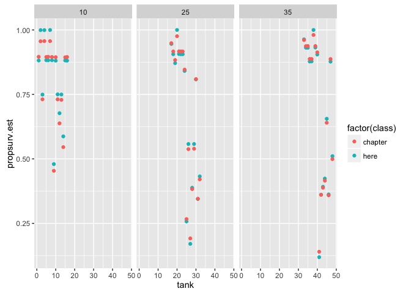

# Chapter-12-assignment-02
Ruijuan Li  
11/10/2016  
# using results='hide' to hide text result 

# 12M3

```r
# Re-estimate the basic Reed frog varying intercept model, but now using a Cauchy distribution in place of the Gaussian distribution for the varying intercepts. 

library(rethinking)
```

```
## Loading required package: rstan
```

```
## Warning: package 'rstan' was built under R version 3.2.5
```

```
## Loading required package: ggplot2
```

```
## Loading required package: StanHeaders
```

```
## Warning: package 'StanHeaders' was built under R version 3.2.5
```

```
## rstan (Version 2.10.1, packaged: 2016-06-24 13:22:16 UTC, GitRev: 85f7a56811da)
```

```
## For execution on a local, multicore CPU with excess RAM we recommend calling
## rstan_options(auto_write = TRUE)
## options(mc.cores = parallel::detectCores())
```

```
## Loading required package: parallel
```

```
## rethinking (Version 1.59)
```

```r
data("reedfrogs")
d <- reedfrogs
str(d)
head(d)
d$tank <- 1:nrow(d)
head(d)
d$density 

m12M3.chapter <- map2stan(
  alist(
    surv ~ dbinom(density, p),
    logit(p) <- a_tank[tank],
    a_tank[tank] ~ dnorm(a, sigma),
    a ~ dnorm(0, 1), 
    sigma ~ dcauchy(0, 1)  
  ), data = d, iter = 4000, chains = 4) 
```

```
## Warning in FUN(X[[i]], ...): data with name pred is not numeric and not
## used
```

```
## Warning in FUN(X[[i]], ...): data with name size is not numeric and not
## used
```

```
## Warning in FUN(X[[i]], ...): data with name pred is not numeric and not
## used
```

```
## Warning in FUN(X[[i]], ...): data with name size is not numeric and not
## used
```

```
## Computing WAIC
```

```
## Constructing posterior predictions
```

```
## Aggregated binomial counts detected. Splitting to 0/1 outcome for WAIC calculation.
```

```r
m12M3.here <- map2stan(
  alist(
    surv ~ dbinom(density, p),
    logit(p) <- a_tank[tank],
    a_tank[tank] ~ dcauchy(a, sigma),
    a ~ dnorm(0, 1), 
    sigma ~ dcauchy(0, 1)  
  ), data = d, iter = 4000, chains = 4)
```

```
## Warning in FUN(X[[i]], ...): data with name pred is not numeric and not
## used

## Warning in FUN(X[[i]], ...): data with name size is not numeric and not
## used
```

```
## The following numerical problems occured the indicated number of times after warmup on chain 3
```

```
##                                                                                      count
## Exception thrown at line 17: cauchy_log: Scale parameter is inf, but must be finite!     1
```

```
## When a numerical problem occurs, the Metropolis proposal gets rejected.
```

```
## However, by design Metropolis proposals sometimes get rejected even when there are no numerical problems.
```

```
## Thus, if the number in the 'count' column is small, do not ask about this message on stan-users.
```

```
## Warning in FUN(X[[i]], ...): data with name pred is not numeric and not
## used

## Warning in FUN(X[[i]], ...): data with name size is not numeric and not
## used
```

```
## Computing WAIC
```

```
## Constructing posterior predictions
```

```
## Aggregated binomial counts detected. Splitting to 0/1 outcome for WAIC calculation.
```

```r
?Cauchy
?dcauchy
```

# 12M3 continue 

```r
# Compare the posterior means of the intercepts, αTANK, to the posterior means produced in the chapter, using the customary Gaussian prior. Can you explain the pattern of differences? 
precis(m12M3.chapter, depth = 2)
```

```
##             Mean StdDev lower 0.89 upper 0.89 n_eff Rhat
## a_tank[1]   2.15   0.89       0.69       3.48  8000    1
## a_tank[2]   3.08   1.11       1.41       4.87  8000    1
## a_tank[3]   1.00   0.68      -0.07       2.08  8000    1
## a_tank[4]   3.09   1.14       1.24       4.75  8000    1
## a_tank[5]   2.14   0.89       0.69       3.48  8000    1
## a_tank[6]   2.15   0.89       0.80       3.54  8000    1
## a_tank[7]   3.09   1.14       1.33       4.84  8000    1
## a_tank[8]   2.14   0.89       0.69       3.49  8000    1
## a_tank[9]  -0.19   0.63      -1.19       0.80  8000    1
## a_tank[10]  2.14   0.89       0.74       3.49  8000    1
## a_tank[11]  1.00   0.67      -0.05       2.08  8000    1
## a_tank[12]  0.57   0.63      -0.41       1.60  8000    1
## a_tank[13]  0.99   0.69      -0.02       2.16  8000    1
## a_tank[14]  0.18   0.61      -0.74       1.19  8000    1
## a_tank[15]  2.13   0.90       0.67       3.48  8000    1
## a_tank[16]  2.14   0.89       0.71       3.48  8000    1
## a_tank[17]  2.92   0.79       1.70       4.15  8000    1
## a_tank[18]  2.39   0.67       1.37       3.46  8000    1
## a_tank[19]  2.02   0.59       1.08       2.93  8000    1
## a_tank[20]  3.69   1.03       2.10       5.24  8000    1
## a_tank[21]  2.40   0.68       1.34       3.45  8000    1
## a_tank[22]  2.39   0.65       1.39       3.42  8000    1
## a_tank[23]  2.40   0.66       1.35       3.41  8000    1
## a_tank[24]  1.70   0.54       0.80       2.49  8000    1
## a_tank[25] -1.01   0.44      -1.70      -0.30  8000    1
## a_tank[26]  0.15   0.40      -0.50       0.77  8000    1
## a_tank[27] -1.44   0.50      -2.22      -0.63  8000    1
## a_tank[28] -0.48   0.42      -1.12       0.21  8000    1
## a_tank[29]  0.16   0.41      -0.51       0.78  8000    1
## a_tank[30]  1.45   0.50       0.66       2.26  8000    1
## a_tank[31] -0.64   0.42      -1.28       0.05  8000    1
## a_tank[32] -0.32   0.40      -0.96       0.31  8000    1
## a_tank[33]  3.20   0.77       1.98       4.39  8000    1
## a_tank[34]  2.70   0.64       1.59       3.61  8000    1
## a_tank[35]  2.71   0.64       1.71       3.69  8000    1
## a_tank[36]  2.06   0.52       1.24       2.87  8000    1
## a_tank[37]  2.06   0.51       1.26       2.86  8000    1
## a_tank[38]  3.92   0.97       2.31       5.31  8000    1
## a_tank[39]  2.71   0.65       1.70       3.73  8000    1
## a_tank[40]  2.35   0.57       1.47       3.26  8000    1
## a_tank[41] -1.82   0.47      -2.58      -1.09  8000    1
## a_tank[42] -0.57   0.35      -1.14      -0.03  8000    1
## a_tank[43] -0.46   0.35      -0.99       0.10  8000    1
## a_tank[44] -0.34   0.34      -0.90       0.18  8000    1
## a_tank[45]  0.58   0.35       0.05       1.16  8000    1
## a_tank[46] -0.58   0.34      -1.14      -0.03  8000    1
## a_tank[47]  2.06   0.52       1.24       2.85  8000    1
## a_tank[48]  0.00   0.33      -0.56       0.51  8000    1
## a           1.30   0.25       0.91       1.71  8000    1
## sigma       1.64   0.22       1.27       1.96  5393    1
```

```r
precis(m12M3.here, depth = 2) 
```

```
##             Mean StdDev lower 0.89 upper 0.89 n_eff Rhat
## a_tank[1]   2.01   0.84       0.78       3.29  8000 1.00
## a_tank[2]   7.19  14.21       0.60      12.22   539 1.01
## a_tank[3]   1.09   0.60       0.10       2.00  8000 1.00
## a_tank[4]   7.10  15.71       0.62      11.86   231 1.02
## a_tank[5]   2.02   0.86       0.70       3.27  8000 1.00
## a_tank[6]   2.01   0.87       0.72       3.27  4663 1.00
## a_tank[7]   8.17  17.96       0.44      14.44   302 1.01
## a_tank[8]   2.02   0.88       0.66       3.29  4678 1.00
## a_tank[9]  -0.08   0.67      -1.10       1.00  8000 1.00
## a_tank[10]  2.00   0.84       0.71       3.24  8000 1.00
## a_tank[11]  1.10   0.64       0.11       2.12  8000 1.00
## a_tank[12]  0.74   0.61      -0.25       1.69  8000 1.00
## a_tank[13]  1.10   0.62       0.12       2.08  8000 1.00
## a_tank[14]  0.35   0.64      -0.67       1.36  8000 1.00
## a_tank[15]  2.01   0.86       0.68       3.21  8000 1.00
## a_tank[16]  2.00   0.87       0.66       3.25  8000 1.00
## a_tank[17]  2.86   0.92       1.52       4.20  5066 1.00
## a_tank[18]  2.26   0.66       1.22       3.24  8000 1.00
## a_tank[19]  1.91   0.54       1.10       2.76  8000 1.00
## a_tank[20] 28.75 123.19       1.34      22.90    47 1.09
## a_tank[21]  2.27   0.68       1.24       3.29  8000 1.00
## a_tank[22]  2.26   0.67       1.25       3.26  8000 1.00
## a_tank[23]  2.26   0.66       1.19       3.21  8000 1.00
## a_tank[24]  1.67   0.49       0.91       2.44  8000 1.00
## a_tank[25] -1.06   0.48      -1.81      -0.28  8000 1.00
## a_tank[26]  0.23   0.42      -0.42       0.92  8000 1.00
## a_tank[27] -1.58   0.56      -2.44      -0.68  8000 1.00
## a_tank[28] -0.46   0.43      -1.15       0.22  8000 1.00
## a_tank[29]  0.23   0.41      -0.42       0.91  8000 1.00
## a_tank[30]  1.44   0.45       0.75       2.17  8000 1.00
## a_tank[31] -0.64   0.44      -1.36       0.04  8000 1.00
## a_tank[32] -0.27   0.40      -0.87       0.41  8000 1.00
## a_tank[33]  3.27   0.99       1.76       4.65  5174 1.00
## a_tank[34]  2.61   0.69       1.55       3.63  8000 1.00
## a_tank[35]  2.60   0.68       1.56       3.60  8000 1.00
## a_tank[36]  1.97   0.47       1.26       2.74  8000 1.00
## a_tank[37]  1.97   0.49       1.22       2.74  8000 1.00
## a_tank[38] 15.26  45.21       1.76      23.79   658 1.01
## a_tank[39]  2.62   0.69       1.55       3.65  8000 1.00
## a_tank[40]  2.25   0.56       1.37       3.13  8000 1.00
## a_tank[41] -2.00   0.54      -2.83      -1.14  8000 1.00
## a_tank[42] -0.57   0.36      -1.11       0.02  8000 1.00
## a_tank[43] -0.44   0.35      -0.99       0.12  8000 1.00
## a_tank[44] -0.31   0.35      -0.84       0.27  8000 1.00
## a_tank[45]  0.64   0.36       0.07       1.21  8000 1.00
## a_tank[46] -0.57   0.36      -1.18      -0.01  8000 1.00
## a_tank[47]  1.97   0.47       1.20       2.69  8000 1.00
## a_tank[48]  0.04   0.35      -0.53       0.60  8000 1.00
## a           1.41   0.30       0.92       1.86  4361 1.00
## sigma       1.03   0.23       0.68       1.40  5295 1.00
```

```r
compare(m12M3.chapter, m12M3.here)
```

```
##                 WAIC pWAIC dWAIC weight    SE  dSE
## m12M3.chapter 1010.8  38.5   0.0   0.66 38.14   NA
## m12M3.here    1012.1  39.2   1.3   0.34 37.76 2.31
```

```r
post.chapter <- extract.samples(m12M3.chapter)
post.here <- extract.samples(m12M3.here)

# compute posterior mean for each tank 
# also transform to probability with logistic 
d$propsurv.est.chapter <- logistic(apply(post.chapter$a_tank, 2, mean))
d$propsurv.est.here <- logistic(apply(post.here$a_tank, 2, mean))

d.plot <- data.frame(row.names = c(1: 96),
                     tank = rep(c(1:48), 2),
                     propsurv.est = c(d$propsurv.est.here, d$propsurv.est.chapter),
                     class = c(rep("here", 48), rep("chapter", 48)),
                     size=rep(d$density,2))


p.1 <- ggplot(data = d.plot)
p.1 <- p.1 + geom_point(aes(x=tank, y = propsurv.est, color=factor(class)))
p.1 <- p.1 + facet_grid(~size)
p.1
```



```r
# as the sample size increases, the difference between the two models decreases, but which one is closer to the truth?  

# I don't quite understand the estimate got from precis, what if plot all of them together? 
estimated.chapter <- logistic(as.numeric(coef(m12M3.chapter)[1:48]))  
estimated.here <- logistic(as.numeric(coef(m12M3.here)[1:48]))

d.plot.2 <- data.frame(row.names = c(1: 192),
                     tank = rep(c(1:48), 4),
                     propsurv.est = c(d$propsurv.est.here, estimated.here, d$propsurv.est.chapter, estimated.chapter),
                     class = c(rep("here", 96), rep("chapter", 96)),
                     type=c(rep("posterior", 48), rep("estimate", 48), rep("posterior", 48), rep("estimate", 48)),
                     size=rep(d$density,4))

p.2 <- ggplot(data = d.plot.2)
p.2 <- p.2 + geom_point(aes(x=tank, y = propsurv.est, color=factor(class)))
p.2 <- p.2 + facet_grid(type~size)
p.2
```


```r
# precis result & posterior are the same thing? 
```


# 12H1

```r
# get data, 1934 women's fertility data 
data("bangladesh")
d.fertility <- bangladesh
head(d.fertility) # 1) district: where they are from 2) use.contraception: 0/1 indicate yes or no 3) urban: from city or rural area 
```

```
##   woman district use.contraception living.children age.centered urban
## 1     1        1                 0               4      18.4400     1
## 2     2        1                 0               1      -5.5599     1
## 3     3        1                 0               3       1.4400     1
## 4     4        1                 0               4       8.4400     1
## 5     5        1                 0               1     -13.5590     1
## 6     6        1                 0               1     -11.5600     1
```

```r
colnames(d.fertility) <- gsub("\\.", "_", colnames(d.fertility)) # remove dots 
head(d.fertility)
```

```
##   woman district use_contraception living_children age_centered urban
## 1     1        1                 0               4      18.4400     1
## 2     2        1                 0               1      -5.5599     1
## 3     3        1                 0               3       1.4400     1
## 4     4        1                 0               4       8.4400     1
## 5     5        1                 0               1     -13.5590     1
## 6     6        1                 0               1     -11.5600     1
```

```r
dim(d.fertility) # 1934    6 
```

```
## [1] 1934    6
```

```r
str(d.fertility)
```

```
## 'data.frame':	1934 obs. of  6 variables:
##  $ woman            : int  1 2 3 4 5 6 7 8 9 10 ...
##  $ district         : int  1 1 1 1 1 1 1 1 1 1 ...
##  $ use_contraception: int  0 0 0 0 0 0 0 0 0 0 ...
##  $ living_children  : int  4 1 3 4 1 1 4 4 2 4 ...
##  $ age_centered     : num  18.44 -5.56 1.44 8.44 -13.56 ...
##  $ urban            : int  1 1 1 1 1 1 1 1 1 1 ...
```

```r
# The first thing to do is ensure that the cluster variable, district, is a contiguous set of integers. Recall that these values will be index values inside the model. If there are gaps, you'll have parameters for which there is no data to inform them. Worse, the model probably won't run. Look at the unique values of the district variable: 

sort(unique(d.fertility$district))
```

```
##  [1]  1  2  3  4  5  6  7  8  9 10 11 12 13 14 15 16 17 18 19 20 21 22 23
## [24] 24 25 26 27 28 29 30 31 32 33 34 35 36 37 38 39 40 41 42 43 44 45 46
## [47] 47 48 49 50 51 52 53 55 56 57 58 59 60 61
```

```r
# District 54 is absent. So district isn't yet a good index variable, because it's not contiguous. This is easy to fix. Just make a new variable that is contiguous. This is enough to do it: 

d.fertility$district_id <- as.integer(as.factor(d.fertility$district))
sort(unique(d.fertility$district_id))
```

```
##  [1]  1  2  3  4  5  6  7  8  9 10 11 12 13 14 15 16 17 18 19 20 21 22 23
## [24] 24 25 26 27 28 29 30 31 32 33 34 35 36 37 38 39 40 41 42 43 44 45 46
## [47] 47 48 49 50 51 52 53 54 55 56 57 58 59 60
```


```r
# Now, focus on predicting use.contraception, clustered by district_id. Do not include urban just yet.  
# fit a traditional fixed-effects model that uses dummy variables for district 
# create dummy variable, how?  

# fit the model with dummy variables for each? 
m12H1.1 <- map2stan(
  alist(
    use_contraception ~ dbinom(1, p),
    logit(p) <- a_district[district_id],
    a_district[district_id] ~ dnorm(0, 5)
  ), data = d.fertility, iter = 4000, chains = 4) 
```

```
## Computing WAIC
```

```
## Constructing posterior predictions
```

```r
# fit a multilevel model with varying intercepts for district.  
m12H1.2 <- map2stan(
  alist(
    use_contraception ~ dbinom(1, p),
    logit(p) <- a_district[district_id],
    a_district[district_id] ~ dnorm(a, sigma),
    a ~ dnorm(0, 1), 
    sigma ~ dcauchy(0, 1)  
  ), data = d.fertility, iter = 4000, chains = 4) 
```

```
## The following numerical problems occured the indicated number of times after warmup on chain 3
```

```
##                                                                                 count
## Exception thrown at line 16: normal_log: Scale parameter is 0, but must be > 0!     1
```

```
## When a numerical problem occurs, the Metropolis proposal gets rejected.
```

```
## However, by design Metropolis proposals sometimes get rejected even when there are no numerical problems.
```

```
## Thus, if the number in the 'count' column is small, do not ask about this message on stan-users.
```

```
## Computing WAIC
```

```
## Constructing posterior predictions
```

# summary of the result 

```r
precis(m12H1.1, depth = 2)
```

```
##                 Mean StdDev lower 0.89 upper 0.89 n_eff Rhat
## a_district[1]  -1.07   0.21      -1.42      -0.74  8000    1
## a_district[2]  -0.65   0.48      -1.40       0.15  8000    1
## a_district[3]   4.41   3.07      -0.31       8.90  8000    1
## a_district[4]   0.00   0.37      -0.59       0.59  8000    1
## a_district[5]  -0.59   0.34      -1.12      -0.05  8000    1
## a_district[6]  -0.90   0.27      -1.31      -0.45  8000    1
## a_district[7]  -1.01   0.55      -1.85      -0.12  8000    1
## a_district[8]  -0.51   0.35      -1.06       0.04  8000    1
## a_district[9]  -0.86   0.46      -1.58      -0.11  8000    1
## a_district[10] -2.82   1.18      -4.54      -1.01  8000    1
## a_district[11] -6.37   2.70     -10.29      -2.40  5460    1
## a_district[12] -0.66   0.40      -1.30      -0.02  8000    1
## a_district[13] -0.35   0.43      -1.02       0.34  8000    1
## a_district[14]  0.52   0.19       0.22       0.83  8000    1
## a_district[15] -0.58   0.47      -1.32       0.15  8000    1
## a_district[16]  0.21   0.47      -0.53       0.97  8000    1
## a_district[17] -0.93   0.46      -1.64      -0.19  8000    1
## a_district[18] -0.68   0.32      -1.18      -0.19  8000    1
## a_district[19] -0.48   0.41      -1.13       0.17  8000    1
## a_district[20] -0.42   0.54      -1.33       0.37  8000    1
## a_district[21] -0.47   0.50      -1.27       0.30  8000    1
## a_district[22] -1.46   0.59      -2.40      -0.54  8000    1
## a_district[23] -1.07   0.62      -2.04      -0.09  8000    1
## a_district[24] -2.88   1.15      -4.50      -1.05  8000    1
## a_district[25] -0.21   0.25      -0.60       0.20  8000    1
## a_district[26] -0.50   0.59      -1.43       0.44  8000    1
## a_district[27] -1.55   0.39      -2.18      -0.95  8000    1
## a_district[28] -1.15   0.34      -1.66      -0.59  8000    1
## a_district[29] -0.97   0.40      -1.59      -0.33  8000    1
## a_district[30] -0.03   0.26      -0.44       0.38  8000    1
## a_district[31] -0.19   0.36      -0.75       0.40  8000    1
## a_district[32] -1.40   0.52      -2.19      -0.53  8000    1
## a_district[33] -0.30   0.57      -1.16       0.62  8000    1
## a_district[34]  0.67   0.36       0.06       1.21  8000    1
## a_district[35]  0.00   0.29      -0.49       0.45  8000    1
## a_district[36] -0.64   0.52      -1.46       0.17  8000    1
## a_district[37]  0.16   0.58      -0.79       1.05  8000    1
## a_district[38] -0.99   0.61      -1.90       0.02  8000    1
## a_district[39]  0.00   0.40      -0.64       0.63  8000    1
## a_district[40] -0.15   0.33      -0.68       0.36  8000    1
## a_district[41]  0.00   0.40      -0.61       0.66  8000    1
## a_district[42]  0.19   0.63      -0.82       1.17  8000    1
## a_district[43]  0.14   0.30      -0.34       0.62  8000    1
## a_district[44] -1.30   0.47      -2.01      -0.55  8000    1
## a_district[45] -0.71   0.35      -1.25      -0.15  8000    1
## a_district[46]  0.10   0.21      -0.25       0.43  8000    1
## a_district[47] -0.14   0.54      -1.05       0.66  8000    1
## a_district[48]  0.10   0.31      -0.42       0.58  8000    1
## a_district[49] -5.04   2.92      -9.39      -0.78  6118    1
## a_district[50] -0.11   0.48      -0.84       0.66  8000    1
## a_district[51] -0.17   0.34      -0.72       0.37  8000    1
## a_district[52] -0.23   0.26      -0.65       0.18  8000    1
## a_district[53] -0.33   0.48      -1.04       0.48  8000    1
## a_district[54] -1.91   1.24      -3.78      -0.01  8000    1
## a_district[55]  0.32   0.31      -0.16       0.83  8000    1
## a_district[56] -1.55   0.51      -2.35      -0.72  8000    1
## a_district[57] -0.19   0.36      -0.78       0.36  8000    1
## a_district[58] -2.55   1.19      -4.40      -0.80  8000    1
## a_district[59] -1.32   0.43      -2.00      -0.63  8000    1
## a_district[60] -1.33   0.39      -1.94      -0.72  8000    1
```

```r
precis(m12H1.2, depth = 2)
```

```
##                 Mean StdDev lower 0.89 upper 0.89 n_eff Rhat
## a_district[1]  -1.00   0.20      -1.30      -0.68  8000    1
## a_district[2]  -0.59   0.36      -1.17      -0.02  8000    1
## a_district[3]  -0.22   0.50      -1.08       0.51  8000    1
## a_district[4]  -0.19   0.32      -0.74       0.28  8000    1
## a_district[5]  -0.58   0.29      -1.03      -0.12  8000    1
## a_district[6]  -0.82   0.24      -1.18      -0.41  8000    1
## a_district[7]  -0.75   0.38      -1.34      -0.14  8000    1
## a_district[8]  -0.52   0.28      -0.96      -0.06  8000    1
## a_district[9]  -0.71   0.35      -1.25      -0.13  8000    1
## a_district[10] -1.15   0.43      -1.83      -0.45  8000    1
## a_district[11] -1.58   0.44      -2.27      -0.89  4846    1
## a_district[12] -0.61   0.32      -1.14      -0.13  8000    1
## a_district[13] -0.42   0.33      -0.98       0.09  8000    1
## a_district[14]  0.40   0.18       0.11       0.69  8000    1
## a_district[15] -0.56   0.34      -1.07       0.00  8000    1
## a_district[16] -0.11   0.35      -0.66       0.45  8000    1
## a_district[17] -0.76   0.34      -1.29      -0.21  8000    1
## a_district[18] -0.64   0.27      -1.06      -0.19  8000    1
## a_district[19] -0.50   0.33      -1.03       0.01  8000    1
## a_district[20] -0.48   0.38      -1.07       0.13  8000    1
## a_district[21] -0.49   0.36      -1.05       0.10  8000    1
## a_district[22] -0.97   0.38      -1.58      -0.37  8000    1
## a_district[23] -0.76   0.40      -1.38      -0.13  8000    1
## a_district[24] -1.19   0.45      -1.89      -0.49  8000    1
## a_district[25] -0.28   0.22      -0.62       0.10  8000    1
## a_district[26] -0.51   0.39      -1.14       0.10  8000    1
## a_district[27] -1.19   0.31      -1.66      -0.67  8000    1
## a_district[28] -0.97   0.28      -1.41      -0.51  8000    1
## a_district[29] -0.81   0.31      -1.30      -0.31  8000    1
## a_district[30] -0.13   0.24      -0.50       0.25  8000    1
## a_district[31] -0.29   0.30      -0.76       0.20  8000    1
## a_district[32] -0.99   0.35      -1.55      -0.43  8000    1
## a_district[33] -0.42   0.40      -1.05       0.20  8000    1
## a_district[34]  0.29   0.30      -0.18       0.79  8000    1
## a_district[35] -0.13   0.26      -0.53       0.30  8000    1
## a_district[36] -0.58   0.37      -1.13       0.02  8000    1
## a_district[37] -0.22   0.39      -0.83       0.42  8000    1
## a_district[38] -0.72   0.39      -1.37      -0.11  8000    1
## a_district[39] -0.19   0.32      -0.69       0.32  8000    1
## a_district[40] -0.25   0.27      -0.66       0.21  8000    1
## a_district[41] -0.20   0.32      -0.72       0.30  8000    1
## a_district[42] -0.23   0.41      -0.87       0.43  8000    1
## a_district[43] -0.03   0.27      -0.46       0.40  8000    1
## a_district[44] -0.97   0.34      -1.48      -0.40  8000    1
## a_district[45] -0.66   0.29      -1.12      -0.21  8000    1
## a_district[46]  0.00   0.20      -0.33       0.33  8000    1
## a_district[47] -0.34   0.39      -0.96       0.28  8000    1
## a_district[48] -0.07   0.27      -0.50       0.36  8000    1
## a_district[49] -0.87   0.51      -1.69      -0.09  8000    1
## a_district[50] -0.30   0.36      -0.87       0.27  8000    1
## a_district[51] -0.27   0.29      -0.73       0.19  8000    1
## a_district[52] -0.29   0.23      -0.66       0.07  8000    1
## a_district[53] -0.42   0.36      -1.00       0.14  8000    1
## a_district[54] -0.79   0.47      -1.53      -0.06  8000    1
## a_district[55]  0.10   0.26      -0.30       0.53  8000    1
## a_district[56] -1.08   0.35      -1.63      -0.50  8000    1
## a_district[57] -0.31   0.30      -0.78       0.16  8000    1
## a_district[58] -1.02   0.44      -1.70      -0.31  8000    1
## a_district[59] -1.00   0.33      -1.53      -0.48  8000    1
## a_district[60] -1.06   0.30      -1.54      -0.59  8000    1
## a              -0.54   0.09      -0.68      -0.39  4979    1
## sigma           0.53   0.08       0.40       0.66  2209    1
```

```r
# Plot the predicted proportions of women in each district using contraception, for both the fixed-effects model and the varying-effects model. That is, make a plot in which district ID is on the horizontal axis and expected proportion using contraception is on the vertical. Make one plot for each model, or layer them on the same plot, as you prefer. How do the models disagree? Can you explain the pattern of disagreement? In particular, can you explain the most extreme cases of disagreement, both why they happen where they do and why the models reach different inferences? 
```


