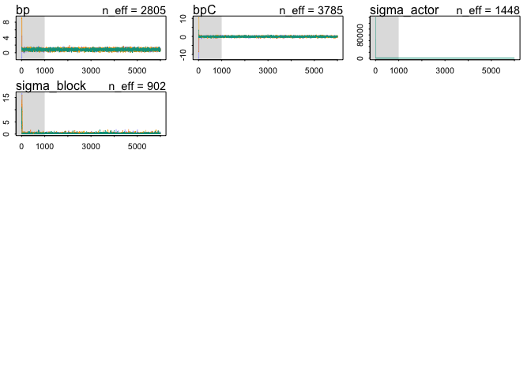
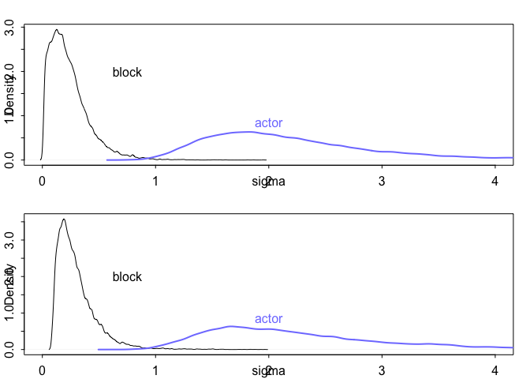

# Chapter-12-assignment-03
Ruijuan Li  
11/30/2016  

# 12E3

```r
# y ~ Normal(mui, sigma1)
# mui = a + a_group[i] + bxi
# a_group ~ Normal(0, sigma2)
# c(a,b) ~ Nomral(0,10)
# c(sigma1, sigma2) ~ HalfCauchy(0, 2)
```

# 12E4

```r
# y ~ Possion(mui)
# log(mui) <- a+ a_group[i] + blogPi # get this from page 382, but don't understand the log part... 
# a_group ~ Normal(0, sigma)
# c(a,b) ~ Normal(0, 10)
# sigma ~ HalfCauchy(0, 1)
```

# 12E5

```r
# y ~ Possion(mui)
# log(mui) <- a+ a_group_i[i] + a_group_ii[ii] + blogPi 
# a_group_i ~ Normal(0, sigma_i)
# a_group_ii ~ Normal(0, sigma_ii)
# c(a,b) ~ Normal(0, 10)
# c(sigma_i, sigmal_ii) ~ HalfCauchy(0, 1)
```

# 12M4 

```r
# fit a cross-classified multilevel model to the chimp data 
library(rethinking)
```

```
## Loading required package: rstan
```

```
## Warning: package 'rstan' was built under R version 3.2.5
```

```
## Loading required package: ggplot2
```

```
## Loading required package: StanHeaders
```

```
## Warning: package 'StanHeaders' was built under R version 3.2.5
```

```
## rstan (Version 2.10.1, packaged: 2016-06-24 13:22:16 UTC, GitRev: 85f7a56811da)
```

```
## For execution on a local, multicore CPU with excess RAM we recommend calling
## rstan_options(auto_write = TRUE)
## options(mc.cores = parallel::detectCores())
```

```
## Loading required package: parallel
```

```
## rethinking (Version 1.59)
```

```r
data("chimpanzees")
d <- chimpanzees
head(chimpanzees)
```

```
##   actor recipient condition block trial prosoc_left chose_prosoc
## 1     1        NA         0     1     2           0            1
## 2     1        NA         0     1     4           0            0
## 3     1        NA         0     1     6           1            0
## 4     1        NA         0     1     8           0            1
## 5     1        NA         0     1    10           1            1
## 6     1        NA         0     1    12           1            1
##   pulled_left
## 1           0
## 2           1
## 3           0
## 4           0
## 5           1
## 6           1
```

```r
# Two types of clusters 
# prep data 
d$recipient <- NULL
d$block_id <- d$block # name 'block' is reserved by Stan 

# model in the chapter 
m12M4.1 <- map2stan(
  alist(
    pulled_left ~ dbinom(1, p), 
    logit(p) <- a + a_actor[actor] + a_block[block_id] + 
      (bp + bpC*condition)*prosoc_left,
    a_actor[actor] ~ dnorm(0, sigma_actor), 
    a_block[block_id] ~ dnorm(0, sigma_block), 
    a ~ dnorm(0, 10), 
    bp ~ dnorm(0, 10), 
    bpC ~ dnorm(0, 10), 
    sigma_actor ~ dcauchy(0, 1), 
    sigma_block ~ dcauchy(0, 1)
  ), 
  data = d, warmup = 1000, iter = 6000, chains = 4, cores = 3)
```

```
## In file included from file107fd321c615d.cpp:8:
## In file included from /Library/Frameworks/R.framework/Versions/3.2/Resources/library/StanHeaders/include/src/stan/model/model_header.hpp:4:
## In file included from /Library/Frameworks/R.framework/Versions/3.2/Resources/library/StanHeaders/include/stan/math.hpp:4:
## In file included from /Library/Frameworks/R.framework/Versions/3.2/Resources/library/StanHeaders/include/stan/math/rev/mat.hpp:4:
## In file included from /Library/Frameworks/R.framework/Versions/3.2/Resources/library/StanHeaders/include/stan/math/rev/core.hpp:42:
## /Library/Frameworks/R.framework/Versions/3.2/Resources/library/StanHeaders/include/stan/math/rev/core/set_zero_all_adjoints.hpp:14:17: warning: unused function 'set_zero_all_adjoints' [-Wunused-function]
##     static void set_zero_all_adjoints() {
##                 ^
## In file included from file107fd321c615d.cpp:8:
## In file included from /Library/Frameworks/R.framework/Versions/3.2/Resources/library/StanHeaders/include/src/stan/model/model_header.hpp:4:
## In file included from /Library/Frameworks/R.framework/Versions/3.2/Resources/library/StanHeaders/include/stan/math.hpp:4:
## In file included from /Library/Frameworks/R.framework/Versions/3.2/Resources/library/StanHeaders/include/stan/math/rev/mat.hpp:4:
## In file included from /Library/Frameworks/R.framework/Versions/3.2/Resources/library/StanHeaders/include/stan/math/rev/core.hpp:43:
## /Library/Frameworks/R.framework/Versions/3.2/Resources/library/StanHeaders/include/stan/math/rev/core/set_zero_all_adjoints_nested.hpp:17:17: warning: 'static' function 'set_zero_all_adjoints_nested' declared in header file should be declared 'static inline' [-Wunneeded-internal-declaration]
##     static void set_zero_all_adjoints_nested() {
##                 ^
## In file included from file107fd321c615d.cpp:8:
## In file included from /Library/Frameworks/R.framework/Versions/3.2/Resources/library/StanHeaders/include/src/stan/model/model_header.hpp:4:
## In file included from /Library/Frameworks/R.framework/Versions/3.2/Resources/library/StanHeaders/include/stan/math.hpp:4:
## In file included from /Library/Frameworks/R.framework/Versions/3.2/Resources/library/StanHeaders/include/stan/math/rev/mat.hpp:8:
## In file included from /Library/Frameworks/R.framework/Versions/3.2/Resources/library/StanHeaders/include/stan/math/prim/mat.hpp:55:
## /Library/Frameworks/R.framework/Versions/3.2/Resources/library/StanHeaders/include/stan/math/prim/mat/fun/autocorrelation.hpp:19:14: warning: function 'fft_next_good_size' is not needed and will not be emitted [-Wunneeded-internal-declaration]
##       size_t fft_next_good_size(size_t N) {
##              ^
## In file included from file107fd321c615d.cpp:8:
## In file included from /Library/Frameworks/R.framework/Versions/3.2/Resources/library/StanHeaders/include/src/stan/model/model_header.hpp:4:
## In file included from /Library/Frameworks/R.framework/Versions/3.2/Resources/library/StanHeaders/include/stan/math.hpp:4:
## In file included from /Library/Frameworks/R.framework/Versions/3.2/Resources/library/StanHeaders/include/stan/math/rev/mat.hpp:8:
## In file included from /Library/Frameworks/R.framework/Versions/3.2/Resources/library/StanHeaders/include/stan/math/prim/mat.hpp:36:
## /Library/Frameworks/R.framework/Versions/3.2/Resources/library/StanHeaders/include/stan/math/prim/mat/err/check_positive_ordered.hpp:39:67: warning: unused typedef 'size_type' [-Wunused-local-typedef]
##       typedef typename index_type<Matrix<T_y, Dynamic, 1> >::type size_type;
##                                                                   ^
## In file included from file107fd321c615d.cpp:8:
## In file included from /Library/Frameworks/R.framework/Versions/3.2/Resources/library/StanHeaders/include/src/stan/model/model_header.hpp:4:
## In file included from /Library/Frameworks/R.framework/Versions/3.2/Resources/library/StanHeaders/include/stan/math.hpp:4:
## In file included from /Library/Frameworks/R.framework/Versions/3.2/Resources/library/StanHeaders/include/stan/math/rev/mat.hpp:8:
## In file included from /Library/Frameworks/R.framework/Versions/3.2/Resources/library/StanHeaders/include/stan/math/prim/mat.hpp:232:
## In file included from /Library/Frameworks/R.framework/Versions/3.2/Resources/library/StanHeaders/include/stan/math/prim/arr.hpp:33:
## In file included from /Library/Frameworks/R.framework/Versions/3.2/Resources/library/StanHeaders/include/stan/math/prim/arr/functor/integrate_ode_rk45.hpp:13:
## In file included from /Library/Frameworks/R.framework/Versions/3.2/Resources/library/BH/include/boost/numeric/odeint.hpp:61:
## In file included from /Library/Frameworks/R.framework/Versions/3.2/Resources/library/BH/include/boost/numeric/odeint/util/multi_array_adaption.hpp:29:
## In file included from /Library/Frameworks/R.framework/Versions/3.2/Resources/library/BH/include/boost/multi_array.hpp:21:
## In file included from /Library/Frameworks/R.framework/Versions/3.2/Resources/library/BH/include/boost/multi_array/base.hpp:28:
## /Library/Frameworks/R.framework/Versions/3.2/Resources/library/BH/include/boost/multi_array/concept_checks.hpp:42:43: warning: unused typedef 'index_range' [-Wunused-local-typedef]
##       typedef typename Array::index_range index_range;
##                                           ^
## /Library/Frameworks/R.framework/Versions/3.2/Resources/library/BH/include/boost/multi_array/concept_checks.hpp:43:37: warning: unused typedef 'index' [-Wunused-local-typedef]
##       typedef typename Array::index index;
##                                     ^
## /Library/Frameworks/R.framework/Versions/3.2/Resources/library/BH/include/boost/multi_array/concept_checks.hpp:53:43: warning: unused typedef 'index_range' [-Wunused-local-typedef]
##       typedef typename Array::index_range index_range;
##                                           ^
## /Library/Frameworks/R.framework/Versions/3.2/Resources/library/BH/include/boost/multi_array/concept_checks.hpp:54:37: warning: unused typedef 'index' [-Wunused-local-typedef]
##       typedef typename Array::index index;
##                                     ^
## 8 warnings generated.
```

```
## Warning: There were 17 divergent transitions after warmup. Increasing
## adapt_delta above 0.8 may help.
```

```
## Warning: Examine the pairs() plot to diagnose sampling problems
```

```
## 
## SAMPLING FOR MODEL 'pulled_left ~ dbinom(1, p)' NOW (CHAIN 1).
## WARNING: No variance estimation is
##          performed for num_warmup < 20
## 
## 
## Chain 1, Iteration: 1 / 1 [100%]  (Sampling)
##  Elapsed Time: 6e-06 seconds (Warm-up)
##                0.000464 seconds (Sampling)
##                0.00047 seconds (Total)
```

```
## Computing WAIC
```

```
## Constructing posterior predictions
```

```
## [ 2000 / 20000 ]
[ 4000 / 20000 ]
[ 6000 / 20000 ]
[ 8000 / 20000 ]
[ 10000 / 20000 ]
[ 12000 / 20000 ]
[ 14000 / 20000 ]
[ 16000 / 20000 ]
[ 18000 / 20000 ]
[ 20000 / 20000 ]
```

```
## Warning in map2stan(alist(pulled_left ~ dbinom(1, p), logit(p) <- a + a_actor[actor] + : There were 17 divergent iterations during sampling.
## Check the chains (trace plots, n_eff, Rhat) carefully to ensure they are valid.
```

```r
# model in here 
m12M4.2 <- map2stan(
  alist(
    pulled_left ~ dbinom(1, p), 
    logit(p) <- a_actor[actor] + a_block[block_id] + 
      (bp + bpC*condition)*prosoc_left,
    a_actor[actor] ~ dnorm(a, sigma_actor), 
    a_block[block_id] ~ dnorm(rho, sigma_block), 
    a ~ dnorm(0, 10), 
    rho ~ dnorm(0, 10),
    bp ~ dnorm(0, 10), 
    bpC ~ dnorm(0, 10), 
    sigma_actor ~ dcauchy(0, 1), 
    sigma_block ~ dcauchy(0, 1)
  ), 
  data = d, warmup = 1000, iter = 6000, chains = 4, cores = 3)
```

```
## In file included from file107fd1d203e10.cpp:8:
## In file included from /Library/Frameworks/R.framework/Versions/3.2/Resources/library/StanHeaders/include/src/stan/model/model_header.hpp:4:
## In file included from /Library/Frameworks/R.framework/Versions/3.2/Resources/library/StanHeaders/include/stan/math.hpp:4:
## In file included from /Library/Frameworks/R.framework/Versions/3.2/Resources/library/StanHeaders/include/stan/math/rev/mat.hpp:4:
## In file included from /Library/Frameworks/R.framework/Versions/3.2/Resources/library/StanHeaders/include/stan/math/rev/core.hpp:42:
## /Library/Frameworks/R.framework/Versions/3.2/Resources/library/StanHeaders/include/stan/math/rev/core/set_zero_all_adjoints.hpp:14:17: warning: unused function 'set_zero_all_adjoints' [-Wunused-function]
##     static void set_zero_all_adjoints() {
##                 ^
## In file included from file107fd1d203e10.cpp:8:
## In file included from /Library/Frameworks/R.framework/Versions/3.2/Resources/library/StanHeaders/include/src/stan/model/model_header.hpp:4:
## In file included from /Library/Frameworks/R.framework/Versions/3.2/Resources/library/StanHeaders/include/stan/math.hpp:4:
## In file included from /Library/Frameworks/R.framework/Versions/3.2/Resources/library/StanHeaders/include/stan/math/rev/mat.hpp:4:
## In file included from /Library/Frameworks/R.framework/Versions/3.2/Resources/library/StanHeaders/include/stan/math/rev/core.hpp:43:
## /Library/Frameworks/R.framework/Versions/3.2/Resources/library/StanHeaders/include/stan/math/rev/core/set_zero_all_adjoints_nested.hpp:17:17: warning: 'static' function 'set_zero_all_adjoints_nested' declared in header file should be declared 'static inline' [-Wunneeded-internal-declaration]
##     static void set_zero_all_adjoints_nested() {
##                 ^
## In file included from file107fd1d203e10.cpp:8:
## In file included from /Library/Frameworks/R.framework/Versions/3.2/Resources/library/StanHeaders/include/src/stan/model/model_header.hpp:4:
## In file included from /Library/Frameworks/R.framework/Versions/3.2/Resources/library/StanHeaders/include/stan/math.hpp:4:
## In file included from /Library/Frameworks/R.framework/Versions/3.2/Resources/library/StanHeaders/include/stan/math/rev/mat.hpp:8:
## In file included from /Library/Frameworks/R.framework/Versions/3.2/Resources/library/StanHeaders/include/stan/math/prim/mat.hpp:55:
## /Library/Frameworks/R.framework/Versions/3.2/Resources/library/StanHeaders/include/stan/math/prim/mat/fun/autocorrelation.hpp:19:14: warning: function 'fft_next_good_size' is not needed and will not be emitted [-Wunneeded-internal-declaration]
##       size_t fft_next_good_size(size_t N) {
##              ^
## In file included from file107fd1d203e10.cpp:8:
## In file included from /Library/Frameworks/R.framework/Versions/3.2/Resources/library/StanHeaders/include/src/stan/model/model_header.hpp:4:
## In file included from /Library/Frameworks/R.framework/Versions/3.2/Resources/library/StanHeaders/include/stan/math.hpp:4:
## In file included from /Library/Frameworks/R.framework/Versions/3.2/Resources/library/StanHeaders/include/stan/math/rev/mat.hpp:8:
## In file included from /Library/Frameworks/R.framework/Versions/3.2/Resources/library/StanHeaders/include/stan/math/prim/mat.hpp:36:
## /Library/Frameworks/R.framework/Versions/3.2/Resources/library/StanHeaders/include/stan/math/prim/mat/err/check_positive_ordered.hpp:39:67: warning: unused typedef 'size_type' [-Wunused-local-typedef]
##       typedef typename index_type<Matrix<T_y, Dynamic, 1> >::type size_type;
##                                                                   ^
## In file included from file107fd1d203e10.cpp:8:
## In file included from /Library/Frameworks/R.framework/Versions/3.2/Resources/library/StanHeaders/include/src/stan/model/model_header.hpp:4:
## In file included from /Library/Frameworks/R.framework/Versions/3.2/Resources/library/StanHeaders/include/stan/math.hpp:4:
## In file included from /Library/Frameworks/R.framework/Versions/3.2/Resources/library/StanHeaders/include/stan/math/rev/mat.hpp:8:
## In file included from /Library/Frameworks/R.framework/Versions/3.2/Resources/library/StanHeaders/include/stan/math/prim/mat.hpp:232:
## In file included from /Library/Frameworks/R.framework/Versions/3.2/Resources/library/StanHeaders/include/stan/math/prim/arr.hpp:33:
## In file included from /Library/Frameworks/R.framework/Versions/3.2/Resources/library/StanHeaders/include/stan/math/prim/arr/functor/integrate_ode_rk45.hpp:13:
## In file included from /Library/Frameworks/R.framework/Versions/3.2/Resources/library/BH/include/boost/numeric/odeint.hpp:61:
## In file included from /Library/Frameworks/R.framework/Versions/3.2/Resources/library/BH/include/boost/numeric/odeint/util/multi_array_adaption.hpp:29:
## In file included from /Library/Frameworks/R.framework/Versions/3.2/Resources/library/BH/include/boost/multi_array.hpp:21:
## In file included from /Library/Frameworks/R.framework/Versions/3.2/Resources/library/BH/include/boost/multi_array/base.hpp:28:
## /Library/Frameworks/R.framework/Versions/3.2/Resources/library/BH/include/boost/multi_array/concept_checks.hpp:42:43: warning: unused typedef 'index_range' [-Wunused-local-typedef]
##       typedef typename Array::index_range index_range;
##                                           ^
## /Library/Frameworks/R.framework/Versions/3.2/Resources/library/BH/include/boost/multi_array/concept_checks.hpp:43:37: warning: unused typedef 'index' [-Wunused-local-typedef]
##       typedef typename Array::index index;
##                                     ^
## /Library/Frameworks/R.framework/Versions/3.2/Resources/library/BH/include/boost/multi_array/concept_checks.hpp:53:43: warning: unused typedef 'index_range' [-Wunused-local-typedef]
##       typedef typename Array::index_range index_range;
##                                           ^
## /Library/Frameworks/R.framework/Versions/3.2/Resources/library/BH/include/boost/multi_array/concept_checks.hpp:54:37: warning: unused typedef 'index' [-Wunused-local-typedef]
##       typedef typename Array::index index;
##                                     ^
## 8 warnings generated.
```

```
## Warning: There were 2394 divergent transitions after warmup. Increasing adapt_delta above 0.8 may help.

## Warning: Examine the pairs() plot to diagnose sampling problems
```

```
## 
## SAMPLING FOR MODEL 'pulled_left ~ dbinom(1, p)' NOW (CHAIN 1).
## WARNING: No variance estimation is
##          performed for num_warmup < 20
## 
## 
## Chain 1, Iteration: 1 / 1 [100%]  (Sampling)
##  Elapsed Time: 3e-06 seconds (Warm-up)
##                0.000307 seconds (Sampling)
##                0.00031 seconds (Total)
```

```
## Computing WAIC
## Constructing posterior predictions
```

```
## [ 2000 / 20000 ]
[ 4000 / 20000 ]
[ 6000 / 20000 ]
[ 8000 / 20000 ]
[ 10000 / 20000 ]
[ 12000 / 20000 ]
[ 14000 / 20000 ]
[ 16000 / 20000 ]
[ 18000 / 20000 ]
[ 20000 / 20000 ]
```

```
## Warning in map2stan(alist(pulled_left ~ dbinom(1, p), logit(p) <- a_actor[actor] + : There were 2394 divergent iterations during sampling.
## Check the chains (trace plots, n_eff, Rhat) carefully to ensure they are valid.
```

```r
# check the summary result of these two models 
# compare the numher of effective samples 
precis(m12M4.1, depth = 2)
```

```
## Warning in precis(m12M4.1, depth = 2): There were 17 divergent iterations during sampling.
## Check the chains (trace plots, n_eff, Rhat) carefully to ensure they are valid.
```

```
##              Mean StdDev lower 0.89 upper 0.89 n_eff Rhat
## a_actor[1]  -1.16   0.92      -2.58       0.23  3293    1
## a_actor[2]   4.20   1.64       1.86       6.41  5571    1
## a_actor[3]  -1.47   0.92      -2.86      -0.05  3209    1
## a_actor[4]  -1.47   0.92      -2.91      -0.09  3264    1
## a_actor[5]  -1.16   0.92      -2.59       0.22  3272    1
## a_actor[6]  -0.22   0.92      -1.62       1.20  3186    1
## a_actor[7]   1.33   0.94      -0.13       2.75  3428    1
## a_block[1]  -0.19   0.23      -0.55       0.11  4551    1
## a_block[2]   0.04   0.19      -0.24       0.35 10985    1
## a_block[3]   0.06   0.19      -0.23       0.36  9537    1
## a_block[4]   0.00   0.19      -0.30       0.30 10876    1
## a_block[5]  -0.04   0.19      -0.34       0.24 11404    1
## a_block[6]   0.12   0.20      -0.16       0.45  6614    1
## a            0.45   0.91      -1.05       1.72  3152    1
## bp           0.83   0.26       0.43       1.25  9938    1
## bpC         -0.14   0.29      -0.61       0.32 12189    1
## sigma_actor  2.26   0.92       1.06       3.36  5217    1
## sigma_block  0.24   0.18       0.01       0.45  2658    1
```

```r
precis(m12M4.2, depth = 2) # bad Rhat & n_eff 
```

```
## Warning in precis(m12M4.2, depth = 2): There were 2394 divergent iterations during sampling.
## Check the chains (trace plots, n_eff, Rhat) carefully to ensure they are valid.
```

```
##              Mean StdDev lower 0.89 upper 0.89 n_eff Rhat
## a_actor[1]  -1.35   7.17     -12.37      10.80   463 1.01
## a_actor[2]   4.06   7.16      -7.58      15.08   819 1.01
## a_actor[3]  -1.65   7.17     -12.86      10.29   462 1.01
## a_actor[4]  -1.65   7.17     -12.86      10.29   459 1.01
## a_actor[5]  -1.34   7.16     -12.70      10.46   464 1.01
## a_actor[6]  -0.40   7.17     -11.63      11.51   461 1.01
## a_actor[7]   1.15   7.18      -9.75      13.44   463 1.01
## a_block[1]   0.37   7.17     -11.63      11.52   463 1.01
## a_block[2]   0.68   7.16     -11.98      11.19   464 1.01
## a_block[3]   0.70   7.16     -11.66      11.48   463 1.01
## a_block[4]   0.63   7.17     -11.09      12.08   464 1.01
## a_block[5]   0.58   7.16     -10.97      12.17   464 1.01
## a_block[6]   0.78   7.16     -10.94      12.21   464 1.01
## a           -0.15   7.09     -10.94      12.21   531 1.01
## rho          0.63   7.16     -11.27      11.89   463 1.01
## bp           0.83   0.26       0.42       1.26  2805 1.00
## bpC         -0.14   0.30      -0.63       0.34  3785 1.00
## sigma_actor  2.29   0.92       1.06       3.48  1448 1.00
## sigma_block  0.30   0.18       0.09       0.50   902 1.01
```

```r
plot(m12M4.1)
```

```
## Waiting to draw page 2 of 2
```


```r
plot(m12M4.2) # bad !!! 
```


```
## Waiting to draw page 2 of 2
```


```r
par(mfrow=c(1,1))
```



```r
# get posterior distribution of this new model 
post.m12M4.1 <- extract.samples(m12M4.1)
post.m12M4.2 <- extract.samples(m12M4.2)
  
# compare the posterior distibution with the model in the chapter 
par(mfrow=c(2,1))
dens(post.m12M4.1$sigma_block, xlab="sigma", xlim=c(0,4))
dens(post.m12M4.1$sigma_actor, col=rangi2, lwd=2, add = T)
text(2, 0.85, "actor", col = rangi2)
text(0.75, 2, "block")

dens(post.m12M4.2$sigma_block, xlab="sigma", xlim=c(0,4))
dens(post.m12M4.2$sigma_actor, col=rangi2, lwd=2, add = T)
text(2, 0.85, "actor", col = rangi2)
text(0.75, 2, "block")
```



```r
par(mfrow=c(1,1))

# explain the differences
# the model here has bad Rhat and very small number of effective samples. Also a narrower posterior distribution of sigma compared to the model created in the chapter, although the peak is about the same. Why???? because the non-zero alpha ...  
```


