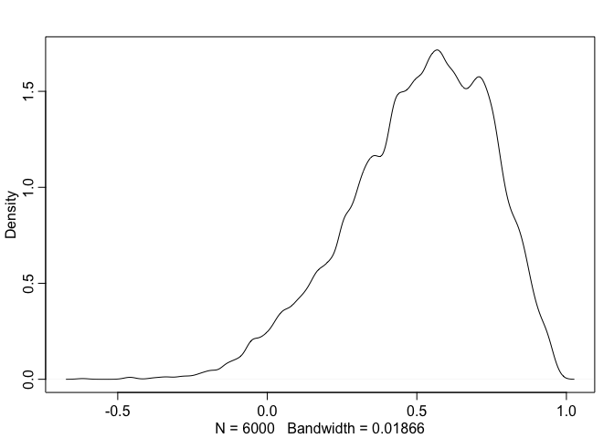
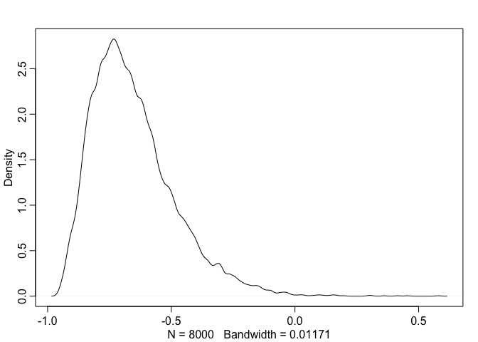
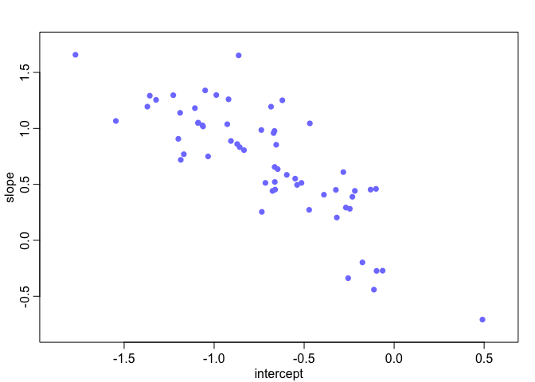

# Chapter-13-assignment-01
Ruijuan Li  
1/27/2017  


```r
# 13E1 add to the the following model varying slopes on the predictor x. 
# see attached figure 
```


```r
# 13E2. Think up a context in which varying intercepts will be positively correlated with varying slopes. Provide a mechanistic explanation for the correlation. 

# higher intercept with a higer slope... don't have a good example now... come back later... 
```


```r
# Repeat the café robot simulation from the beginning of the chapter. This time, set rho to zero, so that there is no correlation between intercepts and slopes. How does the posterior distribution of the correlation reflect this change in the underlying simulation? 

library(rethinking)
```

```
## Loading required package: rstan
```

```
## Warning: package 'rstan' was built under R version 3.2.5
```

```
## Loading required package: ggplot2
```

```
## Warning: package 'ggplot2' was built under R version 3.2.5
```

```
## Loading required package: StanHeaders
```

```
## Warning: package 'StanHeaders' was built under R version 3.2.5
```

```
## rstan (Version 2.14.1, packaged: 2016-12-28 14:55:41 UTC, GitRev: 5fa1e80eb817)
```

```
## For execution on a local, multicore CPU with excess RAM we recommend calling
## rstan_options(auto_write = TRUE)
## options(mc.cores = parallel::detectCores())
```

```
## Loading required package: parallel
```

```
## rethinking (Version 1.59)
```

```r
# simulate data 

a <- 3.5 # average morning wait time
b <- (-1) # average difference afternnon wait time
sigma_a <- 1 # std dev in intercepts
sigma_b <- 0.5 # std dev in slopes
rho <- 0 # correlation between intercepts and slopes

Mu <- c(a, b)

cov_ab <- sigma_a*sigma_b*rho
Sigma <- matrix(c(sigma_a^2, cov_ab, cov_ab, sigma_b^2), ncol = 2)
matrix(c(1,2,3,4), nrow = 2, ncol = 2)
```

```
##      [,1] [,2]
## [1,]    1    3
## [2,]    2    4
```

```r
N_cafes <- 20 # number of cafes 

library(MASS)
set.seed(5) # used to replicate examples
vary_effects <- mvrnorm(N_cafes, Mu, Sigma)
vary_effects
```

```
##           [,1]          [,2]
##  [1,] 4.340855 -1.4502559727
##  [2,] 2.115641 -1.4709346969
##  [3,] 4.755492 -1.7339809517
##  [4,] 3.429857 -1.3533805448
##  [5,] 1.788559 -1.4095044651
##  [6,] 4.102908 -0.8532590756
##  [7,] 3.972166 -1.7092945362
##  [8,] 4.135371 -1.7493869137
##  [9,] 3.785774 -0.6714589528
## [10,] 3.361892 -0.5736022800
## [11,] 2.272370 -1.1579575192
## [12,] 4.301779 -1.5548470838
## [13,] 4.580393 -2.1077302858
## [14,] 3.657534 -1.6085518195
## [15,] 4.571760 -1.7396108933
## [16,] 3.638986 -1.4757869162
## [17,] 4.097313 -0.4952336770
## [18,] 5.683967  0.0002363693
## [19,] 3.259183 -0.1189070638
## [20,] 3.759355 -0.9286959370
```

```r
a_cafe <- vary_effects[,1]
b_cafe <- vary_effects[,2]

# simulate robot visit to cafes and collecting data 
N_visits <- 10 # number of visit 
afternoon <- rep(0:1, N_visits*N_cafes/2) # robot visit to cafes, 20 in total, 10 visit to each, 1 indicate
# in the afternoon, 0 indicate in the morning. 
length(afternoon) # 200 
```

```
## [1] 200
```

```r
cafe_id <- rep(1:N_cafes, each=N_visits) # repeat 10 times of each cafe 

mu <- a_cafe[cafe_id] + b_cafe[cafe_id]*afternoon # generate average waiting time for each cafe? 
# what this code is doing? 
sigma <- 0.5 # std dev within cafes 
wait <- rnorm(N_visits*N_cafes, mu, sigma) # simulate wait time based using mu and sigma 
d <- data.frame(cafe=cafe_id, afternoon=afternoon, wait=wait) # make this into a dataframe

# model 
m13M1 <- map2stan(
  alist(
    wait ~ dnorm(mu, sigma), # likelihood
    mu <- a_cafe[cafe] + b_cafe[cafe]*afternoon, # linear model
    c(a_cafe,b_cafe)[cafe] ~ dmvnorm2(c(a,b), sigma_cafe, Rho), # population of varying effects, don't quite
    # understand this code, where is the covariance matrix??? 
    a ~ dnorm(0, 10), 
    b ~ dnorm(0, 10), 
    sigma_cafe ~ dcauchy(0, 2), 
    sigma ~ dcauchy(0, 2), 
    Rho ~ dlkjcorr(1) # prior for covariance 
  ), 
  data = d, 
  iter = 5000, warmup = 2000, chains = 2)
```

```
## In file included from file13c866189cd.cpp:8:
## In file included from /Library/Frameworks/R.framework/Versions/3.2/Resources/library/StanHeaders/include/src/stan/model/model_header.hpp:4:
## In file included from /Library/Frameworks/R.framework/Versions/3.2/Resources/library/StanHeaders/include/stan/math.hpp:4:
## In file included from /Library/Frameworks/R.framework/Versions/3.2/Resources/library/StanHeaders/include/stan/math/rev/mat.hpp:4:
## In file included from /Library/Frameworks/R.framework/Versions/3.2/Resources/library/StanHeaders/include/stan/math/rev/core.hpp:12:
## In file included from /Library/Frameworks/R.framework/Versions/3.2/Resources/library/StanHeaders/include/stan/math/rev/core/gevv_vvv_vari.hpp:5:
## In file included from /Library/Frameworks/R.framework/Versions/3.2/Resources/library/StanHeaders/include/stan/math/rev/core/var.hpp:7:
## In file included from /Library/Frameworks/R.framework/Versions/3.2/Resources/library/BH/include/boost/math/tools/config.hpp:13:
## In file included from /Library/Frameworks/R.framework/Versions/3.2/Resources/library/BH/include/boost/config.hpp:39:
## /Library/Frameworks/R.framework/Versions/3.2/Resources/library/BH/include/boost/config/compiler/clang.hpp:196:11: warning: 'BOOST_NO_CXX11_RVALUE_REFERENCES' macro redefined [-Wmacro-redefined]
## #  define BOOST_NO_CXX11_RVALUE_REFERENCES
##           ^
## <command line>:6:9: note: previous definition is here
## #define BOOST_NO_CXX11_RVALUE_REFERENCES 1
##         ^
## In file included from file13c866189cd.cpp:8:
## In file included from /Library/Frameworks/R.framework/Versions/3.2/Resources/library/StanHeaders/include/src/stan/model/model_header.hpp:4:
## In file included from /Library/Frameworks/R.framework/Versions/3.2/Resources/library/StanHeaders/include/stan/math.hpp:4:
## In file included from /Library/Frameworks/R.framework/Versions/3.2/Resources/library/StanHeaders/include/stan/math/rev/mat.hpp:4:
## In file included from /Library/Frameworks/R.framework/Versions/3.2/Resources/library/StanHeaders/include/stan/math/rev/core.hpp:42:
## /Library/Frameworks/R.framework/Versions/3.2/Resources/library/StanHeaders/include/stan/math/rev/core/set_zero_all_adjoints.hpp:14:17: warning: unused function 'set_zero_all_adjoints' [-Wunused-function]
##     static void set_zero_all_adjoints() {
##                 ^
## In file included from file13c866189cd.cpp:8:
## In file included from /Library/Frameworks/R.framework/Versions/3.2/Resources/library/StanHeaders/include/src/stan/model/model_header.hpp:4:
## In file included from /Library/Frameworks/R.framework/Versions/3.2/Resources/library/StanHeaders/include/stan/math.hpp:4:
## In file included from /Library/Frameworks/R.framework/Versions/3.2/Resources/library/StanHeaders/include/stan/math/rev/mat.hpp:4:
## In file included from /Library/Frameworks/R.framework/Versions/3.2/Resources/library/StanHeaders/include/stan/math/rev/core.hpp:43:
## /Library/Frameworks/R.framework/Versions/3.2/Resources/library/StanHeaders/include/stan/math/rev/core/set_zero_all_adjoints_nested.hpp:17:17: warning: 'static' function 'set_zero_all_adjoints_nested' declared in header file should be declared 'static inline' [-Wunneeded-internal-declaration]
##     static void set_zero_all_adjoints_nested() {
##                 ^
## In file included from file13c866189cd.cpp:8:
## In file included from /Library/Frameworks/R.framework/Versions/3.2/Resources/library/StanHeaders/include/src/stan/model/model_header.hpp:4:
## In file included from /Library/Frameworks/R.framework/Versions/3.2/Resources/library/StanHeaders/include/stan/math.hpp:4:
## In file included from /Library/Frameworks/R.framework/Versions/3.2/Resources/library/StanHeaders/include/stan/math/rev/mat.hpp:11:
## In file included from /Library/Frameworks/R.framework/Versions/3.2/Resources/library/StanHeaders/include/stan/math/prim/mat.hpp:60:
## /Library/Frameworks/R.framework/Versions/3.2/Resources/library/StanHeaders/include/stan/math/prim/mat/fun/autocorrelation.hpp:17:14: warning: function 'fft_next_good_size' is not needed and will not be emitted [-Wunneeded-internal-declaration]
##       size_t fft_next_good_size(size_t N) {
##              ^
## In file included from file13c866189cd.cpp:8:
## In file included from /Library/Frameworks/R.framework/Versions/3.2/Resources/library/StanHeaders/include/src/stan/model/model_header.hpp:4:
## In file included from /Library/Frameworks/R.framework/Versions/3.2/Resources/library/StanHeaders/include/stan/math.hpp:4:
## In file included from /Library/Frameworks/R.framework/Versions/3.2/Resources/library/StanHeaders/include/stan/math/rev/mat.hpp:11:
## In file included from /Library/Frameworks/R.framework/Versions/3.2/Resources/library/StanHeaders/include/stan/math/prim/mat.hpp:299:
## In file included from /Library/Frameworks/R.framework/Versions/3.2/Resources/library/StanHeaders/include/stan/math/prim/arr.hpp:36:
## In file included from /Library/Frameworks/R.framework/Versions/3.2/Resources/library/StanHeaders/include/stan/math/prim/arr/functor/integrate_ode_rk45.hpp:13:
## In file included from /Library/Frameworks/R.framework/Versions/3.2/Resources/library/BH/include/boost/numeric/odeint.hpp:61:
## In file included from /Library/Frameworks/R.framework/Versions/3.2/Resources/library/BH/include/boost/numeric/odeint/util/multi_array_adaption.hpp:29:
## In file included from /Library/Frameworks/R.framework/Versions/3.2/Resources/library/BH/include/boost/multi_array.hpp:21:
## In file included from /Library/Frameworks/R.framework/Versions/3.2/Resources/library/BH/include/boost/multi_array/base.hpp:28:
## /Library/Frameworks/R.framework/Versions/3.2/Resources/library/BH/include/boost/multi_array/concept_checks.hpp:42:43: warning: unused typedef 'index_range' [-Wunused-local-typedef]
##       typedef typename Array::index_range index_range;
##                                           ^
## /Library/Frameworks/R.framework/Versions/3.2/Resources/library/BH/include/boost/multi_array/concept_checks.hpp:43:37: warning: unused typedef 'index' [-Wunused-local-typedef]
##       typedef typename Array::index index;
##                                     ^
## /Library/Frameworks/R.framework/Versions/3.2/Resources/library/BH/include/boost/multi_array/concept_checks.hpp:53:43: warning: unused typedef 'index_range' [-Wunused-local-typedef]
##       typedef typename Array::index_range index_range;
##                                           ^
## /Library/Frameworks/R.framework/Versions/3.2/Resources/library/BH/include/boost/multi_array/concept_checks.hpp:54:37: warning: unused typedef 'index' [-Wunused-local-typedef]
##       typedef typename Array::index index;
##                                     ^
## 8 warnings generated.
## 
## SAMPLING FOR MODEL 'wait ~ dnorm(mu, sigma)' NOW (CHAIN 1).
## 
## Chain 1, Iteration:    1 / 5000 [  0%]  (Warmup)
## Chain 1, Iteration:  500 / 5000 [ 10%]  (Warmup)
## Chain 1, Iteration: 1000 / 5000 [ 20%]  (Warmup)
## Chain 1, Iteration: 1500 / 5000 [ 30%]  (Warmup)
## Chain 1, Iteration: 2000 / 5000 [ 40%]  (Warmup)
## Chain 1, Iteration: 2001 / 5000 [ 40%]  (Sampling)
## Chain 1, Iteration: 2500 / 5000 [ 50%]  (Sampling)
## Chain 1, Iteration: 3000 / 5000 [ 60%]  (Sampling)
## Chain 1, Iteration: 3500 / 5000 [ 70%]  (Sampling)
## Chain 1, Iteration: 4000 / 5000 [ 80%]  (Sampling)
## Chain 1, Iteration: 4500 / 5000 [ 90%]  (Sampling)
## Chain 1, Iteration: 5000 / 5000 [100%]  (Sampling)
##  Elapsed Time: 1.97332 seconds (Warm-up)
##                2.67126 seconds (Sampling)
##                4.64458 seconds (Total)
```

```
## The following numerical problems occured the indicated number of times on chain 1
```

```
##                                                                        count
## Exception thrown at line 33: lkj_corr_log: y is not positive definite.     1
```

```
## When a numerical problem occurs, the Hamiltonian proposal gets rejected.
```

```
## See http://mc-stan.org/misc/warnings.html#exception-hamiltonian-proposal-rejected
```

```
## If the number in the 'count' column is small, do not ask about this message on stan-users.
```

```
## 
## SAMPLING FOR MODEL 'wait ~ dnorm(mu, sigma)' NOW (CHAIN 2).
## 
## Chain 2, Iteration:    1 / 5000 [  0%]  (Warmup)
## Chain 2, Iteration:  500 / 5000 [ 10%]  (Warmup)
## Chain 2, Iteration: 1000 / 5000 [ 20%]  (Warmup)
## Chain 2, Iteration: 1500 / 5000 [ 30%]  (Warmup)
## Chain 2, Iteration: 2000 / 5000 [ 40%]  (Warmup)
## Chain 2, Iteration: 2001 / 5000 [ 40%]  (Sampling)
## Chain 2, Iteration: 2500 / 5000 [ 50%]  (Sampling)
## Chain 2, Iteration: 3000 / 5000 [ 60%]  (Sampling)
## Chain 2, Iteration: 3500 / 5000 [ 70%]  (Sampling)
## Chain 2, Iteration: 4000 / 5000 [ 80%]  (Sampling)
## Chain 2, Iteration: 4500 / 5000 [ 90%]  (Sampling)
## Chain 2, Iteration: 5000 / 5000 [100%]  (Sampling)
##  Elapsed Time: 1.83404 seconds (Warm-up)
##                2.17964 seconds (Sampling)
##                4.01368 seconds (Total)
```

```
## The following numerical problems occured the indicated number of times on chain 2
```

```
##                                                                        count
## Exception thrown at line 33: lkj_corr_log: y is not positive definite.     1
```

```
## When a numerical problem occurs, the Hamiltonian proposal gets rejected.
```

```
## See http://mc-stan.org/misc/warnings.html#exception-hamiltonian-proposal-rejected
```

```
## If the number in the 'count' column is small, do not ask about this message on stan-users.
```

```
## Warning: There were 13 divergent transitions after warmup. Increasing adapt_delta above 0.8 may help. See
## http://mc-stan.org/misc/warnings.html#divergent-transitions-after-warmup
```

```
## Warning: Examine the pairs() plot to diagnose sampling problems
```

```
## 
## SAMPLING FOR MODEL 'wait ~ dnorm(mu, sigma)' NOW (CHAIN 1).
## WARNING: No variance estimation is
##          performed for num_warmup < 20
## 
## 
## Chain 1, Iteration: 1 / 1 [100%]  (Sampling)
##  Elapsed Time: 5e-06 seconds (Warm-up)
##                0.000129 seconds (Sampling)
##                0.000134 seconds (Total)
```

```
## Computing WAIC
```

```
## Constructing posterior predictions
```

```
## [ 600 / 6000 ]
[ 1200 / 6000 ]
[ 1800 / 6000 ]
[ 2400 / 6000 ]
[ 3000 / 6000 ]
[ 3600 / 6000 ]
[ 4200 / 6000 ]
[ 4800 / 6000 ]
[ 5400 / 6000 ]
[ 6000 / 6000 ]
```

```
## Warning in map2stan(alist(wait ~ dnorm(mu, sigma), mu <- a_cafe[cafe] + : There were 13 divergent iterations during sampling.
## Check the chains (trace plots, n_eff, Rhat) carefully to ensure they are valid.
```

```r
# examine the posterior correlation between intercept and slopes 
precis(m13M1, depth = 2)
```

```
## Warning in precis(m13M1, depth = 2): There were 13 divergent iterations during sampling.
## Check the chains (trace plots, n_eff, Rhat) carefully to ensure they are valid.
```

```
##                Mean StdDev lower 0.89 upper 0.89 n_eff Rhat
## b_cafe[1]     -1.18   0.24      -1.60      -0.83  6000    1
## b_cafe[2]     -1.84   0.25      -2.23      -1.43  6000    1
## b_cafe[3]     -1.09   0.24      -1.47      -0.72  6000    1
## b_cafe[4]     -1.48   0.24      -1.87      -1.10  6000    1
## b_cafe[5]     -2.05   0.26      -2.47      -1.64  6000    1
## b_cafe[6]     -1.06   0.24      -1.47      -0.71  6000    1
## b_cafe[7]     -1.29   0.23      -1.65      -0.93  6000    1
## b_cafe[8]     -1.27   0.23      -1.62      -0.90  6000    1
## b_cafe[9]     -0.87   0.25      -1.28      -0.49  6000    1
## b_cafe[10]    -1.10   0.24      -1.49      -0.72  6000    1
## b_cafe[11]    -1.38   0.25      -1.77      -0.98  6000    1
## b_cafe[12]    -1.04   0.24      -1.41      -0.66  6000    1
## b_cafe[13]    -1.34   0.24      -1.73      -0.95  6000    1
## b_cafe[14]    -1.65   0.25      -2.03      -1.23  6000    1
## b_cafe[15]    -1.63   0.28      -2.09      -1.19  2726    1
## b_cafe[16]    -1.21   0.23      -1.58      -0.84  6000    1
## b_cafe[17]    -0.72   0.25      -1.12      -0.33  6000    1
## b_cafe[18]    -0.21   0.27      -0.64       0.23  6000    1
## b_cafe[19]    -0.78   0.27      -1.23      -0.36  3554    1
## b_cafe[20]    -0.85   0.25      -1.25      -0.47  6000    1
## a_cafe[1]      4.22   0.18       3.93       4.51  6000    1
## a_cafe[2]      2.43   0.19       2.12       2.74  6000    1
## a_cafe[3]      4.15   0.19       3.87       4.46  6000    1
## a_cafe[4]      3.54   0.18       3.25       3.83  6000    1
## a_cafe[5]      2.20   0.19       1.89       2.51  6000    1
## a_cafe[6]      4.27   0.18       3.98       4.56  6000    1
## a_cafe[7]      3.72   0.18       3.42       4.00  6000    1
## a_cafe[8]      3.97   0.18       3.69       4.25  6000    1
## a_cafe[9]      3.82   0.19       3.50       4.11  6000    1
## a_cafe[10]     3.61   0.19       3.31       3.90  6000    1
## a_cafe[11]     2.42   0.19       2.12       2.73  6000    1
## a_cafe[12]     4.20   0.18       3.90       4.48  6000    1
## a_cafe[13]     4.15   0.19       3.84       4.43  6000    1
## a_cafe[14]     3.51   0.19       3.22       3.82  6000    1
## a_cafe[15]     4.50   0.21       4.18       4.83  6000    1
## a_cafe[16]     3.67   0.18       3.38       3.97  6000    1
## a_cafe[17]     4.32   0.19       4.04       4.64  6000    1
## a_cafe[18]     5.97   0.20       5.63       6.27  6000    1
## a_cafe[19]     3.30   0.20       2.97       3.61  6000    1
## a_cafe[20]     3.85   0.19       3.55       4.15  6000    1
## a              3.79   0.21       3.47       4.13  6000    1
## b             -1.20   0.14      -1.42      -0.98  6000    1
## sigma_cafe[1]  0.91   0.17       0.64       1.16  6000    1
## sigma_cafe[2]  0.52   0.13       0.32       0.71  3299    1
## sigma          0.49   0.03       0.44       0.53  6000    1
## Rho[1,1]       1.00   0.00       1.00       1.00  6000  NaN
## Rho[1,2]       0.50   0.24       0.15       0.88  2593    1
## Rho[2,1]       0.50   0.24       0.15       0.88  2593    1
## Rho[2,2]       1.00   0.00       1.00       1.00  6000    1
```

```r
post <- extract.samples(m13M1)
dens(post$Rho[,1,2]) 
```

<!-- -->

```r
# why a positive correlation from the posterior? used the same code as in the book, except that I changed Rho=0, and Rho prior to 1. don't understand... 
```


```r
# 13M2. Fit this multilevel model to the simulated café data: Use WAIC to compare this model to the model from the chapter, the one that uses a multi-variate Gaussian prior. Explain the result. 

# simulate data, back to Rho=0.7 
a <- 3.5 # average morning wait time
b <- (-1) # average difference afternnon wait time
sigma_a <- 1 # std dev in intercepts
sigma_b <- 0.5 # std dev in slopes
rho <- 0.7 # correlation between intercepts and slopes

Mu <- c(a, b)

cov_ab <- sigma_a*sigma_b*rho
Sigma <- matrix(c(sigma_a^2, cov_ab, cov_ab, sigma_b^2), ncol = 2)
matrix(c(1,2,3,4), nrow = 2, ncol = 2)
```

```
##      [,1] [,2]
## [1,]    1    3
## [2,]    2    4
```

```r
N_cafes <- 20 # number of cafes 

library(MASS)
set.seed(5) # used to replicate examples
vary_effects <- mvrnorm(N_cafes, Mu, Sigma)
vary_effects
```

```
##           [,1]       [,2]
##  [1,] 4.445032 -0.9515005
##  [2,] 2.241720 -1.8348448
##  [3,] 4.926185 -0.9660116
##  [4,] 3.517140 -1.2475311
##  [5,] 1.902031 -1.9245334
##  [6,] 4.062325 -0.6727597
##  [7,] 4.142723 -1.2570596
##  [8,] 4.314536 -1.2181871
##  [9,] 3.702958 -0.6835884
## [10,] 3.258259 -0.7884565
## [11,] 2.320430 -1.5786067
## [12,] 4.431927 -1.0319278
## [13,] 4.844162 -1.2672859
## [14,] 3.805738 -1.3173936
## [15,] 4.745225 -1.0413907
## [16,] 3.754737 -1.2419607
## [17,] 3.968880 -0.4519629
## [18,] 5.421901  0.4772970
## [19,] 3.044702 -0.5454411
## [20,] 3.739890 -0.8541351
```

```r
a_cafe <- vary_effects[,1]
b_cafe <- vary_effects[,2]

# simulate robot visit to cafes and collecting data 
N_visits <- 10 # number of visit 
afternoon <- rep(0:1, N_visits*N_cafes/2) # robot visit to cafes, 20 in total, 10 visit to each, 1 indicate
# in the afternoon, 0 indicate in the morning. 
length(afternoon) # 200 
```

```
## [1] 200
```

```r
cafe_id <- rep(1:N_cafes, each=N_visits) # repeat 10 times of each cafe 

mu <- a_cafe[cafe_id] + b_cafe[cafe_id]*afternoon # generate average waiting time for each cafe? 
# what this code is doing? 
sigma <- 0.5 # std dev within cafes 
wait <- rnorm(N_visits*N_cafes, mu, sigma) # simulate wait time based using mu and sigma 
d <- data.frame(cafe=cafe_id, afternoon=afternoon, wait=wait) # make this into a dataframe

# model in the book 
library(rethinking)
m13.1 <- map2stan(
  alist(
    wait ~ dnorm(mu, sigma), # likelihood
    mu <- a_cafe[cafe] + b_cafe[cafe]*afternoon, # linear model
    c(a_cafe,b_cafe)[cafe] ~ dmvnorm2(c(a,b), sigma_cafe, Rho), # population of varying effects, don't quite
    # understand this code, where is the covariance matrix??? 
    a ~ dnorm(0, 10), 
    b ~ dnorm(0, 10), 
    sigma_cafe ~ dcauchy(0, 2), 
    sigma ~ dcauchy(0, 2), 
    Rho ~ dlkjcorr(2) # prior for covariance 
  ), 
  data = d, 
  iter = 5000, warmup = 2000, chains = 2)
```

```
## In file included from file13c86954e1fb.cpp:8:
## In file included from /Library/Frameworks/R.framework/Versions/3.2/Resources/library/StanHeaders/include/src/stan/model/model_header.hpp:4:
## In file included from /Library/Frameworks/R.framework/Versions/3.2/Resources/library/StanHeaders/include/stan/math.hpp:4:
## In file included from /Library/Frameworks/R.framework/Versions/3.2/Resources/library/StanHeaders/include/stan/math/rev/mat.hpp:4:
## In file included from /Library/Frameworks/R.framework/Versions/3.2/Resources/library/StanHeaders/include/stan/math/rev/core.hpp:12:
## In file included from /Library/Frameworks/R.framework/Versions/3.2/Resources/library/StanHeaders/include/stan/math/rev/core/gevv_vvv_vari.hpp:5:
## In file included from /Library/Frameworks/R.framework/Versions/3.2/Resources/library/StanHeaders/include/stan/math/rev/core/var.hpp:7:
## In file included from /Library/Frameworks/R.framework/Versions/3.2/Resources/library/BH/include/boost/math/tools/config.hpp:13:
## In file included from /Library/Frameworks/R.framework/Versions/3.2/Resources/library/BH/include/boost/config.hpp:39:
## /Library/Frameworks/R.framework/Versions/3.2/Resources/library/BH/include/boost/config/compiler/clang.hpp:196:11: warning: 'BOOST_NO_CXX11_RVALUE_REFERENCES' macro redefined [-Wmacro-redefined]
## #  define BOOST_NO_CXX11_RVALUE_REFERENCES
##           ^
## <command line>:6:9: note: previous definition is here
## #define BOOST_NO_CXX11_RVALUE_REFERENCES 1
##         ^
## In file included from file13c86954e1fb.cpp:8:
## In file included from /Library/Frameworks/R.framework/Versions/3.2/Resources/library/StanHeaders/include/src/stan/model/model_header.hpp:4:
## In file included from /Library/Frameworks/R.framework/Versions/3.2/Resources/library/StanHeaders/include/stan/math.hpp:4:
## In file included from /Library/Frameworks/R.framework/Versions/3.2/Resources/library/StanHeaders/include/stan/math/rev/mat.hpp:4:
## In file included from /Library/Frameworks/R.framework/Versions/3.2/Resources/library/StanHeaders/include/stan/math/rev/core.hpp:42:
## /Library/Frameworks/R.framework/Versions/3.2/Resources/library/StanHeaders/include/stan/math/rev/core/set_zero_all_adjoints.hpp:14:17: warning: unused function 'set_zero_all_adjoints' [-Wunused-function]
##     static void set_zero_all_adjoints() {
##                 ^
## In file included from file13c86954e1fb.cpp:8:
## In file included from /Library/Frameworks/R.framework/Versions/3.2/Resources/library/StanHeaders/include/src/stan/model/model_header.hpp:4:
## In file included from /Library/Frameworks/R.framework/Versions/3.2/Resources/library/StanHeaders/include/stan/math.hpp:4:
## In file included from /Library/Frameworks/R.framework/Versions/3.2/Resources/library/StanHeaders/include/stan/math/rev/mat.hpp:4:
## In file included from /Library/Frameworks/R.framework/Versions/3.2/Resources/library/StanHeaders/include/stan/math/rev/core.hpp:43:
## /Library/Frameworks/R.framework/Versions/3.2/Resources/library/StanHeaders/include/stan/math/rev/core/set_zero_all_adjoints_nested.hpp:17:17: warning: 'static' function 'set_zero_all_adjoints_nested' declared in header file should be declared 'static inline' [-Wunneeded-internal-declaration]
##     static void set_zero_all_adjoints_nested() {
##                 ^
## In file included from file13c86954e1fb.cpp:8:
## In file included from /Library/Frameworks/R.framework/Versions/3.2/Resources/library/StanHeaders/include/src/stan/model/model_header.hpp:4:
## In file included from /Library/Frameworks/R.framework/Versions/3.2/Resources/library/StanHeaders/include/stan/math.hpp:4:
## In file included from /Library/Frameworks/R.framework/Versions/3.2/Resources/library/StanHeaders/include/stan/math/rev/mat.hpp:11:
## In file included from /Library/Frameworks/R.framework/Versions/3.2/Resources/library/StanHeaders/include/stan/math/prim/mat.hpp:60:
## /Library/Frameworks/R.framework/Versions/3.2/Resources/library/StanHeaders/include/stan/math/prim/mat/fun/autocorrelation.hpp:17:14: warning: function 'fft_next_good_size' is not needed and will not be emitted [-Wunneeded-internal-declaration]
##       size_t fft_next_good_size(size_t N) {
##              ^
## In file included from file13c86954e1fb.cpp:8:
## In file included from /Library/Frameworks/R.framework/Versions/3.2/Resources/library/StanHeaders/include/src/stan/model/model_header.hpp:4:
## In file included from /Library/Frameworks/R.framework/Versions/3.2/Resources/library/StanHeaders/include/stan/math.hpp:4:
## In file included from /Library/Frameworks/R.framework/Versions/3.2/Resources/library/StanHeaders/include/stan/math/rev/mat.hpp:11:
## In file included from /Library/Frameworks/R.framework/Versions/3.2/Resources/library/StanHeaders/include/stan/math/prim/mat.hpp:299:
## In file included from /Library/Frameworks/R.framework/Versions/3.2/Resources/library/StanHeaders/include/stan/math/prim/arr.hpp:36:
## In file included from /Library/Frameworks/R.framework/Versions/3.2/Resources/library/StanHeaders/include/stan/math/prim/arr/functor/integrate_ode_rk45.hpp:13:
## In file included from /Library/Frameworks/R.framework/Versions/3.2/Resources/library/BH/include/boost/numeric/odeint.hpp:61:
## In file included from /Library/Frameworks/R.framework/Versions/3.2/Resources/library/BH/include/boost/numeric/odeint/util/multi_array_adaption.hpp:29:
## In file included from /Library/Frameworks/R.framework/Versions/3.2/Resources/library/BH/include/boost/multi_array.hpp:21:
## In file included from /Library/Frameworks/R.framework/Versions/3.2/Resources/library/BH/include/boost/multi_array/base.hpp:28:
## /Library/Frameworks/R.framework/Versions/3.2/Resources/library/BH/include/boost/multi_array/concept_checks.hpp:42:43: warning: unused typedef 'index_range' [-Wunused-local-typedef]
##       typedef typename Array::index_range index_range;
##                                           ^
## /Library/Frameworks/R.framework/Versions/3.2/Resources/library/BH/include/boost/multi_array/concept_checks.hpp:43:37: warning: unused typedef 'index' [-Wunused-local-typedef]
##       typedef typename Array::index index;
##                                     ^
## /Library/Frameworks/R.framework/Versions/3.2/Resources/library/BH/include/boost/multi_array/concept_checks.hpp:53:43: warning: unused typedef 'index_range' [-Wunused-local-typedef]
##       typedef typename Array::index_range index_range;
##                                           ^
## /Library/Frameworks/R.framework/Versions/3.2/Resources/library/BH/include/boost/multi_array/concept_checks.hpp:54:37: warning: unused typedef 'index' [-Wunused-local-typedef]
##       typedef typename Array::index index;
##                                     ^
## 8 warnings generated.
## 
## SAMPLING FOR MODEL 'wait ~ dnorm(mu, sigma)' NOW (CHAIN 1).
## 
## Chain 1, Iteration:    1 / 5000 [  0%]  (Warmup)
## Chain 1, Iteration:  500 / 5000 [ 10%]  (Warmup)
## Chain 1, Iteration: 1000 / 5000 [ 20%]  (Warmup)
## Chain 1, Iteration: 1500 / 5000 [ 30%]  (Warmup)
## Chain 1, Iteration: 2000 / 5000 [ 40%]  (Warmup)
## Chain 1, Iteration: 2001 / 5000 [ 40%]  (Sampling)
## Chain 1, Iteration: 2500 / 5000 [ 50%]  (Sampling)
## Chain 1, Iteration: 3000 / 5000 [ 60%]  (Sampling)
## Chain 1, Iteration: 3500 / 5000 [ 70%]  (Sampling)
## Chain 1, Iteration: 4000 / 5000 [ 80%]  (Sampling)
## Chain 1, Iteration: 4500 / 5000 [ 90%]  (Sampling)
## Chain 1, Iteration: 5000 / 5000 [100%]  (Sampling)
##  Elapsed Time: 1.73243 seconds (Warm-up)
##                2.83417 seconds (Sampling)
##                4.5666 seconds (Total)
## 
## 
## SAMPLING FOR MODEL 'wait ~ dnorm(mu, sigma)' NOW (CHAIN 2).
## 
## Chain 2, Iteration:    1 / 5000 [  0%]  (Warmup)
## Chain 2, Iteration:  500 / 5000 [ 10%]  (Warmup)
## Chain 2, Iteration: 1000 / 5000 [ 20%]  (Warmup)
## Chain 2, Iteration: 1500 / 5000 [ 30%]  (Warmup)
## Chain 2, Iteration: 2000 / 5000 [ 40%]  (Warmup)
## Chain 2, Iteration: 2001 / 5000 [ 40%]  (Sampling)
## Chain 2, Iteration: 2500 / 5000 [ 50%]  (Sampling)
## Chain 2, Iteration: 3000 / 5000 [ 60%]  (Sampling)
## Chain 2, Iteration: 3500 / 5000 [ 70%]  (Sampling)
## Chain 2, Iteration: 4000 / 5000 [ 80%]  (Sampling)
## Chain 2, Iteration: 4500 / 5000 [ 90%]  (Sampling)
## Chain 2, Iteration: 5000 / 5000 [100%]  (Sampling)
##  Elapsed Time: 1.66055 seconds (Warm-up)
##                2.86922 seconds (Sampling)
##                4.52977 seconds (Total)
```

```
## Warning: There were 45 divergent transitions after warmup. Increasing adapt_delta above 0.8 may help. See
## http://mc-stan.org/misc/warnings.html#divergent-transitions-after-warmup
```

```
## Warning: Examine the pairs() plot to diagnose sampling problems
```

```
## 
## SAMPLING FOR MODEL 'wait ~ dnorm(mu, sigma)' NOW (CHAIN 1).
## WARNING: No variance estimation is
##          performed for num_warmup < 20
## 
## 
## Chain 1, Iteration: 1 / 1 [100%]  (Sampling)
##  Elapsed Time: 4e-06 seconds (Warm-up)
##                0.00019 seconds (Sampling)
##                0.000194 seconds (Total)
```

```
## Computing WAIC
```

```
## Constructing posterior predictions
```

```
## [ 600 / 6000 ]
[ 1200 / 6000 ]
[ 1800 / 6000 ]
[ 2400 / 6000 ]
[ 3000 / 6000 ]
[ 3600 / 6000 ]
[ 4200 / 6000 ]
[ 4800 / 6000 ]
[ 5400 / 6000 ]
[ 6000 / 6000 ]
```

```
## Warning in map2stan(alist(wait ~ dnorm(mu, sigma), mu <- a_cafe[cafe] + : There were 45 divergent iterations during sampling.
## Check the chains (trace plots, n_eff, Rhat) carefully to ensure they are valid.
```

```r
precis(m13.1, depth = 2)
```

```
## Warning in precis(m13.1, depth = 2): There were 45 divergent iterations during sampling.
## Check the chains (trace plots, n_eff, Rhat) carefully to ensure they are valid.
```

```
##                Mean StdDev lower 0.89 upper 0.89 n_eff Rhat
## b_cafe[1]     -0.74   0.22      -1.11      -0.41  6000    1
## b_cafe[2]     -2.10   0.24      -2.50      -1.72  6000    1
## b_cafe[3]     -0.47   0.23      -0.84      -0.11  6000    1
## b_cafe[4]     -1.35   0.23      -1.69      -0.99  6000    1
## b_cafe[5]     -2.44   0.26      -2.85      -2.04  6000    1
## b_cafe[6]     -0.84   0.22      -1.21      -0.50  6000    1
## b_cafe[7]     -0.90   0.22      -1.27      -0.56  6000    1
## b_cafe[8]     -0.80   0.22      -1.16      -0.47  6000    1
## b_cafe[9]     -0.85   0.23      -1.22      -0.48  6000    1
## b_cafe[10]    -1.23   0.22      -1.57      -0.87  6000    1
## b_cafe[11]    -1.73   0.24      -2.10      -1.34  6000    1
## b_cafe[12]    -0.59   0.23      -0.93      -0.20  6000    1
## b_cafe[13]    -0.65   0.23      -1.00      -0.28  6000    1
## b_cafe[14]    -1.39   0.23      -1.74      -1.03  6000    1
## b_cafe[15]    -0.99   0.26      -1.40      -0.58  6000    1
## b_cafe[16]    -0.99   0.22      -1.34      -0.63  6000    1
## b_cafe[17]    -0.62   0.23      -0.99      -0.26  6000    1
## b_cafe[18]     0.30   0.25      -0.09       0.69  6000    1
## b_cafe[19]    -1.12   0.25      -1.54      -0.75  6000    1
## b_cafe[20]    -0.76   0.23      -1.15      -0.42  6000    1
## a_cafe[1]      4.34   0.17       4.05       4.60  6000    1
## a_cafe[2]      2.49   0.18       2.20       2.77  6000    1
## a_cafe[3]      4.41   0.17       4.14       4.68  6000    1
## a_cafe[4]      3.61   0.17       3.36       3.89  6000    1
## a_cafe[5]      2.22   0.19       1.90       2.49  6000    1
## a_cafe[6]      4.21   0.17       3.95       4.47  6000    1
## a_cafe[7]      3.93   0.17       3.68       4.22  6000    1
## a_cafe[8]      4.18   0.17       3.90       4.44  6000    1
## a_cafe[9]      3.73   0.17       3.46       4.01  6000    1
## a_cafe[10]     3.46   0.17       3.18       3.74  6000    1
## a_cafe[11]     2.44   0.18       2.14       2.72  6000    1
## a_cafe[12]     4.36   0.17       4.07       4.62  6000    1
## a_cafe[13]     4.49   0.17       4.21       4.75  6000    1
## a_cafe[14]     3.67   0.17       3.38       3.93  6000    1
## a_cafe[15]     4.69   0.19       4.37       4.98  6000    1
## a_cafe[16]     3.79   0.17       3.52       4.08  6000    1
## a_cafe[17]     4.18   0.17       3.89       4.45  6000    1
## a_cafe[18]     5.70   0.18       5.41       6.00  6000    1
## a_cafe[19]     3.06   0.18       2.77       3.36  6000    1
## a_cafe[20]     3.83   0.17       3.54       4.09  6000    1
## a              3.84   0.20       3.51       4.15  6000    1
## b             -1.01   0.16      -1.27      -0.76  6000    1
## sigma_cafe[1]  0.86   0.15       0.63       1.09  6000    1
## sigma_cafe[2]  0.65   0.13       0.44       0.83  4425    1
## sigma          0.48   0.03       0.44       0.52  6000    1
## Rho[1,1]       1.00   0.00       1.00       1.00  6000  NaN
## Rho[1,2]       0.75   0.15       0.55       0.97  2241    1
## Rho[2,1]       0.75   0.15       0.55       0.97  2241    1
## Rho[2,2]       1.00   0.00       1.00       1.00  5592    1
```

```r
m13M2 <- map2stan(
  alist(
    wait ~ dnorm(mu, sigma), # likelihood
    mu <- a_cafe[cafe] + b_cafe[cafe]*afternoon, # linear model
    a_cafe[cafe] ~ dnorm(a, sigma_a),
    b_cafe[cafe] ~ dnorm(b, sigma_b),
    a ~ dnorm(0, 10), 
    b ~ dnorm(0, 10), 
    sigma_a ~ dcauchy(0, 1),
    sigma_b ~ dcauchy(0, 1), 
    sigma ~ dcauchy(0, 1) 
    ), 
  data = d, 
  iter = 5000, warmup = 2000, chains = 2) 
```

```
## In file included from file13c845d3733c.cpp:8:
## In file included from /Library/Frameworks/R.framework/Versions/3.2/Resources/library/StanHeaders/include/src/stan/model/model_header.hpp:4:
## In file included from /Library/Frameworks/R.framework/Versions/3.2/Resources/library/StanHeaders/include/stan/math.hpp:4:
## In file included from /Library/Frameworks/R.framework/Versions/3.2/Resources/library/StanHeaders/include/stan/math/rev/mat.hpp:4:
## In file included from /Library/Frameworks/R.framework/Versions/3.2/Resources/library/StanHeaders/include/stan/math/rev/core.hpp:12:
## In file included from /Library/Frameworks/R.framework/Versions/3.2/Resources/library/StanHeaders/include/stan/math/rev/core/gevv_vvv_vari.hpp:5:
## In file included from /Library/Frameworks/R.framework/Versions/3.2/Resources/library/StanHeaders/include/stan/math/rev/core/var.hpp:7:
## In file included from /Library/Frameworks/R.framework/Versions/3.2/Resources/library/BH/include/boost/math/tools/config.hpp:13:
## In file included from /Library/Frameworks/R.framework/Versions/3.2/Resources/library/BH/include/boost/config.hpp:39:
## /Library/Frameworks/R.framework/Versions/3.2/Resources/library/BH/include/boost/config/compiler/clang.hpp:196:11: warning: 'BOOST_NO_CXX11_RVALUE_REFERENCES' macro redefined [-Wmacro-redefined]
## #  define BOOST_NO_CXX11_RVALUE_REFERENCES
##           ^
## <command line>:6:9: note: previous definition is here
## #define BOOST_NO_CXX11_RVALUE_REFERENCES 1
##         ^
## In file included from file13c845d3733c.cpp:8:
## In file included from /Library/Frameworks/R.framework/Versions/3.2/Resources/library/StanHeaders/include/src/stan/model/model_header.hpp:4:
## In file included from /Library/Frameworks/R.framework/Versions/3.2/Resources/library/StanHeaders/include/stan/math.hpp:4:
## In file included from /Library/Frameworks/R.framework/Versions/3.2/Resources/library/StanHeaders/include/stan/math/rev/mat.hpp:4:
## In file included from /Library/Frameworks/R.framework/Versions/3.2/Resources/library/StanHeaders/include/stan/math/rev/core.hpp:42:
## /Library/Frameworks/R.framework/Versions/3.2/Resources/library/StanHeaders/include/stan/math/rev/core/set_zero_all_adjoints.hpp:14:17: warning: unused function 'set_zero_all_adjoints' [-Wunused-function]
##     static void set_zero_all_adjoints() {
##                 ^
## In file included from file13c845d3733c.cpp:8:
## In file included from /Library/Frameworks/R.framework/Versions/3.2/Resources/library/StanHeaders/include/src/stan/model/model_header.hpp:4:
## In file included from /Library/Frameworks/R.framework/Versions/3.2/Resources/library/StanHeaders/include/stan/math.hpp:4:
## In file included from /Library/Frameworks/R.framework/Versions/3.2/Resources/library/StanHeaders/include/stan/math/rev/mat.hpp:4:
## In file included from /Library/Frameworks/R.framework/Versions/3.2/Resources/library/StanHeaders/include/stan/math/rev/core.hpp:43:
## /Library/Frameworks/R.framework/Versions/3.2/Resources/library/StanHeaders/include/stan/math/rev/core/set_zero_all_adjoints_nested.hpp:17:17: warning: 'static' function 'set_zero_all_adjoints_nested' declared in header file should be declared 'static inline' [-Wunneeded-internal-declaration]
##     static void set_zero_all_adjoints_nested() {
##                 ^
## In file included from file13c845d3733c.cpp:8:
## In file included from /Library/Frameworks/R.framework/Versions/3.2/Resources/library/StanHeaders/include/src/stan/model/model_header.hpp:4:
## In file included from /Library/Frameworks/R.framework/Versions/3.2/Resources/library/StanHeaders/include/stan/math.hpp:4:
## In file included from /Library/Frameworks/R.framework/Versions/3.2/Resources/library/StanHeaders/include/stan/math/rev/mat.hpp:11:
## In file included from /Library/Frameworks/R.framework/Versions/3.2/Resources/library/StanHeaders/include/stan/math/prim/mat.hpp:60:
## /Library/Frameworks/R.framework/Versions/3.2/Resources/library/StanHeaders/include/stan/math/prim/mat/fun/autocorrelation.hpp:17:14: warning: function 'fft_next_good_size' is not needed and will not be emitted [-Wunneeded-internal-declaration]
##       size_t fft_next_good_size(size_t N) {
##              ^
## In file included from file13c845d3733c.cpp:8:
## In file included from /Library/Frameworks/R.framework/Versions/3.2/Resources/library/StanHeaders/include/src/stan/model/model_header.hpp:4:
## In file included from /Library/Frameworks/R.framework/Versions/3.2/Resources/library/StanHeaders/include/stan/math.hpp:4:
## In file included from /Library/Frameworks/R.framework/Versions/3.2/Resources/library/StanHeaders/include/stan/math/rev/mat.hpp:11:
## In file included from /Library/Frameworks/R.framework/Versions/3.2/Resources/library/StanHeaders/include/stan/math/prim/mat.hpp:299:
## In file included from /Library/Frameworks/R.framework/Versions/3.2/Resources/library/StanHeaders/include/stan/math/prim/arr.hpp:36:
## In file included from /Library/Frameworks/R.framework/Versions/3.2/Resources/library/StanHeaders/include/stan/math/prim/arr/functor/integrate_ode_rk45.hpp:13:
## In file included from /Library/Frameworks/R.framework/Versions/3.2/Resources/library/BH/include/boost/numeric/odeint.hpp:61:
## In file included from /Library/Frameworks/R.framework/Versions/3.2/Resources/library/BH/include/boost/numeric/odeint/util/multi_array_adaption.hpp:29:
## In file included from /Library/Frameworks/R.framework/Versions/3.2/Resources/library/BH/include/boost/multi_array.hpp:21:
## In file included from /Library/Frameworks/R.framework/Versions/3.2/Resources/library/BH/include/boost/multi_array/base.hpp:28:
## /Library/Frameworks/R.framework/Versions/3.2/Resources/library/BH/include/boost/multi_array/concept_checks.hpp:42:43: warning: unused typedef 'index_range' [-Wunused-local-typedef]
##       typedef typename Array::index_range index_range;
##                                           ^
## /Library/Frameworks/R.framework/Versions/3.2/Resources/library/BH/include/boost/multi_array/concept_checks.hpp:43:37: warning: unused typedef 'index' [-Wunused-local-typedef]
##       typedef typename Array::index index;
##                                     ^
## /Library/Frameworks/R.framework/Versions/3.2/Resources/library/BH/include/boost/multi_array/concept_checks.hpp:53:43: warning: unused typedef 'index_range' [-Wunused-local-typedef]
##       typedef typename Array::index_range index_range;
##                                           ^
## /Library/Frameworks/R.framework/Versions/3.2/Resources/library/BH/include/boost/multi_array/concept_checks.hpp:54:37: warning: unused typedef 'index' [-Wunused-local-typedef]
##       typedef typename Array::index index;
##                                     ^
## 8 warnings generated.
## 
## SAMPLING FOR MODEL 'wait ~ dnorm(mu, sigma)' NOW (CHAIN 1).
## 
## Chain 1, Iteration:    1 / 5000 [  0%]  (Warmup)
## Chain 1, Iteration:  500 / 5000 [ 10%]  (Warmup)
## Chain 1, Iteration: 1000 / 5000 [ 20%]  (Warmup)
## Chain 1, Iteration: 1500 / 5000 [ 30%]  (Warmup)
## Chain 1, Iteration: 2000 / 5000 [ 40%]  (Warmup)
## Chain 1, Iteration: 2001 / 5000 [ 40%]  (Sampling)
## Chain 1, Iteration: 2500 / 5000 [ 50%]  (Sampling)
## Chain 1, Iteration: 3000 / 5000 [ 60%]  (Sampling)
## Chain 1, Iteration: 3500 / 5000 [ 70%]  (Sampling)
## Chain 1, Iteration: 4000 / 5000 [ 80%]  (Sampling)
## Chain 1, Iteration: 4500 / 5000 [ 90%]  (Sampling)
## Chain 1, Iteration: 5000 / 5000 [100%]  (Sampling)
##  Elapsed Time: 0.740025 seconds (Warm-up)
##                0.717922 seconds (Sampling)
##                1.45795 seconds (Total)
## 
## 
## SAMPLING FOR MODEL 'wait ~ dnorm(mu, sigma)' NOW (CHAIN 2).
## 
## Chain 2, Iteration:    1 / 5000 [  0%]  (Warmup)
## Chain 2, Iteration:  500 / 5000 [ 10%]  (Warmup)
## Chain 2, Iteration: 1000 / 5000 [ 20%]  (Warmup)
## Chain 2, Iteration: 1500 / 5000 [ 30%]  (Warmup)
## Chain 2, Iteration: 2000 / 5000 [ 40%]  (Warmup)
## Chain 2, Iteration: 2001 / 5000 [ 40%]  (Sampling)
## Chain 2, Iteration: 2500 / 5000 [ 50%]  (Sampling)
## Chain 2, Iteration: 3000 / 5000 [ 60%]  (Sampling)
## Chain 2, Iteration: 3500 / 5000 [ 70%]  (Sampling)
## Chain 2, Iteration: 4000 / 5000 [ 80%]  (Sampling)
## Chain 2, Iteration: 4500 / 5000 [ 90%]  (Sampling)
## Chain 2, Iteration: 5000 / 5000 [100%]  (Sampling)
##  Elapsed Time: 0.726638 seconds (Warm-up)
##                0.707518 seconds (Sampling)
##                1.43416 seconds (Total)
## 
## 
## SAMPLING FOR MODEL 'wait ~ dnorm(mu, sigma)' NOW (CHAIN 1).
## WARNING: No variance estimation is
##          performed for num_warmup < 20
## 
## 
## Chain 1, Iteration: 1 / 1 [100%]  (Sampling)
##  Elapsed Time: 7e-06 seconds (Warm-up)
##                9.5e-05 seconds (Sampling)
##                0.000102 seconds (Total)
```

```
## Computing WAIC
## Constructing posterior predictions
```

```
## [ 600 / 6000 ]
[ 1200 / 6000 ]
[ 1800 / 6000 ]
[ 2400 / 6000 ]
[ 3000 / 6000 ]
[ 3600 / 6000 ]
[ 4200 / 6000 ]
[ 4800 / 6000 ]
[ 5400 / 6000 ]
[ 6000 / 6000 ]
```

```r
precis(m13M2, depth=2)
```

```
##             Mean StdDev lower 0.89 upper 0.89 n_eff Rhat
## a_cafe[1]   4.38   0.21       4.06       4.72  6000    1
## a_cafe[2]   2.51   0.21       2.18       2.84  6000    1
## a_cafe[3]   4.37   0.20       4.05       4.71  6000    1
## a_cafe[4]   3.66   0.21       3.33       3.99  6000    1
## a_cafe[5]   2.29   0.21       1.96       2.62  6000    1
## a_cafe[6]   4.24   0.20       3.94       4.58  6000    1
## a_cafe[7]   3.91   0.20       3.59       4.23  6000    1
## a_cafe[8]   4.19   0.20       3.89       4.52  6000    1
## a_cafe[9]   3.66   0.20       3.32       3.95  6000    1
## a_cafe[10]  3.44   0.20       3.12       3.76  6000    1
## a_cafe[11]  2.33   0.20       2.02       2.65  6000    1
## a_cafe[12]  4.35   0.20       4.01       4.66  6000    1
## a_cafe[13]  4.52   0.20       4.21       4.84  6000    1
## a_cafe[14]  3.74   0.20       3.40       4.06  6000    1
## a_cafe[15]  4.88   0.20       4.55       5.19  6000    1
## a_cafe[16]  3.78   0.21       3.45       4.11  6000    1
## a_cafe[17]  4.14   0.20       3.81       4.45  6000    1
## a_cafe[18]  5.73   0.21       5.39       6.04  6000    1
## a_cafe[19]  2.91   0.21       2.57       3.22  6000    1
## a_cafe[20]  3.75   0.20       3.43       4.06  6000    1
## b_cafe[1]  -0.80   0.28      -1.25      -0.37  6000    1
## b_cafe[2]  -2.11   0.29      -2.56      -1.65  6000    1
## b_cafe[3]  -0.43   0.28      -0.87       0.02  6000    1
## b_cafe[4]  -1.42   0.28      -1.88      -0.98  6000    1
## b_cafe[5]  -2.50   0.30      -2.99      -2.04  6000    1
## b_cafe[6]  -0.90   0.27      -1.36      -0.49  6000    1
## b_cafe[7]  -0.89   0.27      -1.31      -0.43  6000    1
## b_cafe[8]  -0.83   0.27      -1.27      -0.40  6000    1
## b_cafe[9]  -0.73   0.27      -1.15      -0.30  6000    1
## b_cafe[10] -1.19   0.28      -1.65      -0.75  6000    1
## b_cafe[11] -1.54   0.28      -1.95      -1.06  6000    1
## b_cafe[12] -0.58   0.28      -1.03      -0.14  6000    1
## b_cafe[13] -0.72   0.27      -1.14      -0.28  6000    1
## b_cafe[14] -1.49   0.28      -1.96      -1.07  6000    1
## b_cafe[15] -1.30   0.27      -1.75      -0.88  6000    1
## b_cafe[16] -0.97   0.28      -1.42      -0.54  6000    1
## b_cafe[17] -0.57   0.28      -1.03      -0.14  6000    1
## b_cafe[18]  0.21   0.29      -0.25       0.68  6000    1
## b_cafe[19] -0.87   0.28      -1.30      -0.41  6000    1
## b_cafe[20] -0.64   0.27      -1.06      -0.18  6000    1
## a           3.84   0.22       3.47       4.17  6000    1
## b          -1.01   0.17      -1.29      -0.75  6000    1
## sigma_a     0.92   0.16       0.66       1.15  6000    1
## sigma_b     0.69   0.14       0.47       0.89  6000    1
## sigma       0.48   0.03       0.44       0.52  6000    1
```

```r
compare(m13.1, m13M2)
```

```
##        WAIC pWAIC dWAIC weight    SE  dSE
## m13.1 306.7  29.0   0.0   0.96 20.71   NA
## m13M2 313.3  33.7   6.6   0.04 21.54 4.87
```

```r
# the model in the book is better because it considers the correlation between intercept and slope whereas the model we constructed here does not. 
```


```r
# 13M3. Re-estimate the varying slopes model for the UCBadmit data, now using a non-centered parameterization. Compare the efficiency of the forms of the model, using n_eff. Which is better? Which chain sampled faster? 

library(rethinking)
data("UCBadmit")
d <- UCBadmit
d$male <- ifelse(d$applicant.gender=="male", 1,0)
d$dept_id <- coerce_index(d$dept)

# model here  
m13M3 <- map2stan(
  alist(
    admit ~ dbinom(applications, p), 
    logit(p) <- a_dept[dept_id] + 
                bm_dept[dept_id]*male, 
    c(a_dept, bm_dept)[dept_id] ~ dmvnorm2(c(a,bm), sigma_dept, Rho), 
    a ~ dnorm(0, 10), 
    bm ~ dnorm(0,1), 
    sigma_dept ~ dcauchy(0,2),
    Rho ~ dlkjcorr(2)
  ), 
  data = d)
```

```
## Warning: Variable 'applicant.gender' contains dots '.'.
## Will attempt to remove dots internally.
```

```
## In file included from file13c822ec74b4.cpp:8:
## In file included from /Library/Frameworks/R.framework/Versions/3.2/Resources/library/StanHeaders/include/src/stan/model/model_header.hpp:4:
## In file included from /Library/Frameworks/R.framework/Versions/3.2/Resources/library/StanHeaders/include/stan/math.hpp:4:
## In file included from /Library/Frameworks/R.framework/Versions/3.2/Resources/library/StanHeaders/include/stan/math/rev/mat.hpp:4:
## In file included from /Library/Frameworks/R.framework/Versions/3.2/Resources/library/StanHeaders/include/stan/math/rev/core.hpp:12:
## In file included from /Library/Frameworks/R.framework/Versions/3.2/Resources/library/StanHeaders/include/stan/math/rev/core/gevv_vvv_vari.hpp:5:
## In file included from /Library/Frameworks/R.framework/Versions/3.2/Resources/library/StanHeaders/include/stan/math/rev/core/var.hpp:7:
## In file included from /Library/Frameworks/R.framework/Versions/3.2/Resources/library/BH/include/boost/math/tools/config.hpp:13:
## In file included from /Library/Frameworks/R.framework/Versions/3.2/Resources/library/BH/include/boost/config.hpp:39:
## /Library/Frameworks/R.framework/Versions/3.2/Resources/library/BH/include/boost/config/compiler/clang.hpp:196:11: warning: 'BOOST_NO_CXX11_RVALUE_REFERENCES' macro redefined [-Wmacro-redefined]
## #  define BOOST_NO_CXX11_RVALUE_REFERENCES
##           ^
## <command line>:6:9: note: previous definition is here
## #define BOOST_NO_CXX11_RVALUE_REFERENCES 1
##         ^
## In file included from file13c822ec74b4.cpp:8:
## In file included from /Library/Frameworks/R.framework/Versions/3.2/Resources/library/StanHeaders/include/src/stan/model/model_header.hpp:4:
## In file included from /Library/Frameworks/R.framework/Versions/3.2/Resources/library/StanHeaders/include/stan/math.hpp:4:
## In file included from /Library/Frameworks/R.framework/Versions/3.2/Resources/library/StanHeaders/include/stan/math/rev/mat.hpp:4:
## In file included from /Library/Frameworks/R.framework/Versions/3.2/Resources/library/StanHeaders/include/stan/math/rev/core.hpp:42:
## /Library/Frameworks/R.framework/Versions/3.2/Resources/library/StanHeaders/include/stan/math/rev/core/set_zero_all_adjoints.hpp:14:17: warning: unused function 'set_zero_all_adjoints' [-Wunused-function]
##     static void set_zero_all_adjoints() {
##                 ^
## In file included from file13c822ec74b4.cpp:8:
## In file included from /Library/Frameworks/R.framework/Versions/3.2/Resources/library/StanHeaders/include/src/stan/model/model_header.hpp:4:
## In file included from /Library/Frameworks/R.framework/Versions/3.2/Resources/library/StanHeaders/include/stan/math.hpp:4:
## In file included from /Library/Frameworks/R.framework/Versions/3.2/Resources/library/StanHeaders/include/stan/math/rev/mat.hpp:4:
## In file included from /Library/Frameworks/R.framework/Versions/3.2/Resources/library/StanHeaders/include/stan/math/rev/core.hpp:43:
## /Library/Frameworks/R.framework/Versions/3.2/Resources/library/StanHeaders/include/stan/math/rev/core/set_zero_all_adjoints_nested.hpp:17:17: warning: 'static' function 'set_zero_all_adjoints_nested' declared in header file should be declared 'static inline' [-Wunneeded-internal-declaration]
##     static void set_zero_all_adjoints_nested() {
##                 ^
## In file included from file13c822ec74b4.cpp:8:
## In file included from /Library/Frameworks/R.framework/Versions/3.2/Resources/library/StanHeaders/include/src/stan/model/model_header.hpp:4:
## In file included from /Library/Frameworks/R.framework/Versions/3.2/Resources/library/StanHeaders/include/stan/math.hpp:4:
## In file included from /Library/Frameworks/R.framework/Versions/3.2/Resources/library/StanHeaders/include/stan/math/rev/mat.hpp:11:
## In file included from /Library/Frameworks/R.framework/Versions/3.2/Resources/library/StanHeaders/include/stan/math/prim/mat.hpp:60:
## /Library/Frameworks/R.framework/Versions/3.2/Resources/library/StanHeaders/include/stan/math/prim/mat/fun/autocorrelation.hpp:17:14: warning: function 'fft_next_good_size' is not needed and will not be emitted [-Wunneeded-internal-declaration]
##       size_t fft_next_good_size(size_t N) {
##              ^
## In file included from file13c822ec74b4.cpp:8:
## In file included from /Library/Frameworks/R.framework/Versions/3.2/Resources/library/StanHeaders/include/src/stan/model/model_header.hpp:4:
## In file included from /Library/Frameworks/R.framework/Versions/3.2/Resources/library/StanHeaders/include/stan/math.hpp:4:
## In file included from /Library/Frameworks/R.framework/Versions/3.2/Resources/library/StanHeaders/include/stan/math/rev/mat.hpp:11:
## In file included from /Library/Frameworks/R.framework/Versions/3.2/Resources/library/StanHeaders/include/stan/math/prim/mat.hpp:299:
## In file included from /Library/Frameworks/R.framework/Versions/3.2/Resources/library/StanHeaders/include/stan/math/prim/arr.hpp:36:
## In file included from /Library/Frameworks/R.framework/Versions/3.2/Resources/library/StanHeaders/include/stan/math/prim/arr/functor/integrate_ode_rk45.hpp:13:
## In file included from /Library/Frameworks/R.framework/Versions/3.2/Resources/library/BH/include/boost/numeric/odeint.hpp:61:
## In file included from /Library/Frameworks/R.framework/Versions/3.2/Resources/library/BH/include/boost/numeric/odeint/util/multi_array_adaption.hpp:29:
## In file included from /Library/Frameworks/R.framework/Versions/3.2/Resources/library/BH/include/boost/multi_array.hpp:21:
## In file included from /Library/Frameworks/R.framework/Versions/3.2/Resources/library/BH/include/boost/multi_array/base.hpp:28:
## /Library/Frameworks/R.framework/Versions/3.2/Resources/library/BH/include/boost/multi_array/concept_checks.hpp:42:43: warning: unused typedef 'index_range' [-Wunused-local-typedef]
##       typedef typename Array::index_range index_range;
##                                           ^
## /Library/Frameworks/R.framework/Versions/3.2/Resources/library/BH/include/boost/multi_array/concept_checks.hpp:43:37: warning: unused typedef 'index' [-Wunused-local-typedef]
##       typedef typename Array::index index;
##                                     ^
## /Library/Frameworks/R.framework/Versions/3.2/Resources/library/BH/include/boost/multi_array/concept_checks.hpp:53:43: warning: unused typedef 'index_range' [-Wunused-local-typedef]
##       typedef typename Array::index_range index_range;
##                                           ^
## /Library/Frameworks/R.framework/Versions/3.2/Resources/library/BH/include/boost/multi_array/concept_checks.hpp:54:37: warning: unused typedef 'index' [-Wunused-local-typedef]
##       typedef typename Array::index index;
##                                     ^
## 8 warnings generated.
## 
## SAMPLING FOR MODEL 'admit ~ dbinom(applications, p)' NOW (CHAIN 1).
## 
## Chain 1, Iteration:    1 / 2000 [  0%]  (Warmup)
## Chain 1, Iteration:  200 / 2000 [ 10%]  (Warmup)
## Chain 1, Iteration:  400 / 2000 [ 20%]  (Warmup)
## Chain 1, Iteration:  600 / 2000 [ 30%]  (Warmup)
## Chain 1, Iteration:  800 / 2000 [ 40%]  (Warmup)
## Chain 1, Iteration: 1000 / 2000 [ 50%]  (Warmup)
## Chain 1, Iteration: 1001 / 2000 [ 50%]  (Sampling)
## Chain 1, Iteration: 1200 / 2000 [ 60%]  (Sampling)
## Chain 1, Iteration: 1400 / 2000 [ 70%]  (Sampling)
## Chain 1, Iteration: 1600 / 2000 [ 80%]  (Sampling)
## Chain 1, Iteration: 1800 / 2000 [ 90%]  (Sampling)
## Chain 1, Iteration: 2000 / 2000 [100%]  (Sampling)
##  Elapsed Time: 0.692365 seconds (Warm-up)
##                0.675411 seconds (Sampling)
##                1.36778 seconds (Total)
```

```
## The following numerical problems occured the indicated number of times on chain 1
```

```
##                                                                        count
## Exception thrown at line 33: lkj_corr_log: y is not positive definite.     1
```

```
## When a numerical problem occurs, the Hamiltonian proposal gets rejected.
```

```
## See http://mc-stan.org/misc/warnings.html#exception-hamiltonian-proposal-rejected
```

```
## If the number in the 'count' column is small, do not ask about this message on stan-users.
```

```
## 
## SAMPLING FOR MODEL 'admit ~ dbinom(applications, p)' NOW (CHAIN 1).
## WARNING: No variance estimation is
##          performed for num_warmup < 20
## 
## 
## Chain 1, Iteration: 1 / 1 [100%]  (Sampling)
##  Elapsed Time: 5e-06 seconds (Warm-up)
##                7.1e-05 seconds (Sampling)
##                7.6e-05 seconds (Total)
```

```
## Computing WAIC
```

```
## Constructing posterior predictions
```

```
## [ 100 / 1000 ]
[ 200 / 1000 ]
[ 300 / 1000 ]
[ 400 / 1000 ]
[ 500 / 1000 ]
[ 600 / 1000 ]
[ 700 / 1000 ]
[ 800 / 1000 ]
[ 900 / 1000 ]
[ 1000 / 1000 ]
```

```
## Aggregated binomial counts detected. Splitting to 0/1 outcome for WAIC calculation.
```

```
## Warning in map2stan(alist(admit ~ dbinom(applications, p), logit(p) <- a_dept[dept_id] + : There were 2 divergent iterations during sampling.
## Check the chains (trace plots, n_eff, Rhat) carefully to ensure they are valid.
```

```r
# model in the book 
# m13.3 <- map2stan(
#   alist(
#     admit ~ dbinom(applications, p), 
#     logit(p) <- a_dept[dept_id] + 
#                 bm_dept[dept_id]*male, 
#     c(a_dept, bm_dept)[dept_id] ~ dmvnorm2(c(a,bm), sigma_dept, Rho), 
#     a ~ dnorm(0, 10), 
#     bm ~ dnorm(0,1), 
#     sigma_dept ~ dcauchy(0,2),
#     Rho ~ dlkjcorr(2)
#   ), 
#   data = d, warmup = 1000, iter = 4000, chains = 4, cores = 2)
# R studio keeps crashing, not able to get the model 
```


```r
# 13H1. Let's revisit the Bangladesh fertility data, data(bangladesh), from the practice problems for Chapter 12. Fit a model with both varying intercepts by district_id and varying slopes of urban by district_id. You are still predicting use.contraception. Inspect the correlation between the intercepts and slopes. Can you interpret this correlation, in terms of what it tells you about the pattern of contraceptive use in the sample? It might help to plot the mean (or median) varying effect estimates for both the intercepts and slopes, by district. Then you can visualize the correlation and maybe more easily think through what it means to have a particular correlation. Plotting predicted proportion of women using contraception, with urban women on one axis and rural on the other, might also help. 

# get data, 1934 women's fertility data 
library(rethinking)
data("bangladesh")
d.fertility <- bangladesh
head(d.fertility) # 1) district: where they are from 2) use.contraception: 0/1 indicate yes or no 3) urban: from city or rural area 
```

```
##   woman district use.contraception living.children age.centered urban
## 1     1        1                 0               4      18.4400     1
## 2     2        1                 0               1      -5.5599     1
## 3     3        1                 0               3       1.4400     1
## 4     4        1                 0               4       8.4400     1
## 5     5        1                 0               1     -13.5590     1
## 6     6        1                 0               1     -11.5600     1
```

```r
colnames(d.fertility) <- gsub("\\.", "_", colnames(d.fertility)) # remove dots 
head(d.fertility)
```

```
##   woman district use_contraception living_children age_centered urban
## 1     1        1                 0               4      18.4400     1
## 2     2        1                 0               1      -5.5599     1
## 3     3        1                 0               3       1.4400     1
## 4     4        1                 0               4       8.4400     1
## 5     5        1                 0               1     -13.5590     1
## 6     6        1                 0               1     -11.5600     1
```

```r
dim(d.fertility) # 1934    6 
```

```
## [1] 1934    6
```

```r
str(d.fertility)
```

```
## 'data.frame':	1934 obs. of  6 variables:
##  $ woman            : int  1 2 3 4 5 6 7 8 9 10 ...
##  $ district         : int  1 1 1 1 1 1 1 1 1 1 ...
##  $ use_contraception: int  0 0 0 0 0 0 0 0 0 0 ...
##  $ living_children  : int  4 1 3 4 1 1 4 4 2 4 ...
##  $ age_centered     : num  18.44 -5.56 1.44 8.44 -13.56 ...
##  $ urban            : int  1 1 1 1 1 1 1 1 1 1 ...
```

```r
# The first thing to do is ensure that the cluster variable, district, is a contiguous set of integers. Recall that these values will be index values inside the model. If there are gaps, you'll have parameters for which there is no data to inform them. Worse, the model probably won't run. Look at the unique values of the district variable: 

sort(unique(d.fertility$district))
```

```
##  [1]  1  2  3  4  5  6  7  8  9 10 11 12 13 14 15 16 17 18 19 20 21 22 23
## [24] 24 25 26 27 28 29 30 31 32 33 34 35 36 37 38 39 40 41 42 43 44 45 46
## [47] 47 48 49 50 51 52 53 55 56 57 58 59 60 61
```

```r
# District 54 is absent. So district isn't yet a good index variable, because it's not contiguous. This is easy to fix. Just make a new variable that is contiguous. This is enough to do it: 

d.fertility$district_id <- as.integer(as.factor(d.fertility$district))
sort(unique(d.fertility$district_id))
```

```
##  [1]  1  2  3  4  5  6  7  8  9 10 11 12 13 14 15 16 17 18 19 20 21 22 23
## [24] 24 25 26 27 28 29 30 31 32 33 34 35 36 37 38 39 40 41 42 43 44 45 46
## [47] 47 48 49 50 51 52 53 54 55 56 57 58 59 60
```


```r
# Now, focus on predicting use.contraception, clustered by district_id. 
# create dummy variable 
# fit a multilevel model with varying intercepts for district.  
m12H1.2 <- map2stan(
  alist(
    use_contraception ~ dbinom(1, p),
    logit(p) <- a_district[district_id],
    a_district[district_id] ~ dnorm(a, sigma),
    a ~ dnorm(0, 1), 
    sigma ~ dcauchy(0, 1)  
  ), data = d.fertility, iter = 4000, chains = 4, cores = 2) 
```

```
## In file included from file13c86b6f7ac3.cpp:8:
## In file included from /Library/Frameworks/R.framework/Versions/3.2/Resources/library/StanHeaders/include/src/stan/model/model_header.hpp:4:
## In file included from /Library/Frameworks/R.framework/Versions/3.2/Resources/library/StanHeaders/include/stan/math.hpp:4:
## In file included from /Library/Frameworks/R.framework/Versions/3.2/Resources/library/StanHeaders/include/stan/math/rev/mat.hpp:4:
## In file included from /Library/Frameworks/R.framework/Versions/3.2/Resources/library/StanHeaders/include/stan/math/rev/core.hpp:12:
## In file included from /Library/Frameworks/R.framework/Versions/3.2/Resources/library/StanHeaders/include/stan/math/rev/core/gevv_vvv_vari.hpp:5:
## In file included from /Library/Frameworks/R.framework/Versions/3.2/Resources/library/StanHeaders/include/stan/math/rev/core/var.hpp:7:
## In file included from /Library/Frameworks/R.framework/Versions/3.2/Resources/library/BH/include/boost/math/tools/config.hpp:13:
## In file included from /Library/Frameworks/R.framework/Versions/3.2/Resources/library/BH/include/boost/config.hpp:39:
## /Library/Frameworks/R.framework/Versions/3.2/Resources/library/BH/include/boost/config/compiler/clang.hpp:196:11: warning: 'BOOST_NO_CXX11_RVALUE_REFERENCES' macro redefined [-Wmacro-redefined]
## #  define BOOST_NO_CXX11_RVALUE_REFERENCES
##           ^
## <command line>:6:9: note: previous definition is here
## #define BOOST_NO_CXX11_RVALUE_REFERENCES 1
##         ^
## In file included from file13c86b6f7ac3.cpp:8:
## In file included from /Library/Frameworks/R.framework/Versions/3.2/Resources/library/StanHeaders/include/src/stan/model/model_header.hpp:4:
## In file included from /Library/Frameworks/R.framework/Versions/3.2/Resources/library/StanHeaders/include/stan/math.hpp:4:
## In file included from /Library/Frameworks/R.framework/Versions/3.2/Resources/library/StanHeaders/include/stan/math/rev/mat.hpp:4:
## In file included from /Library/Frameworks/R.framework/Versions/3.2/Resources/library/StanHeaders/include/stan/math/rev/core.hpp:42:
## /Library/Frameworks/R.framework/Versions/3.2/Resources/library/StanHeaders/include/stan/math/rev/core/set_zero_all_adjoints.hpp:14:17: warning: unused function 'set_zero_all_adjoints' [-Wunused-function]
##     static void set_zero_all_adjoints() {
##                 ^
## In file included from file13c86b6f7ac3.cpp:8:
## In file included from /Library/Frameworks/R.framework/Versions/3.2/Resources/library/StanHeaders/include/src/stan/model/model_header.hpp:4:
## In file included from /Library/Frameworks/R.framework/Versions/3.2/Resources/library/StanHeaders/include/stan/math.hpp:4:
## In file included from /Library/Frameworks/R.framework/Versions/3.2/Resources/library/StanHeaders/include/stan/math/rev/mat.hpp:4:
## In file included from /Library/Frameworks/R.framework/Versions/3.2/Resources/library/StanHeaders/include/stan/math/rev/core.hpp:43:
## /Library/Frameworks/R.framework/Versions/3.2/Resources/library/StanHeaders/include/stan/math/rev/core/set_zero_all_adjoints_nested.hpp:17:17: warning: 'static' function 'set_zero_all_adjoints_nested' declared in header file should be declared 'static inline' [-Wunneeded-internal-declaration]
##     static void set_zero_all_adjoints_nested() {
##                 ^
## In file included from file13c86b6f7ac3.cpp:8:
## In file included from /Library/Frameworks/R.framework/Versions/3.2/Resources/library/StanHeaders/include/src/stan/model/model_header.hpp:4:
## In file included from /Library/Frameworks/R.framework/Versions/3.2/Resources/library/StanHeaders/include/stan/math.hpp:4:
## In file included from /Library/Frameworks/R.framework/Versions/3.2/Resources/library/StanHeaders/include/stan/math/rev/mat.hpp:11:
## In file included from /Library/Frameworks/R.framework/Versions/3.2/Resources/library/StanHeaders/include/stan/math/prim/mat.hpp:60:
## /Library/Frameworks/R.framework/Versions/3.2/Resources/library/StanHeaders/include/stan/math/prim/mat/fun/autocorrelation.hpp:17:14: warning: function 'fft_next_good_size' is not needed and will not be emitted [-Wunneeded-internal-declaration]
##       size_t fft_next_good_size(size_t N) {
##              ^
## In file included from file13c86b6f7ac3.cpp:8:
## In file included from /Library/Frameworks/R.framework/Versions/3.2/Resources/library/StanHeaders/include/src/stan/model/model_header.hpp:4:
## In file included from /Library/Frameworks/R.framework/Versions/3.2/Resources/library/StanHeaders/include/stan/math.hpp:4:
## In file included from /Library/Frameworks/R.framework/Versions/3.2/Resources/library/StanHeaders/include/stan/math/rev/mat.hpp:11:
## In file included from /Library/Frameworks/R.framework/Versions/3.2/Resources/library/StanHeaders/include/stan/math/prim/mat.hpp:299:
## In file included from /Library/Frameworks/R.framework/Versions/3.2/Resources/library/StanHeaders/include/stan/math/prim/arr.hpp:36:
## In file included from /Library/Frameworks/R.framework/Versions/3.2/Resources/library/StanHeaders/include/stan/math/prim/arr/functor/integrate_ode_rk45.hpp:13:
## In file included from /Library/Frameworks/R.framework/Versions/3.2/Resources/library/BH/include/boost/numeric/odeint.hpp:61:
## In file included from /Library/Frameworks/R.framework/Versions/3.2/Resources/library/BH/include/boost/numeric/odeint/util/multi_array_adaption.hpp:29:
## In file included from /Library/Frameworks/R.framework/Versions/3.2/Resources/library/BH/include/boost/multi_array.hpp:21:
## In file included from /Library/Frameworks/R.framework/Versions/3.2/Resources/library/BH/include/boost/multi_array/base.hpp:28:
## /Library/Frameworks/R.framework/Versions/3.2/Resources/library/BH/include/boost/multi_array/concept_checks.hpp:42:43: warning: unused typedef 'index_range' [-Wunused-local-typedef]
##       typedef typename Array::index_range index_range;
##                                           ^
## /Library/Frameworks/R.framework/Versions/3.2/Resources/library/BH/include/boost/multi_array/concept_checks.hpp:43:37: warning: unused typedef 'index' [-Wunused-local-typedef]
##       typedef typename Array::index index;
##                                     ^
## /Library/Frameworks/R.framework/Versions/3.2/Resources/library/BH/include/boost/multi_array/concept_checks.hpp:53:43: warning: unused typedef 'index_range' [-Wunused-local-typedef]
##       typedef typename Array::index_range index_range;
##                                           ^
## /Library/Frameworks/R.framework/Versions/3.2/Resources/library/BH/include/boost/multi_array/concept_checks.hpp:54:37: warning: unused typedef 'index' [-Wunused-local-typedef]
##       typedef typename Array::index index;
##                                     ^
## 8 warnings generated.
## 
## SAMPLING FOR MODEL 'use_contraception ~ dbinom(1, p)' NOW (CHAIN 1).
## WARNING: No variance estimation is
##          performed for num_warmup < 20
## 
## 
## Chain 1, Iteration: 1 / 1 [100%]  (Sampling)
##  Elapsed Time: 4e-06 seconds (Warm-up)
##                0.000744 seconds (Sampling)
##                0.000748 seconds (Total)
```

```
## Computing WAIC
```

```
## Constructing posterior predictions
```

```
## [ 800 / 8000 ]
[ 1600 / 8000 ]
[ 2400 / 8000 ]
[ 3200 / 8000 ]
[ 4000 / 8000 ]
[ 4800 / 8000 ]
[ 5600 / 8000 ]
[ 6400 / 8000 ]
[ 7200 / 8000 ]
[ 8000 / 8000 ]
```

```r
# fit a multilevel model with varying intercepts for district and for slope too... 
m13H1 <- map2stan(
  alist(
    use_contraception ~ dbinom(1, p),
    logit(p) <- a_district[district_id] + 
                b_district[district_id]*urban,
    c(a_district, b_district)[district_id] ~ dmvnorm2(c(a, b), sigma_district, Rho),
    a ~ dnorm(0, 1),
    b ~ dnorm(0, 1), 
    sigma_district ~ dcauchy(0, 1),
    Rho ~ dlkjcorr(2)
  ), data = d.fertility, iter = 4000, chains = 4, cores = 2) 
```

```
## In file included from file13c843edaff1.cpp:8:
## In file included from /Library/Frameworks/R.framework/Versions/3.2/Resources/library/StanHeaders/include/src/stan/model/model_header.hpp:4:
## In file included from /Library/Frameworks/R.framework/Versions/3.2/Resources/library/StanHeaders/include/stan/math.hpp:4:
## In file included from /Library/Frameworks/R.framework/Versions/3.2/Resources/library/StanHeaders/include/stan/math/rev/mat.hpp:4:
## In file included from /Library/Frameworks/R.framework/Versions/3.2/Resources/library/StanHeaders/include/stan/math/rev/core.hpp:12:
## In file included from /Library/Frameworks/R.framework/Versions/3.2/Resources/library/StanHeaders/include/stan/math/rev/core/gevv_vvv_vari.hpp:5:
## In file included from /Library/Frameworks/R.framework/Versions/3.2/Resources/library/StanHeaders/include/stan/math/rev/core/var.hpp:7:
## In file included from /Library/Frameworks/R.framework/Versions/3.2/Resources/library/BH/include/boost/math/tools/config.hpp:13:
## In file included from /Library/Frameworks/R.framework/Versions/3.2/Resources/library/BH/include/boost/config.hpp:39:
## /Library/Frameworks/R.framework/Versions/3.2/Resources/library/BH/include/boost/config/compiler/clang.hpp:196:11: warning: 'BOOST_NO_CXX11_RVALUE_REFERENCES' macro redefined [-Wmacro-redefined]
## #  define BOOST_NO_CXX11_RVALUE_REFERENCES
##           ^
## <command line>:6:9: note: previous definition is here
## #define BOOST_NO_CXX11_RVALUE_REFERENCES 1
##         ^
## In file included from file13c843edaff1.cpp:8:
## In file included from /Library/Frameworks/R.framework/Versions/3.2/Resources/library/StanHeaders/include/src/stan/model/model_header.hpp:4:
## In file included from /Library/Frameworks/R.framework/Versions/3.2/Resources/library/StanHeaders/include/stan/math.hpp:4:
## In file included from /Library/Frameworks/R.framework/Versions/3.2/Resources/library/StanHeaders/include/stan/math/rev/mat.hpp:4:
## In file included from /Library/Frameworks/R.framework/Versions/3.2/Resources/library/StanHeaders/include/stan/math/rev/core.hpp:42:
## /Library/Frameworks/R.framework/Versions/3.2/Resources/library/StanHeaders/include/stan/math/rev/core/set_zero_all_adjoints.hpp:14:17: warning: unused function 'set_zero_all_adjoints' [-Wunused-function]
##     static void set_zero_all_adjoints() {
##                 ^
## In file included from file13c843edaff1.cpp:8:
## In file included from /Library/Frameworks/R.framework/Versions/3.2/Resources/library/StanHeaders/include/src/stan/model/model_header.hpp:4:
## In file included from /Library/Frameworks/R.framework/Versions/3.2/Resources/library/StanHeaders/include/stan/math.hpp:4:
## In file included from /Library/Frameworks/R.framework/Versions/3.2/Resources/library/StanHeaders/include/stan/math/rev/mat.hpp:4:
## In file included from /Library/Frameworks/R.framework/Versions/3.2/Resources/library/StanHeaders/include/stan/math/rev/core.hpp:43:
## /Library/Frameworks/R.framework/Versions/3.2/Resources/library/StanHeaders/include/stan/math/rev/core/set_zero_all_adjoints_nested.hpp:17:17: warning: 'static' function 'set_zero_all_adjoints_nested' declared in header file should be declared 'static inline' [-Wunneeded-internal-declaration]
##     static void set_zero_all_adjoints_nested() {
##                 ^
## In file included from file13c843edaff1.cpp:8:
## In file included from /Library/Frameworks/R.framework/Versions/3.2/Resources/library/StanHeaders/include/src/stan/model/model_header.hpp:4:
## In file included from /Library/Frameworks/R.framework/Versions/3.2/Resources/library/StanHeaders/include/stan/math.hpp:4:
## In file included from /Library/Frameworks/R.framework/Versions/3.2/Resources/library/StanHeaders/include/stan/math/rev/mat.hpp:11:
## In file included from /Library/Frameworks/R.framework/Versions/3.2/Resources/library/StanHeaders/include/stan/math/prim/mat.hpp:60:
## /Library/Frameworks/R.framework/Versions/3.2/Resources/library/StanHeaders/include/stan/math/prim/mat/fun/autocorrelation.hpp:17:14: warning: function 'fft_next_good_size' is not needed and will not be emitted [-Wunneeded-internal-declaration]
##       size_t fft_next_good_size(size_t N) {
##              ^
## In file included from file13c843edaff1.cpp:8:
## In file included from /Library/Frameworks/R.framework/Versions/3.2/Resources/library/StanHeaders/include/src/stan/model/model_header.hpp:4:
## In file included from /Library/Frameworks/R.framework/Versions/3.2/Resources/library/StanHeaders/include/stan/math.hpp:4:
## In file included from /Library/Frameworks/R.framework/Versions/3.2/Resources/library/StanHeaders/include/stan/math/rev/mat.hpp:11:
## In file included from /Library/Frameworks/R.framework/Versions/3.2/Resources/library/StanHeaders/include/stan/math/prim/mat.hpp:299:
## In file included from /Library/Frameworks/R.framework/Versions/3.2/Resources/library/StanHeaders/include/stan/math/prim/arr.hpp:36:
## In file included from /Library/Frameworks/R.framework/Versions/3.2/Resources/library/StanHeaders/include/stan/math/prim/arr/functor/integrate_ode_rk45.hpp:13:
## In file included from /Library/Frameworks/R.framework/Versions/3.2/Resources/library/BH/include/boost/numeric/odeint.hpp:61:
## In file included from /Library/Frameworks/R.framework/Versions/3.2/Resources/library/BH/include/boost/numeric/odeint/util/multi_array_adaption.hpp:29:
## In file included from /Library/Frameworks/R.framework/Versions/3.2/Resources/library/BH/include/boost/multi_array.hpp:21:
## In file included from /Library/Frameworks/R.framework/Versions/3.2/Resources/library/BH/include/boost/multi_array/base.hpp:28:
## /Library/Frameworks/R.framework/Versions/3.2/Resources/library/BH/include/boost/multi_array/concept_checks.hpp:42:43: warning: unused typedef 'index_range' [-Wunused-local-typedef]
##       typedef typename Array::index_range index_range;
##                                           ^
## /Library/Frameworks/R.framework/Versions/3.2/Resources/library/BH/include/boost/multi_array/concept_checks.hpp:43:37: warning: unused typedef 'index' [-Wunused-local-typedef]
##       typedef typename Array::index index;
##                                     ^
## /Library/Frameworks/R.framework/Versions/3.2/Resources/library/BH/include/boost/multi_array/concept_checks.hpp:53:43: warning: unused typedef 'index_range' [-Wunused-local-typedef]
##       typedef typename Array::index_range index_range;
##                                           ^
## /Library/Frameworks/R.framework/Versions/3.2/Resources/library/BH/include/boost/multi_array/concept_checks.hpp:54:37: warning: unused typedef 'index' [-Wunused-local-typedef]
##       typedef typename Array::index index;
##                                     ^
## 8 warnings generated.
## 
## SAMPLING FOR MODEL 'use_contraception ~ dbinom(1, p)' NOW (CHAIN 1).
## WARNING: No variance estimation is
##          performed for num_warmup < 20
## 
## 
## Chain 1, Iteration: 1 / 1 [100%]  (Sampling)
##  Elapsed Time: 4e-06 seconds (Warm-up)
##                0.001321 seconds (Sampling)
##                0.001325 seconds (Total)
```

```
## Computing WAIC
## Constructing posterior predictions
```

```
## [ 800 / 8000 ]
[ 1600 / 8000 ]
[ 2400 / 8000 ]
[ 3200 / 8000 ]
[ 4000 / 8000 ]
[ 4800 / 8000 ]
[ 5600 / 8000 ]
[ 6400 / 8000 ]
[ 7200 / 8000 ]
[ 8000 / 8000 ]
```

```r
precis(m12H1.2, depth = 2)
```

```
##                 Mean StdDev lower 0.89 upper 0.89 n_eff Rhat
## a_district[1]  -0.99   0.20      -1.30      -0.68  8000    1
## a_district[2]  -0.59   0.35      -1.13       0.00  8000    1
## a_district[3]  -0.22   0.51      -1.07       0.54  8000    1
## a_district[4]  -0.18   0.30      -0.67       0.29  8000    1
## a_district[5]  -0.58   0.29      -1.03      -0.11  8000    1
## a_district[6]  -0.82   0.24      -1.21      -0.44  8000    1
## a_district[7]  -0.76   0.37      -1.34      -0.19  8000    1
## a_district[8]  -0.52   0.28      -0.98      -0.07  8000    1
## a_district[9]  -0.71   0.34      -1.27      -0.19  8000    1
## a_district[10] -1.14   0.43      -1.83      -0.48  8000    1
## a_district[11] -1.56   0.43      -2.24      -0.89  8000    1
## a_district[12] -0.61   0.32      -1.10      -0.10  8000    1
## a_district[13] -0.42   0.32      -0.94       0.10  8000    1
## a_district[14]  0.39   0.18       0.10       0.68  8000    1
## a_district[15] -0.55   0.33      -1.09      -0.03  8000    1
## a_district[16] -0.12   0.35      -0.66       0.45  8000    1
## a_district[17] -0.74   0.34      -1.29      -0.23  8000    1
## a_district[18] -0.63   0.26      -1.05      -0.21  8000    1
## a_district[19] -0.50   0.32      -1.02       0.00  8000    1
## a_district[20] -0.48   0.38      -1.09       0.12  8000    1
## a_district[21] -0.50   0.36      -1.05       0.10  8000    1
## a_district[22] -0.97   0.37      -1.55      -0.39  8000    1
## a_district[23] -0.76   0.39      -1.38      -0.15  8000    1
## a_district[24] -1.18   0.43      -1.84      -0.47  8000    1
## a_district[25] -0.28   0.22      -0.62       0.08  8000    1
## a_district[26] -0.51   0.38      -1.13       0.09  8000    1
## a_district[27] -1.18   0.30      -1.66      -0.71  8000    1
## a_district[28] -0.96   0.27      -1.40      -0.53  8000    1
## a_district[29] -0.80   0.31      -1.28      -0.31  8000    1
## a_district[30] -0.14   0.24      -0.50       0.24  8000    1
## a_district[31] -0.29   0.29      -0.74       0.19  8000    1
## a_district[32] -0.98   0.35      -1.54      -0.42  8000    1
## a_district[33] -0.43   0.38      -1.03       0.18  8000    1
## a_district[34]  0.28   0.30      -0.20       0.74  8000    1
## a_district[35] -0.14   0.26      -0.55       0.28  8000    1
## a_district[36] -0.58   0.36      -1.13       0.00  8000    1
## a_district[37] -0.22   0.39      -0.84       0.38  8000    1
## a_district[38] -0.71   0.39      -1.32      -0.08  8000    1
## a_district[39] -0.20   0.32      -0.69       0.32  8000    1
## a_district[40] -0.26   0.27      -0.68       0.17  8000    1
## a_district[41] -0.20   0.32      -0.70       0.31  8000    1
## a_district[42] -0.24   0.39      -0.86       0.38  8000    1
## a_district[43] -0.04   0.26      -0.45       0.39  8000    1
## a_district[44] -0.96   0.34      -1.51      -0.41  8000    1
## a_district[45] -0.65   0.28      -1.10      -0.20  8000    1
## a_district[46]  0.00   0.20      -0.34       0.31  8000    1
## a_district[47] -0.34   0.37      -0.95       0.25  8000    1
## a_district[48] -0.07   0.27      -0.49       0.37  8000    1
## a_district[49] -0.86   0.49      -1.61      -0.07  8000    1
## a_district[50] -0.30   0.35      -0.85       0.26  8000    1
## a_district[51] -0.28   0.28      -0.76       0.15  8000    1
## a_district[52] -0.30   0.24      -0.67       0.09  8000    1
## a_district[53] -0.43   0.35      -0.99       0.13  8000    1
## a_district[54] -0.79   0.47      -1.58      -0.09  8000    1
## a_district[55]  0.10   0.26      -0.34       0.49  8000    1
## a_district[56] -1.07   0.35      -1.65      -0.52  8000    1
## a_district[57] -0.30   0.29      -0.76       0.15  8000    1
## a_district[58] -1.01   0.44      -1.68      -0.27  8000    1
## a_district[59] -1.00   0.33      -1.51      -0.46  8000    1
## a_district[60] -1.05   0.30      -1.53      -0.59  8000    1
## a              -0.54   0.09      -0.68      -0.39  6000    1
## sigma           0.52   0.08       0.38       0.65  2423    1
```

```r
precis(m13H1, depth = 2)
```

```
##                    Mean StdDev lower 0.89 upper 0.89 n_eff Rhat
## b_district[1]      1.07   0.39       0.48       1.70  8000    1
## b_district[2]      0.66   0.70      -0.48       1.75  8000    1
## b_district[3]      0.98   0.81      -0.29       2.23  8000    1
## b_district[4]      1.65   0.65       0.60       2.62  2863    1
## b_district[5]      0.64   0.61      -0.35       1.60  8000    1
## b_district[6]      1.34   0.55       0.48       2.23  8000    1
## b_district[7]      0.83   0.70      -0.33       1.90  8000    1
## b_district[8]      0.96   0.63       0.00       2.00  8000    1
## b_district[9]      1.04   0.66      -0.02       2.05  8000    1
## b_district[10]     1.25   0.81       0.01       2.55  8000    1
## b_district[11]     1.66   0.84       0.37       3.02  8000    1
## b_district[12]     0.44   0.60      -0.49       1.39  8000    1
## b_district[13]     0.27   0.60      -0.64       1.26  8000    1
## b_district[14]     1.25   0.44       0.52       1.92  8000    1
## b_district[15]     0.45   0.61      -0.50       1.43  8000    1
## b_district[16]     0.61   0.68      -0.48       1.68  8000    1
## b_district[17]     0.81   0.70      -0.31       1.89  8000    1
## b_district[18]     0.89   0.50       0.15       1.71  8000    1
## b_district[19]     0.99   0.64      -0.04       1.96  8000    1
## b_district[20]     0.55   0.71      -0.51       1.73  8000    1
## b_district[21]    -0.34   0.69      -1.43       0.75  8000    1
## b_district[22]     1.05   0.73      -0.10       2.19  8000    1
## b_district[23]     0.86   0.75      -0.30       2.01  8000    1
## b_district[24]     1.29   0.79       0.04       2.50  8000    1
## b_district[25]     0.20   0.45      -0.48       0.95  8000    1
## b_district[26]     0.58   0.73      -0.54       1.80  8000    1
## b_district[27]     1.19   0.62       0.22       2.18  8000    1
## b_district[28]     0.75   0.60      -0.18       1.70  8000    1
## b_district[29]     1.18   0.58       0.28       2.13  8000    1
## b_district[30]     1.04   0.48       0.25       1.79  8000    1
## b_district[31]     0.41   0.58      -0.49       1.34  8000    1
## b_district[32]     1.05   0.73      -0.08       2.20  8000    1
## b_district[33]     1.30   0.69       0.24       2.39  8000    1
## b_district[34]    -0.71   0.65      -1.69       0.36  2768    1
## b_district[35]     0.45   0.47      -0.28       1.21  8000    1
## b_district[36]     0.52   0.65      -0.52       1.54  8000    1
## b_district[37]     0.29   0.72      -0.83       1.45  8000    1
## b_district[38]     1.30   0.71       0.20       2.42  8000    1
## b_district[39]     0.28   0.64      -0.75       1.28  8000    1
## b_district[40]     0.49   0.51      -0.33       1.30  8000    1
## b_district[41]    -0.27   0.69      -1.34       0.80  8000    1
## b_district[42]    -0.27   0.73      -1.40       0.89  8000    1
## b_district[43]     0.44   0.48      -0.32       1.20  8000    1
## b_district[44]     1.02   0.71      -0.14       2.11  8000    1
## b_district[45]     1.26   0.61       0.33       2.25  8000    1
## b_district[46]     0.46   0.47      -0.29       1.19  8000    1
## b_district[47]     0.51   0.64      -0.53       1.53  8000    1
## b_district[48]     0.39   0.50      -0.43       1.17  8000    1
## b_district[49]     1.03   0.81      -0.34       2.24  8000    1
## b_district[50]     1.19   0.68       0.09       2.22  8000    1
## b_district[51]     0.85   0.52       0.00       1.66  8000    1
## b_district[52]    -0.44   0.50      -1.24       0.33  8000    1
## b_district[53]     0.51   0.67      -0.52       1.60  8000    1
## b_district[54]     0.25   0.77      -0.92       1.50  8000    1
## b_district[55]     0.45   0.48      -0.28       1.25  8000    1
## b_district[56]     0.91   0.64      -0.04       1.96  8000    1
## b_district[57]    -0.20   0.56      -1.09       0.69  8000    1
## b_district[58]     1.14   0.80      -0.18       2.35  8000    1
## b_district[59]     0.77   0.57      -0.12       1.70  8000    1
## b_district[60]     0.72   0.56      -0.18       1.59  8000    1
## a_district[1]     -1.55   0.31      -2.01      -1.04  8000    1
## a_district[2]     -0.66   0.37      -1.25      -0.08  8000    1
## a_district[3]     -0.66   0.59      -1.54       0.33  8000    1
## a_district[4]     -0.86   0.39      -1.47      -0.23  8000    1
## a_district[5]     -0.65   0.30      -1.10      -0.15  8000    1
## a_district[6]     -1.05   0.26      -1.48      -0.64  8000    1
## a_district[7]     -0.86   0.38      -1.45      -0.25  8000    1
## a_district[8]     -0.67   0.30      -1.13      -0.16  8000    1
## a_district[9]     -0.93   0.38      -1.51      -0.30  8000    1
## a_district[10]    -1.32   0.48      -2.02      -0.51  8000    1
## a_district[11]    -1.77   0.47      -2.52      -1.03  8000    1
## a_district[12]    -0.68   0.35      -1.20      -0.07  8000    1
## a_district[13]    -0.47   0.39      -1.08       0.15  8000    1
## a_district[14]    -0.62   0.39      -1.23       0.02  8000    1
## a_district[15]    -0.66   0.41      -1.30      -0.01  8000    1
## a_district[16]    -0.28   0.37      -0.87       0.31  8000    1
## a_district[17]    -0.83   0.36      -1.41      -0.28  8000    1
## a_district[18]    -0.91   0.32      -1.39      -0.38  8000    1
## a_district[19]    -0.74   0.37      -1.33      -0.16  8000    1
## a_district[20]    -0.55   0.40      -1.19       0.10  8000    1
## a_district[21]    -0.26   0.45      -1.00       0.44  8000    1
## a_district[22]    -1.09   0.40      -1.70      -0.44  8000    1
## a_district[23]    -0.87   0.41      -1.52      -0.22  8000    1
## a_district[24]    -1.36   0.46      -2.11      -0.65  8000    1
## a_district[25]    -0.32   0.26      -0.72       0.11  8000    1
## a_district[26]    -0.60   0.42      -1.24       0.09  8000    1
## a_district[27]    -1.37   0.34      -1.92      -0.83  8000    1
## a_district[28]    -1.03   0.29      -1.49      -0.56  8000    1
## a_district[29]    -1.11   0.36      -1.65      -0.53  8000    1
## a_district[30]    -0.47   0.27      -0.88      -0.01  8000    1
## a_district[31]    -0.39   0.32      -0.92       0.10  8000    1
## a_district[32]    -1.09   0.38      -1.68      -0.49  8000    1
## a_district[33]    -0.99   0.49      -1.78      -0.23  8000    1
## a_district[34]     0.49   0.37      -0.09       1.08  8000    1
## a_district[35]    -0.32   0.31      -0.83       0.16  8000    1
## a_district[36]    -0.66   0.40      -1.27       0.00  8000    1
## a_district[37]    -0.27   0.41      -0.93       0.39  8000    1
## a_district[38]    -1.23   0.52      -2.00      -0.36  8000    1
## a_district[39]    -0.25   0.34      -0.77       0.30  8000    1
## a_district[40]    -0.54   0.41      -1.19       0.10  8000    1
## a_district[41]    -0.10   0.35      -0.66       0.46  8000    1
## a_district[42]    -0.06   0.50      -0.84       0.71  8000    1
## a_district[43]    -0.22   0.31      -0.69       0.31  8000    1
## a_district[44]    -1.06   0.36      -1.65      -0.50  8000    1
## a_district[45]    -0.92   0.32      -1.45      -0.43  8000    1
## a_district[46]    -0.10   0.21      -0.43       0.24  8000    1
## a_district[47]    -0.52   0.44      -1.22       0.20  8000    1
## a_district[48]    -0.23   0.33      -0.78       0.29  8000    1
## a_district[49]    -1.06   0.54      -1.91      -0.21  8000    1
## a_district[50]    -0.68   0.41      -1.32      -0.01  8000    1
## a_district[51]    -0.66   0.37      -1.23      -0.06  8000    1
## a_district[52]    -0.11   0.28      -0.57       0.32  8000    1
## a_district[53]    -0.72   0.58      -1.64       0.18  8000    1
## a_district[54]    -0.74   0.60      -1.69       0.22  8000    1
## a_district[55]    -0.13   0.34      -0.65       0.45  8000    1
## a_district[56]    -1.20   0.39      -1.80      -0.57  8000    1
## a_district[57]    -0.18   0.37      -0.73       0.44  8000    1
## a_district[58]    -1.19   0.48      -1.94      -0.41  8000    1
## a_district[59]    -1.17   0.39      -1.79      -0.55  8000    1
## a_district[60]    -1.19   0.35      -1.75      -0.64  8000    1
## a                 -0.70   0.10      -0.87      -0.55  8000    1
## b                  0.69   0.17       0.42       0.96  5156    1
## sigma_district[1]  0.58   0.10       0.42       0.74  1993    1
## sigma_district[2]  0.79   0.20       0.47       1.11   965    1
## Rho[1,1]           1.00   0.00       1.00       1.00  8000  NaN
## Rho[1,2]          -0.65   0.17      -0.92      -0.43  1370    1
## Rho[2,1]          -0.65   0.17      -0.92      -0.43  1370    1
## Rho[2,2]           1.00   0.00       1.00       1.00  8000    1
```

```r
compare(m13H1, m12H1.2) # the model with variant slope is much better... 
```

```
##           WAIC pWAIC dWAIC weight    SE   dSE
## m13H1   2468.2  52.1   0.0      1 28.02    NA
## m12H1.2 2514.3  35.7  46.1      0 25.01 13.72
```

```r
post <- extract.samples(m13H1)
dens(post$Rho[,1,2]) # a strong negative corrleation between intecept and slope 
```

<!-- -->

```r
# this negative correlation suggests that: in a district where it has the highest ratio of using contraception, the variation between its urban and rural area in using contraception is smaller. 

# plot the mean varying effect estimates for both the intercept and slope, by district
a <- apply(post$a_district, 2, mean) # get the mean of intercept 
b <- apply(post$b_district, 2, mean) # mean of slope 

plot(a, b, xlab="intercept", ylab="slope",
     pch=16, col=rangi2, ylim=c(min(b)-0.1, max(b)+0.1),
     xlim=c(min(a)-0.1, max(a)+0.1)) 
```

<!-- -->

```r
# negative correlation 
# plot the predicted contraception for rual and urban area seperately, how? 
```


