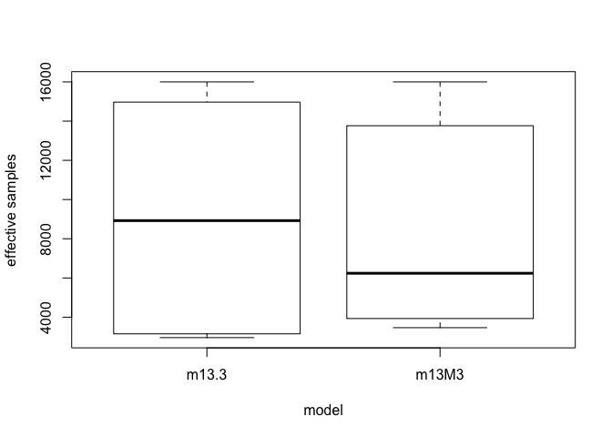

# Chapter-13-assignment-02
Ruijuan Li  
1/31/2017  


```r
# 13E3 When is it possible for a varying slopes model to have fewer effective parameters (as estimated by WAIC or DIC) than the corresponding model with fixed (unpooled) slopes? Explain.

# non-centered parameterizaiton? don't understand...  
```


```r
# 13M3. Re-estimate the varying slopes model for the UCBadmit data, now using a non-centered parameterization. Compare the efficiency of the forms of the model, using n_eff. Which is better? Which chain sampled faster? 

library(rethinking)
```

```
## Loading required package: rstan
```

```
## Warning: package 'rstan' was built under R version 3.2.5
```

```
## Loading required package: ggplot2
```

```
## Warning: package 'ggplot2' was built under R version 3.2.5
```

```
## Loading required package: StanHeaders
```

```
## Warning: package 'StanHeaders' was built under R version 3.2.5
```

```
## rstan (Version 2.14.1, packaged: 2016-12-28 14:55:41 UTC, GitRev: 5fa1e80eb817)
```

```
## For execution on a local, multicore CPU with excess RAM we recommend calling
## rstan_options(auto_write = TRUE)
## options(mc.cores = parallel::detectCores())
```

```
## Loading required package: parallel
```

```
## rethinking (Version 1.59)
```

```r
data("UCBadmit")
d <- UCBadmit
d$male <- ifelse(d$applicant.gender=="male", 1,0)
d$dept_id <- coerce_index(d$dept)

# model here  
m13M3 <- map2stan(
  alist(
    admit ~ dbinom(applications, p), 
    logit(p) <- a + a_dept[dept_id] + 
                bm_dept[dept_id]*male, 
    c(a_dept, bm_dept)[dept_id] ~ dmvnormNC(sigma_dept, Rho), # this line, wrong... 
    a ~ dnorm(0, 10), 
    sigma_dept ~ dcauchy(0,2),
    Rho ~ dlkjcorr(2)
  ), 
  data = d, warmup = 1000, iter = 5000, chains = 4, cores = 3)
```

```
## Warning: Variable 'applicant.gender' contains dots '.'.
## Will attempt to remove dots internally.
```

```
## In file included from file110e4b90188d.cpp:8:
## In file included from /Library/Frameworks/R.framework/Versions/3.2/Resources/library/StanHeaders/include/src/stan/model/model_header.hpp:4:
## In file included from /Library/Frameworks/R.framework/Versions/3.2/Resources/library/StanHeaders/include/stan/math.hpp:4:
## In file included from /Library/Frameworks/R.framework/Versions/3.2/Resources/library/StanHeaders/include/stan/math/rev/mat.hpp:4:
## In file included from /Library/Frameworks/R.framework/Versions/3.2/Resources/library/StanHeaders/include/stan/math/rev/core.hpp:12:
## In file included from /Library/Frameworks/R.framework/Versions/3.2/Resources/library/StanHeaders/include/stan/math/rev/core/gevv_vvv_vari.hpp:5:
## In file included from /Library/Frameworks/R.framework/Versions/3.2/Resources/library/StanHeaders/include/stan/math/rev/core/var.hpp:7:
## In file included from /Library/Frameworks/R.framework/Versions/3.2/Resources/library/BH/include/boost/math/tools/config.hpp:13:
## In file included from /Library/Frameworks/R.framework/Versions/3.2/Resources/library/BH/include/boost/config.hpp:39:
## /Library/Frameworks/R.framework/Versions/3.2/Resources/library/BH/include/boost/config/compiler/clang.hpp:196:11: warning: 'BOOST_NO_CXX11_RVALUE_REFERENCES' macro redefined [-Wmacro-redefined]
## #  define BOOST_NO_CXX11_RVALUE_REFERENCES
##           ^
## <command line>:6:9: note: previous definition is here
## #define BOOST_NO_CXX11_RVALUE_REFERENCES 1
##         ^
## In file included from file110e4b90188d.cpp:8:
## In file included from /Library/Frameworks/R.framework/Versions/3.2/Resources/library/StanHeaders/include/src/stan/model/model_header.hpp:4:
## In file included from /Library/Frameworks/R.framework/Versions/3.2/Resources/library/StanHeaders/include/stan/math.hpp:4:
## In file included from /Library/Frameworks/R.framework/Versions/3.2/Resources/library/StanHeaders/include/stan/math/rev/mat.hpp:4:
## In file included from /Library/Frameworks/R.framework/Versions/3.2/Resources/library/StanHeaders/include/stan/math/rev/core.hpp:42:
## /Library/Frameworks/R.framework/Versions/3.2/Resources/library/StanHeaders/include/stan/math/rev/core/set_zero_all_adjoints.hpp:14:17: warning: unused function 'set_zero_all_adjoints' [-Wunused-function]
##     static void set_zero_all_adjoints() {
##                 ^
## In file included from file110e4b90188d.cpp:8:
## In file included from /Library/Frameworks/R.framework/Versions/3.2/Resources/library/StanHeaders/include/src/stan/model/model_header.hpp:4:
## In file included from /Library/Frameworks/R.framework/Versions/3.2/Resources/library/StanHeaders/include/stan/math.hpp:4:
## In file included from /Library/Frameworks/R.framework/Versions/3.2/Resources/library/StanHeaders/include/stan/math/rev/mat.hpp:4:
## In file included from /Library/Frameworks/R.framework/Versions/3.2/Resources/library/StanHeaders/include/stan/math/rev/core.hpp:43:
## /Library/Frameworks/R.framework/Versions/3.2/Resources/library/StanHeaders/include/stan/math/rev/core/set_zero_all_adjoints_nested.hpp:17:17: warning: 'static' function 'set_zero_all_adjoints_nested' declared in header file should be declared 'static inline' [-Wunneeded-internal-declaration]
##     static void set_zero_all_adjoints_nested() {
##                 ^
## In file included from file110e4b90188d.cpp:8:
## In file included from /Library/Frameworks/R.framework/Versions/3.2/Resources/library/StanHeaders/include/src/stan/model/model_header.hpp:4:
## In file included from /Library/Frameworks/R.framework/Versions/3.2/Resources/library/StanHeaders/include/stan/math.hpp:4:
## In file included from /Library/Frameworks/R.framework/Versions/3.2/Resources/library/StanHeaders/include/stan/math/rev/mat.hpp:11:
## In file included from /Library/Frameworks/R.framework/Versions/3.2/Resources/library/StanHeaders/include/stan/math/prim/mat.hpp:60:
## /Library/Frameworks/R.framework/Versions/3.2/Resources/library/StanHeaders/include/stan/math/prim/mat/fun/autocorrelation.hpp:17:14: warning: function 'fft_next_good_size' is not needed and will not be emitted [-Wunneeded-internal-declaration]
##       size_t fft_next_good_size(size_t N) {
##              ^
## In file included from file110e4b90188d.cpp:8:
## In file included from /Library/Frameworks/R.framework/Versions/3.2/Resources/library/StanHeaders/include/src/stan/model/model_header.hpp:4:
## In file included from /Library/Frameworks/R.framework/Versions/3.2/Resources/library/StanHeaders/include/stan/math.hpp:4:
## In file included from /Library/Frameworks/R.framework/Versions/3.2/Resources/library/StanHeaders/include/stan/math/rev/mat.hpp:11:
## In file included from /Library/Frameworks/R.framework/Versions/3.2/Resources/library/StanHeaders/include/stan/math/prim/mat.hpp:299:
## In file included from /Library/Frameworks/R.framework/Versions/3.2/Resources/library/StanHeaders/include/stan/math/prim/arr.hpp:36:
## In file included from /Library/Frameworks/R.framework/Versions/3.2/Resources/library/StanHeaders/include/stan/math/prim/arr/functor/integrate_ode_rk45.hpp:13:
## In file included from /Library/Frameworks/R.framework/Versions/3.2/Resources/library/BH/include/boost/numeric/odeint.hpp:61:
## In file included from /Library/Frameworks/R.framework/Versions/3.2/Resources/library/BH/include/boost/numeric/odeint/util/multi_array_adaption.hpp:29:
## In file included from /Library/Frameworks/R.framework/Versions/3.2/Resources/library/BH/include/boost/multi_array.hpp:21:
## In file included from /Library/Frameworks/R.framework/Versions/3.2/Resources/library/BH/include/boost/multi_array/base.hpp:28:
## /Library/Frameworks/R.framework/Versions/3.2/Resources/library/BH/include/boost/multi_array/concept_checks.hpp:42:43: warning: unused typedef 'index_range' [-Wunused-local-typedef]
##       typedef typename Array::index_range index_range;
##                                           ^
## /Library/Frameworks/R.framework/Versions/3.2/Resources/library/BH/include/boost/multi_array/concept_checks.hpp:43:37: warning: unused typedef 'index' [-Wunused-local-typedef]
##       typedef typename Array::index index;
##                                     ^
## /Library/Frameworks/R.framework/Versions/3.2/Resources/library/BH/include/boost/multi_array/concept_checks.hpp:53:43: warning: unused typedef 'index_range' [-Wunused-local-typedef]
##       typedef typename Array::index_range index_range;
##                                           ^
## /Library/Frameworks/R.framework/Versions/3.2/Resources/library/BH/include/boost/multi_array/concept_checks.hpp:54:37: warning: unused typedef 'index' [-Wunused-local-typedef]
##       typedef typename Array::index index;
##                                     ^
## 8 warnings generated.
```

```
## Warning: There were 6 divergent transitions after warmup. Increasing adapt_delta above 0.8 may help. See
## http://mc-stan.org/misc/warnings.html#divergent-transitions-after-warmup
```

```
## Warning: Examine the pairs() plot to diagnose sampling problems
```

```
## 
## SAMPLING FOR MODEL 'admit ~ dbinom(applications, p)' NOW (CHAIN 1).
## WARNING: No variance estimation is
##          performed for num_warmup < 20
## 
## 
## Chain 1, Iteration: 1 / 1 [100%]  (Sampling)
##  Elapsed Time: 6e-06 seconds (Warm-up)
##                6.7e-05 seconds (Sampling)
##                7.3e-05 seconds (Total)
```

```
## Computing WAIC
```

```
## Constructing posterior predictions
```

```
## [ 1600 / 16000 ]
[ 3200 / 16000 ]
[ 4800 / 16000 ]
[ 6400 / 16000 ]
[ 8000 / 16000 ]
[ 9600 / 16000 ]
[ 11200 / 16000 ]
[ 12800 / 16000 ]
[ 14400 / 16000 ]
[ 16000 / 16000 ]
```

```
## Aggregated binomial counts detected. Splitting to 0/1 outcome for WAIC calculation.
```

```
## Warning in map2stan(alist(admit ~ dbinom(applications, p), logit(p) <- a + : There were 6 divergent iterations during sampling.
## Check the chains (trace plots, n_eff, Rhat) carefully to ensure they are valid.
```

```r
# model in the book 
m13.3 <- map2stan(
  alist(
    admit ~ dbinom(applications, p), 
    logit(p) <- a + a_dept[dept_id] + 
                bm_dept[dept_id]*male, 
    c(a_dept, bm_dept)[dept_id] ~ dmvnorm2(c(0, 0), sigma_dept, Rho), 
    a ~ dnorm(0, 10), 
    bm ~ dnorm(0,1), 
    sigma_dept ~ dcauchy(0,2),
    Rho ~ dlkjcorr(2)
  ), 
  data = d, warmup = 1000, iter = 5000, chains = 4, cores = 3)
```

```
## Warning: Variable 'applicant.gender' contains dots '.'.
## Will attempt to remove dots internally.
```

```
## In file included from file110e2ff82923.cpp:8:
## In file included from /Library/Frameworks/R.framework/Versions/3.2/Resources/library/StanHeaders/include/src/stan/model/model_header.hpp:4:
## In file included from /Library/Frameworks/R.framework/Versions/3.2/Resources/library/StanHeaders/include/stan/math.hpp:4:
## In file included from /Library/Frameworks/R.framework/Versions/3.2/Resources/library/StanHeaders/include/stan/math/rev/mat.hpp:4:
## In file included from /Library/Frameworks/R.framework/Versions/3.2/Resources/library/StanHeaders/include/stan/math/rev/core.hpp:12:
## In file included from /Library/Frameworks/R.framework/Versions/3.2/Resources/library/StanHeaders/include/stan/math/rev/core/gevv_vvv_vari.hpp:5:
## In file included from /Library/Frameworks/R.framework/Versions/3.2/Resources/library/StanHeaders/include/stan/math/rev/core/var.hpp:7:
## In file included from /Library/Frameworks/R.framework/Versions/3.2/Resources/library/BH/include/boost/math/tools/config.hpp:13:
## In file included from /Library/Frameworks/R.framework/Versions/3.2/Resources/library/BH/include/boost/config.hpp:39:
## /Library/Frameworks/R.framework/Versions/3.2/Resources/library/BH/include/boost/config/compiler/clang.hpp:196:11: warning: 'BOOST_NO_CXX11_RVALUE_REFERENCES' macro redefined [-Wmacro-redefined]
## #  define BOOST_NO_CXX11_RVALUE_REFERENCES
##           ^
## <command line>:6:9: note: previous definition is here
## #define BOOST_NO_CXX11_RVALUE_REFERENCES 1
##         ^
## In file included from file110e2ff82923.cpp:8:
## In file included from /Library/Frameworks/R.framework/Versions/3.2/Resources/library/StanHeaders/include/src/stan/model/model_header.hpp:4:
## In file included from /Library/Frameworks/R.framework/Versions/3.2/Resources/library/StanHeaders/include/stan/math.hpp:4:
## In file included from /Library/Frameworks/R.framework/Versions/3.2/Resources/library/StanHeaders/include/stan/math/rev/mat.hpp:4:
## In file included from /Library/Frameworks/R.framework/Versions/3.2/Resources/library/StanHeaders/include/stan/math/rev/core.hpp:42:
## /Library/Frameworks/R.framework/Versions/3.2/Resources/library/StanHeaders/include/stan/math/rev/core/set_zero_all_adjoints.hpp:14:17: warning: unused function 'set_zero_all_adjoints' [-Wunused-function]
##     static void set_zero_all_adjoints() {
##                 ^
## In file included from file110e2ff82923.cpp:8:
## In file included from /Library/Frameworks/R.framework/Versions/3.2/Resources/library/StanHeaders/include/src/stan/model/model_header.hpp:4:
## In file included from /Library/Frameworks/R.framework/Versions/3.2/Resources/library/StanHeaders/include/stan/math.hpp:4:
## In file included from /Library/Frameworks/R.framework/Versions/3.2/Resources/library/StanHeaders/include/stan/math/rev/mat.hpp:4:
## In file included from /Library/Frameworks/R.framework/Versions/3.2/Resources/library/StanHeaders/include/stan/math/rev/core.hpp:43:
## /Library/Frameworks/R.framework/Versions/3.2/Resources/library/StanHeaders/include/stan/math/rev/core/set_zero_all_adjoints_nested.hpp:17:17: warning: 'static' function 'set_zero_all_adjoints_nested' declared in header file should be declared 'static inline' [-Wunneeded-internal-declaration]
##     static void set_zero_all_adjoints_nested() {
##                 ^
## In file included from file110e2ff82923.cpp:8:
## In file included from /Library/Frameworks/R.framework/Versions/3.2/Resources/library/StanHeaders/include/src/stan/model/model_header.hpp:4:
## In file included from /Library/Frameworks/R.framework/Versions/3.2/Resources/library/StanHeaders/include/stan/math.hpp:4:
## In file included from /Library/Frameworks/R.framework/Versions/3.2/Resources/library/StanHeaders/include/stan/math/rev/mat.hpp:11:
## In file included from /Library/Frameworks/R.framework/Versions/3.2/Resources/library/StanHeaders/include/stan/math/prim/mat.hpp:60:
## /Library/Frameworks/R.framework/Versions/3.2/Resources/library/StanHeaders/include/stan/math/prim/mat/fun/autocorrelation.hpp:17:14: warning: function 'fft_next_good_size' is not needed and will not be emitted [-Wunneeded-internal-declaration]
##       size_t fft_next_good_size(size_t N) {
##              ^
## In file included from file110e2ff82923.cpp:8:
## In file included from /Library/Frameworks/R.framework/Versions/3.2/Resources/library/StanHeaders/include/src/stan/model/model_header.hpp:4:
## In file included from /Library/Frameworks/R.framework/Versions/3.2/Resources/library/StanHeaders/include/stan/math.hpp:4:
## In file included from /Library/Frameworks/R.framework/Versions/3.2/Resources/library/StanHeaders/include/stan/math/rev/mat.hpp:11:
## In file included from /Library/Frameworks/R.framework/Versions/3.2/Resources/library/StanHeaders/include/stan/math/prim/mat.hpp:299:
## In file included from /Library/Frameworks/R.framework/Versions/3.2/Resources/library/StanHeaders/include/stan/math/prim/arr.hpp:36:
## In file included from /Library/Frameworks/R.framework/Versions/3.2/Resources/library/StanHeaders/include/stan/math/prim/arr/functor/integrate_ode_rk45.hpp:13:
## In file included from /Library/Frameworks/R.framework/Versions/3.2/Resources/library/BH/include/boost/numeric/odeint.hpp:61:
## In file included from /Library/Frameworks/R.framework/Versions/3.2/Resources/library/BH/include/boost/numeric/odeint/util/multi_array_adaption.hpp:29:
## In file included from /Library/Frameworks/R.framework/Versions/3.2/Resources/library/BH/include/boost/multi_array.hpp:21:
## In file included from /Library/Frameworks/R.framework/Versions/3.2/Resources/library/BH/include/boost/multi_array/base.hpp:28:
## /Library/Frameworks/R.framework/Versions/3.2/Resources/library/BH/include/boost/multi_array/concept_checks.hpp:42:43: warning: unused typedef 'index_range' [-Wunused-local-typedef]
##       typedef typename Array::index_range index_range;
##                                           ^
## /Library/Frameworks/R.framework/Versions/3.2/Resources/library/BH/include/boost/multi_array/concept_checks.hpp:43:37: warning: unused typedef 'index' [-Wunused-local-typedef]
##       typedef typename Array::index index;
##                                     ^
## /Library/Frameworks/R.framework/Versions/3.2/Resources/library/BH/include/boost/multi_array/concept_checks.hpp:53:43: warning: unused typedef 'index_range' [-Wunused-local-typedef]
##       typedef typename Array::index_range index_range;
##                                           ^
## /Library/Frameworks/R.framework/Versions/3.2/Resources/library/BH/include/boost/multi_array/concept_checks.hpp:54:37: warning: unused typedef 'index' [-Wunused-local-typedef]
##       typedef typename Array::index index;
##                                     ^
## 8 warnings generated.
```

```
## Warning: There were 1 divergent transitions after warmup. Increasing adapt_delta above 0.8 may help. See
## http://mc-stan.org/misc/warnings.html#divergent-transitions-after-warmup

## Warning: Examine the pairs() plot to diagnose sampling problems
```

```
## 
## SAMPLING FOR MODEL 'admit ~ dbinom(applications, p)' NOW (CHAIN 1).
## WARNING: No variance estimation is
##          performed for num_warmup < 20
## 
## 
## Chain 1, Iteration: 1 / 1 [100%]  (Sampling)
##  Elapsed Time: 3e-06 seconds (Warm-up)
##                8.5e-05 seconds (Sampling)
##                8.8e-05 seconds (Total)
```

```
## Computing WAIC
## Constructing posterior predictions
```

```
## [ 1600 / 16000 ]
[ 3200 / 16000 ]
[ 4800 / 16000 ]
[ 6400 / 16000 ]
[ 8000 / 16000 ]
[ 9600 / 16000 ]
[ 11200 / 16000 ]
[ 12800 / 16000 ]
[ 14400 / 16000 ]
[ 16000 / 16000 ]
```

```
## Aggregated binomial counts detected. Splitting to 0/1 outcome for WAIC calculation.
```

```
## Warning in map2stan(alist(admit ~ dbinom(applications, p), logit(p) <- a + : There were 1 divergent iterations during sampling.
## Check the chains (trace plots, n_eff, Rhat) carefully to ensure they are valid.
```

```r
precis(m13.3, depth = 2)
```

```
## Warning in precis(m13.3, depth = 2): There were 1 divergent iterations during sampling.
## Check the chains (trace plots, n_eff, Rhat) carefully to ensure they are valid.
```

```
##                Mean StdDev lower 0.89 upper 0.89 n_eff Rhat
## bm_dept[1]    -0.72   0.28      -1.15      -0.25  7990    1
## bm_dept[2]    -0.14   0.30      -0.63       0.33 11703    1
## bm_dept[3]     0.10   0.13      -0.11       0.31 15195    1
## bm_dept[4]    -0.07   0.14      -0.29       0.15 15204    1
## bm_dept[5]     0.15   0.18      -0.13       0.42 14744    1
## bm_dept[6]    -0.06   0.25      -0.45       0.36 12082    1
## a_dept[1]      1.91   0.72       0.85       3.06  3184    1
## a_dept[2]      1.34   0.75       0.22       2.52  3292    1
## a_dept[3]      0.02   0.68      -1.05       1.01  2970    1
## a_dept[4]      0.04   0.68      -0.96       1.11  3007    1
## a_dept[5]     -0.47   0.68      -1.49       0.58  3020    1
## a_dept[6]     -1.96   0.69      -2.99      -0.91  3117    1
## a             -0.67   0.67      -1.69       0.34  2958    1
## bm             0.00   1.01      -1.58       1.61 15798    1
## sigma_dept[1]  1.65   0.63       0.80       2.42  6628    1
## sigma_dept[2]  0.46   0.23       0.13       0.76  7299    1
## Rho[1,1]       1.00   0.00       1.00       1.00 16000  NaN
## Rho[1,2]      -0.32   0.35      -0.87       0.20  9860    1
## Rho[2,1]      -0.32   0.35      -0.87       0.20  9860    1
## Rho[2,2]       1.00   0.00       1.00       1.00 16000    1
```

```r
precis(m13M3, depth = 2)
```

```
## Warning in precis(m13M3, depth = 2): There were 6 divergent iterations during sampling.
## Check the chains (trace plots, n_eff, Rhat) carefully to ensure they are valid.
```

```
##                   Mean StdDev lower 0.89 upper 0.89 n_eff Rhat
## z_N_dept_id[1,1]  1.28   0.55       0.39       2.15  3993    1
## z_N_dept_id[1,2]  0.90   0.50       0.12       1.73  4109    1
## z_N_dept_id[1,3]  0.00   0.38      -0.61       0.60  3804    1
## z_N_dept_id[1,4]  0.02   0.38      -0.60       0.63  3822    1
## z_N_dept_id[1,5] -0.33   0.40      -0.95       0.33  3952    1
## z_N_dept_id[1,6] -1.34   0.58      -2.22      -0.40  4409    1
## z_N_dept_id[2,1] -1.45   0.75      -2.62      -0.24  7771    1
## z_N_dept_id[2,2]  0.04   0.78      -1.24       1.26 11560    1
## z_N_dept_id[2,3]  0.34   0.48      -0.40       1.10  9470    1
## z_N_dept_id[2,4] -0.14   0.47      -0.86       0.62  9625    1
## z_N_dept_id[2,5]  0.33   0.57      -0.60       1.20 11807    1
## z_N_dept_id[2,6] -0.62   0.77      -1.90       0.54 10417    1
## L_Rho[1,1]        1.00   0.00       1.00       1.00 16000  NaN
## L_Rho[1,2]        0.00   0.00       0.00       0.00 16000  NaN
## L_Rho[2,1]       -0.31   0.36      -0.90       0.19  6240    1
## L_Rho[2,2]        0.87   0.14       0.67       1.00  6586    1
## a                -0.66   0.64      -1.68       0.33  3466    1
## sigma_dept[1]     1.63   0.58       0.82       2.38  4121    1
## sigma_dept[2]     0.45   0.22       0.14       0.77  4988    1
## a_dept[1]         1.90   0.70       0.81       2.99  3762    1
## a_dept[2]         1.32   0.73       0.22       2.51  3913    1
## a_dept[3]         0.01   0.65      -0.98       1.05  3506    1
## a_dept[4]         0.03   0.65      -0.98       1.04  3521    1
## a_dept[5]        -0.48   0.66      -1.50       0.55  3530    1
## a_dept[6]        -1.97   0.66      -2.97      -0.91  3778    1
## bm_dept[1]       -0.72   0.28      -1.15      -0.27  8080    1
## bm_dept[2]       -0.13   0.31      -0.61       0.36 16000    1
## bm_dept[3]        0.10   0.13      -0.11       0.32 16000    1
## bm_dept[4]       -0.07   0.14      -0.29       0.15 16000    1
## bm_dept[5]        0.15   0.17      -0.12       0.44 16000    1
## bm_dept[6]       -0.06   0.26      -0.48       0.34 16000    1
## Rho[1,1]          1.00   0.00       1.00       1.00 16000  NaN
## Rho[1,2]         -0.31   0.36      -0.90       0.19  6240    1
## Rho[2,1]         -0.31   0.36      -0.90       0.19  6240    1
## Rho[2,2]          1.00   0.00       1.00       1.00 15726    1
```

```r
compare(m13.3, m13M3) # two exatly same model??? 
```

```
##         WAIC pWAIC dWAIC weight    SE  dSE
## m13.3 5191.1  10.8   0.0   0.53 57.20   NA
## m13M3 5191.4  10.9   0.2   0.47 57.17 0.12
```

```r
neff_c <- precis(m13.3, 2)@output$n_eff # don't understand this code, discuss with Julin  
```

```
## Warning in precis(m13.3, 2): There were 1 divergent iterations during sampling.
## Check the chains (trace plots, n_eff, Rhat) carefully to ensure they are valid.
```

```r
neff_nc <- precis(m13M3,2)@output$n_eff
```

```
## Warning in precis(m13M3, 2): There were 6 divergent iterations during sampling.
## Check the chains (trace plots, n_eff, Rhat) carefully to ensure they are valid.
```

```r
# plot distributions 
boxplot(list('m13.3'=neff_c, 'm13M3'=neff_nc),
        ylab="effective samples", xlab="model") # I got higher numbers of n_eff in the one w/o non-centered parameterization.  
```

<!-- -->

```r
WAIC(m13M3)
```

```
## [1] 5191.382
## attr(,"lppd")
## [1] -2584.804
## attr(,"pWAIC")
## [1] 10.88687
## attr(,"se")
## [1] 57.16775
```

```r
WAIC(m13.3) 
```

```
## [1] 5191.139
## attr(,"lppd")
## [1] -2584.767
## attr(,"pWAIC")
## [1] 10.80306
## attr(,"se")
## [1] 57.202
```
