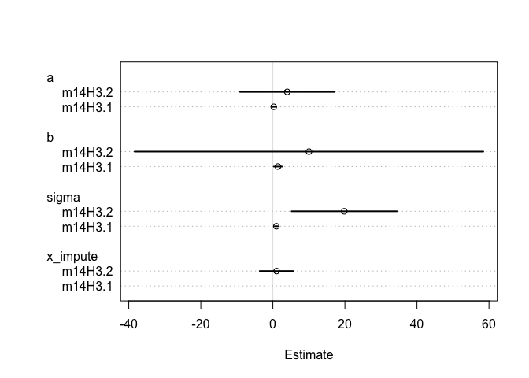

# Chapter-14-assignment-02
Ruijuan Li  
3/3/2017  

# 14E2

```r
# Rewrite the same model so that it allows imputation of missing values for log population. There aren't any missing values in the variable, but you can still write down a model formula that would imply imputation, if any values were missing. 

library(rethinking)
```

```
## Loading required package: rstan
```

```
## Warning: package 'rstan' was built under R version 3.2.5
```

```
## Loading required package: ggplot2
```

```
## Warning: package 'ggplot2' was built under R version 3.2.5
```

```
## Loading required package: StanHeaders
```

```
## Warning: package 'StanHeaders' was built under R version 3.2.5
```

```
## rstan (Version 2.14.1, packaged: 2016-12-28 14:55:41 UTC, GitRev: 5fa1e80eb817)
```

```
## For execution on a local, multicore CPU with excess RAM we recommend calling
## rstan_options(auto_write = TRUE)
## options(mc.cores = parallel::detectCores())
```

```
## Loading required package: parallel
```

```
## rethinking (Version 1.59)
```

```r
data("Kline")
d <- Kline
d$log_pop <- log(d$population)
mean(d$log_pop) # 8.9
```

```
## [1] 8.977005
```

```r
sd(d$log_pop) # 1.5
```

```
## [1] 1.52844
```

```r
# Ti ~ Poisson(ui)  
# logui = a + b*logPi
# logpi ~ Normal(v, sigma)
# a ~ Normal(0, 10)
# b ~ Normal(0, 1) 
# v ~ Normal(9, 5) # how to determine stdv  
# sigma ~ Cauchy(0, 1)  
```

# 14M1

```r
# Using the mathematical form of the imputation model in the chapter, explain what is being assumed about how the missing values were generated. 

# it assumes that the missing data has the same kind of distribution (same mean & stdv) as the data present. 
```

# 14M2

```r
# In earlier chapters, we threw away cases from the primate milk data, so we could use the neocortex variable. Now repeat the WAIC model comparison example from Chapter 6, but use imputation on the neocortex variable so that you can include all of the cases in the original data. The simplest form of imputation is acceptable. How are the model comparison results affected by being able to include all of the cases? 

library(rethinking)
data("milk")
d <- milk
d$neocortex.prop <- d$neocortex.perc / 100
d$logmass <- log(d$mass)

# prep data 
data_list <- list(
  kcal = d$kcal.per.g, 
  neocortex = d$neocortex.prop,  
  logmass = d$logmass
)

# fit the model 
# m14M1 <- map2stan(
#   alist(
#     kcal ~ dnorm(mu, sigma), 
#     mu <- dnorm(0, 100), 
#     sigma ~ dcauchy(0, 1)
#   ), 
#   data = data_list, iter = 1e4, chains = 2
# ) 
# 
# m14M2 <- map2stan(
#   alist(
#     kcal ~ dnorm(mu, sigma), 
#     mu <- a + bN*neocortex, 
#     neocortex ~ dnorm(nu, sigma_N), 
#     a ~ dnorm(0, 100), 
#     bN ~ dnorm(0, 10), 
#     nu ~ dnorm(0.5, 1), # why pick 0.5? based on the mean, how to determine the prior of stddev??? 
#     sigma_N ~ dcauchy(0, 1), 
#     sigma ~ dcauchy(0, 1)
#   ), 
#   data = data_list, iter = 1e4, chains = 2
# )
# 
# m14M3 <- map2stan(
#   alist(
#     kcal ~ dnorm(mu, sigma), 
#     mu <- a + bM*logmass, 
#     a ~ dnorm(0, 100), 
#     bM ~ dnorm(0, 10), 
#     sigma ~ dcauchy(0, 1)
#   ), 
#   data = data_list, iter = 1e4, chains = 2
# )
# 
# m14M4 <- map2stan(
#   alist(
#     kcal ~ dnorm(mu, sigma), 
#     mu <- a + bN*neocortex + bM*logmass, 
#     neocortex ~ dnorm(nu, sigma_N), 
#     a ~ dnorm(0, 100), 
#     c(bN, bM) ~ dnorm(0, 10), 
#     nu ~ dnorm(0.5, 1), # why pick 0.5? based on the mean, how to determine the prior of stddev??? 
#     sigma_N ~ dcauchy(0, 1), 
#     sigma ~ dcauchy(0, 1)
#   ), 
#   data = data_list, iter = 1e4, chains = 2
# )

# save(m14M1, file = "~/Desktop/2017_winter/Rclub-rethinking_Ruijuan.Li/Assignment_Chapter_14/m14M1.Rdta")
# save(m14M2, file = "~/Desktop/2017_winter/Rclub-rethinking_Ruijuan.Li/Assignment_Chapter_14/m14M2.Rdta")
# save(m14M3, file = "~/Desktop/2017_winter/Rclub-rethinking_Ruijuan.Li/Assignment_Chapter_14/m14M3.Rdta")
# save(m14M4, file = "~/Desktop/2017_winter/Rclub-rethinking_Ruijuan.Li/Assignment_Chapter_14/m14M4.Rdta") 

load("~/Desktop/2017_winter/Rclub-rethinking_Ruijuan.Li/Assignment_Chapter_14/m14M1.Rdta")
load("~/Desktop/2017_winter/Rclub-rethinking_Ruijuan.Li/Assignment_Chapter_14/m14M2.Rdta")
load("~/Desktop/2017_winter/Rclub-rethinking_Ruijuan.Li/Assignment_Chapter_14/m14M3.Rdta")
load("~/Desktop/2017_winter/Rclub-rethinking_Ruijuan.Li/Assignment_Chapter_14/m14M4.Rdta")

(milk.models <- compare(m14M2, m14M3, m14M4))
```

```
##        WAIC pWAIC dWAIC weight   SE  dSE
## m14M4 -29.6   6.1   0.0   0.97 5.53   NA
## m14M3 -22.5   2.1   7.2   0.03 5.70 3.04
## m14M2 -19.4   2.6  10.2   0.01 5.02 4.76
```

```r
#        WAIC pWAIC dWAIC weight   SE  dSE
# m14M4 -29.6   6.1   0.0   0.97 5.53   NA
# m14M3 -22.5   2.1   7.2   0.03 5.70 3.04
# m14M2 -19.4   2.6  10.2   0.01 5.02 4.76


#        WAIC pWAIC dWAIC weight   SE  dSE
# m6.14 -15.1   4.8   0.0   0.93 7.72   NA
# m6.13  -8.4   2.8   6.7   0.03 5.47 5.39
# m6.11  -8.1   1.9   7.0   0.03 4.59 7.37
# m6.12  -6.5   2.8   8.6   0.01 4.26 7.70

# still the last one is best one, any effect??? 
```

# 14H3 

```r
# The fact that information flows in all directions among parameters sometimes leads to rather unintuitive conclusions. Here's an example from missing data imputation, in which imputation of a single datum reverses the direction of an inferred relationship. Use these data: 

library(rethinking)
set.seed(100)
x <- c(rnorm(10), NA)
y <- c(rnorm(10, x), 100)
d <- list(x=x, y=y)

# These data comprise 11 cases, one of which has a missing predictor value. You can quickly confirm that a regression of y on x for only the complete cases indicates a strong positive relationship between the two variables. But now fit this model, imputing the one missing value for x: 

d.df <- as.data.frame(d)
dcc.df <- d.df[complete.cases(d.df),]
dcc.df
```

```
##              x          y
## 1  -0.50219235 -0.4123062
## 2   0.13153117  0.2278056
## 3  -0.07891709 -0.2805510
## 4   0.88678481  1.6266253
## 5   0.11697127  0.2403508
## 6   0.31863009  0.2893134
## 7  -0.58179068 -0.9706449
## 8   0.71453271  1.2253890
## 9  -0.82525943 -1.7390736
## 10 -0.35986213  1.9504347
```

```r
# m14H3.1 <- map2stan(
#   alist(
#     y ~ dnorm(mu, sigma), 
#     mu <- a + b*x, 
#     a ~ dnorm(0, 100), 
#     b ~ dnorm(0, 100), 
#     sigma ~ dcauchy(0, 1)
#   ), 
#   data = dcc.df, iter = 1e4, chains = 2
# )
# save(m14H3.1, file = "~/Desktop/2017_winter/Rclub-rethinking_Ruijuan.Li/Assignment_Chapter_14/m14H3.1.Rdata")
load("~/Desktop/2017_winter/Rclub-rethinking_Ruijuan.Li/Assignment_Chapter_14/m14H3.1.Rdata") 

# m14H3.2 <- map2stan(
#   alist(
#     y ~ dnorm(mu, sigma), 
#     mu <- a + b*x, 
#     x ~ dnorm(0, 1), 
#     a ~ dnorm(0, 100), 
#     b ~ dnorm(0, 100), 
#     sigma ~ dcauchy(0, 1)
#   ), 
#   data = d, iter = 1e4, chains = 2
# )
# 
# save(m14H3.2, file = "~/Desktop/2017_winter/Rclub-rethinking_Ruijuan.Li/Assignment_Chapter_14/m14H3.2.Rdata")
load("~/Desktop/2017_winter/Rclub-rethinking_Ruijuan.Li/Assignment_Chapter_14/m14H3.2.Rdata") 

# What has happened to the posterior distribution of β? Be sure to inspect the full density. Can you explain the change in inference? 

precis(m14H3.1) # all positive association 
```

```
##       Mean StdDev lower 0.89 upper 0.89 n_eff Rhat
## a     0.24   0.32      -0.26       0.75  7809    1
## b     1.41   0.59       0.47       2.31  8281    1
## sigma 0.97   0.26       0.59       1.32  5951    1
```

```r
precis(m14H3.2) 
```

```
## Warning in precis(m14H3.2): There were 191 divergent iterations during sampling.
## Check the chains (trace plots, n_eff, Rhat) carefully to ensure they are valid.
```

```
##           Mean StdDev lower 0.89 upper 0.89 n_eff Rhat
## x_impute  1.03   2.39      -3.01       3.97   234    1
## a         3.98   6.68      -6.22      14.44  2263    1
## b        10.02  24.70     -31.60      37.10   266    1
## sigma    19.82   7.46       9.61      30.59   853    1
```

```r
plot(coeftab(m14H3.1, m14H3.2))
```

<!-- -->

```r
# Why? 
d
```

```
## $x
##  [1] -0.50219235  0.13153117 -0.07891709  0.88678481  0.11697127
##  [6]  0.31863009 -0.58179068  0.71453271 -0.82525943 -0.35986213
## [11]          NA
## 
## $y
##  [1]  -0.4123062   0.2278056  -0.2805510   1.6266253   0.2403508
##  [6]   0.2893134  -0.9706449   1.2253890  -1.7390736   1.9504347
## [11] 100.0000000
```

```r
dcc.df
```

```
##              x          y
## 1  -0.50219235 -0.4123062
## 2   0.13153117  0.2278056
## 3  -0.07891709 -0.2805510
## 4   0.88678481  1.6266253
## 5   0.11697127  0.2403508
## 6   0.31863009  0.2893134
## 7  -0.58179068 -0.9706449
## 8   0.71453271  1.2253890
## 9  -0.82525943 -1.7390736
## 10 -0.35986213  1.9504347
```

```r
plot(dcc.df$x, dcc.df$y)
```

<!-- -->

```r
# because when excluding the missing predictor, its assocaited outcome was also excluded, that makes the association appear to be positive, but when including that missing data and assume a similar datapoint as the present data, the correlation will be "skewed" by the very large outcome datapoint.
```


